# Breakout Trading Bot Design Document

## Overview

This document outlines the design for a sophisticated breakout trading bot system built in Python 3.11+. The bot implements range breakout strategies after volatility compression on cryptocurrency exchanges using CCXT. The system supports both paper trading and live trading modes with four distinct trading presets targeting different market segments.

### Core Objectives
- Detect and trade range breakouts after volatility compression
- Support multiple trading strategies through configurable presets
- Provide robust risk management and position sizing
- Enable both paper trading and live trading capabilities
- Implement comprehensive monitoring and logging

### Trading Presets
1. **breakout_v1**: Base strategy for liquid pairs
2. **smallcap_top_gainers**: Target high-growth small-cap tokens (long)
3. **smallcap_top_losers**: Target declining small-cap tokens (short)
4. **high_liquidity_top30**: Focus on top 30 pairs by volume/OI

## Technology Stack & Dependencies

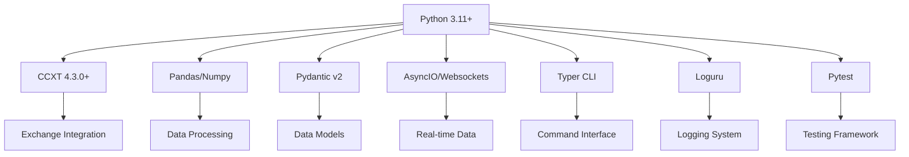

### Key Dependencies
- **ccxt>=4.3.0**: Exchange connectivity and trading
- **pandas, numpy**: Data manipulation and calculations
- **pydantic>=2**: Data validation and models
- **aiohttp, asyncio, websockets**: Async operations
- **python-dotenv, typer[all], rich, loguru**: Configuration and CLI
- **pandas_ta**: Technical analysis indicators
- **pytest, pytest-asyncio**: Testing framework

## Architecture

### System Components Overview

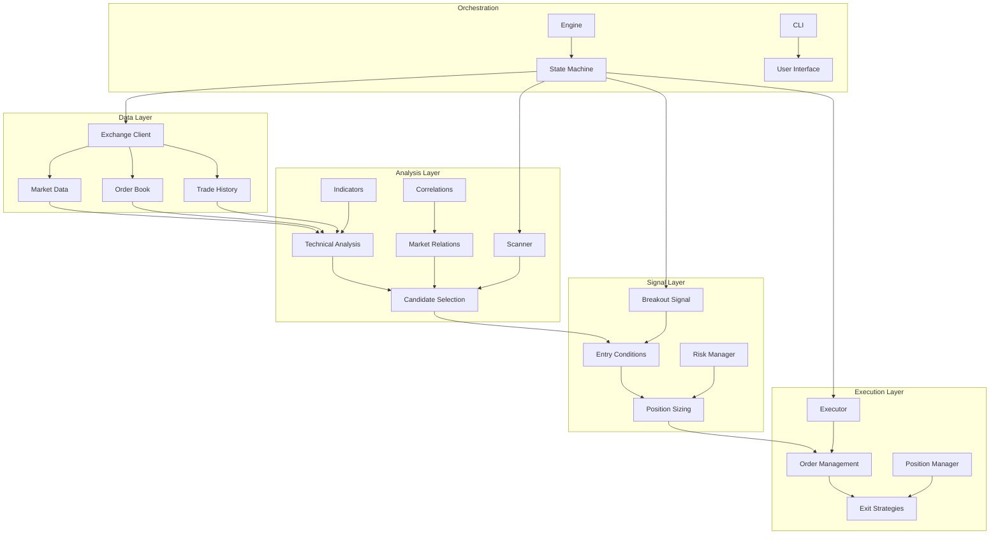

### Core Models (Pydantic)

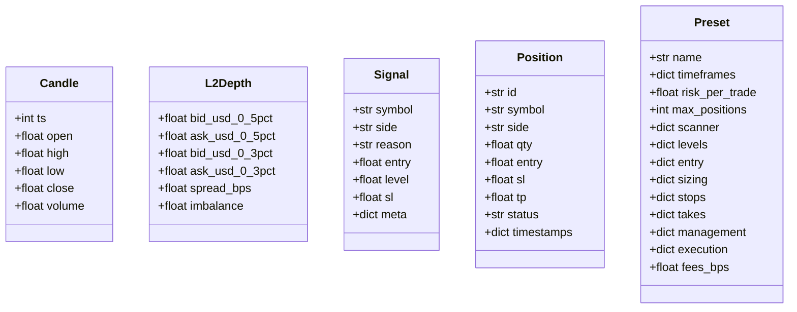

## Data Layer Architecture

### Exchange Client (data/exchange_ccxt.py)

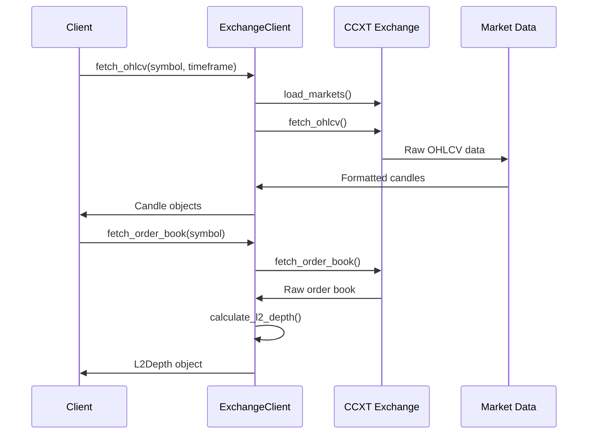

#### Key Responsibilities
- **Market Data Fetching**: OHLCV data with configurable timeframes
- **Order Book Analysis**: Calculate depth metrics and spread analysis
- **Trade Flow Monitoring**: Recent trades for volume surge detection
- **Order Management**: Create limit, market, and stop-limit orders
- **Paper Trading Simulation**: Fill simulation with slippage modeling

#### L2Depth Calculation
- Extract bid/ask depths at 0.3% and 0.5% price levels
- Calculate spread in basis points
- Compute order book imbalance ratio
- Validate minimum depth requirements per preset

## Features Layer

### Technical Indicators (features/indicators.py)

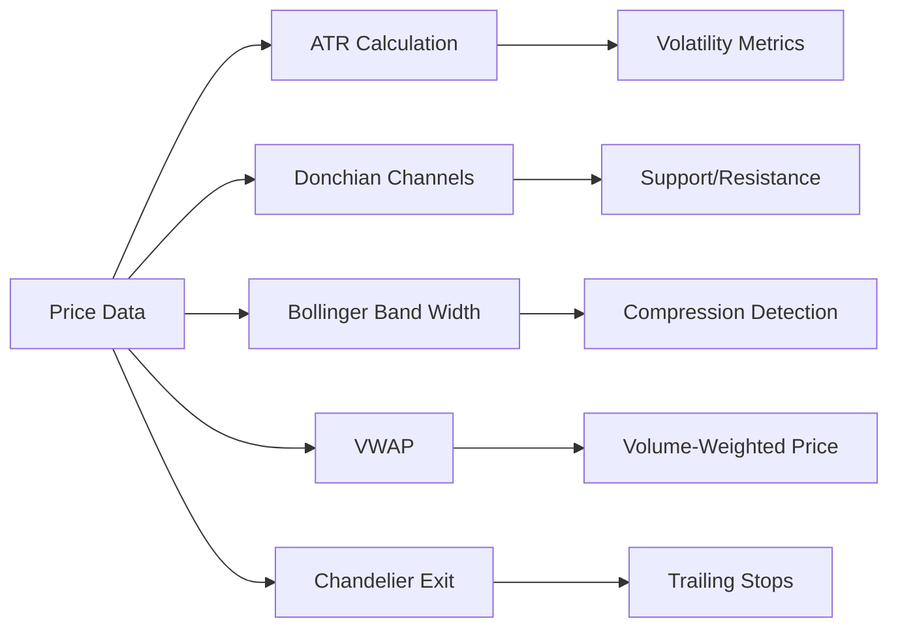

#### Core Indicators Implementation
- **ATR (Average True Range)**: EMA-based volatility measurement
- **Donchian Channels**: Highest high and lowest low over N periods
- **Bollinger Band Width**: Volatility compression indicator
- **VWAP**: Volume-weighted average price from candle data
- **Chandelier Exit**: ATR-based trailing stop mechanism

### Correlation Analysis (features/correlations.py)

```mermaid
graph TD
    A[Symbol Returns 15m] --> C[Correlation Engine]
    B[BTC Returns 15m] --> C
    C --> D[Rolling Window 3d]
    D --> E[Correlation Coefficient]
    E --> F[Filter: |r| ≤ threshold]
```

## Scanner Architecture

### Breakout Scanner (scanner/breakout_scanner.py)

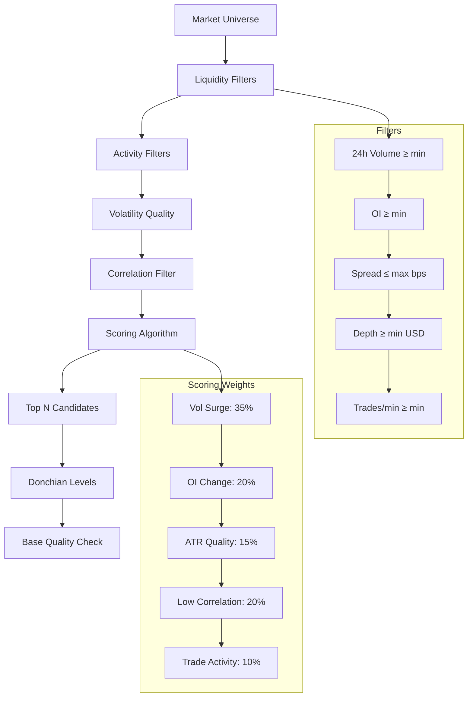

#### Filtering Logic
1. **Liquidity Filters**: Volume, open interest, spread, depth, trade frequency
2. **Activity Filters**: Volume surge (1h, 5m), OI delta
3. **Volatility Quality**: ATR percentage bounds, Bollinger Band width percentile
4. **Correlation Filter**: Absolute correlation with BTC within limits

#### Scoring Formula
```
Score = 0.35 × z(vol_surge) + 0.20 × z(oi_change) + 0.15 × z(atr_quality) 
        + 0.20 × z(-abs(correlation)) + 0.10 × z(trades_per_min)
```

## Signal Generation

### Breakout Signal Logic (signals/breakout_signal.py)

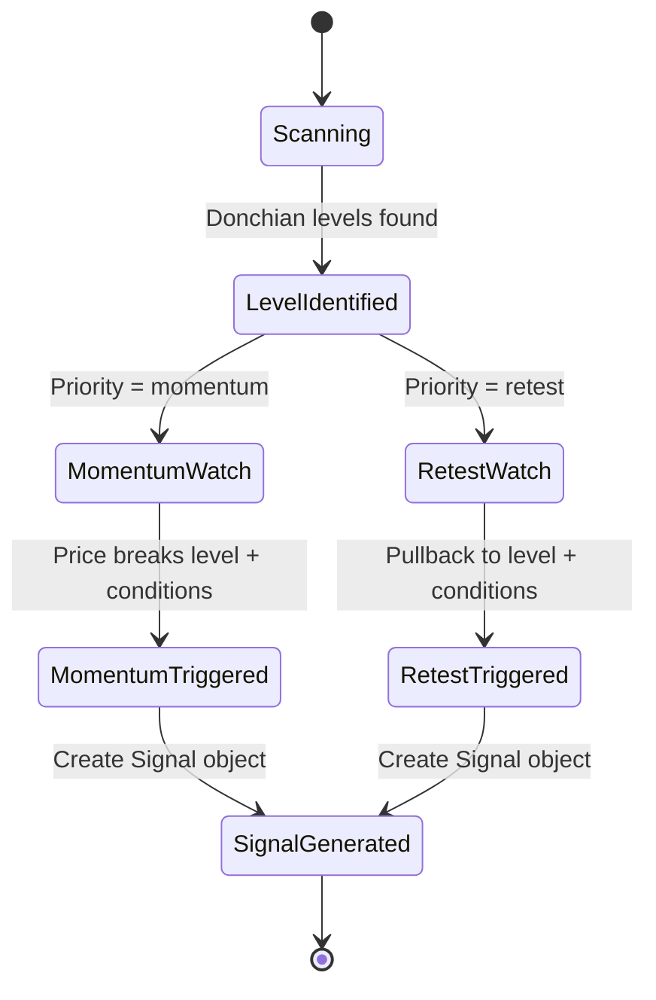

#### Momentum Entry (Primary for Liquid Markets)
- **Trigger**: Close > Level × (1 + ε)
- **Volume**: ≥ k × median_5m
- **Body Size**: ≥ 50% of candle range
- **L2 Imbalance**: ≥ minimum threshold
- **VWAP Gap**: ≤ maximum percentage
- **Order Type**: Stop-limit with offset

#### Retest Entry (Priority for Small-cap)
- **Setup**: Previous breakout occurred
- **Trigger**: First pullback to level
- **Entry**: Limit order at level with pierce tolerance
- **Validation**: L2 imbalance ≥ 0.60 and trade activity maintained
- **Window**: Time-limited opportunity

## Risk Management

### Position Sizing (risk/risk_manager.py)

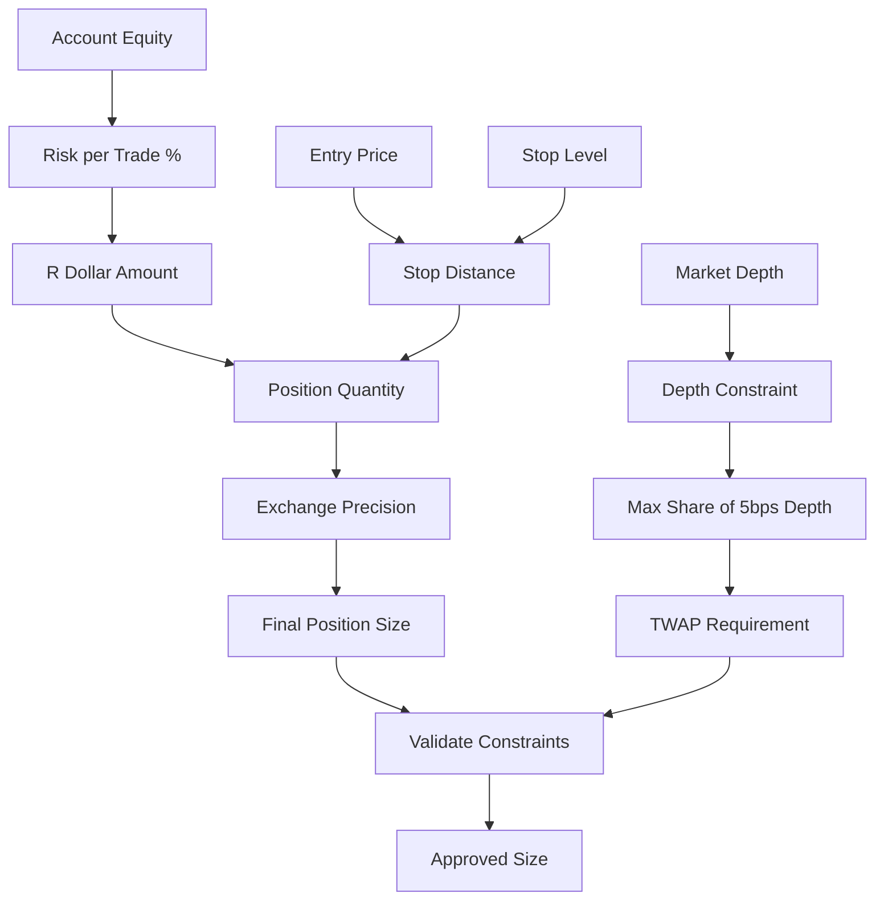

#### Sizing Algorithm
1. **R-Model**: R_dollar = equity × risk_per_trade
2. **Quantity**: position_qty = R_dollar / stop_distance
3. **Precision**: Round to exchange amount steps
4. **Depth Limit**: Maximum percentage of available depth
5. **TWAP**: Split large orders across time

### Stop Loss Strategy (management/position_manager.py)

```mermaid
graph LR
    A[Entry Type] --> B{Momentum or Retest?}
    B -->|Momentum| C[SL = max(swing_low, entry - 1.2×ATR)]
    B -->|Retest| D[SL = level - 1.0×ATR]
    
    E[Time-based Stops] --> F[20-30 min limit]
    G[Panic Exit] --> H[ATR(1m) multiplier trigger]
    
    C --> I[Active Stop Management]
    D --> I
    F --> I
    H --> I
```

### Take Profit Strategy

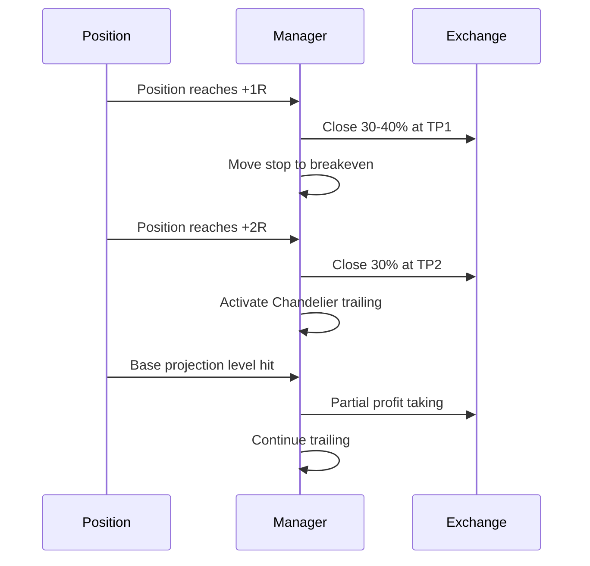

#### Multi-level Exit Strategy
- **TP1**: +1R (30-40% position), move stop to breakeven
- **TP2**: +2R (30% position), activate Chandelier trailing
- **Projection**: Base height projection for additional exits
- **Trailing**: Chandelier exit with 2.5-2.8 × ATR(5m)

## Execution Layer

### Order Execution (execution/executor.py)

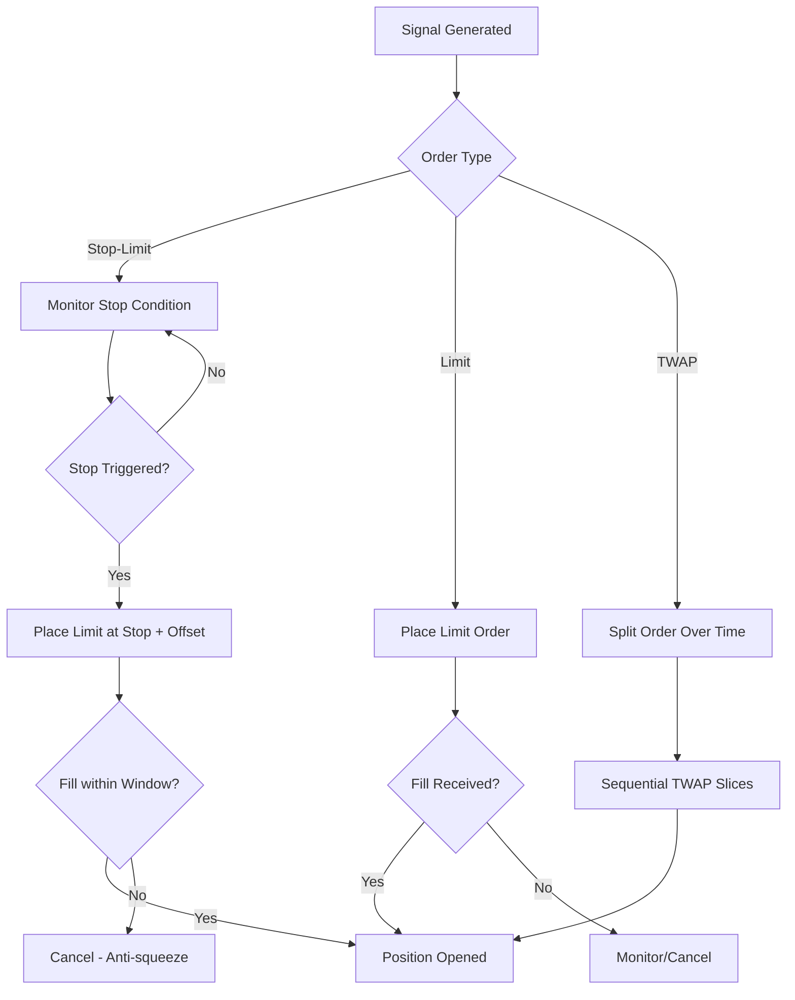

#### Paper Trading Simulation
- **Fill Logic**: Simulate fills based on bid/ask spread
- **Slippage Model**: a + b × |qty|/depth
- **Latency Simulation**: Add realistic execution delays
- **Market Impact**: Adjust fill prices based on order size

## Orchestration Engine

### State Machine (orchestra/engine.py)

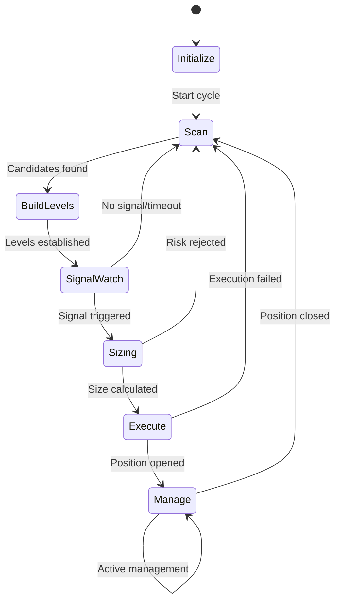

#### Engine Responsibilities
- **Cycle Management**: Coordinate scan → signal → execute workflow
- **Position Slots**: Limit concurrent positions per preset
- **Collision Avoidance**: Prevent scanning of symbols with open positions
- **State Persistence**: Maintain state across restarts
- **Error Handling**: Graceful degradation and recovery

## Preset Configuration

### Configuration Hierarchy

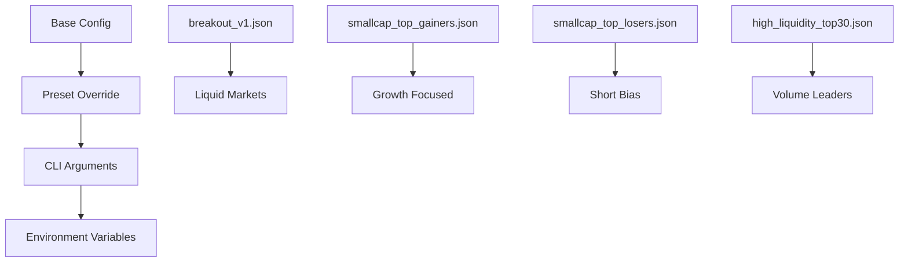

### Preset Specifications

| Parameter | breakout_v1 | smallcap_gainers | smallcap_losers | high_liquidity |
|-----------|-------------|------------------|-----------------|----------------|
| Risk per Trade | 0.6% | 0.3% | 0.3% | 0.5% |
| Max Positions | 3 | 2 | 2 | 4 |
| Min Volume 24h | $200M | $100M | $100M | Top 30 |
| Max Spread (bps) | 2 | 6 | 6 | 2 |
| Entry Priority | momentum | retest | retest | momentum |
| Stop Multiplier | 1.2× ATR | 1.3× ATR | 1.3× ATR | 1.2× ATR |

## CLI Interface

### Command Structure

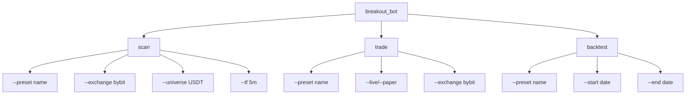

#### Usage Examples
```bash
# Scan candidates
python -m breakout_bot.cli scan --preset smallcap_top_gainers --exchange bybit --tf 5m

# Paper trading
python -m breakout_bot.cli trade --preset breakout_v1 --exchange bybit --paper

# Live trading (requires API keys)
python -m breakout_bot.cli trade --preset smallcap_top_losers --exchange bybit --live

# Backtesting
python -m breakout_bot.cli backtest --preset breakout_v1 --start 2024-01-01 --end 2024-06-01
```

## Testing Strategy

### Test Coverage Matrix

| Component | Unit Tests | Integration Tests | Mock Requirements |
|-----------|------------|-------------------|-------------------|
| Indicators | ✓ | - | Price data |
| Scanner | ✓ | ✓ | Market data, exchange |
| Signals | ✓ | ✓ | OHLCV, L2 data |
| Risk Manager | ✓ | - | Account data |
| Executor | - | ✓ | Exchange API |
| Position Manager | ✓ | ✓ | Position state |

### Key Test Scenarios

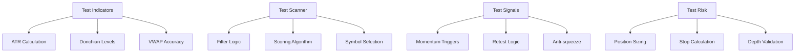

## Storage & Persistence

### Data Repository (storage/repository.py)

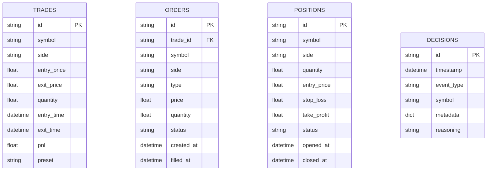

## Backtesting Framework

### Backtesting Architecture (backtest/backtester.py)

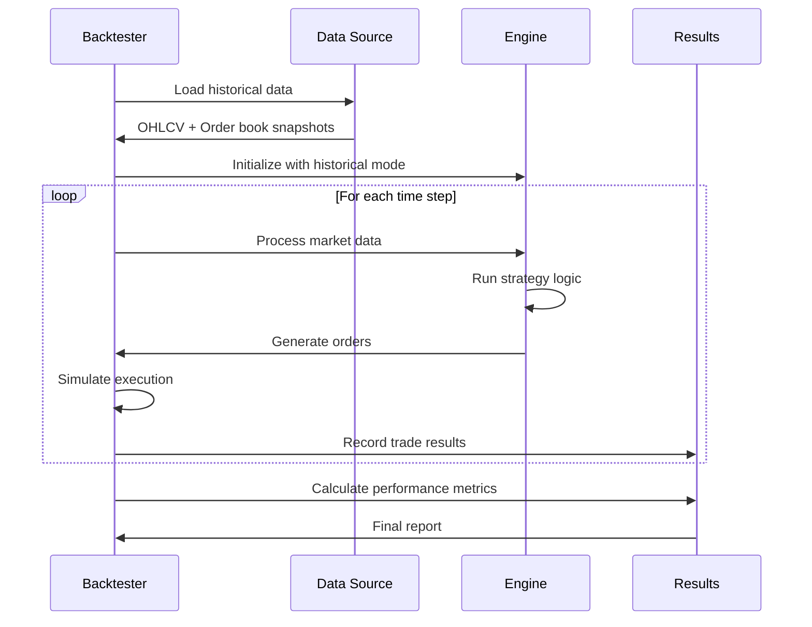

#### Performance Metrics
- **Returns**: CAGR, total return, Sharpe ratio
- **Risk**: Maximum drawdown, volatility, VaR
- **Trade Stats**: Win rate, profit factor, average R
- **Efficiency**: Trade frequency, holding periods

### Walk-Forward Analysis
- **Window Size**: 3-month training periods
- **Validation**: 1-month out-of-sample testing
- **Reoptimization**: Quarterly parameter updates
- **Robustness**: Performance consistency across periods

## Logging & Monitoring

### Logging Strategy (loguru)

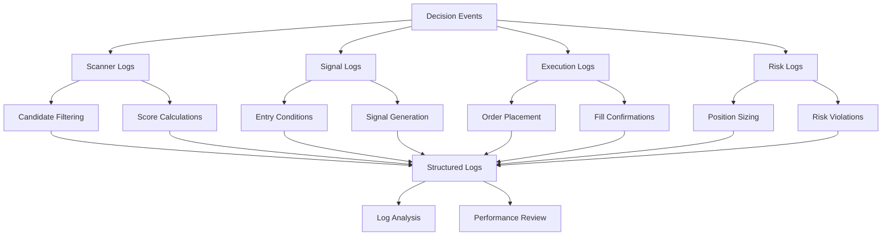

#### Log Categories
- **Decision Logs**: Every filter pass/fail with metrics
- **Execution Logs**: Order flow and latency tracking
- **Risk Logs**: Position sizing and stop adjustments
- **Performance Logs**: Trade outcomes and attribution
- **System Logs**: Errors, warnings, and health checks

## Kill Switch & Safety

### Risk Controls

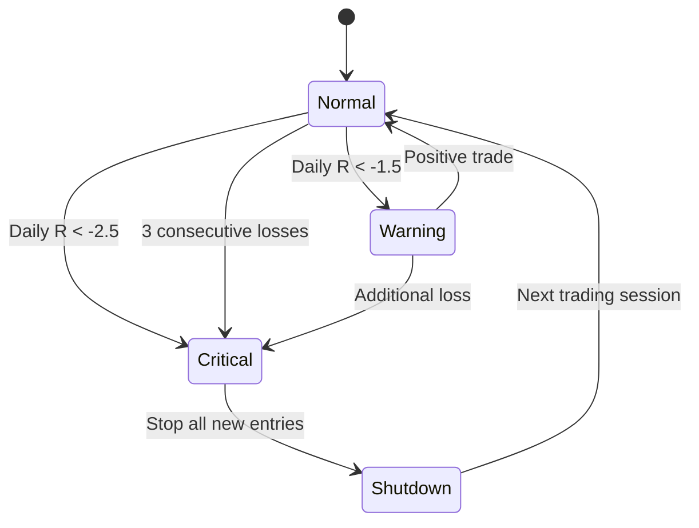

#### Safety Mechanisms
- **Daily R Limit**: Stop entries when daily loss exceeds threshold
- **Consecutive Loss Limit**: Halt after N losing trades in sequence
- **Latency Cutoff**: Reject orders with excessive execution delay
- **Spread Protection**: No market orders when spread too wide
- **Depth Validation**: Ensure sufficient liquidity before entry

This design provides a comprehensive framework for a sophisticated breakout trading bot with robust risk management, multiple trading strategies, and extensive monitoring capabilities.