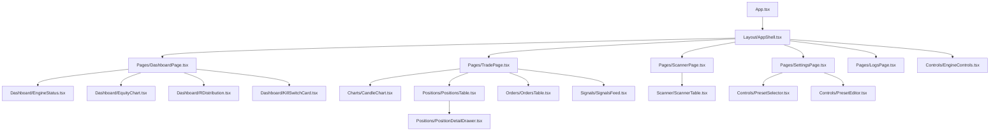
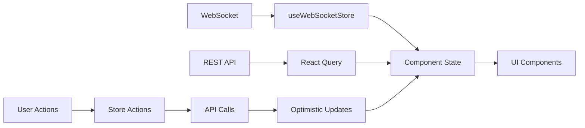

# React UI for Breakout Bot Trading System

## Overview

This design document outlines the development of a production-ready React web UI for the existing Breakout Bot Python trading system. The UI provides comprehensive control and monitoring capabilities for the bot's finite state machine, including configuration management, real-time monitoring, and deep insights into trading operations.

The frontend will serve as the primary interface for managing trading presets (`breakout_v1`, `smallcap_top_gainers`, `high_liquidity_top30`), controlling bot execution, and monitoring live trading performance through advanced dashboards and visualizations.

## Technology Stack & Dependencies

### Frontend Framework
- **Vite + React 18 + TypeScript**: Modern build tooling with type safety
- **Tailwind CSS**: Utility-first CSS framework for rapid UI development
- **shadcn/ui**: High-quality, accessible component library built on Radix UI

### State Management & Data Fetching
- **Zustand**: Lightweight state management for global app state
- **TanStack Query (React Query)**: Server state management with caching and synchronization
- **WebSocket Client**: Real-time event streaming with auto-reconnection

### Charts & Visualization
- **Recharts**: Declarative charting library for equity curves and metrics
- **lightweight-charts**: TradingView-style candlestick charts with overlays
- **React Hook Form + Zod**: Form handling with schema validation

### Development Tools
- **TypeScript**: Strict typing for reliability
- **ESLint + Prettier**: Code quality and formatting
- **Vite Plugin SVGR**: SVG icon handling

## Component Architecture

### Component Hierarchy



### Component Definition

#### Core Layout Components

**AppShell.tsx**
- Main application layout with navigation
- Global header with engine controls and connection status
- Sidebar navigation between pages
- Main content area with page routing

**EngineControls.tsx**
- Start/Stop/Reload engine controls
- Preset selection dropdown
- Mode toggle (Paper/Live) with confirmation
- Connection status indicator
- Loading states and error handling

#### Dashboard Components

**EngineStatus.tsx**
- Real-time FSM state visualization
- Engine metrics (uptime, cycle count, latency)
- Current preset and mode display
- Heartbeat monitoring with latency tracking

**EquityChart.tsx**
- Cumulative R/PnL visualization over time
- Time range selectors (1H, 4H, 1D, 1W)
- Performance metrics overlay
- Drawdown visualization

**RDistribution.tsx**
- Histogram of trade R outcomes
- Statistical metrics (win rate, avg R, Sharpe ratio)
- Recent trades summary
- Performance streaks tracking

**KillSwitchCard.tsx**
- Daily risk usage progress
- Consecutive losses counter
- Kill switch threshold status
- Risk warnings and alerts

#### Trading Components

**CandleChart.tsx**
- TradingView-style candlestick charts
- Level overlays (Donchian, support/resistance)
- Entry/exit markers
- Stop-loss and take-profit zones
- Volume profile overlay

**PositionsTable.tsx**
- Real-time position tracking
- P&L calculations (R and USD)
- Risk metrics per position
- Manual position controls
- Sortable and filterable columns

**PositionDetailDrawer.tsx**
- Detailed position timeline
- Trade execution history
- Risk/reward analysis
- Position-specific chart view

**OrdersTable.tsx**
- Order status tracking
- Execution details (fills, fees, slippage)
- Order cancellation controls
- Historical order data

**SignalsFeed.tsx**
- Real-time signal stream
- Signal reasoning and confidence
- Visual signal timeline
- Filter by signal type and symbol

#### Scanner Components

**ScannerTable.tsx**
- Market scan results display
- Candidate scoring and ranking
- Filter pass/fail indicators
- Detailed metric tooltips
- Symbol-specific chart quick view

#### Configuration Components

**PresetSelector.tsx**
- Dropdown preset selection
- Preset comparison view
- Quick preset switching
- Preset validation status

**PresetEditor.tsx**
- JSON-based preset editing
- Schema validation with Zod
- Real-time validation feedback
- Preset import/export functionality

### Props/State Management

#### Zustand Store Structure

```typescript
interface EngineStore {
  // Engine State
  engineState: FSMState;
  selectedPreset: string;
  tradingMode: 'paper' | 'live';
  isRunning: boolean;
  
  // Metrics
  engineMetrics: EngineMetrics;
  equityHistory: EquityPoint[];
  
  // Actions
  startEngine: (preset: string, mode: 'paper' | 'live') => Promise<void>;
  stopEngine: () => Promise<void>;
  reloadPresets: () => Promise<void>;
  setSelectedPreset: (preset: string) => void;
}

interface DataStore {
  // Real-time Data
  positions: Position[];
  orders: Order[];
  scanResults: ScannerSnapshot;
  signalsFeed: Signal[];
  
  // Connection State
  wsConnected: boolean;
  apiStatus: 'connected' | 'disconnected' | 'error';
  lastHeartbeat: number;
  
  // Actions
  updatePosition: (position: Position) => void;
  updateOrder: (order: Order) => void;
  addSignal: (signal: Signal) => void;
}
```

#### Lifecycle Methods/Hooks

**useWebSocket Hook**
- WebSocket connection management
- Auto-reconnection with exponential backoff
- Event parsing and store updates
- Connection health monitoring

**useEngineStatus Hook**
- Engine state synchronization
- FSM transition handling
- Error state management
- Performance metrics tracking

**useRealTimeData Hook**
- Live data stream processing
- Data validation and sanitization
- Cache management
- Optimistic updates

## Routing & Navigation

### Route Structure

```typescript
const routes = [
  { path: '/', component: DashboardPage, label: 'Dashboard' },
  { path: '/trade', component: TradePage, label: 'Trading' },
  { path: '/scanner', component: ScannerPage, label: 'Scanner' },
  { path: '/settings', component: SettingsPage, label: 'Settings' },
  { path: '/logs', component: LogsPage, label: 'Logs' },
];
```

### Navigation Patterns

**Sidebar Navigation**
- Primary navigation between main sections
- Active route highlighting
- Badge indicators for alerts/updates
- Collapsible on smaller screens

**Breadcrumb Navigation**
- Secondary navigation within sections
- Context-aware path display
- Quick navigation to parent sections

**Deep Linking Support**
- URL-based state preservation
- Shareable dashboard views
- Browser history integration

## Styling Strategy

### Tailwind CSS Architecture

**Design System Tokens**
```typescript
const theme = {
  colors: {
    // Trading specific colors
    profit: 'rgb(34, 197, 94)', // green-500
    loss: 'rgb(239, 68, 68)',   // red-500
    warning: 'rgb(245, 158, 11)', // amber-500
    
    // State colors
    running: 'rgb(34, 197, 94)',
    stopped: 'rgb(107, 114, 128)',
    error: 'rgb(239, 68, 68)',
    
    // Mode colors
    paper: 'rgb(34, 197, 94)',
    live: 'rgb(239, 68, 68)',
  },
  
  spacing: {
    // Component spacing
    card: '1.5rem',
    section: '2rem',
    page: '2.5rem',
  }
}
```

**Component Styling Patterns**
- Consistent card layouts with rounded-2xl and shadows
- Color-coded status indicators
- Responsive grid layouts
- Hover states and transitions
- Loading skeleton patterns

**Responsive Design**
- Mobile-first approach
- Breakpoint-based component adaptation
- Touch-friendly interaction areas
- Optimized chart viewing on mobile

## State Management

### Zustand Implementation

**Store Architecture**
```typescript
// Engine Store
const useEngineStore = create<EngineStore>((set, get) => ({
  engineState: 'IDLE',
  selectedPreset: 'breakout_v1',
  tradingMode: 'paper',
  isRunning: false,
  
  startEngine: async (preset, mode) => {
    set({ isRunning: true });
    try {
      await api.post('/engine/start', { preset, mode });
      set({ selectedPreset: preset, tradingMode: mode });
    } catch (error) {
      set({ isRunning: false });
      throw error;
    }
  },
  
  stopEngine: async () => {
    await api.post('/engine/stop');
    set({ isRunning: false, engineState: 'STOPPED' });
  },
}));

// WebSocket Store
const useWebSocketStore = create<WSStore>((set) => ({
  connected: false,
  latency: 0,
  lastHeartbeat: 0,
  
  handleMessage: (message: WsEnvelope) => {
    switch (message.type) {
      case 'HEARTBEAT':
        set({ 
          lastHeartbeat: Date.now(),
          latency: message.data.latencyMs 
        });
        break;
      case 'FSM_TRANSITION':
        useEngineStore.getState().updateState(message.data.to);
        break;
    }
  },
}));
```

### Data Flow Architecture



## API Integration Layer

### REST Client Implementation

**Base API Configuration**
```typescript
const api = axios.create({
  baseURL: import.meta.env.VITE_API_BASE_URL || 'http://localhost:8000/api',
  timeout: 10000,
  headers: {
    'Content-Type': 'application/json',
  },
});

// Request interceptor for auth/logging
api.interceptors.request.use((config) => {
  console.log(`API Request: ${config.method?.toUpperCase()} ${config.url}`);
  return config;
});

// Response interceptor for error handling
api.interceptors.response.use(
  (response) => response,
  (error) => {
    toast.error(`API Error: ${error.response?.data?.message || error.message}`);
    return Promise.reject(error);
  }
);
```

### React Query Configuration

**Query Client Setup**
```typescript
const queryClient = new QueryClient({
  defaultOptions: {
    queries: {
      staleTime: 30000, // 30 seconds
      cacheTime: 300000, // 5 minutes
      retry: 3,
      refetchOnWindowFocus: false,
    },
    mutations: {
      retry: 1,
    },
  },
});

// Key factories for consistent cache keys
const queryKeys = {
  presets: ['presets'] as const,
  preset: (name: string) => ['presets', name] as const,
  engineStatus: ['engine', 'status'] as const,
  positions: ['positions'] as const,
  orders: ['orders'] as const,
  scannerResults: ['scanner', 'last'] as const,
  logs: (level?: string) => ['logs', level] as const,
};
```

**Custom Hooks**
```typescript
const usePresets = () => {
  return useQuery({
    queryKey: queryKeys.presets,
    queryFn: () => api.get<PresetSummary[]>('/presets').then(r => r.data),
  });
};

const useEngineStatus = () => {
  return useQuery({
    queryKey: queryKeys.engineStatus,
    queryFn: () => api.get<EngineStatus>('/engine/status').then(r => r.data),
    refetchInterval: 5000, // Poll every 5 seconds
  });
};

const useStartEngine = () => {
  const queryClient = useQueryClient();
  
  return useMutation({
    mutationFn: (params: { preset: string; mode: 'paper' | 'live' }) =>
      api.post('/engine/start', params),
    onSuccess: () => {
      queryClient.invalidateQueries({ queryKey: queryKeys.engineStatus });
      toast.success('Engine started successfully');
    },
    onError: (error) => {
      toast.error(`Failed to start engine: ${error.message}`);
    },
  });
};
```

### WebSocket Manager

**Connection Management**
```typescript
class WebSocketManager {
  private ws: WebSocket | null = null;
  private reconnectAttempts = 0;
  private maxReconnectAttempts = 10;
  private baseReconnectDelay = 1000;
  
  connect(url: string) {
    this.ws = new WebSocket(url);
    
    this.ws.onopen = () => {
      console.log('WebSocket connected');
      this.reconnectAttempts = 0;
      useWebSocketStore.getState().setConnected(true);
    };
    
    this.ws.onmessage = (event) => {
      try {
        const message: WsEnvelope = JSON.parse(event.data);
        useWebSocketStore.getState().handleMessage(message);
      } catch (error) {
        console.error('Failed to parse WebSocket message:', error);
      }
    };
    
    this.ws.onclose = () => {
      console.log('WebSocket disconnected');
      useWebSocketStore.getState().setConnected(false);
      this.scheduleReconnect();
    };
    
    this.ws.onerror = (error) => {
      console.error('WebSocket error:', error);
    };
  }
  
  private scheduleReconnect() {
    if (this.reconnectAttempts < this.maxReconnectAttempts) {
      const delay = this.baseReconnectDelay * Math.pow(2, this.reconnectAttempts);
      setTimeout(() => {
        this.reconnectAttempts++;
        this.connect(this.ws?.url || '');
      }, delay);
    }
  }
}
```

### TypeScript Type Definitions

**Core Types**
```typescript
// Engine Types
interface EngineStatus {
  state: FSMState;
  preset: string;
  mode: 'paper' | 'live';
  startedAt?: string;
  slots: number;
  openPositions: number;
  latencyMs: number;
  dailyR: number;
  consecutiveLosses: number;
}

type FSMState = 
  | 'IDLE'
  | 'SCANNING' 
  | 'LEVEL_BUILDING'
  | 'SIGNAL_WAIT'
  | 'SIZING'
  | 'EXECUTION'
  | 'MANAGING'
  | 'EMERGENCY'
  | 'STOPPED';

// Data Types
interface Position {
  id: string;
  symbol: string;
  side: 'long' | 'short';
  entry: number;
  sl: number;
  size: number;
  mode: 'paper' | 'live';
  openedAt: string;
  pnlR?: number;
  pnlUsd?: number;
}

interface Order {
  id: string;
  symbol: string;
  side: 'buy' | 'sell';
  type: 'limit' | 'market' | 'stop-limit';
  qty: number;
  price?: number;
  status: 'open' | 'filled' | 'canceled';
  createdAt: string;
}

interface Candidate {
  symbol: string;
  score: number;
  filters: Record<string, boolean>;
  metrics: {
    vol_surge_1h: number;
    vol_surge_5m: number;
    oi_usd?: number;
    atr15m_pct: number;
    bbwidth_pctile: number;
    corr_btc_15m: number;
    trades_per_min: number;
    spread_bps: number;
    depth_usd_0_5pct: number;
  };
  levels: { high: number; low: number };
}

// WebSocket Types
interface WsEnvelope<T = any> {
  type: WsEventType;
  ts: number;
  data: T;
}

type WsEventType =
  | 'HEARTBEAT'
  | 'FSM_TRANSITION'
  | 'SCAN_START'
  | 'SCAN_RESULT'
  | 'SIGNAL'
  | 'ORDER_PLACED'
  | 'ORDER_FILLED'
  | 'ORDER_CANCELED'
  | 'POSITION_OPEN'
  | 'POSITION_UPDATE'
  | 'POSITION_CLOSE'
  | 'STOP_MOVED'
  | 'TAKE_PROFIT'
  | 'KILL_SWITCH'
  | 'ERROR';
```

## Testing Strategy

### Unit Testing Framework

**Test Setup**
```typescript
// test-utils.tsx
import { render } from '@testing-library/react';
import { QueryClient, QueryClientProvider } from '@tanstack/react-query';
import { ToastProvider } from '@/components/ui/toast';

const createTestQueryClient = () => new QueryClient({
  defaultOptions: {
    queries: { retry: false },
    mutations: { retry: false },
  },
});

export const renderWithProviders = (ui: React.ReactElement) => {
  const queryClient = createTestQueryClient();
  
  return render(
    <QueryClientProvider client={queryClient}>
      <ToastProvider>
        {ui}
      </ToastProvider>
    </QueryClientProvider>
  );
};
```

**Component Tests**
```typescript
// EngineControls.test.tsx
describe('EngineControls', () => {
  it('should start engine with selected preset', async () => {
    const mockStartEngine = vi.fn();
    renderWithProviders(<EngineControls onStart={mockStartEngine} />);
    
    const startButton = screen.getByRole('button', { name: /start/i });
    await user.click(startButton);
    
    expect(mockStartEngine).toHaveBeenCalledWith({
      preset: 'breakout_v1',
      mode: 'paper'
    });
  });
  
  it('should show confirmation dialog for live mode', async () => {
    renderWithProviders(<EngineControls />);
    
    const modeToggle = screen.getByRole('switch');
    await user.click(modeToggle);
    
    expect(screen.getByText(/live trading confirmation/i)).toBeInTheDocument();
  });
});
```

**Integration Tests**
```typescript
// Dashboard.integration.test.tsx
describe('Dashboard Integration', () => {
  it('should display real-time engine status', async () => {
    const mockEngineStatus = {
      state: 'SCANNING',
      preset: 'breakout_v1',
      mode: 'paper',
      latencyMs: 50,
    };
    
    server.use(
      rest.get('/api/engine/status', (req, res, ctx) => 
        res(ctx.json(mockEngineStatus))
      )
    );
    
    renderWithProviders(<DashboardPage />);
    
    await waitFor(() => {
      expect(screen.getByText('SCANNING')).toBeInTheDocument();
      expect(screen.getByText('50ms')).toBeInTheDocument();
    });
  });
});
```

### Mock Service Worker Setup

**API Mocking**
```typescript
// mocks/handlers.ts
export const handlers = [
  rest.get('/api/presets', (req, res, ctx) => 
    res(ctx.json([
      { name: 'breakout_v1', description: 'Liquid markets strategy' },
      { name: 'smallcap_top_gainers', description: 'Growth strategy' },
    ]))
  ),
  
  rest.post('/api/engine/start', (req, res, ctx) => 
    res(ctx.json({ success: true }))
  ),
  
  rest.get('/api/positions', (req, res, ctx) => 
    res(ctx.json([]))
  ),
];
```
