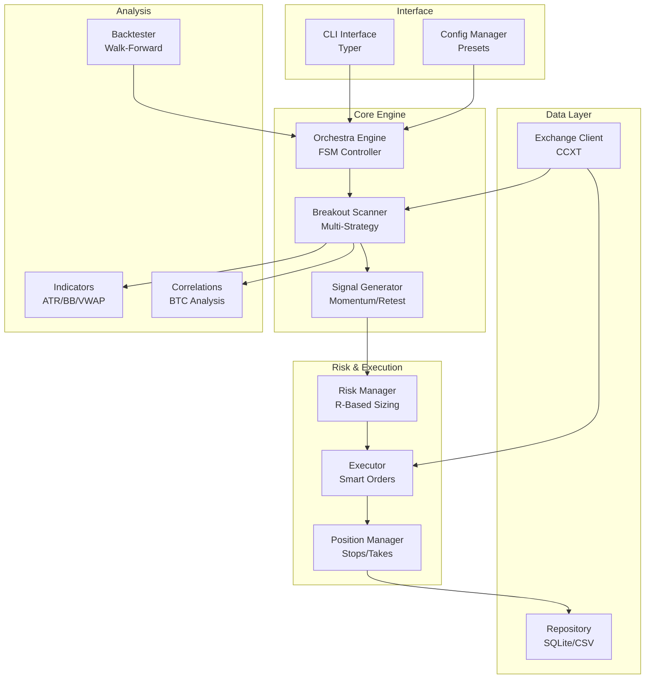
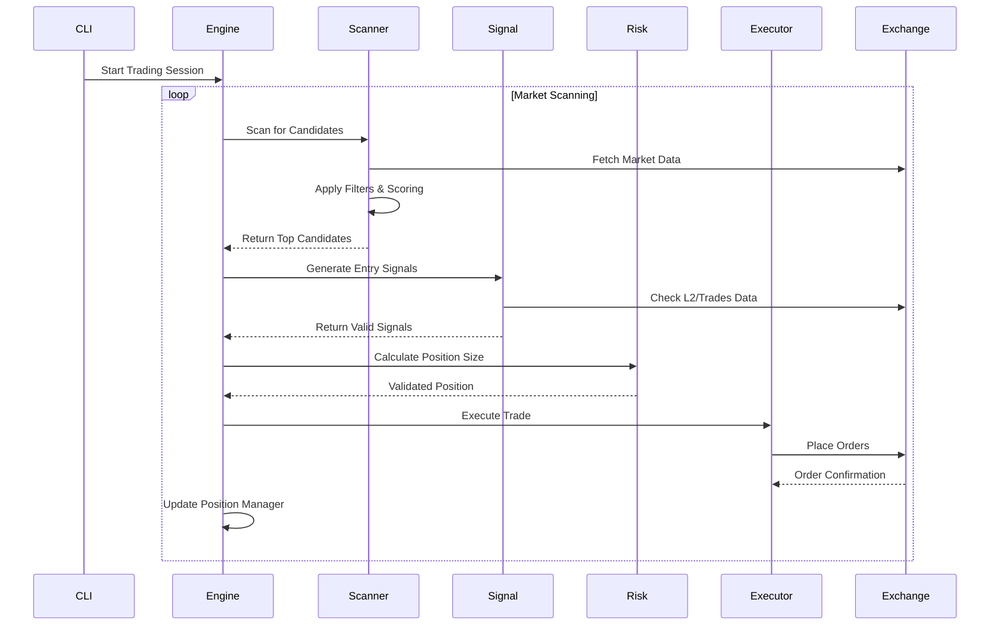
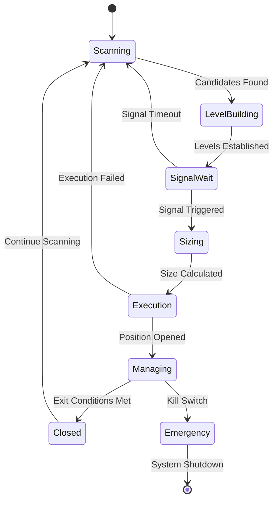

# Breakout Bot Trading System Design

## Overview

The Breakout Bot is a sophisticated algorithmic trading system designed for cryptocurrency range breakout trading after volatility compression. The system operates on CEX exchanges via CCXT, supporting both paper trading and live trading modes. It implements four distinct presets for different market conditions and risk profiles.

### Core Value Proposition
- Automated detection of range compression patterns and breakout opportunities
- Multi-strategy approach with specialized presets for different market segments
- Risk-managed execution with sophisticated position management
- Comprehensive backtesting and performance analytics

### Key Features
- **Range Breakout Detection**: Identifies volatility compression and subsequent breakout patterns
- **Multi-Preset Strategy**: Four specialized configurations for different market conditions
- **Advanced Risk Management**: R-based position sizing with kill-switch mechanisms
- **Real-time Scanning**: Continuous market monitoring with configurable filters
- **Execution Engine**: Smart order routing with slippage protection and TWAP
- **Position Management**: Dynamic stop-loss, take-profit, and trailing mechanisms

## Technology Stack & Dependencies

### Core Technologies
- **Python 3.11+**: Primary development language
- **CCXT 4.3.0+**: Exchange connectivity and order management
- **Pydantic 2.0+**: Data validation and configuration management
- **Pandas/Numpy**: Data processing and technical analysis
- **AsyncIO**: Asynchronous operations for real-time data

### Trading & Analysis
- **pandas_ta**: Technical indicator calculations (ATR, Bollinger Bands, VWAP)
- **CCXT**: Multi-exchange support with unified API
- **WebSockets**: Real-time market data streaming

### Infrastructure
- **Typer**: CLI interface with rich output
- **Loguru**: Structured logging for trade decisions
- **python-dotenv**: Environment configuration
- **SQLite**: Local data persistence

### Testing & Quality
- **pytest**: Unit and integration testing
- **pytest-asyncio**: Asynchronous test support

## Architecture

### System Components Interaction



### Data Flow Architecture



### State Machine Flow



## Core Features

### 1. Market Scanning System

#### Scanner Architecture
The scanner implements a multi-stage filtering and scoring system:

**Stage 1: Liquidity Filters**
- 24h Volume: Minimum USD volume requirements
- Open Interest: Minimum OI for derivatives
- Spread: Maximum bid-ask spread in basis points
- Depth: Minimum liquidity at 0.3% and 0.5% price levels
- Trading Activity: Minimum trades per minute

**Stage 2: Volatility Quality Filters**
- ATR Range: ATR(15m)/Price within configured bounds
- Bollinger Band Width: Below specified percentile for compression
- Volume Surge: 1h and 5m volume vs historical median
- OI Delta: Change in open interest (futures markets)

**Stage 3: Correlation Filter**
- BTC Correlation: Absolute correlation with BTC/USDT
- Correlation Window: Configurable lookback period
- Independence Score: Penalty for high correlation

#### Scoring Algorithm
```
Score = w1*z(vol_surge) + w2*z(oi_delta) + w3*z(atr_quality) 
      + w4*z(-abs(correlation)) + w5*z(trades_per_minute)
```

Where weights vary by preset:
- **breakout_v1**: Balanced approach (0.35, 0.20, 0.15, 0.20, 0.10)
- **smallcap_gainers**: Volume-focused (0.30, 0.20, 0.20, 0.15, -0.10, 0.05)

### 2. Level Detection System

#### Donchian Channel Method
- **Base Formation**: N-period highest high and lowest low
- **Quality Metrics**: Minimum touches, wick analysis
- **Base Height**: Distance between levels for projection targets

#### Level Validation
- **Touch Count**: Minimum 3 touches for valid base
- **Wick Filter**: Reject levels with excessive wick penetration
- **Time Validity**: Levels must be recent enough for relevance

### 3. Signal Generation

#### Momentum Strategy (Primary for Liquid Markets)
**Entry Conditions:**
- Price closes above resistance level + epsilon
- Volume >= k × median volume (5m)
- Candle body >= 50% of total range
- L2 order book imbalance >= threshold
- VWAP gap within acceptable limits

**Order Type:** Stop-limit with anti-squeeze protection

#### Retest Strategy (Primary for Small-cap)
**Entry Conditions:**
- Previous breakout occurred
- Price returns to test level
- Acceptable pierce depth (0.25 × ATR max)
- Strong L2 imbalance on retest
- Maintained trading activity

**Order Type:** Limit order at level with pierce tolerance

### 4. Risk Management System

#### Position Sizing (R-Model)
```
R_dollar = account_equity × risk_per_trade
position_qty = R_dollar / stop_distance
```

**Constraints:**
- Maximum position size based on available depth
- Price/quantity precision rounding
- Slippage protection limits

#### Stop-Loss Calculation
**Momentum Entries:**
- SL = max(swing_low_10m, entry - 1.2×ATR(5m))

**Retest Entries:**
- SL = level - 1.0×ATR(5m)

**Time-based Stops:**
- Maximum hold time without reaching 1R
- Panic exit on excessive adverse movement

### 5. Position Management

#### Take-Profit Strategy
**TP1 (1R):** 30-40% position size
- Move remaining stop to breakeven + fees
- Activate trailing mechanism

**TP2 (2R):** 30% position size
- Chandelier exit with 2.5-2.8 × ATR(5m)

**Projection Target:** Base height projection
- Additional partial exit opportunity

#### Trailing Mechanisms
- **Chandelier Exit**: ATR-based trailing stop
- **EMA Pullback**: 9-EMA retest for add-on positions
- **Time Decay**: Reduce position if no progress

#### Add-on Rules
**Liquid Markets Only:**
- Single add-on at 9-EMA pullback
- Maximum 50% of initial position size
- No increase in total R risk
- Requires OBV confirmation

### 6. Execution Engine

#### Order Types
**Stop-Limit Orders:**
- Stop price: level × (1 + epsilon)
- Limit price: stop × (1 + offset)
- Anti-squeeze cancellation

**TWAP Execution:**
- Large positions split over time
- Depth-aware sizing
- Latency monitoring

#### Paper Trading Mode
- Realistic fill simulation
- Bid-ask spread consideration
- Slippage modeling based on order size
- Commission calculation

### 7. Exchange Integration

#### Supported Operations
- Market data fetching (OHLCV, order book, trades)
- Order management (limit, market, stop-limit)
- Position monitoring
- Account information

#### Data Processing
**L2 Depth Analysis:**
```python
L2Depth:
  bid_usd_0_5pct: float
  ask_usd_0_5pct: float
  bid_usd_0_3pct: float
  ask_usd_0_3pct: float
  spread_bps: float
  imbalance: float
```

**Trade Activity:**
- Trades per minute calculation
- Volume surge analysis
- Price impact estimation

## Preset Configurations

### 1. breakout_v1 (Liquid Markets)
**Target:** Major cryptocurrencies with high liquidity
**Risk per Trade:** 0.6%
**Max Positions:** 3
**Strategy Priority:** Momentum breakouts

**Key Parameters:**
- Min 24h Volume: $200M USD
- Min OI: $50M USD
- Max Spread: 2 bps
- Min Depth: $200K at 0.5%
- Correlation Limit: 0.25

### 2. smallcap_top_gainers (Growth Focus)
**Target:** Fastest rising small-cap tokens
**Risk per Trade:** 0.3%
**Max Positions:** 2
**Strategy Priority:** Retest entries

**Key Parameters:**
- Min 24h Volume: $100M USD
- Min OI: $20M USD
- Max Spread: 6 bps
- Higher volume surge thresholds
- Reduced correlation tolerance

### 3. smallcap_top_losers (Short Bias)
**Target:** Declining small-cap tokens for short opportunities
**Configuration:** Mirror of gainers with short-side logic
**Strategy:** Breakdown patterns below support

### 4. high_liquidity_top30 (Blue Chip Focus)
**Target:** Top 30 by volume/OI
**Risk per Trade:** 0.5%
**Strategy:** Conservative breakouts in most liquid markets

**Key Parameters:**
- Volume-based selection (top 30)
- Tighter correlation limits
- Higher depth requirements
- Lower volatility thresholds

## Data Models & Configuration

### Core Data Structures

```python
# Market Data
class Candle(BaseModel):
    ts: int
    open: float
    high: float
    low: float
    close: float
    volume: float

class L2Depth(BaseModel):
    bid_usd_0_5pct: float
    ask_usd_0_5pct: float
    bid_usd_0_3pct: float
    ask_usd_0_3pct: float
    spread_bps: float
    imbalance: float

# Trading Models
class Signal(BaseModel):
    symbol: str
    side: Literal["long", "short"]
    reason: str
    entry: float
    level: float
    sl: float
    meta: dict

class Position(BaseModel):
    id: str
    symbol: str
    side: str
    qty: float
    entry: float
    sl: float
    tp: float
    status: str
    timestamps: dict
```

### Configuration Management
- **Environment Variables**: Exchange credentials, mode selection
- **JSON Presets**: Strategy parameters, risk settings
- **Runtime Config**: Dynamic parameter adjustment
- **Validation**: Pydantic schema validation for all configurations

## Testing Strategy

### Unit Tests
**test_indicators.py**
- ATR calculation accuracy
- Donchian channel detection
- Bollinger Band width calculation
- VWAP computation from tick data

**test_scanner_score.py**
- Filter application logic
- Scoring algorithm implementation
- Ranking and selection process
- Edge case handling

**test_sizing_and_stops.py**
- Position sizing calculations
- Stop-loss placement logic
- Precision rounding
- Risk limit enforcement

**test_signal_momentum_and_retest.py**
- Signal generation conditions
- Entry trigger detection
- Order type selection
- Anti-squeeze logic

### Integration Tests
- End-to-end scanning workflow
- Order execution simulation
- Position management lifecycle
- Configuration loading and validation

### Performance Tests
- Scanner throughput with multiple symbols
- Memory usage under load
- Latency measurements
- Error recovery testing

## CLI Interface

### Command Structure

```bash
# Market Scanning
python -m breakout_bot.cli scan --preset breakout_v1 --exchange bybit --tf 5m

# Trading Execution
python -m breakout_bot.cli trade --preset smallcap_top_gainers --paper
python -m breakout_bot.cli trade --preset breakout_v1 --live

# Backtesting
python -m breakout_bot.cli backtest --preset high_liquidity_top30 \
  --start 2024-01-01 --end 2024-06-01

# Custom Symbol Lists
python -m breakout_bot.cli scan --symbols "SOL/USDT,ATOM/USDT" \
  --preset breakout_v1
```

### Configuration Options
- **--live/--paper**: Trading mode selection
- **--log-level**: Logging verbosity control
- **--dry-run**: Simulation without order placement
- **--preset**: Strategy configuration selection
- **--exchange**: Target exchange selection

## Storage & Persistence

### Data Storage Architecture
**CSV Files:**
- trades.csv: Completed trade records
- orders.csv: Order execution history
- positions.csv: Position lifecycle data

**SQLite Database:**
- Market data cache
- Performance metrics
- System state persistence

**Log Files:**
- Decision logs with reasoning
- Performance metrics
- Error tracking and debugging

### Data Retention
- Trade history: Permanent retention
- Market data: Rolling 90-day window
- Logs: Configurable retention period
- Performance metrics: Aggregated monthly summaries

## Monitoring & Observability

### Logging Strategy
**Decision Logging:**
- Filter pass/fail reasoning
- Metric values (vol_surge, correlation, ATR, etc.)
- Signal generation logic
- Execution details and latency

**Performance Tracking:**
- Win rate and average R
- Sharpe ratio and maximum drawdown
- System latency and uptime
- Error rates and recovery

### Kill Switch Mechanisms
**Daily Risk Limits:**
- Maximum daily R loss threshold
- Consecutive loss count limits
- Portfolio heat monitoring

**System Health:**
- Exchange connectivity monitoring
- Latency threshold enforcement
- Data quality validation

## Security & Risk Controls

### API Security
- Environment variable management
- Encrypted credential storage
- IP whitelist configuration
- Rate limit compliance

### Trading Risk Controls
- Position size limits
- Maximum concurrent positions
- Correlation exposure limits
- Market condition filters

### System Risk Controls
- Paper mode default
- Live mode explicit activation
- Configuration validation
- Error handling and recovery

### Operational Risk
- Kill switch implementation
- Manual override capabilities
- System state persistence
- Recovery procedures