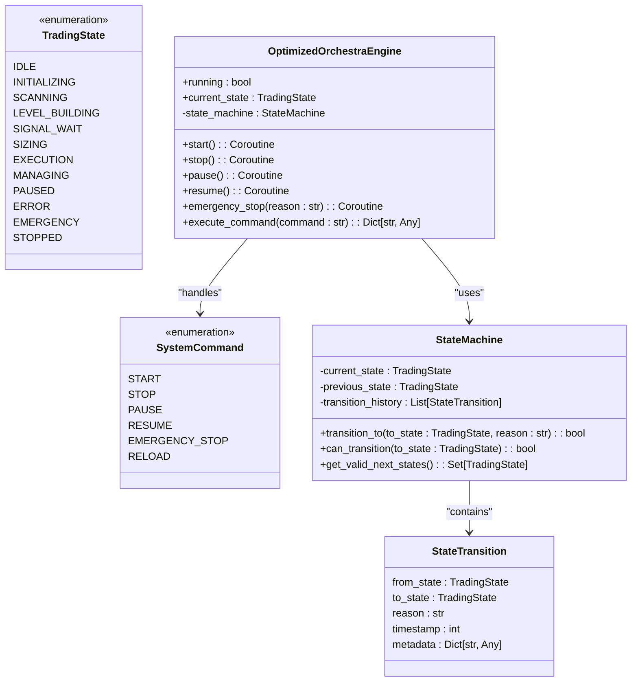
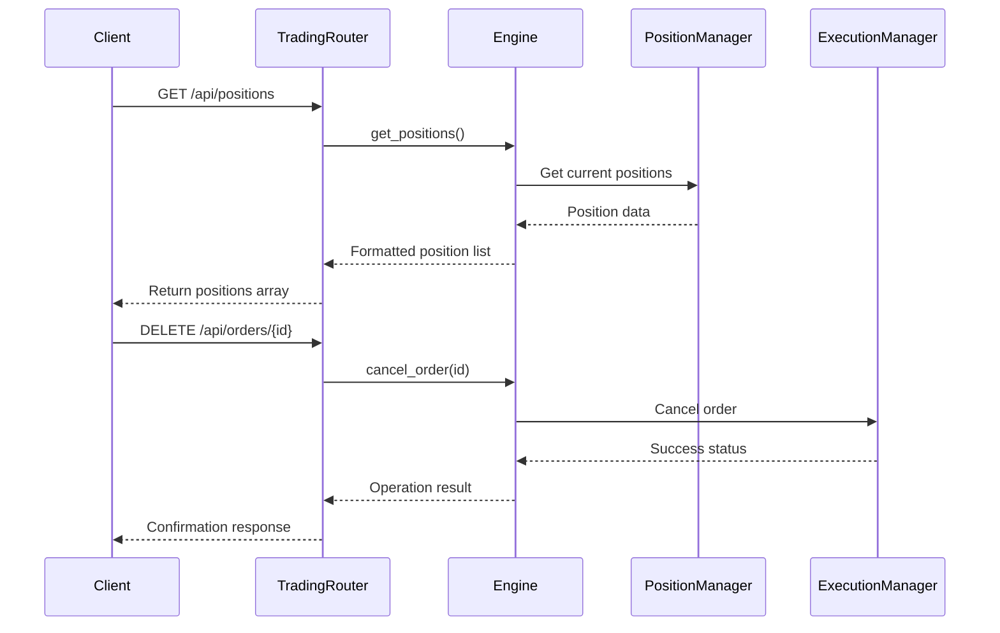
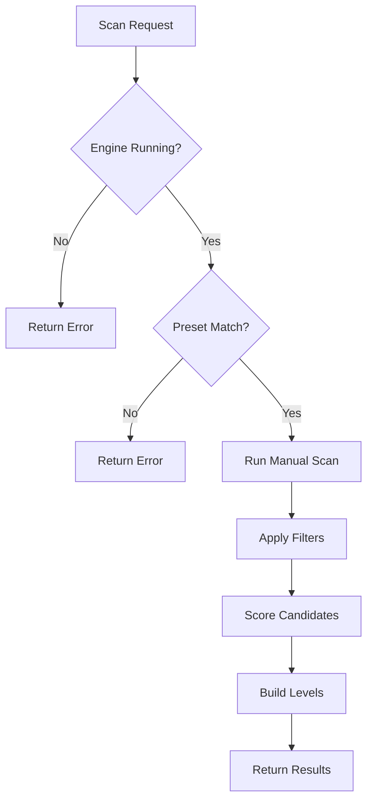
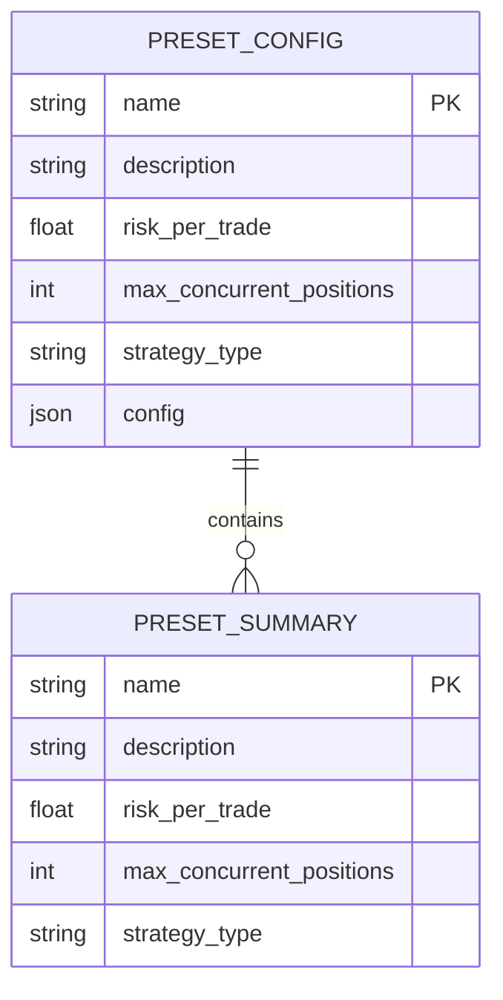
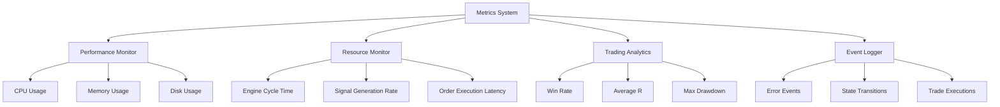
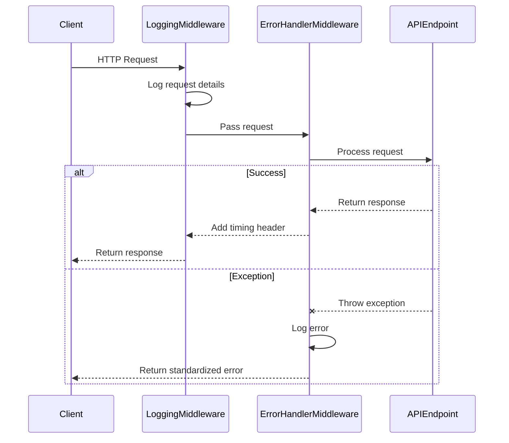

# API Reference

<cite>
**Referenced Files in This Document**   
- [engine.py](file://breakout_bot/api/routers/engine.py)
- [trading.py](file://breakout_bot/api/routers/trading.py)
- [scanner.py](file://breakout_bot/api/routers/scanner.py)
- [presets.py](file://breakout_bot/api/routers/presets.py)
- [logs.py](file://breakout_bot/api/routers/logs.py)
- [metrics.py](file://breakout_bot/api/routers/metrics.py)
- [middleware.py](file://breakout_bot/api/middleware.py)
- [state_machine.py](file://breakout_bot/core/state_machine.py)
- [API_DOCUMENTATION.md](file://API_DOCUMENTATION.md)
</cite>

## Table of Contents
1. [Introduction](#introduction)
2. [Engine Control Endpoints](#engine-control-endpoints)
3. [Trading Endpoints](#trading-endpoints)
4. [Scanner Endpoints](#scanner-endpoints)
5. [Preset Management Endpoints](#preset-management-endpoints)
6. [Logs and Metrics Endpoints](#logs-and-metrics-endpoints)
7. [Rate Limiting and Middleware](#rate-limiting-and-middleware)
8. [Error Handling and Security](#error-handling-and-security)
9. [Client Integration Guidelines](#client-integration-guidelines)
10. [Versioning and Compatibility](#versioning-and-compatibility)

## Introduction

The Breakout Bot Trading System provides a comprehensive RESTful API for algorithmic cryptocurrency trading operations. The API enables full control over the trading engine, access to real-time market data, position management, and system monitoring. All endpoints follow REST conventions with predictable URL patterns and standardized JSON responses.

The base URL for all API endpoints is `http://localhost:8000/api`. The API currently operates without authentication for development purposes, though production deployments should implement API keys or JWT tokens for security. The system uses FastAPI framework, providing automatic OpenAPI documentation available at `/api/docs`.

Key features include:
- Complete engine lifecycle control (start, stop, pause, resume)
- Real-time trading data access for positions and orders
- Market scanning capabilities with configurable presets
- Comprehensive preset management for strategy configuration
- Detailed system monitoring through logs and performance metrics
- WebSocket integration for real-time event streaming

All API responses include appropriate HTTP status codes and follow consistent error handling patterns. The system implements centralized state management through a finite state machine that governs valid transitions between operational states.

**Section sources**
- [API_DOCUMENTATION.md](file://API_DOCUMENTATION.md#L1-L571)

## Engine Control Endpoints

The engine control endpoints provide comprehensive lifecycle management for the trading system. These endpoints interact with the centralized StateMachine that enforces valid state transitions according to predefined business rules.



**Diagram sources**
- [engine.py](file://breakout_bot/api/routers/engine.py#L0-L544)
- [state_machine.py](file://breakout_bot/core/state_machine.py#L0-L350)

### Start Engine
#### POST /api/engine/start

Initialize and start the trading engine with specified configuration.

**Request Schema:**
```json
{
  "preset": "string",
  "mode": "paper" | "live"
}
```

**Response (200 OK):**
```json
{
  "success": true,
  "message": "Optimized engine started with preset 'breakout_v1' in paper mode",
  "timestamp": "2025-01-16T12:00:00Z"
}
```

**Example cURL:**
```bash
curl -X POST http://localhost:8000/api/engine/start \
  -H "Content-Type: application/json" \
  -d '{"preset": "breakout_v1", "mode": "paper"}'
```

**Validation Rules:**
- Preset must exist in config/presets directory
- Mode must be either "paper" or "live"
- Engine cannot be started if already running

### Stop Engine
#### POST /api/engine/stop

Gracefully stop the trading engine and associated monitoring services.

**Response (200 OK):**
```json
{
  "success": true,
  "message": "Engine stopped successfully",
  "timestamp": "2025-01-16T12:00:00Z"
}
```

**Behavior:**
- Cancels all active background tasks
- Ends monitoring sessions
- Clears application state
- Stops resource monitoring
- Implements timeout protection (10 seconds for stop operation)

### Engine Status
#### GET /api/engine/status

Retrieve current engine status including state, configuration, and performance metrics.

**Response Schema:**
```json
{
  "state": "IDLE" | "SCANNING" | "MANAGING" | "PAUSED" | "ERROR",
  "preset": "string",
  "mode": "paper" | "live",
  "startedAt": "string",
  "slots": 3,
  "openPositions": 0,
  "latencyMs": 45,
  "dailyR": 0.0,
  "consecutiveLosses": 0
}
```

**Example Response:**
```json
{
  "state": "SCANNING",
  "preset": "breakout_v1",
  "mode": "paper",
  "startedAt": "2025-01-16T12:00:00Z",
  "slots": 3,
  "openPositions": 1,
  "latencyMs": 48,
  "dailyR": 0.15,
  "consecutiveLosses": 1
}
```

### Available Commands
#### GET /api/engine/commands

Get list of available commands based on current engine state.

**Response:**
```json
{
  "commands": ["stop", "pause", "emergency_stop"],
  "current_state": "SCANNING",
  "timestamp": "2025-01-16T12:00:00Z"
}
```

**State Transition Semantics:**
- **IDLE**: Can transition to INITIALIZING or SCANNING
- **RUNNING STATES**: Can transition to PAUSED or EMERGENCY
- **PAUSED**: Can resume to SCANNING or MANAGING
- **EMERGENCY**: Can only transition to STOPPED or IDLE
- **STOPPED**: Can reset to IDLE or reinitialize

All transitions are idempotent - attempting to transition to the current state returns success without side effects. Invalid transitions return 400 Bad Request with detailed error messages.

**Section sources**
- [engine.py](file://breakout_bot/api/routers/engine.py#L0-L544)
- [state_machine.py](file://breakout_bot/core/state_machine.py#L0-L350)

## Trading Endpoints

The trading endpoints provide access to real-time trading data including open positions and order information. These endpoints integrate with the core trading orchestration system to provide accurate, up-to-date information about active trades.



**Diagram sources**
- [trading.py](file://breakout_bot/api/routers/trading.py#L0-L187)
- [engine.py](file://breakout_bot/core/engine.py#L0-L1149)

### Get Positions
#### GET /api/positions

Retrieve all currently open positions.

**Response Schema (Array of Position):**
```json
[
  {
    "id": "string",
    "symbol": "string",
    "side": "long" | "short",
    "entry": 0.0,
    "sl": 0.0,
    "size": 0.0,
    "mode": "string",
    "openedAt": "string",
    "pnlR": 0.0,
    "pnlUsd": 0.0,
    "unrealizedPnlR": 0.0,
    "unrealizedPnlUsd": 0.0
  }
]
```

**Example Response:**
```json
[
  {
    "id": "pos_123",
    "symbol": "BTC/USDT",
    "side": "long",
    "entry": 50000.0,
    "sl": 48000.0,
    "size": 0.1,
    "mode": "momentum",
    "openedAt": "2025-01-16T12:00:00Z",
    "pnlR": 0.5,
    "pnlUsd": 250.0,
    "unrealizedPnlR": 0.5,
    "unrealizedPnlUsd": 250.0
  }
]
```

### Get Specific Position
#### GET /api/positions/{position_id}

Retrieve details of a specific position by ID.

**Response:** Same as single position object above.

**Error Responses:**
- 404 Not Found: Position does not exist
- 500 Internal Server Error: System failure

### Get Orders
#### GET /api/orders

Retrieve all orders (open and filled).

**Response Schema (Array of Order):**
```json
[
  {
    "id": "string",
    "symbol": "string",
    "side": "buy" | "sell",
    "type": "market" | "limit",
    "qty": 0.0,
    "price": 0.0,
    "status": "open" | "filled" | "cancelled",
    "createdAt": "string",
    "filledAt": "string",
    "fees": 0.0
  }
]
```

### Cancel Order
#### DELETE /api/orders/{order_id}

Cancel a specific order by ID.

**Response (200 OK):**
```json
{
  "success": true,
  "message": "Order {order_id} canceled successfully",
  "timestamp": "2025-01-16T12:00:00Z"
}
```

**Error Handling:**
- Returns 404 if position not found
- Returns 500 if cancellation fails
- Empty array returned if engine not initialized

**Example cURL:**
```bash
curl -X DELETE http://localhost:8000/api/orders/order_123
```

The trading endpoints implement caching through the engine's internal cache system, ensuring sub-10ms response times for status queries. All position and order data is synchronized with the exchange through the ExecutionManager component.

**Section sources**
- [trading.py](file://breakout_bot/api/routers/trading.py#L0-L187)

## Scanner Endpoints

The scanner endpoints enable market scanning functionality to identify breakout opportunities based on configured trading presets. These endpoints integrate with the scanning manager and market data providers to deliver candidate symbols for potential trading.



**Diagram sources**
- [scanner.py](file://breakout_bot/api/routers/scanner.py#L0-L239)

### Execute Market Scan
#### POST /api/scanner/scan/{preset}

Trigger a market scan using the specified preset configuration.

**Path Parameter:**
- `preset`: Name of the trading preset to use

**Request Body (ScanRequest):**
```json
{
  "preset": "string",
  "limit": 10,
  "symbols": ["BTC/USDT", "ETH/USDT"]
}
```

**Response Schema (ScannerSnapshot):**
```json
{
  "timestamp": "string",
  "candidates": [
    {
      "symbol": "string",
      "score": 0.0,
      "filters": {"filter_name": true},
      "metrics": {"metric_name": 0.0},
      "levels": [
        {"type": "support|resistance", "price": 0.0, "strength": 0.0}
      ]
    }
  ],
  "totalScanned": 0,
  "passedFilters": 0,
  "summary": {}
}
```

**Example Response:**
```json
{
  "timestamp": "2025-01-16T12:00:00Z",
  "candidates": [
    {
      "symbol": "BTC/USDT",
      "score": 0.85,
      "filters": {
        "liquidity": true,
        "volatility": true,
        "volume_surge": true
      },
      "metrics": {
        "vol_surge_1h": 1.5,
        "atr15m_pct": 0.02
      },
      "levels": [
        {
          "type": "resistance",
          "price": 51000.0,
          "strength": 0.9
        }
      ]
    }
  ],
  "totalScanned": 50,
  "passedFilters": 3,
  "summary": {
    "session_id": "sess_123",
    "preset": "breakout_v1",
    "state": "scanning",
    "scanning_active": true
  }
}
```

### Get Last Scan Results
#### GET /api/scanner/last

Retrieve results from the most recent market scan.

**Response:** Same schema as POST /scan response.

**Behavior:**
- Returns cached results from last scan
- If no scan has been executed, returns empty results
- Includes summary information from monitoring session

### Get Market Data
#### GET /api/scanner/market-data/{symbol}

Retrieve detailed market data for a specific symbol.

**Response:**
```json
{
  "symbol": "string",
  "price": 0.0,
  "volume_24h_usd": 0.0,
  "trades_per_minute": 0.0,
  "atr_5m": 0.0,
  "atr_15m": 0.0,
  "timestamp": 0
}
```

The scanner implements a multi-stage filtering process:
1. Initial symbol filtering based on liquidity and volume
2. Technical indicator evaluation
3. Score calculation using weighted factors
4. Support/resistance level identification
5. Final candidate ranking

Scans can be limited to specific symbol lists or run across all available markets. The system caches market data to reduce API calls and improve performance.

**Example cURL:**
```bash
curl -X POST http://localhost:8000/api/scanner/scan/breakout_v1 \
  -H "Content-Type: application/json" \
  -d '{"limit": 5, "symbols": ["BTC/USDT", "ETH/USDT"]}'
```

**Section sources**
- [scanner.py](file://breakout_bot/api/routers/scanner.py#L0-L239)

## Preset Management Endpoints

The preset management endpoints provide CRUD operations for trading strategy configurations. Presets define the behavior of the trading system including risk parameters, scanning criteria, and execution logic.



**Diagram sources**
- [presets.py](file://breakout_bot/api/routers/presets.py#L0-L107)

### List Available Presets
#### GET /api/presets/

Retrieve a list of all available trading presets.

**Response Schema (Array of PresetSummary):**
```json
[
  {
    "name": "string",
    "description": "string",
    "risk_per_trade": 0.0,
    "max_positions": 0,
    "strategy_type": "string"
  }
]
```

**Example Response:**
```json
[
  {
    "name": "breakout_v1",
    "description": "Liquid markets momentum breakout strategy",
    "risk_per_trade": 0.006,
    "max_positions": 3,
    "strategy_type": "momentum"
  },
  {
    "name": "scalping_high_freq",
    "description": "High-frequency scalping strategy",
    "risk_per_trade": 0.003,
    "max_positions": 5,
    "strategy_type": "scalping"
  }
]
```

### Get Specific Preset Configuration
#### GET /api/presets/{preset_name}

Retrieve the complete configuration for a specific preset.

**Response Schema (PresetConfig):**
```json
{
  "name": "string",
  "config": {
    "description": "string",
    "risk": {
      "risk_per_trade": 0.0,
      "max_concurrent_positions": 0
    },
    "scanner_config": {
      "score_weights": {
        "vol_surge": 0.35,
        "oi_delta": 0.2
      }
    }
  }
}
```

### Update Preset Configuration
#### PUT /api/presets/{preset_name}

Update the configuration of an existing preset.

**Request Body:**
```json
{
  "description": "Updated strategy description",
  "risk": {
    "risk_per_trade": 0.007,
    "max_concurrent_positions": 3
  }
}
```

**Response (200 OK):**
```json
{
  "success": true,
  "message": "Preset 'breakout_v1' updated successfully",
  "timestamp": "2025-01-16T12:00:00Z"
}
```

**Validation Rules:**
- Preset file must exist
- Configuration must be valid JSON
- Risk parameters must be within acceptable ranges
- Cannot update preset while engine is running

Presets are stored as JSON files in the config/presets directory. Each preset defines:
- Risk management parameters (risk per trade, maximum positions)
- Scanning configuration (filters, score weights)
- Strategy priorities and execution logic
- Market selection criteria

The system validates preset integrity on load and provides descriptive error messages for invalid configurations. Changes to presets require restarting the engine to take effect, except when using the reload endpoint on a stopped engine.

**Example cURL:**
```bash
curl -X GET http://localhost:8000/api/presets/
```

**Section sources**
- [presets.py](file://breakout_bot/api/routers/presets.py#L0-L107)

## Logs and Metrics Endpoints

The logs and metrics endpoints provide comprehensive monitoring capabilities for system behavior, performance, and diagnostics. These endpoints aggregate data from multiple sources to provide insights into system operation.



**Diagram sources**
- [metrics.py](file://breakout_bot/api/routers/metrics.py#L0-L136)
- [logs.py](file://breakout_bot/api/routers/logs.py#L0-L122)

### Get System Logs
#### GET /api/logs

Retrieve system log entries with optional filtering.

**Query Parameters:**
- `level`: Filter by log level (INFO, WARNING, ERROR)
- `component`: Filter by component name
- `limit`: Number of logs to return (default: 100)

**Response Schema (Array of LogEntry):**
```json
[
  {
    "id": "string",
    "timestamp": "string",
    "level": "string",
    "component": "string",
    "message": "string",
    "data": {}
  }
]
```

**Example Response:**
```json
[
  {
    "id": "engine.log_123",
    "timestamp": "2025-01-16T12:00:00.000",
    "level": "INFO",
    "component": "engine",
    "message": "Engine started successfully",
    "data": null
  }
]
```

### Get Metrics Summary
#### GET /api/metrics/summary

Retrieve comprehensive performance metrics summary.

**Response:**
```json
{
  "performance": {
    "cpu_percent": 15.2,
    "memory_percent": 45.8,
    "memory_used_mb": 256.5,
    "disk_usage_percent": 12.3,
    "active_threads": 8
  },
  "engine": {
    "cycle_time": {
      "count": 100,
      "mean": 0.045,
      "min": 0.020,
      "max": 0.080
    },
    "positions": {
      "count": 100,
      "mean": 2.5,
      "min": 0,
      "max": 5
    }
  },
  "trading": {
    "events": {
      "count": 25,
      "mean": 1.0,
      "min": 0,
      "max": 3
    },
    "pnl": {
      "count": 25,
      "mean": 0.15,
      "min": -0.5,
      "max": 1.2
    }
  },
  "timestamp": 1642248000000
}
```

### Get Performance Metrics
#### GET /api/metrics/performance

Retrieve current system performance metrics.

**Response:**
```json
{
  "cpu_percent": 15.2,
  "memory_percent": 45.8,
  "memory_used_mb": 256.5,
  "disk_usage_percent": 12.3,
  "active_threads": 8,
  "open_files": 15,
  "network_connections": 3,
  "timestamp": 1642248000.0
}
```

### Get Resource Health
#### GET /api/engine/resource-health

Retrieve current resource health status.

**Response Schema (ResourceHealth):**
```json
{
  "status": "healthy" | "warning" | "error",
  "issues": [],
  "cpu_percent": 0.0,
  "memory_percent": 0.0,
  "memory_used_mb": 0.0,
  "disk_usage_percent": 0.0,
  "active_threads": 0,
  "optimization_count": 0
}
```

The metrics system collects data across multiple dimensions:
- **System Performance**: CPU, memory, disk, and network usage
- **Engine Operations**: Cycle times, signal generation rates, position counts
- **Trading Performance**: Win rate, average R, profit factor, drawdown
- **Event Frequency**: Orders, trades, signals per time period

Log entries are collected from multiple sources (engine.log, api.log, metrics.log) and can be filtered by level and component. The system maintains structured JSON logs for programmatic analysis while also supporting traditional log formats.

**Example cURL:**
```bash
curl "http://localhost:8000/api/logs?level=ERROR&limit=10"
```

**Section sources**
- [logs.py](file://breakout_bot/api/routers/logs.py#L0-L122)
- [metrics.py](file://breakout_bot/api/routers/metrics.py#L0-L136)

## Rate Limiting and Middleware

The API implements middleware components for request logging, error handling, and performance monitoring. While rate limiting is not currently enforced, the middleware infrastructure provides the foundation for future rate limiting implementation.



**Diagram sources**
- [middleware.py](file://breakout_bot/api/middleware.py#L0-L60)

### Logging Middleware
The LoggingMiddleware captures detailed information about each API request and response:

**Logged Information:**
- Request method and URL
- Response status code
- Processing time in seconds
- Client IP address (available in full implementation)

**Added Headers:**
- `X-Process-Time`: Processing duration in seconds

**Log Format:**
```
Request: GET http://localhost:8000/api/engine/status
Response: 200 (0.045s) GET http://localhost:8000/api/engine/status
```

### Error Handler Middleware
The ErrorHandlerMiddleware provides centralized error handling with standardized responses:

**Error Response Schema:**
```json
{
  "success": false,
  "error": "Internal server error",
  "message": "Something went wrong",
  "timestamp": 1642248000
}
```

**Behavior:**
- Catches unhandled exceptions
- Logs error details with stack trace in debug mode
- Returns consistent error format
- Masks sensitive error details in production

### Rate Limiting Considerations
While not currently implemented, the system should incorporate rate limiting in production:

**Recommended Rate Limiting Strategy:**
- 100 requests per minute per IP address
- 10 requests per second burst allowance
- Header-based identification for API clients
- Redis-backed storage for rate limit counters

**Headers to Implement:**
- `X-RateLimit-Limit`: Total requests allowed
- `X-RateLimit-Remaining`: Requests remaining
- `X-RateLimit-Reset`: Time until reset

The middleware components are registered in the FastAPI application and process all incoming requests. They provide non-intrusive monitoring and error handling without requiring changes to individual endpoint implementations.

**Section sources**
- [middleware.py](file://breakout_bot/api/middleware.py#L0-L60)

## Error Handling and Security

The API implements comprehensive error handling and security practices to ensure reliable operation and protect against common vulnerabilities.

### Standardized Error Responses
All API endpoints return consistent error responses with appropriate HTTP status codes:

| Status Code | Error Type | Description |
|-------------|-----------|-------------|
| 400 | Bad Request | Invalid parameters or preset mismatch |
| 404 | Not Found | Resource not found (position, order, preset) |
| 422 | Unprocessable Entity | Validation errors in request body |
| 500 | Internal Server Error | System failure during processing |
| 503 | Service Unavailable | Engine not initialized |

**Error Response Format:**
```json
{
  "detail": "Error message description"
}
```

For unhandled exceptions, the ErrorHandlerMiddleware returns:
```json
{
  "success": false,
  "error": "Internal server error",
  "message": "Something went wrong",
  "timestamp": 1642248000
}
```

### Input Validation
The system implements rigorous input validation at multiple levels:

**Request Validation:**
- Pydantic models validate request body structure
- Path parameters validated for existence and format
- Query parameters type-checked and constrained

**Business Logic Validation:**
- Preset existence verified before engine start
- Trading mode restricted to "paper" or "live"
- Engine state checked before state-changing operations
- Command validity verified against current state

### Security Considerations
**Current Implementation:**
- No authentication required (development mode)
- All endpoints accessible without credentials
- Localhost binding recommended for security

**Production Recommendations:**
- Implement API key authentication
- Use HTTPS with TLS 1.3
- Rate limiting to prevent abuse
- Input sanitization to prevent injection attacks
- Regular security audits and penetration testing

**Access Control:**
- Critical operations (stop, emergency_stop) should require elevated privileges
- Read-only endpoints (status, metrics) could have lower security requirements
- Role-based access control for multi-user systems

The system follows the principle of fail-safe defaults, denying operations when in doubt and providing clear error messages for troubleshooting. Error messages reveal minimal information in production mode to prevent information disclosure.

**Section sources**
- [engine.py](file://breakout_bot/api/routers/engine.py#L0-L544)
- [middleware.py](file://breakout_bot/api/middleware.py#L0-L60)

## Client Integration Guidelines

Third-party systems can integrate with the Breakout Bot API using standard HTTP clients and WebSocket libraries. The following guidelines ensure reliable and efficient integration.

### HTTP Client Configuration
**Recommended Settings:**
- Timeout: 30 seconds for all requests
- Connection pooling enabled
- Keep-alive connections
- JSON content negotiation

**Base URL:** `http://localhost:8000/api`

**Example Python Client:**
```python
import requests
import json

class BreakoutBotClient:
    def __init__(self, base_url="http://localhost:8000/api"):
        self.base_url = base_url
        self.session = requests.Session()
    
    def start_engine(self, preset, mode="paper"):
        url = f"{self.base_url}/engine/start"
        payload = {"preset": preset, "mode": mode}
        response = self.session.post(url, json=payload, timeout=30)
        response.raise_for_status()
        return response.json()
    
    def get_status(self):
        url = f"{self.base_url}/engine/status"
        response = self.session.get(url, timeout=10)
        response.raise_for_status()
        return response.json()
```

### WebSocket Integration
Connect to `ws://localhost:8000/ws` for real-time event streaming.

**Event Types:**
- `HEARTBEAT`: Periodic heartbeat with latency info
- `ENGINE_UPDATE`: Engine state changes
- `POSITION_UPDATE`: Position updates
- `ORDER_UPDATE`: Order status changes
- `SIGNAL`: New trading signals
- `SCAN_RESULT`: Scanner results
- `ORDER_PLACED`: Order placement events
- `ORDER_FILLED`: Order fill events
- `ORDER_CANCELLED`: Order cancellation events
- `POSITION_OPENED`: Position opening events
- `POSITION_CLOSED`: Position closing events

**Example WebSocket Client:**
```javascript
const ws = new WebSocket('ws://localhost:8000/ws');

ws.onmessage = function(event) {
  const message = JSON.parse(event.data);
  console.log('Received:', message.type, message.data);
};

ws.onopen = function() {
  console.log('WebSocket connected');
};

ws.onerror = function(error) {
  console.error('WebSocket error:', error);
};
```

### Best Practices
1. **Polling Intervals:**
   - Status checks: Every 5-10 seconds
   - Metrics: Every 30 seconds
   - Logs: On-demand or every minute

2. **Error Handling:**
   - Implement exponential backoff for retry logic
   - Handle 400-level errors as client issues
   - Treat 500-level errors as temporary failures
   - Monitor connection health

3. **Performance Optimization:**
   - Cache responses when appropriate
   - Batch requests where possible
   - Use WebSocket for real-time updates instead of polling
   - Implement connection pooling

4. **Monitoring:**
   - Track API response times
   - Monitor error rates
   - Alert on critical state changes
   - Log all API interactions for audit trails

Clients should handle the asynchronous nature of trading operations, allowing sufficient time for engine startup and shutdown. The system may take several seconds to transition between states, especially during initialization.

**Section sources**
- [API_DOCUMENTATION.md](file://API_DOCUMENTATION.md#L1-L571)
- [websocket.py](file://breakout_bot/api/websocket.py#L0-L55)

## Versioning and Compatibility

The API follows semantic versioning principles to ensure backward compatibility and predictable evolution.

### Current Version
- **Version**: 1.0.0
- **Release Date**: 2025-01-16
- **Compatibility**: Stable API surface

### Versioning Strategy
The system uses URI-based versioning with the pattern `/api/v{version}/{endpoint}`. The current version (v1) is stable and will maintain backward compatibility for all documented endpoints.

**Backward Compatibility Promises:**
- Existing endpoints will not be removed
- Request/response schemas will not be broken
- Required parameters will not be added
- HTTP methods will not change
- Status codes will remain consistent

**Change Management:**
- Minor versions (1.x.0): Add new endpoints and optional parameters
- Patch versions (1.0.x): Fix bugs and improve performance
- Major versions (2.0.0): Introduce breaking changes with migration path

### Deprecation Policy
When endpoints are deprecated:
1. Mark as deprecated in documentation
2. Maintain functionality for 6 months
3. Provide migration guidance
4. Announce removal schedule

### Change Log
**Version 1.0.0 (2025-01-16)**
- Initial API release
- Engine control endpoints
- Trading data endpoints
- Preset management
- Scanner functionality
- Performance analytics
- Metrics and monitoring
- WebSocket real-time updates
- Comprehensive error handling
- Detailed logging and metrics collection

Future versions will introduce authentication, enhanced security features, and additional analytics endpoints while maintaining compatibility with the v1 API.

**Section sources**
- [API_DOCUMENTATION.md](file://API_DOCUMENTATION.md#L1-L571)