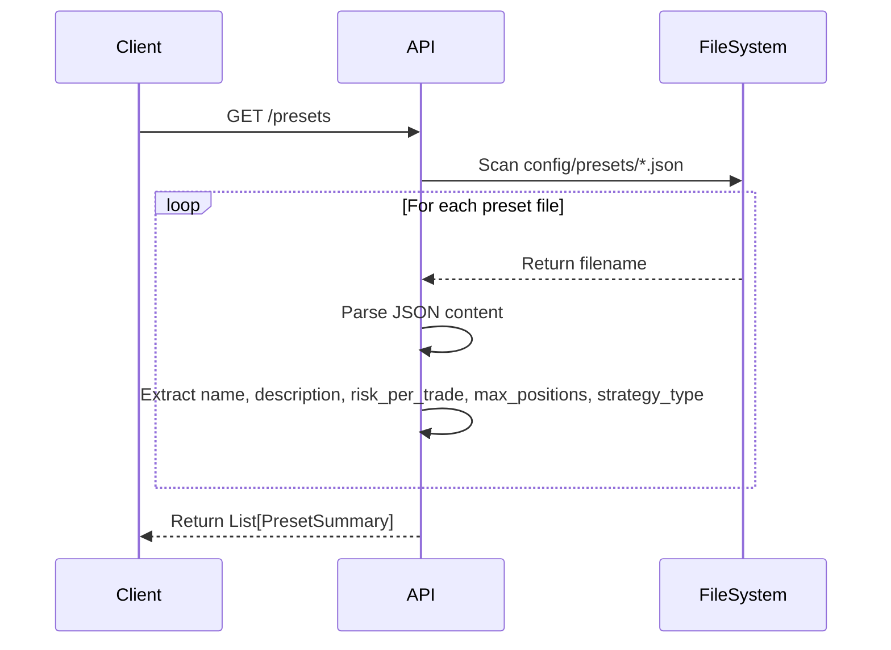
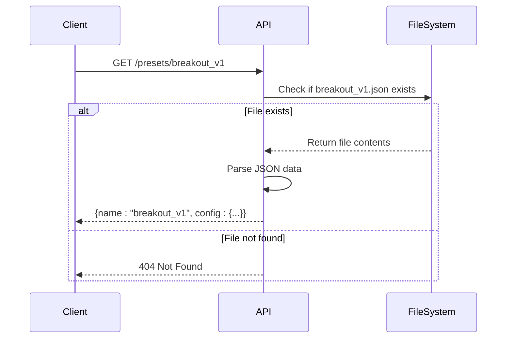
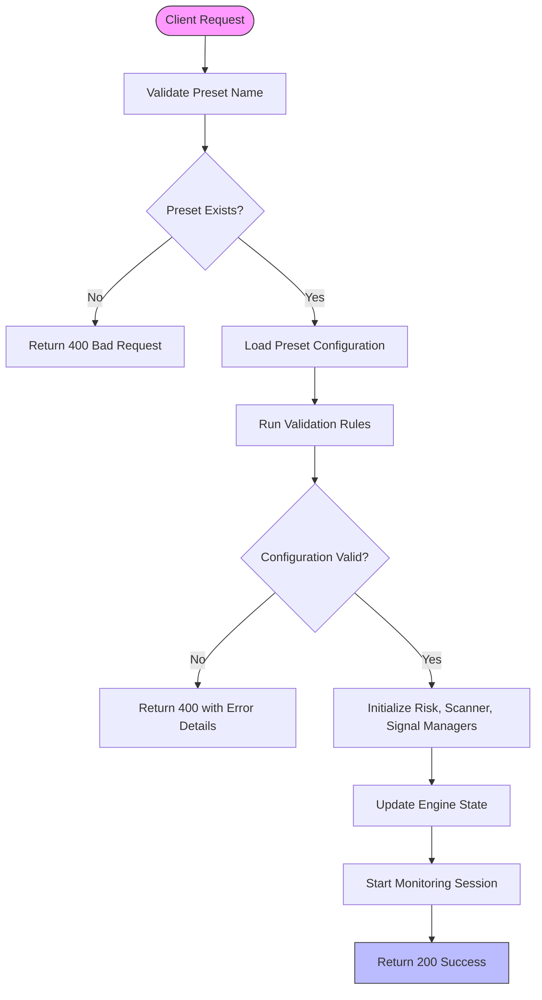
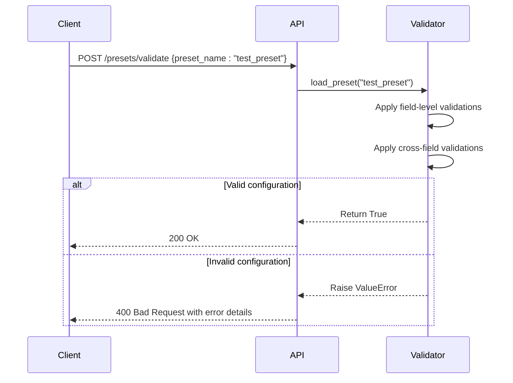
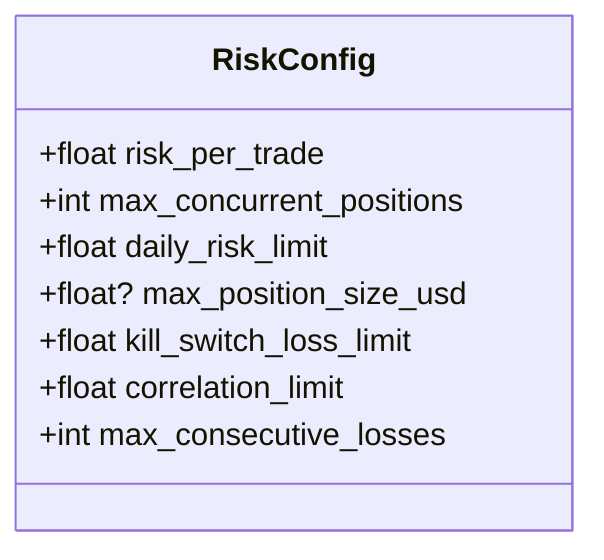
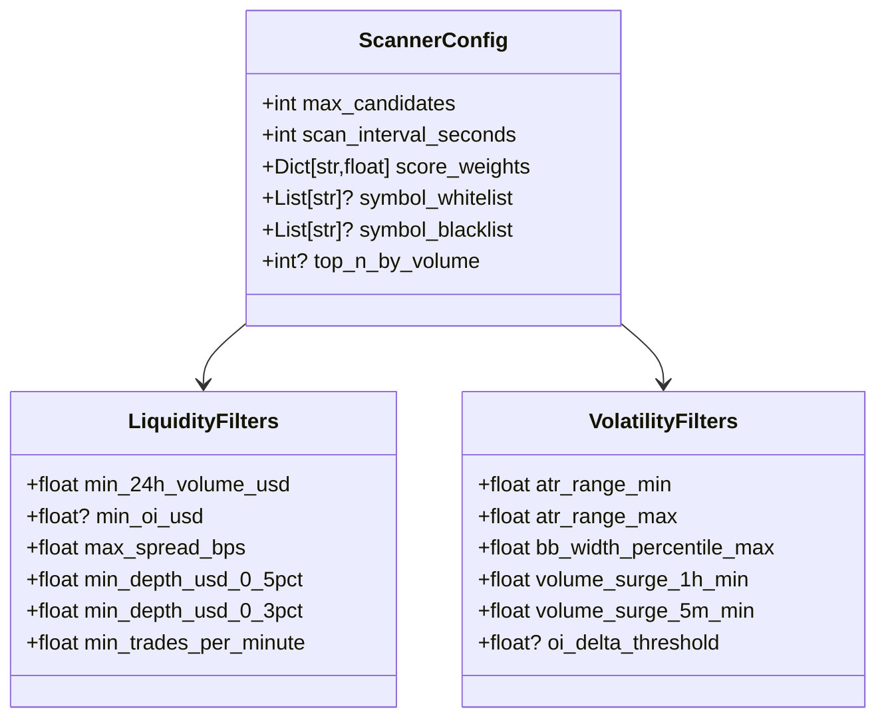
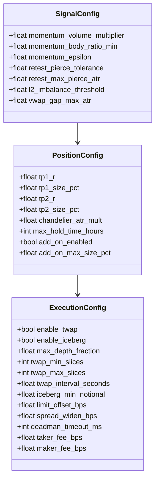
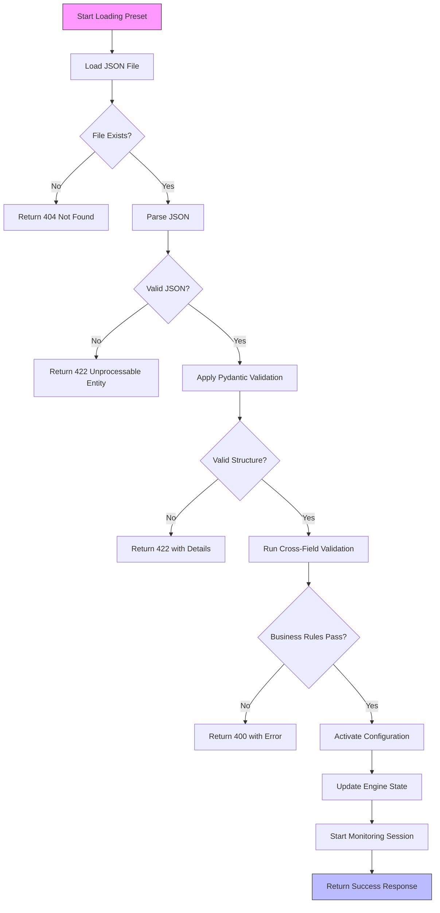
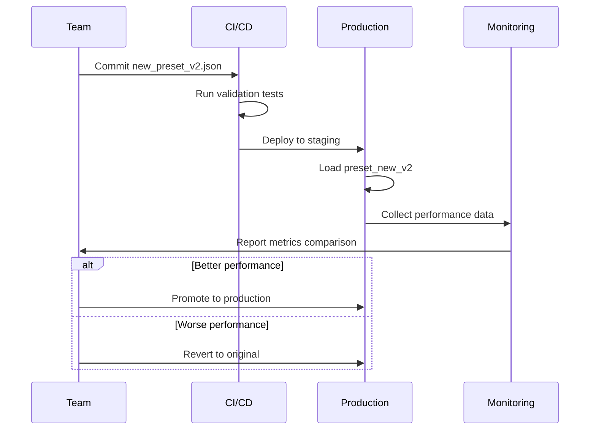

# Configuration Presets API

<cite>
**Referenced Files in This Document**   
- [presets.py](file://breakout_bot/api/routers/presets.py)
- [settings.py](file://breakout_bot/config/settings.py)
- [breakout_v1.json](file://breakout_bot/config/presets/breakout_v1.json)
- [swing_trading_pro.json](file://breakout_bot/config/presets/swing_trading_pro.json)
</cite>

## Table of Contents
1. [Introduction](#introduction)
2. [API Endpoints Overview](#api-endpoints-overview)
3. [Preset Schema Definition](#preset-schema-definition)
4. [Validation Rules](#validation-rules)
5. [Error Handling](#error-handling)
6. [Atomic Loading and Rollback](#atomic-loading-and-rollback)
7. [Use Cases](#use-cases)
8. [Security Considerations](#security-considerations)
9. [Integration Examples](#integration-examples)

## Introduction
The Configuration Presets API provides a comprehensive interface for managing trading strategy configurations through JSON-based presets. This system enables users to store, retrieve, validate, and activate predefined trading configurations that encapsulate strategy parameters, risk limits, scanner filters, and execution logic. The API serves as the foundation for dynamic configuration switching, A/B testing of strategies, and automated deployment workflows.

**Section sources**
- [presets.py](file://breakout_bot/api/routers/presets.py#L1-L10)

## API Endpoints Overview

### GET /presets - List Available Configurations
Retrieves a summary list of all available preset configurations from the `config/presets` directory. Returns an array of `PresetSummary` objects containing essential metadata for each preset.



**Diagram sources**
- [presets.py](file://breakout_bot/api/routers/presets.py#L26-L56)

### GET /presets/{name} - Retrieve Specific Preset
Fetches the complete configuration of a specific preset by name. Returns a `PresetConfig` object containing the full JSON configuration.



**Diagram sources**
- [presets.py](file://breakout_bot/api/routers/presets.py#L58-L84)

### POST /presets/load - Activate Preset
Activates a specified preset configuration, loading it into the trading engine. This endpoint triggers validation and initialization of all components according to the preset's specifications.



**Section sources**
- [engine.py](file://breakout_bot/api/routers/engine.py#L226-L258)

### POST /presets/validate - Syntax and Logic Checking
Validates a preset configuration against defined schema and business rules without activating it. This endpoint uses the same validation logic as the loading process but stops short of applying the configuration.



**Diagram sources**
- [settings.py](file://breakout_bot/config/settings.py#L325-L343)

## Preset Schema Definition
The preset configuration follows a structured JSON schema with multiple nested sections defining different aspects of the trading strategy.

### Core Structure
```json
{
  "name": "string",
  "description": "string",
  "target_markets": "string",
  "strategy_priority": "string",
  "risk": { /* RiskConfig */ },
  "liquidity_filters": { /* LiquidityFilters */ },
  "volatility_filters": { /* VolatilityFilters */ },
  "signal_config": { /* SignalConfig */ },
  "position_config": { /* PositionConfig */ },
  "scanner_config": { /* ScannerConfig */ },
  "execution_config": { /* ExecutionConfig */ }
}
```

### Risk Configuration
Defines risk management parameters for the trading strategy:



**Example from breakout_v1.json:**
```json
"risk": {
  "risk_per_trade": 0.015,
  "max_concurrent_positions": 3,
  "daily_risk_limit": 0.08,
  "max_position_size_usd": 60000,
  "kill_switch_loss_limit": 0.18,
  "correlation_limit": 0.4
}
```

**Section sources**
- [settings.py](file://breakout_bot/config/settings.py#L12-L35)
- [breakout_v1.json](file://breakout_bot/config/presets/breakout_v1.json#L10-L16)

### Scanner Filters
Specifies criteria for market scanning and candidate selection:



**Example from swing_trading_pro.json:**
```json
"scanner_config": {
  "max_candidates": 20,
  "scan_interval_seconds": 180,
  "score_weights": {
    "vol_surge": 0.25,
    "oi_delta": 0.25,
    "atr_quality": 0.25,
    "correlation": 0.15,
    "trades_per_minute": 0.10
  },
  "symbol_blacklist": [
    "USDT/USD", "USDC/USD", 
    "1000000BABYDOGE/USDT:USDT", "1000000CHEEMS/USDT:USDT"
  ],
  "top_n_by_volume": 100
}
```

**Section sources**
- [settings.py](file://breakout_bot/config/settings.py#L58-L119)
- [swing_trading_pro.json](file://breakout_bot/config/presets/swing_trading_pro.json#L48-L62)

### Strategy Parameters
Contains signal generation and position management settings:



**Section sources**
- [settings.py](file://breakout_bot/config/settings.py#L122-L294)

## Validation Rules
The system enforces both field-level and cross-field validation rules to ensure configuration integrity.

### Field-Level Validation
Each configuration field has specific constraints enforced through Pydantic validators:

- **Percentages**: Values between 0 and 1 (exclusive)
- **Positive values**: Must be greater than zero
- **Integer ranges**: Defined minimum and maximum bounds
- **Array sums**: Score weights should sum to approximately 1.0

### Cross-Field Validation
Additional business logic validations are applied:

```python
def validate_preset(preset: TradingPreset) -> bool:
    # Correlation limit must be between 0 and 1
    if preset.risk.correlation_limit < 0 or preset.risk.correlation_limit > 1:
        raise ValueError("Correlation limit must be between 0 and 1")
    
    # TP2 must be greater than TP1
    if preset.position_config.tp1_r >= preset.position_config.tp2_r:
        raise ValueError("TP2 must be greater than TP1")
    
    # Total TP size cannot exceed 100%
    total_tp_size = (preset.position_config.tp1_size_pct + 
                    preset.position_config.tp2_size_pct)
    if total_tp_size > 1.0:
        raise ValueError("Total TP size cannot exceed 100%")
    
    return True
```

**Section sources**
- [settings.py](file://breakout_bot/config/settings.py#L325-L343)

## Error Handling
The API returns standardized error responses for various failure scenarios:

| Status Code | Error Type | Description |
|-------------|------------|-------------|
| 400 | Bad Request | Invalid preset name or configuration |
| 404 | Not Found | Preset file does not exist |
| 422 | Unprocessable Entity | Invalid JSON structure |
| 500 | Internal Server Error | System-level failure during processing |

**Example Error Response:**
```json
{
  "detail": "Preset 'invalid_preset' not found at /app/config/presets/invalid_preset.json"
}
```

**Section sources**
- [presets.py](file://breakout_bot/api/routers/presets.py#L70-L74)
- [settings.py](file://breakout_bot/config/settings.py#L300-L303)

## Atomic Loading and Rollback
The preset loading mechanism ensures atomicity through a validation-first approach:



If any validation step fails, the loading process terminates before modifying the system state, ensuring no partial configuration is applied.

**Section sources**
- [settings.py](file://breakout_bot/config/settings.py#L346-L350)
- [engine.py](file://breakout_bot/api/routers/engine.py#L226-L258)

## Use Cases

### A/B Testing Strategies
The preset system facilitates A/B testing by allowing rapid switching between different strategy configurations:



### Dynamic Configuration Switching
Traders can switch between presets based on market conditions:

```python
# Example: Switch to conservative preset during high volatility
if market_volatility > threshold:
    requests.post("/api/presets/load", json={"preset": "conservative_strategy"})
else:
    requests.post("/api/presets/load", json={"preset": "aggressive_strategy"})
```

**Section sources**
- [engine.py](file://breakout_bot/api/routers/engine.py#L226-L258)

## Security Considerations
The system implements several security measures to protect against common vulnerabilities.

### Path Traversal Protection
The API prevents directory traversal attacks by validating preset names:

```python
# In get_preset function
preset_file = os.path.join(config_dir, f"{preset_name}.json")
if not os.path.exists(preset_file):
    raise HTTPException(status_code=404, detail=f"Preset '{preset_name}' not found")
```

This ensures only files within the designated presets directory can be accessed.

### Input Sanitization
All preset inputs undergo rigorous validation through Pydantic models, which automatically handle type conversion and constraint enforcement. The system also validates that:

- All numeric values are within acceptable ranges
- Array elements meet type requirements
- Object structures match expected schemas
- No unexpected fields are present

**Section sources**
- [presets.py](file://breakout_bot/api/routers/presets.py#L58-L84)
- [settings.py](file://breakout_bot/config/settings.py#L12-L366)

## Integration Examples

### CI/CD Pipeline for Automated Deployment
Automated strategy deployment using GitHub Actions:

```yaml
name: Deploy Trading Strategy
on:
  push:
    paths:
      - 'config/presets/**.json'

jobs:
  deploy:
    runs-on: ubuntu-latest
    steps:
    - name: Checkout code
      uses: actions/checkout@v2
      
    - name: Validate preset
      run: |
        python -c "
        from breakout_bot.config.settings import load_preset, validate_preset
        preset = load_preset('${{ github.event.repository.name }}')
        validate_preset(preset)
        print('✓ Preset validation passed')
        "
        
    - name: Deploy to production
      run: |
        curl -X POST ${{ secrets.API_ENDPOINT }}/api/presets/load \
          -H 'Authorization: Bearer ${{ secrets.API_TOKEN }}' \
          -H 'Content-Type: application/json' \
          -d '{"preset": \"${{ github.event.repository.name }}\"}'
```

### Frontend Integration
React component integration using React Query:

```typescript
export const useUpdatePreset = () => {
  const queryClient = useQueryClient();
  
  return useMutation({
    mutationFn: ({ name, config }: { name: string; config: Record<string, any> }) =>
      presetsApi.updatePreset(name, config),
    onSuccess: (_, { name }) => {
      // Invalidate caches
      queryClient.invalidateQueries({ queryKey: presetsKeys.preset(name) });
      queryClient.invalidateQueries({ queryKey: presetsKeys.list() });
    },
  });
};
```

**Section sources**
- [usePresets.ts](file://frontend/src/hooks/usePresets.ts#L25-L44)
- [Presets.tsx](file://frontend/src/pages/Presets.tsx#L1-L16)