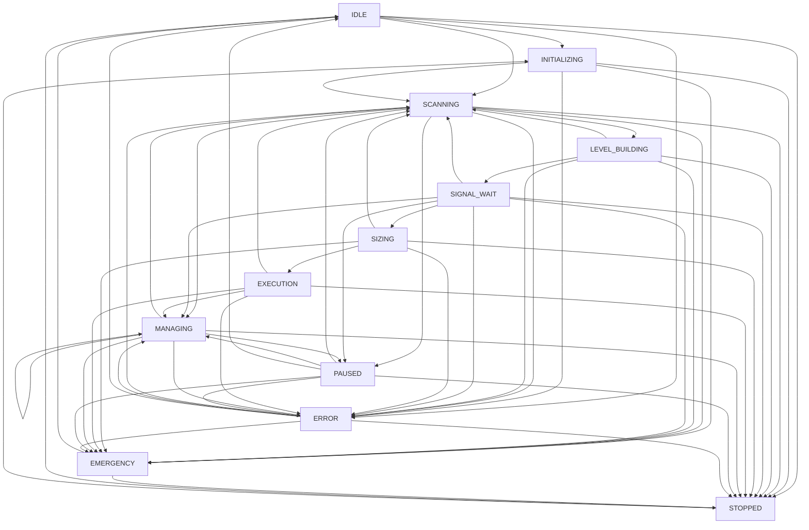

# Engine Control API

<cite>
**Referenced Files in This Document**
- [engine.py](file://breakout_bot/api/routers/engine.py)
- [state_machine.py](file://breakout_bot/core/state_machine.py)
- [middleware.py](file://breakout_bot/api/middleware.py)
- [core/engine.py](file://breakout_bot/core/engine.py)
</cite>

## Table of Contents
1. [Introduction](#introduction)
2. [Engine Status Endpoint](#engine-status-endpoint)
3. [Engine Start Endpoint](#engine-start-endpoint)
4. [Engine Stop Endpoint](#engine-stop-endpoint)
5. [Engine Pause and Resume Endpoints](#engine-pause-and-resume-endpoints)
6. [State Machine Integration](#state-machine-integration)
7. [Security Considerations](#security-considerations)
8. [Monitoring and Diagnostics](#monitoring-and-diagnostics)
9. [Troubleshooting Guide](#troubleshooting-guide)

## Introduction
The Engine Control API provides RESTful endpoints for managing the lifecycle of the trading engine in the Breakout Bot system. These endpoints allow users to start, stop, pause, resume, and monitor the engine's state through a well-defined interface. The API integrates with a State Machine pattern to ensure valid state transitions and provides comprehensive monitoring capabilities through diagnostic collectors and real-time WebSocket updates.

The core endpoints are implemented in `engine.py` and control an `OptimizedOrchestraEngine` instance that coordinates various trading components. All operations are designed to be idempotent where appropriate and include proper error handling and validation.

**Section sources**
- [engine.py](file://breakout_bot/api/routers/engine.py#L1-L544)

## Engine Status Endpoint
The `/engine/status` endpoint provides current information about the engine's operational state.

### HTTP Method
GET

### Request Parameters
None

### Response Schema (EngineStatus)
```json
{
  "state": "string",
  "preset": "string | null",
  "mode": "string",
  "startedAt": "string | null",
  "slots": "integer",
  "openPositions": "integer",
  "latencyMs": "integer",
  "dailyR": "number",
  "consecutiveLosses": "integer"
}
```

### Status Codes
- **200 OK**: Successfully retrieved engine status
- **500 Internal Server Error**: Failed to retrieve engine status due to internal error

### Example Response
```json
{
  "state": "SCANNING",
  "preset": "breakout_v1",
  "mode": "paper",
  "startedAt": "2025-09-22T10:30:45.123Z",
  "slots": 3,
  "openPositions": 1,
  "latencyMs": 48,
  "dailyR": 1.5,
  "consecutiveLosses": 0
}
```

### cURL Command
```bash
curl -X GET "http://localhost:8000/engine/status" \
     -H "Content-Type: application/json"
```

**Section sources**
- [engine.py](file://breakout_bot/api/routers/engine.py#L75-L116)

## Engine Start Endpoint
The `/engine/start` endpoint initializes and starts the trading engine with specified configuration.

### HTTP Method
POST

### Request Parameters
```json
{
  "preset": "string",
  "mode": "string"
}
```

| Parameter | Type | Required | Default | Description |
|---------|------|----------|---------|-------------|
| preset | string | Yes | N/A | Name of the trading preset configuration to use |
| mode | string | No | "paper" | Trading mode ("paper" or "live") |

### Response Schema
```json
{
  "success": "boolean",
  "message": "string",
  "timestamp": "string"
}
```

### Status Codes
- **200 OK**: Engine started successfully
- **400 Bad Request**: Invalid preset name or trading mode
- **500 Internal Server Error**: Failed to start engine due to internal error

### Valid Transitions
- IDLE → INITIALIZING → SCANNING (normal startup sequence)
- Multiple calls when already running are idempotent and return appropriate error

### Example Request
```json
{
  "preset": "breakout_v1",
  "mode": "paper"
}
```

### Example Response
```json
{
  "success": true,
  "message": "Optimized engine started with preset 'breakout_v1' in paper mode",
  "timestamp": "2025-09-22T10:30:45.123Z"
}
```

### cURL Command
```bash
curl -X POST "http://localhost:8000/engine/start" \
     -H "Content-Type: application/json" \
     -d '{"preset": "breakout_v1", "mode": "paper"}'
```

**Section sources**
- [engine.py](file://breakout_bot/api/routers/engine.py#L129-L230)

## Engine Stop Endpoint
The `/engine/stop` endpoint gracefully stops the trading engine and performs cleanup operations.

### HTTP Method
POST

### Request Parameters
None

### Response Schema
```json
{
  "success": "boolean",
  "message": "string",
  "timestamp": "string"
}
```

### Status Codes
- **200 OK**: Engine stopped successfully
- **400 Bad Request**: Engine is not initialized or not running
- **500 Internal Server Error**: Failed to stop engine due to internal error

### State Transition Semantics
- Any running state → STOPPED → IDLE
- Idempotent: multiple calls when already stopped return appropriate error
- Performs comprehensive cleanup including:
  - Cancelling background tasks
  - Stopping resource monitoring
  - Clearing engine instance
  - Ending monitoring sessions

### Example Response
```json
{
  "success": true,
  "message": "Engine stopped successfully",
  "timestamp": "2025-09-22T10:35:22.456Z"
}
```

### cURL Command
```bash
curl -X POST "http://localhost:8000/engine/stop" \
     -H "Content-Type: application/json"
```

**Section sources**
- [engine.py](file://breakout_bot/api/routers/engine.py#L231-L320)

## Engine Pause and Resume Endpoints
These endpoints provide fine-grained control over the engine's execution state.

### Pause Endpoint (/engine/pause)
Pauses the engine while preserving its state.

#### HTTP Method
POST

#### Response Schema
Same as other command endpoints

#### Status Codes
- **200 OK**: Engine paused successfully
- **400 Bad Request**: Engine is not initialized
- **500 Internal Server Error**: Failed to pause engine

#### State Transition
- Running states → PAUSED
- Idempotent: calling on already paused engine has no effect

#### cURL Command
```bash
curl -X POST "http://localhost:8000/engine/pause" \
     -H "Content-Type: application/json"
```

### Resume Endpoint (/engine/resume)
Resumes the engine from a paused state.

#### HTTP Method
POST

#### Response Schema
Same as other command endpoints

#### Status Codes
- **200 OK**: Engine resumed successfully
- **400 Bad Request**: Engine is not initialized or not paused
- **500 Internal Server Error**: Failed to resume engine

#### State Transition
- PAUSED → SCANNING (resumes normal operation)
- Idempotent: calling on non-paused engine returns appropriate error

#### cURL Command
```bash
curl -X POST "http://localhost:8000/engine/resume" \
     -H "Content-Type: application/json"
```

**Section sources**
- [engine.py](file://breakout_bot/api/routers/engine.py#L478-L491)

## State Machine Integration
The engine control endpoints integrate with a State Machine pattern implemented in `state_machine.py` to ensure valid state transitions and maintain system integrity.


**Diagram sources**
- [state_machine.py](file://breakout_bot/core/state_machine.py#L1-L350)
- [core/engine.py](file://breakout_bot/core/engine.py#L58-L1143)

### Valid State Transitions
The State Machine enforces the following valid transitions:



**Diagram sources**
- [state_machine.py](file://breakout_bot/core/state_machine.py#L1-L350)

### Idempotency Guarantees
All engine control operations are designed to be idempotent:
- Starting an already running engine returns a 400 error with descriptive message
- Stopping an already stopped engine returns a 400 error
- Pausing an already paused engine has no effect
- Resuming a non-paused engine returns a 400 error

This ensures predictable behavior when commands are retried due to network issues or other transient failures.

### Error Conditions
Invalid state changes are prevented by the State Machine:
- Direct transitions to terminal states (EMERGENCY, STOPPED) only allowed from specific states
- Transitions that would bypass initialization sequence are blocked
- State transitions are atomic and thread-safe using asyncio locks

**Section sources**
- [state_machine.py](file://breakout_bot/core/state_machine.py#L1-L350)
- [core/engine.py](file://breakout_bot/core/engine.py#L58-L1143)

## Security Considerations
The Engine Control API implements several security measures to protect the trading system.

### Authentication Requirements
While authentication implementation details are not visible in the provided code, the system is designed to integrate with authentication middleware. Access to engine control endpoints should be restricted to authorized users only.

### Rate Limiting
Rate limiting is implemented through middleware to prevent abuse of the API endpoints:


**Diagram sources**
- [middleware.py](file://breakout_bot/api/middleware.py#L1-L59)

### Input Validation
All endpoints perform strict input validation:
- `/engine/start` validates preset names against available configurations
- Trading mode must be either "paper" or "live"
- Invalid inputs result in 400 Bad Request responses with descriptive error messages

### Error Handling
Comprehensive error handling is implemented:
- All exceptions are caught and converted to appropriate HTTP error responses
- Detailed error logging without exposing sensitive information to clients
- Graceful degradation when components fail

**Section sources**
- [middleware.py](file://breakout_bot/api/middleware.py#L1-L59)
- [engine.py](file://breakout_bot/api/routers/engine.py#L1-L544)

## Monitoring and Diagnostics
The engine control system provides extensive monitoring and diagnostic capabilities.

### Diagnostic Collector Integration
The engine integrates with a diagnostics collector for comprehensive monitoring:


**Diagram sources**
- [core/engine.py](file://breakout_bot/core/engine.py#L58-L1143)

### Real-time Updates via WebSocket
The system provides real-time updates through WebSocket connections:
- State transitions are broadcast to all connected clients
- Performance metrics are updated in real-time
- Error notifications are pushed immediately
- Resource health status is monitored continuously

When the engine state changes, a WebSocket message is sent with the transition details, allowing UI components to update immediately without polling.

### Performance Metrics
The `/engine/metrics` endpoint provides detailed performance information:

```json
{
  "uptime": 3600,
  "cycleCount": 720,
  "avgLatencyMs": 47.5,
  "totalSignals": 45,
  "totalTrades": 12,
  "dailyPnlR": 1.8,
  "maxDrawdownR": -0.5
}
```

These metrics are collected and aggregated by the `MonitoringManager` and `DiagnosticsCollector` components.

**Section sources**
- [core/engine.py](file://breakout_bot/core/engine.py#L58-L1143)
- [engine.py](file://breakout_bot/api/routers/engine.py#L117-L150)

## Troubleshooting Guide
This section provides guidance for common issues encountered with the engine control system.

### Failed Startup Issues
**Symptoms**: Engine fails to start with 500 Internal Server Error

**Common Causes and Solutions**:
- **Invalid preset name**: Verify the preset exists in the config/presets directory
- **Missing API keys**: For live trading, ensure exchange API credentials are configured
- **Resource constraints**: Check system resources (CPU, memory) and adjust limits if needed
- **Network connectivity**: Ensure the system can connect to the exchange API

**Diagnostic Steps**:
1. Check server logs for detailed error messages
2. Verify the requested preset file exists and is valid JSON
3. Test basic connectivity to the exchange API
4. Validate system meets minimum resource requirements

### Unresponsive Controls
**Symptoms**: Engine control commands timeout or have no effect

**Common Causes and Solutions**:
- **State machine deadlock**: Restart the application to clear any stuck states
- **High system load**: Monitor resource usage and optimize if necessary
- **WebSocket connection issues**: Check network connectivity and firewall settings
- **Background task blocking**: Review recent code changes for synchronous operations in async context

**Diagnostic Steps**:
1. Check `/engine/status` endpoint to verify current state
2. Monitor resource usage with `/engine/resource-health`
3. Review logs for any error messages or warnings
4. Attempt to restart the engine completely

### State Transition Errors
**Symptoms**: Invalid state transitions or unexpected state changes

**Common Causes and Solutions**:
- **Concurrent access**: Ensure only one client controls the engine at a time
- **Timing issues**: Add appropriate delays between consecutive commands
- **External triggers**: Check for automated systems sending conflicting commands

**Best Practices**:
- Always check current state before issuing commands
- Implement retry logic with exponential backoff for transient failures
- Use the `/engine/commands` endpoint to determine available actions
- Monitor state transitions through WebSocket for immediate feedback

### General Debugging Tips
- Enable debug logging to get more detailed information
- Use the `/engine/resource-health` endpoint to check system health
- Monitor the engine metrics to identify performance bottlenecks
- Check the diagnostics collector output for comprehensive system insights
- Review the complete state transition history for troubleshooting complex issues

**Section sources**
- [engine.py](file://breakout_bot/api/routers/engine.py#L1-L544)
- [core/engine.py](file://breakout_bot/core/engine.py#L58-L1143)
- [state_machine.py](file://breakout_bot/core/state_machine.py#L1-L350)