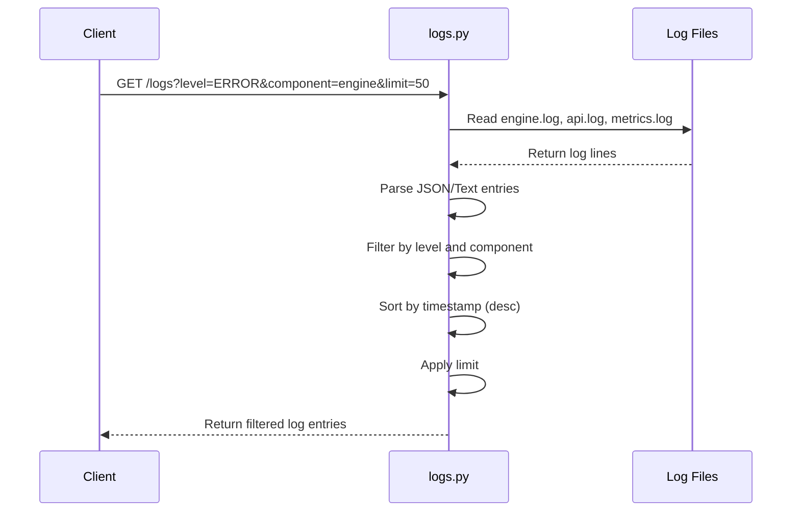
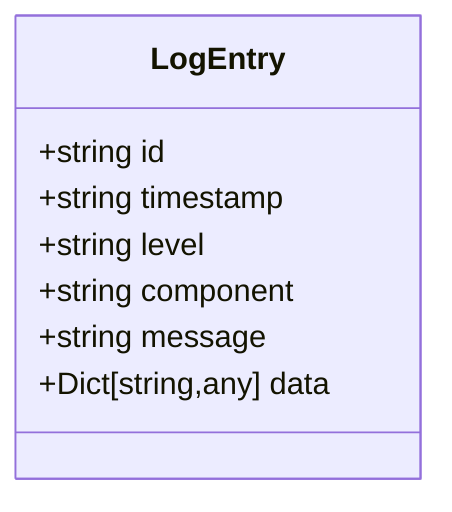
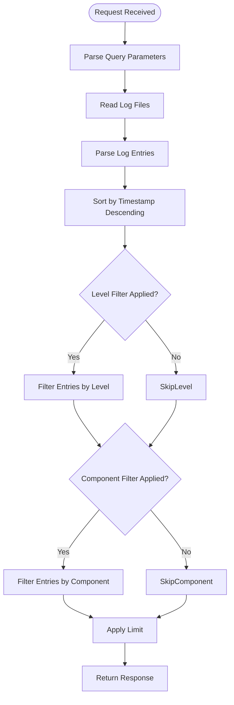
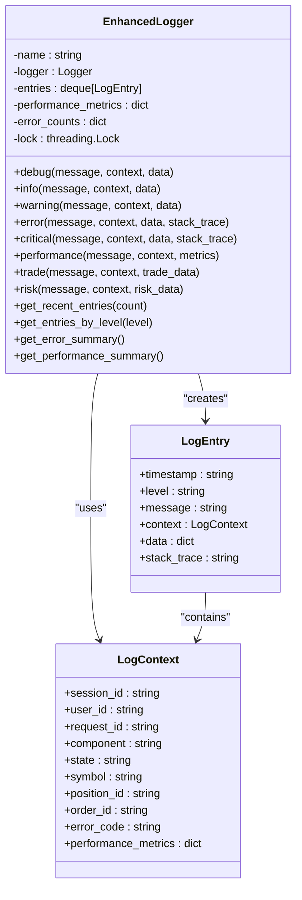
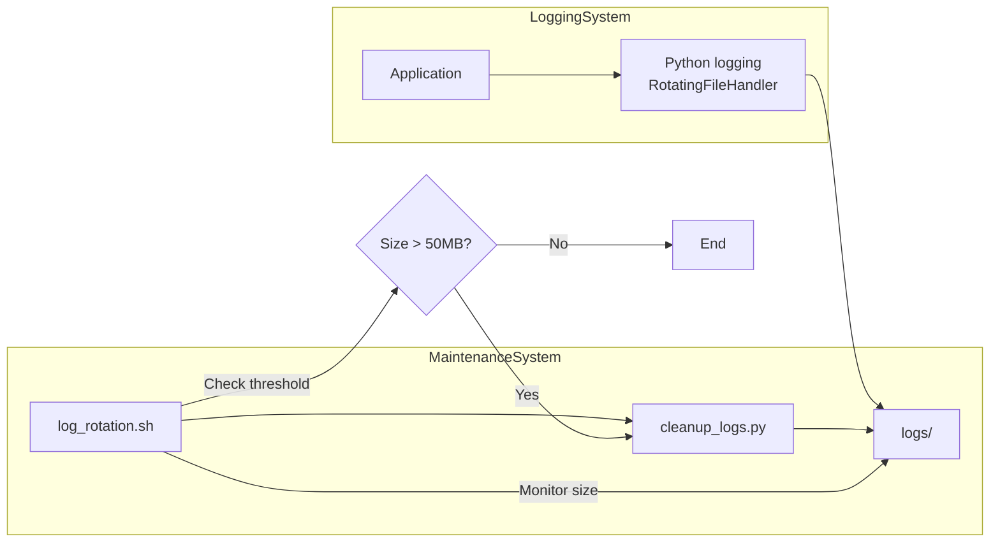
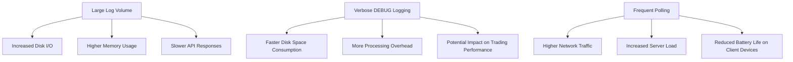

# Logs API

<cite>
**Referenced Files in This Document**   
- [logs.py](file://breakout_bot/api/routers/logs.py)
- [enhanced_logger.py](file://breakout_bot/utils/enhanced_logger.py)
- [log_config.py](file://breakout_bot/utils/log_config.py)
- [log_rotation.sh](file://scripts/log_rotation.sh)
- [cleanup_logs.py](file://cleanup_logs.py)
</cite>

## Table of Contents
1. [Introduction](#introduction)
2. [GET /logs Endpoint](#get-logs-endpoint)
3. [Response Format](#response-format)
4. [Filtering Parameters](#filtering-parameters)
5. [Integration with Enhanced Logger](#integration-with-enhanced-logger)
6. [Log Rotation Mechanism](#log-rotation-mechanism)
7. [Pagination and Performance](#pagination-and-performance)
8. [Example Queries](#example-queries)
9. [Retention Policies and Disk Space](#retention-policies-and-disk-space)
10. [Correlation with WebSocket Events](#correlation-with-websocket-events)
11. [Access Control and Data Redaction](#access-control-and-data-redaction)

## Introduction
The Logs API provides programmatic access to system logs generated by the Breakout Bot Trading System. It enables monitoring, debugging, and analysis of trading operations through structured log retrieval with filtering capabilities. The API integrates with a hierarchical logging system and supports real-time diagnostics for both development and production environments.

## GET /logs Endpoint
The `GET /logs` endpoint retrieves system logs from multiple log files, including engine.log, api.log, and metrics.log. The endpoint reads log entries, parses both structured JSON and plain text formats, applies filters based on query parameters, sorts results by timestamp (newest first), and returns paginated responses.



**Diagram sources**
- [logs.py](file://breakout_bot/api/routers/logs.py#L0-L121)

**Section sources**
- [logs.py](file://breakout_bot/api/routers/logs.py#L0-L121)

## Response Format
The API returns log entries in a standardized JSON format containing the following fields:
- **id**: Unique identifier combining filename and line number
- **timestamp**: ISO 8601 formatted timestamp string
- **level**: Log severity level (DEBUG, INFO, WARNING, ERROR, CRITICAL, PERFORMANCE, TRADE, RISK)
- **component**: Source component generating the log
- **message**: Human-readable log message
- **data**: Optional structured data payload

The response is an array of LogEntry objects sorted by timestamp in descending order (newest first).



**Diagram sources**
- [logs.py](file://breakout_bot/api/routers/logs.py#L14-L20)
- [enhanced_logger.py](file://breakout_bot/utils/enhanced_logger.py#L62-L69)

**Section sources**
- [logs.py](file://breakout_bot/api/routers/logs.py#L14-L20)
- [enhanced_logger.py](file://breakout_bot/utils/enhanced_logger.py#L62-L69)

## Filtering Parameters
The API supports three query parameters for filtering log entries:

| Parameter | Values | Description |
|---------|--------|-------------|
| level | DEBUG, INFO, WARNING, ERROR, CRITICAL, PERFORMANCE, TRADE, RISK | Filter logs by severity level |
| component | engine, api, metrics, scanner, risk, exchange, core | Filter logs by source component |
| limit | Integer (default: 100) | Maximum number of log entries to return |

Filters are applied sequentially: first by level, then by component, and finally limited by count. The component filter performs case-insensitive substring matching, allowing partial matches (e.g., "eng" matches "engine").



**Diagram sources**
- [logs.py](file://breakout_bot/api/routers/logs.py#L105-L121)

**Section sources**
- [logs.py](file://breakout_bot/api/routers/logs.py#L105-L121)

## Integration with Enhanced Logger
The Logs API integrates with the enhanced_logger.py system which provides structured logging with context awareness. The EnhancedLogger class captures detailed context information including session_id, user_id, request_id, component, state, symbol, position_id, order_id, and error_code.

The logger supports custom log levels beyond standard ones:
- **PERFORMANCE_LEVEL** (25): Between INFO and WARNING
- **TRADE_LEVEL** (26): Trade-specific events
- **RISK_LEVEL** (27): Risk management events

Log entries are stored in a thread-safe deque with configurable maximum size (default: 10,000 entries). The system maintains performance metrics and error counts for real-time monitoring and analysis.



**Diagram sources**
- [enhanced_logger.py](file://breakout_bot/utils/enhanced_logger.py#L72-L108)

**Section sources**
- [enhanced_logger.py](file://breakout_bot/utils/enhanced_logger.py#L72-L108)

## Log Rotation Mechanism
Log rotation is handled by a combination of Python's RotatingFileHandler and a bash script (log_rotation.sh). The system implements size-based and time-based rotation policies to prevent unbounded log growth.

The log_config.py module configures rotating file handlers with:
- Maximum file size: 5-10MB depending on environment
- Backup count: 3-5 rotated files
- Automatic cleanup of old logs after 7 days

The log_rotation.sh script runs periodically to monitor log directory size and trigger cleanup when thresholds are exceeded. It calls cleanup_logs.py to remove logs older than the retention period.



**Diagram sources**
- [log_config.py](file://breakout_bot/utils/log_config.py#L44-L80)
- [log_rotation.sh](file://scripts/log_rotation.sh#L0-L34)
- [cleanup_logs.py](file://cleanup_logs.py#L0-L53)

**Section sources**
- [log_config.py](file://breakout_bot/utils/log_config.py#L44-L80)
- [log_rotation.sh](file://scripts/log_rotation.sh#L0-L34)
- [cleanup_logs.py](file://cleanup_logs.py#L0-L53)

## Pagination and Performance
The API implements pagination through the limit parameter (default: 100, maximum: 1000 via frontend). For large log files, the system reads only the most recent lines (limit * 2) to improve performance and reduce memory usage.

Performance implications:
- Reading very large log files can impact API response time
- Verbose DEBUG logging increases disk I/O and storage requirements
- Complex filtering operations on large datasets consume CPU resources
- Frequent polling creates additional load on the system

The frontend (Logs.tsx) automatically refreshes logs every 10 seconds using React Query, which may generate consistent load during active monitoring sessions.



**Section sources**
- [logs.py](file://breakout_bot/api/routers/logs.py#L57-L80)
- [useLogs.ts](file://frontend/src/hooks/useLogs.ts#L0-L22)

## Example Queries
Common use cases and example queries for troubleshooting and analysis:

### Debugging Startup Issues
Retrieve recent error messages from the engine component during startup:
```
GET /logs?level=ERROR&component=engine&limit=50
```

Identify initialization sequence and timing:
```
GET /logs?component=engine&level=INFO&limit=100
```

### Analyzing Signal Rejection Patterns
Investigate why signals are being rejected by the risk manager:
```
GET /logs?component=risk&message=rejected&limit=100
```

Trace signal processing flow across components:
```
GET /logs?component=scanner&message=signal&limit=200
```

Monitor filter evaluation diagnostics:
```
GET /logs?component=scanner&level=DEBUG&limit=50
```

## Retention Policies and Disk Space
The system implements multi-layer retention policies:

1. **In-memory retention**: Recent logs maintained in EnhancedLogger's deque (configurable up to 10,000 entries)
2. **File-based retention**: 
   - Daily automatic cleanup of logs older than 7 days
   - Size-limited log files (5-10MB each)
   - Up to 5 backup files per log type

3. **Disk space monitoring**: 
   - Alert threshold at 50MB total log size
   - Automatic cleanup triggered when threshold is exceeded
   - Regular statistics reporting on log volume

The log_rotation.sh script monitors total log directory size and triggers cleanup when it exceeds 50MB, helping prevent disk space exhaustion in production environments.

**Section sources**
- [log_rotation.sh](file://scripts/log_rotation.sh#L0-L34)
- [log_config.py](file://breakout_bot/utils/log_config.py#L133-L190)
- [cleanup_logs.py](file://cleanup_logs.py#L0-L53)

## Correlation with WebSocket Events
Log entries can be correlated with WebSocket events for comprehensive system monitoring. The WebSocket connection (/ws/) provides real-time updates including:
- HEARTBEAT messages every 30 seconds
- ENGINE_UPDATE state changes
- Order execution events
- Position updates

By comparing timestamps between log entries and WebSocket messages, operators can trace the complete sequence of events during trading operations, identify latency issues, and debug synchronization problems between components.

The correlation workflow:
1. Identify relevant log entries around specific timestamps
2. Cross-reference with WebSocket message history
3. Analyze timing relationships between system events
4. Identify potential bottlenecks or race conditions

**Section sources**
- [websocket.py](file://breakout_bot/api/websocket.py#L57-L92)
- [useWebSocketStore.ts](file://frontend/src/store/useWebSocketStore.ts#L0-L62)

## Access Control and Data Redaction
The current implementation does not include explicit access control for the Logs API, making all log data accessible to authenticated users. However, sensitive information handling is addressed through:

1. **Credential protection**: API credentials are excluded from public data access methods
2. **PII redaction**: Personal Identifiable Information should be avoided in log messages
3. **Data minimization**: Only essential information included in logs

Recommended security enhancements:
- Implement role-based access control for sensitive log types
- Add automatic redaction of API keys and secrets in log output
- Encrypt log files containing sensitive information
- Implement audit logging for log access attempts

The system currently lacks automated PII detection and redaction, requiring developers to manually ensure compliance with data protection regulations when logging user-related information.

**Section sources**
- [exchange_client.py](file://breakout_bot/exchange/exchange_client.py#L416)
- [logs.py](file://breakout_bot/api/routers/logs.py#L0-L121)