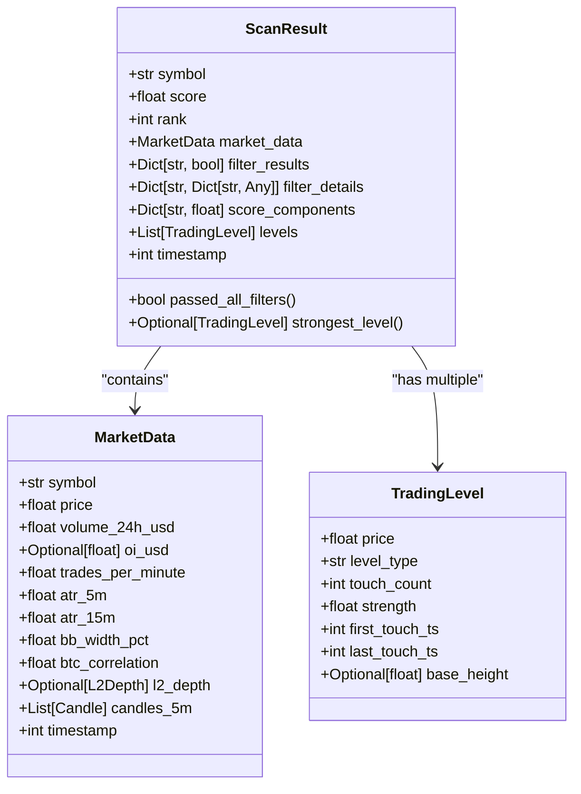
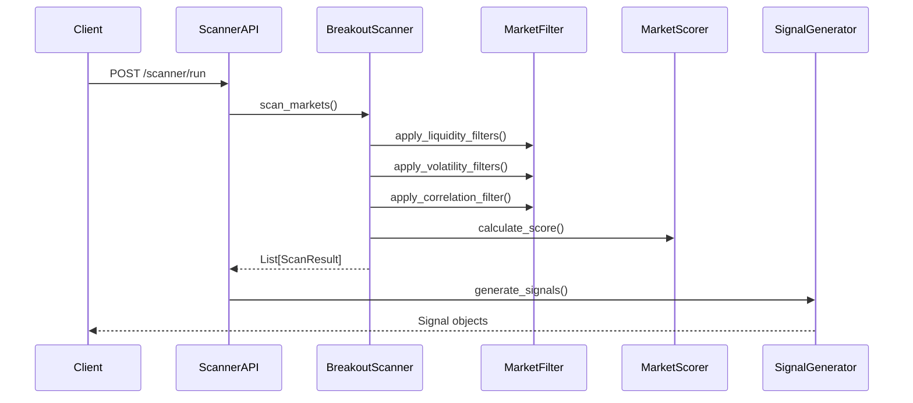
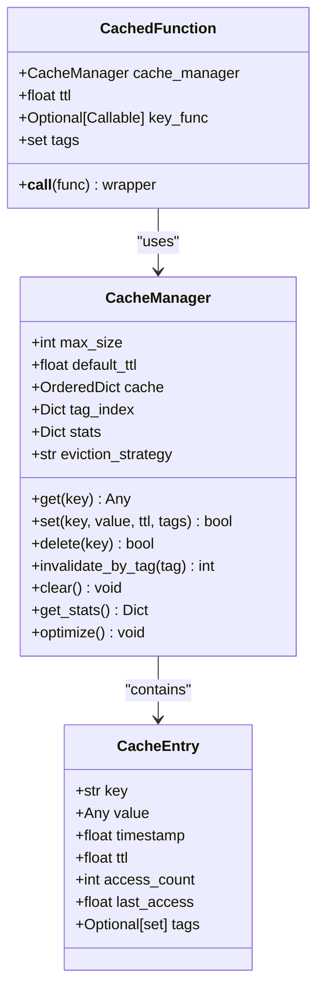

# Market Scanner API

<cite>
**Referenced Files in This Document **  
- [scanner.py](file://breakout_bot/api/routers/scanner.py)
- [market_scanner.py](file://breakout_bot/scanner/market_scanner.py)
- [signal_generator.py](file://breakout_bot/signals/signal_generator.py)
- [cache_manager.py](file://breakout_bot/utils/cache_manager.py)
- [models.py](file://breakout_bot/data/models.py)
</cite>

## Table of Contents
1. [Introduction](#introduction)
2. [API Endpoints](#api-endpoints)
3. [Response Structure](#response-structure)
4. [Scanning Pipeline Integration](#scanning-pipeline-integration)
5. [Caching and Performance](#caching-and-performance)
6. [Use Cases](#use-cases)
7. [Error Handling](#error-handling)
8. [Example Responses](#example-responses)

## Introduction
The Market Scanner API provides endpoints for retrieving scan results, triggering ad-hoc scans, and accessing current scanning configuration. It integrates with the market scanner's filtering pipeline and signal generator to identify breakout candidates based on liquidity, volatility, and correlation metrics.

**Section sources**
- [scanner.py](file://breakout_bot/api/routers/scanner.py#L0-L239)

## API Endpoints

### GET /scanner/candidates
Retrieves the most recent scan results with optional filtering parameters.

**Query Parameters:**
- `limit` (integer): Maximum number of candidates to return (default: 10)
- `min_volume` (float): Minimum 24-hour trading volume filter
- `max_correlation` (float): Maximum absolute BTC correlation threshold

This endpoint returns a snapshot of the last completed scan, including candidate symbols, scores, and metadata. Results are filtered according to the specified criteria.

### POST /scanner/run
Triggers an ad-hoc market scan using the specified preset configuration.

**Request Body:**
```json
{
  "preset": "string",
  "limit": "integer",
  "symbols": ["string"]
}
```

- `preset`: Name of the trading preset to use for scanning
- `limit`: Maximum number of results to return
- `symbols`: Optional list of specific symbols to scan

The scan executes immediately and returns status information upon completion. Due to computational intensity, frequent scanning should be avoided.

### GET /scanner/config
Retrieves the current scanning parameters and configuration settings used by the market scanner.

Returns configuration details including:
- Liquidity filters (minimum volume, OI, depth)
- Volatility filters (ATR range, BB width, volume surge thresholds)
- Correlation limits
- Scoring weights
- Symbol whitelist/blacklist

**Section sources**
- [scanner.py](file://breakout_bot/api/routers/scanner.py#L74-L178)

## Response Structure

### ScanResult Fields
Each candidate in the response contains the following fields:

- `symbol`: Trading pair symbol (e.g., "BTC/USDT")
- `volume_score`: Normalized score based on volume surge metrics
- `volatility_score`: Score derived from ATR quality and Bollinger Band width
- `correlation_score`: Score based on BTC correlation (moderate correlation preferred)
- `composite_rank`: Overall ranking combining all score components

The composite ranking is calculated using weighted scoring with configurable weights defined in the trading preset.



**Diagram sources **
- [models.py](file://breakout_bot/data/models.py#L331-L363)
- [market_scanner.py](file://breakout_bot/scanner/market_scanner.py#L0-L787)

**Section sources**
- [models.py](file://breakout_bot/data/models.py#L331-L363)

## Scanning Pipeline Integration

### Filtering Pipeline
The market scanner implements a multi-stage filtering process through the `BreakoutScanner` class:

1. **Symbol Filters**: Applies whitelist/blacklist rules
2. **Liquidity Filters**: Validates minimum volume, open interest, spread, and order book depth
3. **Volatility Filters**: Checks ATR ratio, Bollinger Band width, and volume surge thresholds
4. **Correlation Filter**: Ensures BTC correlation remains within acceptable bounds

Each filter produces diagnostic information stored in the `filter_details` field of the ScanResult.

### Signal Evaluation
After scanning, candidates are evaluated by the `SignalGenerator` which uses:

- **Momentum Strategy**: Detects breakouts with volume confirmation
- **Retest Strategy**: Identifies pullbacks to previously broken levels

The signal generator analyzes candle patterns, L2 imbalance, VWAP gaps, and trading activity to validate entry conditions.



**Diagram sources **
- [market_scanner.py](file://breakout_bot/scanner/market_scanner.py#L0-L787)
- [signal_generator.py](file://breakout_bot/signals/signal_generator.py#L0-L829)

**Section sources**
- [market_scanner.py](file://breakout_bot/scanner/market_scanner.py#L0-L787)
- [signal_generator.py](file://breakout_bot/signals/signal_generator.py#L0-L829)

## Caching and Performance

### Cache Manager
The system utilizes a sophisticated caching mechanism via `CacheManager` with:

- LRU/LFU/TTL eviction strategies
- Thread-safe operations
- Tag-based invalidation
- Memory usage monitoring

Caching improves performance by storing expensive calculations like ATR values, correlation coefficients, and level detection results.

### Performance Characteristics
- **Scan Duration**: Typically 15-45 seconds depending on market count
- **Resource Usage**: CPU-intensive due to technical indicator calculations
- **Rate Limiting**: Built-in protection against excessive scan triggers
- **Batch Processing**: Markets scanned in batches of 5 for optimal performance

The cache manager automatically optimizes memory usage and removes expired entries to maintain system stability during continuous operation.



**Diagram sources **
- [cache_manager.py](file://breakout_bot/utils/cache_manager.py#L0-L345)

**Section sources**
- [cache_manager.py](file://breakout_bot/utils/cache_manager.py#L0-L345)

## Use Cases

### External Strategy Validation
Monitoring tools can use the scanner API to:

- Validate strategy effectiveness across different market conditions
- Compare performance between presets
- Track filter pass rates and adjustment needs
- Monitor scoring consistency over time

### Dashboard Integration
The API supports real-time dashboard displays showing:

- Top candidates with composite rankings
- Filter statistics (total scanned vs. passed)
- Historical scan trends
- Market health indicators

Frontend applications poll the `/scanner/candidates` endpoint every 30 seconds to update displays while respecting rate limits.

**Section sources**
- [scanner.py](file://breakout_bot/api/routers/scanner.py#L37-L72)
- [useScanner.ts](file://frontend/src/hooks/useScanner.ts#L0-L33)

## Error Handling
The scanner implements comprehensive error handling for exchange connectivity issues:

- Graceful degradation when market data is unavailable
- Partial result return when some symbols fail to scan
- Detailed error logging with diagnostics collection
- Empty result sets returned for complete failures

Exchange connectivity problems trigger warnings in the monitoring system and are recorded in the diagnostics collector for analysis.

**Section sources**
- [scanner.py](file://breakout_bot/api/routers/scanner.py#L99-L117)
- [market_scanner.py](file://breakout_bot/scanner/market_scanner.py#L0-L787)

## Example Responses

### Successful Scan Results
```json
{
  "timestamp": "2025-09-22T15:30:45Z",
  "candidates": [
    {
      "symbol": "ETH/USDT",
      "score": 0.87,
      "filters": {
        "min_24h_volume": true,
        "max_spread": true,
        "volume_surge_1h": true
      },
      "metrics": {
        "volume_24h_usd": 85000000,
        "spread_bps": 2.5,
        "vol_surge_1h": 3.2
      },
      "levels": [
        {
          "price": 1850.50,
          "level_type": "resistance",
          "strength": 0.92
        }
      ]
    }
  ],
  "totalScanned": 120,
  "passedFilters": 8,
  "summary": {
    "session_id": "scan_20250922_1530",
    "preset": "high_liquidity_top30",
    "state": "completed"
  }
}
```

### Scan Trigger Response
```json
{
  "success": true,
  "message": "Market scan completed with preset 'high_liquidity_top30'. Found 8 candidates.",
  "timestamp": "2025-09-22T15:30:45Z"
}
```

**Section sources**
- [scanner.py](file://breakout_bot/api/routers/scanner.py#L0-L239)