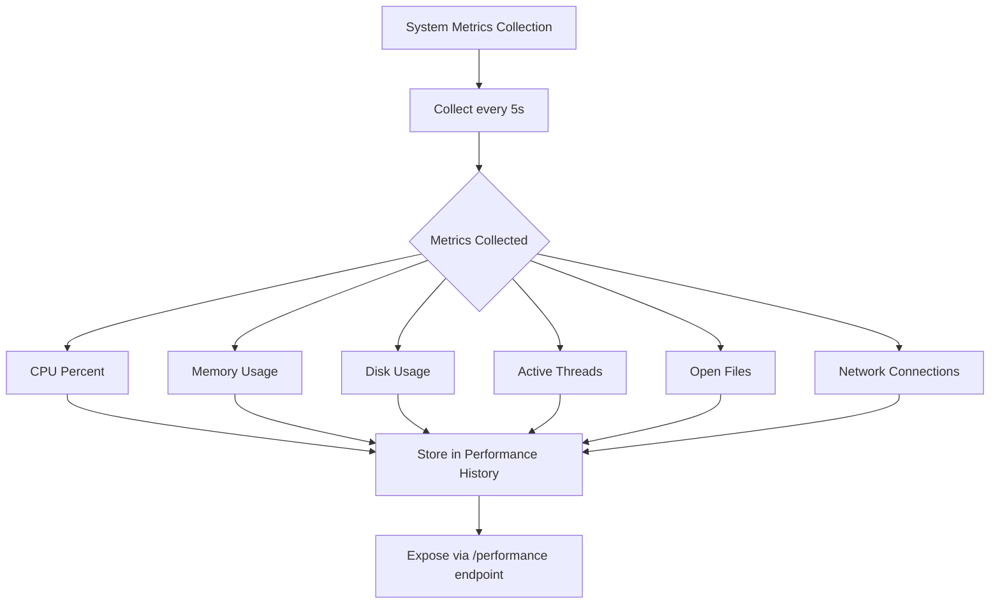
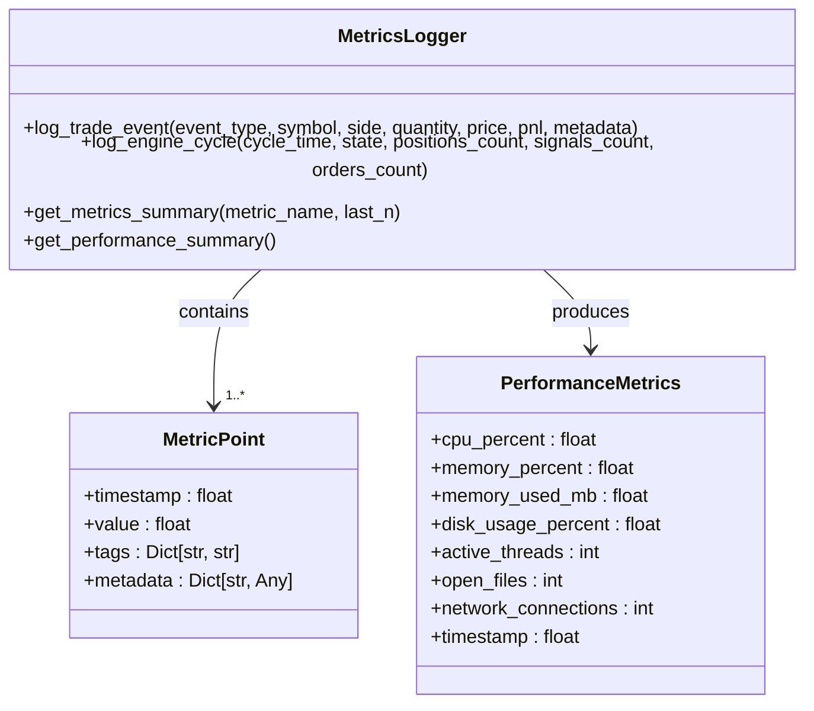
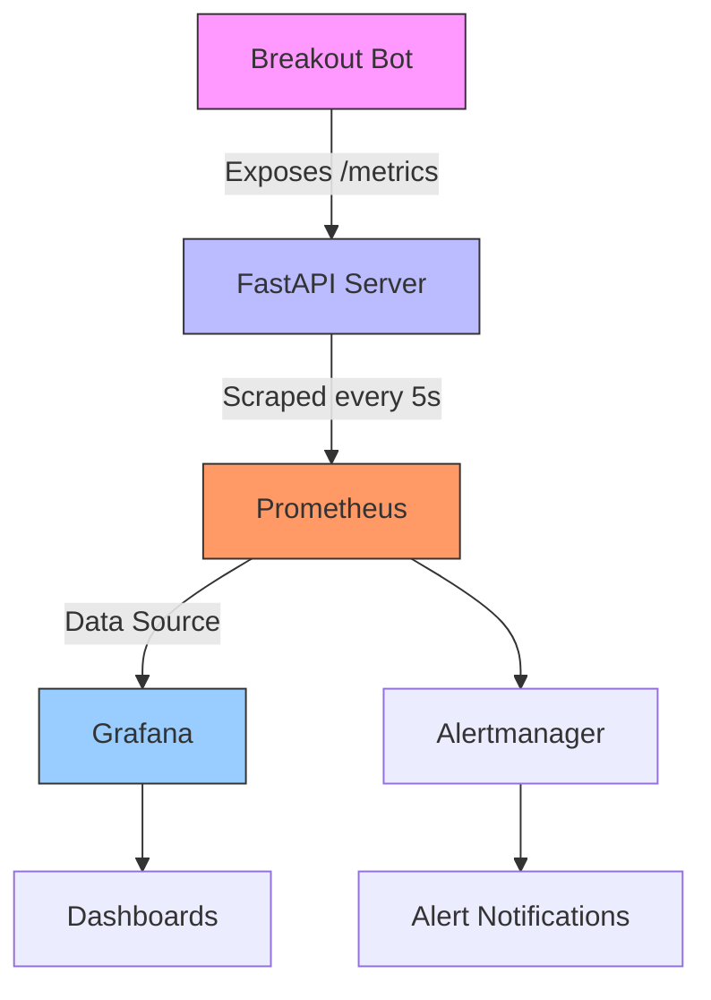
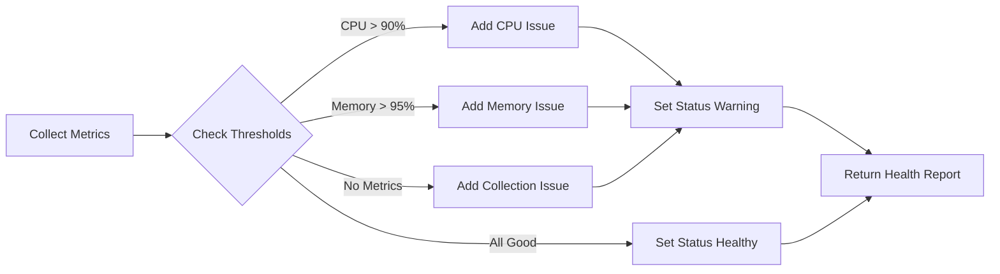

# Metrics API

<cite>
**Referenced Files in This Document **   
- [metrics.py](file://breakout_bot/api/routers/metrics.py)
- [metrics_logger.py](file://breakout_bot/utils/metrics_logger.py)
- [prometheus.yml](file://monitoring/prometheus.yml)
- [prometheus.yml](file://monitoring/grafana/datasources/prometheus.yml)
</cite>

## Table of Contents
1. [Introduction](#introduction)
2. [Core Endpoints](#core-endpoints)
3. [System Performance Metrics](#system-performance-metrics)
4. [Performance and Trading Metrics](#performance-and-trading-metrics)
5. [Latency and Component Timing](#latency-and-component-timing)
6. [Prometheus Integration](#prometheus-integration)
7. [Metric Collection and Aggregation](#metric-collection-and-aggregation)
8. [Querying for Analysis](#querying-for-analysis)
9. [SLA Monitoring and Alerting](#sla-monitoring-and-alerting)
10. [High-Cardinality and Sampling](#high-cardinality-and-sampling)
11. [Grafana Dashboard Guidance](#grafana-dashboard-guidance)
12. [Security and Rate Limiting](#security-and-rate-limiting)

## Introduction
The Metrics API provides comprehensive monitoring capabilities for the breakout trading bot, exposing system health, performance metrics, trading statistics, and component latency data. Built on FastAPI with Prometheus compatibility, this system enables real-time monitoring, capacity planning, and performance regression analysis. The API collects metrics from various components including engine cycles, scanner operations, trade execution, and risk management, providing a holistic view of system behavior.

## Core Endpoints
The Metrics API exposes several endpoints for accessing different categories of metrics:

- **GET /api/metrics/summary**: Provides an aggregated view of key performance indicators across engine, trading, and scanner components
- **GET /api/metrics/performance**: Returns current system performance metrics including CPU, memory, and process statistics
- **GET /api/metrics/metric/{metric_name}**: Retrieves time-series data for a specific metric with configurable data point count
- **GET /api/metrics/all**: Returns all collected metrics for comprehensive analysis
- **GET /api/metrics/health**: Provides health status assessment based on system thresholds
- **POST /api/metrics/clear**: Clears all collected metrics (administrative function)

These endpoints serve as the foundation for monitoring, alerting, and visualization systems.

**Section sources**
- [metrics.py](file://breakout_bot/api/routers/metrics.py#L0-L135)

## System Performance Metrics
The system performance endpoint (GET /metrics/system) delivers detailed information about resource utilization and process statistics. Through the `/performance` endpoint, clients can retrieve metrics including:

- CPU utilization percentage
- Memory usage percentage and absolute MB consumed
- Disk usage percentage
- Active thread count
- Open file descriptors
- Network connections
- Timestamp of measurement

The system collects these metrics every 5 seconds using Python's psutil library, providing granular visibility into the application's resource footprint. This data is essential for identifying performance bottlenecks and ensuring the trading bot operates within acceptable resource boundaries.

**Diagram sources **
- [metrics_logger.py](file://breakout_bot/utils/metrics_logger.py#L100-L150)
- [metrics.py](file://breakout_bot/api/routers/metrics.py#L59-L65)

**Section sources**
- [metrics_logger.py](file://breakout_bot/utils/metrics_logger.py#L100-L150)
- [metrics.py](file://breakout_bot/api/routers/metrics.py#L59-L65)

## Performance and Trading Metrics
The GET /metrics/performance endpoint provides access to trading-specific metrics that measure the effectiveness and efficiency of the trading strategy. These include Profit & Loss (P&L) calculations, win rate statistics, and trade frequency metrics.

The system automatically logs trade events through the `log_trade_event` method, capturing P&L data with associated metadata including symbol, side, quantity, and price. Performance metrics are aggregated from engine cycle data, scanner results, and executed trades, enabling comprehensive analysis of trading strategy effectiveness over time.

Key metrics available include:
- Trade P&L (profit and loss)
- Win rate percentage
- Number of winning vs losing trades
- Average profit per winning trade
- Average loss per losing trade
- Trade frequency (trades per hour/minute)
- Position holding duration

These metrics are accessible both through the summary endpoint and individual metric queries.

**Diagram sources **
- [metrics_logger.py](file://breakout_bot/utils/metrics_logger.py#L50-L300)
- [metrics.py](file://breakout_bot/api/routers/metrics.py#L0-L135)

**Section sources**
- [metrics_logger.py](file://breakout_bot/utils/metrics_logger.py#L200-L250)
- [metrics.py](file://breakout_bot/api/routers/metrics.py#L0-L135)

## Latency and Component Timing
Component timing measurements are captured through dedicated metrics that track the execution duration of critical system components. The primary latency metrics include:

- Engine cycle time: Duration of each complete engine processing cycle
- Scanner scan time: Time required to scan all configured symbols
- Order execution latency: Time from signal generation to order confirmation
- Market data processing delay: Latency between data receipt and processing

These metrics are logged using the `log_engine_cycle` and `log_scanner_metrics` methods, which record timing data with state context. The metrics are stored with timestamps and optional tags, allowing for historical analysis of system responsiveness and identification of performance degradation patterns.

The `/metric/{metric_name}` endpoint allows querying specific timing metrics with configurable data point limits (1-1000 points), facilitating detailed latency analysis.

**Section sources**
- [metrics_logger.py](file://breakout_bot/utils/metrics_logger.py#L250-L280)
- [metrics.py](file://breakout_bot/api/routers/metrics.py#L70-L78)

## Prometheus Integration
The Metrics API integrates with Prometheus through configuration in the monitoring/prometheus.yml file. Prometheus scrapes metrics from the `/api/metrics` endpoint at 5-second intervals, ensuring high-resolution time-series data collection.

The scrape configuration defines a job named 'breakout-bot-api' that targets the API service at breakout-bot-api:8000. The global scrape interval is set to 15 seconds, but the bot-specific job overrides this with a 5-second interval to capture rapid changes in trading system metrics.

Grafana is configured as the visualization layer, connecting to Prometheus as its data source. The Grafana datasource configuration specifies the Prometheus server URL at http://prometheus:9090, enabling dashboard creation and metric exploration.

**Diagram sources **
- [prometheus.yml](file://monitoring/prometheus.yml#L10-L15)
- [prometheus.yml](file://monitoring/grafana/datasources/prometheus.yml#L0-L8)

**Section sources**
- [prometheus.yml](file://monitoring/prometheus.yml#L10-L15)
- [prometheus.yml](file://monitoring/grafana/datasources/prometheus.yml#L0-L8)

## Metric Collection and Aggregation
Metrics are collected and aggregated by the MetricsLogger class in metrics_logger.py. The system uses a thread-safe design with deque containers to store metric time-series data, with a default maximum of 10,000 data points per metric.

Collection intervals vary by metric type:
- System performance metrics: Collected every 5 seconds
- Engine cycle metrics: Collected at the end of each processing cycle
- Scanner metrics: Collected after each scanning operation
- Trade events: Collected synchronously with trade execution

Aggregation methods include:
- Mean, minimum, and maximum calculations for numerical metrics
- Count of events within specified time windows
- Latest value retrieval for current state assessment
- Summary statistics (count, mean, min, max, latest) for time-series data

The get_metrics_summary method computes these aggregations on-demand, returning statistical summaries rather than raw time-series data unless specifically requested.

**Section sources**
- [metrics_logger.py](file://breakout_bot/utils/metrics_logger.py#L100-L300)

## Querying for Analysis
The Metrics API supports various query patterns for performance regression analysis and capacity planning. Example queries include:

For performance regression analysis:
- Compare average engine cycle time over different time periods
- Analyze memory usage trends during high market volatility
- Correlate trade frequency with system CPU utilization
- Identify latency spikes following software deployments

For capacity planning:
- Project future resource requirements based on historical growth
- Analyze peak load patterns to determine scaling needs
- Evaluate the impact of additional trading pairs on system resources
- Assess the relationship between market data volume and processing latency

The `/metric/{metric_name}` endpoint with appropriate last_n parameters enables these analyses by providing time-series data that can be processed to identify trends, seasonality, and anomalies.

**Section sources**
- [metrics.py](file://breakout_bot/api/routers/metrics.py#L70-L78)
- [metrics_logger.py](file://breakout_bot/utils/metrics_logger.py#L280-L300)

## SLA Monitoring and Alerting
The system includes built-in health monitoring capabilities through the `/health` endpoint, which evaluates system status against predefined thresholds. The health check assesses:

- CPU usage above 90% triggers warning status
- Memory usage above 95% triggers warning status
- Absence of collected metrics indicates potential system failure

While the current implementation provides basic health assessment, it can be extended to support more sophisticated SLA monitoring and threshold-based alerting. Potential enhancements include:

- Configurable threshold levels for different environments
- Multi-level alert severity (warning, critical)
- Integration with external alerting systems like Alertmanager
- Automated remediation actions for common issues
- Historical trend analysis to predict SLA violations

The performance monitoring system already includes infrastructure for alert callbacks, suggesting a pathway for implementing comprehensive alerting integration.

**Diagram sources **
- [metrics.py](file://breakout_bot/api/routers/metrics.py#L99-L134)

**Section sources**
- [metrics.py](file://breakout_bot/api/routers/metrics.py#L99-L134)

## High-Cardinality and Sampling
The Metrics API addresses high-cardinality concerns through careful label dimension design and data retention policies. Currently, the system applies labels judiciously, primarily using them for:

- Trade event types (e.g., trade_opened, trade_closed)
- Symbol identifiers in trade metrics
- Trading side (buy/sell)
- Engine states

To prevent cardinality explosion, the system avoids high-dimensionality labels such as timestamps, unique identifiers, or unbounded text fields. The MetricsLogger uses fixed-size deques with a default maximum of 10,000 points, automatically aging out older data.

For high-frequency events, the system employs aggregation rather than individual event logging where appropriate. For example, scanner metrics aggregate counts across multiple symbols rather than creating separate time series for each symbol scanned.

Potential sampling strategies for extremely high-frequency events could include:
- Statistical sampling of events
- Sliding window aggregation
- Probabilistic data structures for approximate counts
- Dynamic sampling rates based on system load

**Section sources**
- [metrics_logger.py](file://breakout_bot/utils/metrics_logger.py#L50-L100)
- [metrics.py](file://breakout_bot/api/routers/metrics.py#L0-L135)

## Grafana Dashboard Guidance
When creating Grafana dashboards using the Metrics API as a data source, consider the following best practices:

1. **Organize by functional area**: Create separate panels or rows for system performance, trading performance, and component latency.

2. **Use appropriate visualizations**:
   - Time series graphs for trending metrics
   - Single stat panels with color thresholds for key indicators
   - Bar charts for comparative analysis
   - Heatmaps for high-frequency event patterns

3. **Key dashboard metrics**:
   - CPU and memory utilization with warning/critical thresholds
   - Engine cycle time distribution
   - Trade P&L over time
   - Win rate percentage
   - Scanner performance (symbols scanned per minute)
   - Order execution latency

4. **Implement meaningful alerting rules** in Grafana based on critical metrics, such as sustained high CPU usage or abnormal latency spikes.

5. **Include contextual information** such as deployment markers to correlate performance changes with code releases.

The Prometheus data source configuration in Grafana is pre-configured in the monitoring stack, allowing immediate dashboard creation once the system is operational.

**Section sources**
- [prometheus.yml](file://monitoring/grafana/datasources/prometheus.yml#L0-L8)

## Security and Rate Limiting
The Metrics API considers security aspects of exposing performance data through several mechanisms:

1. **Endpoint protection**: While not explicitly shown in the provided code, metrics endpoints should be protected in production environments, potentially requiring authentication tokens or API keys.

2. **Rate limiting**: Although specific rate limiting configuration for metrics endpoints isn't visible in the provided files, the system includes rate limiting infrastructure in exchange/rate_limiter.py that could be extended to protect metrics endpoints from abuse.

3. **Data sensitivity**: The exposed metrics focus on system performance and aggregated trading statistics rather than sensitive financial data, reducing the security implications of exposure.

4. **Resource protection**: The clear_metrics endpoint is potentially dangerous and should be restricted to administrative users only.

Recommended security enhancements include:
- Implementing authentication for all metrics endpoints
- Adding rate limiting to prevent denial-of-service attacks
- Restricting access to metrics endpoints via firewall rules or network policies
- Encrypting metrics transmission with HTTPS
- Regular security auditing of metrics content to prevent leakage of sensitive information

The system's architecture supports these enhancements through its modular design and existing security infrastructure.

**Section sources**
- [metrics.py](file://breakout_bot/api/routers/metrics.py#L0-L135)
- [rate_limiter.py](file://breakout_bot/exchange/rate_limiter.py#L0-L90)