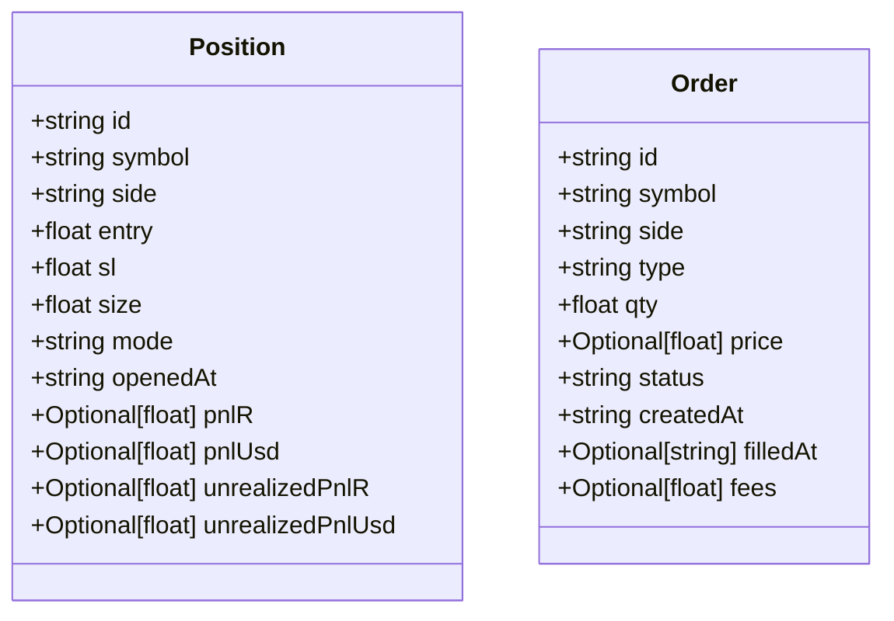
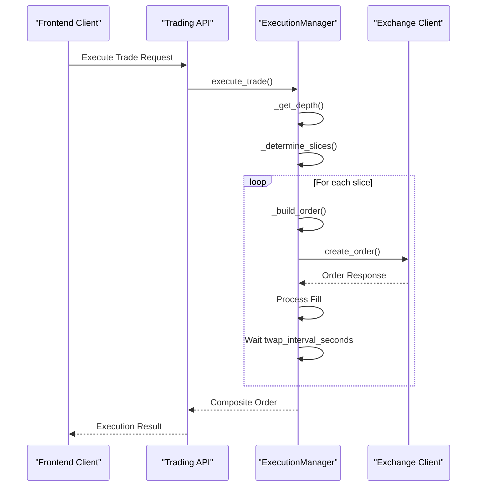
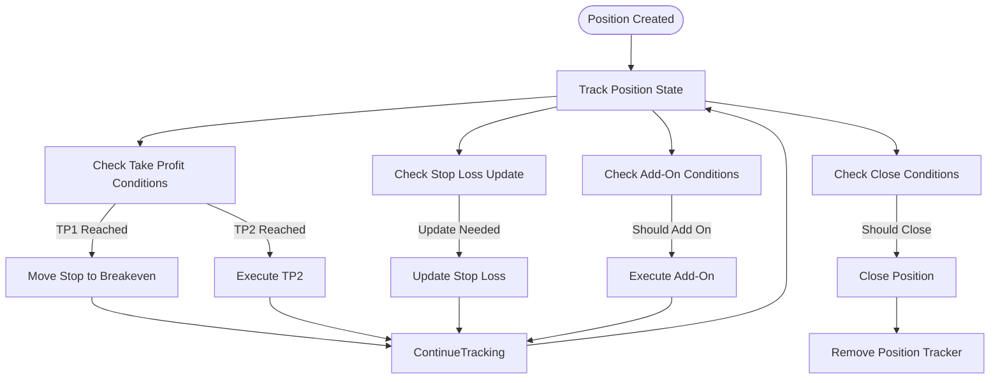
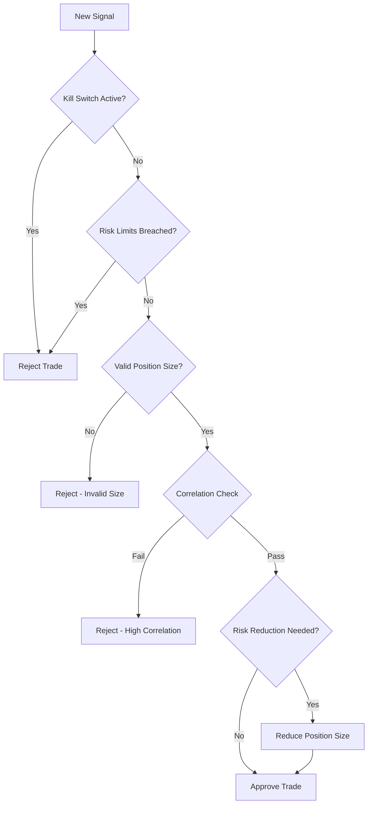
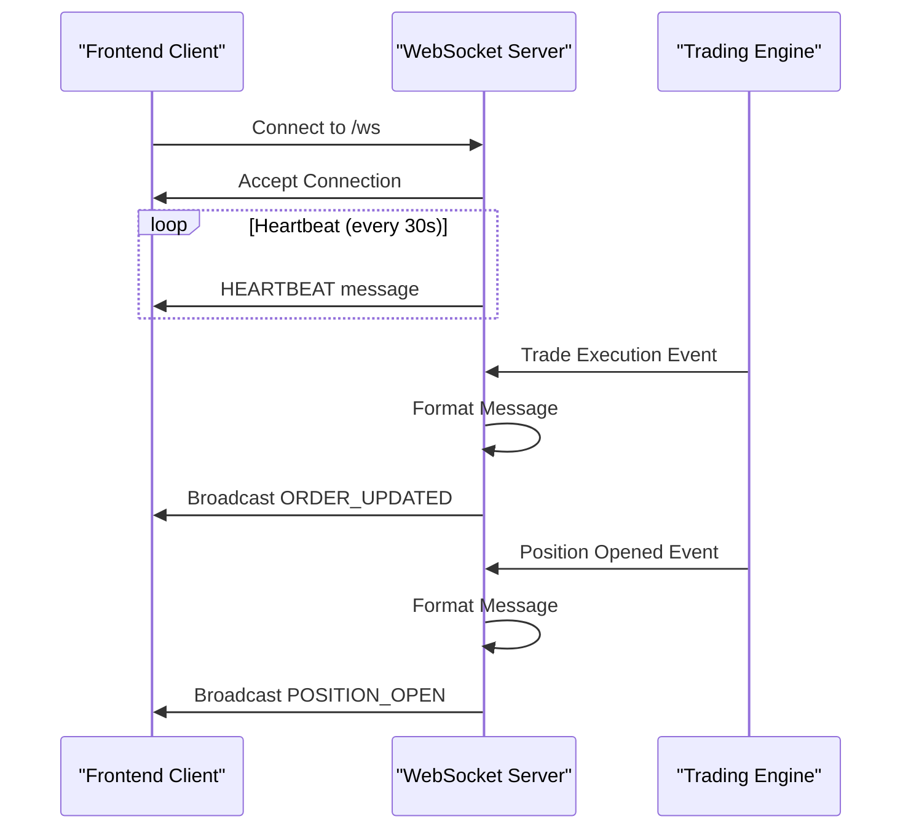

# Trading Operations API

<cite>
**Referenced Files in This Document**   
- [trading.py](file://breakout_bot/api/routers/trading.py)
- [manager.py](file://breakout_bot/execution/manager.py)
- [position_manager.py](file://breakout_bot/position/position_manager.py)
- [database.py](file://breakout_bot/storage/database.py)
- [risk_manager.py](file://breakout_bot/risk/risk_manager.py)
- [websocket.py](file://breakout_bot/api/websocket.py)
</cite>

## Table of Contents
1. [Introduction](#introduction)
2. [API Endpoints](#api-endpoints)
3. [Request and Response Models](#request-and-response-models)
4. [Execution Management](#execution-management)
5. [Position Management Integration](#position-management-integration)
6. [Risk Management Constraints](#risk-management-constraints)
7. [Order Routing and Partial Fills](#order-routing-and-partial-fills)
8. [Error Handling](#error-handling)
9. [WebSocket Notifications](#websocket-notifications)
10. [Audit Logging](#audit-logging)
11. [Client Usage Patterns](#client-usage-patterns)
12. [Performance Considerations](#performance-considerations)

## Introduction
The Trading Operations API provides a comprehensive interface for managing trading activities within the Breakout Bot system. It enables clients to retrieve active positions, execute manual trades, close positions, and query order history through well-defined REST endpoints. The API integrates with multiple core components including the execution manager for order routing, position manager for state updates, risk manager for constraint enforcement, and database layer for audit logging. Real-time updates are delivered to the frontend via WebSocket notifications, ensuring clients have immediate visibility into trade execution events.

## API Endpoints
The Trading Operations API exposes several endpoints for retrieving and modifying trading data:

### Retrieve Active Positions
**Endpoint**: `GET /api/trading/positions`  
Retrieves all currently open positions in the system. Returns an empty list if no engine is running or on error.

### Retrieve Specific Position
**Endpoint**: `GET /api/trading/positions/{position_id}`  
Retrieves a specific position by its unique identifier. Returns 404 if the position is not found.

### Query Order History
**Endpoint**: `GET /api/trading/orders`  
Retrieves all orders in the system. Returns an empty list if no engine is running or on error.

### Cancel Order
**Endpoint**: `DELETE /api/trading/orders/{order_id}`  
Cancels a specific order by its unique identifier. Returns success confirmation or appropriate error status.

**Section sources**
- [trading.py](file://breakout_bot/api/routers/trading.py#L1-L186)

## Request and Response Models
The API uses standardized models for request payloads and response schemas.

### Position Model
Represents an open trading position with key attributes:
- **id**: Unique position identifier
- **symbol**: Trading pair symbol (e.g., BTC/USDT)
- **side**: Trade direction ('long' or 'short')
- **entry**: Entry price for the position
- **sl**: Stop-loss price level
- **size**: Position size in base currency
- **mode**: Strategy mode used for the position
- **openedAt**: ISO timestamp when position was opened
- **pnlR**: Realized profit/loss in R units
- **pnlUsd**: Realized profit/loss in USD
- **unrealizedPnlR**: Unrealized profit/loss in R units
- **unrealizedPnlUsd**: Unrealized profit/loss in USD

### Order Model
Represents a trading order with execution details:
- **id**: Unique order identifier
- **symbol**: Trading pair symbol
- **side**: Order side ('buy' or 'sell')
- **type**: Order type ('market', 'limit', etc.)
- **qty**: Order quantity
- **price**: Limit price (null for market orders)
- **status**: Current order status
- **createdAt**: ISO timestamp when order was created
- **filledAt**: ISO timestamp when order was filled (null if not filled)
- **fees**: Transaction fees in USD



**Diagram sources **
- [trading.py](file://breakout_bot/api/routers/trading.py#L10-L40)

**Section sources**
- [trading.py](file://breakout_bot/api/routers/trading.py#L10-L40)

## Execution Management
The execution manager handles order placement with sophisticated execution strategies including TWAP slicing, iceberg behavior, and slippage-aware fee calculations.

### Key Features
- **TWAP Slicing**: Large orders are divided into smaller slices executed over time
- **Depth Awareness**: Uses order book depth to determine optimal slice sizes
- **Slippage Calculation**: Tracks and reports execution slippage in basis points
- **Fee Estimation**: Calculates fees based on maker/taker rates and actual fills

### Execution Parameters
When executing trades, the following parameters are considered:
- **Symbol**: Target trading pair
- **Side**: Buy or sell direction
- **Total Quantity**: Target fill amount
- **Market Data**: Current market conditions
- **Position Size**: Optional sizing metadata
- **Reduce Only**: Whether the order should only reduce existing exposure
- **Intent**: Execution context (entry, exit, add_on)



**Diagram sources **
- [manager.py](file://breakout_bot/execution/manager.py#L50-L287)

**Section sources**
- [manager.py](file://breakout_bot/execution/manager.py#L50-L287)

## Position Management Integration
The position manager handles dynamic position updates including stop-loss adjustments, take-profit execution, trailing mechanisms, and add-on logic.

### Position Update Workflow
1. New positions are added to management via `add_position()`
2. Existing positions are updated via `update_position()`
3. Position trackers monitor conditions and generate update instructions
4. Updates are processed asynchronously in parallel

### Key Management Features
- **Breakeven Movement**: Stop loss moves to breakeven after TP1 execution
- **Chandelier Exit**: Trailing stop based on ATR indicator
- **Take Profit Execution**: Automatic TP1 and TP2 execution at target levels
- **Add-On Logic**: Additional entries based on EMA pullback patterns
- **Time-Based Closing**: Positions closed after maximum hold time



**Diagram sources **
- [position_manager.py](file://breakout_bot/position/position_manager.py#L100-L496)

**Section sources**
- [position_manager.py](file://breakout_bot/position/position_manager.py#L100-L496)

## Risk Management Constraints
The risk manager enforces trading constraints to protect capital and manage portfolio risk.

### Position Sizing
Uses R-based position sizing where:
- Risk per trade is configured as percentage of account equity
- Position size = (Account Equity × Risk Percentage) / Stop Distance
- Maximum position size limits prevent excessive exposure

### Risk Controls
- **Daily Risk Limit**: Maximum allowable daily loss
- **Kill Switch**: Automatically disables trading if drawdown exceeds threshold
- **Concurrent Position Limits**: Maximum number of simultaneous positions
- **Correlation Exposure**: Limits exposure to highly correlated assets
- **Depth Constraints**: Adjusts position size based on order book depth

### Validation Checks
Before executing trades, the system validates:
- Sufficient available balance
- Valid symbol and market conditions
- Exchange connectivity
- Risk limit compliance
- Position size feasibility



**Diagram sources **
- [risk_manager.py](file://breakout_bot/risk/risk_manager.py#L200-L644)

**Section sources**
- [risk_manager.py](file://breakout_bot/risk/risk_manager.py#L200-L644)

## Order Routing and Partial Fills
The system handles order execution with support for partial fills and sophisticated routing logic.

### Market vs Limit Orders
- **Market Orders**: Immediate execution at best available price
- **Limit Orders**: Execution at specified price or better, with post-only option
- **Iceberg Orders**: Large orders split into smaller visible portions

### Partial Fill Handling
When orders are partially filled:
- Remaining quantity is tracked in the order object
- Fees are calculated proportionally to filled quantity
- Slippage is calculated based on average fill price
- Composite order objects consolidate child fills
- Status remains 'open' until fully filled

### Execution Metadata
Each executed order includes metadata capturing:
- Number of slices executed
- Order types used
- Slippage in basis points
- Spread conditions
- Market imbalance
- Child order identifiers
- Fee calculations

**Section sources**
- [manager.py](file://breakout_bot/execution/manager.py#L50-L287)

## Error Handling
The API implements comprehensive error handling for various failure scenarios.

### Common Error Responses
- **Insufficient Balance**: 400 Bad Request with balance details
- **Invalid Symbol**: 400 Bad Request with symbol validation message
- **Exchange Connectivity Issues**: 503 Service Unavailable
- **Position Not Found**: 404 Not Found
- **Order Cancellation Failure**: 500 Internal Server Error
- **Risk Limit Breach**: 403 Forbidden with violation details

### Error Recovery
- Failed order slices trigger immediate cancellation of remaining slices
- Network timeouts use deadman switch with configurable timeout
- Invalid states are logged and reported to monitoring systems
- Critical errors trigger alerts to operations team

**Section sources**
- [trading.py](file://breakout_bot/api/routers/trading.py#L1-L186)
- [manager.py](file://breakout_bot/execution/manager.py#L50-L287)

## WebSocket Notifications
Real-time trading events are pushed to connected clients via WebSocket.

### Notification Types
- **ORDER_PLACED**: When a new order is submitted
- **ORDER_UPDATED**: When an order status changes
- **ORDER_CANCELED**: When an order is canceled
- **POSITION_OPEN**: When a new position is opened
- **POSITION_UPDATE**: When a position is modified
- **POSITION_CLOSE**: When a position is closed
- **ENGINE_UPDATE**: Periodic engine state updates
- **HEARTBEAT**: Keep-alive messages every 30 seconds

### Message Format
All WebSocket messages follow the standard format:
```json
{
  "type": "EVENT_TYPE",
  "ts": 1732200000000,
  "data": { /* event-specific data */ }
}
```

### Connection Management
- Clients connect to `/ws` endpoint
- Connection manager maintains active connections
- Disconnected clients are automatically removed
- Broadcasts ensure all clients receive relevant updates



**Diagram sources **
- [websocket.py](file://breakout_bot/api/websocket.py#L1-L179)

**Section sources**
- [websocket.py](file://breakout_bot/api/websocket.py#L1-L179)

## Audit Logging
All trading activities are recorded in the database for audit and analysis purposes.

### Database Tables
- **positions**: Stores position details including entry, stop-loss, and P&L
- **orders**: Records all order executions with timestamps and status
- **system_logs**: Captures system events and error messages
- **performance_metrics**: Tracks trading performance over time
- **signals**: Logs trading signals generated by the system

### Logging Strategy
- Position changes are saved immediately
- Order executions are logged with full details
- System logs include module context and metadata
- Performance metrics are recorded periodically
- Old data is cleaned up after configurable retention period

### Data Retention
- Scan results and logs: 90 days
- Performance metrics: Daily summaries retained indefinitely
- Positions and orders: Permanent storage
- System logs: 90 days with automatic cleanup

**Section sources**
- [database.py](file://breakout_bot/storage/database.py#L1-L405)

## Client Usage Patterns
Clients interact with the Trading Operations API through established patterns.

### Polling Strategy
- Positions: Refreshed every 10 seconds
- Orders: Refreshed every 15 seconds
- Performance data: Refreshed every 30 seconds
- Use cache headers to minimize unnecessary requests

### Error Handling Best Practices
- Implement exponential backoff for retry logic
- Handle 404 responses gracefully when resources are not found
- Display meaningful error messages to users
- Log client-side errors for debugging

### WebSocket Integration
- Establish connection on application startup
- Handle reconnection logic for network interruptions
- Subscribe to relevant event types only
- Implement message queue to handle burst traffic

### Rate Limiting Considerations
- Respect server rate limits to avoid throttling
- Batch requests when possible
- Use efficient polling intervals
- Implement local caching for frequently accessed data

**Section sources**
- [trading.py](file://breakout_bot/api/routers/trading.py#L1-L186)
- [websocket.py](file://breakout_bot/api/websocket.py#L1-L179)

## Performance Considerations
The system is optimized for high-frequency interactions while maintaining reliability.

### Optimization Techniques
- **Connection Pooling**: Database connections are pooled and reused
- **Async Processing**: Position updates processed in parallel using thread pool
- **Caching**: Frequently accessed data cached in memory
- **Batch Operations**: Multiple updates processed efficiently
- **Efficient Queries**: Indexed database queries for fast retrieval

### Scalability Factors
- Thread pool size configurable for position processing
- Database connection pool limits prevent resource exhaustion
- Memory usage monitored and controlled
- CPU-intensive calculations offloaded to worker threads
- Rate limiting prevents overwhelming downstream services

### Monitoring Metrics
- Request latency and throughput
- Database query performance
- Memory and CPU utilization
- WebSocket connection count
- Order execution success rate
- Error frequency and types

### High-Frequency Guidelines
- Use WebSocket for real-time updates instead of frequent polling
- Batch related operations when possible
- Minimize payload sizes for network efficiency
- Implement proper error handling to maintain stability
- Monitor system health during peak activity periods

**Section sources**
- [manager.py](file://breakout_bot/execution/manager.py#L50-L287)
- [position_manager.py](file://breakout_bot/position/position_manager.py#L100-L496)
- [database.py](file://breakout_bot/storage/database.py#L1-L405)