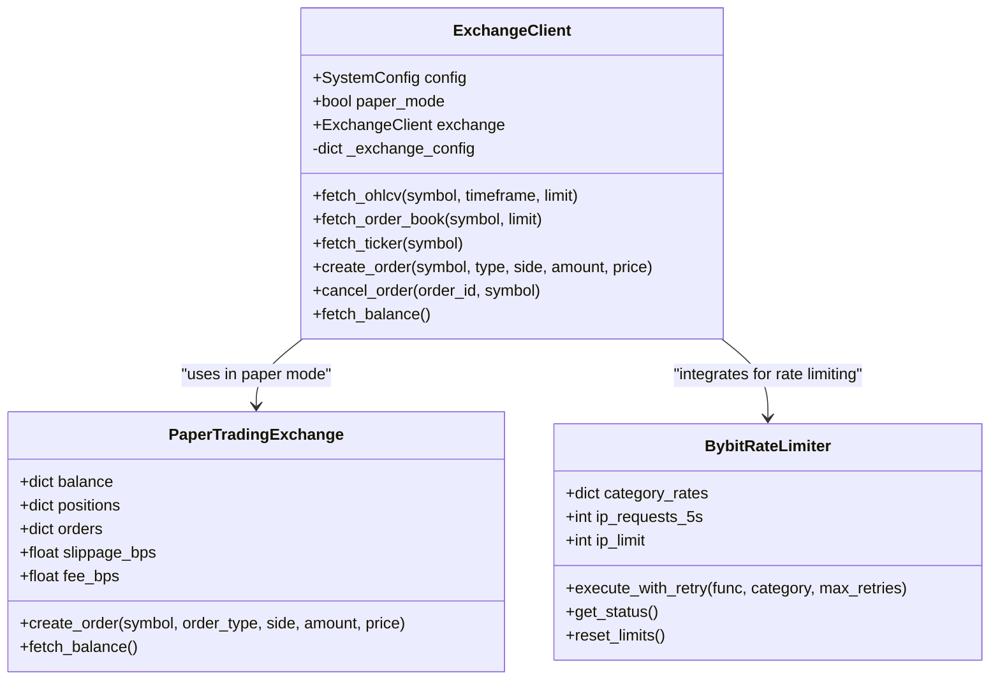
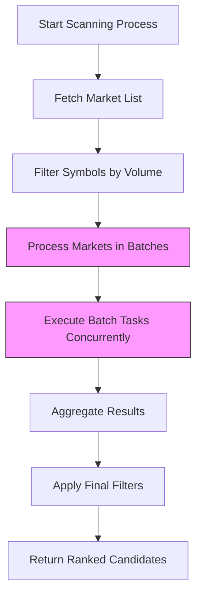
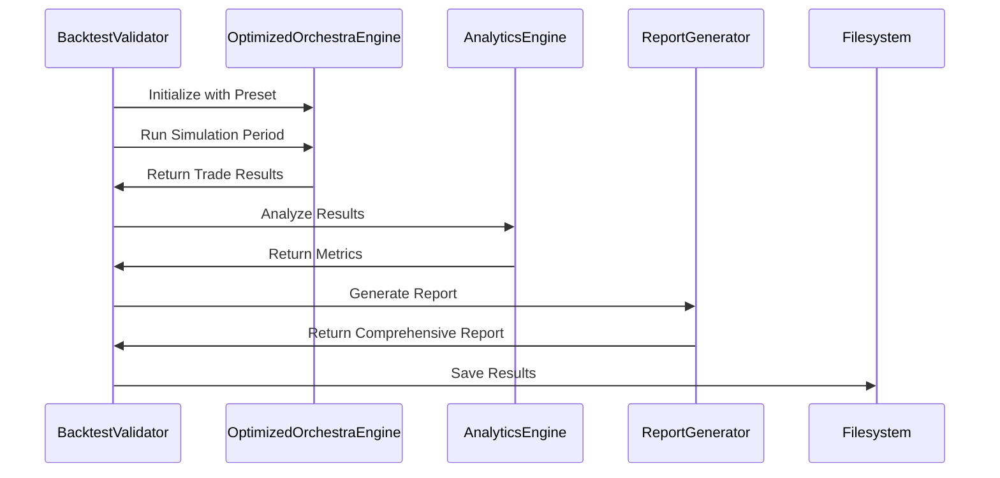
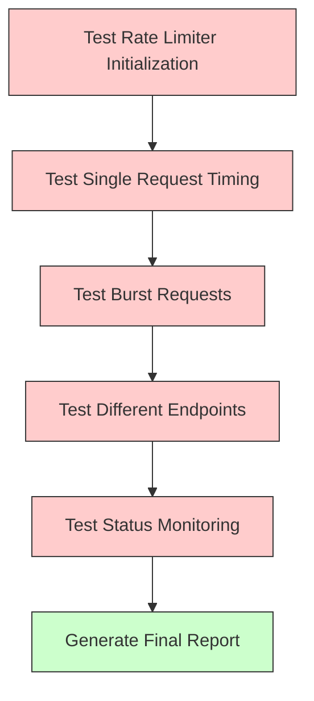

# Advanced Topics

<cite>
**Referenced Files in This Document**   
- [analyze_trading_issues.py](file://analyze_trading_issues.py)
- [simulate_breakout.py](file://simulate_breakout.py)
- [compare_presets.py](file://compare_presets.py)
- [backtest_validation.py](file://backtest_validation.py)
- [test_bybit_rate_limiter.py](file://test_bybit_rate_limiter.py)
- [breakout_bot/exchange/exchange_client.py](file://breakout_bot/exchange/exchange_client.py)
- [breakout_bot/indicators/technical.py](file://breakout_bot/indicators/technical.py)
- [breakout_bot/scanner/market_scanner.py](file://breakout_bot/scanner/market_scanner.py)
- [breakout_bot/signals/signal_generator.py](file://breakout_bot/signals/signal_generator.py)
- [breakout_bot/core/engine.py](file://breakout_bot/core/engine.py)
- [breakout_bot/core/trading_orchestrator.py](file://breakout_bot/core/trading_orchestrator.py)
</cite>

## Table of Contents
1. [Custom Strategy Development](#custom-strategy-development)
2. [Strategy Performance Comparison](#strategy-performance-comparison)
3. [Advanced Risk Modeling Techniques](#advanced-risk-modeling-techniques)
4. [Exchange Adapter Creation](#exchange-adapter-creation)
5. [Performance Optimization Methods](#performance-optimization-methods)
6. [Custom Indicator Development](#custom-indicator-development)
7. [Backtesting Validation Approaches](#backtesting-validation-approaches)
8. [Component Stress Testing](#component-stress-testing)

## Custom Strategy Development

This section covers the development of custom trading strategies using diagnostic and simulation tools. The `analyze_trading_issues.py` script provides comprehensive analysis of why trading signals may not be generated by examining preset filters, market data availability, scanner filter effectiveness, and signal conditions. It enables developers to identify pattern weaknesses and adjust strategy parameters accordingly.

The `simulate_breakout.py` script allows modeling hypothetical scenarios by simulating price movements that could trigger breakout signals. This tool connects to the API server, selects a candidate from the scanner results, and simulates a price breakout above resistance or below support levels. By monitoring the engine state transitions, developers can validate whether their configured strategies would generate signals under specific market conditions.

Developers can create new trading strategies by combining technical indicators and defining novel signal conditions within the signal generation framework. The system supports momentum-based breakouts requiring price breakout confirmation, volume surge (configurable multiplier), candle body ratio thresholds, L2 order book imbalance, and VWAP gap constraints. Retest strategies require level retesting within tolerance, limited pierce depth measured in ATR units, L2 imbalance, sufficient trading activity, and correlation with BTC.

**Section sources**
- [analyze_trading_issues.py](file://analyze_trading_issues.py#L0-L280)
- [simulate_breakout.py](file://simulate_breakout.py#L0-L138)
- [breakout_bot/signals/signal_generator.py](file://breakout_bot/signals/signal_generator.py#L0-L799)

## Strategy Performance Comparison

The `compare_presets.py` script enables systematic evaluation of different trading configurations by comparing risk-adjusted returns across various presets. This tool loads multiple preset configurations and performs detailed comparisons of liquidity filters, volatility filters, scanner settings, and signal configurations.

The comparison includes side-by-side analysis of key parameters such as minimum 24-hour volume, open interest requirements, maximum spread in basis points, depth requirements at 0.3% and 0.5% levels, trades per minute thresholds, ATR range limits, Bollinger Band width percentiles, volume surge multipliers for 1-hour and 5-minute intervals, OI delta thresholds, maximum candidates, scan intervals, and signal condition sensitivities.

This comparative analysis helps determine optimal parameter ranges by identifying which configuration produces more viable trading opportunities while maintaining appropriate risk controls. The output highlights parameter changes with directional indicators showing whether requirements have been relaxed (📈) or tightened (📉), enabling informed decisions about preset selection based on market conditions and risk appetite.

**Section sources**
- [compare_presets.py](file://compare_presets.py#L0-L173)

## Advanced Risk Modeling Techniques

Beyond basic position sizing, the system implements sophisticated risk modeling techniques including volatility-adjusted allocations and portfolio-level correlation hedging. The risk management framework evaluates multiple dimensions of risk exposure simultaneously, incorporating market-specific volatility metrics, inter-asset correlations, and dynamic position sizing based on account equity and concurrent positions.

The system employs correlation-based filtering with configurable limits, allowing moderate correlations (0.3-0.7) while rejecting extremely high correlations that could lead to over-concentration risk. Position sizing algorithms consider both individual trade risk (based on stop-loss distance and account risk percentage) and portfolio-level constraints (maximum concurrent positions and daily loss limits).

Risk evaluation occurs during the sizing phase where each potential trade undergoes comprehensive assessment considering current equity, existing positions, market data quality, and predefined risk parameters. The system also implements kill-switch mechanisms that automatically pause trading when daily loss thresholds are breached, providing an additional layer of capital protection.

**Section sources**
- [breakout_bot/core/engine.py](file://breakout_bot/core/engine.py#L0-L799)
- [breakout_bot/risk/risk_manager.py](file://breakout_bot/risk/risk_manager.py#L0-L500)

## Exchange Adapter Creation

The exchange integration architecture follows a standardized pattern implemented in `exchange_client.py`, enabling straightforward creation of adapters for new brokers beyond Bybit. The design separates concerns between market data retrieval, order execution, and rate limiting management, providing a clear template for implementing additional exchange integrations.

The adapter pattern uses CCXT as the underlying library for unified API access, with specialized handling for exchange-specific features such as rate limit headers, authentication schemes, and endpoint variations. The `BybitRateLimiter` class demonstrates how to implement exchange-specific rate limiting logic that respects API quotas and handles exponential backoff during periods of high request volume.

New exchange adapters should implement the core interface methods including `fetch_ohlcv`, `fetch_order_book`, `fetch_ticker`, `create_order`, `cancel_order`, and `fetch_balance`. They must also integrate with the global connection pool for efficient resource utilization and implement proper error handling for network-related issues and API-specific exceptions.

**Diagram sources **
- [breakout_bot/exchange/exchange_client.py](file://breakout_bot/exchange/exchange_client.py#L0-L799)

**Section sources**
- [breakout_bot/exchange/exchange_client.py](file://breakout_bot/exchange/exchange_client.py#L0-L799)

## Performance Optimization Methods

Several performance optimization techniques are implemented throughout the codebase to reduce computational overhead and improve execution efficiency. In `technical.py`, indicator calculations leverage NumPy operations and caching mechanisms to avoid redundant computations. The `IndicatorCache` class stores calculated values with time-to-live expiration, significantly reducing processing time for frequently accessed technical indicators like ATR, Bollinger Bands, and VWAP.

Scanner parallelism is optimized through batch processing and asynchronous execution patterns. The `BreakoutScanner` processes markets in batches rather than sequentially, utilizing `asyncio.gather` to execute multiple scanning tasks concurrently. This approach minimizes I/O wait times and maximizes throughput when evaluating numerous market candidates.

Garbage collection pressure is reduced through object pooling and careful memory management. The `ExchangeConnectionPool` maintains reusable connections to minimize the overhead of establishing new network sessions. Additionally, data structures use efficient representations such as float32 instead of float64 where precision requirements allow, reducing memory footprint by up to 50%.

**Diagram sources **
- [breakout_bot/indicators/technical.py](file://breakout_bot/indicators/technical.py#L0-L580)
- [breakout_bot/scanner/market_scanner.py](file://breakout_bot/scanner/market_scanner.py#L0-L786)

**Section sources**
- [breakout_bot/indicators/technical.py](file://breakout_bot/indicators/technical.py#L0-L580)
- [breakout_bot/scanner/market_scanner.py](file://breakout_bot/scanner/market_scanner.py#L0-L786)

## Custom Indicator Development

Developers can extend the system's analytical capabilities by creating custom indicators and integrating them into the scanning pipeline. New indicators should be added to the `indicators/technical.py` module following the established pattern of using NumPy arrays for vectorized operations and implementing caching decorators to prevent redundant calculations.

Custom indicators must accept standard data structures such as lists of Candle objects and return numpy arrays compatible with the existing processing pipeline. They should be designed with computational efficiency in mind, avoiding nested loops in favor of array operations whenever possible. The `cached_indicator` decorator can be applied to expensive calculations to ensure results are reused within the cache TTL period.

Integration into the scanning pipeline requires modifying the `MarketScorer` class to incorporate the new indicator into its scoring algorithm. Weights can be assigned to the new metric in the preset configuration, allowing its influence on candidate selection to be tuned without code changes. The diagnostic framework automatically captures and reports on custom indicator values during analysis runs.

**Section sources**
- [breakout_bot/indicators/technical.py](file://breakout_bot/indicators/technical.py#L0-L580)
- [breakout_bot/scanner/market_scanner.py](file://breakout_bot/scanner/market_scanner.py#L0-L786)

## Backtesting Validation Approaches

The `backtest_validation.py` script implements rigorous validation procedures using walk-forward analysis to assess strategy viability before live deployment. This process simulates historical trading performance over specified date ranges, generating comprehensive reports that include key metrics such as total return, Sharpe ratio, maximum drawdown, win rate, profit factor, and recovery factor.

The validation framework evaluates multiple aspects of strategy performance against predefined viability criteria. A strategy is considered viable if it meets at least four out of six conditions: minimum 10% total return, Sharpe ratio greater than 1.0, maximum drawdown less than 20%, win rate exceeding 40%, profit factor above 1.2, and Calmar ratio greater than 0.5.

Risk assessment categorizes strategies as LOW, MEDIUM, or HIGH risk based on volatility and drawdown characteristics. The system generates actionable recommendations ranging from "STRONG BUY" for excellent risk-adjusted returns to "DO NOT TRADE" for strategies failing basic viability checks. All results are saved to JSON files for further analysis and comparison across different market conditions.

**Diagram sources **
- [backtest_validation.py](file://backtest_validation.py#L0-L294)

**Section sources**
- [backtest_validation.py](file://backtest_validation.py#L0-L294)

## Component Stress Testing

The `test_bybit_rate_limiter.py` script provides comprehensive stress testing capabilities to ensure system robustness under API constraints. This test suite validates the functionality of rate limiting mechanisms by executing various test scenarios including initialization verification, single request timing, burst request handling, cross-endpoint coordination, and status monitoring.

The testing framework verifies that the `BybitRateLimiter` correctly interprets X-Bapi-Limit-* headers, implements exponential backoff when rate limits are exceeded, and maintains accurate tracking of request counts across different endpoint categories. Tests simulate realistic usage patterns by cycling through different endpoint types (ticker, order book, OHLCV) and measuring response times and success rates.

Stress tests evaluate the system's behavior under extreme conditions by sending bursts of requests to measure throttling effectiveness and recovery patterns. The test results provide detailed statistics on successful versus rate-limited requests, average response times, and overall request throughput, helping identify potential bottlenecks and optimize rate limit configurations for production environments.

**Diagram sources **
- [test_bybit_rate_limiter.py](file://test_bybit_rate_limiter.py#L0-L312)

**Section sources**
- [test_bybit_rate_limiter.py](file://test_bybit_rate_limiter.py#L0-L312)