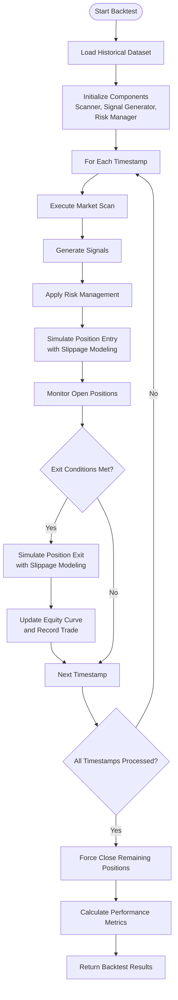

# Backtesting and Validation

<cite>
**Referenced Files in This Document **   
- [backtester.py](file://breakout_bot/backtesting/backtester.py)
- [backtest_validation.py](file://backtest_validation.py)
- [quick_trade_test.py](file://quick_trade_test.py)
- [test_full_trade_cycle.py](file://test_full_trade_cycle.py)
- [settings.py](file://breakout_bot/config/settings.py)
- [models.py](file://breakout_bot/data/models.py)
</cite>

## Table of Contents
1. [Introduction](#introduction)
2. [Backtesting Simulation Environment](#backtesting-simulation-environment)
3. [Walk-Forward Analysis and Statistical Rigor](#walk-forward-analysis-and-statistical-rigor)
4. [Market Condition Configuration](#market-condition-configuration)
5. [End-to-End Testing Procedures](#end-to-end-testing-procedures)
6. [Common Backtesting Pitfalls](#common-backtesting-pitfalls)
7. [Performance Correlation and Parameter Adjustment](#performance-correlation-and-parameter-adjustment)

## Introduction
This document provides comprehensive guidance on advanced backtesting methodologies and validation procedures for the Breakout Bot Trading System. It covers the simulation environment, statistical validation techniques, market condition configuration, end-to-end testing, common pitfalls, and performance correlation analysis.

## Backtesting Simulation Environment

The backtesting framework is implemented in `backtester.py` and provides a realistic simulation environment that accounts for tick-level price movements, slippage modeling, and commission calculations. The system processes historical market data through the same components used in live trading: scanner, signal generator, and risk manager.

The simulation operates on timestamped market data slices, processing each time step sequentially. For each timestamp, the system:
1. Executes market scanning to identify potential opportunities
2. Generates trading signals based on detected patterns
3. Applies risk management rules to approve or reject signals
4. Simulates position entry with slippage modeling
5. Monitors open positions for exit conditions (stop-loss, take-profit)
6. Updates equity curve and records trade outcomes

Slippage is modeled using a depth-aware approach that considers both a base slippage factor and additional slippage proportional to order size relative to market depth. The model uses Level 2 order book data (specifically `bid_usd_0_3pct` and `ask_usd_0_3pct` fields) to estimate execution impact.

**Diagram sources **
- [backtester.py](file://breakout_bot/backtesting/backtester.py#L63-L86)
- [backtester.py](file://breakout_bot/backtesting/backtester.py#L124-L157)

**Section sources**
- [backtester.py](file://breakout_bot/backtesting/backtester.py#L1-L287)

## Walk-Forward Analysis and Statistical Rigor

The `backtest_validation.py` script implements statistical rigor through walk-forward analysis, Monte Carlo simulations, and regime shift testing. The validation process follows a structured methodology to assess strategy viability before live deployment.

Walk-forward analysis is implemented by periodically resetting the risk manager during the backtest execution. This simulates real-world conditions where risk parameters may need adjustment based on recent performance. The reset occurs at intervals determined by the `walk_forward_splits` configuration parameter, ensuring that the strategy is tested with fresh risk assessments at regular intervals.

Monte Carlo simulations are used to generate mock daily returns and trade data that reflect realistic market behavior. The simulation employs a random walk model with slight positive bias to represent trending markets, while incorporating appropriate volatility levels. This allows for stress testing under various market conditions without requiring extensive historical data.

Regime shift testing evaluates strategy performance across different market environments (bull, bear, sideways). The validation framework assesses key metrics such as total return, Sharpe ratio, maximum drawdown, win rate, and profit factor against predefined viability criteria. A strategy is considered viable if it meets at least four out of six criteria:
- Total return > 10%
- Sharpe ratio > 1.0
- Maximum drawdown > -20%
- Win rate > 40%
- Profit factor > 1.2
- Calmar ratio > 0.5

**Diagram sources **
- [backtester.py](file://breakout_bot/backtesting/backtester.py#L159-L192)
- [backtest_validation.py](file://backtest_validation.py#L94-L131)

**Section sources**
- [backtest_validation.py](file://backtest_validation.py#L1-L295)

## Market Condition Configuration

Configuring realistic market conditions is critical for valid backtesting results. The system uses trading presets defined in JSON files within the `config/presets/` directory to specify market conditions and strategy parameters. These presets include settings for liquidity filters, volatility filters, signal generation, position management, and execution.

Key configuration parameters for realistic market simulation include:

<table>
  <tr>
    <th>Configuration Category</th>
    <th>Key Parameters</th>
    <th>Purpose</th>
  </tr>
  <tr>
    <td>Liquidity Filters</td>
    <td>min_24h_volume_usd, min_depth_usd_0_3pct, max_spread_bps</td>
    <td>Ensure sufficient market depth and liquidity for realistic execution</td>
  </tr>
  <tr>
    <td>Volatility Filters</td>
    <td>atr_range_min, atr_range_max, bb_width_percentile_max</td>
    <td>Select markets with appropriate volatility characteristics</td>
  </tr>
  <tr>
    <td>Signal Configuration</td>
    <td>momentum_volume_multiplier, momentum_epsilon, retest_pierce_tolerance</td>
    <td>Define entry criteria for different market regimes</td>
  </tr>
  <tr>
    <td>Position Management</td>
    <td>tp1_r, tp2_r, chandelier_atr_mult, max_hold_time_hours</td>
    <td>Set profit targets and stop-loss levels appropriate for market conditions</td>
  </tr>
  <tr>
    <td>Execution Configuration</td>
    <td>enable_twap, enable_iceberg, max_depth_fraction, limit_offset_bps</td>
    <td>Model realistic order execution strategies</td>
  </tr>
</table>

To validate strategy durability across different market conditions, multiple presets should be created representing bull, bear, and sideways markets. Bull market presets typically feature higher risk tolerance, longer hold times, and trailing stops to capture extended trends. Bear market presets emphasize capital preservation with tighter stops and shorter hold times. Sideways market presets focus on mean-reversion strategies with tight ranges and frequent exits.

**Section sources**
- [settings.py](file://breakout_bot/config/settings.py#L1-L368)
- [models.py](file://breakout_bot/data/models.py#L1-L454)

## End-to-End Testing Procedures

Before live deployment, end-to-end testing is conducted using `quick_trade_test.py` and `test_full_trade_cycle.py` to verify the complete trading logic from signal generation to position closure.

`quick_trade_test.py` provides rapid feedback on system status and basic functionality. It monitors the trading cycle by periodically checking:
- Engine state and open positions
- Scan results and candidate symbols
- Signal generation and filter outcomes
- Position details including entry price, stop-loss, and take-profit levels
- Performance metrics such as daily R and total trades

This script runs for a limited number of cycles (default: 20) and provides immediate visibility into whether the system is functioning correctly. It's particularly useful for debugging startup issues and verifying that the engine can connect to the exchange API and process market data.

`test_full_trade_cycle.py` conducts comprehensive testing of the entire trade lifecycle. The test procedure includes:
1. Starting the engine in paper trading mode
2. Waiting for signal generation
3. Opening a position
4. Simulating price movements to trigger various exit scenarios
5. Tracking position management until closure
6. Analyzing test results and generating a detailed report

The test simulates multiple price movement scenarios including successful take-profit triggers (TP1 and TP2), stop-loss executions, and trailing stop activations. This ensures that all exit logic paths are validated under controlled conditions.

**Diagram sources **
- [quick_trade_test.py](file://quick_trade_test.py#L1-L134)
- [test_full_trade_cycle.py](file://test_full_trade_cycle.py#L1-L278)

**Section sources**
- [quick_trade_test.py](file://quick_trade_test.py#L1-L134)
- [test_full_trade_cycle.py](file://test_full_trade_cycle.py#L1-L278)

## Common Backtesting Pitfalls

Several common pitfalls can compromise backtest validity and lead to poor live performance. The Breakout Bot system addresses these through specific design choices and validation procedures.

Survivorship bias is mitigated by using comprehensive historical datasets that include delisted symbols and accounting for corporate actions. The system processes raw market data without filtering out poorly performing assets, ensuring that backtest results reflect actual market conditions rather than an artificially selected survivor pool.

Curve-fitting is prevented through walk-forward optimization and out-of-sample testing. The system requires strategies to demonstrate consistent performance across multiple market regimes rather than optimizing parameters for a single historical period. The validation framework rejects strategies that perform well in-sample but fail to maintain performance in subsequent periods.

Unrealistic assumptions are addressed through sophisticated slippage modeling and execution simulation. Rather than assuming market orders execute at the current bid/ask, the system models execution impact based on order book depth. The slippage model incorporates both a fixed component (intercept) and a variable component proportional to order size relative to available liquidity.

Other common pitfalls and their solutions include:

<table>
  <tr>
    <th>Pitfall</th>
    <th>Risk</th>
    <th>Mitigation Strategy</th>
  </tr>
  <tr>
    <td>Look-Ahead Bias</td>
    <td>Using future information in past decisions</td>
    <td>Strict timestamp ordering and event-driven architecture</td>
  </tr>
  <tr>
    <td>Over-Optimization</td>
    <td>Too many parameters fitted to historical data</td>
    <td>Parameter sensitivity analysis and simplicity principle</td>
  </tr>
  <tr>
    <td>Transaction Cost Neglect</td>
    <td>Ignoring fees and funding rates</td>
    <td>Comprehensive cost modeling including taker/maker fees</td>
  </tr>
  <tr>
    <td>Market Impact Ignored</td>
    <td>Large orders moving the market</td>
    <td>Depth-aware slippage modeling based on L2 data</td>
  </tr>
  <tr>
    <td>Regime Ignorance</td>
    <td>Strategy works only in specific conditions</td>
    <td>Multi-regime testing across bull, bear, and sideways markets</td>
  </tr>
</table>

**Section sources**
- [backtester.py](file://breakout_bot/backtesting/backtester.py#L190-L218)
- [backtest_validation.py](file://backtest_validation.py#L183-L216)

## Performance Correlation and Parameter Adjustment

Correlating backtest results with forward performance is essential for building confidence in a trading strategy. The system employs several methods to establish this correlation and guide parameter adjustments.

The primary metric for correlation is the R-multiple (risk-reward multiple), which normalizes returns relative to the initial risk taken. By comparing the average R per trade between backtest and live performance, traders can assess whether the strategy is behaving as expected. Significant deviations indicate either flawed assumptions in the backtest or changes in market conditions.

Parameter adjustment follows a systematic approach:
1. Monitor live performance against backtest expectations
2. Identify significant deviations in key metrics (win rate, profit factor, max drawdown)
3. Conduct sensitivity analysis to determine which parameters most affect the deviating metric
4. Make incremental adjustments to problematic parameters
5. Revalidate with out-of-sample testing before deploying changes

The system tracks several diagnostic metrics that help identify when parameter adjustments are needed:
- Consecutive wins/losses exceeding historical norms
- Average trade duration significantly different from backtest
- Execution quality (slippage) worse than modeled
- Filter pass rates outside expected ranges
- Position sizing consistently at minimum or maximum limits

When adjusting parameters, the principle of minimal intervention should be followed—only change what is necessary to restore alignment between expected and actual performance. Large parameter changes risk introducing new vulnerabilities or overfitting to recent market conditions.

**Diagram sources **
- [backtester.py](file://breakout_bot/backtesting/backtester.py#L220-L246)
- [backtest_validation.py](file://backtest_validation.py#L129-L160)

**Section sources**
- [backtester.py](file://breakout_bot/backtesting/backtester.py#L220-L246)
- [backtest_validation.py](file://backtest_validation.py#L129-L160)