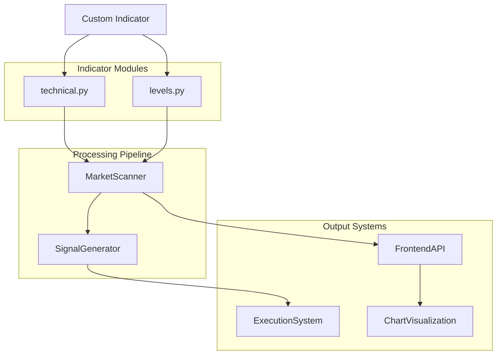
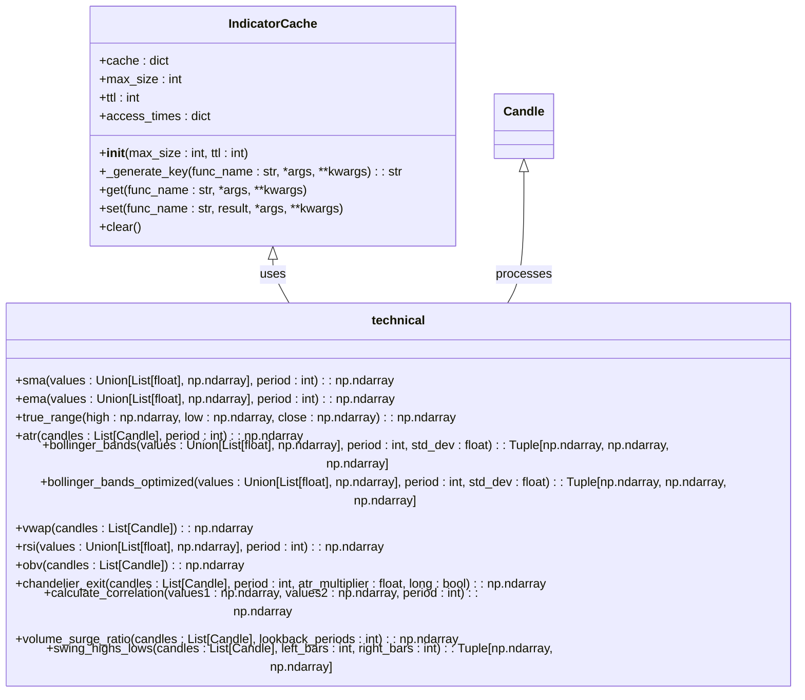
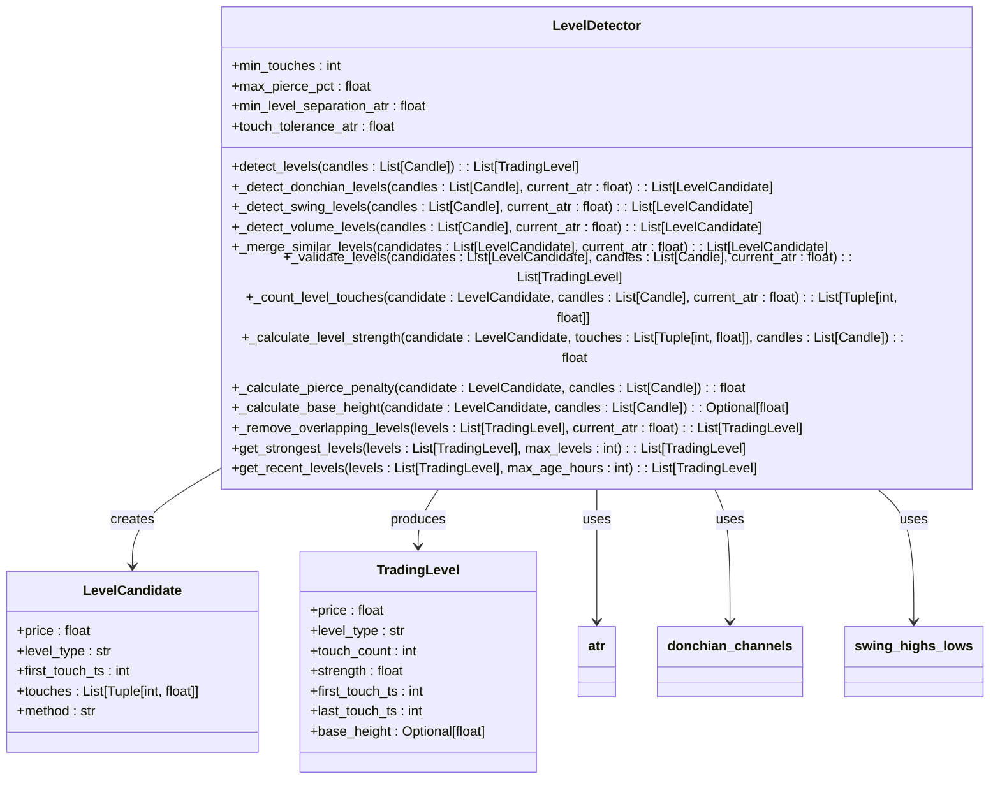
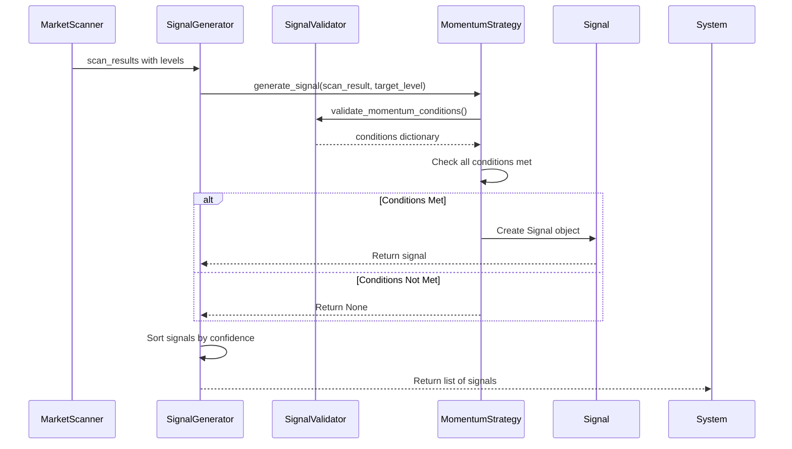

# Custom Indicator Integration

<cite>
**Referenced Files in This Document**   
- [technical.py](file://breakout_bot/indicators/technical.py)
- [levels.py](file://breakout_bot/indicators/levels.py)
- [market_scanner.py](file://breakout_bot/scanner/market_scanner.py)
- [signal_generator.py](file://breakout_bot/signals/signal_generator.py)
- [data/models.py](file://breakout_bot/data/models.py)
</cite>

## Table of Contents
1. [Introduction](#introduction)
2. [Indicator Architecture Overview](#indicator-architecture-overview)
3. [Technical Indicators Module](#technical-indicators-module)
4. [Levels Detection System](#levels-detection-system)
5. [Implementing Custom Indicators](#implementing-custom-indicators)
6. [Integrating with Market Scanner](#integrating-with-market-scanner)
7. [Signal Generation Pipeline](#signal-generation-pipeline)
8. [Advanced Indicator Examples](#advanced-indicator-examples)
9. [Performance Optimization](#performance-optimization)
10. [Frontend Visualization](#frontend-visualization)

## Introduction

This documentation provides comprehensive guidance for developing and integrating custom technical indicators into the Breakout Bot trading system. The document covers the architecture of the indicators module, focusing on `technical.py` for mathematical computations and `levels.py` for support/resistance detection. It details the process of implementing new indicator classes with proper input validation, state management, and output formatting.

The integration workflow demonstrates how to register indicators with the scanner pipeline in `market_scanner.py` and consume their output in `signal_generator.py` for decision-making. The documentation includes examples of advanced indicators such as volume-profile-based levels, machine learning predictors, or multi-timeframe consolidations.

Performance implications of complex calculations are addressed, along with strategies for caching or downsampling. The document also shows how to visualize custom indicators in the frontend via API extensions and charting components, providing a complete end-to-end guide for extending the trading system's analytical capabilities.

## Indicator Architecture Overview

The Breakout Bot trading system implements a modular indicator architecture designed for extensibility and performance. The core functionality is divided between two primary modules: `technical.py` for mathematical computations and `levels.py` for support/resistance level detection. These modules work together within a larger ecosystem that includes market scanning, signal generation, and frontend visualization components.



**Diagram sources**
- [technical.py](file://breakout_bot/indicators/technical.py#L1-L580)
- [levels.py](file://breakout_bot/indicators/levels.py#L1-L431)
- [market_scanner.py](file://breakout_bot/scanner/market_scanner.py#L1-L786)
- [signal_generator.py](file://breakout_bot/signals/signal_generator.py#L1-L799)

The architecture follows a clean separation of concerns where each component has a specific responsibility. The `technical.py` module focuses on pure mathematical calculations of standard technical indicators like ATR, Bollinger Bands, VWAP, and Donchian Channels. These functions operate on price and volume data to produce quantitative measurements of market conditions.

The `levels.py` module builds upon these technical calculations to identify meaningful support and resistance levels using multiple detection methods including Donchian channels, swing points, and volume analysis. This hierarchical approach allows higher-level concepts (trading levels) to be derived from lower-level mathematical computations.

Integration with the rest of the system occurs through well-defined interfaces. The market scanner consumes indicator outputs to score and rank trading opportunities, while the signal generator uses these results to make entry and exit decisions. The frontend visualization layer exposes indicator data through API endpoints for chart display.

**Section sources**
- [technical.py](file://breakout_bot/indicators/technical.py#L1-L580)
- [levels.py](file://breakout_bot/indicators/levels.py#L1-L431)

## Technical Indicators Module

The `technical.py` module serves as the foundation for all mathematical calculations in the trading system. It implements various technical indicators used for market analysis, including ATR, Bollinger Bands, VWAP, Donchian Channels, and more. The module is designed with performance optimization as a primary concern, utilizing NumPy arrays for efficient vectorized operations and pandas for rolling window calculations when available.



**Diagram sources**
- [technical.py](file://breakout_bot/indicators/technical.py#L1-L580)

The module features a sophisticated caching system implemented through the `IndicatorCache` class and `cached_indicator` decorator. This caching mechanism prevents redundant calculations by storing results based on function name and arguments, significantly improving performance during repeated analyses. The cache uses an LRU (Least Recently Used) eviction policy with configurable maximum size and time-to-live (TTL) parameters.

Key technical indicators implemented include:
- **ATR (Average True Range)**: Measures market volatility with caching support
- **Bollinger Bands**: Available in both standard and optimized pandas implementations
- **VWAP (Volume Weighted Average Price)**: Calculates intraday average price weighted by volume
- **RSI (Relative Strength Index)**: Momentum oscillator measuring speed and change of price movements
- **OBV (On-Balance Volume)**: Cumulative volume indicator that relates volume to price changes

The module also provides utility functions like `sma` (Simple Moving Average), `ema` (Exponential Moving Average), and `true_range` that serve as building blocks for more complex indicators. All functions are designed to handle edge cases gracefully, returning NaN values when insufficient data is available rather than raising exceptions.

Input validation is performed through type hints and explicit checks within functions, ensuring robustness against invalid inputs. Output formatting follows a consistent pattern of returning NumPy arrays with the same length as input data, maintaining alignment with the original candle timestamps.

**Section sources**
- [technical.py](file://breakout_bot/indicators/technical.py#L1-L580)

## Levels Detection System

The `levels.py` module implements a comprehensive system for identifying support and resistance levels in financial markets. This system combines multiple detection methods to create robust trading levels that can be used for breakout and retest strategies. The architecture centers around the `LevelDetector` class, which orchestrates various level detection algorithms and validates the results according to configurable parameters.



**Diagram sources**
- [levels.py](file://breakout_bot/indicators/levels.py#L1-L431)

The level detection process follows a multi-stage pipeline:
1. **Candidate Generation**: Multiple methods detect potential levels
2. **Candidate Merging**: Similar levels are combined to avoid redundancy
3. **Validation**: Candidates are validated against minimum criteria
4. **Scoring**: Validated levels receive strength scores
5. **Filtering**: Overlapping levels are removed based on separation criteria

Three primary detection methods are employed:
- **Donchian Channel Levels**: Uses high and low prices over different periods (10, 15, 20, 30) to identify recent highs and lows
- **Swing Point Levels**: Identifies local maxima and minima based on left and right bar comparisons
- **Volume-Based Levels**: Detects levels at the high and low points of high-volume candles (top 15% by volume)

The system incorporates several configurable parameters that control the sensitivity and quality of detected levels:
- `min_touches`: Minimum number of touches required for a valid level
- `max_pierce_pct`: Maximum price penetration as a percentage before invalidating a level
- `min_level_separation_atr`: Minimum distance between levels measured in ATR units
- `touch_tolerance_atr`: Tolerance for considering a candle touch as valid, measured in ATR units

Level validation includes calculating a strength score (0-1) based on multiple factors:
- Number of touches (more touches = stronger)
- Time span of touches (longer duration = stronger)
- Volume at touch points (higher volume = stronger)
- Pierce history (fewer penetrations = stronger)

The final output consists of `TradingLevel` objects that contain not only the price but also metadata about the level's characteristics, making them suitable for use in subsequent trading strategies.

**Section sources**
- [levels.py](file://breakout_bot/indicators/levels.py#L1-L431)

## Implementing Custom Indicators

Creating custom indicators for the Breakout Bot system involves following a structured approach that ensures compatibility with the existing architecture and optimal performance. The process begins with understanding the base requirements for indicator implementation, including proper input validation, state management, and output formatting.

To implement a new indicator, start by creating a function in either `technical.py` for mathematical calculations or `levels.py` for level detection, depending on the nature of your indicator. The function should accept appropriate parameters and return well-formatted results. For example, a custom indicator might analyze multi-timeframe consolidation patterns:

```python
@cached_indicator
def multi_timeframe_consolidation(candles_5m: List[Candle], 
                                candles_15m: List[Candle],
                                consolidation_threshold: float = 0.005) -> Dict[str, Any]:
    """
    Detect consolidation patterns across multiple timeframes.
    
    Args:
        candles_5m: 5-minute candle data
        candles_15m: 15-minute candle data
        consolidation_threshold: Maximum price range as percentage of average price
        
    Returns:
        Dictionary containing consolidation status and characteristics
    """
    if len(candles_5m) < 20 or len(candles_15m) < 10:
        return {'consolidating': False, 'reason': 'insufficient_data'}
    
    # Calculate 5m consolidation
    price_range_5m = max(c.high for c in candles_5m[-10:]) - min(c.low for c in candles_5m[-10:])
    avg_price_5m = sum(c.typical_price for c in candles_5m[-10:]) / 10
    consolidation_ratio_5m = price_range_5m / avg_price_5m
    
    # Calculate 15m consolidation  
    price_range_15m = max(c.high for c in candles_15m[-5:]) - min(c.low for c in candles_15m[-5:])
    avg_price_15m = sum(c.typical_price for c in candles_15m[-5:]) / 5
    consolidation_ratio_15m = price_range_15m / avg_price_15m
    
    # Check for multi-timeframe consolidation
    consolidating = (consolidation_ratio_5m <= consolidation_threshold and 
                    consolidation_ratio_15m <= consolidation_threshold)
    
    return {
        'consolidating': consolidating,
        '5m_consolidation_ratio': consolidation_ratio_5m,
        '15m_consolidation_ratio': consolidation_ratio_15m,
        'threshold': consolidation_threshold,
        'current_price': candles_5m[-1].close
    }
```

When implementing custom indicators, follow these best practices:
1. **Input Validation**: Always check for sufficient data and handle edge cases
2. **Type Hints**: Use Python type hints for better code documentation and IDE support
3. **Caching**: Apply the `@cached_indicator` decorator to expensive calculations
4. **Error Handling**: Use try-except blocks for external dependencies like pandas
5. **Performance**: Utilize NumPy vectorized operations instead of loops when possible

For indicators that need to maintain state between calls, consider using class-based implementations. This approach allows you to store intermediate calculations and avoid recomputing values unnecessarily:

```python
class MLPricePredictor:
    """Machine learning predictor for price direction."""
    
    def __init__(self, model_path: str = None):
        self.model = self._load_model(model_path)
        self.feature_scaler = StandardScaler()
        self.last_prediction = None
        self.prediction_confidence = 0.0
        
    def _load_model(self, model_path: str) -> Any:
        """Load ML model from file or initialize default."""
        if model_path and os.path.exists(model_path):
            return joblib.load(model_path)
        else:
            # Return simple linear model as fallback
            return LinearRegression()
            
    def predict(self, candles: List[Candle], market_data: MarketData) -> Dict[str, Any]:
        """Generate price prediction using ML model."""
        if len(candles) < 50:
            return {'prediction': 0, 'confidence': 0, 'trend': 'neutral'}
            
        # Extract features
        features = self._extract_features(candles, market_data)
        
        # Scale features
        scaled_features = self.feature_scaler.fit_transform([features])
        
        # Generate prediction
        prediction = self.model.predict(scaled_features)[0]
        confidence = self._calculate_confidence()  # Based on model metrics
        
        # Update internal state
        self.last_prediction = prediction
        self.prediction_confidence = confidence
        
        return {
            'prediction': float(prediction),
            'confidence': float(confidence),
            'trend': 'bullish' if prediction > 0 else 'bearish',
            'timestamp': candles[-1].ts
        }
        
    def _extract_features(self, candles: List[Candle], market_data: MarketData) -> List[float]:
        """Extract predictive features from market data."""
        # Implementation of feature extraction logic
        pass
        
    def _calculate_confidence(self) -> float:
        """Calculate prediction confidence based on model performance."""
        # Implementation of confidence calculation
        pass
```

Output formatting should follow the established patterns in the codebase, typically returning dictionaries with descriptive keys or specialized data structures like `TradingLevel`. Ensure that timestamps are properly synchronized with the input candle data to maintain temporal consistency.

**Section sources**
- [technical.py](file://breakout_bot/indicators/technical.py#L1-L580)
- [levels.py](file://breakout_bot/indicators/levels.py#L1-L431)

## Integrating with Market Scanner

Integrating custom indicators with the market scanner pipeline involves connecting your indicator outputs to the `BreakoutScanner` class in `market_scanner.py`. This integration enables the scanner to use your indicator results for scoring and ranking trading opportunities. The process requires understanding the scanner's architecture and implementing the appropriate hooks for your custom indicators.

The market scanner operates through a multi-stage filtering and scoring process. To integrate a custom indicator, you need to extend either the filtering or scoring components of the scanner. The `MarketFilter` class handles various filter types, while the `MarketScorer` class calculates overall scores based on weighted metrics.

To add a custom filter based on your indicator, extend the `MarketFilter` class by adding a new method that applies your specific criteria:

```python
def apply_custom_filter(self, market_data: MarketData, metrics: ScanMetrics) -> Dict[str, FilterResult]:
    """Apply custom indicator-based filter."""
    results = {}
    
    # Example: Filter based on multi-timeframe consolidation
    if hasattr(market_data, 'mtf_consolidation'):
        consolidation_data = market_data.mtf_consolidation
        results['mtf_consolidation'] = FilterResult(
            passed=consolidation_data.get('consolidating', False),
            value=consolidation_data.get('5m_consolidation_ratio', 1.0),
            threshold=self.preset.custom_filters.consolidation_threshold,
            reason=f"MTF consolidation: {consolidation_data.get('5m_consolidation_ratio', 0):.4f}"
        )
    
    # Example: Filter based on ML prediction confidence
    if hasattr(market_data, 'ml_prediction'):
        ml_data = market_data.ml_prediction
        results['ml_confidence'] = FilterResult(
            passed=ml_data.get('confidence', 0) >= self.preset.custom_filters.min_ml_confidence,
            value=ml_data.get('confidence', 0),
            threshold=self.preset.custom_filters.min_ml_confidence,
            reason=f"ML confidence: {ml_data.get('confidence', 0):.3f}"
        )
    
    return results
```

For scoring purposes, extend the `MarketScorer` class to incorporate your indicator outputs into the overall score calculation:

```python
def _calculate_custom_score(self, metrics: ScanMetrics, market_data: MarketData) -> float:
    """Calculate score component for custom indicators."""
    custom_score = 0.0
    
    # Example: Score based on consolidation breakout potential
    if (hasattr(market_data, 'mtf_consolidation') and 
        market_data.mtf_consolidation.get('consolidating', False)):
        
        # Higher score for tighter consolidation
        consolidation_ratio = market_data.mtf_consolidation.get('5m_consolidation_ratio', 1.0)
        normalized_ratio = max(0, 1 - (consolidation_ratio / 0.01))  # Cap at 1%
        custom_score += normalized_ratio * self.weights.get('mtf_consolidation', 0.0)
    
    # Example: Score based on ML prediction
    if hasattr(market_data, 'ml_prediction'):
        ml_confidence = market_data.ml_prediction.get('confidence', 0)
        ml_direction = market_data.ml_prediction.get('trend', 'neutral')
        
        # Only score bullish predictions for long strategies
        if (ml_direction == 'bullish' and 
            ml_confidence >= 0.6):  # Minimum confidence threshold
            custom_score += ml_confidence * self.weights.get('ml_prediction', 0.0)
    
    return custom_score
```

The integration process also requires modifying the `calculate_scan_metrics` method to ensure your custom indicators are calculated during the scanning process:

```python
def _calculate_scan_metrics(self, market_data: MarketData, 
                          btc_data: Optional[MarketData] = None) -> ScanMetrics:
    """Calculate all metrics needed for scanning."""
    metrics = ScanMetrics()
    
    # Existing metric calculations...
    
    # Add custom indicator calculations
    if market_data.candles_5m and market_data.candles_15m:
        try:
            # Calculate multi-timeframe consolidation
            mtf_result = multi_timeframe_consolidation(
                market_data.candles_5m, 
                market_data.candles_15m,
                self.preset.custom_filters.consolidation_threshold
            )
            metrics.mtf_consolidation = mtf_result
            
            # Calculate ML prediction
            ml_predictor = getattr(self, 'ml_predictor', None)
            if ml_predictor:
                ml_result = ml_predictor.predict(
                    market_data.candles_5m, 
                    market_data
                )
                metrics.ml_prediction = ml_result
                
        except Exception as exc:
            logger.debug(f"Custom indicator calculation failed: {exc}")
    
    return metrics
```

Configuration for custom indicators should be added to the trading preset system, allowing users to adjust parameters through JSON configuration files. This approach maintains consistency with the existing architecture and provides flexibility for different trading strategies.

The scanner's batch processing architecture ensures that custom indicators are evaluated efficiently across multiple markets. By leveraging the existing caching mechanisms and parallel processing capabilities, your custom indicators will perform optimally even when scanning large universes of assets.

**Section sources**
- [market_scanner.py](file://breakout_bot/scanner/market_scanner.py#L1-L786)

## Signal Generation Pipeline

The signal generation pipeline in `signal_generator.py` consumes indicator outputs from the market scanner to generate actionable trading signals. This pipeline implements momentum and retest strategies that evaluate market conditions based on level breakouts and other technical factors. Custom indicators can be integrated into this pipeline to influence signal generation decisions.

The signal generation process is coordinated by the `SignalGenerator` class, which manages multiple strategy implementations including `MomentumStrategy` and `RetestStrategy`. Each strategy uses a `SignalValidator` to assess whether specific conditions are met before generating a signal. To integrate custom indicators, extend the validation logic to incorporate your indicator outputs.



**Diagram sources**
- [signal_generator.py](file://breakout_bot/signals/signal_generator.py#L1-L799)
- [market_scanner.py](file://breakout_bot/scanner/market_scanner.py#L1-L786)

To integrate a custom indicator into the signal validation process, extend the `validate_momentum_conditions` or `validate_retest_conditions` methods in the `SignalValidator` class:

```python
def validate_momentum_conditions(
    self,
    symbol: str,
    candles: List[Candle],
    level: TradingLevel,
    l2_depth: L2Depth,
    current_price: float,
) -> Dict[str, Any]:
    """Validate conditions for momentum breakout signal with custom indicators."""
    conditions = {
        'price_breakout': False,
        'volume_surge': False,
        'body_ratio': False,
        'l2_imbalance': False,
        'vwap_gap': False,
        'custom_indicator': False,  # New custom condition
        'details': {}
    }
    
    # Existing condition validations...
    
    # Custom indicator validation
    if hasattr(candles, 'custom_indicator_data'):
        custom_data = candles.custom_indicator_data
        
        # Example: Require ML prediction to confirm momentum direction
        if (custom_data.get('ml_prediction', {}).get('trend') == 'bullish' and
            custom_data.get('ml_prediction', {}).get('confidence', 0) >= 0.7):
            conditions['custom_indicator'] = True
            conditions['details']['ml_confidence'] = custom_data.get('ml_prediction', {}).get('confidence')
        else:
            conditions['custom_indicator'] = False
            conditions['details']['ml_reason'] = 'prediction too weak or wrong direction'
    
    # Example: Require consolidation breakout pattern
    if (custom_data.get('mtf_consolidation', {}).get('consolidating') and
        current_price > custom_data.get('mtf_consolidation', {}).get('breakout_price', 0)):
        conditions['custom_indicator'] = conditions['custom_indicator'] or True
        conditions['details']['consolidation_status'] = 'breakout confirmed'
    
    return conditions
```

The confidence calculation in the `_calculate_momentum_confidence` method can also be extended to incorporate custom indicator outputs:

```python
def _calculate_momentum_confidence(self, 
                                 conditions: Dict[str, Any],
                                 scan_result: ScanResult) -> float:
    """Calculate signal confidence based on conditions and scan score."""
    # Base confidence from scan score
    scan_confidence = min(1.0, max(0.0, (scan_result.score + 2) / 4))
    
    # Existing factor calculations...
    
    # Custom indicator strength
    ml_confidence = conditions.get('details', {}).get('ml_confidence', 0.0)
    ml_strength = min(1.0, ml_confidence / 0.8)  # Max at 0.8 confidence
    
    consolidation_factor = 1.2 if conditions.get('details', {}).get('consolidation_status') == 'breakout confirmed' else 1.0
    
    # Combine factors with custom weights
    confidence = (scan_confidence * 0.3 +
                 volume_strength * 0.2 +
                 body_strength * 0.1 +
                 imbalance_strength * 0.1 +
                 ml_strength * 0.2 +
                 consolidation_factor * 0.1)
    
    return max(0.1, min(1.0, confidence))
```

For more complex integrations, you can create entirely new strategy classes that inherit from the base strategy pattern:

```python
class MLDrivenStrategy:
    """Strategy based primarily on machine learning predictions."""
    
    def __init__(self, preset: TradingPreset, diagnostics: Optional[DiagnosticsCollector] = None):
        self.preset = preset
        self.signal_config = preset.signal_config
        self.diagnostics = diagnostics
        self.ml_predictor = MLPredictor()
    
    def generate_signal(self, 
                       scan_result: ScanResult,
                       target_level: TradingLevel) -> Optional[Signal]:
        """Generate signal based on ML predictions."""
        market_data = scan_result.market_data
        
        if not market_data.candles_5m:
            return None
        
        # Get ML prediction
        prediction = self.ml_predictor.predict(market_data.candles_5m, market_data)
        
        # Only generate signals for high-confidence predictions
        if prediction['confidence'] < self.signal_config.ml_min_confidence:
            return None
            
        # Determine side based on prediction
        if prediction['direction'] == 'up':
            side = 'long'
            entry_price = market_data.price * (1 + self.signal_config.ml_entry_buffer)
            stop_loss = market_data.price * (1 - self.signal_config.ml_risk_percent)
        else:
            side = 'short'
            entry_price = market_data.price * (1 - self.signal_config.ml_entry_buffer)
            stop_loss = market_data.price * (1 + self.signal_config.ml_risk_percent)
        
        # Create signal
        signal = Signal(
            symbol=market_data.symbol,
            side=side,
            strategy='ml_driven',
            reason=f"ML prediction: {prediction['direction']} with {prediction['confidence']:.2f} confidence",
            entry=entry_price,
            level=target_level.price if target_level else market_data.price,
            sl=stop_loss,
            confidence=prediction['confidence'],
            timestamp=int(datetime.now().timestamp() * 1000),
            meta={
                'ml_prediction': prediction,
                'scan_score': scan_result.score,
                'model_version': self.ml_predictor.version
            }
        )
        
        return signal
```

The `SignalGenerator` class can then be modified to include this new strategy in its decision-making process, either as a primary strategy or as a fallback option. This modular approach allows for flexible combination of traditional technical analysis with innovative machine learning techniques.

**Section sources**
- [signal_generator.py](file://breakout_bot/signals/signal_generator.py#L1-L799)

## Advanced Indicator Examples

This section presents concrete examples of advanced indicators that extend the Breakout Bot system's capabilities beyond traditional technical analysis. These examples demonstrate how to implement sophisticated analytical tools that leverage machine learning, volume profile analysis, and multi-timeframe consolidation patterns.

### Volume-Profile-Based Levels

Volume-profile-based levels identify significant price areas based on historical trading activity. Unlike traditional support and resistance levels that focus on price extremes, volume profile levels highlight zones where the majority of trading volume has occurred, indicating areas of high market interest.

```python
def calculate_volume_profile_levels(candles: List[Candle], 
                                  period: int = 100,
                                  bins: int = 20) -> List[Dict[str, Any]]:
    """
    Calculate volume profile levels based on historical trading activity.
    
    Args:
        candles: List of candle data
        period: Lookback period for volume profile
        bins: Number of price bins to divide the range
        
    Returns:
        List of volume profile levels with significance scores
    """
    if len(candles) < period:
        return []
        
    # Get recent candles
    recent_candles = candles[-period:]
    
    # Calculate price range
    min_price = min(c.low for c in recent_candles)
    max_price = max(c.high for c in recent_candles)
    price_range = max_price - min_price
    
    if price_range == 0:
        return []
        
    # Create price bins
    bin_size = price_range / bins
    bins_list = []
    
    for i in range(bins):
        bin_start = min_price + (i * bin_size)
        bin_end = bin_start + bin_size
        bins_list.append({
            'start': bin_start,
            'end': bin_end,
            'center': (bin_start + bin_end) / 2,
            'volume': 0,
            'candles': []
        })
    
    # Assign candles to bins and accumulate volume
    for candle in recent_candles:
        candle_center = candle.hl2  # High-low midpoint
        
        # Find appropriate bin
        bin_index = int((candle_center - min_price) / bin_size)
        bin_index = max(0, min(bin_index, bins - 1))  # Clamp to valid range
        
        bins_list[bin_index]['volume'] += candle.volume
        bins_list[bin_index]['candles'].append(candle)
    
    # Identify significant levels
    total_volume = sum(bin['volume'] for bin in bins_list)
    if total_volume == 0:
        return []
        
    significant_levels = []
    
    for bin_data in bins_list:
        volume_ratio = bin_data['volume'] / total_volume
        
        # Consider bin significant if it contains more than 5% of total volume
        if volume_ratio > 0.05:
            level_type = 'support' if bin_data['center'] < sum(c.close for c in recent_candles[-20:]) / 20 else 'resistance'
            
            significant_levels.append({
                'price': bin_data['center'],
                'level_type': level_type,
                'volume_ratio': volume_ratio,
                'volume': bin_data['volume'],
                'candles_count': len(bin_data['candles']),
                'method': 'volume_profile',
                'significance': volume_ratio / 0.05  # Relative significance
            })
    
    # Sort by significance
    significant_levels.sort(key=lambda x: x['significance'], reverse=True)
    
    return significant_levels
```

### Machine Learning Predictors

Machine learning predictors can enhance trading decisions by identifying complex patterns in market data that may not be apparent through traditional technical analysis. The following example demonstrates a simple ML predictor that uses scikit-learn to forecast price direction based on technical indicators.

```python
class PriceDirectionPredictor:
    """Machine learning predictor for price direction."""
    
    def __init__(self, model_type: str = 'random_forest'):
        self.model_type = model_type
        self.model = self._create_model()
        self.scaler = StandardScaler()
        self.is_trained = False
        self.feature_names = [
            'rsi', 'bb_width', 'atr_ratio', 'volume_surge',
            'price_momentum', 'volatility_regime', 'trend_strength'
        ]
        
    def _create_model(self):
        """Create ML model based on specified type."""
        if self.model_type == 'random_forest':
            return RandomForestClassifier(n_estimators=100, random_state=42)
        elif self.model_type == 'xgboost':
            return XGBClassifier(random_state=42)
        else:
            return LogisticRegression(random_state=42)
            
    def extract_features(self, candles: List[Candle]) -> np.ndarray:
        """Extract predictive features from candle data."""
        if len(candles) < 50:
            raise ValueError("Insufficient data for feature extraction")
            
        closes = np.array([c.close for c in candles])
        volumes = np.array([c.volume for c in candles])
        
        # Calculate technical indicators
        rsi_values = rsi(closes, period=14)
        bb_upper, bb_middle, bb_lower = bollinger_bands(closes, period=20)
        bb_width = ((bb_upper - bb_lower) / bb_middle) * 100
        atr_values = atr(candles, period=14)
        volume_surge = volume_surge_ratio(candles, lookback_periods=20)
        
        # Extract recent values
        current_idx = len(candles) - 1
        features = [
            rsi_values[current_idx] if current_idx < len(rsi_values) else 50,
            bb_width[current_idx] if current_idx < len(bb_width) else 0,
            (atr_values[current_idx] / closes[current_idx]) if current_idx < len(atr_values) and closes[current_idx] > 0 else 0.01,
            volume_surge[current_idx] if current_idx < len(volume_surge) else 1,
            (closes[current_idx] - closes[current_idx-5]) / closes[current_idx-5] if current_idx >= 5 else 0,
            1 if bb_width[current_idx] < np.median(bb_width[-50:]) else 0 if current_idx < len(bb_width) else 0,
            (closes[current_idx] - np.mean(closes[-20:])) / (np.std(closes[-20:]) + 1e-8) if len(candles) >= 20 else 0
        ]
        
        return np.array(features).reshape(1, -1)
        
    def train(self, historical_data: List[Dict]) -> None:
        """Train the model on historical data."""
        X = []
        y = []
        
        for data_point in historical_data:
            try:
                candles = data_point['candles']
                future_return = data_point['future_return']  # 1 for up, 0 for down
                
                features = self.extract_features(candles).flatten()
                X.append(features)
                y.append(1 if future_return > 0 else 0)
                
            except Exception:
                continue
                
        if len(X) < 10:
            return
            
        X = np.array(X)
        y = np.array(y)
        
        # Scale features
        X_scaled = self.scaler.fit_transform(X)
        
        # Train model
        self.model.fit(X_scaled, y)
        self.is_trained = True
        
    def predict(self, candles: List[Candle]) -> Dict[str, Any]:
        """Generate price direction prediction."""
        if not self.is_trained:
            return {'direction': 'neutral', 'confidence': 0.0, 'probability_up': 0.5}
            
        try:
            # Extract features
            features = self.extract_features(candles)
            
            # Scale features
            features_scaled = self.scaler.transform(features)
            
            # Get prediction probabilities
            proba = self.model.predict_proba(features_scaled)[0]
            probability_up = proba[1]
            probability_down = proba[0]
            
            # Determine direction
            if probability_up > 0.6:
                direction = 'up'
            elif probability_down > 0.6:
                direction = 'down'
            else:
                direction = 'neutral'
                
            # Calculate confidence
            confidence = max(probability_up, probability_down) - 0.5
            
            return {
                'direction': direction,
                'confidence': confidence,
                'probability_up': probability_up,
                'probability_down': probability_down,
                'model_type': self.model_type,
                'feature_values': dict(zip(self.feature_names, features.flatten()))
            }
            
        except Exception as e:
            return {'direction': 'neutral', 'confidence': 0.0, 'error': str(e)}
```

### Multi-Timeframe Consolidations

Multi-timeframe consolidation detection identifies periods of low volatility across different timeframes, which often precede significant breakout moves. This indicator analyzes price action on multiple timeframes simultaneously to identify confluence in consolidation patterns.

```python
def detect_multi_timeframe_consolidation(candles_5m: List[Candle],
                                       candles_15m: List[Candle],
                                       candles_1h: List[Candle],
                                       consolidation_threshold: float = 0.008) -> Dict[str, Any]:
    """
    Detect consolidation patterns across multiple timeframes.
    
    Args:
        candles_5m: 5-minute candle data
        candles_15m: 15-minute candle data  
        candles_1h: 1-hour candle data
        consolidation_threshold: Maximum price range as percentage of average price
        
    Returns:
        Dictionary containing consolidation analysis across timeframes
    """
    results = {
        'overall_consolidating': False,
        'timeframe_scores': {},
        'consolidation_strength': 0.0,
        'breakout_probability': 0.0,
        'tightest_range': float('inf'),
        'widest_range': 0
    }
    
    timeframe_configs = [
        ('5m', candles_5m, 20),
        ('15m', candles_15m, 15),
        ('1h', candles_1h, 10)
    ]
    
    valid_timeframes = 0
    total_score = 0
    
    for tf_name, tf_candles, lookback in timeframe_configs:
        if len(tf_candles) < lookback:
            continue
            
        # Calculate price range for timeframe
        recent_candles = tf_candles[-lookback:]
        price_range = max(c.high for c in recent_candles) - min(c.low for c in recent_candles)
        avg_price = sum(c.typical_price for c in recent_candles) / len(recent_candles)
        
        if avg_price == 0:
            continue
            
        consolidation_ratio = price_range / avg_price
        
        # Calculate score for this timeframe (lower ratio = higher score)
        timeframe_score = max(0, 1 - (consolidation_ratio / consolidation_threshold))
        
        results['timeframe_scores'][tf_name] = {
            'ratio': consolidation_ratio,
            'score': timeframe_score,
            'range_points': price_range,
            'avg_price': avg_price
        }
        
        valid_timeframes += 1
        total_score += timeframe_score
        
        # Track tightest and widest ranges
        results['tightest_range'] = min(results['tightest_range'], consolidation_ratio)
        results['widest_range'] = max(results['widest_range'], consolidation_ratio)
    
    if valid_timeframes == 0:
        return results
        
    # Calculate overall metrics
    results['consolidation_strength'] = total_score / valid_timeframes
    results['overall_consolidating'] = results['consolidation_strength'] > 0.7
    
    # Calculate breakout probability based on consolidation strength and range compression
    range_compression = results['widest_range'] / (results['tightest_range'] + 1e-8)
    results['breakout_probability'] = min(1.0, results['consolidation_strength'] * range_compression * 0.8)
    
    return results
```

These advanced examples demonstrate how the Breakout Bot system can be extended with sophisticated analytical tools. Each indicator follows the established patterns for input validation, error handling, and output formatting, ensuring seamless integration with the existing architecture. The examples also illustrate how to balance complexity with performance considerations, using appropriate data structures and algorithms to maintain system responsiveness.

**Section sources**
- [technical.py](file://breakout_bot/indicators/technical.py#L1-L580)
- [levels.py](file://breakout_bot/indicators/levels.py#L1-L431)

## Performance Optimization

Performance optimization is critical when implementing custom indicators, especially those involving complex calculations or machine learning models. The Breakout Bot system provides several mechanisms to ensure efficient execution, including caching, downsampling, and parallel processing. Understanding and leveraging these optimization strategies is essential for maintaining system responsiveness during market scanning and signal generation.

The primary optimization mechanism is the caching system implemented in `technical.py`. The `IndicatorCache` class and `cached_indicator` decorator prevent redundant calculations by storing results based on function name and arguments. When implementing custom indicators, always consider whether your calculations can benefit from caching:

```python
@cached_indicator
def complex_indicator_calculation(candles: List[Candle], 
                               parameter1: float,
                               parameter2: int) -> np.ndarray:
    """
    Example of a computationally expensive indicator that benefits from caching.
    
    The @cached_indicator decorator ensures this function is only calculated once
    for the same inputs, significantly improving performance during repeated scans.
    """
    # Complex calculation that would be expensive to repeat
    result = expensive_computation(candles, parameter1, parameter2)
    return result
```

For indicators that cannot be easily cached, consider implementing manual caching at the instance level:

```python
class OptimizedIndicator:
    """Indicator with manual caching for intermediate results."""
    
    def __init__(self):
        self._cache = {}
        self._cache_ttl = 300  # 5 minutes
        
    def _get_cache_key(self, *args, **kwargs) -> str:
        """Generate cache key from arguments."""
        key_data = f"{str(args)}:{str(sorted(kwargs.items()))}"
        return hashlib.md5(key_data.encode()).hexdigest()
        
    def _is_cache_valid(self, key: str) -> bool:
        """Check if cache entry is still valid."""
        if key not in self._cache:
            return False
            
        return time.time() - self._cache[key]['timestamp'] < self._cache_ttl
        
    def calculate(self, candles: List[Candle], config: Dict) -> Dict:
        """Calculate indicator with caching."""
        cache_key = self._get_cache_key(candles[-1].ts, len(candles), config)
        
        if self._is_cache_valid(cache_key):
            return self._cache[cache_key]['result']
            
        # Perform expensive calculation
        result = self._perform_calculation(candles, config)
        
        # Store in cache
        self._cache[cache_key] = {
            'result': result,
            'timestamp': time.time()
        }
        
        # Clean up old cache entries
        self._cleanup_cache()
        
        return result
        
    def _cleanup_cache(self):
        """Remove expired cache entries."""
        now = time.time()
        expired_keys = [k for k, v in self._cache.items() if now - v['timestamp'] > self._cache_ttl]
        for key in expired_keys:
            del self._cache[key]
```

Downsampling is another effective strategy for improving performance, particularly when working with high-frequency data. Instead of processing every candle, consider aggregating data to a lower timeframe:

```python
def downsample_candles(candles: List[Candle], factor: int = 3) -> List[Candle]:
    """
    Downsample candles by combining multiple candles into one.
    
    Args:
        candles: Original high-frequency candles
        factor: Number of candles to combine
        
    Returns:
        List of downsampled candles
    """
    if len(candles) < factor:
        return candles
        
    downsampled = []
    
    for i in range(0, len(candles), factor):
        batch = candles[i:i + factor]
        
        # Create combined candle
        combined = Candle(
            ts=batch[-1].ts,
            open=batch[0].open,
            high=max(c.high for c in batch),
            low=min(c.low for c in batch),
            close=batch[-1].close,
            volume=sum(c.volume for c in batch)
        )
        
        downsampled.append(combined)
        
    return downsampled

# Usage in indicator calculation
def fast_indicator_with_downsampling(candles: List[Candle]) -> Dict:
    """Indicator that uses downsampling for improved performance."""
    # Downsample to reduce computational load
    downsampled_candles = downsample_candles(candles, factor=3)
    
    # Perform calculation on reduced dataset
    result = simple_calculation(downsampled_candles)
    
    return result
```

For machine learning models, consider the following optimization strategies:
- **Model Simplification**: Use simpler models (e.g., logistic regression) when they provide sufficient accuracy
- **Feature Selection**: Reduce the number of input features to only the most predictive ones
- **Batch Processing**: Process multiple symbols simultaneously to amortize model loading costs
- **Model Quantization**: Convert models to lower precision formats when possible

```python
class OptimizedMLPredictor:
    """ML predictor optimized for trading system performance."""
    
    def __init__(self):
        self.model = None
        self.scaler = StandardScaler()
        self.feature_selector = None
        self.warmup_complete = False
        
    async def warmup(self, symbols: List[str]):
        """Pre-load model and warm up cache for expected symbols."""
        # Load model in advance
        self._load_model()
        
        # Pre-calculate common features
        for symbol in symbols[:10]:  # Limit to top symbols
            try:
                candles = await fetch_candles(symbol, '5m', 100)
                self._extract_features(candles)  # Warm up feature cache
            except:
                continue
                
        self.warmup_complete = True
        
    def _load_model(self):
        """Load optimized model version."""
        # Use quantized or simplified model
        self.model = load_quantized_model('path/to/optimized/model')
        
    def predict_batch(self, market_data_dict: Dict[str, MarketData]) -> Dict[str, Dict]:
        """Process multiple symbols in batch for efficiency."""
        results = {}
        
        # Extract features for all symbols
        X_list = []
        symbols_list = []
        
        for symbol, market_data in market_data_dict.items():
            try:
                features = self._extract_features(market_data.candles_5m)
                X_list.append(features)
                symbols_list.append(symbol)
            except:
                continue
                
        if not X_list:
            return results
            
        # Convert to array and scale
        X = np.array(X_list)
        X_scaled = self.scaler.transform(X)
        
        # Single model inference call
        predictions = self.model.predict_proba(X_scaled)
        
        # Format results
        for i, symbol in enumerate(symbols_list):
            results[symbol] = {
                'probability_up': predictions[i][1],
                'confidence': max(predictions[i]) - 0.5
            }
            
        return results
```

The system's architecture supports parallel processing through asyncio, allowing multiple indicators to be calculated concurrently:

```python
async def calculate_indicators_parallel(candles: List[Candle], 
                                     symbols: List[str]) -> Dict[str, Dict]:
    """Calculate indicators for multiple symbols in parallel."""
    tasks = []
    
    for symbol in symbols:
        task = asyncio.create_task(calculate_symbol_indicators(candles, symbol))
        tasks.append(task)
        
    # Execute all tasks concurrently
    results = await asyncio.gather(*tasks, return_exceptions=True)
    
    # Combine results
    combined_results = {}
    for i, symbol in enumerate(symbols):
        if isinstance(results[i], Exception):
            combined_results[symbol] = {'error': str(results[i])}
        else:
            combined_results[symbol] = results[i]
            
    return combined_results
```

By combining these optimization strategies—caching, downsampling, model optimization, and parallel processing—you can implement sophisticated indicators without compromising system performance. The key is to profile your indicators under realistic conditions and apply the most appropriate optimizations based on the specific bottlenecks identified.

**Section sources**
- [technical.py](file://breakout_bot/indicators/technical.py#L1-L580)
- [levels.py](file://breakout_bot/indicators/levels.py#L1-L431)

## Frontend Visualization

Visualizing custom indicators in the frontend requires extending the API endpoints and charting components to expose and render the new indicator data. The Breakout Bot system uses a FastAPI backend with React frontend components, following a structured approach to data exposure and visualization.

The API extension process begins with modifying the existing router in `charts.py` to include endpoints for custom indicator data:

```python
@router.get("/indicator-data/{symbol}/{indicator_name}")
async def get_indicator_data(symbol: str, indicator_name: str, timeframe: str = "5m"):
    """Get custom indicator data for a specific symbol and indicator."""
    try:
        engine = get_engine_optional()
        if not engine:
            raise HTTPException(status_code=503, detail="Engine not initialized")
            
        # Get market data
        market_data = engine.market_data_cache.get(symbol)
        if not market_data:
            market_data = await engine._fetch_market_data_safe(symbol)
            if not market_data:
                raise HTTPException(status_code=404, detail=f"Market data not found for {symbol}")
                
        # Extract indicator data based on indicator name
        indicator_data = []
        
        if indicator_name == "volume_profile":
            # Generate volume profile data
            vp_levels = calculate_volume_profile_levels(market_data.candles_5m)
            for level in vp_levels:
                indicator_data.append({
                    'price': level['price'],
                    'type': level['level_type'],
                    'volume_ratio': level['volume_ratio'],
                    'significance': level['significance'],
                    'timestamp': market_data.timestamp
                })
                
        elif indicator_name == "ml_prediction":
            # Get ML prediction data
            ml_predictor = getattr(engine, 'ml_predictor', None)
            if ml_predictor:
                prediction = ml_predictor.predict(market_data.candles_5m, market_data)
                indicator_data.append({
                    'direction': prediction['direction'],
                    'confidence': prediction['confidence'],
                    'probability_up': prediction['probability_up'],
                    'timestamp': market_data.timestamp
                })
                
        elif indicator_name == "multi_timeframe":
            # Generate multi-timeframe consolidation data
            consolidation = detect_multi_timeframe_consolidation(
                market_data.candles_5m,
                market_data.candles_15m,
                market_data.candles_1h
            )
            indicator_data.append({
                'consolidating': consolidation['overall_consolidating'],
                'strength': consolidation['consolidation_strength'],
                'breakout_probability': consolidation['breakout_probability'],
                'timestamp': market_data.timestamp
            })
            
        return {
            "symbol": symbol,
            "indicator": indicator_name,
            "timeframe": timeframe,
            "data": indicator_data,
            "timestamp": datetime.now().isoformat() + "Z"
        }
        
    except HTTPException:
        raise
    except Exception as e:
        logger.error(f"Failed to get indicator data for {symbol}: {e}")
        raise HTTPException(status_code=500, detail=f"Failed to get indicator data: {str(e)}")
```

On the frontend, create React components to visualize the custom indicator data. The components should be designed to integrate seamlessly with the existing charting infrastructure:

```typescript
// VolumeProfileOverlay.tsx
import React from 'react';
import { Chart, LineElement, PointElement, BarElement } from 'chart.js';
import { Scatter } from 'react-chartjs-2';

interface VolumeProfileData {
  price: number;
  type: string;
  volume_ratio: number;
  significance: number;
}

interface VolumeProfileOverlayProps {
  data: VolumeProfileData[];
  height?: number;
}

export const VolumeProfileOverlay: React.FC<VolumeProfileOverlayProps> = ({ data, height = 400 }) => {
  // Transform data for Chart.js
  const chartData = {
    datasets: [
      {
        label: 'Support Levels',
        data: data
          .filter(level => level.type === 'support')
          .map(level => ({
            x: level.timestamp,
            y: level.price,
            r: Math.max(5, level.significance * 20)
          })),
        backgroundColor: 'rgba(92, 184, 92, 0.5)',
        borderColor: 'rgba(92, 184, 92, 1)',
        borderWidth: 2,
      },
      {
        label: 'Resistance Levels', 
        data: data
          .filter(level => level.type === 'resistance')
          .map(level => ({
            x: level.timestamp,
            y: level.price,
            r: Math.max(5, level.significance * 20)
          })),
        backgroundColor: 'rgba(217, 83, 79, 0.5)',
        borderColor: 'rgba(217, 83, 79, 1)',
        borderWidth: 2,
      }
    ]
  };

  const options = {
    responsive: true,
    maintainAspectRatio: false,
    scales: {
      x: {
        type: 'time' as const,
        time: {
          unit: 'minute' as const
        },
        title: {
          display: true,
          text: 'Time'
        }
      },
      y: {
        title: {
          display: true,
          text: 'Price'
        }
      }
    },
    plugins: {
      tooltip: {
        callbacks: {
          label: (context: any) => {
            const data = context.raw;
            return [
              `Price: ${data.y.toFixed(6)}`,
              `Significance: ${(data.r / 20).toFixed(2)}`,
              `Volume Ratio: ${(data.volume_ratio * 100).toFixed(1)}%`
            ];
          }
        }
      }
    }
  };

  return (
    <div style={{ height: `${height}px`, width: '100%' }}>
      <Scatter data={chartData} options={options} />
    </div>
  );
};
```

For machine learning predictions, create a dedicated visualization component that displays confidence levels and directional bias:

```typescript
// MLPredictionIndicator.tsx
import React from 'react';
import { CircularProgressbar, buildStyles } from 'react-circular-progressbar';
import 'react-circular-progressbar/dist/styles.css';

interface MLPrediction {
  direction: string;
  confidence: number;
  probability_up: number;
}

interface MLPredictionIndicatorProps {
  prediction: MLPrediction;
}

export const MLPredictionIndicator: React.FC<MLPredictionIndicatorProps> = ({ prediction }) => {
  // Calculate progress value (0-100)
  const progress = Math.round(prediction.confidence * 100);
  
  // Determine color based on direction
  const getColor = () => {
    if (prediction.direction === 'up') return '#5cb85c';
    if (prediction.direction === 'down') return '#d9534f';
    return '#f0ad4e';
  };
  
  // Determine text based on confidence
  const getText = () => {
    if (progress < 30) return 'Low';
    if (progress < 60) return 'Medium';
    return 'High';
  };

  return (
    <div style={{ width: 100, height: 100 }}>
      <CircularProgressbar
        value={progress}
        text={`${getText()}`}
        styles={buildStyles({
          textColor: getColor(),
          pathColor: getColor(),
          trailColor: '#d6d6d6',
        })}
      />
      <div style={{ textAlign: 'center', marginTop: 5, fontSize: 12 }}>
        {prediction.direction === 'up' ? '▲' : prediction.direction === 'down' ? '▼' : '●'} {prediction.direction}
      </div>
    </div>
  );
};
```

Integrate these components into the main charting interface by extending the existing