# Custom Strategy Development

<cite>
**Referenced Files in This Document**   
- [analyze_trading_issues.py](file://analyze_trading_issues.py)
- [simulate_breakout.py](file://simulate_breakout.py)
- [breakout_bot/indicators/technical.py](file://breakout_bot/indicators/technical.py)
- [breakout_bot/indicators/levels.py](file://breakout_bot/indicators/levels.py)
- [breakout_bot/signals/signal_generator.py](file://breakout_bot/signals/signal_generator.py)
- [breakout_bot/scanner/market_scanner.py](file://breakout_bot/scanner/market_scanner.py)
</cite>

## Table of Contents
1. [Introduction](#introduction)
2. [Strategy Analysis with analyze_trading_issues.py](#strategy-analysis-with-analyze_trading_issuespy)
3. [Signal Simulation with simulate_breakout.py](#signal-simulation-with-simulate_breakoutpy)
4. [Technical Indicators and Level Detection](#technical-indicators-and-level-detection)
5. [Creating New Signal Conditions](#creating-new-signal-conditions)
6. [Registering a New Strategy Class](#registering-a-new-strategy-class)
7. [Integrating into Market Scanning Pipeline](#integrating-into-market-scanning-pipeline)
8. [Backtesting and Performance Evaluation](#backtesting-and-performance-evaluation)
9. [Common Pitfalls and Best Practices](#common-pitfalls-and-best-practices)
10. [Strategy Robustness Validation](#strategy-robustness-validation)

## Introduction
This document provides comprehensive guidance on developing custom trading strategies within the Breakout Bot system. It covers the complete workflow from identifying weaknesses in existing strategies to creating, integrating, and validating new signal generation logic. The focus is on extending the signal generation system by combining technical indicators and level detection algorithms to create robust trading signals that can be backtested and deployed through the market scanning pipeline.

## Strategy Analysis with analyze_trading_issues.py
The `analyze_trading_issues.py` script serves as a diagnostic tool for evaluating the performance and configuration of trading strategies. It systematically analyzes various aspects of the trading system to identify potential issues that may prevent signal generation or reduce strategy effectiveness.

The script performs four main diagnostic functions:
1. **Preset Filter Analysis**: Examines the configuration of trading presets including risk parameters, liquidity filters, volatility thresholds, and scanner settings.
2. **Market Data Testing**: Validates the availability and quality of market data from the exchange API.
3. **Scanner Filter Testing**: Evaluates how market data passes through the filtering pipeline and identifies which filters are most restrictive.
4. **Signal Condition Analysis**: Reviews the specific conditions required for momentum and retest strategies to generate signals.


**Diagram sources**
- [analyze_trading_issues.py](file://analyze_trading_issues.py#L20-L450)

**Section sources**
- [analyze_trading_issues.py](file://analyze_trading_issues.py#L20-L450)

## Signal Simulation with simulate_breakout.py
The `simulate_breakout.py` script enables controlled testing of signal generation by simulating price movements that should trigger trading signals. This allows developers to validate their strategy logic without relying on unpredictable market conditions.

The simulation process follows these steps:
1. Retrieve the current best candidate from the scanner
2. Select a strong support/resistance level from the candidate's detected levels
3. Simulate price movement toward and through the selected level
4. Monitor the engine state to detect when signals are generated

For resistance levels, the simulation creates an upward price movement exceeding the level by 0.5%. For support levels, it creates a downward movement below the level by 0.5%. After the simulated breakout, the script monitors the trading engine's state transitions to verify if the expected signal was generated.

```mermaid
sequenceDiagram
participant Simulator
participant Scanner
participant Engine
participant Exchange
Simulator->>Scanner : Get best candidate
Scanner-->>Simulator : Return candidate with levels
Simulator->>Simulator : Select strongest level
Simulator->>Simulator : Calculate target price (level ±0.5%)
loop Gradual price movement
Simulator->>Exchange : Update price incrementally
Exchange->>Engine : Notify price change
end
Simulator->>Engine : Check engine state
alt Signal generated
Engine-->>Simulator : State=SIZING/EXECUTION/MANAGING
Simulator->>User : Success notification
else No signal
Engine-->>Simulator : State=SCANNING/SIZING
Simulator->>User : Failure notification
end
```



**Diagram sources**
- [simulate_breakout.py](file://simulate_breakout.py#L20-L130)

**Section sources**
- [simulate_breakout.py](file://simulate_breakout.py#L20-L130)

## Technical Indicators and Level Detection
The strategy development framework provides two core modules for analyzing market conditions: technical indicators and level detection. These components form the foundation for creating new signal conditions.

### Technical Indicators
The `technical.py` module implements a comprehensive set of technical analysis tools:

- **Trend Indicators**: Moving averages (SMA, EMA), Donchian Channels, Chandelier Exit
- **Volatility Indicators**: Average True Range (ATR), Bollinger Bands
- **Volume Indicators**: On-Balance Volume (OBV), Volume Surge Ratio
- **Momentum Indicators**: Relative Strength Index (RSI)
- **Composite Indicators**: VWAP, Correlation calculations

All indicators are optimized for performance with caching mechanisms to avoid redundant calculations. The implementation uses NumPy for vectorized operations, ensuring efficient processing of candlestick data.

### Level Detection
The `levels.py` module detects support and resistance levels using multiple complementary methods:

- **Donchian Channel Levels**: Based on recent price extremes over various lookback periods
- **Swing Point Levels**: Identified using local highs and lows with configurable left/right bars
- **Volume-Based Levels**: Derived from high-volume candles where significant trading activity occurred

Each detected level is validated based on criteria including minimum touches, maximum pierce percentage, and separation distance measured in ATR units. Levels are assigned a strength score between 0 and 1 based on touch count, time span, volume confirmation, and pierce history.


**Diagram sources**
- [breakout_bot/indicators/technical.py](file://breakout_bot/indicators/technical.py#L0-L580)
- [breakout_bot/indicators/levels.py](file://breakout_bot/indicators/levels.py#L0-L431)

**Section sources**
- [breakout_bot/indicators/technical.py](file://breakout_bot/indicators/technical.py#L0-L580)
- [breakout_bot/indicators/levels.py](file://breakout_bot/indicators/levels.py#L0-L431)

## Creating New Signal Conditions
Developing new signal conditions involves combining technical indicators from `technical.py` and level information from `levels.py` to create novel entry criteria. The process follows a structured approach:

1. **Identify Market Regime**: Determine the market conditions under which the strategy should activate (trending, ranging, high/low volatility)
2. **Select Indicator Combinations**: Choose relevant technical indicators that provide complementary information
3. **Define Entry Logic**: Specify precise conditions that must be met for signal generation
4. **Implement Validation Rules**: Create checks to ensure data quality and prevent false signals

When creating new conditions, consider the following principles:
- Use ATR-based thresholds rather than fixed percentages to adapt to changing volatility
- Incorporate volume confirmation to validate price movements
- Consider correlation with BTC to manage portfolio risk
- Implement time-based filters to avoid low-liquidity periods

Example condition combinations:
- Momentum breakout confirmed by L2 order book imbalance
- Retest of support level with decreasing volume
- Breakout from consolidation pattern with expanding Bollinger Bands

**Section sources**
- [breakout_bot/indicators/technical.py](file://breakout_bot/indicators/technical.py#L0-L580)
- [breakout_bot/indicators/levels.py](file://breakout_bot/indicators/levels.py#L0-L431)

## Registering a New Strategy Class
To integrate a custom strategy into the signal generation system, create a new strategy class that follows the existing pattern established by `MomentumStrategy` and `RetestStrategy` in `signal_generator.py`.

The registration process involves:

1. **Create Strategy Class**: Inherit from the base strategy pattern and implement the `generate_signal` method
2. **Initialize in SignalGenerator**: Add the new strategy instance to the SignalGenerator constructor
3. **Update Strategy Priority**: Ensure the new strategy can be selected via preset configuration
4. **Implement Validation Logic**: Create appropriate validation rules for your signal conditions

Key considerations when implementing the strategy class:
- Handle missing data gracefully (None checks for L2 depth, OI, etc.)
- Use logging appropriately for debugging and monitoring
- Leverage the diagnostics collector for detailed signal condition tracking
- Calculate confidence scores based on condition strength

```python
[SPEC SYMBOL](file://breakout_bot/signals/signal_generator.py#L657-L829)
```

**Section sources**
- [breakout_bot/signals/signal_generator.py](file://breakout_bot/signals/signal_generator.py#L657-L829)

## Integrating into Market Scanning Pipeline
New strategies must be integrated into the market scanning pipeline through `market_scanner.py`. This ensures that potential trading opportunities are properly evaluated and ranked before signal generation.

Integration steps:
1. **Update Scanner Configuration**: Modify the preset's score weights to include metrics relevant to your strategy
2. **Enhance Filter Logic**: Add any additional filters needed to pre-qualify candidates
3. **Adjust Scoring Algorithm**: Update the MarketScorer to incorporate strategy-specific factors
4. **Ensure Proper Ranking**: Verify that scan results are sorted appropriately for your strategy

The scanning pipeline processes markets in this sequence:
1. Symbol filtering (whitelist/blacklist)
2. Volume-based filtering (top N by volume)
3. Liquidity filtering (minimum volume, OI, depth)
4. Volatility filtering (ATR range, BB width, volume surge)
5. Correlation filtering (BTC correlation threshold)
6. Score calculation and ranking

```python
[SPEC SYMBOL](file://breakout_bot/scanner/market_scanner.py#L0-L786)
```

**Section sources**
- [breakout_bot/scanner/market_scanner.py](file://breakout_bot/scanner/market_scanner.py#L0-L786)

## Backtesting and Performance Evaluation
The system provides comprehensive backtesting capabilities through the `backtester.py` module. To evaluate new strategies, follow this process:

1. **Prepare Historical Dataset**: Collect and format historical market data in the required JSON format
2. **Configure Backtest Parameters**: Set starting equity, fees, slippage, and other execution parameters
3. **Run Backtest Simulation**: Execute the backtest using either synchronous or asynchronous methods
4. **Analyze Results**: Evaluate performance metrics and equity curve

Key performance metrics calculated by the backtester:
- **Win Rate**: Percentage of winning trades
- **Profit Factor**: Gross profit divided by gross loss
- **Average R**: Average return relative to risk per trade
- **Max Drawdown**: Largest peak-to-trough decline in equity
- **Sharpe Ratio**: Risk-adjusted return metric

The backtester simulates realistic trading conditions including position sizing, stop-loss enforcement, take-profit execution, and risk management constraints. It produces a detailed `BacktestResult` object containing the equity curve, individual trade records, and aggregated performance statistics.

```python
[SPEC SYMBOL](file://breakout_bot/backtesting/backtester.py#L63-L285)
```

**Section sources**
- [breakout_bot/backtesting/backtester.py](file://breakout_bot/backtesting/backtester.py#L63-L285)

## Common Pitfalls and Best Practices
When developing custom trading strategies, be aware of common pitfalls that can lead to poor performance or unreliable signals.

### Overfitting
Avoid optimizing strategy parameters to perfectly fit historical data. Instead:
- Use walk-forward optimization with multiple time periods
- Test across different market regimes (bull, bear, sideways)
- Keep the number of parameters minimal
- Validate on out-of-sample data

### Lookahead Bias
Ensure that all indicators use only past and current data:
- Never reference future candle values
- Use lagged versions of indicators when necessary
- Validate that all calculations are causal
- Test with real-time simulation

### Execution Latency
Account for real-world execution delays:
- Include slippage modeling in backtests
- Consider order book depth when estimating fill prices
- Factor in network latency and exchange processing time
- Test with delayed signal execution

Best practices for robust strategy development:
- Start with simple logic and gradually add complexity
- Document assumptions and rationale for each condition
- Implement comprehensive logging and diagnostics
- Regularly review and refine strategy performance

**Section sources**
- [analyze_trading_issues.py](file://analyze_trading_issues.py#L20-L450)
- [breakout_bot/backtesting/backtester.py](file://breakout_bot/backtesting/backtester.py#L63-L285)

## Strategy Robustness Validation
To ensure strategy reliability across different market conditions, conduct thorough robustness testing:

1. **Market Regime Testing**: Evaluate performance in trending, ranging, high-volatility, and low-volatility environments
2. **Parameter Sensitivity Analysis**: Test how small changes in strategy parameters affect performance
3. **Instrument Diversification**: Validate across different asset classes and market capitalizations
4. **Time Period Testing**: Assess performance across multiple years and market cycles

Use the diagnostic tools to monitor key health metrics:
- Signal frequency and distribution
- Filter pass rates at each stage
- Level detection consistency
- Risk exposure concentration

Regular validation helps maintain strategy effectiveness as market conditions evolve and prevents degradation of performance over time.

**Section sources**
- [analyze_trading_issues.py](file://analyze_trading_issues.py#L20-L450)
- [simulate_breakout.py](file://simulate_breakout.py#L20-L130)
- [breakout_bot/backtesting/backtester.py](file://breakout_bot/backtesting/backtester.py#L63-L285)