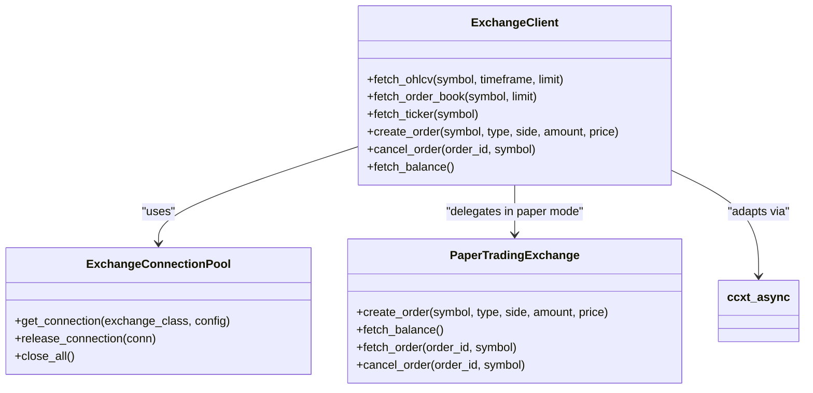
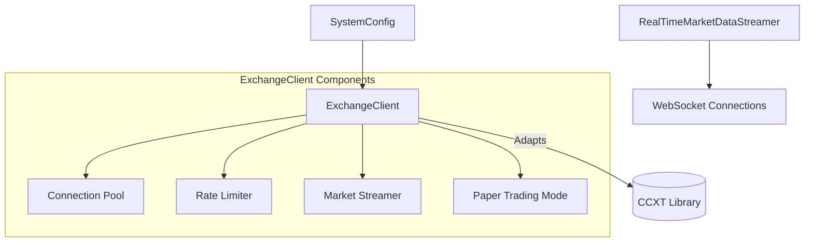
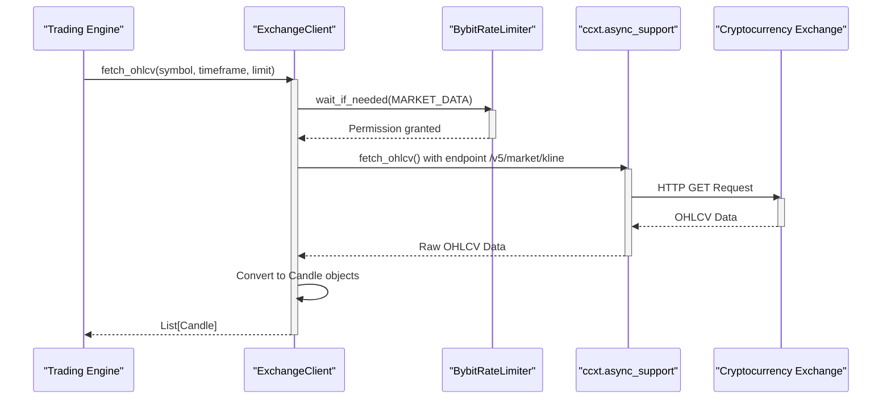
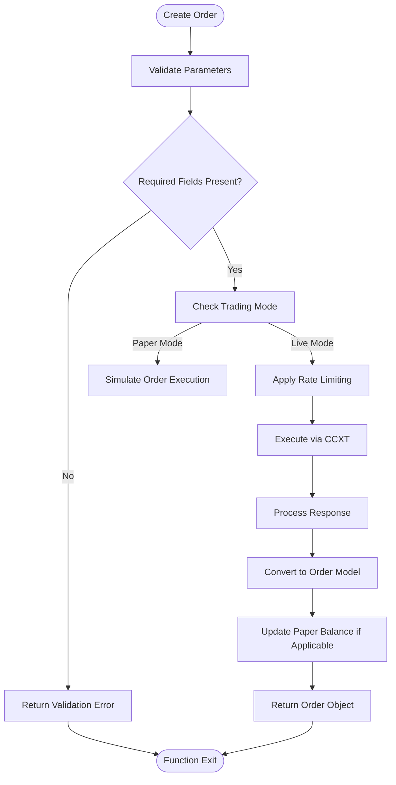
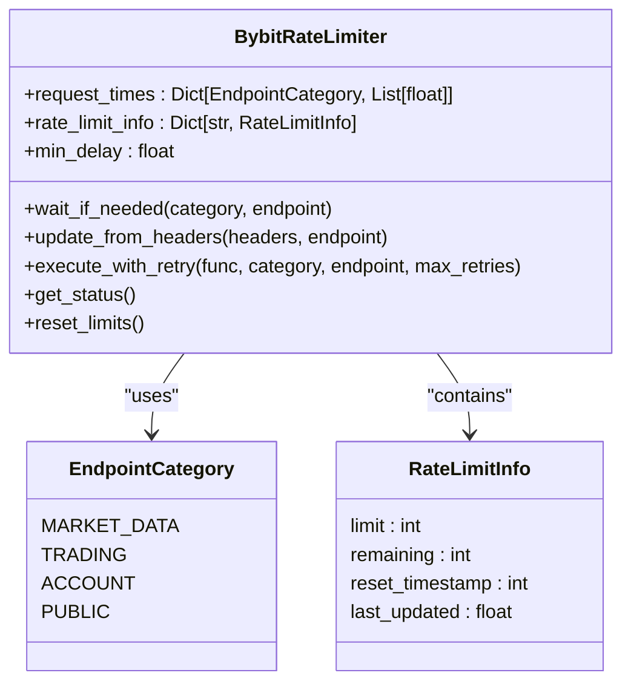
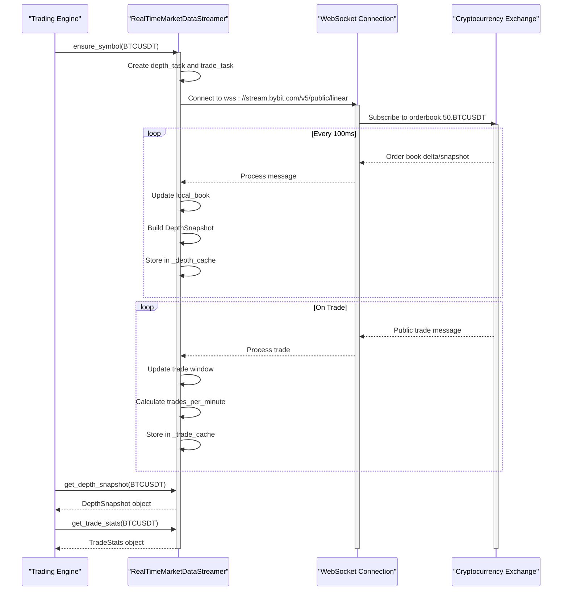
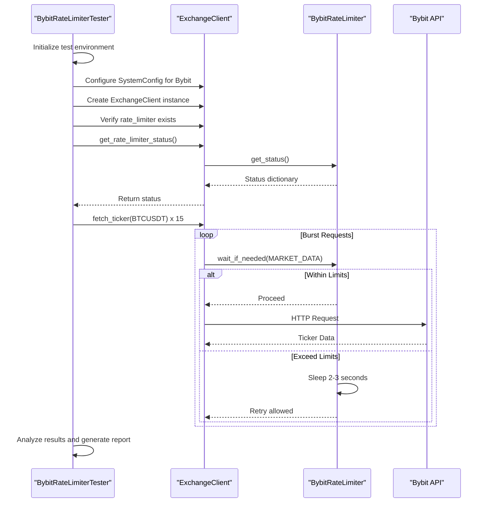
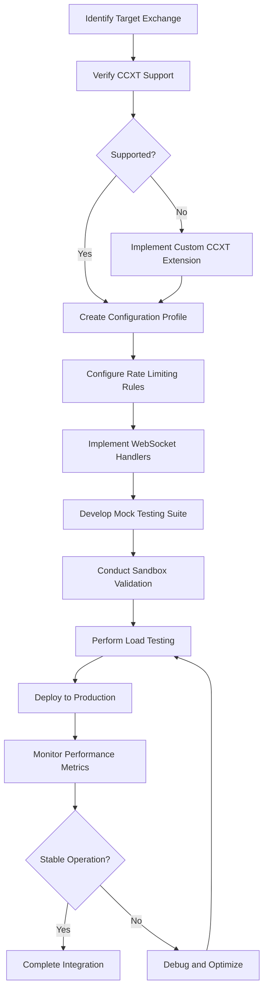

# Exchange Integration

<cite>
**Referenced Files in This Document**   
- [exchange_client.py](file://breakout_bot/exchange/exchange_client.py)
- [bybit_rate_limiter.py](file://breakout_bot/exchange/bybit_rate_limiter.py)
- [rate_limiter.py](file://breakout_bot/exchange/rate_limiter.py)
- [test_bybit_rate_limiter.py](file://test_bybit_rate_limiter.py)
- [market_stream.py](file://breakout_bot/exchange/market_stream.py)
</cite>

## Table of Contents
1. [Introduction](#introduction)
2. [Adapter Pattern Implementation](#adapter-pattern-implementation)
3. [Core Exchange Client Architecture](#core-exchange-client-architecture)
4. [Market Data Retrieval](#market-data-retrieval)
5. [Order Execution and Account Management](#order-execution-and-account-management)
6. [Rate Limiting Strategy](#rate-limiting-strategy)
7. [WebSocket Stream Handling](#websocket-stream-handling)
8. [Authentication Mechanisms](#authentication-mechanisms)
9. [Integration Testing Framework](#integration-testing-framework)
10. [Step-by-Step Exchange Integration Guide](#step-by-step-exchange-integration-guide)

## Introduction
This document provides comprehensive guidance for integrating new cryptocurrency exchanges into the Breakout Bot trading system. The integration framework uses an adapter pattern to abstract exchange-specific APIs through a unified interface, enabling seamless connectivity with multiple exchanges while maintaining consistent behavior across market data retrieval, order execution, and account management operations. The system supports both live trading and paper trading modes, with sophisticated rate limiting, WebSocket streaming, and connection resilience features.

The core implementation is centered around the `ExchangeClient` class, which serves as the primary interface for all exchange interactions. This client abstracts away the complexities of individual exchange APIs by leveraging the CCXT library while adding critical enhancements such as connection pooling, rate limiting enforcement, and real-time market data streaming. The architecture enables traders to switch between exchanges with minimal configuration changes, promoting flexibility and reducing vendor lock-in.

**Section sources**
- [exchange_client.py](file://breakout_bot/exchange/exchange_client.py#L0-L50)

## Adapter Pattern Implementation

**Diagram sources **
- [exchange_client.py](file://breakout_bot/exchange/exchange_client.py#L327-L352)
- [exchange_client.py](file://breakout_bot/exchange/exchange_client.py#L87-L139)

**Section sources**
- [exchange_client.py](file://breakout_bot/exchange/exchange_client.py#L327-L352)

## Core Exchange Client Architecture

**Diagram sources **
- [exchange_client.py](file://breakout_bot/exchange/exchange_client.py#L327-L352)
- [market_stream.py](file://breakout_bot/exchange/market_stream.py#L51-L78)

**Section sources**
- [exchange_client.py](file://breakout_bot/exchange/exchange_client.py#L327-L352)

## Market Data Retrieval

**Diagram sources **
- [exchange_client.py](file://breakout_bot/exchange/exchange_client.py#L523-L559)
- [bybit_rate_limiter.py](file://breakout_bot/exchange/bybit_rate_limiter.py#L100-L130)

**Section sources**
- [exchange_client.py](file://breakout_bot/exchange/exchange_client.py#L523-L559)

## Order Execution and Account Management

**Diagram sources **
- [exchange_client.py](file://breakout_bot/exchange/exchange_client.py#L779-L839)
- [exchange_client.py](file://breakout_bot/exchange/exchange_client.py#L172-L196)

**Section sources**
- [exchange_client.py](file://breakout_bot/exchange/exchange_client.py#L779-L839)

## Rate Limiting Strategy

**Diagram sources **
- [bybit_rate_limiter.py](file://breakout_bot/exchange/bybit_rate_limiter.py#L70-L100)
- [rate_limiter.py](file://breakout_bot/exchange/rate_limiter.py#L39-L68)

**Section sources**
- [bybit_rate_limiter.py](file://breakout_bot/exchange/bybit_rate_limiter.py#L70-L100)

## WebSocket Stream Handling

**Diagram sources **
- [market_stream.py](file://breakout_bot/exchange/market_stream.py#L80-L110)
- [market_stream.py](file://breakout_bot/exchange/market_stream.py#L51-L78)

**Section sources**
- [market_stream.py](file://breakout_bot/exchange/market_stream.py#L51-L78)

## Authentication Mechanisms
The system implements secure authentication mechanisms for accessing exchange APIs. Authentication credentials are managed through environment variables rather than hard-coded values, ensuring sensitive information remains protected. The `ExchangeClient` retrieves API keys, secrets, and passphrases from environment variables (`EXCHANGE_API_KEY`, `EXCHANGE_SECRET`, `EXCHANGE_PASSPHRASE`) during initialization. These credentials are only included in the exchange configuration when they exist, allowing public market data access without authentication while requiring proper credentials for trading operations.

For enhanced security, the system uses asynchronous CCXT instances that support modern authentication protocols including HMAC-SHA256 signatures for REST API requests and secure WebSocket connections. The configuration includes specific parameters like `recvWindow` (5 seconds) to accommodate network latency while maintaining security against replay attacks. All API communications occur over HTTPS/TLS encrypted channels, and sensitive operations are subject to rate limiting to prevent abuse.

**Section sources**
- [exchange_client.py](file://breakout_bot/exchange/exchange_client.py#L418-L447)

## Integration Testing Framework

**Diagram sources **
- [test_bybit_rate_limiter.py](file://test_bybit_rate_limiter.py#L48-L69)
- [test_bybit_rate_limiter.py](file://test_bybit_rate_limiter.py#L285-L311)

**Section sources**
- [test_bybit_rate_limiter.py](file://test_bybit_rate_limiter.py#L48-L69)

## Step-by-Step Exchange Integration Guide

**Diagram sources **
- [exchange_client.py](file://breakout_bot/exchange/exchange_client.py#L327-L352)
- [bybit_rate_limiter.py](file://breakout_bot/exchange/bybit_rate_limiter.py#L70-L100)
- [market_stream.py](file://breakout_bot/exchange/market_stream.py#L51-L78)
- [test_bybit_rate_limiter.py](file://test_bybit_rate_limiter.py#L48-L69)

**Section sources**
- [exchange_client.py](file://breakout_bot/exchange/exchange_client.py#L327-L352)