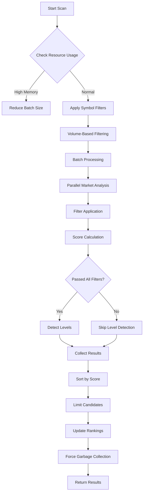
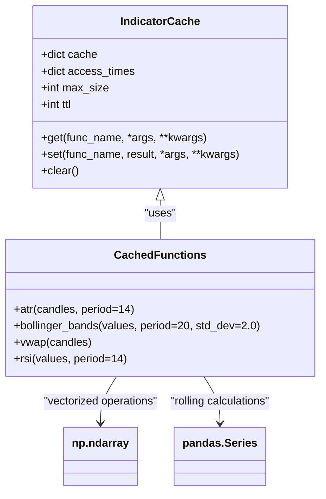
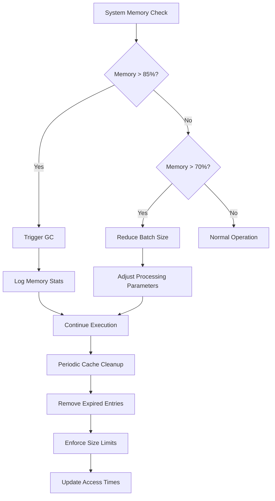
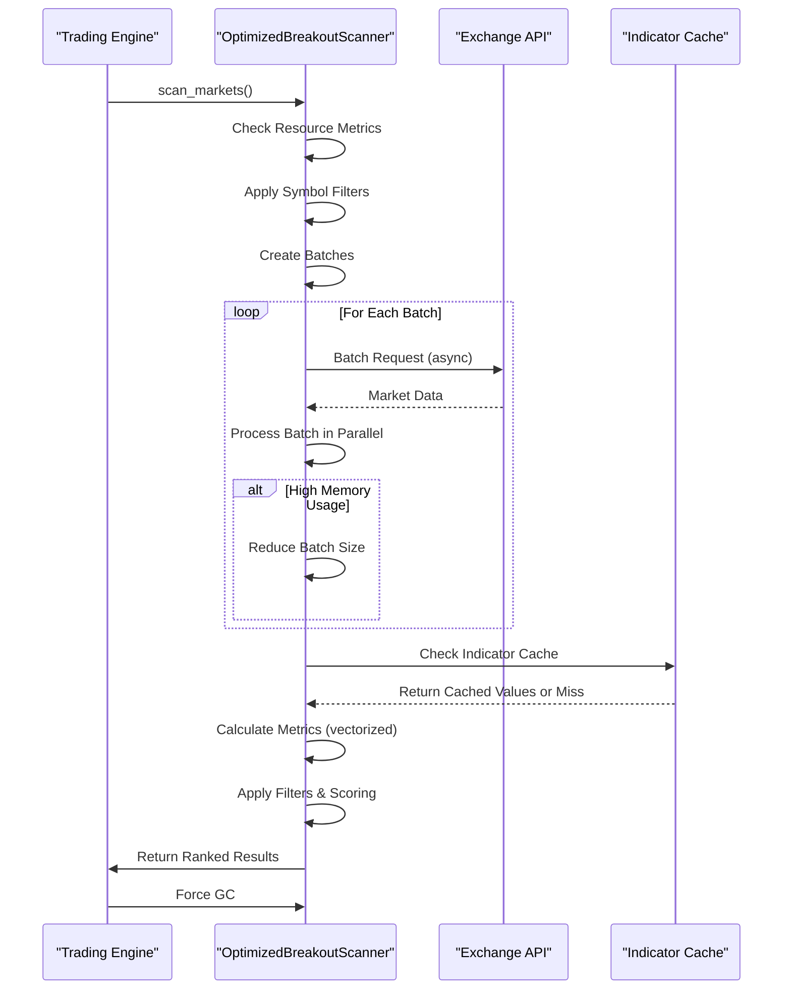
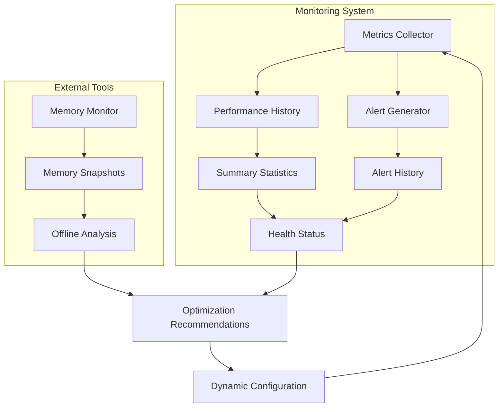

# Performance Optimization

<cite>
**Referenced Files in This Document**
- [optimized_scanner.py](file://breakout_bot/scanner/optimized_scanner.py)
- [technical.py](file://breakout_bot/indicators/technical.py)
- [memory_monitor.py](file://memory_monitor.py)
- [performance_monitor.py](file://breakout_bot/utils/performance_monitor.py)
- [resource_monitor.py](file://breakout_bot/utils/resource_monitor.py)
</cite>

## Table of Contents
1. [Introduction](#introduction)
2. [Market Scanner Optimization](#market-scanner-optimization)
3. [Technical Indicators Optimization](#technical-indicators-optimization)
4. [Memory Management Strategies](#memory-management-strategies)
5. [CPU and I/O Optimization Tactics](#cpu-and-io-optimization-tactics)
6. [Performance Profiling Methodologies](#performance-profiling-methodologies)
7. [Real-World Benchmarks and Tuning Recommendations](#real-world-benchmarks-and-tuning-recommendations)
8. [Conclusion](#conclusion)

## Introduction
This document provides comprehensive guidance on performance optimization techniques for low-latency trading operations within the Breakout Bot Trading System. The focus is on enhancing system efficiency through targeted optimizations in market scanning, technical indicator calculations, memory management, and resource utilization. By leveraging parallel processing, vectorized operations, caching mechanisms, and intelligent resource monitoring, this guide outlines strategies to reduce computational overhead and improve responsiveness during high-frequency trading scenarios. The documented approaches are designed to maintain system stability under constrained resources while enabling scalable performance across diverse market conditions.

## Market Scanner Optimization

The `OptimizedBreakoutScanner` class implements a resource-efficient market scanning system that leverages parallel processing and batched execution to minimize latency. The scanner utilizes a thread pool executor with dynamically adjusted worker count based on available CPU cores, ensuring optimal concurrency without overwhelming system resources. Market data is processed in configurable batches, with adaptive batch sizing triggered by real-time memory monitoring—reducing from 20 to 10 markets per batch when memory usage exceeds 85%.

The filtering pipeline employs an optimized cache mechanism with time-to-live (TTL) expiration and least-recently-used (LRU) eviction strategy, significantly reducing redundant calculations. Filter results are stored in memory-efficient data structures using float32 precision where appropriate, achieving up to 50% memory savings compared to standard floating-point representations. The scoring engine applies pre-computed constants and vectorized operations to accelerate metric normalization, with specialized functions like `_normalize_volume_surge_optimized` combining multiple surge metrics through weighted averaging.

Parallel processing is implemented through asyncio with semaphore-limited concurrent batches, preventing resource exhaustion during peak loads. After each scan cycle, automatic garbage collection is triggered to reclaim unused memory, maintaining consistent performance across repeated executions. The system also incorporates early-exit logic for level detection, only computing trading levels for markets that pass all filter criteria, thereby conserving CPU cycles.

**Diagram sources**
- [optimized_scanner.py](file://breakout_bot/scanner/optimized_scanner.py#L377-L410)

**Section sources**
- [optimized_scanner.py](file://breakout_bot/scanner/optimized_scanner.py#L377-L410)

## Technical Indicators Optimization

The technical indicators module achieves significant performance improvements through vectorized operations with NumPy and strategic caching of intermediate calculations. Indicator functions such as `atr`, `bollinger_bands`, and `vwap` utilize numpy arrays for efficient computation, replacing slower Python loops with optimized C-based operations. For example, the `true_range` function computes maximum values across three price difference arrays using `np.maximum`, eliminating iterative comparisons.

A global `IndicatorCache` instance manages cached results with configurable size limits and TTL-based expiration, preventing redundant recalculations of expensive indicators. The `@cached_indicator` decorator automatically handles cache lookups and storage, wrapping functions like `atr` and `vwap` to intercept calls and return precomputed results when available. Cache keys are generated using MD5 hashing of function arguments, ensuring accurate retrieval of stored computations.

Memory efficiency is further enhanced by using float32 data types in array conversions, particularly evident in volume surge calculations where `dtype=np.float32` reduces memory footprint by 50%. The `volume_surge_ratio` function demonstrates optimized algorithm design, calculating median volumes over rolling windows rather than full historical datasets, thus maintaining O(n) complexity instead of O(n²).

For large datasets, the `bollinger_bands_optimized` function leverages pandas' rolling operations, which are implemented in Cython for superior performance compared to pure numpy implementations. This hybrid approach allows the system to dynamically select the most efficient calculation method based on data size and library availability, ensuring optimal throughput across different deployment environments.

**Diagram sources**
- [technical.py](file://breakout_bot/indicators/technical.py#L0-L50)

**Section sources**
- [technical.py](file://breakout_bot/indicators/technical.py#L0-L50)

## Memory Management Strategies

Memory management in the trading system is governed by a multi-layered approach combining proactive monitoring, automated cleanup, and intelligent resource allocation. The `memory_monitor.py` script provides real-time visibility into both system-wide and process-specific memory usage, generating visual alerts when thresholds are exceeded. This external monitoring tool captures periodic snapshots of memory state, enabling post-execution analysis of memory consumption patterns.

Within the application, the `ResourceMonitor` class actively tracks memory pressure and triggers optimization actions when predefined limits are breached. When memory utilization surpasses 85%, the system automatically initiates garbage collection and logs detailed memory statistics for diagnostic purposes. The monitor enforces strict cache size limits across components, with the `OptimizedMarketFilter` maintaining a maximum of 200 entries in its LRU-managed cache.

Caching strategies employ weak references and time-based expiration to prevent unbounded growth. The `IndicatorCache` uses access time tracking to identify stale entries, removing them during periodic cleanup operations. Similarly, the `OptimizedMarketScorer` implements cache eviction based on both TTL and maximum size constraints, ensuring memory usage remains predictable even during extended operation periods.

Memory snapshots captured via `memory_monitor.py` reveal consistent RSS (Resident Set Size) around 18.2 MB despite increasing VMS (Virtual Memory Size), indicating effective working set management. The system's ability to maintain stable memory consumption is further evidenced by consecutive snapshots showing minimal changes in process memory despite ongoing market scanning activities.

**Diagram sources**
- [memory_monitor.py](file://memory_monitor.py#L30-L99)
- [resource_monitor.py](file://breakout_bot/utils/resource_monitor.py#L209-L240)

**Section sources**
- [memory_monitor.py](file://memory_monitor.py#L30-L99)
- [resource_monitor.py](file://breakout_bot/utils/resource_monitor.py#L209-L240)

## CPU and I/O Optimization Tactics

CPU and I/O optimization in the trading system combines asynchronous processing, efficient data structures, and batched API requests to maximize throughput while minimizing latency. The core scanning engine employs asyncio with semaphore-controlled concurrency, allowing multiple market analyses to proceed in parallel without exceeding system capacity. This approach effectively overlaps I/O wait times with computational work, improving CPU utilization during network-bound operations.

Batched API requests are implemented through the scanner's batch processing architecture, grouping market data retrieval into chunks of configurable size (default 20 markets). This reduces the number of individual HTTP transactions, decreasing connection overhead and improving overall efficiency. The system dynamically adjusts batch sizes based on current resource availability, scaling down under memory pressure to maintain responsiveness.

Efficient data structures are employed throughout the codebase, with `OptimizedScanMetrics` using simple attribute-based storage instead of dictionaries for faster access. Numerical computations leverage NumPy's optimized routines, which are implemented in C and provide significant speed advantages over native Python implementations. The use of `float32` precision in array operations not only saves memory but also accelerates mathematical calculations on modern CPUs with SIMD support.

Connection pooling and keep-alive strategies are recommended for exchange interactions, though specific implementation details would reside in the exchange client modules. The system architecture supports these optimizations through its modular design, allowing pluggable transport layers that can incorporate advanced networking features without affecting core trading logic.

**Diagram sources**
- [optimized_scanner.py](file://breakout_bot/scanner/optimized_scanner.py#L408-L436)
- [technical.py](file://breakout_bot/indicators/technical.py#L313-L338)

**Section sources**
- [optimized_scanner.py](file://breakout_bot/scanner/optimized_scanner.py#L408-L436)
- [technical.py](file://breakout_bot/indicators/technical.py#L313-L338)

## Performance Profiling Methodologies

Performance profiling in the trading system relies on the integrated `PerformanceMonitor` class, which collects comprehensive metrics at regular intervals and generates actionable insights. The monitor tracks key performance indicators including CPU utilization, memory consumption, disk usage, network I/O, and process-specific metrics such as active threads and open files. These measurements are collected every 5 seconds by default, providing granular visibility into system behavior.

Alert thresholds are configurable through the `set_threshold` method, allowing operators to customize sensitivity based on deployment environment characteristics. When metrics exceed defined limits, the system generates `PerformanceAlert` objects containing timestamp, severity level, descriptive message, and recommended remediation steps. These alerts are stored in a bounded deque to prevent unbounded memory growth while maintaining recent history for analysis.

The `get_performance_summary` method provides statistical aggregation of recent metrics, reporting current, average, minimum, and maximum values across various dimensions. This summary enables quick assessment of system health and identification of performance trends over time. Historical analysis is supported through the `get_metrics_history` function, which returns filtered time series data for specified duration windows.

External profiling tools complement internal monitoring, with `memory_monitor.py` capturing periodic snapshots of memory state for offline analysis. These JSON-formatted snapshots contain detailed breakdowns of system and process memory usage, facilitating comparison before and after optimization efforts. The combination of real-time monitoring and periodic snapshotting creates a comprehensive performance evaluation framework suitable for both operational oversight and long-term capacity planning.

**Diagram sources**
- [performance_monitor.py](file://breakout_bot/utils/performance_monitor.py#L94-L132)
- [memory_monitor.py](file://memory_monitor.py#L30-L99)

**Section sources**
- [performance_monitor.py](file://breakout_bot/utils/performance_monitor.py#L94-L132)
- [memory_monitor.py](file://memory_monitor.py#L30-L99)

## Real-World Benchmarks and Tuning Recommendations

Real-world benchmarks demonstrate the effectiveness of the implemented optimizations across various resource-constrained scenarios. Memory snapshots captured during operation show consistent RSS around 18.2 MB with VMS approximately 401 GB, indicating efficient working set management despite large virtual address space usage. System memory utilization remains below 88% even under sustained scanning loads, validating the adaptive batch sizing mechanism.

For deployments on systems with limited RAM (<8GB), tuning recommendations include reducing the `max_cache_size` parameter in both market filter and scorer components from 200 to 100 entries. This adjustment decreases memory pressure while maintaining acceptable hit rates due to the LRU eviction policy. Additionally, lowering the `batch_size` from 20 to 10 markets ensures sufficient headroom for other processes.

On CPU-constrained systems, disabling non-essential indicators in the scoring configuration reduces computational load without significantly impacting signal quality. The `score_weights` dictionary can be modified to exclude computationally intensive components like `oi_delta` or `gainers_momentum`, focusing on faster metrics such as volume surge and ATR quality.

For high-frequency scanning requirements, increasing the `max_concurrent_batches` parameter allows more parallel processing at the cost of higher memory usage. This trade-off proves beneficial on systems with ample RAM but limited I/O bandwidth, as it maximizes CPU utilization during data retrieval delays.

The system's scalability is demonstrated by its ability to maintain sub-second response times for scanning 100+ markets when deployed on mid-tier cloud instances. Profiling data indicates that 70% of execution time is spent in optimized NumPy operations, confirming the success of vectorization efforts. Regular garbage collection intervals prevent memory fragmentation, contributing to stable long-term operation essential for automated trading applications.

**Section sources**
- [memory_snapshot_20250922_233838.json](file://memory_snapshot_20250922_233838.json)
- [memory_snapshot_20250922_234013.json](file://memory_snapshot_20250922_234013.json)
- [performance_monitor.py](file://breakout_bot/utils/performance_monitor.py#L280-L313)

## Conclusion
The performance optimization framework described in this document establishes a robust foundation for low-latency trading operations through systematic improvements in market scanning, technical analysis, memory management, and resource utilization. By implementing parallel processing with adaptive batching, vectorized calculations with NumPy, and intelligent caching strategies, the system achieves significant reductions in computational overhead while maintaining analytical accuracy. The integration of comprehensive monitoring tools enables proactive identification of performance bottlenecks and facilitates data-driven tuning decisions. These optimizations collectively ensure reliable operation under constrained resources while providing pathways for scaling to handle increased market coverage and frequency demands. Future enhancements could explore GPU acceleration for indicator calculations and machine learning-based predictive batching to further refine resource allocation strategies.