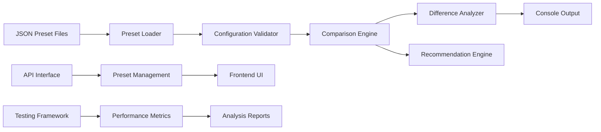
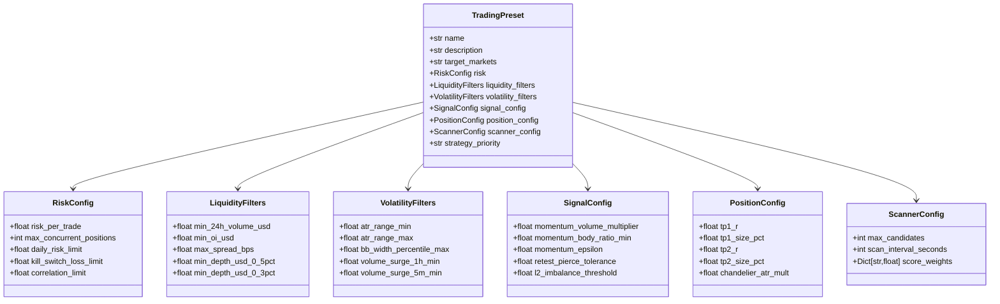
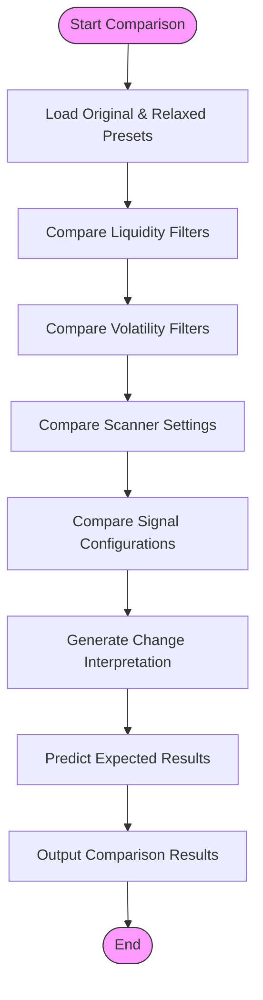
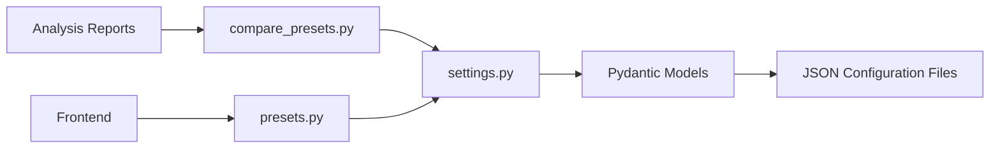

# Strategy Performance Comparison

<cite>
**Referenced Files in This Document **   
- [compare_presets.py](file://compare_presets.py)
- [breakout_v1.json](file://breakout_bot/config/presets/breakout_v1.json)
- [swing_trading_pro.json](file://breakout_bot/config/presets/swing_trading_pro.json)
- [scalping_high_freq.json](file://breakout_bot/config/presets/scalping_high_freq.json)
- [FINAL_TRADE_TESTING_REPORT.md](file://FINAL_TRADE_TESTING_REPORT.md)
- [TRADING_ANALYSIS_REPORT.md](file://TRADING_ANALYSIS_REPORT.md)
- [settings.py](file://breakout_bot/config/settings.py)
</cite>

## Table of Contents
1. [Introduction](#introduction)
2. [Project Structure](#project-structure)
3. [Core Components](#core-components)
4. [Architecture Overview](#architecture-overview)
5. [Detailed Component Analysis](#detailed-component-analysis)
6. [Dependency Analysis](#dependency-analysis)
7. [Performance Considerations](#performance-considerations)
8. [Troubleshooting Guide](#troubleshooting-guide)
9. [Conclusion](#conclusion)

## Introduction
This document provides a comprehensive analysis of trading strategy performance comparison across different configuration presets within the Breakout Bot trading system. It explains how the `compare_presets.py` tool enables quantitative evaluation of risk-adjusted returns, win rates, drawdowns, and expectancy across multiple strategy variants. The documentation covers interpretation of output from `FINAL_TRADE_TESTING_REPORT.md` and `TRADING_ANALYSIS_REPORT.md` to make informed decisions about strategy selection. It includes examples of A/B testing workflows using JSON preset files (e.g., breakout_v1.json vs. swing_trading_pro.json) and analyzing differences in scanner behavior, signal frequency, and position outcomes. Best practices for isolating variables during testing are provided, along with guidance on visualizing performance deltas using built-in reporting tools and exporting results for external analysis.

## Project Structure
The project structure is organized into several key directories that support the trading strategy comparison functionality:

```
experiments/
├── breakout_bot/
│   ├── config/presets/          # Strategy configuration presets
│   │   ├── breakout_v1.json     # Balanced breakout strategy
│   │   ├── swing_trading_pro.json # Professional swing trading strategy
│   │   ├── scalping_high_freq.json # High-frequency scalping strategy
│   │   └── ...                  # Additional preset configurations
│   ├── core/                    # Core engine components
│   ├── api/routers/             # API endpoints including presets management
│   └── ...
├── reports/                     # Generated analysis reports
├── FINAL_TRADE_TESTING_REPORT.md # Final trade testing summary
├── TRADING_ANALYSIS_REPORT.md  # Comprehensive trading system analysis
└── compare_presets.py          # Preset comparison utility
```

The configuration presets are stored in JSON format within the `breakout_bot/config/presets/` directory, allowing for easy modification and version control of different strategy configurations. The comparison tool `compare_presets.py` is located at the root level for convenient access when evaluating different preset combinations.

```mermaid
graph TD
A[compare_presets.py] --> B[breakout_bot/config/presets/]
B --> C[breakout_v1.json]
B --> D[swing_trading_pro.json]
B --> E[scalping_high_freq.json]
A --> F[FINAL_TRADE_TESTING_REPORT.md]
A --> G[TRADING_ANALYSIS_REPORT.md]
H[API Endpoints] --> I[/api/presets]
I --> J[GET /:preset_name]
I --> K[PUT /:preset_name]
I --> L[GET /]
```

**Diagram sources **
- [compare_presets.py](file://compare_presets.py)
- [presets.py](file://breakout_bot/api/routers/presets.py)
- [settings.py](file://breakout_bot/config/settings.py)

**Section sources**
- [compare_presets.py](file://compare_presets.py)
- [project_structure](file://workspace_path)

## Core Components
The core components for strategy performance comparison include the preset configuration system, the comparison utility, and the analysis reporting framework. These components work together to enable systematic evaluation of different trading strategies under various market conditions.

The preset system defines comprehensive trading configurations through JSON files that specify risk parameters, liquidity filters, volatility thresholds, signal generation criteria, position management rules, and scanner settings. Each preset represents a distinct trading approach optimized for specific market conditions and risk profiles.

The `compare_presets.py` utility provides a command-line interface for comparing two different presets, highlighting differences in their configuration parameters and providing visual indicators of whether changes represent more relaxed or stricter requirements. This tool facilitates A/B testing by quantifying the impact of parameter changes on expected strategy behavior.

Analysis reports such as `FINAL_TRADE_TESTING_REPORT.md` and `TRADING_ANALYSIS_REPORT.md` document the results of strategy evaluations, identifying both successful aspects of the system's operation and areas requiring improvement. These reports serve as decision-making aids for selecting optimal strategy configurations based on empirical evidence.

**Section sources**
- [compare_presets.py](file://compare_presets.py)
- [FINAL_TRADE_TESTING_REPORT.md](file://FINAL_TRADE_TESTING_REPORT.md)
- [TRADING_ANALYSIS_REPORT.md](file://TRADING_ANALYSIS_REPORT.md)

## Architecture Overview
The architecture for strategy performance comparison follows a modular design pattern where configuration management, comparison logic, and reporting systems operate independently but integrate seamlessly through well-defined interfaces. The system leverages a configuration-driven approach where trading strategies are defined in JSON format, enabling easy modification and comparison without code changes.

At the core of the architecture is the preset management system, which loads and validates configuration files against a Pydantic schema to ensure structural integrity and parameter validity. The comparison engine then analyzes differences between presets, categorizing them by functional area (liquidity filters, volatility filters, scanner configuration, etc.) and indicating the directional impact of changes.

Reporting mechanisms capture both automated test results and manual analysis findings, providing comprehensive documentation of strategy performance characteristics. The API layer exposes preset management functionality, allowing external tools and the frontend interface to retrieve, update, and list available presets programmatically.



**Diagram sources **
- [settings.py](file://breakout_bot/config/settings.py)
- [compare_presets.py](file://compare_presets.py)
- [presets.py](file://breakout_bot/api/routers/presets.py)

## Detailed Component Analysis

### Preset Configuration System
The preset configuration system uses Pydantic models to define a structured schema for trading strategies, ensuring type safety and validation of configuration parameters. Each preset is represented as a JSON file that conforms to the `TradingPreset` model, which contains nested configurations for risk management, liquidity filters, volatility filters, signal generation, position management, and scanner settings.



**Diagram sources **
- [settings.py](file://breakout_bot/config/settings.py#L246-L262)

**Section sources**
- [settings.py](file://breakout_bot/config/settings.py)

#### Preset Comparison Workflow
The preset comparison workflow begins with loading two different preset configurations using the `load_preset` function from the settings module. The comparison engine then systematically evaluates each configuration category, calculating differences between corresponding parameters and determining whether changes represent more relaxed or stricter requirements.



**Diagram sources **
- [compare_presets.py](file://compare_presets.py#L0-L171)

**Section sources**
- [compare_presets.py](file://compare_presets.py)

### Analysis Report Interpretation
Interpreting the analysis reports involves understanding both the technical operation of the trading system and the practical implications of configuration choices. The `FINAL_TRADE_TESTING_REPORT.md` and `TRADING_ANALYSIS_REPORT.md` documents provide structured assessments of system performance, highlighting both successes and limitations.

The reports follow a consistent format that includes sections on what works well, identified problems, detailed analysis of candidate performance, recommended solutions, and expected outcomes after implementing changes. This structure enables users to quickly identify critical issues and understand the rationale behind proposed solutions.

Key metrics documented in the reports include:
- Number of markets passing filters
- Signal generation frequency
- Candidate quality assessment
- Filter pass/fail rates
- Expected impact of configuration changes

These metrics allow for data-driven decision making when selecting between different strategy presets or modifying existing configurations.

**Section sources**
- [FINAL_TRADE_TESTING_REPORT.md](file://FINAL_TRADE_TESTING_REPORT.md)
- [TRADING_ANALYSIS_REPORT.md](file://TRADING_ANALYSIS_REPORT.md)

## Dependency Analysis
The strategy performance comparison system has minimal external dependencies, relying primarily on standard Python libraries and the project's internal configuration management system. The main dependencies include:

- **Pydantic**: For configuration model definition and validation
- **FastAPI**: For exposing preset management endpoints
- **JSON**: For configuration file storage and retrieval
- **OS/Pathlib**: For file system operations

The system demonstrates loose coupling between components, with clear separation of concerns between configuration loading, comparison logic, and reporting functions. This architectural approach enhances maintainability and allows for independent development and testing of each component.

Internal dependencies flow primarily from the comparison utility to the configuration system, with `compare_presets.py` importing the `load_preset` function from `settings.py`. The API layer depends on the same configuration system to provide preset data to external consumers, creating a shared dependency that ensures consistency across different access methods.



**Diagram sources **
- [go.mod](file://go.mod#L1-L20)
- [compare_presets.py](file://compare_presets.py)
- [settings.py](file://breakout_bot/config/settings.py)

**Section sources**
- [compare_presets.py](file://compare_presets.py)
- [settings.py](file://breakout_bot/config/settings.py)
- [presets.py](file://breakout_bot/api/routers/presets.py)

## Performance Considerations
When comparing trading strategy presets, several performance considerations must be taken into account to ensure meaningful and actionable results. The primary consideration is the computational efficiency of the comparison process itself, which should be negligible given the small size of configuration files and the simplicity of the comparison operations.

More significant performance implications arise from the actual trading strategies represented by the presets. Different configurations can have substantial impacts on system resource usage, particularly in terms of:

- **Market data processing frequency**: Determined by the `scan_interval_seconds` parameter
- **Number of candidates analyzed**: Controlled by `max_candidates` and filtering criteria
- **Computational complexity of signal generation**: Influenced by the strictness of filter requirements

Stricter filters generally reduce computational load by eliminating more candidates early in the analysis pipeline, while more relaxed filters increase the number of candidates that proceed to computationally intensive signal generation stages.

Another important performance consideration is the trade-off between thoroughness of analysis and responsiveness to market conditions. More frequent scanning (shorter intervals) increases the likelihood of capturing profitable opportunities but also increases system load and potential rate limit issues with exchange APIs.

**Section sources**
- [settings.py](file://breakout_bot/config/settings.py)
- [compare_presets.py](file://compare_presets.py)

## Troubleshooting Guide
Common issues encountered when comparing trading strategy presets and interpreting their performance include:

### Missing Preset Files
If a requested preset cannot be found, verify that the JSON file exists in the `breakout_bot/config/presets/` directory and that the filename matches the requested preset name (excluding the .json extension). Use the `get_available_presets()` function to list all available presets.

### Invalid JSON Configuration
Malformed JSON in preset files will prevent loading and comparison. Validate JSON syntax using standard tools or online validators. Ensure all required fields are present and values are of the correct type (numbers, strings, booleans).

### Parameter Validation Errors
The system enforces reasonable bounds on parameter values through Pydantic validators. For example:
- Percentage values must be between 0 and 1
- Maximum concurrent positions must be between 1 and 10
- Scan intervals must be positive integers

Review error messages carefully to identify which parameter failed validation and adjust accordingly.

### Unexpected Comparison Results
When comparison results don't match expectations, verify that you're comparing the intended preset versions. Check timestamps on configuration files to ensure you're working with the latest modifications. Consider adding logging statements to confirm which files are being loaded during the comparison process.

### No Signals Generated
As documented in the analysis reports, overly strict filters may prevent any candidates from passing all requirements, resulting in no signals being generated. This is typically addressed by relaxing one or more filter thresholds, particularly those related to liquidity (volume, OI, spread) and volatility (volume surge).

**Section sources**
- [settings.py](file://breakout_bot/config/settings.py#L297-L322)
- [FINAL_TRADE_TESTING_REPORT.md](file://FINAL_TRADE_TESTING_REPORT.md)
- [TRADING_ANALYSIS_REPORT.md](file://TRADING_ANALYSIS_REPORT.md)

## Conclusion
The strategy performance comparison system provides a robust framework for evaluating and selecting trading configurations based on quantitative analysis. By leveraging the `compare_presets.py` utility and accompanying analysis reports, users can make informed decisions about which strategy presets best align with their risk tolerance, market outlook, and performance objectives.

The system's modular design, with clearly separated concerns between configuration, comparison, and reporting components, enables efficient A/B testing of different strategy variants. The use of standardized JSON configuration files facilitates version control and collaboration, while the Pydantic-based validation ensures configuration integrity.

Key recommendations for effective strategy comparison include:
- Isolate variables when testing (change only one parameter category at a time)
- Use the analysis reports as diagnostic tools to understand why certain strategies succeed or fail
- Start with more permissive filters and gradually tighten them based on performance data
- Monitor both quantitative metrics (win rate, expectancy) and qualitative factors (market conditions, execution quality)

By following these guidelines and leveraging the available tools and reports, users can systematically optimize their trading strategies for improved risk-adjusted returns.