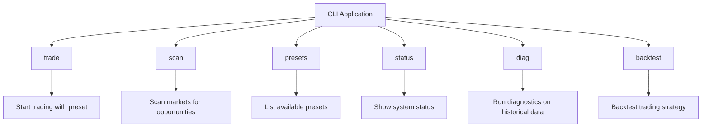
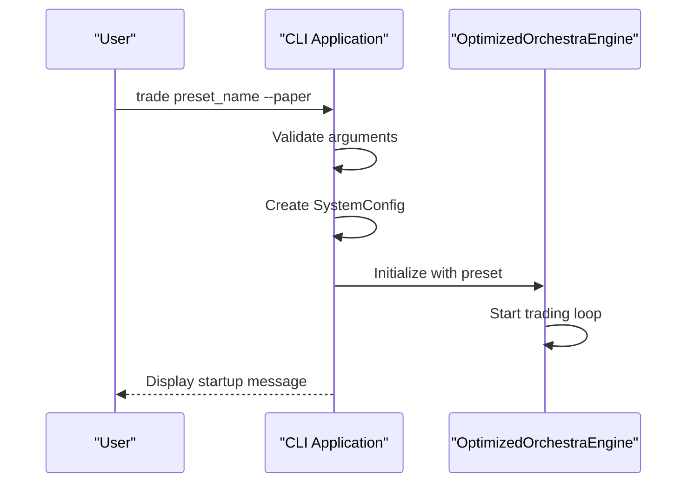
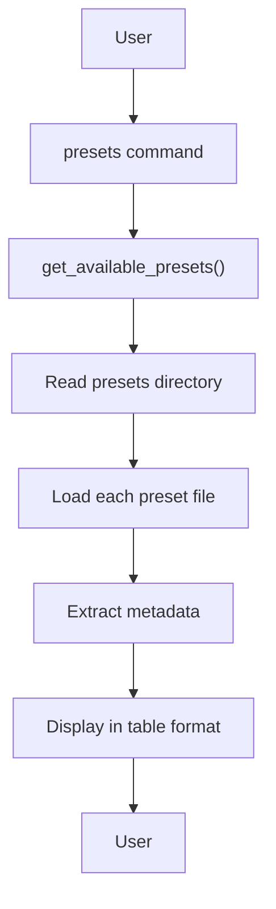
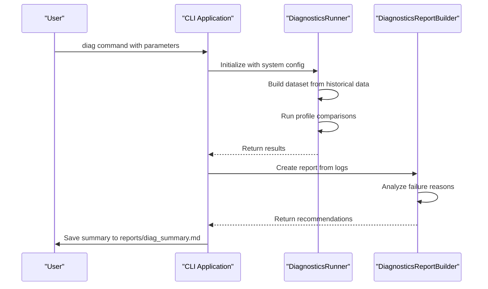
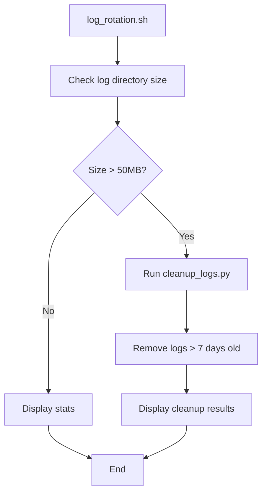

# Command Line Interface

<cite>
**Referenced Files in This Document**   
- [main.py](file://breakout_bot/cli/main.py)
- [start.sh](file://start.sh)
- [stop.sh](file://stop.sh)
- [status.sh](file://status.sh)
- [log_rotation.sh](file://scripts/log_rotation.sh)
- [engine.py](file://breakout_bot/core/engine.py)
- [settings.py](file://breakout_bot/config/settings.py)
- [runner.py](file://breakout_bot/diagnostics/runner.py)
- [reporting.py](file://breakout_bot/diagnostics/reporting.py)
</cite>

## Table of Contents
1. [Introduction](#introduction)
2. [CLI Commands Overview](#cli-commands-overview)
3. [Engine Control Commands](#engine-control-commands)
4. [Configuration Management](#configuration-management)
5. [Diagnostics and Analysis](#diagnostics-and-analysis)
6. [Wrapper Scripts](#wrapper-scripts)
7. [Log Rotation](#log-rotation)
8. [Automation Scenarios](#automation-scenarios)
9. [Security Considerations](#security-considerations)
10. [Troubleshooting Guide](#troubleshooting-guide)

## Introduction
The Breakout Bot Trading System provides a comprehensive command-line interface (CLI) for scriptable interaction with its trading engine. Built using Python's Typer library, the CLI enables direct control over the system's core functionality without requiring API calls. This approach allows for lower-level access to the trading engine through direct Python imports, providing more granular control than the REST API.

The CLI is implemented in `breakout_bot/cli/main.py` and exposes commands for engine control, configuration management, diagnostics, and market scanning. It integrates directly with the core engine components, allowing users to start trading sessions, run diagnostics, scan markets, and manage configurations from the command line.

In addition to the primary CLI application, several wrapper scripts (`start.sh`, `stop.sh`, `status.sh`) provide convenient abstractions over complex operations, making it easier to manage the entire system. These scripts handle service orchestration, port management, and status monitoring, abstracting away the complexity of managing multiple components.

**Section sources**
- [main.py](file://breakout_bot/cli/main.py#L1-L369)
- [start.sh](file://start.sh#L1-L343)
- [stop.sh](file://stop.sh#L1-L109)

## CLI Commands Overview
The CLI application provides several commands for interacting with the trading system:



The main entry point is implemented using Typer, which automatically generates help text and handles argument parsing. Each command corresponds to a specific function in the application, with proper type hints and documentation.

The CLI supports both direct engine interaction and diagnostic operations. Commands like `trade` and `scan` interact directly with the trading engine, while `diag` runs specialized diagnostic routines on historical data.

**Diagram sources**
- [main.py](file://breakout_bot/cli/main.py#L1-L369)

**Section sources**
- [main.py](file://breakout_bot/cli/main.py#L1-L369)

## Engine Control Commands
The CLI provides direct control over the trading engine through several commands that integrate with the core engine via Python imports rather than API calls.

### Trade Command
The `trade` command starts the trading engine with a specified preset:

```bash
python -m breakout_bot.cli.main trade breakout_v1 --paper
```

This command accepts several options:
- `preset`: Required trading preset name
- `--paper`: Use paper trading mode
- `--live`: Use live trading mode
- `--log-level`: Set logging level
- `--symbols`: Comma-separated symbol whitelist

The command validates that both `--paper` and `--live` are not specified simultaneously and sets up the appropriate trading mode. It creates a `SystemConfig` instance and initializes the `OptimizedOrchestraEngine` with the specified preset.



**Diagram sources**
- [main.py](file://breakout_bot/cli/main.py#L38-L95)
- [engine.py](file://breakout_bot/core/engine.py#L200-L300)

### Status Command
The `status` command shows system metrics and operational state:

```bash
python -m breakout_bot.cli.main status breakout_v1
```

Currently, this command is marked as not yet implemented in the codebase, but it would connect to a running instance or show saved state information including current system state, open positions, risk metrics, and recent performance.

**Section sources**
- [main.py](file://breakout_bot/cli/main.py#L189-L200)

## Configuration Management
The CLI provides tools for managing trading configurations and presets.

### Presets Command
The `presets` command lists all available trading configurations:

```bash
python -m breakout_bot.cli.main presets
```

This command uses the `get_available_presets()` function from the config module to retrieve all JSON files in the presets directory and displays them in a formatted table with columns for name, description, and target markets.



The presets are stored in JSON format in the `config/presets/` directory and contain complete trading configurations including risk parameters, filters, signal settings, and position management rules.

**Diagram sources**
- [main.py](file://breakout_bot/cli/main.py#L150-L187)
- [settings.py](file://breakout_bot/config/settings.py#L250-L270)

**Section sources**
- [main.py](file://breakout_bot/cli/main.py#L150-L187)
- [settings.py](file://breakout_bot/config/settings.py#L250-L270)

## Diagnostics and Analysis
The CLI includes powerful diagnostic capabilities for analyzing trading strategies against historical data.

### Diag Command
The `diag` command runs diagnostics over a historical window, comparing baseline and relaxed thresholds:

```bash
python -m breakout_bot.cli.main diag breakout_v1 --start 2024-01-01T00:00:00 --end 2024-01-02T00:00:00 --symbol BTC/USDT
```

This command:
1. Sets debug environment variables
2. Loads the base preset and optional diagnostic preset
3. Creates a `DiagnosticsRunner` instance
4. Runs profile comparisons
5. Generates a comprehensive report

The diagnostic process analyzes candidate generation rates, filter pass rates, and signal effectiveness, producing recommendations for threshold adjustments based on near-miss analysis.



**Diagram sources**
- [main.py](file://breakout_bot/cli/main.py#L202-L239)
- [runner.py](file://breakout_bot/diagnostics/runner.py#L1-L271)
- [reporting.py](file://breakout_bot/diagnostics/reporting.py#L1-L81)

**Section sources**
- [main.py](file://breakout_bot/cli/main.py#L202-L239)
- [runner.py](file://breakout_bot/diagnostics/runner.py#L1-L271)
- [reporting.py](file://breakout_bot/diagnostics/reporting.py#L1-L81)

## Wrapper Scripts
Several shell scripts provide convenient wrappers around common operations, abstracting complex docker-compose commands.

### Start Script
The `start.sh` script orchestrates the entire system startup process:

```bash
./start.sh start
```

This script:
- Starts the API server on port 8000
- Starts the frontend development server on port 5173
- Initializes the trading engine
- Monitors service health
- Provides colored output and status indicators

The script includes port conflict resolution, automatically killing processes on conflicting ports before starting services.

**Section sources**
- [start.sh](file://start.sh#L1-L343)

### Stop Script
The `stop.sh` script gracefully shuts down all system components:

```bash
./stop.sh
```

It stops the API server, frontend server, and any remaining processes on the configured ports, ensuring clean shutdown of all services.

**Section sources**
- [stop.sh](file://stop.sh#L1-L109)

### Status Script
The `status.sh` script provides comprehensive system monitoring:

```bash
./status.sh
```

It checks the status of all components and displays detailed information including:
- API server health
- Frontend availability
- Trading engine state
- Open positions count
- System logs count
- Access URLs for all services

**Section sources**
- [status.sh](file://status.sh#L1-L226)

## Log Rotation
The `log_rotation.sh` script manages log file size and retention:

```bash
./scripts/log_rotation.sh
```

This script:
- Checks the total size of log files
- If exceeding the maximum size (50MB), runs cleanup
- Removes logs older than the retention period (7 days)
- Displays statistics about log files

The script works in conjunction with `cleanup_logs.py` to maintain optimal disk usage while preserving recent diagnostic information.



**Diagram sources**
- [log_rotation.sh](file://scripts/log_rotation.sh#L1-L35)

**Section sources**
- [log_rotation.sh](file://scripts/log_rotation.sh#L1-L35)

## Automation Scenarios
The CLI enables various automation scenarios for production operations.

### Cron-Scheduled Status Checks
Status checks can be automated using cron to monitor system health:

```bash
# Check system status every 15 minutes
*/15 * * * * /path/to/status.sh >> /var/log/system_status.log 2>&1
```

### Health Recovery Scripts
Automated recovery scripts can restart failed components:

```bash
#!/bin/bash
# health_check.sh
if ! ./status.sh | grep -q "API Server: Running"; then
    echo "API server not running, restarting..."
    ./stop.sh
    sleep 5
    ./start.sh
fi
```

These scripts can be scheduled to run at regular intervals to ensure system availability.

**Section sources**
- [start.sh](file://start.sh#L1-L343)
- [status.sh](file://status.sh#L1-L226)

## Security Considerations
When running CLI commands with elevated privileges, several security considerations must be addressed:

1. **Environment Variables**: Sensitive configuration should be loaded from environment variables rather than command-line arguments to prevent exposure in process lists.

2. **File Permissions**: Configuration files containing API keys should have restrictive permissions (600).

3. **Input Validation**: All user inputs should be validated to prevent injection attacks.

4. **Privilege Separation**: The trading system should run under a dedicated user account with minimal privileges.

5. **Audit Logging**: All CLI operations should be logged for audit purposes.

The system uses environment variables for configuration through the `SystemConfig.from_env()` method, which helps protect sensitive information.

**Section sources**
- [settings.py](file://breakout_bot/config/settings.py#L340-L367)

## Troubleshooting Guide
Common CLI issues and their solutions:

### Command Not Found
If the CLI command is not found:
- Ensure you're running from the project root directory
- Verify Python path includes the package
- Use the full module path: `python -m breakout_bot.cli.main`

### Permission Denied
For permission denied errors:
- Check file permissions on scripts
- Ensure execution bits are set: `chmod +x *.sh`
- Run with appropriate user privileges

### Unexpected Exit Codes
For unexpected exit codes:
- Check log files in the `logs/` directory
- Verify configuration files are valid JSON
- Ensure required environment variables are set
- Validate that ports 8000 and 5173 are not in use

The wrapper scripts include comprehensive error handling and will display descriptive error messages when issues occur during startup or operation.

**Section sources**
- [start.sh](file://start.sh#L1-L343)
- [stop.sh](file://stop.sh#L1-L109)
- [status.sh](file://status.sh#L1-L226)