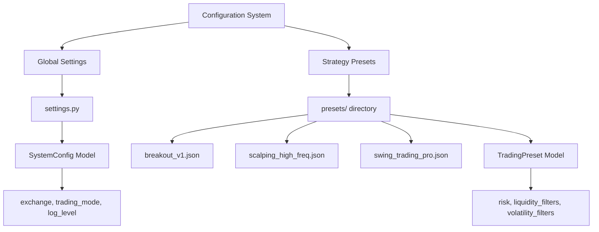
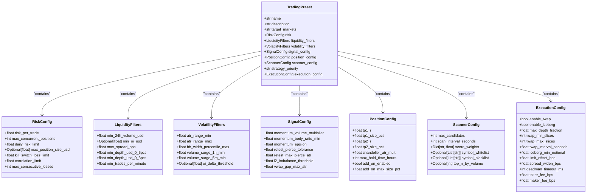
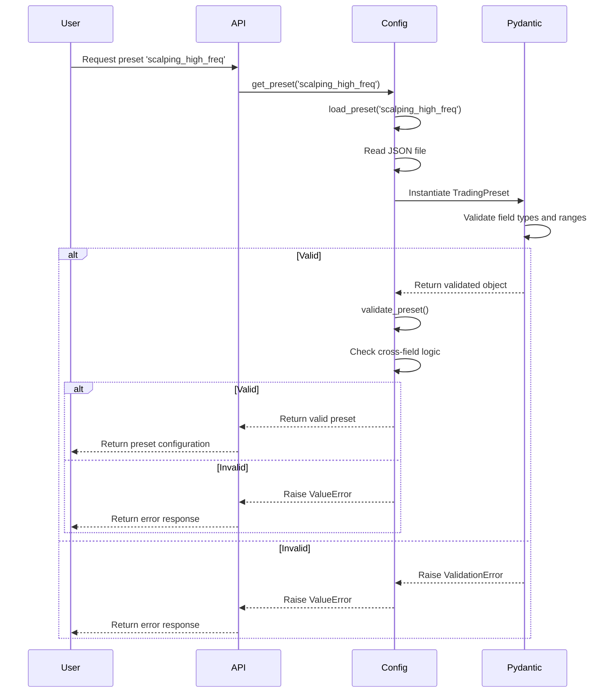
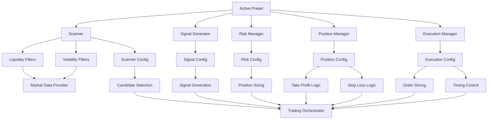
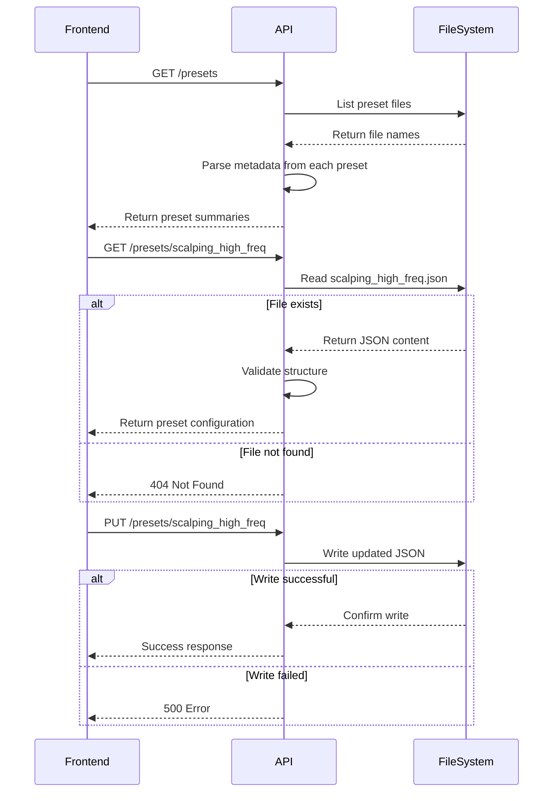

# Configuration System

<cite>
**Referenced Files in This Document**   
- [settings.py](file://breakout_bot/config/settings.py)
- [presets/breakout_v1.json](file://breakout_bot/config/presets/breakout_v1.json)
- [presets/scalping_high_freq.json](file://breakout_bot/config/presets/scalping_high_freq.json)
- [core/engine.py](file://breakout_bot/core/engine.py)
- [api/routers/presets.py](file://breakout_bot/api/routers/presets.py)
</cite>

## Table of Contents
1. [Introduction](#introduction)
2. [Dual-Layer Configuration Architecture](#dual-layer-configuration-architecture)
3. [Global Application Settings](#global-application-settings)
4. [Strategy Presets Structure](#strategy-presets-structure)
5. [Preset Loading and Validation](#preset-loading-and-validation)
6. [Available Preset Examples](#available-preset-examples)
7. [Configuration Impact on System Components](#configuration-impact-on-system-components)
8. [Creating Custom Presets](#creating-custom-presets)
9. [Common Configuration Issues](#common-configuration-issues)
10. [API Integration for Preset Management](#api-integration-for-preset-management)

## Introduction

The configuration system in the Breakout Bot Trading System provides a flexible framework for customizing trading behavior through a dual-layer approach that combines global application settings with strategy-specific presets. This architecture enables traders to quickly switch between different trading strategies while maintaining consistent system-wide parameters. The system uses Pydantic models for type safety and schema validation, ensuring that all configurations adhere to defined constraints before being applied. Configuration affects nearly every aspect of the trading system, from market scanning sensitivity to risk management aggressiveness and execution logic.

**Section sources**
- [settings.py](file://breakout_bot/config/settings.py#L1-L50)

## Dual-Layer Configuration Architecture

The configuration system employs a two-tiered architecture consisting of global application settings and strategy-specific presets. Global settings in `settings.py` define system-wide parameters such as logging levels, trading mode (paper or live), database connections, and default exchange selection. These settings provide the foundational environment in which the trading system operates. In contrast, strategy presets stored as JSON files in the `presets` directory contain detailed parameters for specific trading approaches, including scanning filters, signal generation rules, risk controls, and execution logic. This separation allows users to maintain consistent global behavior while rapidly switching between different trading strategies by loading alternative presets. The main `Settings` class orchestrates access to both configuration layers, providing a unified interface for components throughout the system.

**Diagram sources **
- [settings.py](file://breakout_bot/config/settings.py#L200-L366)

## Global Application Settings

Global application settings are defined in the `SystemConfig` Pydantic model within `settings.py` and control fundamental aspects of the trading system's operation. These settings include the default exchange (configured as "bybit"), trading mode ("paper" or "live"), logging level ("INFO" by default), and database URL ("sqlite:///breakout_bot.db"). The paper trading balance defaults to $100,000 with a slippage assumption of 5 basis points. These values can be overridden through environment variables, allowing for easy configuration across different deployment environments. The system automatically loads environment variables using `python-dotenv`, enabling external configuration without code changes. The `from_env` class method creates a `SystemConfig` instance from these environment variables, with sensible defaults provided when variables are not set. This global configuration layer ensures consistent behavior across all trading activities regardless of the active strategy preset.

**Section sources**
- [settings.py](file://breakout_bot/config/settings.py#L200-L250)

## Strategy Presets Structure

Strategy presets are comprehensive JSON files that define all parameters necessary for a specific trading approach. Each preset contains several key sections: risk management configuration, liquidity and volatility filters, signal generation parameters, position management rules, scanner configuration, and execution logic. The `TradingPreset` Pydantic model defines the complete structure, with nested models for each configuration category. Risk parameters include risk per trade (as a decimal), maximum concurrent positions, daily risk limit, and kill switch thresholds. Liquidity filters specify minimum 24-hour volume, open interest requirements, maximum spread, and depth thresholds at various price levels. Volatility filters define acceptable ATR/Price ratios, Bollinger Band width percentiles, and volume surge multipliers. Signal configuration includes momentum thresholds, retest tolerances, and L2 imbalance detection parameters. Position management defines take profit levels, Chandelier exit settings, and add-on position rules. Scanner configuration controls the number of candidates returned, scan frequency, and scoring weights for different metrics. Execution parameters govern order slicing behavior, depth consumption limits, and timing between order slices.

**Diagram sources **
- [settings.py](file://breakout_bot/config/settings.py#L100-L200)

## Preset Loading and Validation

The configuration system uses Pydantic models to ensure type safety and schema compliance when loading and validating trading presets. The `load_preset` function reads a JSON file from the presets directory and instantiates a `TradingPreset` object, which automatically validates all fields against their defined types and constraints. If the JSON is malformed or contains invalid data types, a `ValueError` is raised with descriptive error information. Beyond basic type validation, the system performs additional cross-field validation through the `validate_preset` function, which checks logical consistency between related parameters. For example, it verifies that TP2 is greater than TP1 and that the total take profit size does not exceed 100%. The `get_preset` function combines loading and validation into a single operation, ensuring that only valid configurations are returned to calling components. Field validators within each configuration model enforce domain-specific constraints, such as requiring percentage values to be between 0 and 1, ensuring maximum concurrent positions are reasonable, and validating that scoring weights sum to approximately 1.0. This comprehensive validation approach prevents configuration errors from propagating into the trading system.

**Diagram sources **
- [settings.py](file://breakout_bot/config/settings.py#L297-L366)

## Available Preset Examples

The system includes several pre-configured presets that demonstrate different trading strategies. The `breakout_v1.json` preset represents a balanced breakout strategy optimized for consistent profits across cryptocurrencies with realistic liquidity and volatility. It configures a risk per trade of 1.5%, allows up to 3 concurrent positions, and sets a daily risk limit of 8%. The liquidity filters require a minimum 24-hour volume of $15 million and a minimum depth of $10,000 at 0.3% from the current price. Volatility filters accept ATR/Price ratios between 0.5% and 10%, with volume surges of at least 1.6x in the past 5 minutes. The position configuration sets take profit levels at 1.5R and 2.8R, with 40% and 35% of the position size allocated to each respectively. In contrast, the `scalping_high_freq.json` preset is designed for high-frequency scalping on liquid markets. It increases risk per trade to 0.8% but reduces the maximum hold time to just 4 hours. The liquidity requirements are much stricter, demanding a minimum 24-hour volume of $100 million and a minimum depth of $60,000 at 0.3% from the current price. The execution configuration is optimized for speed, with TWAP intervals reduced to 1 second and a deadman timeout of only 4 seconds. Other available presets include `high_liquidity_top30.json` for large-cap tokens, `smallcap_top_gainers.json` for emerging opportunities, and `swing_trading_pro.json` for longer-term positions.

**Section sources**
- [presets/breakout_v1.json](file://breakout_bot/config/presets/breakout_v1.json)
- [presets/scalping_high_freq.json](file://breakout_bot/config/presets/scalping_high_freq.json)

## Configuration Impact on System Components

Configuration parameters directly influence the behavior of various system components, creating a cohesive trading strategy. Scanner sensitivity is determined by the combination of liquidity and volatility filters in the active preset; tighter filters result in fewer but higher-quality candidates. The risk configuration affects the risk manager's aggressiveness, with lower risk per trade values leading to smaller position sizes and more conservative exposure. The position configuration directly controls the trading orchestrator's behavior when managing open positions, determining take profit placement, stop loss distance, and whether add-on positions are permitted. Execution parameters shape how orders are sliced and submitted, with TWAP and iceberg settings preventing market impact on large orders. The scanner configuration's score weights determine which market characteristics are prioritized when ranking potential trades. When a new preset is loaded, the engine reloads relevant components such as the scanner, signal generator, and risk manager with the updated configuration, ensuring that all system elements operate with consistent parameters. This tight integration between configuration and component behavior allows for precise tuning of the entire trading system.

**Diagram sources **
- [core/engine.py](file://breakout_bot/core/engine.py#L100-L200)

## Creating Custom Presets

To create a custom preset, users should copy an existing preset JSON file and modify the parameters to suit their desired trading strategy. The process begins by selecting a base preset that most closely matches the intended approach, such as starting with `breakout_v1.json` for a general breakout strategy or `scalping_high_freq.json` for rapid-fire trading. Key considerations when customizing include adjusting risk parameters to match risk tolerance, modifying liquidity and volatility filters to target specific market conditions, and tuning signal generation parameters to capture desired patterns. The scoring weights in the scanner configuration should be adjusted to emphasize the most important factors for the strategy. When defining position management rules, ensure that TP2 is always greater than TP1 and that the total take profit size does not exceed 100%. Execution parameters should be set based on typical order sizes and market conditions; larger orders may benefit from more slices with longer intervals between them. After creating the custom preset file, it can be validated by attempting to load it through the API or by using the `get_preset` function programmatically. The system will automatically validate all parameters and report any issues with specific guidance on required corrections.

**Section sources**
- [settings.py](file://breakout_bot/config/settings.py#L297-L366)

## Common Configuration Issues

Several common issues can arise when working with the configuration system. Malformed JSON is a frequent problem, often caused by missing commas, incorrect brackets, or unquoted strings. The system provides clear error messages indicating the line and character where parsing failed, making these issues relatively easy to diagnose. Invalid parameter ranges represent another common issue, such as setting risk per trade to a value greater than 1 (representing more than 100%) or configuring TP2 to be less than or equal to TP1. The Pydantic validation system catches these issues and provides descriptive error messages explaining the acceptable range. Missing required fields can occur when copying presets and accidentally omitting essential parameters; the `TradingPreset` model marks all critical fields as required, ensuring they must be present. Another issue involves contradictory settings, such as enabling iceberg orders but setting the minimum notional too low for effective slicing. The system's cross-validation logic detects some of these contradictions, but others may only become apparent during testing. When encountering configuration issues, users should carefully review the error message, check the JSON syntax, verify all required fields are present, and ensure all values fall within acceptable ranges as defined in the Pydantic models.

**Section sources**
- [settings.py](file://breakout_bot/config/settings.py#L325-L366)

## API Integration for Preset Management

The system provides a REST API for managing presets, allowing both retrieval and modification of configuration files. The `/presets` endpoint returns a list of available presets with summary information including name, description, risk per trade, maximum positions, and strategy type. Individual presets can be retrieved via `/presets/{preset_name}`, which returns the complete configuration as JSON. This endpoint is used by the frontend to populate the preset editor interface. Users can update existing presets by sending a PUT request to `/presets/{preset_name}` with the modified configuration JSON. The API saves the updated configuration directly to the corresponding JSON file in the presets directory, making changes immediately available to the trading system. When combined with the engine's reload capability, this allows for dynamic configuration updates without requiring a system restart. The API includes proper error handling for cases such as non-existent presets or invalid JSON in update requests, returning appropriate HTTP status codes and descriptive error messages. This integration enables seamless interaction between the user interface and the underlying configuration system, supporting both viewing and editing of trading strategies.

**Diagram sources **
- [api/routers/presets.py](file://breakout_bot/api/routers/presets.py#L26-L106)