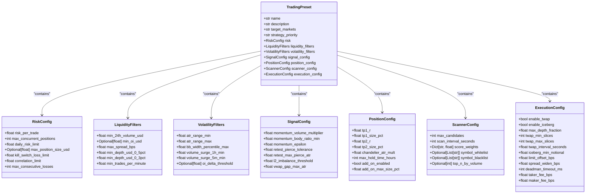
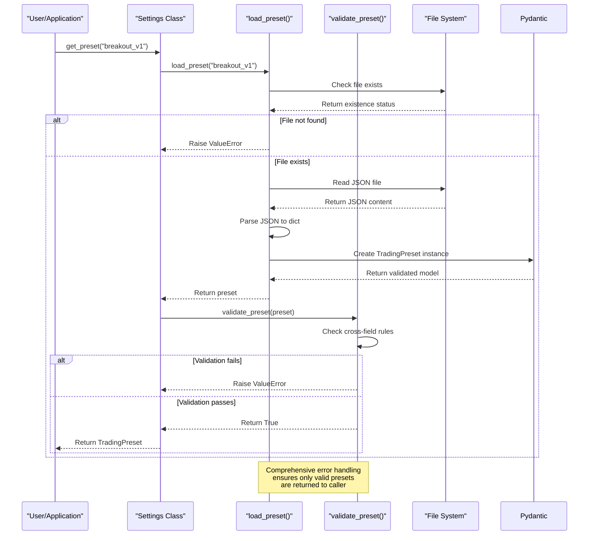

# Preset Management

<cite>
**Referenced Files in This Document**   
- [settings.py](file://breakout_bot/config/settings.py)
- [breakout_v1.json](file://breakout_bot/config/presets/breakout_v1.json)
- [scalping_high_freq.json](file://breakout_bot/config/presets/scalping_high_freq.json)
- [high_liquidity_top30.json](file://breakout_bot/config/presets/high_liquidity_top30.json)
</cite>

## Table of Contents
1. [Introduction](#introduction)
2. [Preset Structure and Configuration](#preset-structure-and-configuration)
3. [Core Configuration Components](#core-configuration-components)
4. [Preset Loading and Validation Process](#preset-loading-and-validation-process)
5. [Available Preset Types](#available-preset-types)
6. [Programmatic Access to Presets](#programmatic-access-to-presets)
7. [Best Practices for Preset Management](#best-practices-for-preset-management)
8. [Frontend Integration and UI Exposure](#frontend-integration-and-ui-exposure)
9. [Troubleshooting Common Issues](#troubleshooting-common-issues)
10. [Conclusion](#conclusion)

## Introduction

The Breakout Bot system utilizes a sophisticated preset management framework that enables traders to encapsulate complete trading strategies as reusable JSON configurations. These presets define comprehensive behavior across multiple layers including market scanning, signal generation, risk management, and execution logic. The system is designed to provide flexibility while maintaining strict validation through Pydantic models, ensuring configuration integrity before deployment.

Presets serve as the primary mechanism for configuring the bot's behavior without requiring code changes, allowing users to quickly switch between different trading approaches optimized for various market conditions and asset classes. This documentation provides a comprehensive overview of the preset management system, detailing its structure, implementation, and practical usage patterns.

**Section sources**
- [settings.py](file://breakout_bot/config/settings.py)

## Preset Structure and Configuration

Trading presets in the Breakout Bot system are structured JSON files that follow a well-defined schema implemented through Pydantic models. Each preset file contains a complete configuration that defines all aspects of the trading strategy, from high-level metadata to detailed parameter settings across multiple subsystems.

The core structure of a preset includes several required fields at the top level:
- **name**: A unique identifier for the preset
- **description**: Human-readable explanation of the strategy's purpose
- **target_markets**: Description of intended market focus
- **strategy_priority**: Primary strategy classification (e.g., "momentum")
- **risk**: Risk management configuration object
- **liquidity_filters**: Market quality requirements
- **volatility_filters**: Volatility-based filtering criteria
- **signal_config**: Signal generation parameters
- **position_config**: Position sizing and exit rules
- **scanner_config**: Market scanning behavior
- **execution_config**: Order execution microstructure settings

This hierarchical organization allows for modular configuration while maintaining coherence across interdependent components. The use of nested configuration objects ensures that related parameters are grouped logically, improving both readability and maintainability.



**Diagram sources**
- [settings.py](file://breakout_bot/config/settings.py#L220-L366)

**Section sources**
- [settings.py](file://breakout_bot/config/settings.py#L220-L366)

## Core Configuration Components

The preset system is built around several specialized configuration components, each responsible for a specific aspect of trading behavior. These components are implemented as Pydantic models with field-level validation to ensure parameter correctness.

### Risk Management Configuration
The `RiskConfig` class enforces strict boundaries on risk parameters, validating that percentage values fall within reasonable ranges (0-1) and that position limits are appropriate. Key parameters include risk per trade, maximum concurrent positions, daily risk limits, and kill-switch thresholds that automatically halt trading when predefined loss levels are reached.

### Liquidity Filters
The `LiquidityFilters` component ensures that only sufficiently liquid markets are considered by setting minimum requirements for 24-hour volume, open interest, order book depth, and trading frequency. These filters prevent the bot from engaging with illiquid assets that could lead to poor execution quality or slippage.

### Volatility Quality Controls
`VolatilityFilters` implements quality controls based on statistical measures such as ATR/Price ratio, Bollinger Band width percentile, and volume surge metrics. These parameters help identify markets with favorable volatility characteristics while avoiding those with excessive noise or compression.

### Signal Generation Parameters
The `SignalConfig` class contains parameters that govern how breakout signals are detected, including momentum thresholds, candle body ratios, retest tolerances, and L2 order book imbalance requirements. These settings directly influence the sensitivity and reliability of signal generation.

### Position Management Rules
`PositionConfig` defines take-profit levels (in R multiples), position sizing percentages, trailing stop parameters (Chandelier exit), maximum hold times, and add-on position rules. This component determines how positions are managed once entered.

### Scanner Behavior
`ScannerConfig` controls the market scanning process, including scan frequency, candidate limits, scoring weights for different factors, and symbol whitelists/blacklists. The scoring weights determine how different quality metrics contribute to overall opportunity ranking.

### Execution Microstructure
`ExecutionConfig` specifies advanced execution parameters such as TWAP slicing, iceberg order settings, depth consumption limits, and timing parameters. These settings optimize order placement to minimize market impact while maximizing execution quality.

**Section sources**
- [settings.py](file://breakout_bot/config/settings.py#L10-L218)

## Preset Loading and Validation Process

The preset loading process follows a robust sequence of operations that ensures configuration integrity before use. When a preset is requested, the system performs the following steps:

1. Constructs the file path based on the preset name
2. Verifies the existence of the corresponding JSON file
3. Loads and parses the JSON content
4. Instantiates a `TradingPreset` Pydantic model with the loaded data
5. Performs additional cross-field validation checks

The loading function `load_preset()` handles file system operations and JSON parsing, raising descriptive errors for missing files or invalid JSON syntax. Once loaded, the preset undergoes validation through the `validate_preset()` function, which performs additional business logic checks beyond basic type validation.

Key validation rules include:
- Ensuring TP2 is greater than TP1 (take-profit hierarchy)
- Verifying total take-profit size does not exceed 100%
- Confirming correlation limits are within valid bounds (0-1)
- Validating that TWAP slice counts follow min/max relationships

This two-layer validation approach—combining Pydantic's automatic field validation with custom business rule checking—provides comprehensive protection against invalid configurations that could lead to undesirable trading behavior.



**Diagram sources**
- [settings.py](file://breakout_bot/config/settings.py#L297-L366)

**Section sources**
- [settings.py](file://breakout_bot/config/settings.py#L297-L366)

## Available Preset Types

The system includes several pre-configured preset types optimized for different trading styles and market conditions. Each preset represents a distinct strategy profile with parameters tuned for specific objectives.

### breakout_v1
The default breakout strategy balances aggression and conservatism with moderate risk parameters (1.5% risk per trade) and targets markets with realistic liquidity. It uses a 40/35% split for take-profit levels at 1.5R and 2.8R respectively, with a 20-hour maximum hold time. The scanner evaluates up to 30 candidates every 2 minutes, focusing on volume surge, OI delta, and ATR quality.

### scalping_high_freq
Designed for rapid-fire trading on highly liquid markets, this preset features tight parameters optimized for quick profits. With only 0.8% risk per trade and a 4-hour maximum hold time, it targets the most active tokens. The aggressive scanning interval of 60 seconds and focus on trades-per-minute metric make it suitable for high-frequency opportunities in major cryptocurrencies.

### high_liquidity_top30
A conservative approach focused exclusively on the top 30 most liquid cryptocurrencies. With minimal risk exposure (0.5% per trade) and stringent liquidity requirements (minimum $500M 24h volume), this preset prioritizes capital preservation. It employs tighter volatility filters and more selective signal criteria, making it ideal for stable market conditions.

Additional presets available in the system include:
- **smallcap_top_gainers**: Targets small-cap tokens experiencing strong momentum
- **swing_trading_pro**: Medium-term swing trading with extended hold times
- **top_gainers_momentum**: Focuses on recent price leaders with volume confirmation
- **top_losers_reversal**: Contrarian strategy targeting oversold conditions

Each preset demonstrates how different parameter combinations create distinct trading profiles while sharing the same underlying architecture.

**Section sources**
- [breakout_v1.json](file://breakout_bot/config/presets/breakout_v1.json)
- [scalping_high_freq.json](file://breakout_bot/config/presets/scalping_high_freq.json)
- [high_liquidity_top30.json](file://breakout_bot/config/presets/high_liquidity_top30.json)

## Programmatic Access to Presets

The preset system provides a clean programmatic interface through the `Settings` class, enabling easy integration into trading applications. Users can load presets programmatically using the `get_preset()` method, which handles both loading and validation.

```python
from breakout_bot.config.settings import Settings

# Initialize settings manager
settings = Settings()

# Load a specific preset
try:
    preset = settings.get_preset("breakout_v1")
    print(f"Loaded preset: {preset.name}")
    print(f"Risk per trade: {preset.risk.risk_per_trade:.1%}")
except ValueError as e:
    print(f"Failed to load preset: {e}")
```

For discovering available presets, the `get_available_presets()` function scans the presets directory and returns a list of valid JSON filenames (without extensions). This allows dynamic enumeration of available strategies:

```python
# Get list of all available presets
available_presets = settings.get_available_presets()
print("Available presets:")
for name in available_presets:
    print(f"  - {name}")

# Check if a specific preset exists
if "scalping_high_freq" in available_presets:
    active_preset = settings.get_preset("scalping_high_freq")
```

Error handling is critical when working with presets programmatically. Common issues include:
- Missing preset files (ValueError with file path information)
- Invalid JSON syntax (JSONDecodeError wrapped in ValueError)
- Schema validation failures (ValueError with field-specific details)
- Cross-field validation errors (e.g., TP2 ≤ TP1)

Proper exception handling ensures that configuration errors are caught early and do not propagate into live trading operations.

**Section sources**
- [settings.py](file://breakout_bot/config/settings.py#L335-L366)

## Best Practices for Preset Management

Effective preset management requires adherence to several best practices that ensure consistency, reliability, and maintainability across the trading system.

### Organizational Structure
Maintain presets in the designated `config/presets/` directory with clear, descriptive filenames that indicate the strategy type and version. Use consistent naming conventions such as `strategy_type_version.json` (e.g., `breakout_v1.json`). Avoid modifying presets directly in production environments; instead, test changes in isolated copies first.

### Versioning Strategy
Implement semantic versioning for presets to track changes systematically. When updating a preset:
1. Create a copy with an incremented version number
2. Test the new version thoroughly
3. Deploy the updated preset
4. Deprecate older versions after successful validation

This approach prevents accidental overwrites and maintains a history of configuration evolution.

### Parameter Documentation
Include comprehensive descriptions in preset files explaining the rationale behind key parameter choices. While the JSON schema defines what parameters exist, comments or extended descriptions should explain why specific values were selected based on backtesting results or market observations.

### Testing Protocol
Before deploying any preset change:
1. Validate the JSON structure using the system's built-in validation
2. Run paper trading simulations to verify expected behavior
3. Compare performance metrics against baseline results
4. Conduct stress testing under various market conditions

### Backup Procedures
Regularly backup preset configurations, especially before major updates. Consider implementing version control for preset files to track changes and enable rollback capabilities.

**Section sources**
- [settings.py](file://breakout_bot/config/settings.py)
- [breakout_v1.json](file://breakout_bot/config/presets/breakout_v1.json)

## Frontend Integration and UI Exposure

The preset system integrates seamlessly with the frontend UI, exposing available strategies through REST endpoints that power the user interface. The API provides two key endpoints for preset management:

- `GET /api/presets/` returns a list of `PresetSummary` objects containing essential information about each available preset
- `GET /api/presets/{preset_name}` retrieves the complete configuration for a specific preset

The `PresetSummary` model includes condensed information such as name, description, risk parameters, and strategy type, enabling the UI to display a comprehensive overview without loading full configurations. This design optimizes performance by reducing initial payload size while still providing meaningful decision-making data.

In the frontend application, presets are exposed through dedicated UI components that allow users to:
- View available strategies in a list or grid format
- Select presets for activation
- Edit preset parameters through form interfaces
- Save modified configurations back to the server

The React component `PresetEditForm.tsx` implements a nested form structure that dynamically renders configuration fields based on the preset schema, providing an intuitive editing experience. Changes are validated client-side before being submitted to the backend via the PUT endpoint.

This integration creates a cohesive workflow where users can discover, select, customize, and deploy trading strategies entirely through the web interface, bridging the gap between technical configuration and user accessibility.

```mermaid
flowchart TD
subgraph Backend
A[Settings Class]
B[load_preset()]
C[validate_preset()]
D[Preset Files]
end
subgraph API
E[/api/presets GET]
F[/api/presets/{name} GET]
G[/api/presets/{name} PUT]
end
subgraph Frontend
H[Preset Selection UI]
I[Preset Summary List]
J[Preset Edit Form]
K[Save Changes]
end
D --> B --> C --> A
A --> E & F & G
E --> I
F --> J
G --> D
I --> H
J --> K
K --> G
style Backend fill:#f0f8ff,stroke:#333
style API fill:#e6f3ff,stroke:#333
style Frontend fill:#fff0f0,stroke:#333
click A "file://breakout_bot/config/settings.py" "Settings Implementation"
click D "file://breakout_bot/config/presets/" "Preset Directory"
click E "file://breakout_bot/api/routers/presets.py" "API Endpoint"
click J "file://frontend/src/components/PresetEditForm.tsx" "UI Component"
```

**Diagram sources**
- [settings.py](file://breakout_bot/config/settings.py)
- [presets.py](file://breakout_bot/api/routers/presets.py)
- [PresetEditForm.tsx](file://frontend/src/components/PresetEditForm.tsx)

**Section sources**
- [presets.py](file://breakout_bot/api/routers/presets.py)
- [PresetEditForm.tsx](file://frontend/src/components/PresetEditForm.tsx)

## Troubleshooting Common Issues

When working with trading presets, several common issues may arise that require systematic troubleshooting. Understanding these problems and their solutions helps maintain system reliability.

### Schema Mismatches
When adding new fields to preset configurations, ensure they are properly defined in the corresponding Pydantic model. Missing field definitions will cause validation errors. For optional fields, use `Optional[type]` with appropriate default values.

### Validation Failures
Common validation errors include:
- Percentage values outside 0-1 range
- Take-profit levels violating hierarchy (TP2 ≤ TP1)
- Total TP size exceeding 100%
- Negative values for positive-only parameters

Check error messages carefully, as they typically indicate the specific field and rule violation.

### File System Issues
Ensure the presets directory exists and is accessible. Permission issues or incorrect paths can prevent preset loading. Verify that JSON files have proper read permissions and are not locked by other processes during editing.

### Performance Differences
Significant performance variations between presets often stem from:
- Overly aggressive scanning intervals draining resources
- Excessive candidate counts overwhelming downstream processing
- Inappropriate parameter combinations creating conflicting signals

Monitor system metrics when switching presets to identify resource bottlenecks.

### Recovery Procedures
When encountering preset-related issues:
1. Verify the JSON syntax using a validator
2. Check the system logs for detailed error messages
3. Test with a known-good preset to isolate the problem
4. Use the API endpoints to retrieve and inspect problematic configurations
5. Gradually modify parameters rather than making wholesale changes

Following these troubleshooting guidelines minimizes downtime and ensures smooth operation of the trading system.

**Section sources**
- [settings.py](file://breakout_bot/config/settings.py#L325-L366)
- [presets.py](file://breakout_bot/api/routers/presets.py)

## Conclusion

The preset management system in Breakout Bot provides a powerful, flexible framework for defining and deploying trading strategies. By encapsulating complete behavior across scanning, signaling, risk, and execution layers in reusable JSON configurations, the system enables rapid strategy iteration without code changes.

Key strengths of the implementation include:
- Comprehensive validation through Pydantic models
- Clear separation of concerns via specialized configuration components
- Robust error handling and descriptive messaging
- Seamless integration between backend logic and frontend UI
- Support for dynamic discovery and programmatic access

The combination of strict schema enforcement, thoughtful organization, and user-friendly interfaces makes the preset system both reliable for production use and accessible for customization. By following best practices for organization, versioning, and testing, users can effectively manage multiple strategies tailored to different market conditions and trading objectives.