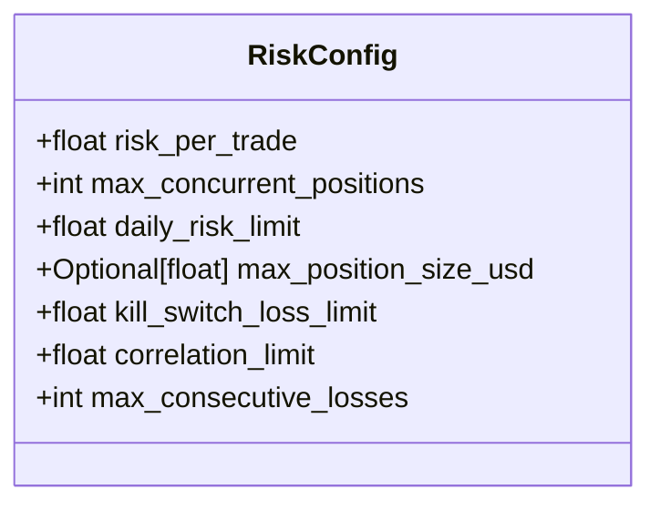
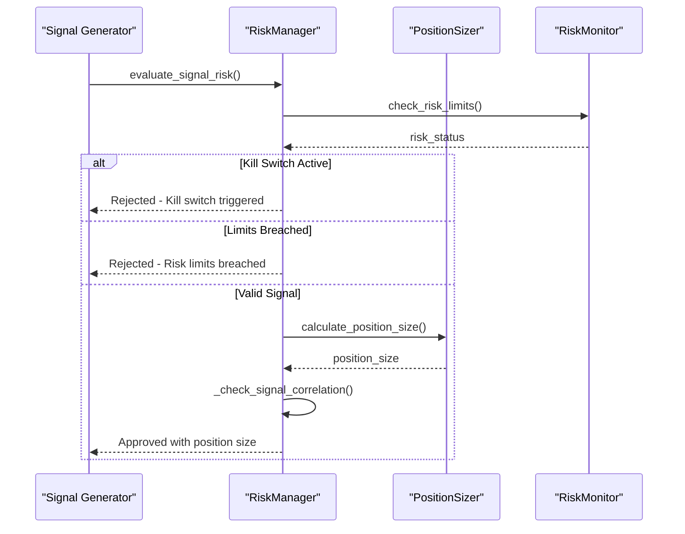

# Risk Settings

<cite>
**Referenced Files in This Document**   
- [settings.py](file://breakout_bot/config/settings.py)
- [risk_manager.py](file://breakout_bot/risk/risk_manager.py)
- [breakout_v1.json](file://breakout_bot/config/presets/breakout_v1.json)
- [scalping_high_freq.json](file://breakout_bot/config/presets/scalping_high_freq.json)
</cite>

## Table of Contents
1. [Risk Configuration Model](#risk-configuration-model)
2. [Risk Parameter Definitions](#risk-parameter-definitions)
3. [Risk Enforcement Mechanisms](#risk-enforcement-mechanisms)
4. [Preset Comparison: Conservative vs Aggressive](#preset-comparison-conservative-vs-aggressive)
5. [Field Validation Rules](#field-validation-rules)
6. [Behavioral Kill Switch: max_consecutive_losses](#behavioral-kill-switch-max_consecutive_losses)
7. [System-Wide Risk Cascading Effects](#system-wide-risk-cascading-effects)
8. [Calibration Guidance](#calibration-guidance)
9. [Common Pitfalls and Mitigations](#common-pitfalls-and-mitigations)

## Risk Configuration Model

The `RiskConfig` model defined in `settings.py` serves as the foundation for risk management across all trading presets. This Pydantic model enforces strict validation rules while providing clear documentation for each risk parameter. The configuration is loaded from JSON preset files and validated at runtime to ensure system integrity.



**Diagram sources**
- [settings.py](file://breakout_bot/config/settings.py#L17-L50)

**Section sources**
- [settings.py](file://breakout_bot/config/settings.py#L17-L50)

## Risk Parameter Definitions

### risk_per_trade
Percentage of capital allocated to risk on a single trade, expressed as a decimal (e.g., 0.015 = 1.5%). This parameter directly determines position sizing through R-based calculations in the risk manager.

### max_concurrent_positions
Maximum number of open positions allowed simultaneously. Limits portfolio exposure and prevents over-leveraging during volatile market conditions.

### daily_risk_limit
Maximum allowable drawdown percentage per trading day, calculated as a proportion of starting daily equity. Acts as a circuit breaker for daily losses.

### kill_switch_loss_limit
Absolute loss threshold that triggers a complete shutdown of trading activity when exceeded. Provides protection against catastrophic drawdowns.

### correlation_limit
Maximum allowable correlation with BTC for any traded asset. Helps maintain portfolio diversification by filtering out highly correlated instruments.

### max_position_size_usd
Optional absolute cap on position size in USD terms. Prevents excessive exposure to individual assets regardless of risk percentage calculations.

**Section sources**
- [settings.py](file://breakout_bot/config/settings.py#L17-L50)

## Risk Enforcement Mechanisms

Risk parameters are enforced through the `RiskManager` class in `risk_manager.py`, which coordinates between the `PositionSizer` and `RiskMonitor` components. During signal validation, the system performs comprehensive checks before approving trades.



**Diagram sources**
- [risk_manager.py](file://breakout_bot/risk/risk_manager.py#L467-L643)

**Section sources**
- [risk_manager.py](file://breakout_bot/risk/risk_manager.py#L467-L643)

## Preset Comparison: Conservative vs Aggressive

### breakout_v1.json (Conservative Configuration)
This balanced strategy prioritizes capital preservation with moderate risk parameters:
- **risk_per_trade**: 0.015 (1.5%)
- **max_concurrent_positions**: 3
- **daily_risk_limit**: 0.08 (8%)
- **kill_switch_loss_limit**: 0.18 (18%)
- **correlation_limit**: 0.4

### scalping_high_freq.json (Aggressive Configuration)
This high-frequency scalping strategy accepts higher risk for faster turnover:
- **risk_per_trade**: 0.008 (0.8%) - lower per-trade risk but more frequent trades
- **max_concurrent_positions**: 5 - allows greater portfolio exposure
- **daily_risk_limit**: 0.06 (6%) - tighter daily control
- **kill_switch_loss_limit**: 0.10 (10%) - more conservative kill switch
- **correlation_limit**: 0.4 - same diversification requirement

The aggressive preset compensates for lower per-trade risk with increased position count and frequency, while maintaining stricter daily controls to manage overall exposure.

**Section sources**
- [breakout_v1.json](file://breakout_bot/config/presets/breakout_v1.json)
- [scalping_high_freq.json](file://breakout_bot/config/presets/scalping_high_freq.json)

## Field Validation Rules

All risk parameters undergo strict validation to prevent invalid configurations:

### Percentage Range Validation (0-1)
Enforced on `risk_per_trade`, `daily_risk_limit`, and `kill_switch_loss_limit`:
```python
@field_validator('risk_per_trade', 'daily_risk_limit', 'kill_switch_loss_limit')
@classmethod
def validate_percentages(cls, v: float) -> float:
    if not 0 < v <= 1:
        raise ValueError("Percentage values must be between 0 and 1")
    return v
```
Invalid input raises: `"Percentage values must be between 0 and 1"`

### Position Limit Validation (1-10)
Enforced on `max_concurrent_positions`:
```python
@field_validator('max_concurrent_positions')
@classmethod
def validate_max_positions(cls, v: int) -> int:
    if not 1 <= v <= 10:
        raise ValueError("Max concurrent positions must be between 1 and 10")
    return v
```
Invalid input raises: `"Max concurrent positions must be between 1 and 10"`

### Consecutive Losses Validation (1-20)
Enforced on `max_consecutive_losses`:
```python
@field_validator('max_consecutive_losses')
@classmethod
def validate_max_consecutive_losses(cls, v: int) -> int:
    if not 1 <= v <= 20:
        raise ValueError("Max consecutive losses must be between 1 and 20")
    return v
```
Invalid input raises: `"Max consecutive losses must be between 1 and 20"`

**Section sources**
- [settings.py](file://breakout_bot/config/settings.py#L30-L48)

## Behavioral Kill Switch: max_consecutive_losses

The `max_consecutive_losses` parameter functions as a behavioral kill switch that activates after a specified number of consecutive losing trades. Defaulting to 5, this parameter helps prevent emotional decision-making and strategy degradation during losing streaks.

When the consecutive loss threshold is reached, the system triggers a kill switch that halts all new trading activity. This mechanism complements the drawdown-based kill switch by addressing performance decay even when absolute drawdown limits haven't been breached.

The implementation appears in legacy engine versions where consecutive losses are tracked and compared against the preset limit:
```python
max_losses = self.preset.risk.max_consecutive_losses
if self.consecutive_losses >= max_losses:
    should_activate = True
    reason = f"Max consecutive losses reached: {self.consecutive_losses} >= {max_losses}"
```

This behavioral control interacts with other risk parameters by providing an additional layer of protection that focuses on trade sequence quality rather than just monetary loss.

**Section sources**
- [settings.py](file://breakout_bot/config/settings.py#L26)
- [engine_backup_20250922_001642.py](file://breakout_bot/core/engine_backup_20250922_001642.py#L848)
- [engine_old.py](file://breakout_bot/core/engine_old.py#L865)

## System-Wide Risk Cascading Effects

Changes to risk parameters create cascading effects throughout the trading system, particularly affecting position sizing calculations in `risk_manager.py`.

### risk_per_trade Impact on Position Sizing
The `risk_per_trade` parameter directly influences position size through the R-model calculation:
```python
# Calculate R dollar amount
r_dollar = account_equity * self.config.risk_per_trade

# Calculate raw position quantity
raw_quantity = r_dollar / stop_distance
```
A higher `risk_per_trade` value increases the R-dollar amount, resulting in larger position sizes for the same stop distance. Conversely, reducing this parameter proportionally decreases position sizes.

### Risk Reduction Logic
When approaching risk limits, the system automatically reduces position sizes by 50%:
```python
if 'metrics' in risk_status and self.risk_monitor.should_reduce_risk(risk_status['metrics']):
    # Reduce position size by 50%
    position_size.quantity *= 0.5
    position_size.notional_usd *= 0.5
    position_size.risk_usd *= 0.5
```
This occurs when:
- Daily risk used exceeds 80% of daily risk limit
- Maximum drawdown exceeds 50% of kill switch threshold
- Open positions equal maximum concurrent positions

These cascading effects ensure that risk management is dynamic and responsive to current market conditions and performance.

**Section sources**
- [risk_manager.py](file://breakout_bot/risk/risk_manager.py#L47-L234)
- [risk_manager.py](file://breakout_bot/risk/risk_manager.py#L237-L464)

## Calibration Guidance

### Account Size Considerations
- **Small accounts (<$10k)**: Use lower `risk_per_trade` (0.5-1%) to ensure sufficient diversification and avoid minimum notional constraints
- **Medium accounts ($10k-$100k)**: Standard 1-2% risk allocation provides optimal balance between growth and preservation
- **Large accounts (>$100k)**: May require `max_position_size_usd` constraints to prevent market impact

### Volatility-Based Adjustments
- **High volatility periods**: Reduce `risk_per_trade` by 30-50% and tighten `kill_switch_loss_limit`
- **Low volatility periods**: Can moderately increase `risk_per_trade` but maintain strict position limits
- **BTC correlation spikes**: Lower `correlation_limit` to 0.3 or below to maintain true diversification

### Strategy-Specific Calibration
- **Scalping strategies**: Prioritize `daily_risk_limit` and `kill_switch_loss_limit` over per-trade risk due to high trade frequency
- **Swing trading**: Focus on `risk_per_trade` and `max_consecutive_losses` as fewer trades amplify individual trade impact
- **High-frequency systems**: Set `max_concurrent_positions` conservatively to prevent compounding errors

**Section sources**
- [settings.py](file://breakout_bot/config/settings.py)
- [risk_manager.py](file://breakout_bot/risk/risk_manager.py)

## Common Pitfalls and Mitigations

### Overly Restrictive Limits
**Problem**: Excessively tight risk parameters cause missed opportunities and reduced profitability.
**Examples**:
- `risk_per_trade` below 0.5% may result in positions too small to overcome transaction costs
- `max_concurrent_positions` of 1-2 limits portfolio diversification benefits
- `correlation_limit` below 0.3 severely restricts universe during market-wide events

**Mitigation**: Backtest different parameter combinations and monitor opportunity cost metrics.

### Insufficient Kill Switches
**Problem**: Inadequate circuit breakers allow large drawdowns during systemic failures.
**Examples**:
- `kill_switch_loss_limit` above 20% risks account viability
- Absence of `daily_risk_limit` enables unlimited daily losses
- High `max_consecutive_losses` (15+) permits prolonged negative expectancy

**Mitigation**: Implement multiple independent kill switches (drawdown, daily loss, consecutive losses).

### Parameter Interdependencies
**Problem**: Uncoordinated parameter changes create unintended consequences.
**Example**: Increasing `risk_per_trade` without adjusting `max_position_size_usd` could create excessively large positions in low-volatility assets.

**Mitigation**: Use holistic risk review process that considers all parameters simultaneously, particularly ensuring:
- `kill_switch_loss_limit` ≥ 2 × `daily_risk_limit`
- `daily_risk_limit` ≥ 5 × `risk_per_trade`
- `max_concurrent_positions` ≤ 10 to maintain manageable oversight

Regular monitoring of risk metrics and periodic calibration based on performance data helps avoid these pitfalls while maintaining effective risk control.

**Section sources**
- [settings.py](file://breakout_bot/config/settings.py)
- [risk_manager.py](file://breakout_bot/risk/risk_manager.py)
- [breakout_v1.json](file://breakout_bot/config/presets/breakout_v1.json)
- [scalping_high_freq.json](file://breakout_bot/config/presets/scalping_high_freq.json)