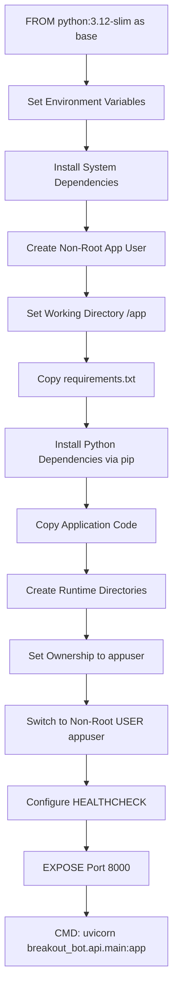
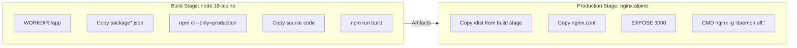
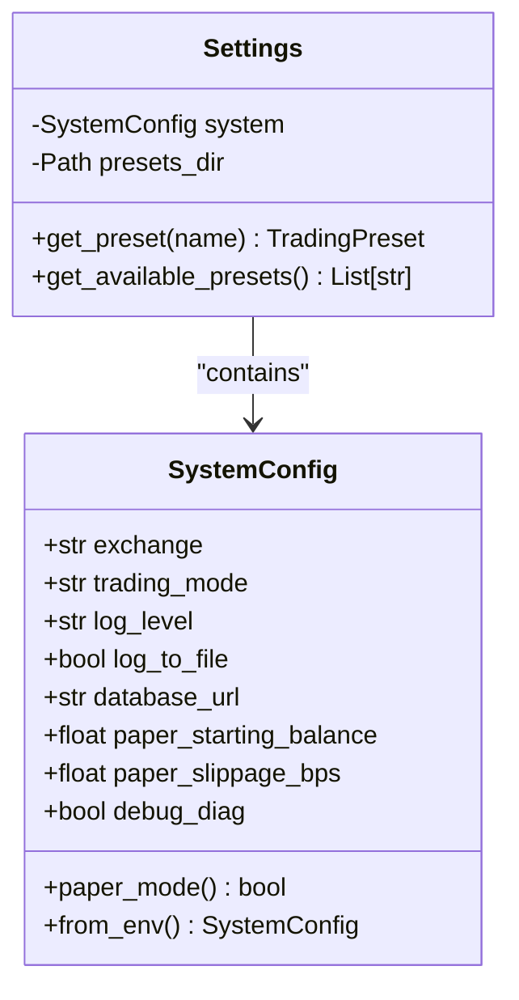
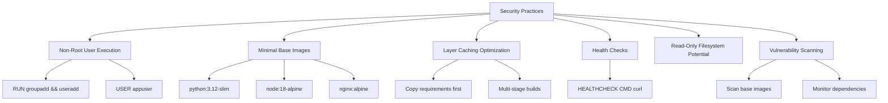

# Containerization

<cite>
**Referenced Files in This Document**   
- [Dockerfile](file://Dockerfile)
- [frontend/Dockerfile](file://frontend/Dockerfile)
- [start.sh](file://start.sh)
- [frontend/nginx.conf](file://frontend/nginx.conf)
- [requirements.txt](file://requirements.txt)
- [package.json](file://frontend/package.json)
- [breakout_bot/config/settings.py](file://breakout_bot/config/settings.py)
</cite>

## Table of Contents
1. [Introduction](#introduction)
2. [Backend Containerization Strategy](#backend-containerization-strategy)
3. [Frontend Containerization Strategy](#frontend-containerization-strategy)
4. [Environment Configuration and Secrets Management](#environment-configuration-and-secrets-management)
5. [Image Building, Tagging, and Deployment](#image-building-tagging-and-deployment)
6. [Security Considerations](#security-considerations)
7. [Troubleshooting Common Build Issues](#troubleshooting-common-build-issues)
8. [Conclusion](#conclusion)

## Introduction

The Breakout Bot Trading System employs a comprehensive containerization strategy to ensure consistent deployment across development, testing, and production environments. The system consists of two primary components: a Python-based backend API built with FastAPI and a React-based frontend served through Nginx. Both components are containerized using Docker with optimized multi-stage builds that prioritize security, performance, and maintainability.

This documentation details the containerization approach for both backend and frontend services, covering Dockerfile structure, build optimization techniques, runtime configuration, security practices, and operational guidance for local development and deployment workflows.

## Backend Containerization Strategy

The backend containerization is defined in the root-level `Dockerfile`, which implements a single-stage but highly optimized build process tailored for production deployment of the trading system.



**Diagram sources**
- [Dockerfile](file://Dockerfile#L1-L51)
- [requirements.txt](file://requirements.txt#L1-L40)

### Base Image Selection

The backend uses `python:3.12-slim` as its base image, providing a minimal Debian-based environment with Python 3.12. This choice balances compatibility with modern Python features while minimizing attack surface and image size. The slim variant excludes unnecessary packages like documentation and debug tools, reducing the final image footprint.

### Dependency Installation Process

Python dependencies are installed from `requirements.txt` using pip with several optimizations:

- `PIP_NO_CACHE_DIR=1`: Disables pip's cache to reduce layer size
- `--no-cache-dir` flag in pip install: Ensures no cached files persist in the image
- Dependencies are installed before copying application code to leverage Docker layer caching—changes to source code won't trigger reinstallation of packages

The `requirements.txt` includes essential trading system dependencies such as:
- `ccxt` for exchange connectivity
- `fastapi` and `uvicorn` for the web API
- `pandas`, `numpy`, and `pandas-ta` for technical analysis
- `loguru` for structured logging
- `pydantic` for data validation and settings management

### Multi-Stage Build Considerations

While the current implementation uses a single stage, it follows best practices typically associated with multi-stage builds by separating concerns and minimizing final image bloat. All build-time dependencies (like `gcc` and `g++`) are installed temporarily and cleaned up after package compilation, ensuring they don't remain in the final runtime image.

### Entrypoint Execution

The container executes the FastAPI application via Uvicorn ASGI server using the command:
```bash
python -m uvicorn breakout_bot.api.main:app --host 0.0.0.0 --port 8000
```
This starts the API server on port 8000, accessible externally. The actual entrypoint is further orchestrated by the `start.sh` script in development environments, which manages both backend and frontend processes.

**Section sources**
- [Dockerfile](file://Dockerfile#L1-L51)
- [requirements.txt](file://requirements.txt#L1-L40)
- [start.sh](file://start.sh#L1-L343)

## Frontend Containerization Strategy

The frontend containerization is implemented in `frontend/Dockerfile`, utilizing a true multi-stage build process to separate development dependencies from production delivery.



**Diagram sources**
- [frontend/Dockerfile](file://frontend/Dockerfile#L1-L33)
- [frontend/nginx.conf](file://frontend/nginx.conf#L1-L68)
- [package.json](file://frontend/package.json#L1-L48)

### Node.js Environment Setup

The build stage uses `node:18-alpine`, an extremely lightweight image based on Alpine Linux. This reduces the initial build environment size significantly compared to full Debian-based Node images, accelerating download times and minimizing vulnerabilities.

### npm Package Installation

Dependencies are installed using `npm ci --only=production`, which:
- Uses the exact versions specified in `package-lock.json`
- Is faster and more reliable than `npm install` for CI/CD contexts
- Only installs production dependencies, excluding devDependencies

This ensures deterministic builds and prevents accidental inclusion of development-only packages in the final image.

### Vite Build Process

After dependency installation, the application is built using `npm run build`, which invokes Vite's optimized build process. Vite provides:
- Lightning-fast bundling through ES modules
- Tree-shaking to eliminate unused code
- Minification and compression of assets
- Generation of static files in the `/dist` directory

The resulting build is highly optimized for performance with hashed filenames for cache busting.

### Nginx Serving Configuration

The production stage uses `nginx:alpine` to serve static assets efficiently. The custom `nginx.conf` configures Nginx with several critical features:

#### Security Headers
- `X-Frame-Options: SAMEORIGIN` – Prevents clickjacking
- `X-Content-Type-Options: nosniff` – Blocks MIME type sniffing
- `X-XSS-Protection: 1; mode=block` – Enables XSS filtering
- `Referrer-Policy: strict-origin-when-cross-origin` – Controls referrer information

#### Routing and Proxying
- `try_files $uri $uri/ /index.html` – Enables client-side routing for React Router
- API proxy at `/api/` path forwards requests to backend service (`breakout-bot-api:8000`)
- WebSocket proxy at `/ws` enables real-time communication with backend

#### Performance Optimizations
- Gzip compression enabled for text-based assets
- Long-term caching (1 year) with immutable flag for static assets (JS, CSS, images)
- Access and error logging configured

The server listens on port 3000, matching the expected frontend port in development and production configurations.

**Section sources**
- [frontend/Dockerfile](file://frontend/Dockerfile#L1-L33)
- [frontend/nginx.conf](file://frontend/nginx.conf#L1-L68)
- [package.json](file://frontend/package.json#L1-L48)

## Environment Configuration and Secrets Management

The system employs environment variables for runtime configuration, loaded through Python's `dotenv` library and validated using Pydantic models.



**Diagram sources**
- [breakout_bot/config/settings.py](file://breakout_bot/config/settings.py#L1-L368)

### Environment Variable Injection

Runtime configuration is injected via environment variables, with defaults provided in code. Key variables include:
- `TRADING_MODE`: Controls paper vs live trading
- `DEFAULT_EXCHANGE`: Sets the target exchange (e.g., Bybit)
- `LOG_LEVEL`: Configures verbosity of logging output
- `DATABASE_URL`: Specifies database connection string
- `PAPER_STARTING_BALANCE`: Initial balance for paper trading simulations

These variables are consumed by the `SystemConfig.from_env()` method, which safely converts and validates input types.

### Secrets Handling

While the current implementation does not explicitly show secrets management integration (like Hashicorp Vault or AWS Secrets Manager), the architecture supports secure patterns:
- Environment variables are the preferred method for injecting sensitive data
- `.env` files can be used in development but should be excluded from version control
- In production, orchestration platforms (Kubernetes, Docker Swarm) should provide secrets injection
- The use of Pydantic validation ensures malformed configuration is caught early

For enhanced security, future improvements could include:
- Explicit validation of secret presence
- Integration with cloud-native secrets managers
- Automatic detection of hardcoded secrets in codebase

**Section sources**
- [breakout_bot/config/settings.py](file://breakout_bot/config/settings.py#L1-L368)

## Image Building, Tagging, and Deployment

### Building Images Locally

To build the backend image:
```bash
docker build -t breakout-bot-backend:latest .
```

To build the frontend image:
```bash
cd frontend
docker build -t breakout-bot-frontend:latest .
```

### Tagging Conventions

Recommended tagging strategy:
- `latest` – Development/latest build
- `v{version}` – Semantic version tags (e.g., `v1.2.0`)
- `{git-commit-hash}` – Immutable build references
- `dev`, `staging`, `prod` – Environment-specific tags

Example:
```bash
docker tag breakout-bot-backend:latest myregistry/breakout-bot-backend:v1.0.0
```

### Pushing to Container Registries

```bash
# Login to registry
docker login myregistry.com

# Push tagged image
docker push myregistry/breakout-bot-backend:v1.0.0
docker push myregistry/breakout-bot-frontend:v1.0.0
```

The system is designed to work with private registries in production while supporting local development without registry requirements.

**Section sources**
- [Dockerfile](file://Dockerfile#L1-L51)
- [frontend/Dockerfile](file://frontend/Dockerfile#L1-L33)

## Security Considerations

The containerization strategy incorporates multiple security best practices to protect the trading system.



**Diagram sources**
- [Dockerfile](file://Dockerfile#L1-L51)
- [frontend/Dockerfile](file://frontend/Dockerfile#L1-L33)

### Running as Non-Root User

The backend container creates and switches to a dedicated non-root user:
```dockerfile
RUN groupadd -r appuser && useradd -r -g appuser appuser
...
USER appuser
```
This principle of least privilege minimizes potential damage if the container is compromised.

### Minimal Image Footprint

Both containers use minimal base images:
- Backend: `python:3.12-slim` (~120MB)
- Frontend build: `node:18-alpine` (~120MB)
- Frontend production: `nginx:alpine` (~23MB)

The final frontend image is exceptionally small due to the separation of build and runtime stages.

### Layer Caching Optimization

The Dockerfiles are structured to maximize layer reuse:
- Backend: `requirements.txt` copied and installed before application code
- Frontend: `package*.json` copied before source files
This ensures dependency layers are cached unless dependencies change, significantly speeding up rebuilds.

### Health Check Configurations

The backend includes a comprehensive health check:
```dockerfile
HEALTHCHECK --interval=30s --timeout=10s --start-period=5s --retries=3 \
    CMD python -c "import requests; requests.get('http://localhost:8000/api/health', timeout=5)"
```
This allows orchestration systems to detect and recover from unhealthy containers automatically.

### Read-Only Filesystems

While not explicitly configured in Dockerfiles, the architecture supports running containers with read-only filesystems except for specific volumes (`/app/logs`, `/app/data`). This would prevent malicious writes and enhance security.

### Vulnerability Scanning

Best practice recommendations:
- Regularly scan base images for CVEs
- Use tools like Trivy, Clair, or Snyk to scan images
- Monitor Python and npm dependencies for known vulnerabilities
- Subscribe to security advisories for key libraries (ccxt, fastapi, etc.)

**Section sources**
- [Dockerfile](file://Dockerfile#L1-L51)
- [frontend/Dockerfile](file://frontend/Dockerfile#L1-L33)

## Troubleshooting Common Build Issues

### Backend Build Failures

**Issue**: Compilation errors during pip install  
**Solution**: Ensure build dependencies (`gcc`, `g++`, `libffi-dev`, `libssl-dev`) are installed in the container

**Issue**: Missing modules at runtime  
**Solution**: Verify all dependencies are listed in `requirements.txt`, not just installed locally

**Issue**: Permission errors  
**Solution**: Ensure proper ownership with `chown -R appuser:appuser /app` and correct user switching

### Frontend Build Problems

**Issue**: Node module installation failures  
**Solution**: Use `npm ci` instead of `npm install` for consistent dependency resolution

**Issue**: Build hanging or out of memory  
**Solution**: Increase Docker memory allocation or optimize Vite configuration

**Issue**: 404 errors on page refresh (client routing)  
**Solution**: Verify Nginx `try_files` directive is properly configured in `nginx.conf`

### Runtime Issues

**Issue**: Container exits immediately  
**Solution**: Check command syntax and required environment variables

**Issue**: Port conflicts  
**Solution**: Ensure ports 8000 (API) and 3000 (frontend) are available, or modify accordingly

**Issue**: Health checks failing  
**Solution**: Verify API endpoint `/api/health` is accessible and responding correctly

The `start.sh` script provides built-in troubleshooting capabilities:
- Automatic port conflict detection and cleanup
- Service status monitoring
- Log viewing with `./start.sh logs [api|frontend|all]`
- Comprehensive status reporting with `./start.sh status`

**Section sources**
- [start.sh](file://start.sh#L1-L343)
- [Dockerfile](file://Dockerfile#L1-L51)
- [frontend/Dockerfile](file://frontend/Dockerfile#L1-L33)

## Conclusion

The containerization strategy for the Breakout Bot Trading System demonstrates a mature, production-ready approach to microservices deployment. By leveraging multi-stage builds, minimal base images, and security-first principles, the system achieves optimal balance between functionality, performance, and protection.

Key strengths include:
- Clear separation of concerns between backend and frontend
- Efficient layer caching for rapid development cycles
- Robust security posture through non-root execution and minimal footprints
- Production-grade serving with Nginx and proper health checks
- Well-documented operational workflows via the `start.sh` orchestration script

Future enhancements could include:
- Implementing true multi-stage backend builds to separate compilation
- Adding automated vulnerability scanning to CI/CD pipeline
- Integrating with Kubernetes for advanced orchestration
- Enhancing secrets management for production deployments

The current implementation provides a solid foundation for reliable, scalable, and secure deployment of the algorithmic trading system across various environments.