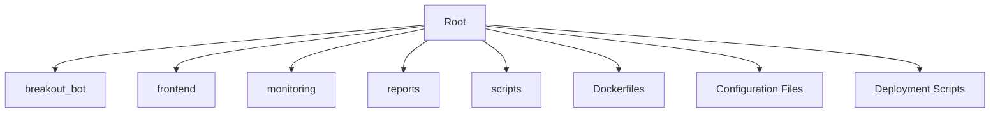
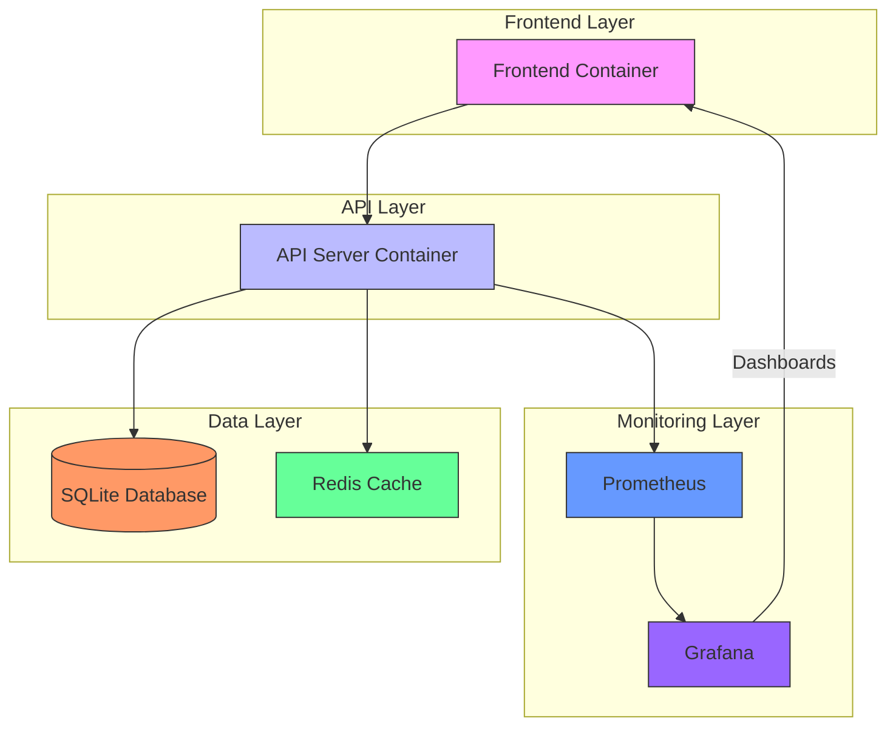
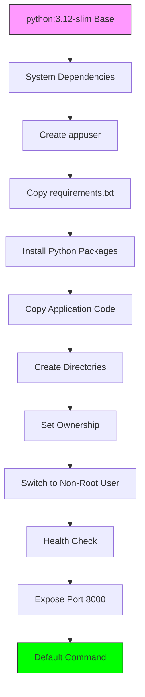
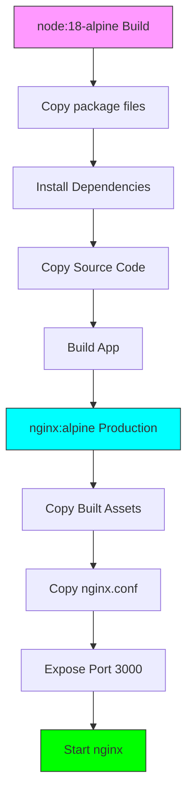
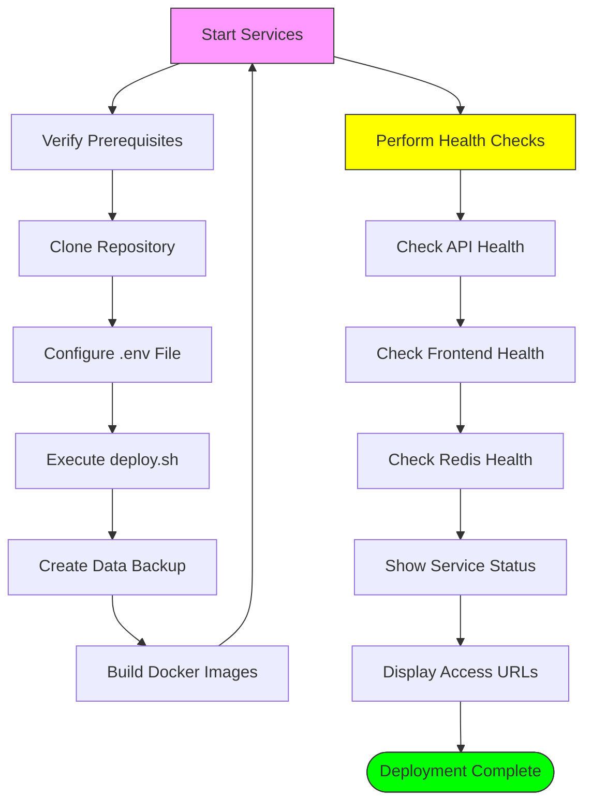
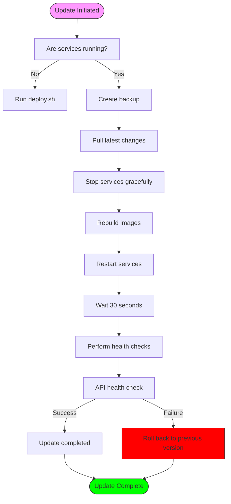
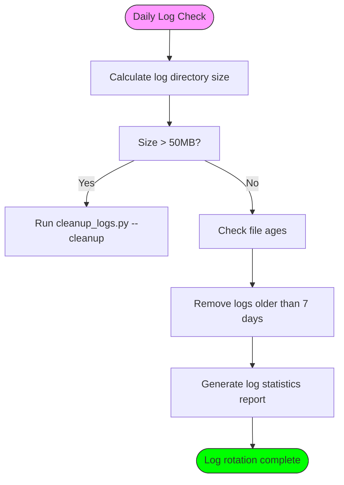
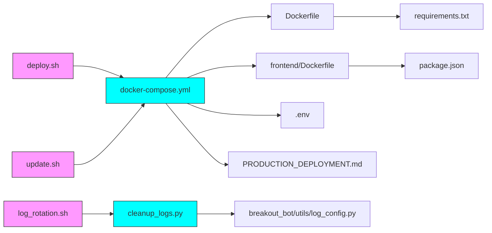

# Deployment and Operations

<cite>
**Referenced Files in This Document**   
- [Dockerfile](file://Dockerfile)
- [frontend/Dockerfile](file://frontend/Dockerfile)
- [docker-compose.yml](file://docker-compose.yml)
- [PRODUCTION_DEPLOYMENT.md](file://PRODUCTION_DEPLOYMENT.md)
- [deploy.sh](file://deploy.sh)
- [update.sh](file://update.sh)
- [scripts/log_rotation.sh](file://scripts/log_rotation.sh)
- [cleanup_logs.py](file://cleanup_logs.py)
- [breakout_bot/config/settings.py](file://breakout_bot/config/settings.py)
- [start.sh](file://start.sh)
- [status.sh](file://status.sh)
- [stop.sh](file://stop.sh)
</cite>

## Table of Contents
1. [Introduction](#introduction)
2. [Project Structure](#project-structure)
3. [Core Components](#core-components)
4. [Architecture Overview](#architecture-overview)
5. [Detailed Component Analysis](#detailed-component-analysis)
6. [Dependency Analysis](#dependency-analysis)
7. [Performance Considerations](#performance-considerations)
8. [Troubleshooting Guide](#troubleshooting-guide)
9. [Conclusion](#conclusion)

## Introduction
This document provides comprehensive architectural documentation for the deployment and operations framework of the Breakout Bot Trading System. It details the Docker-based containerization strategy, service orchestration via Docker Compose, production deployment workflows, automation scripts for deployment and updates, operational procedures including log management and backup routines, monitoring integration, scaling considerations, security hardening measures, and runbook-style guidance for routine and emergency operations.

## Project Structure
The project follows a modular structure with distinct components for backend services, frontend interface, monitoring tools, reports, and operational scripts. The core trading logic resides in the breakout_bot directory, while the user interface is implemented in the frontend directory. Monitoring configurations are stored in the monitoring directory, and operational scripts are located in the scripts directory.



**Diagram sources**
- [Dockerfile](file://Dockerfile)
- [frontend/Dockerfile](file://frontend/Dockerfile)
- [docker-compose.yml](file://docker-compose.yml)

**Section sources**
- [Dockerfile](file://Dockerfile)
- [frontend/Dockerfile](file://frontend/Dockerfile)
- [docker-compose.yml](file://docker-compose.yml)

## Core Components
The deployment framework consists of several core components: container images defined by Dockerfiles for both backend and frontend, service orchestration through docker-compose.yml, deployment automation via deploy.sh and update.sh scripts, operational maintenance scripts including log_rotation.sh, and comprehensive monitoring integration with Prometheus and Grafana.

**Section sources**
- [Dockerfile](file://Dockerfile)
- [frontend/Dockerfile](file://frontend/Dockerfile)
- [docker-compose.yml](file://docker-compose.yml)
- [deploy.sh](file://deploy.sh)
- [update.sh](file://update.sh)

## Architecture Overview
The system employs a microservices architecture orchestrated by Docker Compose, with separate containers for the API server, frontend interface, Redis caching, Prometheus monitoring, and Grafana visualization. Services communicate over a dedicated Docker network, with persistent storage mounted for data, logs, and configuration.



**Diagram sources**
- [docker-compose.yml](file://docker-compose.yml)
- [Dockerfile](file://Dockerfile)
- [frontend/Dockerfile](file://frontend/Dockerfile)

## Detailed Component Analysis

### Container Image Construction
The system utilizes multi-stage Docker builds to create optimized container images for both backend and frontend components, minimizing attack surface and improving performance.

#### Backend Dockerfile Analysis
The backend Dockerfile implements security best practices including non-root user execution, minimal base image selection, and proper layer caching strategies.



**Diagram sources**
- [Dockerfile](file://Dockerfile#L1-L50)

**Section sources**
- [Dockerfile](file://Dockerfile#L1-L50)
- [breakout_bot/config/settings.py](file://breakout_bot/config/settings.py#L265-L294)

#### Frontend Dockerfile Analysis
The frontend Dockerfile uses a multi-stage build process to separate development dependencies from production artifacts, resulting in a lightweight nginx-based production image.



**Diagram sources**
- [frontend/Dockerfile](file://frontend/Dockerfile#L1-L32)

**Section sources**
- [frontend/Dockerfile](file://frontend/Dockerfile#L1-L32)

### Service Orchestration
The docker-compose.yml file defines the complete service topology, networking, volume mounts, and health checks for the entire system.

#### Docker Compose Architecture
The orchestration configuration establishes a bridge network for service communication, defines volume mounts for persistent data storage, and configures resource monitoring and restart policies.

```mermaid
graph TB
subgraph "Services"
API[breakout-bot-api]
FE[breakout-bot-frontend]
RD[redis]
PM[prometheus]
GF[grafana]
end
subgraph "Network"
NET[breakout-network]
end
subgraph "Volumes"
V1[data:/app/data]
V2[logs:/app/logs]
V3[reports:/app/reports]
V4[redis-data]
V5[prometheus-data]
V6[grafana-data]
end
API < --> NET
FE < --> NET
RD < --> NET
PM < --> NET
GF < --> NET
API --> V1
API --> V2
API --> V3
RD --> V4
PM --> V5
GF --> V6
style NET fill:#000,stroke:#fff,stroke-width:2px
style V1,V2,V3,V4,V5,V6 fill:#f96,stroke:#333
```

**Diagram sources**
- [docker-compose.yml](file://docker-compose.yml#L1-L94)

**Section sources**
- [docker-compose.yml](file://docker-compose.yml#L1-L94)

### Production Deployment Workflow
The PRODUCTION_DEPLOYMENT.md document outlines the complete workflow for deploying the trading system to production environments, including environment segregation, secret management, and rollback procedures.

#### Deployment Process Flow
The deployment process follows a structured sequence from initial setup to post-deployment verification, ensuring system reliability and data integrity.



**Diagram sources**
- [PRODUCTION_DEPLOYMENT.md](file://PRODUCTION_DEPLOYMENT.md#L1-L248)
- [deploy.sh](file://deploy.sh#L1-L111)

**Section sources**
- [PRODUCTION_DEPLOYMENT.md](file://PRODUCTION_DEPLOYMENT.md#L1-L248)
- [deploy.sh](file://deploy.sh#L1-L111)

### Automation Scripts
The system includes several bash scripts to automate deployment, updates, and operational tasks, reducing manual intervention and potential errors.

#### Initial Deployment Script
The deploy.sh script automates the entire deployment process, including dependency checks, backup creation, service startup, and health verification.

```mermaid
sequenceDiagram
participant User
participant DeployScript as deploy.sh
participant DockerCompose
participant System
User->>DeployScript : ./deploy.sh
DeployScript->>System : Check Docker status
alt Docker not running
DeployScript-->>User : Error message
stop
end
DeployScript->>System : Check docker-compose
alt docker-compose not available
DeployScript-->>User : Error message
stop
end
DeployScript->>System : Create backup directory
DeployScript->>System : Backup existing data/logs
DeployScript->>System : Create directories
DeployScript->>System : Set permissions
DeployScript->>DockerCompose : docker-compose down
DeployScript->>DockerCompose : docker-compose build
DeployScript->>DockerCompose : docker-compose up -d
DeployScript->>System : Wait 30 seconds
DeployScript->>System : Health check API
DeployScript->>System : Health check Frontend
DeployScript->>System : Health check Redis
DeployScript->>DockerCompose : docker-compose ps
DeployScript-->>User : Success message and URLs
```

**Diagram sources**
- [deploy.sh](file://deploy.sh#L1-L111)

**Section sources**
- [deploy.sh](file://deploy.sh#L1-L111)

#### Update and Rollback Strategy
The update.sh script implements a zero-downtime update strategy with automated rollback capabilities in case of deployment failures.



**Diagram sources**
- [update.sh](file://update.sh#L1-L68)

**Section sources**
- [update.sh](file://update.sh#L1-L68)

### Operational Concerns
The system addresses key operational concerns including log management, backup routines, disaster recovery, monitoring, and scaling.

#### Log Retention and Rotation
The log rotation system ensures efficient log management through automated cleanup based on age and size thresholds.



**Diagram sources**
- [scripts/log_rotation.sh](file://scripts/log_rotation.sh#L1-L34)
- [cleanup_logs.py](file://cleanup_logs.py#L1-L53)

**Section sources**
- [scripts/log_rotation.sh](file://scripts/log_rotation.sh#L1-L34)
- [cleanup_logs.py](file://cleanup_logs.py#L1-L53)

## Dependency Analysis
The deployment framework has well-defined dependencies between components, with clear separation of concerns and minimal coupling where possible.



**Diagram sources**
- [docker-compose.yml](file://docker-compose.yml#L1-L94)
- [deploy.sh](file://deploy.sh#L1-L111)
- [update.sh](file://update.sh#L1-L68)
- [scripts/log_rotation.sh](file://scripts/log_rotation.sh#L1-L34)
- [cleanup_logs.py](file://cleanup_logs.py#L1-L53)

**Section sources**
- [docker-compose.yml](file://docker-compose.yml#L1-L94)
- [deploy.sh](file://deploy.sh#L1-L111)
- [update.sh](file://update.sh#L1-L68)
- [scripts/log_rotation.sh](file://scripts/log_rotation.sh#L1-L34)
- [cleanup_logs.py](file://cleanup_logs.py#L1-L53)

## Performance Considerations
The system architecture considers performance implications at multiple levels, from container resource allocation to database optimization and monitoring overhead.

### Resource Allocation
The docker-compose.yml configuration allows for resource limits to be set on containers, enabling performance tuning based on observed usage patterns and market conditions.

### Scaling Strategies
The architecture supports both vertical and horizontal scaling approaches:
- **Vertical scaling**: Increase CPU/memory limits in docker-compose.yml
- **Horizontal scaling**: Deploy multiple API instances behind a load balancer
- **Database scaling**: Migrate from SQLite to PostgreSQL for high-volume trading
- **Caching optimization**: Configure Redis cluster for improved performance

These scaling options allow the system to handle increased market data loads during periods of high volatility or expanded trading pairs.

**Section sources**
- [docker-compose.yml](file://docker-compose.yml#L1-L94)
- [PRODUCTION_DEPLOYMENT.md](file://PRODUCTION_DEPLOYMENT.md#L1-L248)

## Troubleshooting Guide
The system provides comprehensive troubleshooting capabilities through various scripts and monitoring tools.

### Routine Operations Runbook
Standard operational procedures are documented in supporting scripts that provide consistent interfaces for common tasks.

```mermaid
graph TD
A[Operational Commands] --> B[start.sh]
A --> C[status.sh]
A --> D[stop.sh]
B --> B1[Start all services]
B --> B2[Auto-restart on failure]
C --> C1[Check API health]
C --> C2[Check engine status]
C --> C3[Show open positions]
D --> D1[Graceful shutdown]
D --> D2[PID cleanup]
style A fill:#000,stroke:#fff,stroke-width:2px
style B,C,D fill:#0ff,stroke:#333
```



**Diagram sources**
- [start.sh](file://start.sh#L1-L342)
- [status.sh](file://status.sh#L1-L225)
- [stop.sh](file://stop.sh#L1-L108)

**Section sources**
- [start.sh](file://start.sh#L1-L342)
- [status.sh](file://status.sh#L1-L225)
- [stop.sh](file://stop.sh#L1-L108)

### Emergency Interventions
For critical situations, the system provides immediate intervention capabilities:

1. **Emergency stop**: Immediate halt of trading activities
2. **Service restart**: Quick recovery from unresponsive states
3. **Rollback procedure**: Revert to known good configuration
4. **Manual intervention**: Direct API calls for position management

These procedures are designed to minimize potential losses during abnormal market conditions or system malfunctions.

**Section sources**
- [PRODUCTION_DEPLOYMENT.md](file://PRODUCTION_DEPLOYMENT.md#L1-L248)
- [start.sh](file://start.sh#L1-L342)
- [status.sh](file://status.sh#L1-L225)

## Conclusion
The Breakout Bot Trading System features a robust deployment and operations framework built on Docker containerization and orchestration. The architecture emphasizes reliability, security, and maintainability through standardized deployment processes, automated updates with rollback capabilities, comprehensive monitoring, and well-documented operational procedures. Security is prioritized through non-root container execution, proper permission settings, and network isolation. The system is designed for both ease of use in development environments and reliability in production settings, with clear pathways for scaling and optimization as trading volume increases.