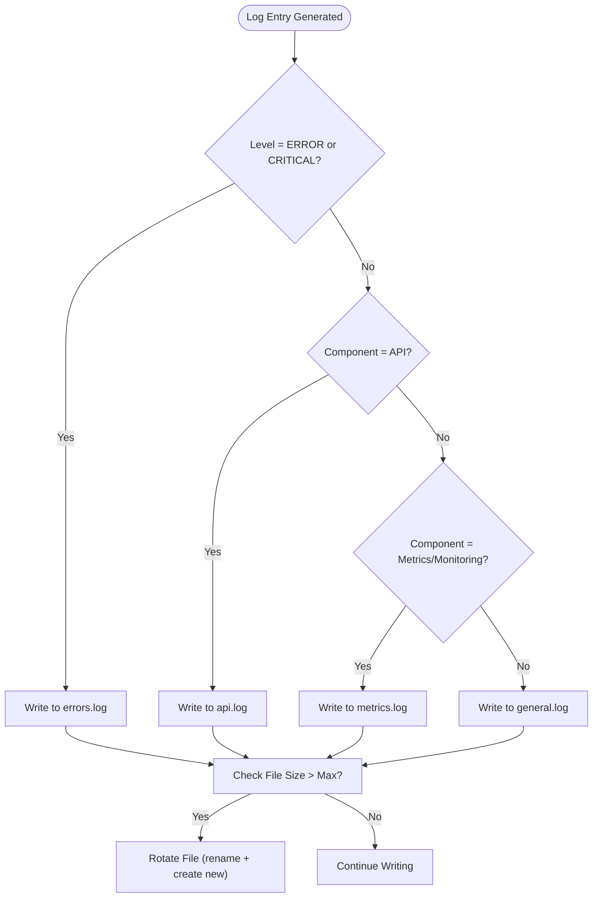
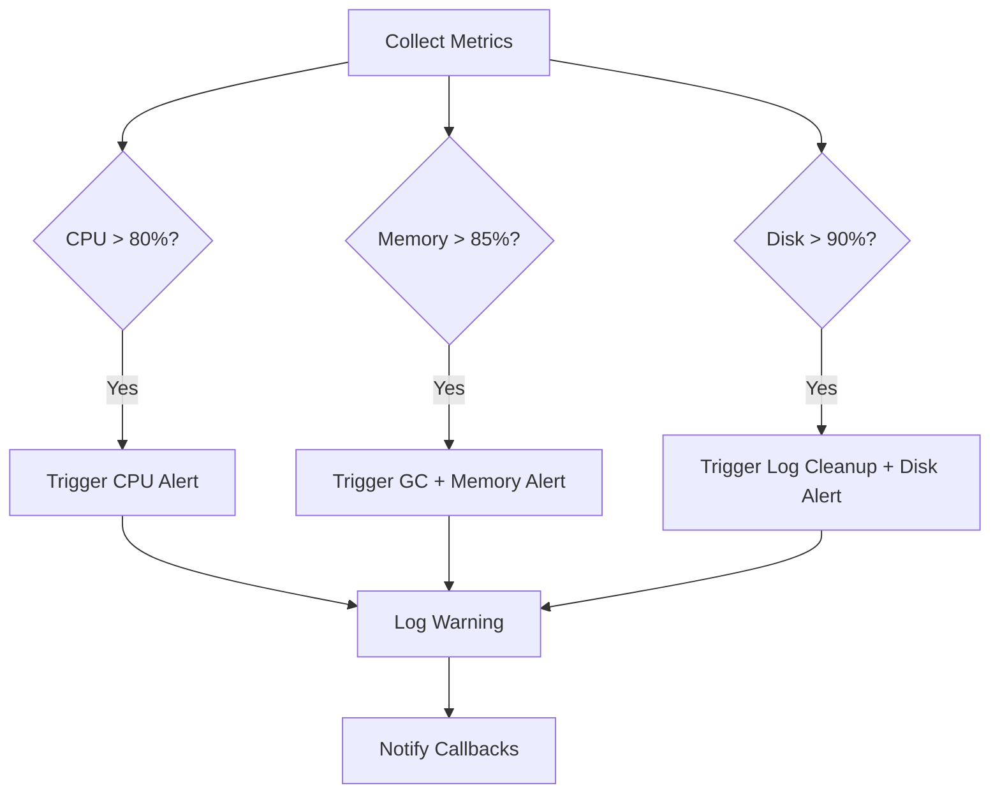

# Operations and Maintenance

<cite>
**Referenced Files in This Document **   
- [log_rotation.sh](file://scripts/log_rotation.sh)
- [cleanup_logs.py](file://cleanup_logs.py)
- [log_config.py](file://breakout_bot/utils/log_config.py)
- [resource_monitor.py](file://breakout_bot/utils/resource_monitor.py)
- [logs.py](file://breakout_bot/api/routers/logs.py)
</cite>

## Table of Contents
1. [Log Lifecycle Management](#log-lifecycle-management)  
2. [Routine Maintenance Scripts](#routine-maintenance-scripts)  
3. [Monitoring Routines](#monitoring-routines)  
4. [Automation with Cron Jobs](#automation-with-cron-jobs)  
5. [Disaster Recovery and Audit Logging](#disaster-recovery-and-audit-logging)

## Log Lifecycle Management

The Breakout Bot Trading System implements a robust log lifecycle management strategy to prevent disk exhaustion and ensure efficient log retention. The system uses both automated rotation via `RotatingFileHandler` and external cleanup scripts.

### Rotation Frequency and Strategy

Log rotation is configured using Python’s `RotatingFileHandler`, which rotates logs based on file size rather than time intervals. Each log file is rotated when it reaches a maximum size of 5–10 MB, depending on the environment (production vs. development). Up to five backup files are retained per log type.

Multiple log files are maintained for different purposes:
- `api.log`: API request/response logging
- `metrics.log`: Performance and monitoring metrics
- `errors.log`: Error-level messages only
- `general.log`: General application events

This segmentation allows targeted analysis and reduces noise in critical logs.



**Diagram sources**
- [log_config.py](file://breakout_bot/utils/log_config.py#L44-L80)

### Compression and Retention Period

While the core logging configuration does not compress rotated logs by default, the `cleanup_logs.py` script supports deletion of old files based on age. By default, all log files older than **7 days** are deleted during cleanup operations.

Compression can be added externally via cron-integrated tools like `gzip` if long-term archival is required, though current design favors short-term retention for performance and security.

### Archival Mechanism

There is no automatic archival mechanism within the application. However, operational procedures include manual or scripted tarball creation for backups before deployments or incident investigations:

```bash
tar -czf logs_archive_$(date +%Y%m%d_%H%M%S).tar.gz logs/
```

Archived logs are stored off-instance and encrypted at rest where applicable.

**Section sources**
- [log_config.py](file://breakout_bot/utils/log_config.py#L1-L191)
- [log_rotation.sh](file://scripts/log_rotation.sh#L1-L34)

## Routine Maintenance Scripts

Several maintenance scripts are provided to automate cleanup and optimization tasks.

### Log Purging with cleanup_logs.py

The `cleanup_logs.py` script provides CLI-driven control over log lifecycle operations:

- `--cleanup`: Deletes log files older than specified days (`--days`, default: 7)
- `--stats`: Displays current log directory statistics (total size, file count)
- `--setup`: Reinitializes logging configuration

It leverages the `cleanup_old_logs()` function from `log_config.py`, which scans the log directory and removes any `.log*` files whose last modification time exceeds the retention threshold.

```mermaid
flowchart LR
A[Start cleanup_logs.py] --> B{Flag Provided?}
B --> |--cleanup| C[Call cleanup_old_logs()]
B --> |--stats| D[Call get_log_stats()]
B --> |--setup| E[Call setup_logging()]
C --> F[Delete Files Older Than N Days]
D --> G[Display Total Size & Count]
E --> H[Reconfigure Handlers]
```

**Diagram sources**
- [cleanup_logs.py](file://cleanup_logs.py#L1-L54)
- [log_config.py](file://breakout_bot/utils/log_config.py#L109-L132)

### Temporary File and Report Pruning

Although dedicated scripts for temporary file removal are not present, the system automatically manages transient data through:
- In-memory caching with TTL-based eviction
- Regular clearing of diagnostic reports in `/reports`
- Use of `deploy.sh` to back up and clean logs/data directories during updates

Backtest results in `backtest_results/` should be manually archived or removed periodically to avoid bloat.

### Database Optimization

The system currently uses file-based storage (e.g., JSON, flat files), so traditional database optimization (indexing, vacuuming) is not applicable. Future versions may integrate SQLite or PostgreSQL, enabling periodic `VACUUM` and index rebuilds.

For now, optimization focuses on minimizing write frequency and batching analytics writes.

**Section sources**
- [cleanup_logs.py](file://cleanup_logs.py#L1-L54)
- [deploy.sh](file://deploy.sh#L1-L51)
- [backtest_validation.py](file://backtest_validation.py#L1-L260)

## Monitoring Routines

System health is continuously monitored using built-in resource tracking and exposed via API endpoints.

### Disk Space, Memory, and CPU Monitoring

The `ResourceMonitor` class in `resource_monitor.py` collects real-time metrics every 5 seconds:
- CPU usage (%)
- Memory usage (% and MB used)
- Disk usage (% and free GB)
- Active threads and open file descriptors

Thresholds are defined in `ResourceLimits`:
- **Critical**: CPU > 80%, Memory > 85%, Disk > 90%
- **Warning**: CPU > 70%, Memory > 75%, Disk > 80%

When thresholds are exceeded, optimization actions are triggered, including garbage collection, cache clearing, or log cleanup.



**Diagram sources**
- [resource_monitor.py](file://breakout_bot/utils/resource_monitor.py#L1-L487)

### Health Status API Endpoints

The following endpoints provide access to monitoring data:
- `GET /api/health`: Overall system status
- `GET /api/metrics/health`: Resource utilization details
- `GET /api/monitoring`: Real-time trading metrics
- `GET /api/logs`: Retrieve structured log entries

These are consumed by Grafana/Prometheus for visualization and alerting.

**Section sources**
- [resource_monitor.py](file://breakout_bot/utils/resource_monitor.py#L432-L485)
- [monitoring.py](file://breakout_bot/api/routers/monitoring.py#L1-L425)
- [logs.py](file://breakout_bot/api/routers/logs.py#L1-L122)

## Automation with Cron Jobs

Maintenance tasks are designed for automation via cron.

### Example Cron Configuration

```bash
# Rotate logs daily at 2:00 AM
0 2 * * * /path/to/experiments/scripts/log_rotation.sh

# Clean up stale logs (alternative direct call)
0 3 * * * /usr/bin/python3 /path/to/experiments/cleanup_logs.py --cleanup --days 7 --log-dir /path/to/experiments/logs

# Restart service if unresponsive (example)
0 */6 * * * /path/to/experiments/status.sh || /path/to/experiments/start.sh restart

# Weekly backup (run Sunday at 4:00 AM)
0 4 * * 0 /usr/bin/tar -czf /backups/bot_backup_$(date +\%Y\%m\%d).tar.gz /path/to/experiments/logs /path/to/experiments/data
```

The `log_rotation.sh` script first checks if total log size exceeds **50 MB**, then triggers cleanup if needed. It also outputs post-cleanup statistics for auditing.

### Alerting Triggers

Alerts are generated internally when:
- Resource limits are breached
- Critical errors occur (e.g., exchange disconnection)
- Health check fails

These are logged and can be integrated with external services via webhook callbacks registered in `optimization_callbacks`.

Currently, alerts are rate-limited to prevent flooding (minimum 5-minute interval between identical alerts).

**Section sources**
- [log_rotation.sh](file://scripts/log_rotation.sh#L1-L34)
- [resource_monitor.py](file://breakout_bot/utils/resource_monitor.py#L239-L303)

## Disaster Recovery and Audit Logging

### Disaster Recovery Drills

While no formal disaster recovery drill script exists, the deployment process includes backup creation:
- `deploy.sh` automatically archives `data/` and `logs/` before updates
- Manual restoration involves extracting the backup tarball

Regular testing of restore procedures is recommended, especially before major upgrades.

### Backup Verification Process

After creating a backup, verify integrity:
```bash
tar -tzf backup_*.tar.gz | head -20  # List contents
du -sh backup_*.tar.gz               # Confirm size
```

Ensure critical files like `.env`, `data/`, and `logs/` are included.

### Audit Logging Practices

Audit logs are maintained through:
- Structured logging with component, level, and timestamp
- Error categorization by severity and operation
- Accessible via `GET /api/logs` with filtering by level/component
- Retained for 7 days before rotation and deletion

Security-sensitive operations (e.g., position execution, config changes) are logged at `INFO` or `WARNING` level with full context.

All logs are written in UTC and follow ISO 8601 formatting for consistency.

**Section sources**
- [logs.py](file://breakout_bot/api/routers/logs.py#L1-L122)
- [enhanced_logger.py](file://breakout_bot/utils/enhanced_logger.py#L1-L265)
- [deploy.sh](file://deploy.sh#L1-L51)