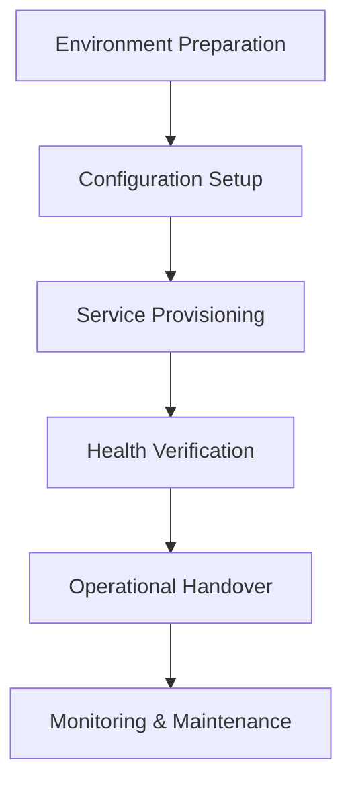
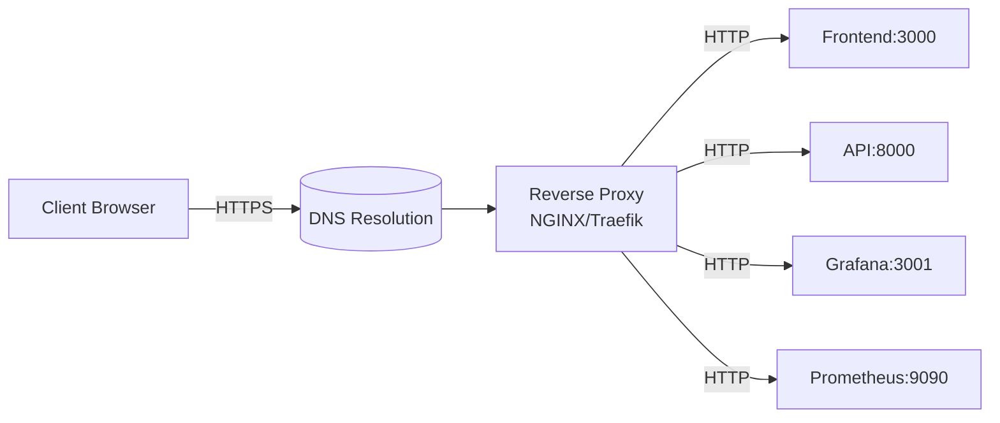
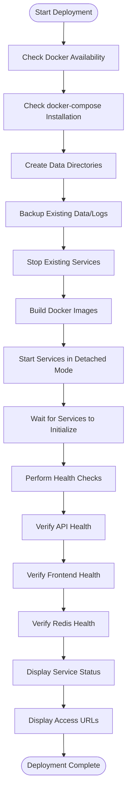
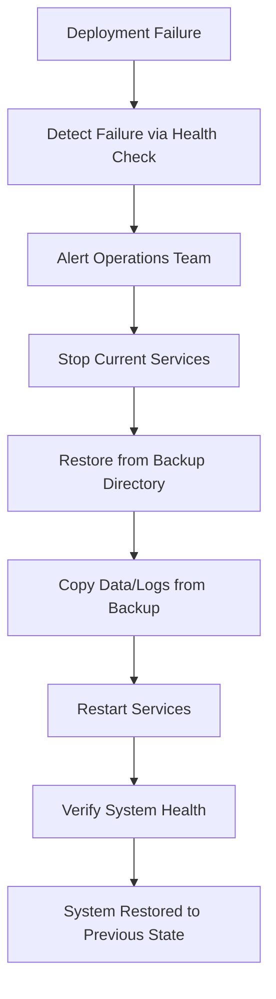
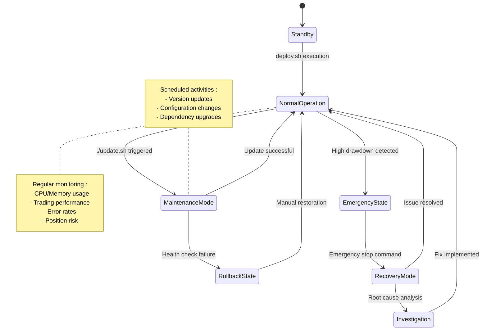
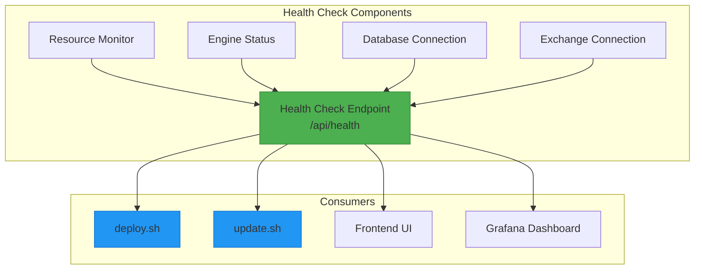

# Production Deployment

<cite>
**Referenced Files in This Document**   
- [PRODUCTION_DEPLOYMENT.md](file://PRODUCTION_DEPLOYMENT.md)
- [deploy.sh](file://deploy.sh)
- [update.sh](file://update.sh)
- [docker-compose.yml](file://docker-compose.yml)
- [.env.example](file://.env.example)
- [start.sh](file://start.sh)
- [breakout_bot/api/main.py](file://breakout_bot/api/main.py)
- [frontend/src/api/endpoints.ts](file://frontend/src/api/endpoints.ts)
</cite>

## Table of Contents
1. [Introduction](#introduction)
2. [Deployment Lifecycle](#deployment-lifecycle)
3. [Infrastructure Provisioning](#infrastructure-provisioning)
4. [DNS and TLS Configuration](#dns-and-tls-configuration)
5. [deploy.sh: System Initialization](#deploysh-system-initialization)
6. [update.sh: Zero-Downtime Upgrades](#updatesh-zero-downtime-upgrades)
7. [Rollback Procedures](#rollback-procedures)
8. [CI/CD Integration](#cicd-integration)
9. [Operational Runbooks](#operational-runbooks)
10. [Monitoring and Verification](#monitoring-and-verification)

## Introduction

The Breakout Bot Trading System utilizes a containerized deployment workflow designed for production environments. The system architecture combines Docker containers with automated deployment scripts to ensure reliable, repeatable deployments. This documentation details the complete production deployment workflow as defined in PRODUCTION_DEPLOYMENT.md and implemented through deploy.sh and update.sh scripts. The system comprises multiple services including the trading engine API, React frontend, Redis caching, Prometheus monitoring, and Grafana visualization, all orchestrated through Docker Compose.

**Section sources**
- [PRODUCTION_DEPLOYMENT.md](file://PRODUCTION_DEPLOYMENT.md#L1-L248)

## Deployment Lifecycle

The deployment lifecycle consists of environment preparation, service provisioning, health verification, and operational handover. The process begins with infrastructure setup, followed by configuration of environment variables, and culminates in service initialization and validation. Each deployment creates automated backups of existing data and logs before proceeding with new service instantiation. The lifecycle ensures that trading data, configuration files, and performance reports are preserved across deployments while allowing for seamless version upgrades and configuration changes.

**Diagram sources**
- [PRODUCTION_DEPLOYMENT.md](file://PRODUCTION_DEPLOYMENT.md#L1-L248)
- [deploy.sh](file://deploy.sh#L1-L111)

## Infrastructure Provisioning

Infrastructure provisioning is managed through docker-compose.yml, which defines all services required for the trading system. The configuration specifies build contexts, port mappings, environment variables, volume mounts, and network settings for each component. Key services include breakout-bot-api (FastAPI backend), breakout-bot-frontend (React application), Redis (caching), Prometheus (metrics collection), and Grafana (visualization). Persistent data storage is ensured through volume mappings for data, logs, and reports directories. The network configuration establishes a dedicated bridge network for secure inter-service communication.

**Section sources**
- [docker-compose.yml](file://docker-compose.yml#L1-L94)

## DNS and TLS Configuration

While the current configuration operates on localhost with HTTP, production deployment requires proper DNS and TLS termination. The system should be deployed behind a reverse proxy (such as NGINX) that handles SSL/TLS termination and domain routing. External domains should point to the server's IP address with appropriate A records, and SSL certificates should be provisioned using Let's Encrypt or similar certificate authorities. The reverse proxy would forward requests to the appropriate internal services based on path or subdomain, ensuring secure encrypted connections between clients and the trading system.

**Diagram sources**
- [PRODUCTION_DEPLOYMENT.md](file://PRODUCTION_DEPLOYMENT.md#L1-L248)
- [docker-compose.yml](file://docker-compose.yml#L1-L94)

## deploy.sh: System Initialization

The deploy.sh script orchestrates the complete system initialization process. It performs comprehensive environment checks for Docker and docker-compose availability before proceeding with deployment. The script creates necessary directories for data persistence and establishes proper file permissions. A critical feature is the automated backup mechanism that preserves existing data and logs before service recreation. The deployment sequence involves tearing down any existing containers, building fresh images without cache, and launching all services in detached mode. Post-deployment, the script conducts health checks against the API, frontend, and Redis services to verify operational status before presenting access URLs and next steps to the user.

**Diagram sources**
- [deploy.sh](file://deploy.sh#L1-L111)
- [docker-compose.yml](file://docker-compose.yml#L1-L94)

**Section sources**
- [deploy.sh](file://deploy.sh#L1-L111)
- [PRODUCTION_DEPLOYMENT.md](file://PRODUCTION_DEPLOYMENT.md#L1-L248)

## update.sh: Zero-Downtime Upgrades

The update.sh script implements a controlled upgrade process designed to minimize service disruption. When executed, it first assesses the current deployment state and initiates a fresh deployment if no services are running. The script creates timestamped backups of data and logs before proceeding with updates. If the system uses Git version control, it pulls the latest changes from the main branch. The update process gracefully stops services with an extended timeout to allow for proper cleanup, rebuilds Docker images to incorporate any changes, and restarts the services. After a brief waiting period, health checks validate the updated system's functionality, ensuring a successful transition to the new version.

**Section sources**
- [update.sh](file://update.sh#L1-L68)

## Rollback Procedures

Rollback procedures are integrated into the deployment workflow through comprehensive backup mechanisms. Both deploy.sh and update.sh automatically create timestamped backups of the data and logs directories before making changes to the system. In the event of a failed deployment or update, administrators can manually restore from these backups by stopping the services and copying the previous data state back to the appropriate directories. The update.sh script includes a basic rollback safety measure that detects API health check failures and alerts the user to potential issues, though full automated rollback functionality would require additional implementation.

**Diagram sources**
- [deploy.sh](file://deploy.sh#L1-L111)
- [update.sh](file://update.sh#L1-L68)

## CI/CD Integration

The current deployment workflow provides a solid foundation for CI/CD integration. The shell scripts (deploy.sh and update.sh) can be incorporated into continuous integration pipelines that trigger on code commits or pull request merges. Pre-deployment testing gates could include automated unit tests, integration tests, and security scans. Approval workflows could be implemented through pull request reviews and manual approval steps before production deployment. The existing health check endpoints provide natural verification points for pipeline success criteria. Future enhancements could include automated version tagging, canary deployments, and blue-green deployment patterns to further enhance deployment reliability.

**Section sources**
- [deploy.sh](file://deploy.sh#L1-L111)
- [update.sh](file://update.sh#L1-L68)
- [PRODUCTION_DEPLOYMENT.md](file://PRODUCTION_DEPLOYMENT.md#L1-L248)

## Operational Runbooks

Operational runbooks are supported through the combination of automated scripts and monitoring tools. Scheduled maintenance procedures are facilitated by the update.sh script for version upgrades and the built-in backup functionality for data preservation. Emergency interventions are supported by direct API endpoints for engine control (start, stop, pause, resume, emergency_stop) and comprehensive monitoring through Grafana dashboards. The system provides multiple access points for intervention, including shell scripts, REST API endpoints, and direct Docker commands. Regular maintenance tasks include log rotation, performance monitoring, and configuration reviews.

**Diagram sources**
- [deploy.sh](file://deploy.sh#L1-L111)
- [update.sh](file://update.sh#L1-L68)
- [start.sh](file://start.sh#L1-L342)

## Monitoring and Verification

Monitoring and verification are integral to the deployment workflow, with multiple layers of health checks and status reporting. The system exposes a comprehensive health check endpoint (/api/health) that reports on engine status, resource utilization, and service connectivity. This endpoint returns detailed information about CPU usage, memory consumption, disk usage, active threads, and network connections. The deployment scripts leverage this endpoint to verify service health post-deployment. Additional monitoring is provided through Prometheus metrics collection and Grafana dashboards, offering real-time insights into system performance and trading activity. The frontend also consumes health information through the systemApi.healthCheck endpoint for display in the user interface.

**Diagram sources**
- [breakout_bot/api/main.py](file://breakout_bot/api/main.py#L105-L165)
- [frontend/src/api/endpoints.ts](file://frontend/src/api/endpoints.ts#L122-L151)
- [deploy.sh](file://deploy.sh#L1-L111)

**Section sources**
- [breakout_bot/api/main.py](file://breakout_bot/api/main.py#L105-L165)
- [API_DOCUMENTATION.md](file://API_DOCUMENTATION.md#L410-L432)
- [PRODUCTION_DEPLOYMENT.md](file://PRODUCTION_DEPLOYMENT.md#L1-L248)