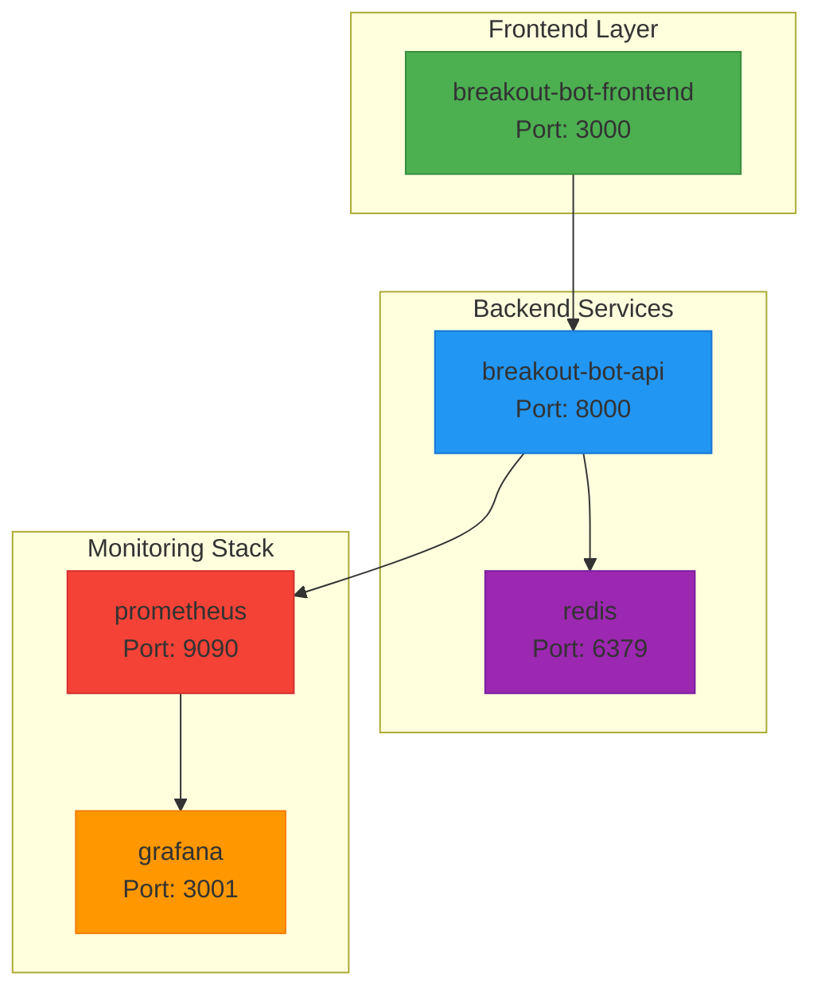
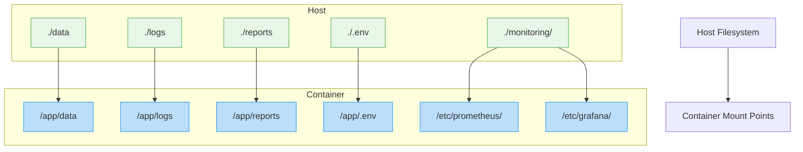
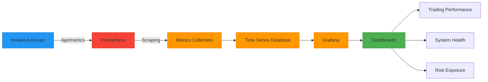

# Service Orchestration

<cite>
**Referenced Files in This Document**   
- [docker-compose.yml](file://docker-compose.yml)
- [Dockerfile](file://Dockerfile)
- [frontend/Dockerfile](file://frontend/Dockerfile)
- [monitoring/prometheus.yml](file://monitoring/prometheus.yml)
- [breakout_bot/config/settings.py](file://breakout_bot/config/settings.py)
- [PRODUCTION_DEPLOYMENT.md](file://PRODUCTION_DEPLOYMENT.md)
- [deploy.sh](file://deploy.sh)
</cite>

## Table of Contents
1. [Service Composition](#service-composition)
2. [Network Configuration](#network-configuration)
3. [Volume Mounts and Persistent Storage](#volume-mounts-and-persistent-storage)
4. [Resource Management and Deployment Constraints](#resource-management-and-deployment-constraints)
5. [Dependency Ordering and Startup Synchronization](#dependency-ordering-and-startup-synchronization)
6. [Environment Variables and Secret Management](#environment-variables-and-secret-management)
7. [Port Exposure Strategy](#port-exposure-strategy)
8. [Monitoring Stack Integration](#monitoring-stack-integration)
9. [Use Cases by Deployment Profile](#use-cases-by-deployment-profile)
10. [Scaling Instructions for High Load](#scaling-instructions-for-high-load)
11. [Debugging Techniques and Log Aggregation](#debugging-techniques-and-log-aggregation)

## Service Composition

The service orchestration framework defined in `docker-compose.yml` orchestrates a multi-container cryptocurrency trading system composed of five primary services: the backend API, frontend UI, Redis message broker, Prometheus monitoring server, and Grafana visualization dashboard.

The **breakout-bot-api** service serves as the core application engine, built from the root Dockerfile and exposing port 8000. It hosts RESTful endpoints and WebSocket connections for real-time trading operations, state management, performance analytics, and configuration control. The backend is implemented in Python using FastAPI and interacts with exchange APIs, manages trading logic through a finite state machine, and maintains persistent data via SQLite.

The **breakout-bot-frontend** service provides a React-based user interface accessible on port 3000. Built using a multi-stage Docker process, it compiles TypeScript code into static assets served via Nginx. The frontend communicates with the backend API to display engine status, trading positions, scanner results, performance metrics, logs, and preset configurations.

Redis acts as an in-memory message broker supporting caching and potential pub/sub patterns within the architecture. Although not currently used for advanced messaging features based on available configuration, its presence indicates readiness for high-performance session storage or distributed command queuing.

Prometheus and Grafana form a comprehensive observability stack. Prometheus scrapes metrics from the API every 5 seconds at `/api/metrics`, while Grafana visualizes these metrics through preconfigured dashboards. This integration enables real-time monitoring of trading performance, system health, error rates, and resource utilization.



**Diagram sources**
- [docker-compose.yml](file://docker-compose.yml#L1-L94)
- [frontend/Dockerfile](file://frontend/Dockerfile#L1-L33)
- [Dockerfile](file://Dockerfile#L1-L51)

**Section sources**
- [docker-compose.yml](file://docker-compose.yml#L1-L94)
- [Dockerfile](file://Dockerfile#L1-L51)
- [frontend/Dockerfile](file://frontend/Dockerfile#L1-L33)

## Network Configuration

All services are connected through a custom Docker bridge network named `breakout-network`, explicitly defined in the compose file with the default bridge driver. This isolated internal network ensures secure inter-service communication without exposing ports unnecessarily between containers.

Services communicate using their container names as hostnames (e.g., `breakout-bot-api:8000`) rather than IP addresses, leveraging Docker's built-in DNS resolution. For example, Prometheus scrapes metrics from `breakout-bot-api:8000` directly over this internal network, eliminating the need for external exposure of the metrics endpoint.

External access is selectively enabled via port mappings:
- Port 8000: breakout-bot-api (internal/external access)
- Port 3000: breakout-bot-frontend (user-facing)
- Port 6379: Redis (development/debugging only)
- Port 9090: Prometheus web UI
- Port 3001: Grafana interface

This configuration balances accessibility with security, allowing developers and operators to interact with monitoring tools while keeping backend services contained within the trusted network boundary.

**Section sources**
- [docker-compose.yml](file://docker-compose.yml#L87-L94)

## Volume Mounts and Persistent Storage

Persistent storage is managed through both bind mounts and named volumes to ensure data durability across container restarts and deployments.

Three types of bind mounts are configured for the API service:
- `./data:/app/data`: Stores SQLite database files including trading history, session records, and configuration snapshots.
- `./logs:/app/logs`: Persists structured JSON log files generated by the enhanced logging system, enabling post-mortem analysis and audit trails.
- `./reports:/app/reports`: Saves diagnostic summaries, backtesting reports, and performance evaluations.

Additionally, sensitive environment variables are mounted read-only from `.env` at runtime, preventing accidental exposure or modification.

Named volumes provide managed persistence for third-party services:
- `redis-data`: Maintains Redis key-value store across restarts.
- `prometheus-data`: Stores time-series metric data collected by Prometheus.
- `grafana-data`: Preserves Grafana dashboards, user preferences, and plugin configurations.

These volume strategies support reliable operation, facilitate debugging, and enable seamless upgrades without data loss.



**Diagram sources**
- [docker-compose.yml](file://docker-compose.yml#L10-L24)

**Section sources**
- [docker-compose.yml](file://docker-compose.yml#L10-L24)
- [PRODUCTION_DEPLOYMENT.md](file://PRODUCTION_DEPLOYMENT.md#L100-L120)

## Resource Management and Deployment Constraints

While explicit CPU and memory limits are not defined in the current `docker-compose.yml`, the system includes mechanisms for resource monitoring and optimization. The absence of hard limits allows flexibility during development but requires manual configuration for production stability under load.

The API container uses a slim Python 3.12 base image optimized for minimal footprint. System-level resource constraints are enforced through application logic in `performance_monitor.py` and `resource_monitor.py`, which track CPU usage, memory consumption, disk utilization, thread count, and open file descriptors.

Threshold-based alerts trigger optimization actions when:
- Memory exceeds warning or max limits
- Disk usage surpasses thresholds
- Thread count becomes excessive
- CPU utilization remains elevated

Operators can manually impose resource limits by adding `deploy.resources` directives in future versions:

```yaml
# Example addition for production
resources:
  limits:
    cpus: '2.0'
    memory: 4G
  reservations:
    cpus: '0.5'
    memory: 512M
```

Restart policies are uniformly set to `unless-stopped`, ensuring automatic recovery from crashes while respecting intentional shutdowns.

**Section sources**
- [docker-compose.yml](file://docker-compose.yml#L1-L94)
- [breakout_bot/utils/performance_monitor.py](file://breakout_bot/utils/performance_monitor.py#L364-L391)
- [breakout_bot/utils/resource_monitor.py](file://breakout_bot/utils/resource_monitor.py#L239-L272)

## Dependency Ordering and Startup Synchronization

Service startup order is explicitly controlled using the `depends_on` directive, ensuring that the frontend waits for the backend API to be available before starting.

In `docker-compose.yml`, `breakout-bot-frontend` depends on `breakout-bot-api`, enforcing sequential initialization where the UI does not attempt to connect prematurely. However, this dependency only checks container startup, not application readiness.

To address this gap, the API container implements a robust health check:

```yaml
healthcheck:
  test: ["CMD", "python", "-c", "import requests; requests.get('http://localhost:8000/api/health', timeout=5)"]
  interval: 30s
  timeout: 10s
  retries: 3
  start_period: 40s
```

This script verifies actual HTTP reachability of the `/api/health` endpoint, giving the FastAPI application sufficient time (40-second start period) to initialize databases, load presets, and establish exchange connections before being considered healthy.

Grafana and Prometheus also benefit from delayed startup due to network dependencies, though they lack formal health checks. Their provisioning relies on mounted configuration files that are immediately available at launch.

**Section sources**
- [docker-compose.yml](file://docker-compose.yml#L36-L39)
- [breakout_bot/api/main.py](file://breakout_bot/api/main.py#L140-L165)

## Environment Variables and Secret Management

Configuration is primarily driven by environment variables injected into containers at runtime. Key settings include:

- `DATABASE_URL`: Specifies the SQLite path (`sqlite:///app/data/breakout_bot.db`)
- `LOG_LEVEL`: Sets logging verbosity (default: INFO)
- `TRADING_MODE`: Determines execution mode (paper vs live trading)
- `VITE_API_URL`: Frontend configuration pointing to backend endpoint

Secrets such as API keys and credentials are managed externally via the `.env` file mounted read-only into the API container. This approach separates sensitive data from version control and supports different credential sets per environment.

Additional configuration parameters are programmatically derived from environment variables in `SystemConfig.from_env()` within `settings.py`. These include paper trading balance, slippage tolerance, debug flags, and exchange selection.

For enhanced security in production, secrets could be further isolated using Docker secrets or integrated with external vault systems, though this capability is not yet implemented in the current deployment scripts.

**Section sources**
- [docker-compose.yml](file://docker-compose.yml#L15-L19)
- [breakout_bot/config/settings.py](file://breakout_bot/config/settings.py#L265-L294)

## Port Exposure Strategy

Ports are exposed selectively to balance usability, monitoring access, and security:

| Service | Internal Port | External Port | Purpose |
|--------|---------------|----------------|-------|
| breakout-bot-api | 8000 | 8000 | REST API & WebSocket |
| breakout-bot-frontend | 3000 | 3000 | User Interface |
| redis | 6379 | 6379 | Development/debug access |
| prometheus | 9090 | 9090 | Metrics dashboard |
| grafana | 3000 | 3001 | Visualization UI |

Exposing Redis externally facilitates debugging but should be disabled in production environments. Similarly, Prometheus and Grafana interfaces are accessible for operational oversight, with Grafana protected by a default admin password set via `GF_SECURITY_ADMIN_PASSWORD`.

All services remain confined to localhost by default, requiring reverse proxy configuration for remote access. This minimizes attack surface while enabling local development and monitoring workflows.

**Section sources**
- [docker-compose.yml](file://docker-compose.yml#L11-L13)

## Monitoring Stack Integration

The monitoring subsystem integrates Prometheus and Grafana to provide full observability into system behavior and trading performance.

Prometheus is configured via `monitoring/prometheus.yml` to scrape multiple targets:
- `breakout-bot-api` every 5 seconds at `/api/metrics`
- Local Prometheus instance for self-monitoring
- Node exporter (planned, currently commented)

Alerting is configured to send notifications to Alertmanager (not currently deployed), indicating plans for proactive incident response.

Grafana automatically provisions datasources and dashboards from mounted directories:
- Datasource configuration points to Prometheus
- Dashboards visualize trading P&L, position risk, R-multiples, drawdowns, and system health

Key metrics exposed by the API include:
- Engine state transitions
- Trading cycle duration
- Position sizing accuracy
- Signal generation frequency
- Error counts and recovery actions

These metrics empower operators to detect anomalies, optimize strategy parameters, and validate system reliability.



**Diagram sources**
- [monitoring/prometheus.yml](file://monitoring/prometheus.yml#L1-L28)
- [docker-compose.yml](file://docker-compose.yml#L53-L72)

**Section sources**
- [monitoring/prometheus.yml](file://monitoring/prometheus.yml#L1-L28)
- [PRODUCTION_DEPLOYMENT.md](file://PRODUCTION_DEPLOYMENT.md#L78-L100)

## Use Cases by Deployment Profile

### Development Profile
Designed for local testing and feature development:
- All services run locally via `docker-compose up`
- Logs written to host filesystem for inspection
- Redis exposed for debugging
- Default credentials accepted
- Auto-reload not enabled but rapid rebuild supported

Developers use `start.sh` and `deploy.sh` scripts to manage lifecycle, backup data, and verify system integrity before committing changes.

### Staging Profile
Used for integration validation before production rollout:
- Same topology as production
- Paper trading mode enforced
- Automated backups enabled
- Resource monitoring active
- Manual approval required for deployment

Staging deployments use `./update.sh` or manual `docker-compose pull && up -d` sequences after verifying compatibility.

### Production Profile
Secured and hardened for live operation:
- Reverse proxy (Nginx/Traefik) added for SSL termination
- Redis port closed to external access
- Secrets stored in encrypted vault or Kubernetes secrets
- Regular automated backups scheduled
- Alert thresholds tuned for business impact

Production updates follow a strict procedure involving pre-backup, rolling restarts, and post-deployment verification using health checks and metric baselines.

**Section sources**
- [PRODUCTION_DEPLOYMENT.md](file://PRODUCTION_DEPLOYMENT.md#L1-L166)
- [deploy.sh](file://deploy.sh#L1-L51)

## Scaling Instructions for High Load

Currently, all services operate as single instances suitable for moderate workloads. To scale under high load:

1. **Horizontal Scaling**: Modify `docker-compose.yml` to add replica counts:
   ```yaml
   deploy:
     replicas: 3
   ```
   Requires external load balancer and shared database (e.g., PostgreSQL).

2. **Database Upgrade**: Replace SQLite with PostgreSQL or TimescaleDB for concurrent write support and better performance under heavy query loads.

3. **Redis Utilization**: Implement Redis for caching frequent queries (e.g., market data, signal states) and managing distributed locks.

4. **Worker Separation**: Split long-running tasks (backtesting, scanning) into background workers consuming from Redis queues.

5. **Resource Limits**: Enforce CPU and memory caps to prevent resource exhaustion:
   ```yaml
   resources:
     limits:
       memory: 4G
       cpus: 2.0
   ```

6. **Cluster Orchestration**: Migrate to Kubernetes for auto-scaling, pod affinity, and advanced scheduling.

Until these enhancements are implemented, performance scales vertically by increasing host resources and tuning application-level optimizations like log rotation and cache management.

**Section sources**
- [PRODUCTION_DEPLOYMENT.md](file://PRODUCTION_DEPLOYMENT.md#L150-L166)
- [scripts/log_rotation.sh](file://scripts/log_rotation.sh)

## Debugging Techniques and Log Aggregation

Effective troubleshooting combines container introspection with application-level diagnostics.

### Container Connectivity Issues
Verify network connectivity:
```bash
docker exec -it breakout-bot-frontend curl http://breakout-bot-api:8000/api/health
docker network inspect breakout-network
```

Check service status:
```bash
docker-compose ps
docker-compose logs --tail=50 breakout-bot-api
```

Restart problematic services:
```bash
docker-compose restart breakout-bot-api
```

### Log Aggregation Methods
Structured JSON logs are written to `./logs/` with timestamps, levels, components, and contextual data. Use `docker-compose logs -f` to stream combined output or filter by service.

Application logs include:
- State machine transitions
- Kill switch activations
- Command executions
- Error handling events
- Performance metrics

Log rotation is managed by `log_rotation.sh`, compressing old files to conserve space. Memory snapshots (e.g., `memory_snapshot_*.json`) provide detailed process-level insights during peak usage.

Centralized aggregation can be achieved by forwarding logs to ELK Stack or Loki, though this requires additional infrastructure beyond the current scope.

**Section sources**
- [PRODUCTION_DEPLOYMENT.md](file://PRODUCTION_DEPLOYMENT.md#L130-L150)
- [breakout_bot/api/routers/logs.py](file://breakout_bot/api/routers/logs.py#L57-L80)
- [scripts/log_rotation.sh](file://scripts/log_rotation.sh)