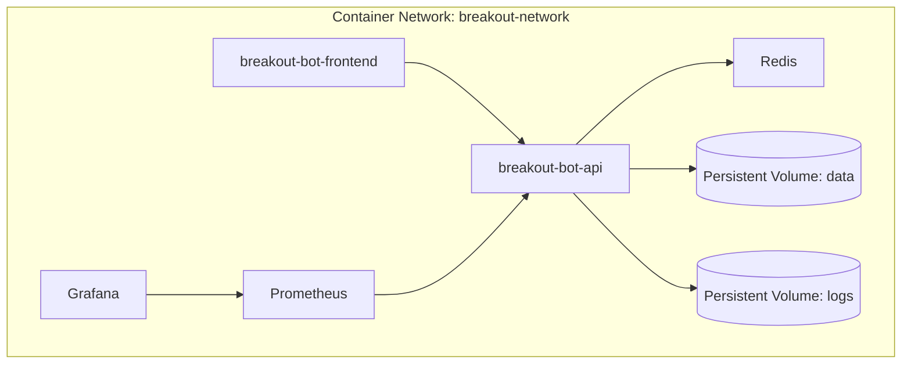

# Installation and Setup

<cite>
**Referenced Files in This Document**   
- [docker-compose.yml](file://docker-compose.yml)
- [start.sh](file://start.sh)
- [stop.sh](file://stop.sh)
- [status.sh](file://status.sh)
- [deploy.sh](file://deploy.sh)
- [update.sh](file://update.sh)
- [frontend/Dockerfile](file://frontend/Dockerfile)
</cite>

## Table of Contents
1. [Prerequisites](#prerequisites)
2. [Environment Configuration](#environment-configuration)
3. [Docker-Based Deployment](#docker-based-deployment)
4. [Local Development Setup](#local-development-setup)
5. [Service Management Scripts](#service-management-scripts)
6. [Database Initialization and Presets](#database-initialization-and-presets)
7. [System Verification](#system-verification)
8. [Troubleshooting Common Issues](#troubleshooting-common-issues)
9. [Security Best Practices](#security-best-practices)

## Prerequisites

Before installing the breakout_bot trading system, ensure your environment meets the following requirements:

- **Docker Engine 20.10+**: Required for containerized deployment. Install from [Docker's official site](https://docs.docker.com/get-docker/).
- **Docker Compose Plugin or Standalone Compose v2+**: Used to orchestrate multi-container services defined in `docker-compose.yml`.
- **Git (optional)**: For cloning the repository and pulling updates.
- **Python 3.9+ (for local development only)**: Needed if running outside Docker during development.
- **Node.js 16+ and npm (for frontend development)**: Required to run the frontend locally without containers.

Verify installation with:
```bash
docker --version
docker compose version  # or docker-compose --version
```

**Section sources**
- [docker-compose.yml](file://docker-compose.yml#L1-L5)
- [start.sh](file://start.sh#L38-L45)

## Environment Configuration

The system uses environment variables to configure runtime behavior. A `.env` file must be created at the project root to define sensitive and configurable parameters.

### Creating the .env File

Copy the example template (if available) or create a new `.env` file:
```bash
cp .env.example .env  # if template exists
# OR
touch .env
```

### Essential Environment Variables

| Variable | Description | Example |
|--------|-------------|---------|
| `DATABASE_URL` | Database connection string | `sqlite:///app/data/breakout_bot.db` |
| `LOG_LEVEL` | Logging verbosity level | `INFO`, `DEBUG`, `WARNING` |
| `TRADING_MODE` | Execution mode | `paper` (default), `live` |
| `BYBIT_API_KEY` | Bybit exchange API key | `your_api_key_here` |
| `BYBIT_API_SECRET` | Bybit exchange API secret | `your_api_secret_here` |

### Acquiring Bybit API Keys

1. Log into your [Bybit account](https://www.bybit.com/).
2. Navigate to **User Center > API Management**.
3. Click **Create API**.
4. Set permissions: Enable **Read Info**, **Order**, and **Wallet** as needed.
5. Restrict IP addresses for security.
6. Save the generated Key and Secret securely.

Store these in the `.env` file:
```
BYBIT_API_KEY=your_actual_key
BYBIT_API_SECRET=your_actual_secret
```

Never commit `.env` to version control. It is already mounted read-only in Docker via volume mapping in `docker-compose.yml`.

**Section sources**
- [docker-compose.yml](file://docker-compose.yml#L12-L18)
- [start.sh](file://start.sh#L10-L11)

## Docker-Based Deployment

For production and consistent environments, the system is designed to run using Docker containers orchestrated by Docker Compose.

### Building and Starting Services

Use the `deploy.sh` script to perform a full production-grade deployment:

```bash
./deploy.sh
```

This script performs the following steps:
1. Validates Docker and Docker Compose availability
2. Creates backups of existing `data/` and `logs/` directories
3. Ensures required directories exist (`data`, `logs`, `reports`, `pids`)
4. Sets secure permissions on data and config files
5. Shuts down any existing containers
6. Rebuilds all images with `--no-cache`
7. Starts services in detached mode
8. Performs health checks on API, frontend, and Redis
9. Outputs service status and access URLs

The `docker-compose.yml` defines five core services:
- `breakout-bot-api`: FastAPI backend serving trading logic
- `breakout-bot-frontend`: React UI interface
- `redis`: In-memory data store for caching and message brokering
- `prometheus`: Metrics collection and monitoring
- `grafana`: Visualization dashboard for performance analytics

Each service runs in an isolated container connected via a shared bridge network `breakout-network`.



**Diagram sources**
- [docker-compose.yml](file://docker-compose.yml#L1-L94)
- [frontend/Dockerfile](file://frontend/Dockerfile#L1-L33)

**Section sources**
- [docker-compose.yml](file://docker-compose.yml#L1-L94)
- [deploy.sh](file://deploy.sh#L1-L111)

## Local Development Setup

For developers who prefer non-containerized workflows, use the `start.sh` script to launch services directly on the host.

### Running Locally

Ensure Python and Node.js dependencies are installed:
```bash
pip install -r requirements.txt
cd frontend && npm install && cd ..
```

Start the system:
```bash
./start.sh
```

The script:
- Launches the FastAPI server on port 8000 using Uvicorn
- Starts the React frontend on port 5173 via `npm run dev`
- Automatically triggers the trading engine with the `breakout_v1` preset
- Monitors service health and logs interruptions

Ports used:
- API: `localhost:8000`
- Frontend: `localhost:5173`
- Default fallback ports in Docker: API `8000`, Frontend `3000`

### Graceful Shutdown

Press `Ctrl+C` in the terminal to trigger the interrupt handler, which calls `stop_all` to gracefully terminate both API and frontend processes.

**Section sources**
- [start.sh](file://start.sh#L1-L342)
- [status.sh](file://status.sh#L1-L225)

## Service Management Scripts

The system includes dedicated shell scripts for lifecycle management.

### start.sh

Starts all components with automatic port conflict resolution and health verification.

**Key Functions:**
- Checks for port conflicts on 8000 (API) and 5173 (frontend)
- Kills conflicting processes if found
- Spawns API and frontend in background with PID tracking
- Waits for services to become responsive
- Initiates trading engine via API call
- Displays real-time status and access URLs

[SPEC SYMBOL](file://start.sh#L1-L342)

### stop.sh

Stops all running services gracefully by reading stored PIDs and sending termination signals.

**Behavior:**
- Reads PIDs from `pids/api.pid` and `pids/frontend.pid`
- Sends SIGTERM to processes
- Falls back to force-kill (SIGKILL) if necessary
- Cleans up empty PID directory

[SPEC SYMBOL](file://stop.sh#L1-L108)

### status.sh

Provides a comprehensive system status report including:
- API health (`/api/health`)
- Trading engine state, preset, and mode
- Open positions count
- Recent log entries
- Access URLs

Supports verbose output with `-v` flag.

[SPEC SYMBOL](file://status.sh#L1-L225)

### deploy.sh

Orchestrates production deployment using Docker Compose.

**Workflow:**
1. Backs up current `data/` and `logs/`
2. Ensures directory structure
3. Applies secure permissions
4. Recreates containers with fresh builds
5. Runs post-deployment health checks
6. Exposes Grafana (port 3001) and Prometheus (port 9090)

[SPEC SYMBOL](file://deploy.sh#L1-L111)

### update.sh

Safely updates the system to the latest version.

**Process:**
- Backs up data/logs
- Pulls latest code (if in Git repo)
- Shuts down containers gracefully
- Rebuilds images
- Restarts services
- Rolls back on failure detection

[SPEC SYMBOL](file://update.sh#L1-L68)

**Section sources**
- [start.sh](file://start.sh#L1-L342)
- [stop.sh](file://stop.sh#L1-L108)
- [status.sh](file://status.sh#L1-L225)
- [deploy.sh](file://deploy.sh#L1-L111)
- [update.sh](file://update.sh#L1-L68)

## Database Initialization and Presets

On first run, the system initializes its SQLite database automatically. No manual schema creation is required.

### Preset Configuration

Trading strategies are defined in JSON presets located in `config/presets/`. Available examples include:
- `breakout_v1.json`: Core breakout strategy
- `top_gainers_momentum.json`: Momentum-based long strategy
- `scalping_high_freq.json`: High-frequency scalping logic
- `swing_trading_pro.json`: Medium-term swing approach

These presets define parameters such as:
- Entry/exit conditions
- Position sizing rules
- Risk limits
- Timeframe settings

To load a preset, send a POST request to `/api/engine/start` with the preset name, as done in `start.sh`.

The system reads these files at runtime and applies the configuration dynamically.

**Section sources**
- [start.sh](file://start.sh#L250-L255)
- [breakout_bot/config/presets](file://breakout_bot/config/presets)

## System Verification

After startup, verify system functionality through the following steps:

1. **Access the Frontend UI**: Open browser to `http://localhost:5173` (local) or `http://localhost:3000` (Docker).
2. **Check API Health**: Visit `http://localhost:8000/api/health` – should return `{"status": "healthy"}`.
3. **View API Documentation**: Navigate to `http://localhost:8000/docs` for interactive Swagger UI.
4. **Confirm Engine Status**: Use `./status.sh` or call `http://localhost:8000/api/engine/status` – expect state like `RUNNING`.
5. **Verify Monitoring Tools**:
   - Grafana: `http://localhost:3001` (login: admin/admin)
   - Prometheus: `http://localhost:9090`

Use `./status.sh` for a consolidated view of all component states.

**Section sources**
- [status.sh](file://status.sh#L1-L225)
- [start.sh](file://start.sh#L260-L280)

## Troubleshooting Common Issues

### Port Conflicts
If ports 8000 (API) or 5173/3000 (frontend) are in use:
- The `start.sh` script will attempt to kill conflicting processes.
- Manually identify and stop services: `lsof -ti:8000 | xargs kill -9`

### Permission Errors
Ensure scripts are executable:
```bash
chmod +x start.sh stop.sh status.sh deploy.sh update.sh
```

Fix volume permission issues:
```bash
sudo chown -R $USER:$USER data logs reports
```

### Container Startup Failures
Check logs:
```bash
docker-compose logs breakout-bot-api
docker-compose logs breakout-bot-frontend
```

Common causes:
- Missing `.env` file
- Invalid API keys causing authentication loops
- Network connectivity issues to Bybit

### Data Persistence Problems
Ensure Docker volumes (`redis-data`, `prometheus-data`, `grafana-data`) are correctly mounted. Avoid binding host paths unless intentional.

**Section sources**
- [start.sh](file://start.sh#L75-L85)
- [deploy.sh](file://deploy.sh#L1-L111)
- [docker-compose.yml](file://docker-compose.yml#L1-L94)

## Security Best Practices

- **Never expose ports publicly**: Keep API (8000), Grafana (3001), and Prometheus (9090) bound to localhost unless behind a firewall.
- **Use strong credentials**: Change default Grafana password immediately.
- **Restrict API key permissions**: On Bybit, limit keys to necessary scopes only.
- **Rotate secrets regularly**: Update API keys periodically and update `.env`.
- **Keep software updated**: Regularly pull updates and rebuild containers.
- **Backup critical data**: The `data/` directory contains the SQLite database; back it up routinely.
- **Audit logs**: Monitor `logs/api.log` and `logs/frontend.log` for suspicious activity.

Avoid committing `.env` to Git. Ensure it’s listed in `.gitignore`.

**Section sources**
- [.env](file://.env)
- [deploy.sh](file://deploy.sh#L1-L111)
- [docker-compose.yml](file://docker-compose.yml#L1-L94)