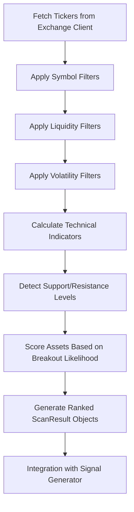
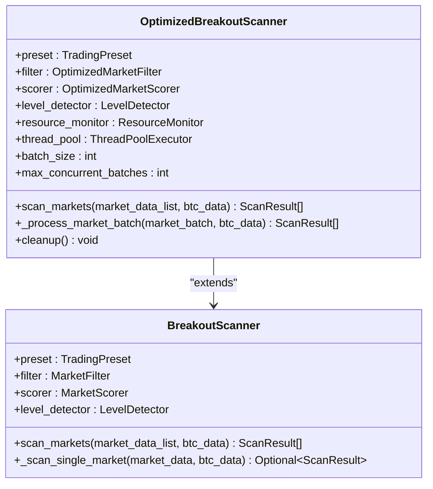
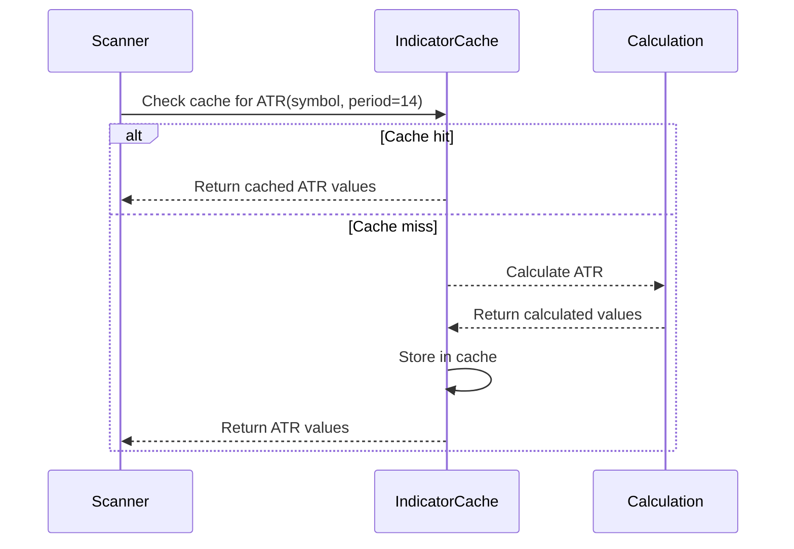
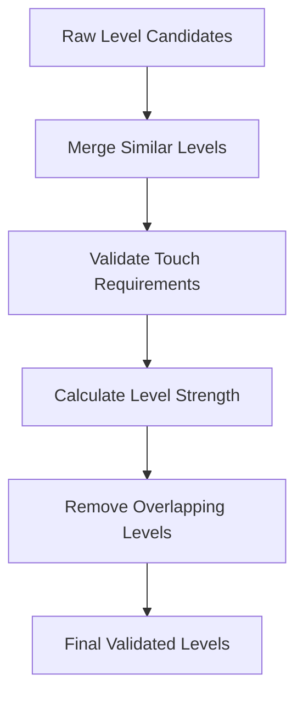
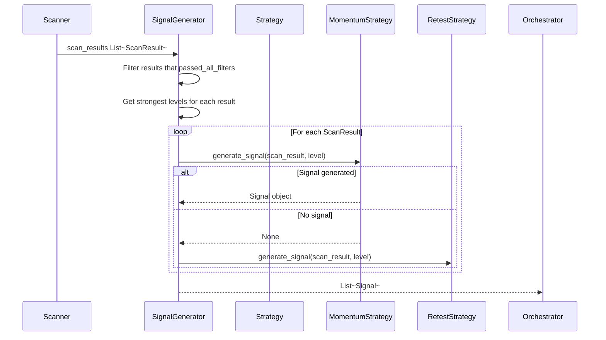

# Market Scanning

<cite>
**Referenced Files in This Document**   
- [market_scanner.py](file://breakout_bot/scanner/market_scanner.py)
- [optimized_scanner.py](file://breakout_bot/scanner/optimized_scanner.py)
- [technical.py](file://breakout_bot/indicators/technical.py)
- [levels.py](file://breakout_bot/indicators/levels.py)
- [signal_generator.py](file://breakout_bot/signals/signal_generator.py)
- [settings.py](file://breakout_bot/config/settings.py)
- [exchange_client.py](file://breakout_bot/exchange/exchange_client.py)
- [scanning_manager.py](file://breakout_bot/core/scanning_manager.py)
</cite>

## Table of Contents
1. [Introduction](#introduction)
2. [Scanning Pipeline Overview](#scanning-pipeline-overview)
3. [Market Scanner vs Optimized Scanner](#market-scanner-vs-optimized-scanner)
4. [Technical Indicator Calculations](#technical-indicator-calculations)
5. [Support and Resistance Level Detection](#support-and-resistance-level-detection)
6. [Candidate Selection and ScanResult Generation](#candidate-selection-and-scanresult-generation)
7. [Performance Optimization Techniques](#performance-optimization-techniques)
8. [Integration with Signal Generator](#integration-with-signal-generator)
9. [Configuration Options](#configuration-options)
10. [Troubleshooting Guide](#troubleshooting-guide)

## Introduction

The market scanning sub-component is responsible for identifying potential breakout candidates across cryptocurrency markets by systematically analyzing a large universe of assets. The scanner evaluates each asset through a multi-stage filtering and scoring pipeline that combines liquidity, volatility, volume, and correlation metrics to identify the most promising trading opportunities. This document details the architecture, implementation, and operational characteristics of the scanning system, including its integration with technical indicators, support/resistance analysis, and downstream signal generation components.

## Scanning Pipeline Overview

The market scanning process follows a structured pipeline that transforms raw market data into ranked candidate assets. The pipeline begins with data acquisition from the exchange client, proceeds through multiple filtering stages, applies technical indicator calculations, scores assets based on breakout likelihood, and produces prioritized ScanResult objects.



**Diagram sources**
- [exchange_client.py](file://breakout_bot/exchange/exchange_client.py#L500-L550)
- [market_scanner.py](file://breakout_bot/scanner/market_scanner.py#L200-L300)
- [technical.py](file://breakout_bot/indicators/technical.py#L100-L200)
- [levels.py](file://breakout_bot/indicators/levels.py#L50-L100)
- [signal_generator.py](file://breakout_bot/signals/signal_generator.py#L500-L550)

The scanning process starts with fetching ticker data from the exchange client, which provides essential market information including price, volume, open interest, and order book depth. This data is then processed through a series of filters that eliminate assets failing to meet minimum criteria for liquidity, volatility, and trading activity. The remaining candidates undergo technical analysis where indicators like ATR (Average True Range), Bollinger Bands, and volume surge ratios are calculated. Support and resistance levels are detected using multiple methods including Donchian channels, swing points, and volume analysis. Finally, assets are scored based on their breakout potential and returned as ScanResult objects ordered by score.

**Section sources**
- [market_scanner.py](file://breakout_bot/scanner/market_scanner.py#L200-L300)
- [exchange_client.py](file://breakout_bot/exchange/exchange_client.py#L500-L550)

## Market Scanner vs Optimized Scanner

The system implements two scanner variants: `market_scanner.py` as the primary scanner and `optimized_scanner.py` as a performance-enhanced version. While both scanners perform the same fundamental analysis, the optimized version incorporates several algorithmic improvements to handle large universes more efficiently.

The primary scanner (`BreakoutScanner`) processes markets sequentially with basic caching mechanisms. It applies filters and calculates scores for each market individually, making it suitable for smaller universes but potentially resource-intensive when scanning hundreds of assets simultaneously.

In contrast, the optimized scanner (`OptimizedBreakoutScanner`) introduces several performance enhancements:



**Diagram sources**
- [market_scanner.py](file://breakout_bot/scanner/market_scanner.py#L300-L400)
- [optimized_scanner.py](file://breakout_bot/scanner/optimized_scanner.py#L300-L400)

Key optimizations in the enhanced scanner include:
- **Batch processing**: Markets are processed in batches rather than individually, reducing overhead
- **Parallel execution**: Uses a thread pool executor to process multiple markets concurrently
- **Resource monitoring**: Dynamically adjusts batch size based on current memory usage
- **Memory-efficient data structures**: Uses float32 instead of float64 for numerical operations, reducing memory footprint by 50%
- **Enhanced caching**: Implements LRU (Least Recently Used) eviction with strict size limits to prevent memory bloat
- **Concurrent batch processing**: Limits the number of concurrent batches to balance CPU utilization and memory consumption

The optimized scanner also includes a cleanup method that explicitly shuts down the thread pool and forces garbage collection, ensuring resources are properly released after scanning operations.

**Section sources**
- [market_scanner.py](file://breakout_bot/scanner/market_scanner.py#L300-L400)
- [optimized_scanner.py](file://breakout_bot/scanner/optimized_scanner.py#L300-L400)

## Technical Indicator Calculations

Technical indicators are implemented in `technical.py` and play a crucial role in assessing an asset's volatility, trend strength, and momentum characteristics. These indicators inform both the filtering and scoring stages of the scanning process.

### Average True Range (ATR)
The ATR indicator measures market volatility by decomposing the entire range of an asset's price over a specified period. The implementation uses a recursive EMA (Exponential Moving Average) calculation for efficiency:

```python
def atr(candles: List[Candle], period: int = 14) -> np.ndarray
```

ATR values are used to calculate the ATR ratio (ATR/price), which helps identify assets with optimal volatility characteristics for breakout trading. The scanner favors assets with ATR ratios within a configurable range (typically 1.5%-3.5%), avoiding both extremely volatile and stagnant markets.

### Bollinger Bands and Width
Bollinger Bands consist of a middle band (SMA) and upper/lower bands (standard deviations away from the SMA). The implementation provides both standard and optimized versions:

```python
def bollinger_bands(values: Union[List[float], np.ndarray], period: int = 20, std_dev: float = 2.0)
def bollinger_bands_optimized(values: Union[List[float], np.ndarray], period: int = 20, std_dev: float = 2.0)
```

The Bollinger Band width percentage is a key filter criterion, with tighter bands indicating consolidation periods that may precede breakouts. The scanner typically requires BB width below a percentile threshold to focus on assets emerging from tight ranges.

### Volume Surge Ratio
This indicator compares current volume to historical median volume to detect unusual volume activity:

```python
def volume_surge_ratio(candles: List[Candle], lookback_periods: int = 20) -> np.ndarray
```

Volume surges are critical for confirming breakout validity, as genuine breakouts are typically accompanied by increased participation. The scanner evaluates both 1-hour and 5-minute volume surges, giving higher weight to sustained volume increases.

### Correlation Analysis
The system calculates rolling correlation between each asset and BTC to manage portfolio risk:

```python
def calculate_correlation(values1: np.ndarray, values2: np.ndarray, period: int = 50) -> np.ndarray
```

Assets with extremely high BTC correlation (>0.85) are filtered out to maintain portfolio diversification, while moderate correlations are acceptable and can still present valid opportunities.

All indicators benefit from a global caching mechanism that stores computed results for reuse, significantly reducing redundant calculations during repeated scans.



**Diagram sources**
- [technical.py](file://breakout_bot/indicators/technical.py#L50-L150)
- [market_scanner.py](file://breakout_bot/scanner/market_scanner.py#L100-L150)

**Section sources**
- [technical.py](file://breakout_bot/indicators/technical.py#L50-L150)

## Support and Resistance Level Detection

Support and resistance levels are identified using a comprehensive approach implemented in `levels.py`, combining multiple detection methods to create robust trading levels. The LevelDetector class integrates Donchian channels, swing points, and volume analysis to identify high-probability reversal zones.

### Detection Methods
The system employs three primary methods for level detection:

1. **Donchian Channels**: Identifies recent highs and lows over multiple periods (10, 15, 20, 30 bars) to establish dynamic support and resistance levels.
2. **Swing Points**: Detects local price extrema using left-right confirmation logic to identify significant swing highs and lows.
3. **Volume Analysis**: Flags price levels corresponding to high-volume candles, as these often represent areas of significant market interest.

```python
class LevelDetector:
    def _detect_donchian_levels(self, candles: List[Candle], current_atr: float) -> List[LevelCandidate]
    def _detect_swing_levels(self, candles: List[Candle], current_atr: float) -> List[LevelCandidate]
    def _detect_volume_levels(self, candles: List[Candle], current_atr: float) -> List[LevelCandidate]
```

### Level Validation and Merging
After initial detection, the system performs several validation steps:



**Diagram sources**
- [levels.py](file://breakout_bot/indicators/levels.py#L200-L300)

The merging process combines level candidates that are close to each other (within a tolerance defined by ATR), creating consolidated levels with aggregated touch history. Validation ensures levels have sufficient touches (configurable minimum) and appropriate time span. Level strength is calculated based on:
- Number of touches
- Time span of touches
- Volume at touch points
- Pierce penalty (penalizing levels that have been frequently breached)

The final output includes base height calculations, which measure the distance between support and resistance levels to inform position sizing and target projections.

**Section sources**
- [levels.py](file://breakout_bot/indicators/levels.py#L50-L300)

## Candidate Selection and ScanResult Generation

The candidate selection process transforms filtered and analyzed assets into ScanResult objects that represent potential trading opportunities. Each ScanResult contains comprehensive information about the asset's characteristics, filter outcomes, scoring components, and detected levels.

### Filter Application Process
Assets pass through a multi-stage filtering process that evaluates:

- **Liquidity**: Minimum 24h volume, open interest, bid-ask spread, market depth, and trades per minute
- **Volatility**: ATR ratio range, Bollinger Band width, volume surge thresholds, and OI delta
- **Correlation**: Maximum allowable correlation with BTC to manage portfolio risk
- **Data Health**: Quality checks for missing candles, gaps, or zero trading activity

```python
class MarketFilter:
    def apply_liquidity_filters(self, market_data: MarketData) -> Dict[str, FilterResult]
    def apply_volatility_filters(self, market_data: MarketData, metrics: ScanMetrics) -> Dict[str, FilterResult]
    def apply_correlation_filter(self, market_data: MarketData) -> Dict[str, FilterResult]
```

### Scoring Mechanism
Assets that pass all filters are scored using a weighted scoring system:

```python
class MarketScorer:
    def calculate_score(self, metrics: ScanMetrics, market_data: MarketData) -> Tuple[float, Dict[str, float]]
```

The scoring weights are configurable via trading presets, allowing different strategies to emphasize specific factors. For example, a momentum strategy might prioritize volume surge and ATR quality, while a mean-reversion strategy might favor low Bollinger Band width.

### ScanResult Structure
The final ScanResult object includes:
- Asset symbol and ranking
- Overall score and component scores
- Filter pass/fail status and detailed results
- Market data snapshot
- Detected support/resistance levels
- Timestamp and metadata

The results are sorted by score in descending order, with ranks assigned accordingly. Only assets passing all filters are considered valid candidates for signal generation.

**Section sources**
- [market_scanner.py](file://breakout_bot/scanner/market_scanner.py#L400-L500)

## Performance Optimization Techniques

The scanning system employs multiple optimization techniques to efficiently handle large universes of assets while maintaining responsiveness and resource efficiency.

### Batch Processing and Concurrency
The optimized scanner processes markets in batches rather than individually, reducing function call overhead. It uses asyncio.gather to process multiple markets concurrently within each batch:

```python
async def _scan_markets_batch(self, market_data_list: List[MarketData], btc_data: Optional[MarketData] = None)
```

The batch size is dynamically adjusted based on available system resources, with larger batches processed when memory usage is low and smaller batches when memory pressure is detected.

### Memory Management
Several memory optimization strategies are implemented:

- **Float32 precision**: Numerical operations use 32-bit floats instead of 64-bit, halving memory requirements
- **LRU caching**: Cache entries are evicted based on least recent usage with strict size limits
- **Garbage collection**: Explicit gc.collect() calls after intensive operations
- **Memory monitoring**: Real-time tracking of memory usage to adjust processing parameters

### Computational Efficiency
Algorithmic optimizations include:

- **Vectorized operations**: Using NumPy for bulk calculations instead of Python loops
- **Pre-computed constants**: Storing frequently used values to avoid recalculation
- **Efficient data structures**: Minimizing object creation and using lightweight dataclasses
- **Selective processing**: Skipping expensive calculations (like level detection) for assets that fail early filters

### Rate Limiting and API Optimization
The exchange client implements sophisticated rate limiting to comply with API constraints while maximizing data throughput:

```python
async def _execute_with_rate_limiting(self, func: Callable, endpoint: str = "", method: str = "GET")
```

This mechanism classifies endpoints by category and applies appropriate delay strategies, preventing API bans while maintaining efficient data retrieval.

**Section sources**
- [optimized_scanner.py](file://breakout_bot/scanner/optimized_scanner.py#L400-L500)
- [exchange_client.py](file://breakout_bot/exchange/exchange_client.py#L200-L300)

## Integration with Signal Generator

The scanning component integrates directly with the signal generator, providing filtered and scored candidates that serve as input for signal detection. This integration follows a producer-consumer pattern where the scanner produces ScanResult objects that the signal generator consumes to generate actionable trading signals.



**Diagram sources**
- [signal_generator.py](file://breakout_bot/signals/signal_generator.py#L500-L600)
- [market_scanner.py](file://breakout_bot/scanner/market_scanner.py#L500-L550)

The signal generator first filters ScanResults to include only those that passed all scanning filters (`passed_all_filters=True`). For each qualifying result, it retrieves the strongest support/resistance levels and attempts to generate signals using configured strategies (momentum or retest). The strategy priority is determined by the trading preset, allowing different configurations to emphasize different entry approaches.

The integration preserves the full context from the scanning phase, including market conditions, technical indicators, and level information, enabling the signal generator to make informed decisions based on comprehensive market analysis.

**Section sources**
- [signal_generator.py](file://breakout_bot/signals/signal_generator.py#L500-L600)
- [market_scanner.py](file://breakout_bot/scanner/market_scanner.py#L500-L550)

## Configuration Options

The scanning behavior is highly configurable through trading presets defined in JSON files and loaded via the settings system. Key configuration options include:

### Scanner Configuration
Defined in `ScannerConfig` within trading presets:

```python
class ScannerConfig(BaseModel):
    max_candidates: int
    scan_interval_seconds: int  
    score_weights: Dict[str, float]
    symbol_whitelist: Optional[List[str]]
    symbol_blacklist: Optional[List[str]]
    top_n_by_volume: Optional[int]
```

These settings control the maximum number of candidates returned, scan frequency, scoring weights for different factors, symbol inclusion/exclusion lists, and volume-based filtering.

### Liquidity Filters
Defined in `LiquidityFilters`:

```python
class LiquidityFilters(BaseModel):
    min_24h_volume_usd: float
    min_oi_usd: Optional[float]
    max_spread_bps: float
    min_depth_usd_0_5pct: float
    min_depth_usd_0_3pct: float
    min_trades_per_minute: float
```

These thresholds ensure only sufficiently liquid assets are considered, reducing slippage and improving execution quality.

### Volatility Filters
Defined in `VolatilityFilters`:

```python
class VolatilityFilters(BaseModel):
    atr_range_min: float
    atr_range_max: float
    bb_width_percentile_max: float
    volume_surge_1h_min: float
    volume_surge_5m_min: float
    oi_delta_threshold: Optional[float]
```

These filters target assets with optimal volatility characteristics for breakout trading, avoiding both extremely volatile and stagnant markets.

### Risk Configuration
Defined in `RiskConfig`:

```python
class RiskConfig(BaseModel):
    risk_per_trade: float
    max_concurrent_positions: int
    daily_risk_limit: float
    kill_switch_loss_limit: float
    correlation_limit: float
```

The correlation limit specifically impacts scanning by filtering out assets with excessive BTC correlation, maintaining portfolio diversification.

These configurations are validated upon loading to ensure reasonable parameter ranges, preventing misconfigurations that could lead to poor performance.

**Section sources**
- [settings.py](file://breakout_bot/config/settings.py#L100-L300)

## Troubleshooting Guide

Common issues with the market scanning system and their solutions:

### Stale Data Issues
**Symptoms**: Scan results appear outdated or don't reflect current market conditions.
**Causes and Solutions**:
- **API rate limiting**: Check rate limiter status and adjust scan intervals
- **Cache staleness**: Clear the indicator cache using `clear_indicator_cache()`
- **Network connectivity**: Verify exchange connectivity and retry failed requests
- **Timestamp validation**: Ensure system clock is synchronized with NTP servers

### Missed Opportunities
**Symptoms**: Known breakout assets are not appearing in scan results.
**Causes and Solutions**:
- **Overly restrictive filters**: Review liquidity and volatility thresholds in the trading preset
- **Symbol exclusion**: Check whitelist/blacklist settings and volume filters
- **Insufficient data**: Verify adequate candle history is being retrieved
- **Correlation filtering**: Adjust BTC correlation limits if too restrictive

### Excessive False Positives
**Symptoms**: Many scanned candidates fail to follow through on breakouts.
**Causes and Solutions**:
- **Weak volume confirmation**: Increase volume surge thresholds in volatility filters
- **Poor level quality**: Tighten level validation parameters (min_touches, max_pierce_pct)
- **Overfitting**: Review scoring weights and ensure they reflect current market regimes
- **Market regime changes**: Consider using different presets for trending vs ranging markets

### Performance Problems
**Symptoms**: Scans take too long or consume excessive resources.
**Causes and Solutions**:
- **Large universe size**: Implement top_n_by_volume filtering to reduce scan scope
- **Memory leaks**: Use the optimized scanner with proper resource cleanup
- **CPU bottlenecks**: Enable batch processing and parallel execution
- **API limitations**: Optimize request patterns and implement efficient rate limiting

### Diagnostic Tools
The system provides several diagnostic capabilities:
- **DiagnosticsCollector**: Records detailed metrics at each processing stage
- **Logging**: Comprehensive logging with debug-level details for troubleshooting
- **Monitoring checkpoints**: Tracks progress through the scanning pipeline
- **Cache statistics**: Provides insights into cache efficiency and hit rates

Regular monitoring of these diagnostics can help identify and resolve issues before they impact trading performance.

**Section sources**
- [market_scanner.py](file://breakout_bot/scanner/market_scanner.py#L100-L150)
- [diagnostics.py](file://breakout_bot/diagnostics/collector.py#L50-L100)
- [settings.py](file://breakout_bot/config/settings.py#L300-L350)