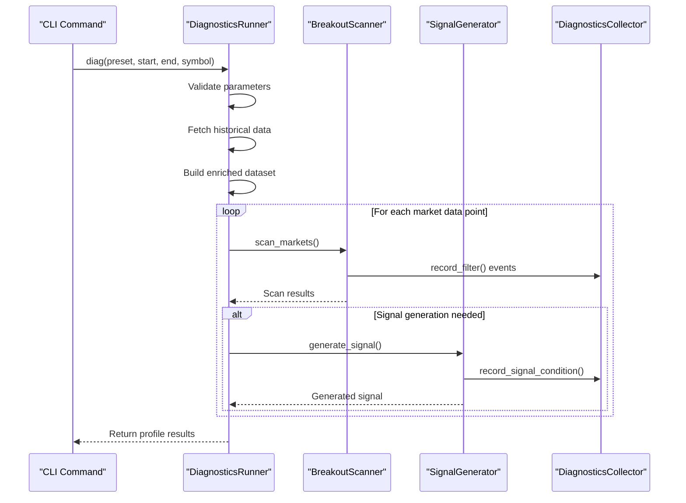
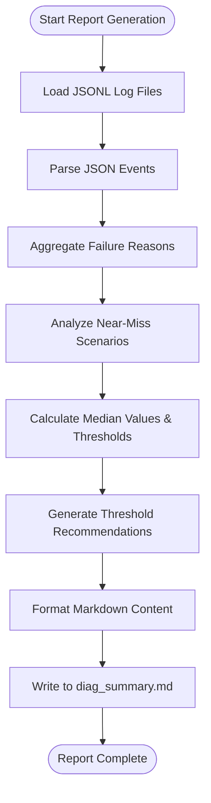

# Diagnostic Reporting

<cite>
**Referenced Files in This Document**   
- [reporting.py](file://breakout_bot/diagnostics/reporting.py)
- [runner.py](file://breakout_bot/diagnostics/runner.py)
- [collector.py](file://breakout_bot/diagnostics/collector.py)
- [main.py](file://breakout_bot/cli/main.py)
- [diag_summary.md](file://reports/diag_summary.md)
- [breakout_v1.json](file://breakout_bot/config/presets/breakout_v1.json)
</cite>

## Table of Contents
1. [Introduction](#introduction)
2. [Diagnostic Execution Flow](#diagnostic-execution-flow)
3. [Runtime Diagnostics Collection](#runtime-diagnostics-collection)
4. [Report Generation Process](#report-generation-process)
5. [Diagnostic Report Structure](#diagnostic-report-structure)
6. [Actionable Insights from Reports](#actionable-insights-from-reports)
7. [Log Correlation and Timestamp Analysis](#log-correlation-and-timestamp-analysis)
8. [Automation and CI/CD Integration](#automation-and-cicd-integration)
9. [Extending the Reporting System](#extending-the-reporting-system)
10. [Conclusion](#conclusion)

## Introduction
The diagnostic reporting system provides comprehensive analysis of the breakout trading bot's performance by generating structured health summaries and detailed analysis reports. This system enables developers and operators to understand the bot's behavior, identify optimization opportunities, and troubleshoot issues through systematic evaluation of runtime diagnostics. The core components work together to collect execution data, analyze performance metrics, and generate human-readable Markdown reports that highlight key findings and recommendations.

## Diagnostic Execution Flow
The diagnostic process begins with the CLI command that orchestrates the entire diagnostic run. When a user invokes the `diag` command, it initializes the DiagnosticsRunner with specified parameters including the trading preset, time window, and target symbol. The runner first performs pre-flight checks to validate input parameters and ensure the start datetime precedes the end datetime. It then establishes connections to the exchange client to fetch historical market data across multiple timeframes (5m, 15m) and constructs a comprehensive dataset enriched with technical indicators such as ATR, Bollinger Band width, and BTC correlation. For each market data point in the time window, the runner executes the scanner and signal generator pipeline, recording diagnostic events at each stage of processing.

**Diagram sources**
- [runner.py](file://breakout_bot/diagnostics/runner.py#L1-L272)
- [collector.py](file://breakout_bot/diagnostics/collector.py#L1-L193)

**Section sources**
- [runner.py](file://breakout_bot/diagnostics/runner.py#L1-L272)
- [main.py](file://breakout_bot/cli/main.py#L241-L369)

## Runtime Diagnostics Collection
The DiagnosticsCollector class serves as the central component for capturing runtime diagnostics throughout the trading pipeline. It operates as a thread-safe singleton that records structured events containing timestamps, component identifiers, stage information, and payload data. The collector captures three primary types of diagnostic information: filter evaluations in the scanner component, signal condition assessments in the signal generator, and general pipeline events. Each recorded event includes metadata such as the symbol being processed, the specific filter or condition being evaluated, the actual value observed, the threshold value, and whether the check passed or failed. Failed conditions are aggregated into a Counter object that tracks the frequency of each failure reason, enabling identification of systemic issues.

**Section sources**
- [collector.py](file://breakout_bot/diagnostics/collector.py#L1-L193)

## Report Generation Process
The reporting system compiles collected diagnostics into structured Markdown reports through the DiagnosticsReportBuilder class. This process begins by loading JSONL log files generated during diagnostic runs, parsing each line as a JSON object representing a diagnostic event. The builder aggregates events by their failure reasons and analyzes near-miss scenarios where signal conditions nearly passed but failed due to threshold constraints. For these cases, it calculates median values and thresholds to provide data-driven recommendations for parameter adjustments. The final report is written to `reports/diag_summary.md` and includes comparative analysis between baseline and relaxed preset profiles, aggregate failure statistics, and actionable threshold suggestions derived from statistical analysis of the diagnostic data.

**Diagram sources**
- [reporting.py](file://breakout_bot/diagnostics/reporting.py#L1-L82)
- [main.py](file://breakout_bot/cli/main.py#L341-L369)

**Section sources**
- [reporting.py](file://breakout_bot/diagnostics/reporting.py#L1-L82)
- [main.py](file://breakout_bot/cli/main.py#L341-L369)

## Diagnostic Report Structure
The diagnostic report follows a standardized structure that organizes information into logical sections for easy interpretation. At the top level, the report identifies the analyzed symbol and time window, providing context for the subsequent analysis. For each diagnostic profile (typically labeled A and B), the report details key metrics including bars analyzed, candidates per bar, filter pass rates, and signal generation statistics. The "Top reasons" section lists the most frequent failure points in descending order of occurrence, helping prioritize optimization efforts. The aggregate analysis combines data from all profiles to identify systemic issues, while the threshold suggestions section provides mathematically derived recommendations for adjusting filter parameters based on median value analysis.

**Section sources**
- [diag_summary.md](file://reports/diag_summary.md#L1-L42)

## Actionable Insights from Reports
Diagnostic reports enable identification of critical performance issues and optimization opportunities through pattern recognition in failure data. For example, when analyzing the provided diagnostic output, we observe that filters for ATR range, correlation, and minimum trades per minute are consistently failing across all bars. This indicates potential configuration issues with the trading preset rather than transient market conditions. The high frequency of "filter:atr_range" failures suggests the ATR thresholds in the preset may be too restrictive for current market volatility levels. Similarly, the universal failure of "filter:correlation" despite BTC correlation values meeting the threshold indicates a possible logic error in the correlation filter implementation. These insights allow developers to systematically address root causes rather than treating symptoms.

**Section sources**
- [diag_summary.md](file://reports/diag_summary.md#L1-L42)
- [breakout_v1.json](file://breakout_bot/config/presets/breakout_v1.json#L1-L81)

## Log Correlation and Timestamp Analysis
The diagnostic system enables precise correlation between report findings and raw log data through consistent timestamp usage and transaction ID tracking. Each diagnostic event includes a Unix timestamp with microsecond precision, allowing exact alignment with other system logs such as API, error, and metrics logs. The session_id in the diagnostics collector serves as a transaction ID that links all events from a single diagnostic run, enabling cross-referencing of related activities. By matching timestamps between the diagnostic JSONL files and application logs, developers can reconstruct the complete execution context for any reported issue, including network response times, database queries, and external API calls that occurred simultaneously with diagnostic events.

**Section sources**
- [collector.py](file://breakout_bot/diagnostics/collector.py#L28-L191)
- [diag_A_BTC_USDT_1755640800.jsonl](file://logs/diag/diag_A_BTC_USDT_1755640800.jsonl#L1-L200)

## Automation and CI/CD Integration
The diagnostic reporting system supports automation through CLI commands that can be integrated into CI/CD pipelines for continuous validation of trading strategies. The `diag` command accepts parameters via command line arguments, making it suitable for scripting and scheduled execution. In a CI/CD context, diagnostic runs can be triggered automatically after code changes, with the resulting reports serving as quality gates before deployment. Exit codes from the diagnostic command indicate success or failure based on predefined criteria, allowing pipeline steps to fail when critical issues are detected. Additionally, the structured JSONL output format enables automated parsing and integration with monitoring systems, alerting teams to performance regressions or configuration issues.

**Section sources**
- [main.py](file://breakout_bot/cli/main.py#L241-L369)

## Extending the Reporting System
Developers can extend the reporting capabilities by implementing custom validation rules and strategy-specific KPIs through several extension points in the existing architecture. New filter types can be added to the scanner component with corresponding diagnostic recording, which will automatically appear in reports without modification to the reporting code. Custom KPIs can be implemented by extending the DiagnosticsCollector to record additional metrics and modifying the DiagnosticsReportBuilder to include new analysis sections. The modular design allows for pluggable analyzers that can process the raw diagnostic events and contribute additional insights to the final report. This extensibility ensures the reporting system can evolve alongside increasingly sophisticated trading strategies and risk management requirements.

**Section sources**
- [collector.py](file://breakout_bot/diagnostics/collector.py#L28-L191)
- [reporting.py](file://breakout_bot/diagnostics/reporting.py#L1-L82)

## Conclusion
The diagnostic reporting system provides a comprehensive framework for analyzing and optimizing the breakout trading bot's performance. By systematically collecting runtime diagnostics, aggregating failure patterns, and generating actionable reports, it transforms raw execution data into meaningful insights that drive improvement. The integration between the DiagnosticsRunner, DiagnosticsCollector, and DiagnosticsReportBuilder creates a closed-loop system for testing, analysis, and refinement of trading strategies. With proper utilization, this system enables data-driven decision making, rapid issue resolution, and continuous enhancement of trading performance through evidence-based parameter tuning and strategy optimization.