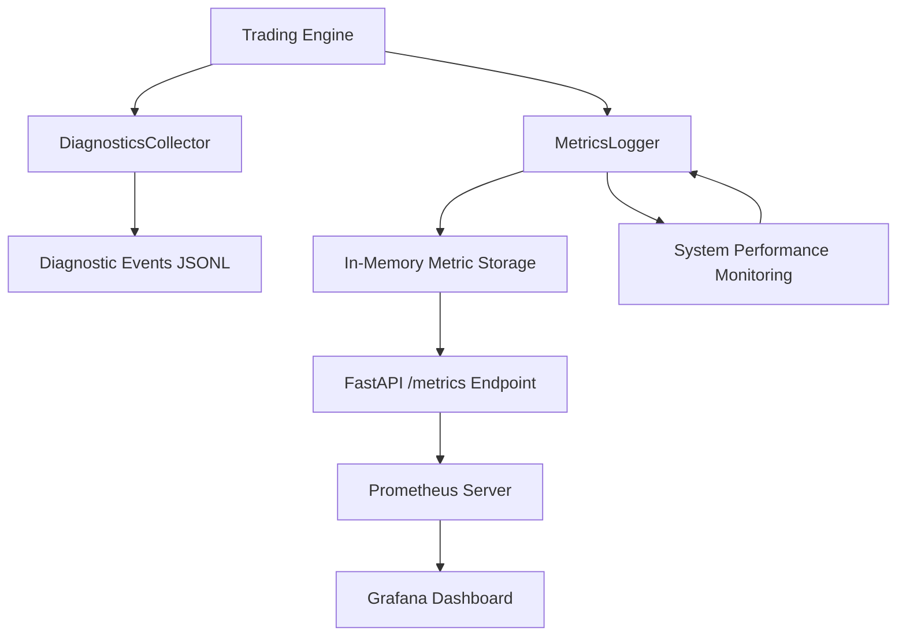
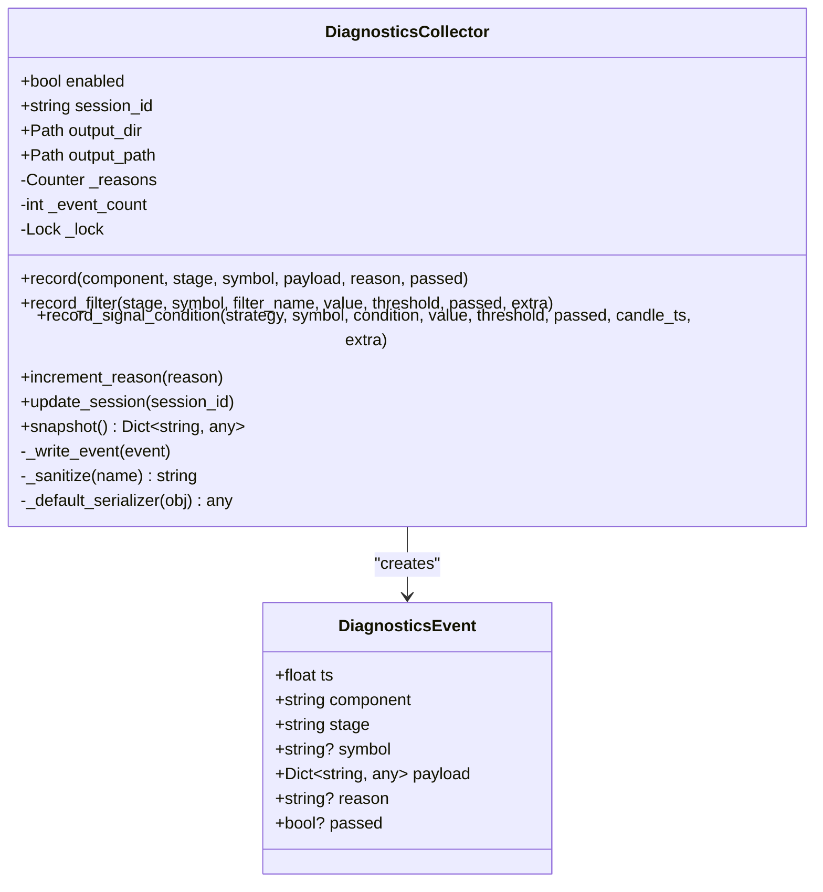
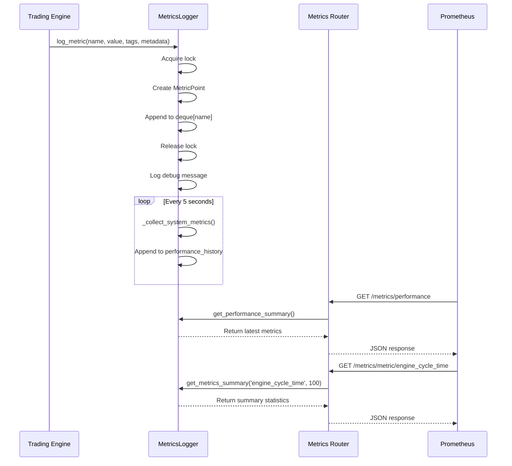
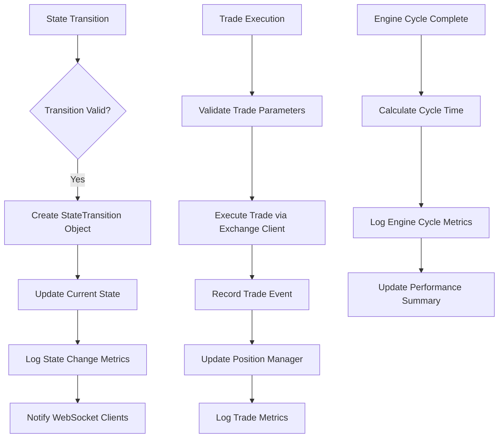
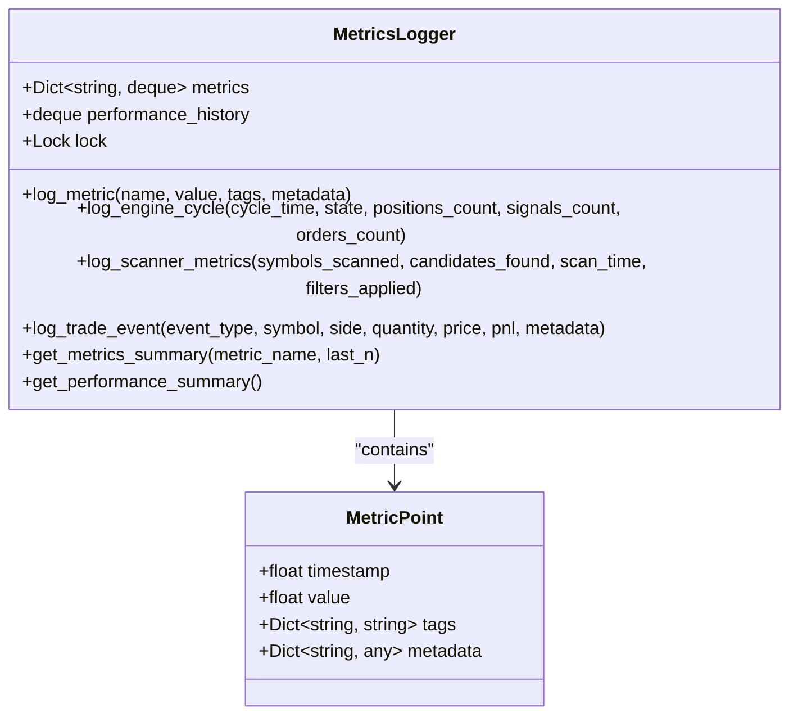
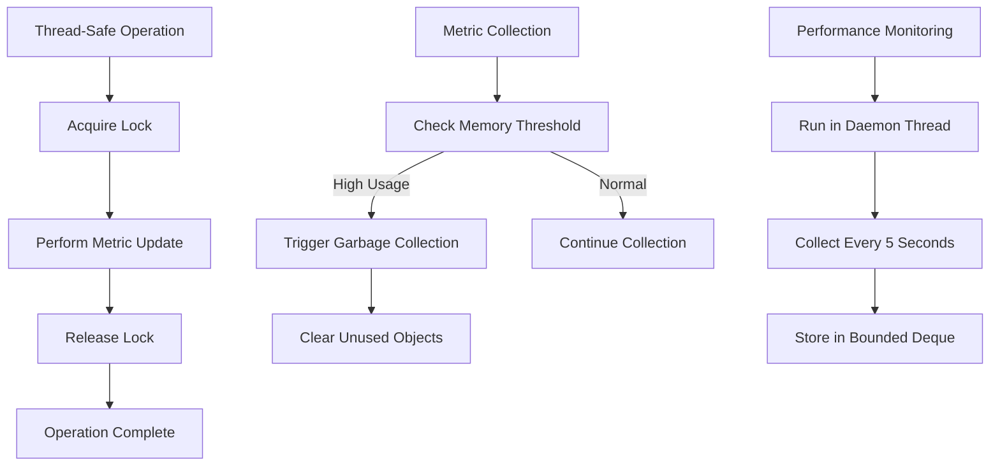
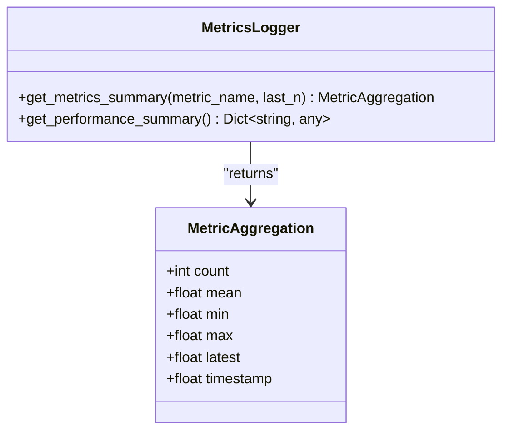
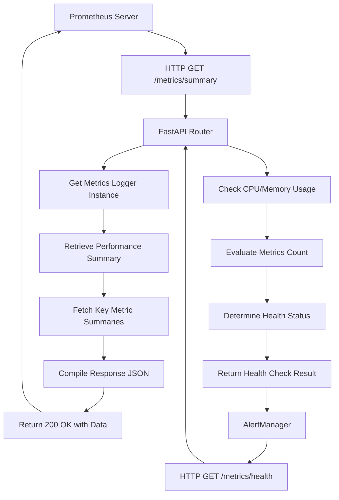
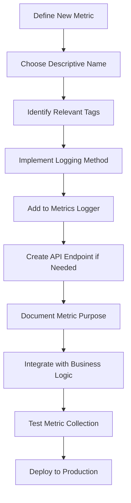

# Metric Collection

<cite>
**Referenced Files in This Document **   
- [collector.py](file://breakout_bot/diagnostics/collector.py)
- [metrics.py](file://breakout_bot/api/routers/metrics.py)
- [metrics_logger.py](file://breakout_bot/utils/metrics_logger.py)
- [engine.py](file://breakout_bot/core/engine.py)
</cite>

## Table of Contents
1. [Introduction](#introduction)
2. [Core Components](#core-components)
3. [Architecture Overview](#architecture-overview)
4. [Detailed Component Analysis](#detailed-component-analysis)
5. [Event-Driven Collection Mechanism](#event-driven-collection-mechanism)
6. [Custom Metrics and Tagging Strategy](#custom-metrics-and-tagging-strategy)
7. [Thread Safety and Performance Optimization](#thread-safety-and-performance-optimization)
8. [Aggregation and Time Windowing](#aggregation-and-time-windowing)
9. [Integration with Prometheus via FastAPI](#integration-with-prometheus-via-fastapi)
10. [Best Practices for Extending the System](#best-practices-for-extending-the-system)

## Introduction
The metric collection subsystem in the breakout trading engine provides comprehensive real-time monitoring of system performance, operational health, and trading KPIs. It captures critical data points including CPU usage, memory consumption, request latency, signal generation rates, and domain-specific metrics such as win rate and R-multiple. The system employs a modular diagnostic framework implemented in `collector.py` that integrates with FastAPI's `/metrics` endpoint through `metrics.py` to expose Prometheus-compatible time-series data. This documentation details the internal architecture, event-driven collection mechanism, thread safety considerations, and best practices for extending the system with custom metrics.

## Core Components
The metric collection subsystem consists of several key components working in concert: the `DiagnosticsCollector` class handles structured diagnostics events, the `MetricsLogger` manages time-series data collection, and the FastAPI router exposes endpoints for metric retrieval. These components work together to provide a comprehensive monitoring solution that supports both real-time analysis and historical trend tracking.

**Section sources**
- [collector.py](file://breakout_bot/diagnostics/collector.py#L1-L192)
- [metrics_logger.py](file://breakout_bot/utils/metrics_logger.py#L1-L302)
- [metrics.py](file://breakout_bot/api/routers/metrics.py#L1-L135)

## Architecture Overview
The metric collection architecture follows a layered approach where data is collected at the source, aggregated in memory with thread-safe operations, and exposed through RESTful endpoints. The system uses a push model for diagnostic events and a pull model for Prometheus scraping, ensuring compatibility with standard monitoring infrastructure while maintaining low overhead.

**Diagram sources **
- [collector.py](file://breakout_bot/diagnostics/collector.py#L1-L192)
- [metrics_logger.py](file://breakout_bot/utils/metrics_logger.py#L1-L302)
- [metrics.py](file://breakout_bot/api/routers/metrics.py#L1-L135)

## Detailed Component Analysis

### Diagnostics Collector Implementation
The `DiagnosticsCollector` class implements a modular framework for capturing diagnostic information across the trading pipeline. It records events with timestamps, component identifiers, stages, symbols, payloads, reasons, and pass/fail status, providing granular insight into system behavior.

#### Class Diagram for Diagnostics Collector

**Diagram sources **
- [collector.py](file://breakout_bot/diagnostics/collector.py#L1-L192)

**Section sources**
- [collector.py](file://breakout_bot/diagnostics/collector.py#L1-L192)

### Metrics Logger and API Integration
The `MetricsLogger` class provides a comprehensive solution for collecting and managing time-series metrics. It maintains bounded deques for each metric type, automatically collects system performance data, and provides methods for logging various types of trading-related metrics.

#### Sequence Diagram for Metrics Collection

**Diagram sources **
- [metrics_logger.py](file://breakout_bot/utils/metrics_logger.py#L1-L302)
- [metrics.py](file://breakout_bot/api/routers/metrics.py#L1-L135)

**Section sources**
- [metrics_logger.py](file://breakout_bot/utils/metrics_logger.py#L1-L302)
- [metrics.py](file://breakout_bot/api/routers/metrics.py#L1-L135)

## Event-Driven Collection Mechanism
The metric collection system is triggered by state transitions and trade events throughout the trading engine lifecycle. When the `StateMachine` transitions between states (e.g., from SCANNING to SIGNAL_WAIT), corresponding metrics are recorded. Similarly, trade execution events trigger the recording of trading KPIs. The `OptimizedOrchestraEngine` integrates with the metrics system through its `trading_orchestrator`, which calls appropriate logging methods during each phase of the trading cycle.

**Diagram sources **
- [engine.py](file://breakout_bot/core/engine.py#L1-L1209)
- [state_machine.py](file://breakout_bot/core/state_machine.py#L1-L349)

## Custom Metrics and Tagging Strategy
The system supports custom metrics such as 'signals_generated_total', 'engine_uptime_seconds', and 'risk_checks_failed' through a flexible tagging system. Metrics are tagged by engine instance, strategy preset, and other contextual dimensions, enabling detailed analysis and filtering in monitoring dashboards. The tagging strategy allows for multi-dimensional slicing of metric data, supporting complex queries and alerting rules.

### Example of Custom Metric Registration

**Diagram sources **
- [metrics_logger.py](file://breakout_bot/utils/metrics_logger.py#L1-L302)

## Thread Safety and Performance Optimization
The metric collection system employs several strategies to ensure thread safety and minimize performance overhead. All metric operations are protected by a threading lock to prevent race conditions in concurrent environments. The system uses bounded deques with specified maximum lengths to prevent unbounded memory growth. Performance monitoring runs in a dedicated daemon thread, collecting system metrics every 5 seconds without blocking the main trading loop.

**Diagram sources **
- [metrics_logger.py](file://breakout_bot/utils/metrics_logger.py#L1-L302)

## Aggregation and Time Windowing
Metrics are aggregated over configurable time windows using statistical summaries that include count, mean, minimum, maximum, and latest values. The system maintains rolling windows of metric data, allowing for analysis of trends and patterns over time. Aggregation occurs at query time rather than write time, preserving the raw data while still providing efficient access to summarized information.

**Diagram sources **
- [metrics_logger.py](file://breakout_bot/utils/metrics_logger.py#L1-L302)

## Integration with Prometheus via FastAPI
The metrics subsystem integrates with Prometheus through a FastAPI router that exposes multiple endpoints for metric retrieval. The `/metrics/summary` endpoint provides an overview of key performance indicators, while `/metrics/performance` returns system resource utilization. The `/metrics/metric/{metric_name}` endpoint allows querying specific metrics with configurable sample sizes, and `/metrics/health` provides system health status with automated issue detection.

**Diagram sources **
- [metrics.py](file://breakout_bot/api/routers/metrics.py#L1-L135)

## Best Practices for Extending the System
When adding domain-specific metrics to extend the system, developers should follow established patterns for consistency and maintainability. New metrics should be registered with descriptive names following snake_case convention, include relevant tags for dimensional analysis, and be accompanied by appropriate logging levels. Custom metrics should be documented with clear definitions and expected value ranges to facilitate monitoring and alerting configuration.

**Section sources**
- [metrics_logger.py](file://breakout_bot/utils/metrics_logger.py#L1-L302)
- [metrics.py](file://breakout_bot/api/routers/metrics.py#L1-L135)