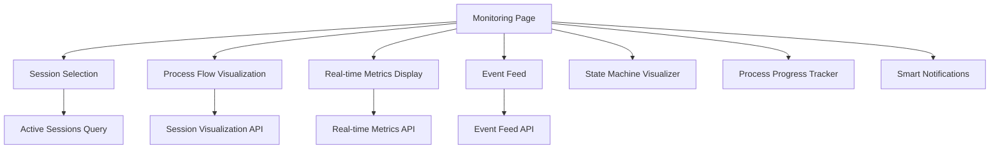

# Monitoring Visualization

<cite>
**Referenced Files in This Document**   
- [prometheus.yml](file://monitoring/prometheus.yml)
- [prometheus.yml](file://monitoring/grafana/datasources/prometheus.yml)
- [Monitoring.tsx](file://frontend/src/pages/Monitoring.tsx)
- [metrics.py](file://breakout_bot/api/routers/metrics.py)
- [metrics_logger.py](file://breakout_bot/utils/metrics_logger.py)
</cite>

## Table of Contents
1. [Introduction](#introduction)
2. [Prometheus Configuration](#prometheus-configuration)
3. [Grafana Datasource Setup](#grafana-datasource-setup)
4. [Key Dashboard Visualizations](#key-dashboard-visualizations)
5. [Critical Prometheus Queries](#critical-prometheus-queries)
6. [Frontend Integration](#frontend-integration)
7. [Alerting Configuration](#alerting-configuration)
8. [Best Practices](#best-practices)

## Introduction
The monitoring visualization layer transforms raw metrics into actionable insights through dashboards and real-time charts. This system enables comprehensive oversight of the trading bot's performance, resource utilization, and operational health. The architecture leverages Prometheus for metric collection and time-series storage, Grafana for visualization, and a React-based frontend for integrated monitoring views.

## Prometheus Configuration

### Scrape Configuration
Prometheus is configured to scrape metrics from multiple endpoints with specific intervals and paths. The primary configuration file `prometheus.yml` defines global settings and scrape targets:

```yaml
global:
  scrape_interval: 15s
  evaluation_interval: 15s

scrape_configs:
  - job_name: 'breakout-bot-api'
    static_configs:
      - targets: ['breakout-bot-api:8000']
    metrics_path: '/api/metrics'
    scrape_interval: 5s
```

The configuration establishes a dedicated job `breakout-bot-api` that scrapes metrics from the trading bot API container at port 8000. The scrape interval is set to 5 seconds for high-frequency monitoring of trading operations, which is more frequent than the global 15-second interval to capture rapid state changes in the trading system.

### Target Configuration
The target configuration specifies the endpoint `/api/metrics` as the source for application-specific metrics. This endpoint is exposed by the FastAPI application in the breakout bot system and provides access to performance data, engine state information, and trading metrics collected by the `MetricsLogger` class.

### Relabeling Rules
While no explicit relabeling rules are defined in the current configuration, the setup allows for future extension with relabeling to transform or filter metrics before ingestion. The current configuration focuses on direct scraping of metrics without transformation.

**Section sources**
- [prometheus.yml](file://monitoring/prometheus.yml#L0-L26)

## Grafana Datasource Setup

### Datasource Configuration
Grafana is configured to connect to Prometheus as its primary datasource through the provisioning file `grafana/datasources/prometheus.yml`:

```yaml
apiVersion: 1

datasources:
  - name: Prometheus
    type: prometheus
    access: proxy
    url: http://prometheus:9090
    isDefault: true
    editable: true
```

This configuration establishes Prometheus as the default datasource with proxy access mode, allowing Grafana to query the Prometheus server running in the Docker network. The URL `http://prometheus:9090` corresponds to the service name defined in the docker-compose configuration.

### Provisioning Integration
The datasource configuration is mounted into the Grafana container through Docker volume mounting, enabling automatic provisioning of datasources without manual configuration. This approach ensures consistency across deployments and facilitates version control of monitoring infrastructure.

**Section sources**
- [prometheus.yml](file://monitoring/grafana/datasources/prometheus.yml#L0-L9)

## Key Dashboard Visualizations

### Engine State Transition Timelines
Dashboards display chronological timelines of engine state transitions, showing movement between states such as "idle", "scanning", "signal_wait", and "managing". These visualizations help identify patterns in engine behavior and detect abnormal state transitions or prolonged dwell times in specific states.

### Signal Generation Heatmaps
Heatmaps visualize signal generation frequency across different market conditions, time periods, and asset pairs. These charts help identify optimal trading windows and assess the sensitivity of signal generation to various market parameters.

### Latency Percentiles
Latency monitoring includes percentile-based visualizations (P50, P90, P95, P99) of key operations including:
- Engine cycle processing time
- Market data scanning duration
- Order execution latency
- WebSocket message processing

These percentiles provide insight into tail latency and system responsiveness under load.

### Memory Usage Trends
Memory usage dashboards track both application-level memory consumption and system-level metrics, including:
- Process memory percentage
- Memory usage in megabytes
- Memory growth trends over time
- Correlation between memory usage and trading activity

**Section sources**
- [metrics_logger.py](file://breakout_bot/utils/metrics_logger.py#L0-L302)
- [metrics.py](file://breakout_bot/api/routers/metrics.py#L0-L135)

## Critical Prometheus Queries

### Signal Generation Rate
The query `rate(signals_generated_total[5m])` calculates the per-second rate of signal generation over a 5-minute window, providing insight into the bot's scanning effectiveness and market opportunity detection frequency.

### Daily Loss Limit Triggers
The query `increase(daily_loss_limit_triggered_total[1h])` measures the increase in daily loss limit triggers over the past hour, serving as a critical risk management indicator that alerts when the bot approaches or exceeds predefined loss thresholds.

### Engine Cycle Time Analysis
Queries such as `histogram_quantile(0.95, sum(rate(engine_cycle_time_bucket[5m])) by (le))` calculate percentile-based engine cycle times, helping identify performance degradation or bottlenecks in the trading loop.

### Resource Utilization Metrics
Key resource queries include:
- `process_cpu_usage` - CPU utilization percentage
- `process_memory_percent` - Memory usage percentage
- `rate(trade_execution_duration_sum[5m]) / rate(trade_execution_duration_count[5m])` - Average trade execution latency

**Section sources**
- [metrics_logger.py](file://breakout_bot/utils/metrics_logger.py#L0-L302)

## Frontend Integration

### Monitoring Page Architecture
The `Monitoring.tsx` page implements a comprehensive monitoring interface that integrates multiple visualization components:



### Data Fetching Strategy
The monitoring page uses React Query for efficient data fetching with auto-refresh capabilities. Key data points retrieved include:
- Active sessions and their status
- Current session visualization data
- Session checkpoints and process flow
- Real-time system metrics (CPU, memory, latency)
- Event feed data

The component implements configurable auto-refresh with a default interval of 1-2 seconds for critical metrics, allowing users to toggle refresh behavior based on their monitoring needs.

### Component Integration
The page integrates specialized visualization components:
- `StateMachineVisualizer` for engine state tracking
- `ProcessProgress` for workflow progression
- `SmartNotifications` for alert display
- `EventFeed` for real-time event monitoring

These components work together to provide a holistic view of the trading system's operation.

**Diagram sources**
- [Monitoring.tsx](file://frontend/src/pages/Monitoring.tsx#L0-L483)

**Section sources**
- [Monitoring.tsx](file://frontend/src/pages/Monitoring.tsx#L0-L483)
- [metrics.py](file://breakout_bot/api/routers/metrics.py#L0-L135)

## Alerting Configuration

### Anomaly Detection Rules
Grafana alerting rules are configured to detect anomalies such as:
- Sudden drops in scanning frequency below threshold levels
- Abnormal increases in engine cycle time indicating performance issues
- Memory usage exceeding safe thresholds
- Unexpected state transitions in the trading engine
- Prolonged periods without signal generation

### Alert Configuration
Alerts are defined in Grafana with appropriate thresholds, evaluation intervals, and notification channels. Critical alerts trigger immediate notifications, while warning alerts may require sustained conditions before firing to reduce false positives.

### Alert Management
The system supports alert grouping, silencing, and acknowledgment workflows to ensure effective incident management. Alerts are integrated with external notification systems for off-platform alert delivery.

**Section sources**
- [prometheus.yml](file://monitoring/prometheus.yml#L0-L26)

## Best Practices

### Dashboard Sharing
Dashboards should be shared through version-controlled JSON files rather than manual export/import. This ensures consistency across environments and enables peer review of dashboard changes.

### Version Control of Dashboard JSONs
All Grafana dashboards should be stored in version control as JSON files, allowing for:
- Change tracking and history
- Code review of dashboard modifications
- Rollback to previous versions
- Consistent deployment across environments

### Access Control
Implement role-based access control for monitoring systems with different permission levels:
- View-only access for analysts
- Edit access for developers and operations staff
- Admin access for monitoring system maintainers

### Monitoring System Maintenance
Regular maintenance practices include:
- Reviewing and updating alert thresholds based on system evolution
- Pruning unused dashboards and panels
- Validating datasource configurations after system changes
- Testing alert notifications periodically

**Section sources**
- [prometheus.yml](file://monitoring/prometheus.yml#L0-L26)
- [prometheus.yml](file://monitoring/grafana/datasources/prometheus.yml#L0-L9)