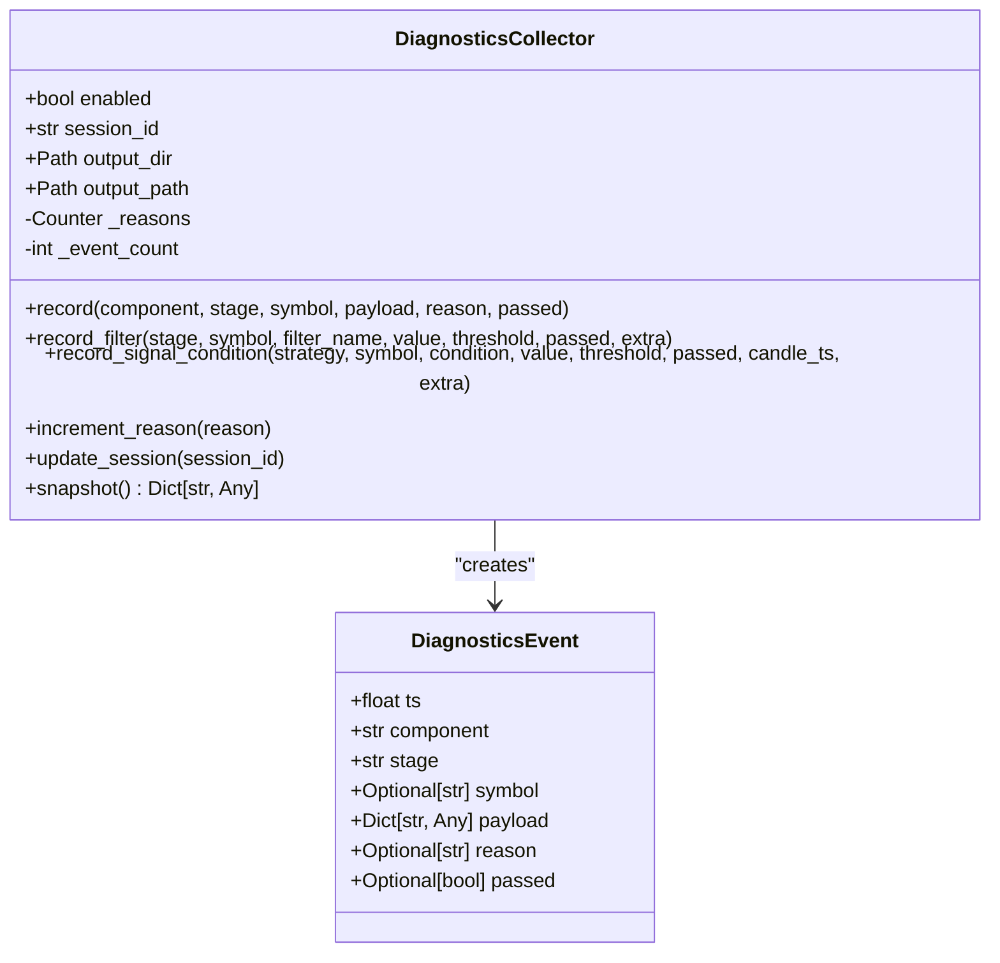
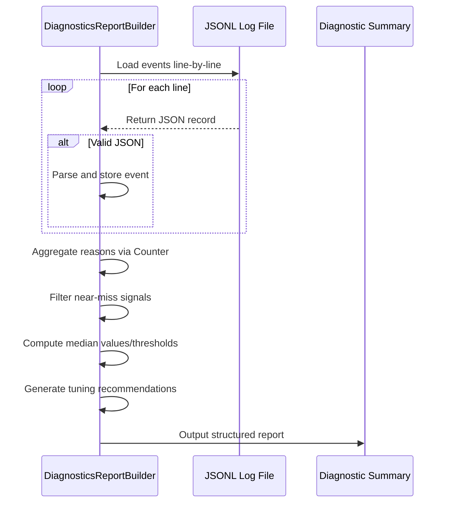
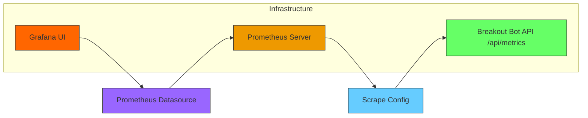
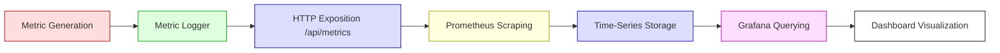
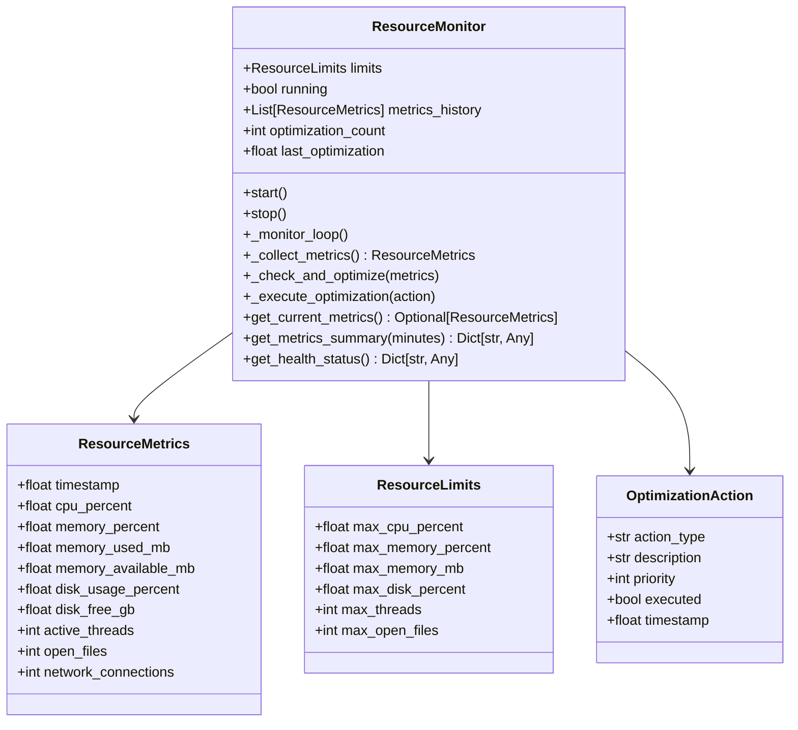

# Monitoring and Diagnostics

<cite>
**Referenced Files in This Document**   
- [collector.py](file://breakout_bot/diagnostics/collector.py)
- [reporting.py](file://breakout_bot/diagnostics/reporting.py)
- [prometheus.yml](file://monitoring/prometheus.yml)
- [prometheus.yml](file://monitoring/grafana/datasources/prometheus.yml)
- [diag_summary.md](file://reports/diag_summary.md)
- [resource_monitor.py](file://breakout_bot/utils/resource_monitor.py)
- [metrics_logger.py](file://breakout_bot/utils/metrics_logger.py)
- [metrics.py](file://breakout_bot/api/routers/metrics.py)
- [memory_snapshot_20250922_233838.json](file://memory_snapshot_20250922_233838.json)
- [memory_snapshot_20250922_234013.json](file://memory_snapshot_20250922_234013.json)
</cite>

## Table of Contents
1. [Introduction](#introduction)
2. [Diagnostic Collector Framework](#diagnostic-collector-framework)
3. [Diagnostics Reporting System](#diagnostics-reporting-system)
4. [Prometheus Integration and Metrics Exposition](#prometheus-integration-and-metrics-exposition)
5. [Grafana Configuration and Visualization](#grafana-configuration-and-visualization)
6. [End-to-End Monitoring Workflow](#end-to-end-monitoring-workflow)
7. [Key Dashboards and Visualizations](#key-dashboards-and-visualizations)
8. [Alerting and Anomaly Detection](#alerting-and-anomaly-detection)
9. [Self-Diagnostic Capabilities](#self-diagnostic-capabilities)
10. [Log Aggregation and Correlation](#log-aggregation-and-correlation)
11. [Interpreting Diagnostic Outputs](#interpreting-diagnostic-outputs)
12. [Conclusion](#conclusion)

## Introduction
The monitoring and diagnostics subsystem ensures comprehensive observability and operational health for the Breakout Bot trading system. This documentation details the architecture and functionality of diagnostic components, including metric collection, structured reporting, time-series exposition via Prometheus, visualization through Grafana, and self-diagnostic capabilities. The system enables proactive identification of bottlenecks, performance decay, and instability through integrated metrics, logs, and alerting mechanisms.

## Diagnostic Collector Framework
The diagnostic collector framework implemented in `collector.py` systematically captures execution telemetry across the trading pipeline. It records granular events related to scanner filters, signal conditions, and component behavior with timestamps, symbolic context, and evaluation outcomes.

The `DiagnosticsCollector` class manages event serialization into JSONL format, enabling efficient streaming and post-processing. Each `DiagnosticsEvent` contains metadata such as timestamp (`ts`), component origin (`component`), processing stage (`stage`), symbol context (`symbol`), payload data, failure reason (`reason`), and pass/fail status (`passed`). Events are thread-safe written using file locking to prevent corruption during concurrent access.

Specialized methods like `record_filter()` and `record_signal_condition()` standardize diagnostic capture for filtering logic and signal generation, respectively. These enable precise attribution of missed opportunities to specific threshold violations or condition failures.



**Diagram sources**
- [collector.py](file://breakout_bot/diagnostics/collector.py#L15-L192)

**Section sources**
- [collector.py](file://breakout_bot/diagnostics/collector.py#L1-L192)

## Diagnostics Reporting System
The reporting module in `reporting.py` transforms raw diagnostic logs into actionable insights by aggregating failure patterns and generating optimization recommendations. The `DiagnosticsReportBuilder` processes one or more JSONL log files to construct a comprehensive summary.

It analyzes event reasons, particularly focusing on near-miss scenarios where signal conditions were narrowly unmet. By extracting median values and thresholds from failed evaluations, it computes suggested adjustments using proportional tuning (e.g., adjusting threshold toward the midpoint between current threshold and observed value).

The resulting report includes total event counts, unique failure reasons ranked by frequency, and data-driven configuration recommendations aimed at improving signal capture rates without compromising strategy integrity.



**Diagram sources**
- [reporting.py](file://breakout_bot/diagnostics/reporting.py#L11-L79)

**Section sources**
- [reporting.py](file://breakout_bot/diagnostics/reporting.py#L1-L81)
- [diag_summary.md](file://reports/diag_summary.md#L1-L41)

## Prometheus Integration and Metrics Exposition
Prometheus integration is configured through `monitoring/prometheus.yml`, defining scrape jobs for the breakout bot API, Prometheus itself, and infrastructure exporters like node-exporter. The primary job `breakout-bot-api` scrapes the `/api/metrics` endpoint every 5 seconds, ensuring high-resolution time-series capture.

Custom application metrics such as `engine_cycle_time`, `scanner_symbols_scanned`, and `trade_pnl` are exposed via the FastAPI `/api/metrics` route. These metrics are collected by the `MetricsLogger` class which maintains rolling buffers of numerical measurements along with real-time system performance data (CPU, memory, disk usage).

The metrics endpoint supports multiple routes:
- `/summary`: Aggregated engine, trading, and scanner metrics
- `/performance`: Real-time resource utilization
- `/metric/{name}`: Time-series data for specific metrics
- `/all`: Complete set of tracked metrics

```mermaid
graph TD
A[Application Code] --> B[MetricsLogger]
B --> C[In-Memory Metric Storage]
C --> D[/api/metrics Endpoint]
D --> E[Prometheus Scraper]
E --> F[Prometheus TSDB]
style A fill:#f9f,stroke:#333
style B fill:#bbf,stroke:#333
style C fill:#ffc,stroke:#333
style D fill:#cfc,stroke:#333
style E fill:#f96,stroke:#333
style F fill:#acf,stroke:#333
```

**Diagram sources**
- [prometheus.yml](file://monitoring/prometheus.yml#L1-L27)
- [metrics_logger.py](file://breakout_bot/utils/metrics_logger.py#L1-L302)
- [metrics.py](file://breakout_bot/api/routers/metrics.py#L1-L135)

**Section sources**
- [prometheus.yml](file://monitoring/prometheus.yml#L1-L27)
- [metrics_logger.py](file://breakout_bot/utils/metrics_logger.py#L1-L302)
- [metrics.py](file://breakout_bot/api/routers/metrics.py#L1-L135)

## Grafana Configuration and Visualization
Grafana is provisioned via `monitoring/grafana/datasources/prometheus.yml` to connect automatically to the Prometheus server at `http://prometheus:9090`. This datasource is marked as default and editable, allowing both automated setup and manual exploration.

The Grafana instance runs on port 3001 and is pre-configured with dashboards mounted from the host filesystem. These dashboards visualize key aspects of engine operation including state transitions, signal frequency, latency trends, and resource consumption.

Time-series queries leverage PromQL expressions derived from exposed metric names such as `rate(engine_cycle_time[5m])` for cycle frequency analysis or `avg_over_time(memory_percent[1h])` for memory trend assessment.



**Diagram sources**
- [prometheus.yml](file://monitoring/grafana/datasources/prometheus.yml#L1-L9)
- [docker-compose.yml](file://docker-compose.yml#L53-L93)

## End-to-End Monitoring Workflow
The monitoring workflow follows a four-stage pipeline from metric generation to insight delivery:

1. **Collection**: Application components emit metrics via `get_metrics_logger()` which stores them in bounded deques.
2. **Exposition**: The `/api/metrics` endpoint formats metrics in Prometheus-compatible text format upon request.
3. **Scraping**: Prometheus polls the endpoint every 5 seconds, ingesting metrics into its time-series database.
4. **Visualization**: Grafana queries Prometheus using predefined dashboards to render interactive charts.

This pipeline ensures low-latency visibility into system behavior while maintaining scalability through asynchronous collection and efficient storage.



**Diagram sources**
- [metrics_logger.py](file://breakout_bot/utils/metrics_logger.py#L1-L302)
- [metrics.py](file://breakout_bot/api/routers/metrics.py#L1-L135)
- [prometheus.yml](file://monitoring/prometheus.yml#L1-L27)
- [prometheus.yml](file://monitoring/grafana/datasources/prometheus.yml#L1-L9)

## Key Dashboards and Visualizations
Key Grafana dashboards provide operational visibility across critical dimensions:

- **Engine State Transitions**: Timeline view showing state changes (IDLE, SCANNING, SIGNAL_WAIT, MANAGING) over time, annotated with cycle duration and trigger events.
- **Signal Frequency**: Bar chart displaying signals generated per time window, segmented by strategy type (momentum, retest).
- **Performance Decay Over Time**: Line graphs tracking engine cycle time, memory usage, and CPU load to detect degradation trends.
- **Scanner Efficiency**: Heatmap of candidate symbols filtered out at each stage, highlighting most restrictive filters.
- **Trading Performance**: Equity curve overlay with drawdown bands and trade event markers.

These dashboards correlate metrics with diagnostic reports to identify root causes of reduced signal generation or increased latency.

## Alerting and Anomaly Detection
While explicit alert rules are not defined in the current configuration, Grafana supports configuring threshold-based alerts on any time-series metric. Potential alerting strategies include:

- **High Memory Usage**: Trigger when `memory_percent > 85%` for more than 2 minutes
- **Elevated Latency**: Alert if average engine cycle time exceeds 100ms over a 5-minute window
- **Signal Starvation**: Notify when no signals generated for 15 consecutive cycles
- **Resource Exhaustion**: Warn when active threads exceed 80 or open files surpass 800

Alerts can be routed to external notification systems via Alertmanager, which is already referenced in the Prometheus configuration under the `alerting` section.

## Self-Diagnostic Capabilities
The system includes robust self-diagnostic features for debugging and performance analysis:

- **Memory Snapshots**: Generated during debugging sessions (e.g., `memory_snapshot_20250922_233838.json`) containing heap state, object counts, and reference trees.
- **Resource Monitoring**: The `ResourceMonitor` class tracks CPU, memory, disk, threads, and network connections, triggering garbage collection or cache clearing when thresholds are exceeded.
- **Automatic Optimization**: Configurable actions (GC, log cleanup, thread management) execute based on real-time resource pressure.
- **Health Endpoints**: `/api/metrics/health` provides immediate system health assessment with issue detection and performance metrics.

These capabilities enable both reactive troubleshooting and proactive stabilization of the trading engine.



**Diagram sources**
- [resource_monitor.py](file://breakout_bot/utils/resource_monitor.py#L1-L486)

**Section sources**
- [resource_monitor.py](file://breakout_bot/utils/resource_monitor.py#L1-L486)
- [memory_snapshot_20250922_233838.json](file://memory_snapshot_20250922_233838.json)
- [memory_snapshot_20250922_234013.json](file://memory_snapshot_20250922_234013.json)

## Log Aggregation and Correlation
Diagnostic reports are tightly correlated with application logs to enable root cause analysis. The diagnostics collector writes events to timestamped JSONL files in `logs/diag/`, while general operations are logged to `logs/app.log` and metrics-specific entries to `logs/metrics.log`.

Each diagnostic event includes a timestamp (`ts`) that aligns with log timestamps, enabling temporal correlation. Failed signal conditions are linked to their corresponding filter evaluations, creating traceable decision paths.

The `diag_summary.md` file references specific diagnostic logs (e.g., `logs/diag/diag_A_BTC_USDT_1755640800.jsonl`), establishing a direct link between aggregated findings and raw evidence.

## Interpreting Diagnostic Outputs
To effectively interpret diagnostic outputs:

1. **Identify Top Failure Reasons**: Focus on most frequent reasons in `diag_summary.md` such as `filter:atr_range` or `signal:momentum:volume_threshold`.
2. **Evaluate Near-Misses**: Review recommendations suggesting threshold adjustments based on median value analysis.
3. **Correlate with Metrics**: Cross-reference diagnostic gaps with performance metrics (latency spikes, memory pressure).
4. **Assess Filter Impact**: Analyze how many candidates are eliminated at each filtering stage.
5. **Monitor Trend Evolution**: Track changes in signal generation rate and engine responsiveness over time.

For example, repeated `filter:min_trades_per_minute` failures indicate market liquidity issues, while consistent `signal:retest:breakout_confirmation` misses may warrant relaxation of confirmation criteria.

## Conclusion
The monitoring and diagnostics subsystem provides a comprehensive observability framework for the Breakout Bot trading system. Through structured event collection, automated reporting, Prometheus-based time-series monitoring, and Grafana visualization, it enables deep insight into system behavior and performance characteristics. The integration of self-diagnostics, resource monitoring, and alerting capabilities ensures operational resilience and facilitates rapid response to emerging issues. This architecture supports both real-time oversight and retrospective analysis, forming a critical foundation for reliable algorithmic trading operations.