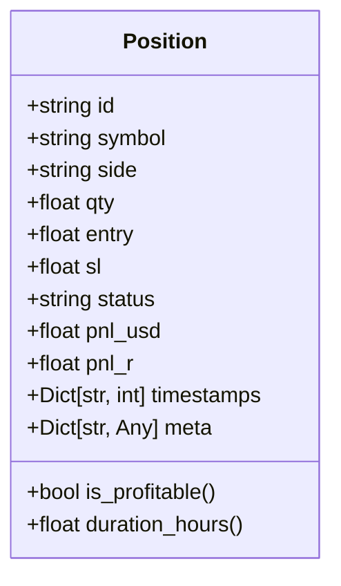
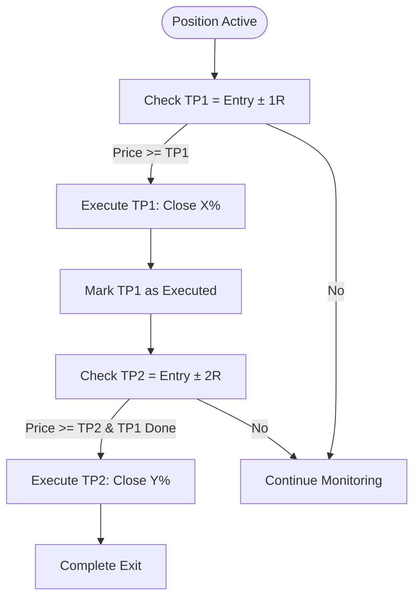
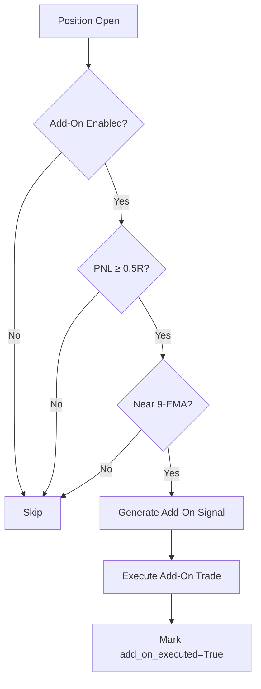
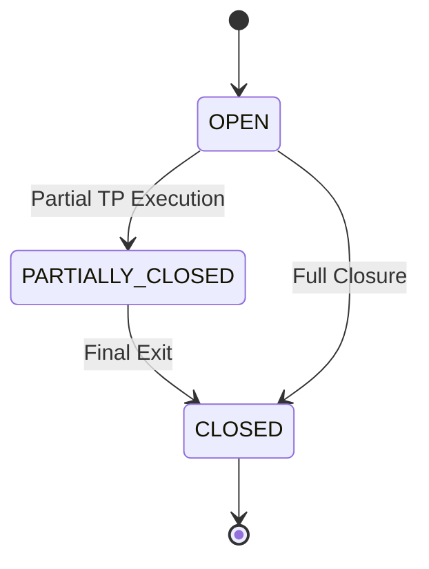
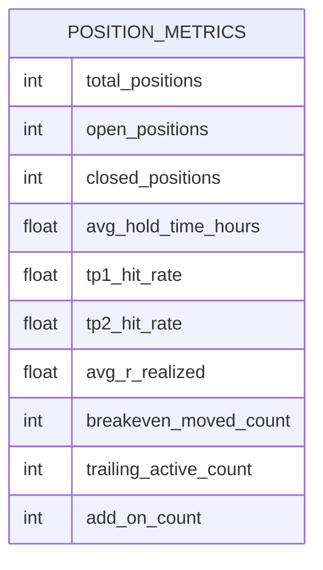

# Position Management

<cite>
**Referenced Files in This Document**   
- [position_manager.py](file://breakout_bot/position/position_manager.py)
- [manager.py](file://breakout_bot/execution/manager.py)
- [exchange_client.py](file://breakout_bot/exchange/exchange_client.py)
- [models.py](file://breakout_bot/data/models.py)
</cite>

## Table of Contents
1. [Introduction](#introduction)
2. [Position Object Model](#position-object-model)
3. [Lifecycle Management](#lifecycle-management)
4. [Stop-Loss and Take-Profit Logic](#stop-loss-and-take-profit-logic)
5. [Trailing Stop Implementation](#trailing-stop-implementation)
6. [Add-On Trade Handling](#add-on-trade-handling)
7. [Integration with Execution System](#integration-with-execution-system)
8. [Exchange Interaction via Bybit API](#exchange-interaction-via-bybit-api)
9. [State Transitions](#state-transitions)
10. [Synchronization and Data Consistency](#synchronization-and-data-consistency)
11. [Performance Metrics Calculation](#performance-metrics-calculation)
12. [Edge Cases and Manual Interventions](#edge-cases-and-manual-interventions)
13. [Reconciliation Procedures](#reconciliation-procedures)
14. [Debugging Techniques](#debugging-techniques)

## Introduction

The position management sub-component is responsible for overseeing the complete lifecycle of both active and historical trades within the Breakout Bot Trading System. It operates as a dynamic, stateful manager that continuously evaluates market conditions against predefined trading strategies to make intelligent decisions about stop-loss adjustments, take-profit executions, trailing stops, and add-on entries.

This system ensures that each trade adheres to risk parameters while maximizing profit potential through adaptive exit strategies. The `PositionManager` class serves as the central orchestrator, interfacing with other components such as the execution engine and exchange client to maintain accurate position states and execute timely modifications based on real-time market data.

**Section sources**
- [position_manager.py](file://breakout_bot/position/position_manager.py#L0-L496)

## Position Object Model

The `Position` object model defines the core structure used to represent a trading position throughout its lifecycle. Each position contains essential attributes including:

- **id**: Unique identifier for the position
- **symbol**: Trading pair symbol (e.g., BTC/USDT)
- **side**: Direction of the trade ('long' or 'short')
- **qty**: Quantity held in the position
- **entry**: Average entry price
- **sl**: Current stop-loss price
- **status**: Status of the position ('open', 'closed', 'partially_closed')
- **pnl_usd**: Unrealized profit/loss in USD
- **pnl_r**: Profit/loss measured in R multiples (risk units)
- **timestamps**: Dictionary containing key timestamps like 'opened_at' and 'closed_at'
- **meta**: Additional metadata for tracking strategy-specific information

Additional computed properties include `is_profitable`, which determines profitability status, and `duration_hours`, which calculates how long the position has been open.

**Diagram sources**
- [models.py](file://breakout_bot/data/models.py#L250-L300)

## Lifecycle Management

The position lifecycle begins when a new position is added to the `PositionManager` via the `add_position()` method. This triggers the creation of a corresponding `PositionTracker` instance that monitors the position's state and conditions according to the configured trading preset.

Positions progress through various states from 'open' to either 'partially_closed' or 'closed'. The manager periodically processes all active positions by calling `process_position_updates()`, which evaluates each position against current market data to determine if any actions are required.

When a position reaches closure—either fully or partially—the `cleanup_closed_positions()` method removes it from active tracking while preserving historical records. Closed positions remain accessible through recent history buffers for performance analysis.

**Section sources**
- [position_manager.py](file://breakout_bot/position/position_manager.py#L206-L234)

## Stop-Loss and Take-Profit Logic

The system implements a multi-tiered approach to managing exits. For stop-loss updates, the `should_update_stop()` method first moves the stop to breakeven after TP1 execution, accounting for fees by placing it 0.1% above entry for long positions and 0.1% below for shorts.

Take-profit logic follows a two-tier structure:
- **TP1**: Executed at 1R distance from entry, closing a configurable percentage of the position
- **TP2**: Triggered at 2R distance but only after TP1 has been successfully executed

These thresholds and sizing percentages are defined in the `PositionConfig` and can be adjusted per trading strategy. The actual evaluation occurs in `should_take_profit()`, which returns execution details when price targets are met.

**Diagram sources**
- [position_manager.py](file://breakout_bot/position/position_manager.py#L69-L127)

## Trailing Stop Implementation

After moving to breakeven, the system activates Chandelier Exit-based trailing stops using ATR (Average True Range) calculations. The trailing mechanism uses 22-period candles and applies a multiplier specified in the configuration (`chandelier_atr_mult`).

For long positions, the stop trails below the highest high minus the ATR multiple, while for short positions, it trails above the lowest low plus the ATR multiple. The `should_update_stop()` method ensures that stops only move favorably—upward for longs and downward for shorts—preventing adverse adjustments.

This trailing logic provides dynamic protection of profits while allowing room for normal market fluctuations, reducing the likelihood of premature exits during volatile periods.

**Section sources**
- [position_manager.py](file://breakout_bot/position/position_manager.py#L69-L127)

## Add-On Trade Handling

The system supports strategic add-on entries under specific conditions designed to enhance winning positions. An add-on is considered when:
- Add-ons are enabled in the configuration
- The position has achieved at least 0.5R in unrealized profit
- Price is near the 9-period EMA, indicating a pullback

The `should_add_on()` method detects these pullbacks by checking if the current price is within 0.5% of the EMA value. When conditions align, it returns the ideal entry price (the EMA level), triggering an add-on order for a configurable maximum size percentage of the original position.

Once executed, the `add_on_executed` flag prevents duplicate entries on the same position.

**Diagram sources**
- [position_manager.py](file://breakout_bot/position/position_manager.py#L127-L156)

## Integration with Execution System

The `PositionManager` integrates tightly with the `ExecutionManager` in `execution/manager.py` to carry out order placement and modifications. While the position manager generates `PositionUpdate` instructions, the execution manager handles their implementation.

Key integration points include:
- **Order Slicing**: Large orders are split into smaller chunks using TWAP (Time-Weighted Average Price) algorithms
- **Depth Awareness**: Orders consider market depth and spread conditions
- **Fee Calculations**: Slippage-aware fee estimates are applied
- **Status Updates**: Execution results flow back to update position state

The `execute_trade()` method in `ExecutionManager` accepts intent parameters ("entry", "exit", "add_on") that inform execution strategy selection, ensuring appropriate handling for different types of trades.

**Section sources**
- [manager.py](file://breakout_bot/execution/manager.py#L0-L289)

## Exchange Interaction via Bybit API

Interaction with the Bybit exchange occurs through the `ExchangeClient` abstraction layer, which provides a unified interface regardless of whether live or paper trading mode is active. The client manages connection pooling, rate limiting, and error handling transparently.

Critical functions include:
- **fetch_ohlcv()**: Retrieves candlestick data for technical analysis
- **create_order()**: Places new orders with proper parameter mapping
- **cancel_order()**: Cancels existing orders
- **fetch_balance()**: Gets account balance information
- **fetch_order_book()**: Provides L2 depth data for execution decisions

Rate limiting is enforced through the `BybitRateLimiter`, which categorizes endpoints and applies appropriate delays to prevent API throttling. Connection reuse is optimized via an `ExchangeConnectionPool`.

**Section sources**
- [exchange_client.py](file://breakout_bot/exchange/exchange_client.py#L0-L799)

## State Transitions

Positions transition between states based on market conditions and execution outcomes. The primary transitions are:

- **OPEN → PARTIALLY_CLOSED**: Occurs when partial take-profit or scaling out happens
- **PARTIALLY_CLOSED → CLOSED**: Final exit completes the position
- **OPEN → CLOSED**: Full immediate closure due to stop-loss or manual intervention

These transitions are managed internally by updating the `status` field and recording timestamps in the `timestamps` dictionary. The `PositionTracker` maintains flags like `tp1_executed`, `breakeven_moved`, and `trailing_active` to track progression through the management workflow.

State changes trigger logging events and metric updates, enabling comprehensive audit trails and performance measurement.

**Diagram sources**
- [position_manager.py](file://breakout_bot/position/position_manager.py#L35-L69)

## Synchronization and Data Consistency

To ensure thread safety in concurrent environments, the `PositionManager` employs asyncio locks:
- `_position_lock`: Protects access to `position_trackers` dictionary
- `_recent_positions_lock`: Guards the `recent_positions` deque

All critical operations—adding, removing, and updating positions—are wrapped in `async with` blocks that acquire these locks, preventing race conditions during simultaneous reads and writes.

Data consistency between local state and exchange-reported positions is maintained through regular synchronization cycles where the system:
1. Fetches current exchange positions
2. Compares with locally tracked positions
3. Resolves discrepancies by either updating local state or submitting corrective orders

The `get_recent_positions()` and `get_active_positions()` methods provide thread-safe access to position data for external consumers.

**Section sources**
- [position_manager.py](file://breakout_bot/position/position_manager.py#L179-L209)

## Performance Metrics Calculation

Post-trade performance metrics are calculated using the `calculate_position_metrics()` method, which analyzes closed positions to compute:

- **Win Rate**: Percentage of trades with positive PnL
- **Average R**: Mean return across all trades in R multiples
- **TP Hit Rates**: Success rates for reaching 1R and 2R targets
- **Average Hold Time**: Duration of closed positions in hours
- **Feature Utilization**: Counts of breakeven moves, trailing stops, and add-ons

Metrics are derived from both direct position data and tracker state flags, providing insights into strategy effectiveness and risk management efficiency.

**Diagram sources**
- [position_manager.py](file://breakout_bot/position/position_manager.py#L373-L438)

## Edge Cases and Manual Interventions

The system handles several edge cases gracefully:
- **Partial Fills**: Remaining quantity continues to be managed; subsequent updates may trigger additional fills
- **Order Cancellations**: Monitored through execution feedback loops; canceled orders prompt reevaluation of position strategy
- **Manual Interventions**: External overrides (e.g., emergency closes) are detected and synchronized into local state

The `cancel_all_orders()` method serves as a placeholder for integrating with OCO (One-Cancels-Other) order management, though actual cancellation logic resides in the execution layer.

Error handling includes retry mechanisms and fallback behaviors to maintain robustness during transient failures.

**Section sources**
- [position_manager.py](file://breakout_bot/position/position_manager.py#L467-L496)

## Reconciliation Procedures

Regular reconciliation ensures alignment between internal position records and exchange-reported states. The process involves:
1. Periodic fetching of exchange positions
2. Comparison with locally managed positions
3. Detection of mismatches (missing, extra, or divergent positions)
4. Automated correction attempts

Discrepancies may arise from network issues, failed order submissions, or timing lags. The system logs all mismatches and attempts automatic resolution by either adjusting local state or submitting corrective orders.

The `cleanup_closed_positions()` method specifically addresses stale trackers by identifying and removing those associated with closed positions, maintaining memory efficiency.

**Section sources**
- [position_manager.py](file://breakout_bot/position/position_manager.py#L439-L466)

## Debugging Techniques

Effective debugging of position management issues involves:
- **Log Analysis**: Reviewing INFO and ERROR logs from `position_manager.py`
- **State Inspection**: Using `get_position_status()` to examine individual position details
- **Metric Validation**: Checking `calculate_position_metrics()` output for anomalies
- **Timeline Reconstruction**: Correlating position updates with market events

Common issues like missed exits or mismatched positions are diagnosed by:
1. Verifying timestamp accuracy
2. Confirming market data freshness
3. Checking configuration values
4. Validating indicator calculations

The presence of comprehensive logging and thread-safe inspection methods enables efficient troubleshooting without disrupting ongoing trading operations.

**Section sources**
- [position_manager.py](file://breakout_bot/position/position_manager.py#L435-L469)