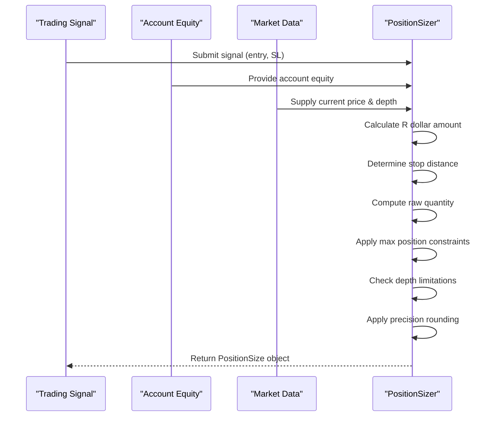
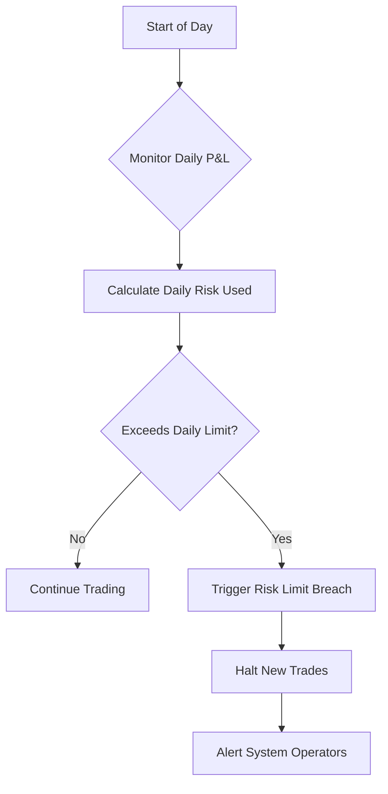
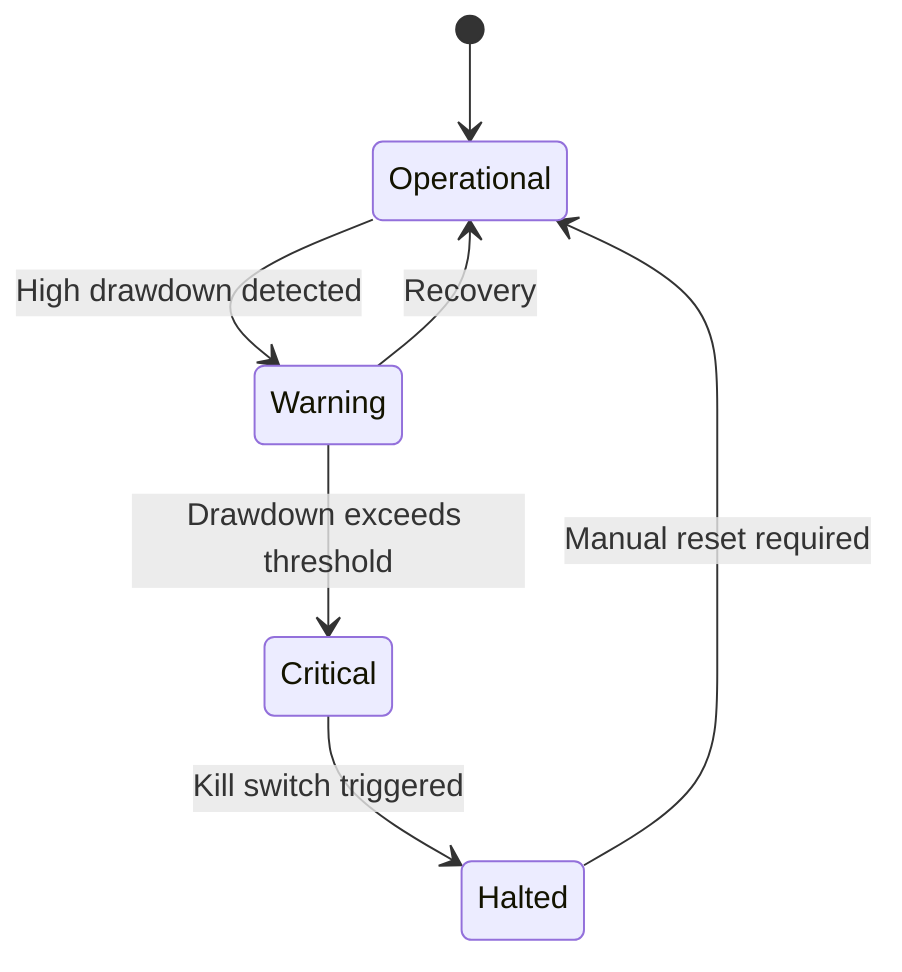
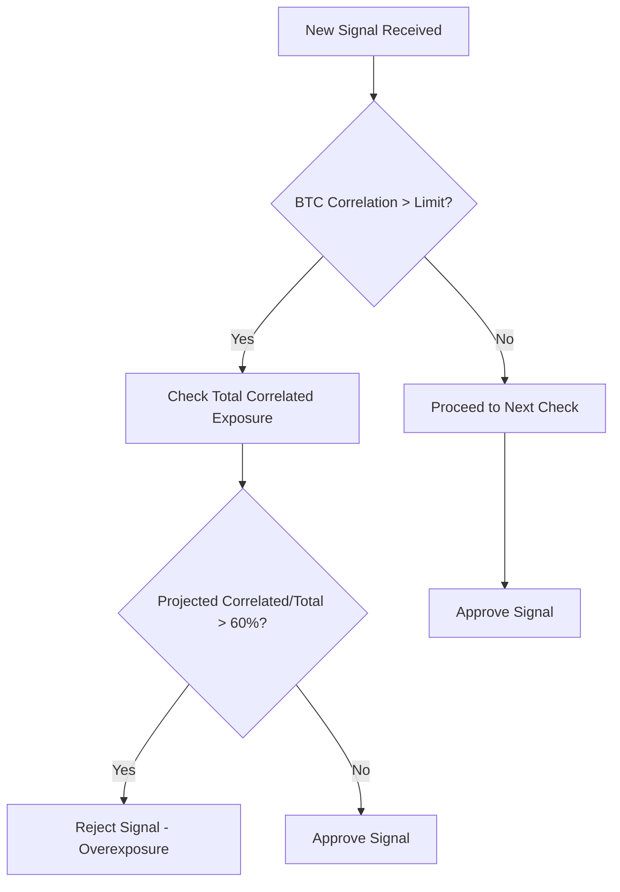
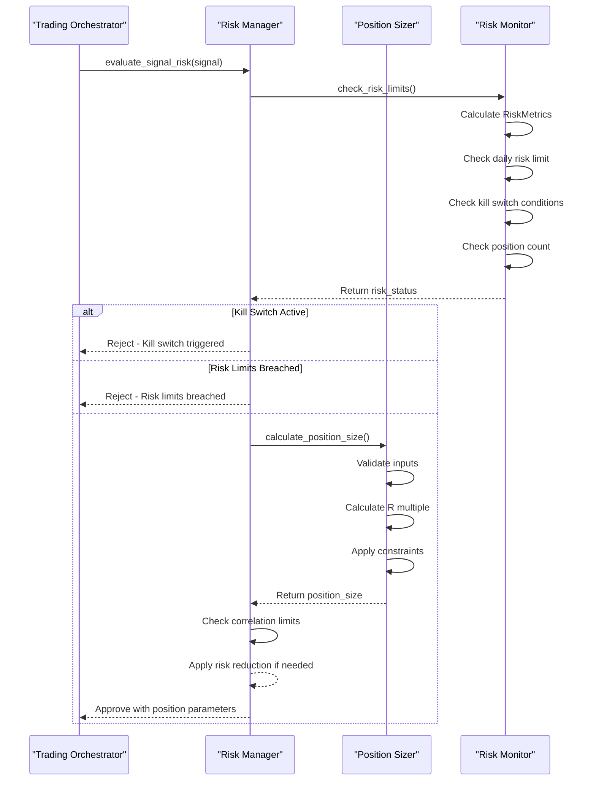
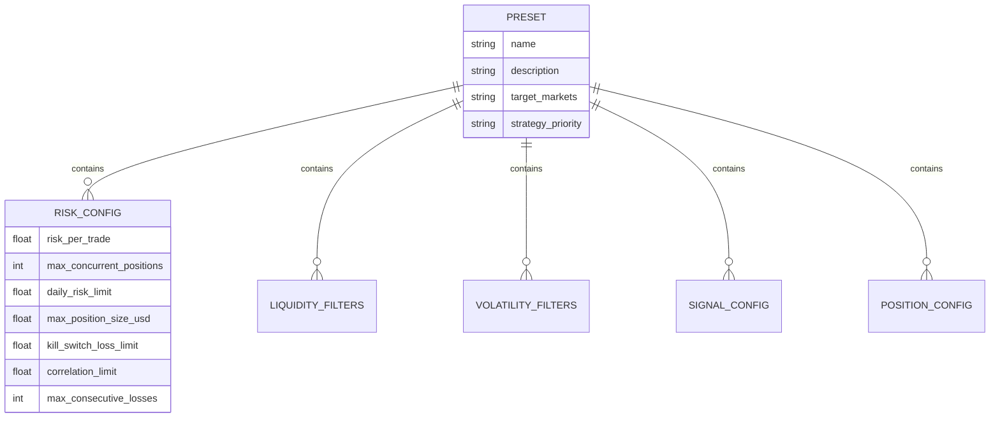

# Risk Management

<cite>
**Referenced Files in This Document**  
- [risk_manager.py](file://breakout_bot/risk/risk_manager.py)
- [FINAL_KILL_SWITCH_ANALYSIS.md](file://FINAL_KILL_SWITCH_ANALYSIS.md)
- [resource_manager.py](file://breakout_bot/core/resource_manager.py)
- [settings.py](file://breakout_bot/config/settings.py)
</cite>

## Table of Contents
1. [Introduction](#introduction)
2. [Position Sizing Logic](#position-sizing-logic)
3. [Daily Loss Limit Mechanism](#daily-loss-limit-mechanism)
4. [Kill Switch Functionality](#kill-switch-functionality)
5. [Integration with Other Components](#integration-with-other-components)
6. [Correlation Controls](#correlation-controls)
7. [Risk Assessment Workflows](#risk-assessment-workflows)
8. [Risk Configuration and Presets](#risk-configuration-and-presets)
9. [Operational Concerns](#operational-concerns)
10. [Troubleshooting Guide](#troubleshooting-guide)

## Introduction

The risk management sub-component is designed to protect capital through disciplined position sizing, loss prevention mechanisms, and portfolio-level risk controls. This system implements a comprehensive framework that calculates trade size based on account equity, enforces daily loss limits, and provides circuit breaker functionality through a kill switch mechanism.

The risk management system operates as a gatekeeper for all trading activity, ensuring that each potential trade adheres to predefined risk parameters before execution. It integrates with various components of the trading system to maintain an accurate view of current exposure and enforce concurrency limits on open positions.

This document details the implementation of key risk management features including R-multiple based position sizing, daily loss limits, kill switch functionality, correlation controls, and integration points with other system components.

**Section sources**
- [risk_manager.py](file://breakout_bot/risk/risk_manager.py#L1-L50)

## Position Sizing Logic

The position sizing logic implements R-multiple methodology to calculate appropriate trade size based on account balance, risk percentage per trade, and stop-loss distance. The system uses a structured approach to determine optimal position size while considering market conditions and exchange constraints.



**Diagram sources**
- [risk_manager.py](file://breakout_bot/risk/risk_manager.py#L47-L234)

The position sizing process follows these steps:

1. **Input Validation**: Validates signal data, account equity, and market data integrity
2. **R Dollar Calculation**: Computes the dollar amount at risk per trade using `account_equity * risk_per_trade`
3. **Stop Distance Determination**: Calculates the distance between entry price and stop-loss price
4. **Raw Quantity Computation**: Divides R dollar amount by stop distance to get initial position size
5. **Constraint Application**: Applies maximum position size limits based on USD value
6. **Depth Adjustment**: Modifies position size according to order book depth at 0.3% from mid-price
7. **Precision Rounding**: Adjusts quantity to appropriate decimal places based on asset price level
8. **Final Validation**: Ensures position meets minimum notional requirements ($10) and risk thresholds

The system also handles edge cases such as zero or negative quantities, invalid stop distances, and insufficient market depth. When depth constraints are encountered, the position size is reduced to 80% of available liquidity at the 0.3% level to avoid market impact.

**Section sources**
- [risk_manager.py](file://breakout_bot/risk/risk_manager.py#L47-L234)

## Daily Loss Limit Mechanism

The daily loss limit mechanism prevents excessive drawdowns by halting trading activities when cumulative losses exceed a predefined threshold. This feature operates on a rolling 24-hour basis, resetting at midnight local time or when account equity increases significantly.



**Diagram sources**
- [risk_manager.py](file://breakout_bot/risk/risk_manager.py#L237-L464)

Key aspects of the daily loss limit implementation:

- **Daily Tracking Initialization**: Sets daily start equity and time upon first calculation or date change
- **Dynamic Reset Logic**: Resets tracking when equity increases (indicating new deposits) or changes by more than 10%
- **Loss Calculation**: Computes daily P&L as difference between current equity and daily start equity
- **Risk Percentage Monitoring**: Tracks daily risk used as percentage of starting equity
- **Violation Detection**: Triggers breach status when daily risk used exceeds configured limit
- **Status Propagation**: Communicates violation status to trading orchestrator to prevent new entries

The system maintains state across restarts by recalculating metrics based on current market conditions rather than relying on persistent storage, ensuring accuracy even after system interruptions.

**Section sources**
- [risk_manager.py](file://breakout_bot/risk/risk_manager.py#L328-L340)

## Kill Switch Functionality

The kill switch serves as a circuit breaker that immediately stops all trading activity upon detecting catastrophic drawdown conditions. This critical safety mechanism protects against systemic failures, market anomalies, or algorithmic errors that could lead to significant capital loss.



**Diagram sources**
- [risk_manager.py](file://breakout_bot/risk/risk_manager.py#L342-L368)
- [FINAL_KILL_SWITCH_ANALYSIS.md](file://FINAL_KILL_SWITCH_ANALYSIS.md#L1-L88)

Based on the analysis in FINAL_KILL_SWITCH_ANALYSIS.md, the kill switch functionality has been refined to address previous issues:

1. **Drawdown Calculation Fix**: Implements `max(0, ...)` to prevent negative drawdown values
2. **High Water Mark Initialization**: Sets `portfolio_high_water_mark = 0.0` initially to prevent false triggers after restarts
3. **Multiple Trigger Conditions**: Monitors both maximum drawdown and extreme daily loss scenarios

The kill switch activates under two primary conditions:
- Maximum drawdown exceeds the configured `kill_switch_loss_limit`
- Extreme daily loss exceeds three times the daily risk limit

When triggered, the kill switch sets `kill_switch_triggered: True` in the risk status, which propagates to all components and prevents any new trade approvals. This state persists until manually reset, providing a safety buffer against rapid re-entry into unfavorable market conditions.

**Section sources**
- [risk_manager.py](file://breakout_bot/risk/risk_manager.py#L342-L368)
- [FINAL_KILL_SWITCH_ANALYSIS.md](file://FINAL_KILL_SWITCH_ANALYSIS.md#L1-L88)

## Integration with Other Components

The risk manager integrates with multiple system components to maintain comprehensive risk oversight and enforce trading constraints. These integrations ensure coordinated operation across the trading ecosystem.

```mermaid
graph TB
RM[Risk Manager] --> TM[Trading Orchestrator]
RM --> SM[Signal Manager]
RM --> PM[Position Manager]
RM --> EM[Execution Manager]
RM --> RM2[Resource Manager]
TM --> RM: Request trade approval
RM --> TM: Return risk evaluation
SM --> RM: Forward signals for validation
PM --> RM: Report position updates
EM --> RM: Confirm execution status
RM2 --> RM: Share resource metrics
```

**Diagram sources**
- [risk_manager.py](file://breakout_bot/risk/risk_manager.py#L467-L643)
- [resource_manager.py](file://breakout_bot/core/resource_manager.py#L1-L50)

### Signal Approval Workflow

The risk manager receives signals from the signal manager for pre-trade validation through the `evaluate_signal_risk()` method. This process involves:

1. Checking current risk status including kill switch and daily loss limits
2. Calculating appropriate position size using R-multiple methodology
3. Validating position size against constraints and market conditions
4. Assessing correlation exposure with existing positions
5. Returning approval status and position parameters

### Resource Manager Integration

While primarily focused on financial risk, the risk manager coordinates with the resource manager to monitor system health. Although direct code dependencies are minimal, operational synergy exists where resource constraints could indirectly affect risk management decisions.

### Concurrency Limits Enforcement

The system enforces maximum concurrent position limits defined in the risk configuration. The risk monitor checks the count of open positions against `max_concurrent_positions` and triggers violations when exceeded, preventing over-leveraging.

**Section sources**
- [risk_manager.py](file://breakout_bot/risk/risk_manager.py#L467-L643)
- [resource_manager.py](file://breakout_bot/core/resource_manager.py#L1-L50)

## Correlation Controls

The risk management system implements correlation controls to prevent overexposure to assets highly correlated with Bitcoin. This diversification strategy reduces portfolio vulnerability to broad market movements affecting correlated assets.



**Diagram sources**
- [risk_manager.py](file://breakout_bot/risk/risk_manager.py#L530-L554)

The correlation control process works as follows:

1. **Signal Correlation Check**: Examines the BTC correlation value from signal metadata against `correlation_limit`
2. **Exposure Projection**: Calculates projected correlated exposure if the new position were opened
3. **Threshold Evaluation**: Rejects signals that would cause correlated assets to exceed 60% of total portfolio exposure
4. **Bucket Classification**: Categorizes positions into high (>0.7), medium (0.3-0.7), and low (<0.3) correlation buckets

These controls operate dynamically, assessing both individual signal correlations and aggregate portfolio exposure to maintain balanced risk distribution across uncorrelated assets.

**Section sources**
- [risk_manager.py](file://breakout_bot/risk/risk_manager.py#L530-L554)

## Risk Assessment Workflows

The risk assessment workflow encompasses the complete pre-trade validation process, integrating multiple risk checks into a cohesive decision-making pipeline. This sequence ensures comprehensive evaluation before approving any trade.



**Diagram sources**
- [risk_manager.py](file://breakout_bot/risk/risk_manager.py#L467-L554)

The workflow proceeds through these stages:

1. **Initial Risk Status Check**: Evaluates overall portfolio risk including kill switch status and daily loss limits
2. **Position Sizing Calculation**: Determines appropriate trade size using R-multiple methodology
3. **Validation and Constraints**: Ensures position meets minimum notional, precision, and risk percentage requirements
4. **Correlation Assessment**: Verifies the new position won't create overexposure to correlated assets
5. **Risk Adjustment**: Reduces position size by 50% when approaching risk thresholds
6. **Final Approval Decision**: Returns comprehensive risk evaluation to the trading orchestrator

This systematic approach ensures that every trade undergoes rigorous scrutiny before execution, maintaining strict adherence to risk management principles.

**Section sources**
- [risk_manager.py](file://breakout_bot/risk/risk_manager.py#L467-L554)

## Risk Configuration and Presets

Risk parameters are configured through trading presets that define comprehensive risk profiles. These JSON-based configurations allow flexible adjustment of risk parameters without code changes.



**Diagram sources**
- [settings.py](file://breakout_bot/config/settings.py#L17-L50)

Key risk configuration parameters include:

- **risk_per_trade**: Percentage of account equity risked per trade (e.g., 0.006 = 0.6%)
- **max_concurrent_positions**: Maximum number of simultaneous open positions (1-10)
- **daily_risk_limit**: Maximum allowable daily loss as percentage of equity
- **max_position_size_usd**: Absolute cap on position size in USD
- **kill_switch_loss_limit**: Drawdown threshold that triggers circuit breaker
- **correlation_limit**: Maximum allowed correlation with Bitcoin
- **max_consecutive_losses**: Number of consecutive losing trades before intervention

These parameters are validated upon loading to ensure they fall within reasonable bounds, preventing configuration errors that could compromise risk management effectiveness.

**Section sources**
- [settings.py](file://breakout_bot/config/settings.py#L17-L50)

## Operational Concerns

The risk management system addresses several operational concerns to ensure reliable performance in production environments, including state persistence, fail-safe defaults, and graceful degradation under stress conditions.

### State Persistence During Restarts

The system handles restarts gracefully by recalculating risk metrics based on current market data rather than relying on potentially stale stored state. Daily tracking resets appropriately when dates change or equity increases, preventing false kill switch triggers after system restarts.

### Fail-Safe Defaults

The risk configuration includes validation rules that enforce reasonable parameter ranges:
- Percentage values must be between 0 and 1
- Maximum concurrent positions limited to 1-10 range
- Maximum consecutive losses constrained to 1-20 range

These validations prevent configuration errors that could lead to excessive risk exposure.

### Graceful Degradation

When market data is unavailable or incomplete, the system fails safely by rejecting trades rather than making assumptions about risk parameters. The position sizer returns invalid results with clear reasons when critical data like market depth is missing.

### Memory Management

While the risk manager itself has minimal memory footprint, it coordinates with the resource manager to monitor system resources. Under memory pressure, the broader system performs garbage collection and cache clearing to maintain stability.

**Section sources**
- [risk_manager.py](file://breakout_bot/risk/risk_manager.py#L245-L265)
- [settings.py](file://breakout_bot/config/settings.py#L20-L35)

## Troubleshooting Guide

This section addresses common issues encountered with the risk management system and provides diagnostic guidance for resolution.

### Unexpected Kill Switch Triggers

**Symptoms**: System halts trading despite moderate losses
**Causes and Solutions**:
- **Stale high water mark**: After restarts, verify `portfolio_high_water_mark` initialization to 0.0
- **Incorrect date handling**: Ensure daily tracking resets at midnight local time
- **Equity reporting inconsistencies**: Confirm consistent equity values across components

Diagnostic command: `grep "Kill switch triggered" logs/*.log`

### Incorrect Position Sizing

**Symptoms**: Trade sizes inconsistent with expected R-multiple calculations
**Causes and Solutions**:
- **Depth limitations**: Check if position size was reduced due to insufficient order book depth
- **Precision rounding**: Verify quantity rounding appropriate for asset price level
- **Max position caps**: Confirm position not limited by `max_position_size_usd` constraint

Diagnostic command: `grep "Position size limited" logs/*.log`

### Signals Rejected Despite Available Capacity

**Symptoms**: Valid signals rejected when below position limits
**Causes and Solutions**:
- **Correlation filters**: Check if signal or portfolio exceeds BTC correlation thresholds
- **Minimum notional**: Verify position meets $10 minimum notional requirement
- **Risk reduction mode**: Determine if system is in risk-reduced state due to approaching limits

Diagnostic command: `grep "Invalid position size" logs/*.log`

### Daily Loss Limit Resets

**Symptoms**: Daily loss counter resets unexpectedly
**Causes and Solutions**:
- **Equity increases**: System resets when equity rises (new deposits or profits)
- **Large equity changes**: Resets occur when equity changes by more than 10%
- **Midnight rollover**: Automatic reset at start of new calendar day

Monitoring recommendation: Track `daily_start_equity` and `daily_start_time` variables in metrics

**Section sources**
- [risk_manager.py](file://breakout_bot/risk/risk_manager.py#L245-L305)
- [FINAL_KILL_SWITCH_ANALYSIS.md](file://FINAL_KILL_SWITCH_ANALYSIS.md#L1-L88)