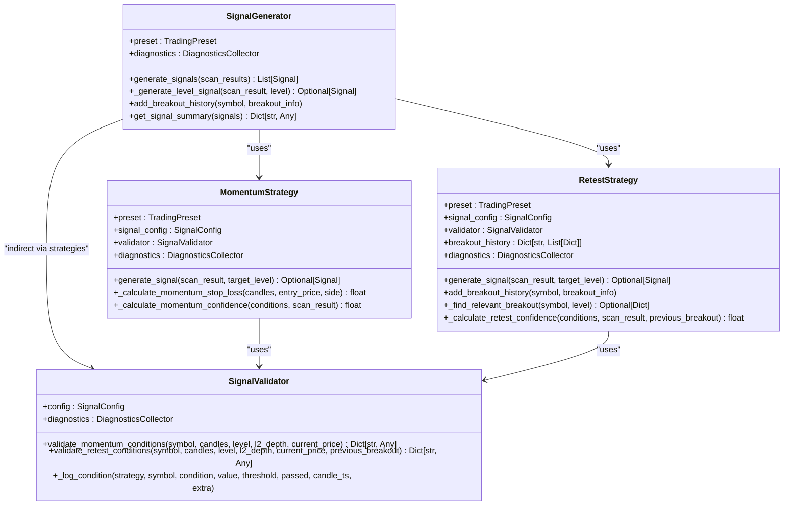
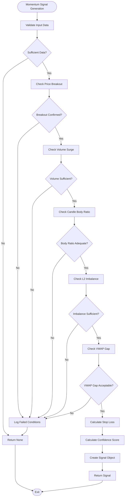
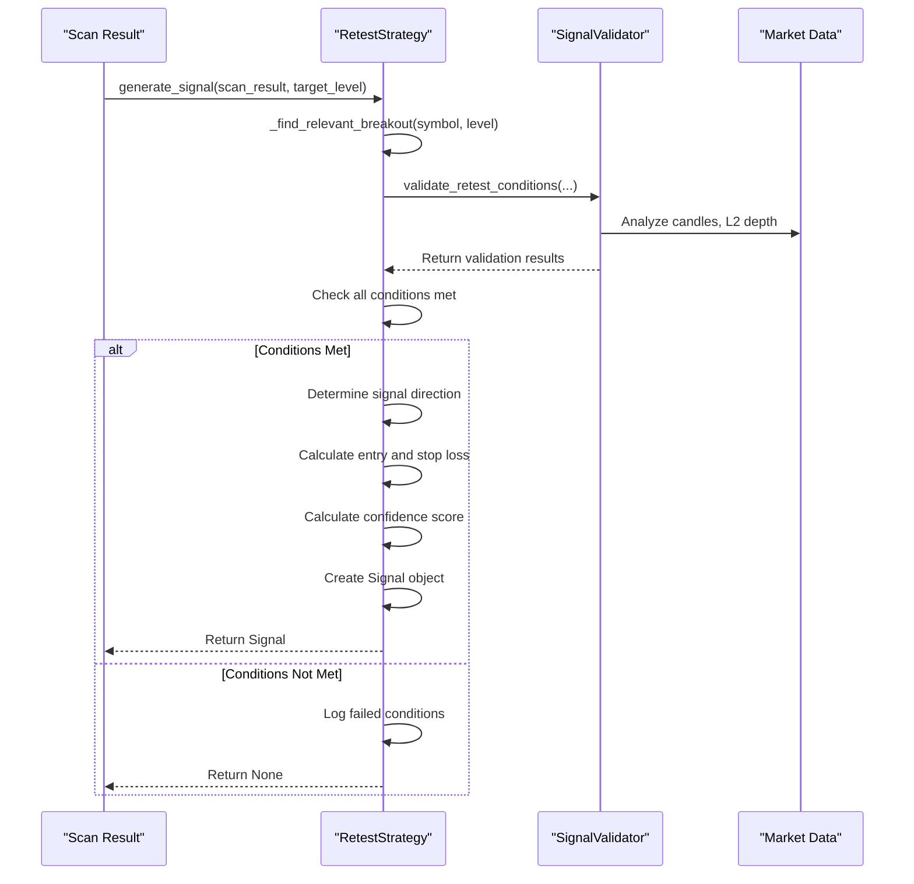
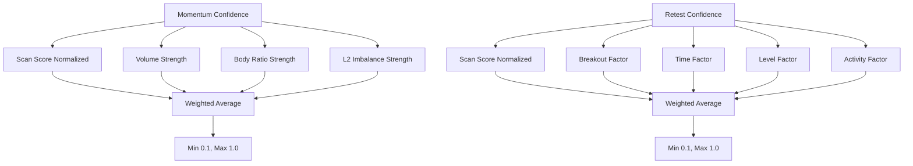
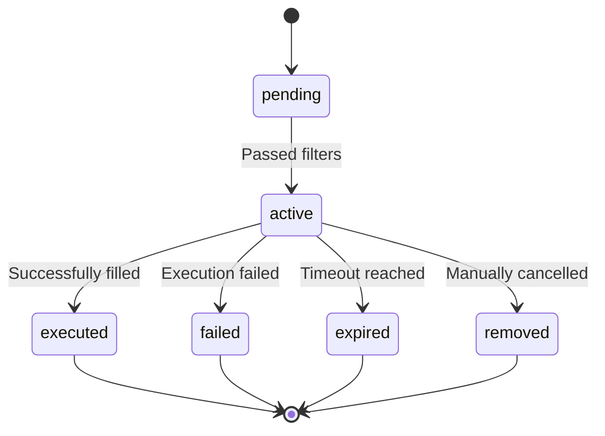
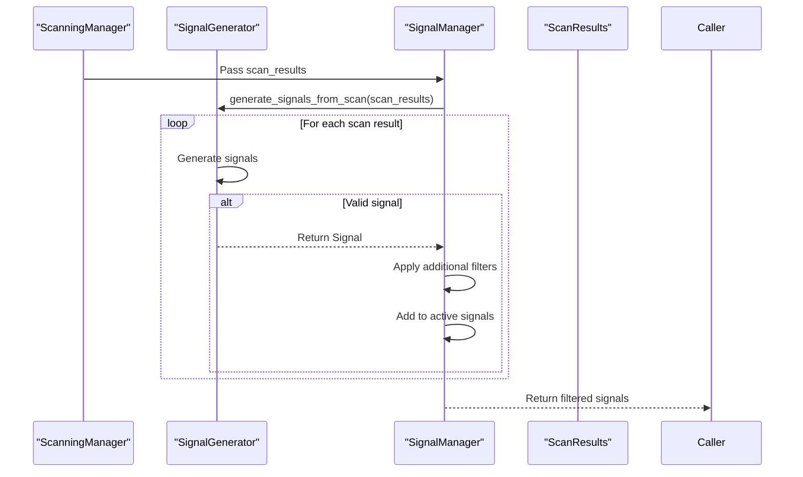
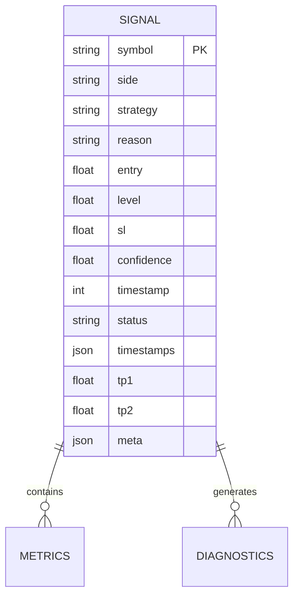

# Signal Generation

<cite>
**Referenced Files in This Document **  
- [signal_generator.py](file://breakout_bot/signals/signal_generator.py)
- [data/models.py](file://breakout_bot/data/models.py)
- [config/settings.py](file://breakout_bot/config/settings.py)
- [core/scanning_manager.py](file://breakout_bot/core/scanning_manager.py)
- [core/signal_manager.py](file://breakout_bot/core/signal_manager.py)
</cite>

## Table of Contents
1. [Introduction](#introduction)
2. [Signal Generation Architecture](#signal-generation-architecture)
3. [Momentum Strategy Implementation](#momentum-strategy-implementation)
4. [Retest Strategy Implementation](#retest-strategy-implementation)
5. [Signal Validation and Confidence Scoring](#signal-validation-and-confidence-scoring)
6. [Signal Lifecycle Management](#signal-lifecycle-management)
7. [Integration with Scanning and Signal Managers](#integration-with-scanning-and-signal-managers)
8. [Signal Object Structure](#signal-object-structure)
9. [Configuration Parameters](#configuration-parameters)
10. [Debugging and Diagnostics](#debugging-and-diagnostics)

## Introduction

The signal generation sub-component transforms market scan results into actionable trade signals using two primary strategies: momentum-based entries after confirmed breakouts and retest strategies where price returns to broken resistance/support levels. The system analyzes price action patterns, volume spikes, and confirmation candles to validate breakout integrity, then ranks signals by quality based on factors like breakout strength, volume confirmation, and time-frame alignment.

This document details the implementation of the `SignalGenerator` class and its associated components, explaining how signals are created, validated, and managed throughout their lifecycle. The system integrates with the scanning manager which feeds fresh candidates, and the signal manager which queues and processes them.

**Section sources**
- [signal_generator.py](file://breakout_bot/signals/signal_generator.py#L1-L50)

## Signal Generation Architecture

The signal generation system follows a modular architecture with distinct components for strategy implementation, validation, and coordination. The main entry point is the `SignalGenerator` class, which coordinates between momentum and retest strategies based on the configured priority.

**Diagram sources **
- [signal_generator.py](file://breakout_bot/signals/signal_generator.py#L1-L829)

**Section sources**
- [signal_generator.py](file://breakout_bot/signals/signal_generator.py#L1-L829)

## Momentum Strategy Implementation

The momentum strategy generates signals when price breaks through key support or resistance levels with confirming volume and price action characteristics. The strategy requires several conditions to be met before generating a signal:

1. **Price Breakout**: Price must close beyond the level price with a configurable epsilon margin
2. **Volume Surge**: Current volume must exceed median volume by a configurable multiplier
3. **Candle Body Ratio**: The candle body must represent a minimum percentage of the total range
4. **L2 Order Book Imbalance**: Significant order book imbalance in the direction of the breakout
5. **VWAP Gap**: Price deviation from VWAP must not exceed a maximum threshold based on ATR

The strategy determines position direction based on whether the level was resistance (long entry) or support (short entry). Stop loss is calculated as the greater of the swing low/high over the last 10 candles or entry price minus/plus 1.2 times ATR.

**Diagram sources **
- [signal_generator.py](file://breakout_bot/signals/signal_generator.py#L200-L400)

**Section sources**
- [signal_generator.py](file://breakout_bot/signals/signal_generator.py#L200-L400)

## Retest Strategy Implementation

The retest strategy generates signals when price returns to previously broken support/resistance levels, providing a second entry opportunity. This strategy relies on the detection of prior breakouts and subsequent price retracement to the former level.

Key requirements for retest signals include:
- **Level Retest**: Price must return within 0.5% of the broken level
- **Pierce Tolerance**: Price penetration beyond the level must not exceed a maximum threshold in ATR multiples
- **Trading Activity**: Recent trading volume must maintain at least 80% of historical average
- **Previous Breakout**: A confirmed breakout must have occurred within the last 24 hours but more than 1 hour ago
- **L2 Imbalance**: Order book imbalance must meet minimum threshold

The retest strategy maintains a history of detected breakouts in the `breakout_history` dictionary, tracking symbols and their breakout information. When evaluating potential retest opportunities, it searches this history for relevant breakouts near the current level.

**Diagram sources **
- [signal_generator.py](file://breakout_bot/signals/signal_generator.py#L400-L600)

**Section sources**
- [signal_generator.py](file://breakout_bot/signals/signal_generator.py#L400-L600)

## Signal Validation and Confidence Scoring

Signal validation is performed by the `SignalValidator` class, which evaluates both momentum and retest conditions using configurable thresholds. The validator logs all condition evaluations through the diagnostics system when enabled, providing detailed insights into why signals were or weren't generated.

### Confidence Scoring Mechanisms

Both strategies implement confidence scoring that ranks signals by quality based on multiple factors:

**Momentum Confidence Calculation:**
- Scan score normalized (40% weight)
- Volume strength (30% weight)
- Candle body ratio strength (20% weight)
- L2 imbalance strength (10% weight)

**Retest Confidence Calculation:**
- Scan score normalized (30% weight)
- Presence of previous breakout (30% weight)
- Time since breakout (20% weight)
- Level quality (touches count) (10% weight)
- Trading activity ratio (10% weight)

The confidence score is constrained between 0.1 and 1.0, ensuring even valid signals have a minimum quality threshold. This scoring mechanism allows the system to prioritize higher-quality signals when position limits are reached.

**Diagram sources **
- [signal_generator.py](file://breakout_bot/signals/signal_generator.py#L350-L390)
- [signal_generator.py](file://breakout_bot/signals/signal_generator.py#L550-L590)

**Section sources**
- [signal_generator.py](file://breakout_bot/signals/signal_generator.py#L350-L390)
- [signal_generator.py](file://breakout_bot/signals/signal_generator.py#L550-L590)

## Signal Lifecycle Management

Signals progress through a defined lifecycle from detection to execution or expiration. The system implements rejection criteria for low-confidence or high-correlation opportunities to maintain portfolio quality.

### Signal States
- **pending**: Signal created but not yet active
- **active**: Signal accepted and queued for execution
- **executed**: Signal successfully executed
- **failed**: Signal execution failed
- **expired**: Signal timed out without execution
- **removed**: Signal manually removed

The signal manager enforces a maximum active signals limit and signal timeout duration. Expired signals are automatically cleaned up during each generation cycle. Duplicate signals are filtered out based on symbol, side, and entry price proximity.

**Diagram sources **
- [data/models.py](file://breakout_bot/data/models.py#L133-L188)
- [core/signal_manager.py](file://breakout_bot/core/signal_manager.py#L180-L189)

**Section sources**
- [data/models.py](file://breakout_bot/data/models.py#L133-L188)
- [core/signal_manager.py](file://breakout_bot/core/signal_manager.py#L180-L189)

## Integration with Scanning and Signal Managers

The signal generation system integrates tightly with both the scanning manager and signal manager components, forming a complete pipeline from market analysis to trade execution.

### Integration Flow
1. **Scanning Manager** executes market scans and produces `ScanResult` objects
2. **Signal Manager** receives scan results and invokes `SignalGenerator`
3. **Signal Generator** processes scan results and generates `Signal` objects
4. **Signal Manager** filters, deduplicates, and queues valid signals

The scanning manager provides comprehensive market data including 5-minute candles, L2 depth information, and technical indicators required for signal validation. The signal manager handles additional filtering based on risk parameters and portfolio constraints.

**Diagram sources **
- [core/scanning_manager.py](file://breakout_bot/core/scanning_manager.py#L1-L292)
- [core/signal_manager.py](file://breakout_bot/core/signal_manager.py#L1-L329)

**Section sources**
- [core/scanning_manager.py](file://breakout_bot/core/scanning_manager.py#L1-L292)
- [core/signal_manager.py](file://breakout_bot/core/signal_manager.py#L1-L329)

## Signal Object Structure

The `Signal` model defines the structure of generated trade signals, containing all necessary information for execution and analysis. Each signal includes entry parameters, risk management values, and metadata for tracking and reporting.

### Core Signal Properties
- **symbol**: Trading pair symbol (e.g., BTC/USDT)
- **side**: Trade direction (long or short)
- **strategy**: Generation strategy (momentum or retest)
- **reason**: Human-readable explanation of signal rationale
- **entry**: Suggested entry price
- **level**: Key level price that triggered the signal
- **sl**: Stop loss price
- **confidence**: Quality score between 0 and 1
- **timestamp**: Generation time in milliseconds
- **status**: Current lifecycle state
- **timestamps**: Dictionary of key timestamps
- **tp1, tp2**: Take profit levels
- **meta**: Additional metadata dictionary

The model includes validators to ensure data integrity, such as requiring confidence scores between 0 and 1 and positive prices. It also provides computed properties like `risk_reward_ratio` for quick assessment of signal quality.

**Diagram sources **
- [data/models.py](file://breakout_bot/data/models.py#L133-L188)

**Section sources**
- [data/models.py](file://breakout_bot/data/models.py#L133-L188)

## Configuration Parameters

The signal generation system is highly configurable through the `SignalConfig` class, allowing traders to tune sensitivity and behavior based on market conditions and risk tolerance.

### Key Configuration Parameters

| Parameter | Description | Default/Range |
|---------|------------|-------------|
| momentum_volume_multiplier | Minimum volume surge for momentum signals | Configurable |
| momentum_body_ratio_min | Minimum candle body ratio for momentum | 0.0-1.0 |
| momentum_epsilon | Breakout price threshold | Configurable |
| retest_pierce_tolerance | Maximum price penetration for retests | Configurable |
| retest_max_pierce_atr | Maximum pierce in ATR multiples | Configurable |
| l2_imbalance_threshold | Minimum order book imbalance | Configurable |
| vwap_gap_max_atr | Maximum VWAP gap in ATR multiples | Configurable |

These parameters are loaded from JSON preset files and can be adjusted without code changes. The system validates configuration values to ensure they fall within reasonable ranges.

**Section sources**
- [config/settings.py](file://breakout_bot/config/settings.py#L1-L368)

## Debugging and Diagnostics

The system provides comprehensive debugging capabilities through the diagnostics collector and detailed logging. When enabled, the system records condition evaluations, failure reasons, and signal summaries.

### Debugging Strategies
- **Condition Logging**: All validation conditions are logged with values and thresholds
- **Diagnostics Recording**: Detailed diagnostic records for each signal generation attempt
- **Filter Tracking**: Visibility into which filters caused signal rejection
- **History Inspection**: Access to recent signal history and statistics

The `debug_signal_generation.py` script provides tools for investigating why certain signals were or weren't generated, allowing traders to fine-tune parameters and improve strategy performance.

**Section sources**
- [signal_generator.py](file://breakout_bot/signals/signal_generator.py#L1-L829)
- [core/diagnostics](file://breakout_bot/diagnostics)