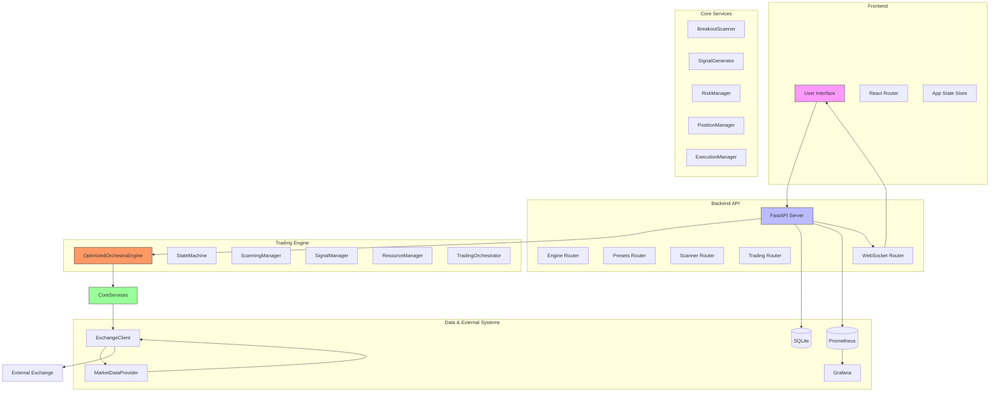
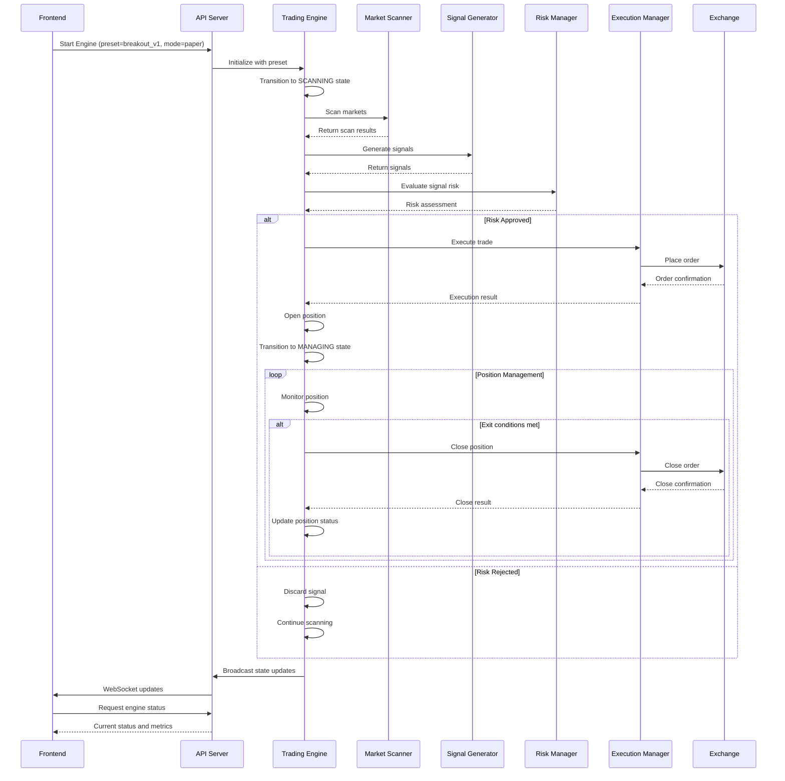
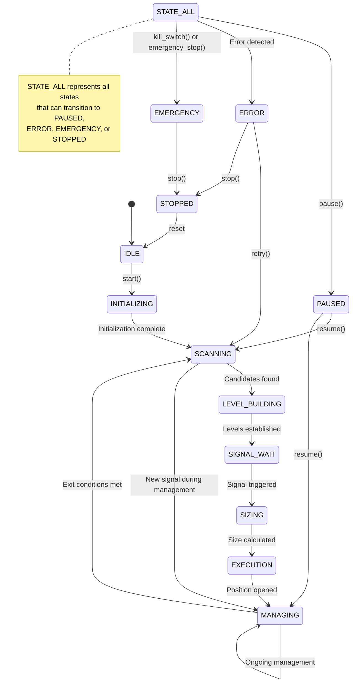

# System Overview

<cite>
**Referenced Files in This Document**   
- [engine.py](file://breakout_bot/core/engine.py)
- [state_machine.py](file://breakout_bot/core/state_machine.py)
- [main.py](file://breakout_bot/api/main.py)
- [engine.py](file://breakout_bot/api/routers/engine.py)
- [market_scanner.py](file://breakout_bot/scanner/market_scanner.py)
- [signal_generator.py](file://breakout_bot/signals/signal_generator.py)
- [risk_manager.py](file://breakout_bot/risk/risk_manager.py)
- [position_manager.py](file://breakout_bot/position/position_manager.py)
- [execution/manager.py](file://breakout_bot/execution/manager.py)
- [websocket.py](file://breakout_bot/api/websocket.py)
- [settings.py](file://breakout_bot/config/settings.py)
- [EngineControl.tsx](file://frontend/src/pages/EngineControl.tsx)
</cite>

## Table of Contents
1. [Introduction](#introduction)
2. [Core Architecture](#core-architecture)
3. [System Workflow](#system-workflow)
4. [Key Components](#key-components)
5. [State Machine and Engine Control](#state-machine-and-engine-control)
6. [Preset-Based Configuration](#preset-based-configuration)
7. [Risk Management and Kill Switch](#risk-management-and-kill-switch)
8. [Real-Time Monitoring and Diagnostics](#real-time-monitoring-and-diagnostics)
9. [Practical Usage Examples](#practical-usage-examples)
10. [Technical Design Principles](#technical-design-principles)

## Introduction

The Breakout Trading System is an automated cryptocurrency trading bot designed to identify and execute breakout trading opportunities with integrated risk management and real-time monitoring. The system follows a modular, event-driven architecture that separates concerns across multiple components while maintaining high performance and reliability.

At its core, the system operates as a state machine-driven engine that systematically scans markets, generates trading signals, assesses risk, executes trades, and manages open positions. The architecture is built around key principles of separation of concerns, with specialized components handling specific aspects of the trading process.

The system consists of three main layers:
- **Backend**: Built with FastAPI (Python) for RESTful API endpoints and WebSocket communication
- **Frontend**: Implemented with React/TypeScript for a responsive user interface
- **Supporting Components**: Includes monitoring with Prometheus/Grafana and deployment via Docker

This document provides a comprehensive overview of the system's architecture, workflow, key features, and technical design decisions, using terminology consistent with the codebase such as 'engine', 'scanner', 'signal', 'preset', and 'kill switch'.

## Core Architecture

The Breakout Trading System follows a layered microservices-inspired architecture where each component has a well-defined responsibility and communicates through well-defined interfaces. The system is organized into several key modules that work together to identify and execute trading opportunities.



**Diagram sources**
- [main.py](file://breakout_bot/api/main.py)
- [engine.py](file://breakout_bot/core/engine.py)
- [market_scanner.py](file://breakout_bot/scanner/market_scanner.py)
- [signal_generator.py](file://breakout_bot/signals/signal_generator.py)
- [risk_manager.py](file://breakout_bot/risk/risk_manager.py)
- [position_manager.py](file://breakout_bot/position/position_manager.py)
- [execution/manager.py](file://breakout_bot/execution/manager.py)

**Section sources**
- [main.py](file://breakout_bot/api/main.py)
- [engine.py](file://breakout_bot/core/engine.py)

## System Workflow

The Breakout Trading System follows a systematic workflow from market scanning to position tracking, with each step building upon the previous one to ensure disciplined trading execution. The workflow is driven by a state machine that ensures proper sequencing of operations.



**Diagram sources**
- [engine.py](file://breakout_bot/core/engine.py)
- [market_scanner.py](file://breakout_bot/scanner/market_scanner.py)
- [signal_generator.py](file://breakout_bot/signals/signal_generator.py)
- [risk_manager.py](file://breakout_bot/risk/risk_manager.py)
- [execution/manager.py](file://breakout_bot/execution/manager.py)
- [websocket.py](file://breakout_bot/api/websocket.py)

**Section sources**
- [engine.py](file://breakout_bot/core/engine.py)

## Key Components

The Breakout Trading System is composed of several key components that work together to identify and execute trading opportunities. Each component has a specific responsibility and follows the Single Responsibility Principle.

### Market Scanner

The Market Scanner component identifies potential breakout candidates by analyzing market data across multiple dimensions including liquidity, volatility, and volume. It applies a series of filters to narrow down the universe of tradable assets to those that meet the criteria defined in the trading preset.

The scanner evaluates markets based on:
- **Liquidity filters**: 24-hour volume, open interest, spread, and order book depth
- **Volatility filters**: ATR ratio, Bollinger Band width, and volume surge
- **Correlation filters**: BTC correlation to manage portfolio risk

Results are scored using a weighted scoring system that prioritizes markets with strong breakout potential.

### Signal Generator

The Signal Generator creates entry signals based on level breakouts and market conditions. It implements two primary strategies:

1. **Momentum Strategy**: Triggers when price breaks through resistance/support with confirming volume and candle characteristics
2. **Retest Strategy**: Triggers when price returns to test a previously broken level after a breakout

Signals include detailed metadata such as entry price, stop loss, confidence score, and take profit levels, providing a complete trading blueprint for execution.

### Risk Manager

The Risk Manager enforces strict risk controls at both the position and portfolio levels. It implements R-based position sizing where risk is expressed as a percentage of account equity. Key risk controls include:

- Maximum concurrent positions
- Daily risk limits
- Correlation exposure limits
- Kill switch mechanisms for extreme drawdowns

The risk manager evaluates each potential trade against current portfolio conditions before approval.

### Position Manager

The Position Manager handles dynamic position management after entry, including:
- Stop loss updates (moving to breakeven, trailing stops)
- Take profit execution (partial exits at predefined R multiples)
- Add-on position logic for strengthening winning positions
- Time-based position closure

Positions are actively managed according to the parameters defined in the trading preset.

### Execution Manager

The Execution Manager handles order placement with consideration for market microstructure. It implements TWAP (Time-Weighted Average Price) slicing for large orders to minimize market impact and can use iceberg orders when appropriate. The execution strategy adapts to current market depth conditions to optimize fill quality.

**Section sources**
- [market_scanner.py](file://breakout_bot/scanner/market_scanner.py)
- [signal_generator.py](file://breakout_bot/signals/signal_generator.py)
- [risk_manager.py](file://breakout_bot/risk/risk_manager.py)
- [position_manager.py](file://breakout_bot/position/position_manager.py)
- [execution/manager.py](file://breakout_bot/execution/manager.py)

## State Machine and Engine Control

The trading engine is controlled by a finite state machine that ensures proper sequencing of operations and prevents invalid state transitions. The state machine defines the lifecycle of the trading process from initialization to execution and position management.



**Diagram sources**
- [state_machine.py](file://breakout_bot/core/state_machine.py)
- [engine.py](file://breakout_bot/core/engine.py)

**Section sources**
- [state_machine.py](file://breakout_bot/core/state_machine.py)
- [engine.py](file://breakout_bot/core/engine.py)

The engine supports several control commands that allow users to manage its operation:
- **start**: Begin the trading cycle with a specified preset
- **stop**: Halt all trading activity
- **pause**: Temporarily suspend trading while maintaining state
- **resume**: Resume trading from a paused state
- **emergency_stop**: Immediately cease all activity due to critical issues
- **reload**: Reload configuration without restarting

These commands are exposed through the API and accessible via the frontend interface, providing granular control over the trading engine.

## Preset-Based Configuration

The system uses a preset-based configuration model that allows traders to define and switch between different trading strategies quickly. Presets are JSON files stored in the `config/presets` directory and contain comprehensive settings for all aspects of the trading system.

Each preset includes configuration for:
- **Risk parameters**: Risk per trade, maximum positions, daily risk limits
- **Filter criteria**: Liquidity, volatility, and correlation thresholds
- **Signal generation**: Strategy priorities and entry conditions
- **Position management**: Take profit levels, trailing stop parameters
- **Execution settings**: Order type preferences and slicing parameters

Example preset structure:
```json
{
  "name": "breakout_v1",
  "description": "Standard breakout strategy with balanced risk",
  "target_markets": "High liquidity top 30 futures",
  "risk": {
    "risk_per_trade": 0.006,
    "max_concurrent_positions": 3,
    "daily_risk_limit": 0.02,
    "kill_switch_loss_limit": 0.03
  },
  "liquidity_filters": {
    "min_24h_volume_usd": 1000000,
    "max_spread_bps": 15,
    "min_depth_usd_0_3pct": 50000
  }
}
```

Users can select different presets through the frontend interface, allowing quick switching between strategies optimized for different market conditions or asset classes.

**Section sources**
- [settings.py](file://breakout_bot/config/settings.py)
- [EngineControl.tsx](file://frontend/src/pages/EngineControl.tsx)

## Risk Management and Kill Switch

Risk management is a fundamental aspect of the Breakout Trading System, implemented through multiple layers of protection that operate at both the position and portfolio levels.

### Position-Level Risk Controls

At the position level, risk is managed through:
- **R-based position sizing**: Position size is calculated based on account equity and stop loss distance
- **Stop loss placement**: Initial stop loss is set at a distance that represents a fixed R risk
- **Depth-aware sizing**: Position size is constrained by available order book depth to prevent excessive slippage

### Portfolio-Level Risk Controls

At the portfolio level, risk is managed through:
- **Concurrent position limits**: Maximum number of open positions to prevent overexposure
- **Daily risk limits**: Maximum allowable loss per trading day
- **Correlation exposure**: Limits on exposure to highly correlated assets

### Kill Switch Mechanism

The kill switch is a critical safety feature that automatically halts trading when predefined risk thresholds are breached. The kill switch is triggered when:
- Daily drawdown exceeds the configured limit (e.g., 3% of equity)
- Consecutive losses reach a predefined threshold
- System health checks fail (exchange connectivity, resource constraints)

When activated, the kill switch immediately transitions the engine to the EMERGENCY state, preventing new trades while allowing existing positions to be managed according to their exit rules. This prevents catastrophic losses during periods of extreme market volatility or system issues.

The kill switch can also be manually activated through the frontend interface for immediate cessation of trading activity.

**Section sources**
- [risk_manager.py](file://breakout_bot/risk/risk_manager.py)
- [engine.py](file://breakout_bot/core/engine.py)

## Real-Time Monitoring and Diagnostics

The system provides comprehensive real-time monitoring and diagnostic capabilities through multiple channels.

### WebSocket-Powered Updates

The frontend receives real-time updates via WebSocket connections that broadcast:
- Engine state transitions
- New trading signals
- Position updates
- Order executions
- System alerts and warnings

This enables the dashboard to display live information with minimal latency, providing traders with up-to-the-second visibility into system operations.

### Diagnostic Reporting

The system includes a diagnostics framework that records detailed information about:
- Filter outcomes for scanned markets
- Signal generation attempts and failures
- Risk assessment decisions
- Execution performance

Diagnostic data is used to generate reports that identify patterns in near-miss opportunities, helping traders refine their strategy parameters over time.

### Performance Metrics

The system tracks and exposes key performance metrics including:
- Uptime and cycle count
- Latency measurements
- Signal generation statistics
- Trade performance (win rate, average R, Sharpe ratio)
- Resource utilization (CPU, memory)

These metrics are available through API endpoints and displayed in the frontend dashboard, enabling continuous performance monitoring.

**Section sources**
- [websocket.py](file://breakout_bot/api/websocket.py)
- [engine.py](file://breakout_bot/core/engine.py)
- [diagnostics/reporting.py](file://breakout_bot/diagnostics/reporting.py)

## Practical Usage Examples

### Starting the Engine with a Specific Preset

To start the trading engine with a specific preset:

1. Access the Engine Control page in the frontend
2. Select the desired preset (e.g., "breakout_v1" or "high_liquidity_top30")
3. Choose the trading mode (paper or live)
4. Click the "Start Engine" button

The system will initialize all components, load the selected preset configuration, and begin scanning markets according to the defined schedule.

### Monitoring Trades via the Dashboard

The dashboard provides real-time visibility into active trading activity:

- **Engine Status Panel**: Shows current state, open positions, and system latency
- **Available Commands**: Displays which control actions are currently permitted
- **Performance Metrics**: Tracks uptime, cycle count, and trading statistics
- **Event Feed**: Lists recent system events and trading activities

Traders can monitor position performance, review recent signals, and track overall system health through the unified interface.

### Reviewing Performance Metrics

Performance metrics are available through the Performance page and include:

- **Trade Statistics**: Total trades, win rate, average R multiple
- **Risk Metrics**: Maximum drawdown, consecutive wins/losses
- **Profit Factor**: Ratio of gross profits to gross losses
- **Equity Curve**: Historical performance visualization

These metrics help traders evaluate strategy effectiveness and make informed decisions about parameter adjustments.

**Section sources**
- [EngineControl.tsx](file://frontend/src/pages/EngineControl.tsx)
- [engine.py](file://breakout_bot/core/engine.py)

## Technical Design Principles

The Breakout Trading System embodies several key technical design principles that contribute to its reliability, maintainability, and performance.

### Event-Driven Communication

Components communicate primarily through state changes and events rather than direct method calls. The state machine serves as the central coordination mechanism, with components reacting to state transitions rather than polling for work. This reduces coupling between components and creates a more predictable execution flow.

### Layered Service Architecture

The system follows a layered architecture where higher-level components orchestrate lower-level services:
- **Orchestration Layer**: TradingOrchestrator coordinates the overall trading cycle
- **Service Layer**: Specialized managers handle specific domains (scanning, signals, risk)
- **Utility Layer**: Reusable components provide cross-cutting concerns (logging, monitoring)

This separation of concerns makes the system easier to test, debug, and extend.

### Caching for Performance

Critical API endpoints use aggressive caching to provide sub-10ms response times. The engine maintains cached copies of:
- Current status and state
- Active positions
- Open signals
- System metrics

Cache invalidation occurs on state changes, ensuring data consistency while maximizing performance.

### Resilience and Error Handling

The system incorporates multiple resilience patterns:
- Circuit breakers to prevent cascading failures
- Retry mechanisms with exponential backoff
- Comprehensive logging with structured context
- Health checks for external dependencies

These patterns ensure the system can gracefully handle transient issues and recover from errors without requiring manual intervention.

**Section sources**
- [engine.py](file://breakout_bot/core/engine.py)
- [state_machine.py](file://breakout_bot/core/state_machine.py)
- [enhanced_logger.py](file://breakout_bot/utils/enhanced_logger.py)