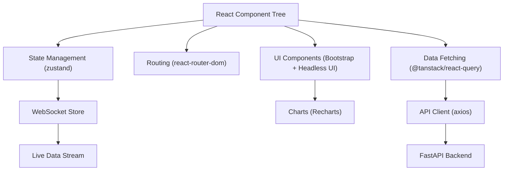
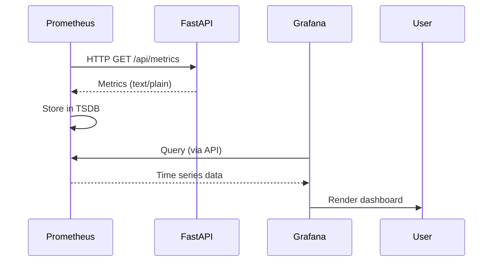
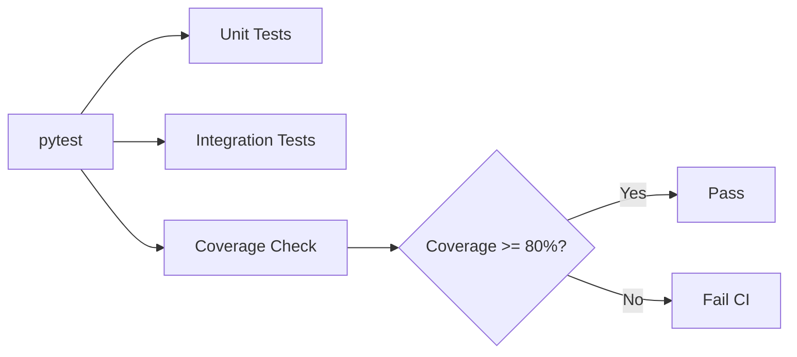
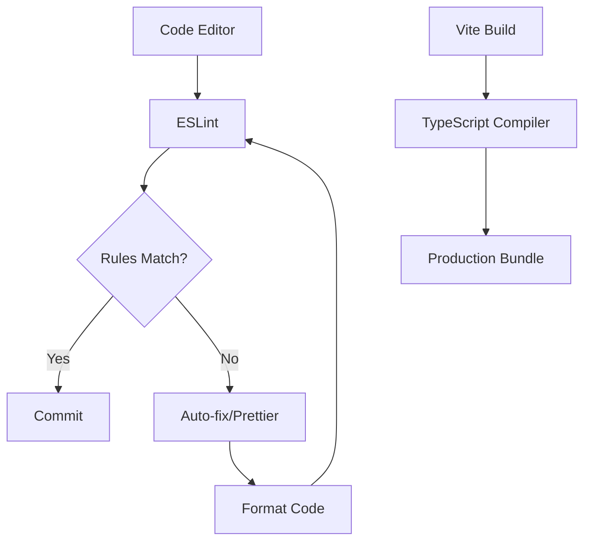

# Technology Stack

<cite>
**Referenced Files in This Document**   
- [breakout_bot/api/main.py](file://breakout_bot/api/main.py)
- [pyproject.toml](file://pyproject.toml)
- [frontend/package.json](file://frontend/package.json)
- [Dockerfile](file://Dockerfile)
- [frontend/Dockerfile](file://frontend/Dockerfile)
- [docker-compose.yml](file://docker-compose.yml)
- [frontend/nginx.conf](file://frontend/nginx.conf)
- [monitoring/prometheus.yml](file://monitoring/prometheus.yml)
- [monitoring/grafana/datasources/prometheus.yml](file://monitoring/grafana/datasources/prometheus.yml)
- [pytest.ini](file://pytest.ini)
- [frontend/eslint.config.js](file://frontend/eslint.config.js)
- [frontend/vite.config.ts](file://frontend/vite.config.ts)
- [frontend/tsconfig.json](file://frontend/tsconfig.json)
</cite>

## Table of Contents
1. [Backend Framework: FastAPI](#backend-framework-fastapi)
2. [Frontend Technologies](#frontend-technologies)
3. [Infrastructure and Containerization](#infrastructure-and-containerization)
4. [Monitoring and Observability](#monitoring-and-observability)
5. [Testing Frameworks](#testing-frameworks)
6. [Development Tools and Linting](#development-tools-and-linting)
7. [Cross-Cutting Concerns](#cross-cutting-concerns)
8. [Troubleshooting Common Setup Issues](#troubleshooting-common-setup-issues)

## Backend Framework: FastAPI

FastAPI serves as the core backend framework for the breakout_bot system, chosen over alternatives like Flask due to its native support for asynchronous operations, automatic OpenAPI/Swagger documentation, and robust data validation via Pydantic. The implementation leverages FastAPI’s dependency injection, middleware pipeline, and lifespan context manager to manage application startup and shutdown processes efficiently.

The API is structured around modular routers (e.g., `/engine`, `/trading`, `/scanner`) that encapsulate domain-specific functionality, promoting separation of concerns and maintainability. Asynchronous WebSocket endpoints are implemented through the `websocket` router, enabling real-time updates for trading signals, engine status, and market data streaming.

Pydantic integration ensures strict type checking and automatic request/response validation, reducing runtime errors and enhancing API reliability. This is evident in the use of typed route handlers and model definitions across the codebase, although specific models are defined in other modules not directly analyzed here.

```mermaid
graph TD
A[Client Request] --> B{FastAPI Router}
B --> C[/api/engine]
B --> D[/api/trading]
B --> E[/api/scanner]
B --> F[/ws]
C --> G[Engine Manager]
D --> H[Trading Router]
E --> I[Scanner Router]
F --> J[WebSocket Handler]
G --> K[Core Engine Logic]
H --> L[Execution Manager]
I --> M[Market Scanner]
J --> N[Real-Time Updates]
```

**Diagram sources**
- [breakout_bot/api/main.py](file://breakout_bot/api/main.py#L1-L205)

**Section sources**
- [breakout_bot/api/main.py](file://breakout_bot/api/main.py#L1-L205)

## Frontend Technologies

The frontend stack is built on React with TypeScript, providing a component-based architecture that enhances reusability and maintainability. React 19 enables concurrent rendering features, improving UI responsiveness during high-frequency state updates from trading events.

TypeScript adds static typing to the JavaScript ecosystem, significantly reducing runtime type-related bugs and improving developer experience through better autocompletion and refactoring tools. It ensures consistency between frontend API clients and backend response schemas, particularly when interacting with FastAPI-generated OpenAPI specifications.

Vite is used as the build tool, offering rapid development server startup and hot module replacement (HMR), which accelerates iteration cycles. Its optimized bundling reduces production bundle sizes and improves load times.

Supporting libraries include:
- **Recharts**: Used for visualizing trading performance, price charts, and metrics dashboards.
- **zustand**: Lightweight global state management solution preferred over Redux for its simplicity and minimal boilerplate in managing engine state, user preferences, and WebSocket data.
- **react-router-dom**: Implements client-side routing for navigation between dashboard views.
- **@tanstack/react-query**: Handles server-state synchronization, including polling for engine status and caching API responses.



**Diagram sources**
- [frontend/package.json](file://frontend/package.json#L1-L48)
- [frontend/src/main.tsx](file://frontend/src/main.tsx#L1-L11)

**Section sources**
- [frontend/package.json](file://frontend/package.json#L1-L48)
- [frontend/src/main.tsx](file://frontend/src/main.tsx#L1-L11)

## Infrastructure and Containerization

Docker is employed for containerization, ensuring consistent environments across development, testing, and production. The backend uses a multi-stage Docker build based on `python:3.12-slim`, minimizing image size while installing required dependencies listed in `pyproject.toml`.

The frontend Dockerfile uses `node:18-alpine` for building and `nginx:alpine` for serving the production build, leveraging Nginx's efficiency in delivering static assets and handling reverse proxying.

Docker Compose orchestrates the full system, defining services for:
- `breakout-bot-api`: Main FastAPI application
- `breakout-bot-frontend`: React frontend
- `redis`: Caching and message brokering
- `prometheus`: Metrics collection
- `grafana`: Visualization

Network isolation via `breakout-network` ensures secure inter-service communication.

Nginx acts as a reverse proxy in the frontend container, routing:
- Static asset requests to local files
- `/api/` paths to the backend API
- `/ws` WebSocket connections to the FastAPI server

This setup enables clean separation of concerns and simplifies CORS configuration.

```mermaid
graph TB
subgraph "Docker Network: breakout-network"
A[Frontend (Nginx)] --> |Proxy /api| B[FastAPI Backend]
A --> |Proxy /ws| B
B --> C[Redis]
D[Prometheus] --> |Scrape| B
E[Grafana] --> |Query| D
end
User --> A
```

**Diagram sources**
- [Dockerfile](file://Dockerfile#L1-L51)
- [frontend/Dockerfile](file://frontend/Dockerfile#L1-L33)
- [docker-compose.yml](file://docker-compose.yml#L1-L95)
- [frontend/nginx.conf](file://frontend/nginx.conf#L1-L68)

**Section sources**
- [Dockerfile](file://Dockerfile#L1-L51)
- [frontend/Dockerfile](file://frontend/Dockerfile#L1-L33)
- [docker-compose.yml](file://docker-compose.yml#L1-L95)
- [frontend/nginx.conf](file://frontend/nginx.conf#L1-L68)

## Monitoring and Observability

Prometheus is configured to scrape metrics from the FastAPI application at the `/api/metrics` endpoint every 5 seconds, enabling fine-grained monitoring of trading performance, system health, and resource utilization. The `prometheus.yml` configuration defines jobs for scraping the main API, Prometheus itself, and an optional node-exporter for host-level metrics.

Grafana is integrated as the visualization layer, pre-configured with a datasource pointing to the Prometheus instance using service discovery within the Docker network. Dashboards are provisioned from configuration files, allowing version-controlled monitoring setups.

Alerting is enabled through Alertmanager (referenced in `prometheus.yml`), though its service definition is not present in the current `docker-compose.yml`, suggesting it may be added in future deployments.



**Diagram sources**
- [monitoring/prometheus.yml](file://monitoring/prometheus.yml#L1-L28)
- [monitoring/grafana/datasources/prometheus.yml](file://monitoring/grafana/datasources/prometheus.yml#L1-L10)

**Section sources**
- [monitoring/prometheus.yml](file://monitoring/prometheus.yml#L1-L28)
- [monitoring/grafana/datasources/prometheus.yml](file://monitoring/grafana/datasources/prometheus.yml#L1-L10)

## Testing Frameworks

The project employs `pytest` as the primary testing framework for Python code, configured via `pytest.ini`. Key settings include:
- Test discovery in `breakout_bot/tests`
- Code coverage reporting with HTML output
- Minimum 80% coverage threshold (`--cov-fail-under=80`)
- Support for asyncio tests via `pytest-asyncio`

Unit, integration, and slow test categories are marked for selective execution. The optional `dev` dependencies in `pyproject.toml` include `pytest-mock` and `black` for code quality enforcement.

On the frontend, Jest is implied through Vite’s default test setup (though not explicitly declared), complemented by React Testing Library patterns. However, explicit test scripts are absent from `package.json`, indicating possible reliance on manual or external testing workflows.



**Diagram sources**
- [pytest.ini](file://pytest.ini#L1-L20)
- [pyproject.toml](file://pyproject.toml#L1-L66)

**Section sources**
- [pytest.ini](file://pytest.ini#L1-L20)
- [pyproject.toml](file://pyproject.toml#L1-L66)

## Development Tools and Linting

ESLint and Prettier (configured via `eslint.config.js`) enforce consistent code style across the TypeScript codebase. The configuration extends recommended rules for JavaScript, TypeScript, React Hooks, and React Refresh, ensuring modern best practices are followed.

Vite is configured in `vite.config.ts` to define environment variables at build time, including `VITE_API_URL` and `VITE_WS_URL`, enabling seamless switching between development and production backends without runtime configuration.

TypeScript is managed through a composite project setup (`tsconfig.json` references `tsconfig.app.json` and `tsconfig.node.json`), separating application and Node.js build contexts for optimal type checking.



**Diagram sources**
- [frontend/eslint.config.js](file://frontend/eslint.config.js#L1-L24)
- [frontend/vite.config.ts](file://frontend/vite.config.ts#L1-L12)
- [frontend/tsconfig.json](file://frontend/tsconfig.json#L1-L8)

**Section sources**
- [frontend/eslint.config.js](file://frontend/eslint.config.js#L1-L24)
- [frontend/vite.config.ts](file://frontend/vite.config.ts#L1-L12)
- [frontend/tsconfig.json](file://frontend/tsconfig.json#L1-L8)

## Cross-Cutting Concerns

Version compatibility is maintained through strict version pinning in both `pyproject.toml` and `package.json`. Python requires 3.11+, aligning with FastAPI and Pydantic v2 capabilities. Node.js 18+ is used in the frontend Docker image, compatible with React 19 and Vite 7.

Performance implications are addressed through:
- GZip middleware in FastAPI for compressed responses
- Nginx caching of static assets with long TTLs
- Async I/O throughout the backend to handle concurrent exchange API calls
- Efficient React rendering via concurrent mode and memoized components

Security considerations include:
- CORS restrictions limited to known development origins
- Secure headers enforced by Nginx (X-Frame-Options, XSS protection)
- Non-root container execution for reduced attack surface

## Troubleshooting Common Setup Issues

Common issues arise from:
- **Environment mismatches**: Ensure `.env` file is mounted correctly in Docker; verify `VITE_API_URL` matches container networking.
- **Dependency conflicts**: Use `pip install --no-cache-dir -r requirements.txt` and `npm ci` for reproducible installs.
- **Health check failures**: The API health check depends on internal connectivity; ensure Redis and database volumes are properly initialized.
- **WebSocket connection issues**: Confirm Nginx correctly upgrades WebSocket connections via proper `Upgrade` header handling.
- **TypeScript compilation errors**: Run `tsc -b` before building to catch type errors early.

Ensure all services are started via `docker-compose up` to respect dependency ordering, particularly ensuring the API is ready before the frontend attempts to connect.