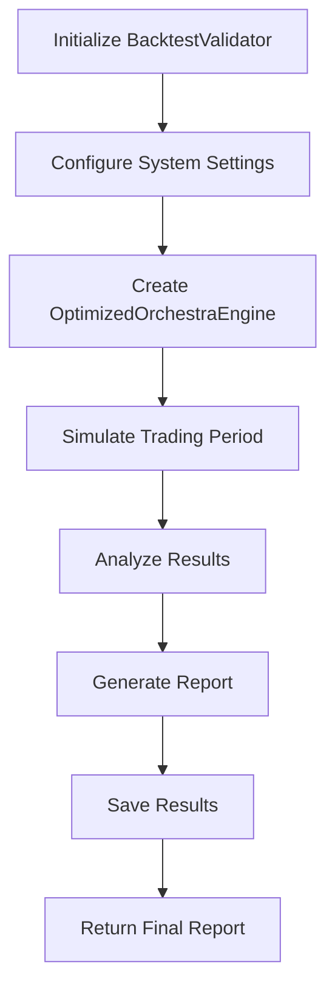
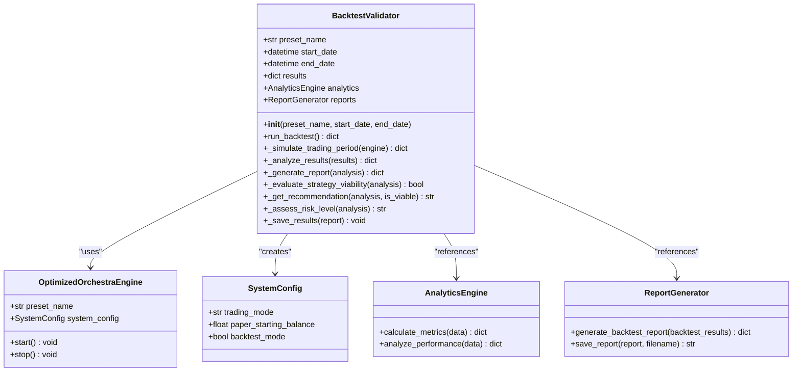
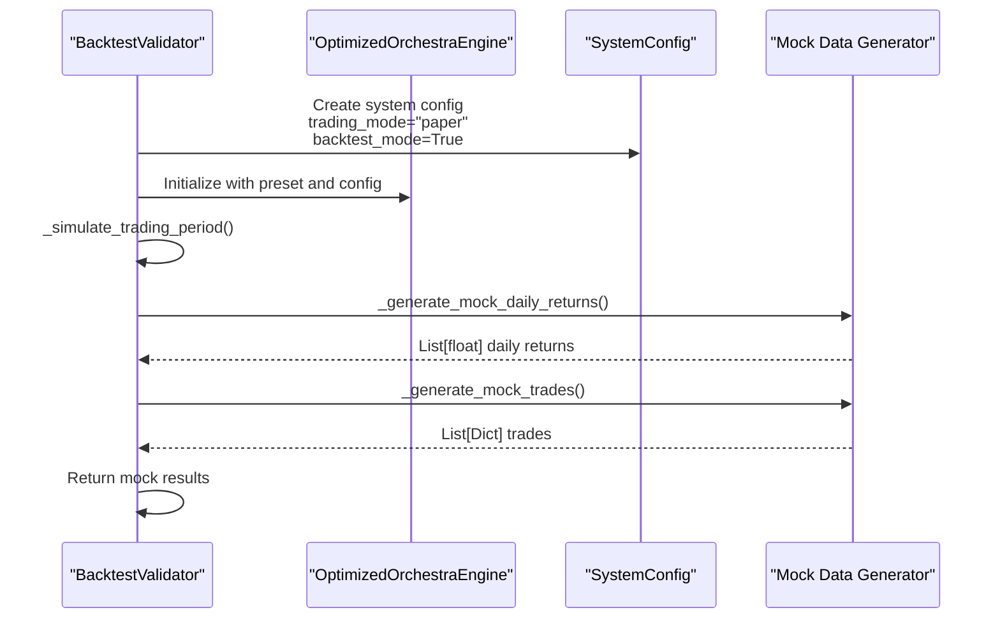
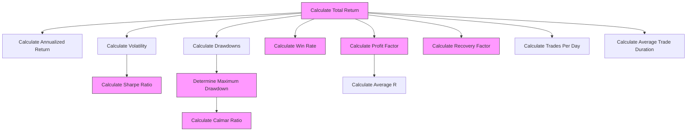
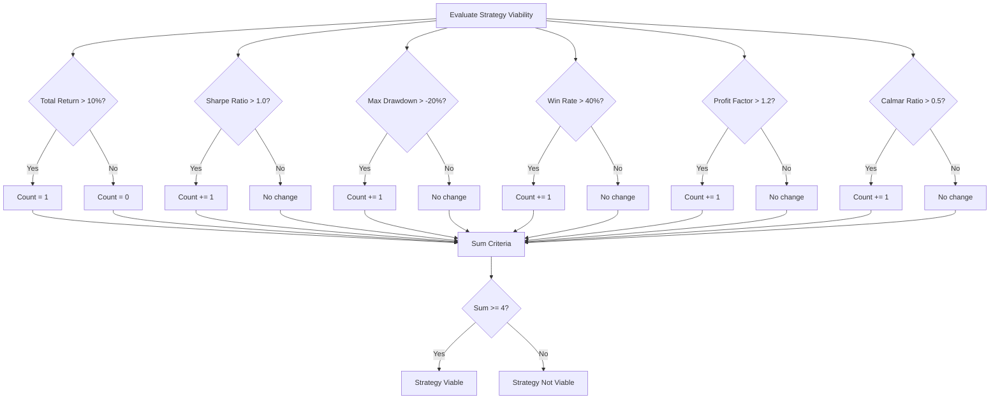
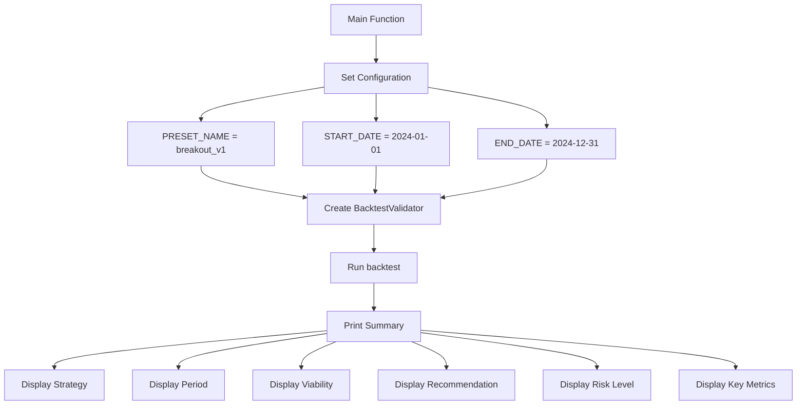
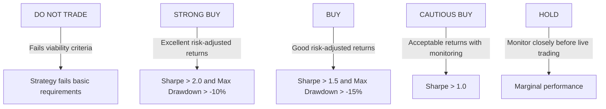
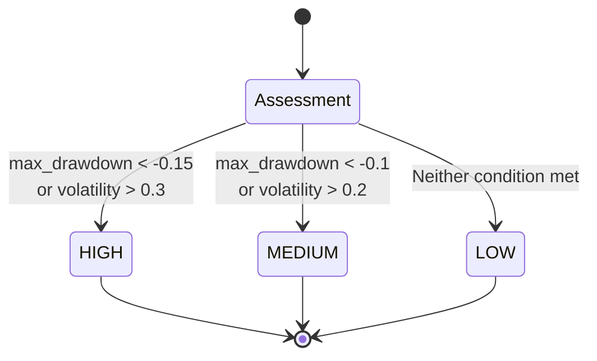
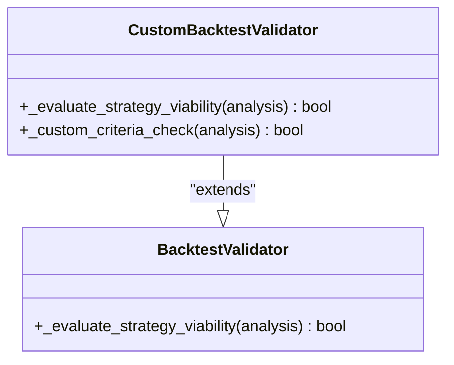

# Backtesting Validation

<cite>
**Referenced Files in This Document **   
- [backtest_validation.py](file://backtest_validation.py)
- [breakout_bot/storage/reports.py](file://breakout_bot/storage/reports.py)
- [breakout_bot/backtesting/backtester.py](file://breakout_bot/backtesting/backtester.py)
- [breakout_bot/config/settings.py](file://breakout_bot/config/settings.py)
</cite>

## Table of Contents
1. [Introduction](#introduction)
2. [Backtesting Framework Overview](#backtesting-framework-overview)
3. [Core Components](#core-components)
4. [Simulation Process](#simulation-process)
5. [Performance Metrics Calculation](#performance-metrics-calculation)
6. [Viability Assessment Algorithm](#viability-assessment-algorithm)
7. [Report Generation and Storage](#report-generation-and-storage)
8. [Configuration and Execution](#configuration-and-execution)
9. [Interpreting Results](#interpreting-results)
10. [Extending the Validator](#extending-the-validator)

## Introduction
The backtesting validation framework provides a systematic approach to evaluate trading strategy performance on historical data before live deployment. This document details the implementation, functionality, and usage of the backtesting system, focusing on the `backtest_validation.py` script that orchestrates the validation process. The framework simulates trading over configurable time periods using specified presets, generates mock market data, tracks trade outcomes, calculates key performance metrics, and produces comprehensive reports with recommendations for strategy deployment.

## Backtesting Framework Overview
The backtesting validation system is designed to assess trading strategies through historical simulation, providing quantitative metrics to determine viability for live trading. The framework follows a structured workflow from initialization to report generation, leveraging various components from the breakout bot ecosystem.



**Diagram sources **
- [backtest_validation.py](file://backtest_validation.py#L27-L63)

**Section sources**
- [backtest_validation.py](file://backtest_validation.py#L1-L295)

## Core Components
The backtesting validation framework consists of several interconnected components that work together to simulate trading and analyze results. The primary class, `BacktestValidator`, coordinates the validation process by integrating various system components.



**Diagram sources **
- [backtest_validation.py](file://backtest_validation.py#L27-L295)
- [breakout_bot/core/engine.py](file://breakout_bot/core/engine.py)
- [breakout_bot/config/settings.py](file://breakout_bot/config/settings.py)
- [breakout_bot/storage/analytics.py](file://breakout_bot/storage/analytics.py)
- [breakout_bot/storage/reports.py](file://breakout_bot/storage/reports.py)

**Section sources**
- [backtest_validation.py](file://backtest_validation.py#L27-L295)

## Simulation Process
The simulation process begins with the creation of a system configuration for backtesting mode, followed by the initialization of the trading engine with the specified preset. The framework then simulates trading over the configured period, generating mock market data and tracking trade outcomes.



**Diagram sources **
- [backtest_validation.py](file://backtest_validation.py#L61-L97)

**Section sources**
- [backtest_validation.py](file://backtest_validation.py#L61-L97)

## Performance Metrics Calculation
The framework calculates a comprehensive set of performance metrics from the simulated trading results. These metrics provide insights into the strategy's profitability, risk profile, and overall effectiveness.



**Diagram sources **
- [backtest_validation.py](file://backtest_validation.py#L129-L182)

**Section sources**
- [backtest_validation.py](file://backtest_validation.py#L129-L182)

## Viability Assessment Algorithm
The viability assessment algorithm evaluates whether a strategy meets minimum criteria for live trading based on risk-adjusted returns. The algorithm applies a multi-factor evaluation using six key metrics, requiring at least four criteria to be met for a strategy to be considered viable.



**Diagram sources **
- [backtest_validation.py](file://backtest_validation.py#L183-L216)

**Section sources**
- [backtest_validation.py](file://backtest_validation.py#L183-L216)

## Report Generation and Storage
The framework generates comprehensive JSON reports containing analysis results, viability assessments, and recommendations. Reports are saved in timestamped files within the backtest_results directory for future reference and analysis.

```mermaid
sequenceDiagram
participant Validator as "BacktestValidator"
participant ReportGen as "ReportGenerator"
participant FileSystem as "File System"
Validator->>Validator : _generate_report(analysis)
Validator->>Validator : _evaluate_strategy_viability()
Validator->>Validator : _get_recommendation()
Validator->>Validator : _assess_risk_level()
Validator->>ReportGen : Create report structure
ReportGen-->>Validator : Complete report
Validator->>_save_results(report)
Validator->>FileSystem : Create backtest_results directory
Validator->>FileSystem : Generate filename with timestamp
Validator->>FileSystem : Write JSON file
FileSystem-->>Validator : Confirmation
```

**Diagram sources **
- [backtest_validation.py](file://backtest_validation.py#L183-L259)
- [breakout_bot/storage/reports.py](file://breakout_bot/storage/reports.py#L143-L175)

**Section sources**
- [backtest_validation.py](file://backtest_validation.py#L183-L259)

## Configuration and Execution
The backtesting framework can be configured with specific parameters including preset name, start date, and end date. The main execution flow demonstrates how to run a backtest validation and interpret the results.



**Diagram sources **
- [backtest_validation.py](file://backtest_validation.py#L262-L293)

**Section sources**
- [backtest_validation.py](file://backtest_validation.py#L262-L293)

## Interpreting Results
Interpreting backtest reports involves analyzing the key metrics and recommendations to make go/no-go decisions for strategy deployment. The framework provides clear guidance through its viability assessment and recommendation system.

### Recommendation Levels
The framework categorizes strategies into four recommendation levels based on their risk-adjusted performance:



### Risk Level Assessment
Risk levels are determined based on maximum drawdown and volatility metrics:



**Diagram sources **
- [backtest_validation.py](file://backtest_validation.py#L241-L259)

**Section sources**
- [backtest_validation.py](file://backtest_validation.py#L241-L259)

## Extending the Validator
The backtesting validator can be extended to support custom evaluation criteria and additional performance metrics. Developers can modify the viability assessment algorithm or add new metrics to the analysis process.

### Custom Viability Criteria
To extend the viability assessment, developers can override the `_evaluate_strategy_viability` method or create a subclass with custom logic:



### Adding New Metrics
New performance metrics can be incorporated by extending the `_analyze_results` method to calculate additional indicators relevant to specific trading strategies.

**Section sources**
- [backtest_validation.py](file://backtest_validation.py#L129-L216)