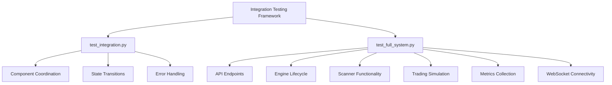
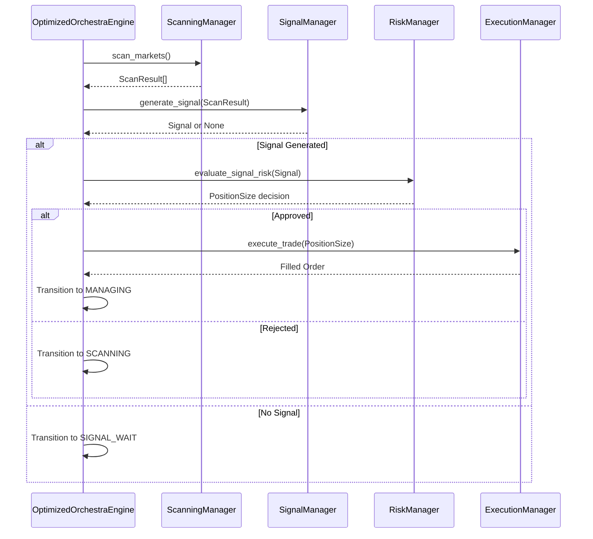
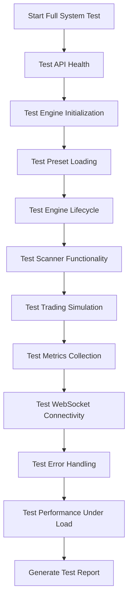
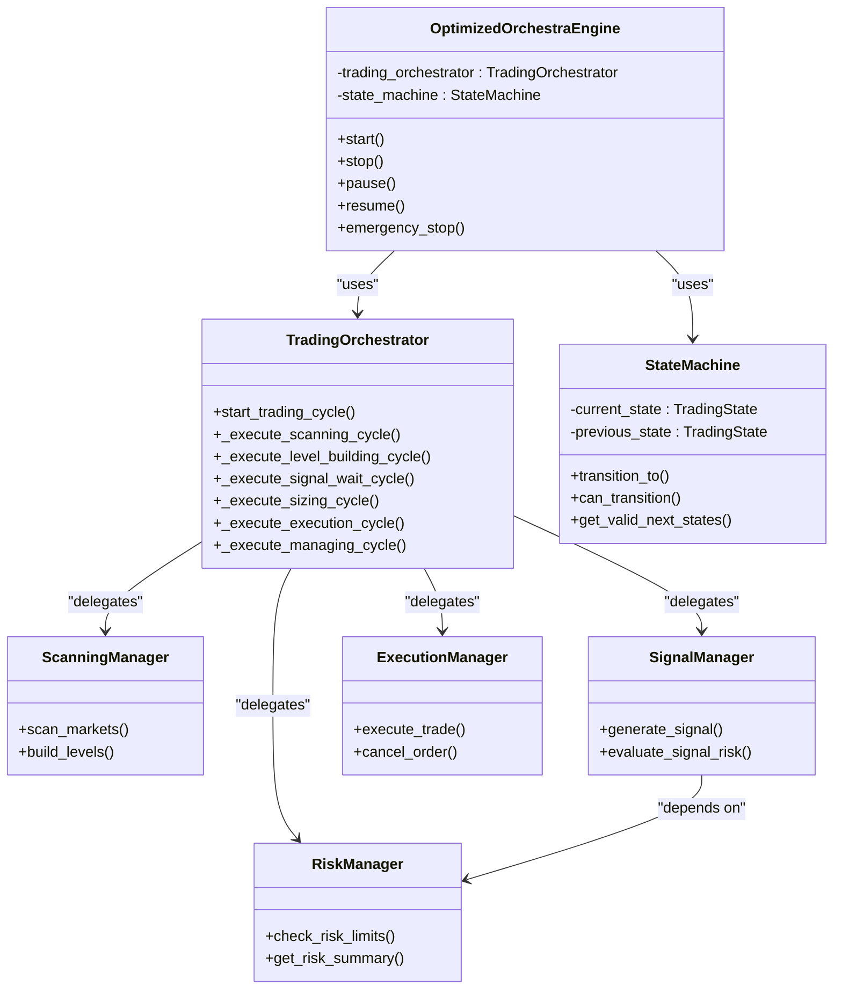
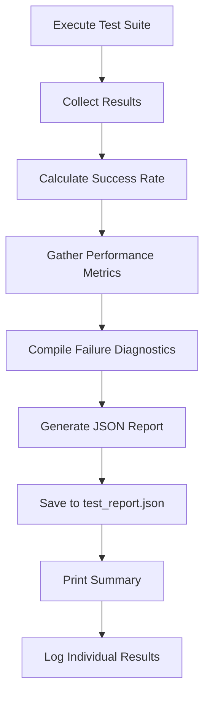

# Integration Testing

<cite>
**Referenced Files in This Document**   
- [test_integration.py](file://breakout_bot/tests/test_integration.py)
- [test_full_system.py](file://test_full_system.py)
- [engine.py](file://breakout_bot/core/engine.py)
- [main.py](file://breakout_bot/api/main.py)
- [websocket.py](file://breakout_bot/api/websocket.py)
</cite>

## Table of Contents
1. [Introduction](#introduction)
2. [Integration Test Framework Overview](#integration-test-framework-overview)
3. [Workflow Validation with test_integration.py](#workflow-validation-with-test_integrationpy)
4. [End-to-End System Validation with test_full_system.py](#end-to-end-system-validation-with-test_full_systempy)
5. [Component Interaction and State Propagation](#component-interaction-and-state-propagation)
6. [Asynchronous Operations and Test Isolation](#asynchronous-operations-and-test-isolation)
7. [Test Report Generation and Metrics Collection](#test-report-generation-and-metrics-collection)
8. [Extending Integration Tests](#extending-integration-tests)

## Introduction
The integration testing framework for the Breakout Bot Trading System ensures coordinated behavior between system components through comprehensive validation of workflows, API interactions, and state management. The framework consists of two primary test suites: `test_integration.py` focuses on validating internal component coordination across the trading lifecycle, while `test_full_system.py` performs end-to-end validation of the complete system including API endpoints, engine lifecycle, scanner functionality, trading simulation, metrics collection, and WebSocket connectivity. These tests verify the interaction between FastAPI routers, the core engine, and external services like exchange clients, ensuring proper sequencing of component initialization, state propagation, and error cascading.

## Integration Test Framework Overview
The integration testing framework validates the coordinated behavior of system components through both unit-level integration tests and comprehensive end-to-end system tests. The framework uses real API calls to localhost endpoints during testing, monitoring system state across multiple subsystems including the trading engine, market scanner, signal generator, risk manager, and execution orchestrator. The tests validate proper initialization sequences, state transitions, data flow between components, and error handling mechanisms throughout the trading workflow from market scanning to execution orchestration.



**Diagram sources**
- [test_integration.py](file://breakout_bot/tests/test_integration.py)
- [test_full_system.py](file://test_full_system.py)

## Workflow Validation with test_integration.py
The `test_integration.py` module validates the complete trading workflow from market scanning through signal generation to risk assessment and execution orchestration. Using mocked components, the tests verify the proper sequencing of operations across the trading lifecycle, including state transitions between scanning, level building, signal waiting, sizing, execution, and position management phases.

The integration tests validate several key scenarios:
- Successful trading cycle with signal approval and position opening
- No signals scenario where the system continues scanning
- Signal rejection due to risk constraints
- Kill switch activation based on loss limits
- Position management with multiple concurrent positions
- Error handling during component failures
- System start/stop lifecycle management

Each test case verifies proper state transitions, data flow between components, and appropriate error handling when exceptions occur. The tests use mock objects to simulate market data, exchange interactions, and component behaviors while validating that the engine correctly coordinates these components according to the defined workflow.



**Section sources**
- [test_integration.py](file://breakout_bot/tests/test_integration.py#L0-L685)

## End-to-End System Validation with test_full_system.py
The `test_full_system.py` module performs comprehensive end-to-end validation of the entire trading system by making real API calls to localhost endpoints. Unlike the mocked integration tests, this suite validates the actual system behavior with all components running and communicating through their public interfaces.

The full system test follows a structured sequence of validations:
1. API Health Check - Verifies the REST API endpoints are responsive
2. Engine Initialization - Tests proper creation of the trading engine instance
3. Preset Loading - Validates configuration loading from JSON files
4. Engine Start/Stop - Tests the complete engine lifecycle through API commands
5. Scanner Functionality - Validates market scanning operations and results
6. Trading Simulation - Tests position creation, management, and order execution
7. Metrics Collection - Verifies performance metrics are properly collected
8. WebSocket Connectivity - Tests real-time updates through WebSocket connections
9. Error Handling - Validates system response to invalid inputs and edge cases
10. Performance Under Load - Tests system stability with concurrent requests

The test suite uses the `SystemTester` class to coordinate these validations, making HTTP requests to the FastAPI server running on localhost:8000. Each test phase builds upon the previous one, creating a realistic simulation of system usage from startup through active trading operations.



**Section sources**
- [test_full_system.py](file://test_full_system.py#L0-L446)

## Component Interaction and State Propagation
The integration tests validate how components interact and propagate state throughout the system. The core engine (`OptimizedOrchestraEngine`) coordinates various specialized managers including the `ScanningManager`, `SignalManager`, `RiskManager`, and `TradingOrchestrator`, ensuring proper data flow and state consistency.

State transitions are managed by the `StateMachine` class, which enforces valid transitions between trading states (SCANNING, LEVEL_BUILDING, SIGNAL_WAIT, SIZING, EXECUTION, MANAGING). The integration tests verify that these transitions occur correctly based on system conditions and that each state change triggers the appropriate component actions.

The tests validate several critical interaction patterns:
- Market data flows from `MarketDataProvider` to `ScanningManager` for analysis
- Scan results are passed from scanner to `SignalGenerator` for signal creation
- Signals are evaluated by `RiskManager` before execution approval
- Approved trades are sent to `ExecutionManager` for order placement
- Position updates are propagated back to the engine for management
- System status is updated and broadcast via WebSocket connections

Error cascading is also validated, ensuring that failures in one component (e.g., network issues with the exchange client) properly propagate through the system, triggering appropriate state changes and notifications.



**Section sources**
- [engine.py](file://breakout_bot/core/engine.py#L0-L1208)
- [test_integration.py](file://breakout_bot/tests/test_integration.py#L0-L685)

## Asynchronous Operations and Test Isolation
The integration tests address challenges in synchronizing asynchronous operations and maintaining test isolation in the event-driven trading system. The framework uses asyncio and async/await patterns to coordinate concurrent operations while ensuring test reliability and independence.

Each test runs in an isolated environment with mocked dependencies, preventing interference between test cases. The tests use pytest fixtures to set up consistent initial conditions, including mock market data, preset configurations, and system settings. For end-to-end tests, the system is started and stopped for each major test phase to ensure clean state.

The framework handles asynchronous operations through several mechanisms:
- Async test functions with proper event loop management
- Mocked async methods using AsyncMock for component interactions
- Controlled timing with asyncio.sleep() to simulate real-world delays
- Timeout handling for long-running operations
- Proper cleanup of background tasks and resources

Test isolation is maintained by:
- Using separate database connections for integration tests
- Mocking external API calls to prevent real market interactions
- Resetting component states between test cases
- Using temporary configuration files
- Ensuring no shared mutable state between tests

```mermaid
sequenceDiagram
participant Test as Integration Test
participant Engine as OptimizedOrchestraEngine
participant Loop as Async Event Loop
Test->>Loop : Create test event loop
Test->>Engine : Initialize with mocks
Loop->>Engine : Run _main_trading_loop()
Engine->>Engine : Execute state cycle
alt Success Path
Engine->>Loop : Complete cycle
Loop->>Test : Return control
Test->>Test : Verify assertions
else Error Path
Engine->>Loop : Handle exception
Loop->>Engine : Apply recovery action
Engine->>Test : Transition to ERROR state
Test->>Test : Verify error handling
end
Test->>Loop : Cleanup resources
Test->>Test : Complete test case
```

**Section sources**
- [test_integration.py](file://breakout_bot/tests/test_integration.py#L0-L685)
- [test_full_system.py](file://test_full_system.py#L0-L446)

## Test Report Generation and Metrics Collection
The integration testing framework includes comprehensive test report generation that captures success rates, performance metrics, and failure diagnostics. After executing all test cases, the system generates a detailed JSON report containing quantitative metrics about test execution and system behavior.

The test report includes:
- Overall success rate percentage
- Total number of tests executed
- Number of passed and failed tests
- Detailed results for each test category
- Execution timestamps and duration
- Performance metrics under load
- Failure diagnostics with error messages
- System resource utilization data

For the full system test, additional metrics are collected through API endpoints:
- Engine uptime and cycle count
- CPU and memory usage
- Request latency and throughput
- Active positions and signals
- Trading performance metrics (win rate, average R, Sharpe ratio)
- Risk exposure and drawdown levels

The reporting system also validates that metrics are properly collected and exposed through the `/api/metrics` endpoints, ensuring the monitoring infrastructure functions correctly. WebSocket connectivity tests verify that real-time updates are properly broadcast to connected clients, including state transitions, position updates, order events, and system alerts.



**Section sources**
- [test_full_system.py](file://test_full_system.py#L0-L446)
- [main.py](file://breakout_bot/api/main.py#L0-L205)

## Extending Integration Tests
To extend the integration testing framework when adding new features or modifying existing workflows, follow these guidelines:

1. **Add New Test Cases**: Create new test methods in `test_integration.py` for each new feature or workflow modification, following the existing pattern of mocking components and verifying state transitions.

2. **Update Mock Fixtures**: Extend the existing pytest fixtures (`mock_preset`, `mock_system_config`, `mock_market_data`) to include data relevant to new features, ensuring comprehensive test coverage.

3. **Validate State Transitions**: Verify that new states or transitions are properly handled by the `StateMachine` and that they follow the defined transition rules in `VALID_TRANSITIONS`.

4. **Test Error Conditions**: Include test cases for error scenarios specific to the new feature, ensuring proper error handling and recovery mechanisms.

5. **Update End-to-End Tests**: Add corresponding validation steps in `test_full_system.py` to verify the new functionality through API endpoints.

6. **Verify Metrics Collection**: Ensure new metrics are properly collected and exposed through the metrics API endpoints.

7. **Test WebSocket Events**: Validate that any new WebSocket event types are properly generated and formatted.

8. **Maintain Test Isolation**: Ensure new tests do not depend on the state created by other tests and can run independently.

When modifying existing workflows, update the relevant test cases to reflect the changes and add regression tests to ensure backward compatibility. Always verify that the test report accurately reflects the results of new and modified tests.

**Section sources**
- [test_integration.py](file://breakout_bot/tests/test_integration.py#L0-L685)
- [test_full_system.py](file://test_full_system.py#L0-L446)