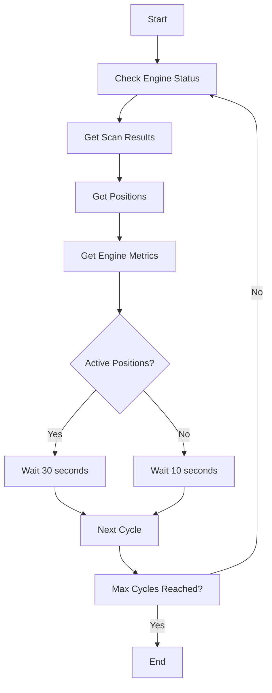
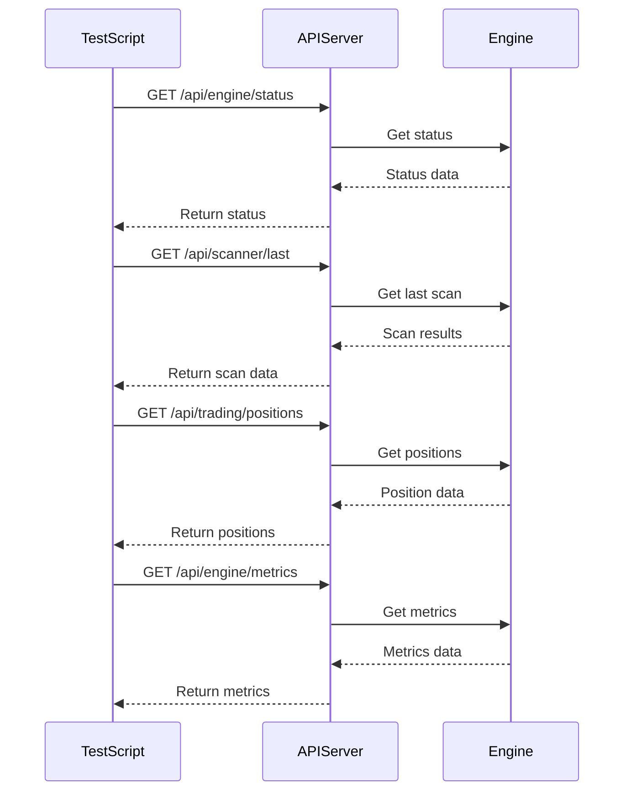
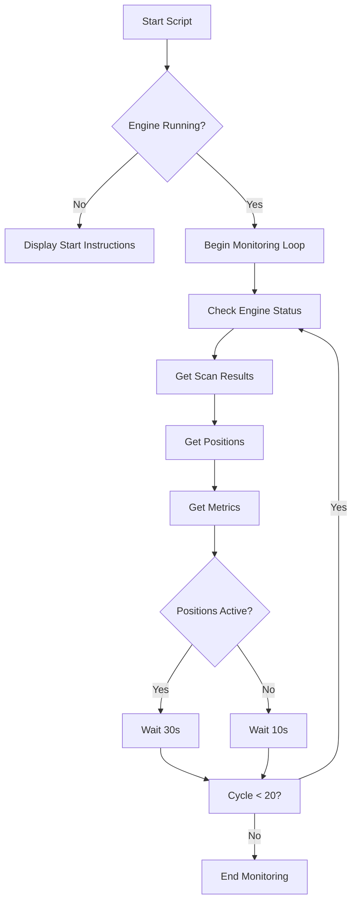

# Quick Trade Testing

<cite>
**Referenced Files in This Document **   
- [quick_trade_test.py](file://quick_trade_test.py)
- [engine.py](file://breakout_bot/api/routers/engine.py)
- [scanner.py](file://breakout_bot/api/routers/scanner.py)
- [trading.py](file://breakout_bot/api/routers/trading.py)
- [metrics.py](file://breakout_bot/api/routers/metrics.py)
</cite>

## Table of Contents
1. [Introduction](#introduction)
2. [Core Functionality](#core-functionality)
3. [API Endpoint Integration](#api-endpoint-integration)
4. [Adaptive Polling Behavior](#adaptive-polling-behavior)
5. [Console Output Format](#console-output-format)
6. [Execution Instructions](#execution-instructions)
7. [Use Cases and Examples](#use-cases-and-examples)

## Introduction

The `quick_trade_test.py` script serves as a smoke test for rapid validation of system functionality in running environments. It monitors the complete trading cycle by periodically checking engine status, scan results, open positions, and performance metrics through API calls. This tool is essential after deployment or configuration changes to verify that all major subsystems are operational.

**Section sources**
- [quick_trade_test.py](file://quick_trade_test.py#L1-L133)

## Core Functionality

The quick trade testing script performs comprehensive monitoring of the trading system's health and activity. It connects to the local API server at http://localhost:8000 and interprets responses from multiple endpoints to provide a holistic view of system operations. The script checks four key aspects of the trading system:

1. Engine status including state, open positions, and daily PnL
2. Scanner results showing market candidates and filter outcomes
3. Trading positions with detailed position information
4. Engine metrics tracking signal generation and trade execution

This multi-faceted approach ensures that all critical components of the trading system are functioning correctly and communicating properly.



**Diagram sources **
- [quick_trade_test.py](file://quick_trade_test.py#L50-L133)

**Section sources**
- [quick_trade_test.py](file://quick_trade_test.py#L50-L133)

## API Endpoint Integration

The testing script integrates with several API endpoints to gather comprehensive system information. Each endpoint provides specific insights into different aspects of the trading system:

### Engine Status Endpoint
The `/api/engine/status` endpoint returns current engine status with details about:
- Current state (IDLE, SCANNING, EXECUTION, etc.)
- Number of open positions
- Daily PnL (R-value)
- System latency
- Available trading slots

### Scanner Results Endpoint
The `/api/scanner/last` endpoint provides the most recent market scan results including:
- List of candidate symbols that passed filters
- Score and filter breakdown for each candidate
- Total number of scanned symbols
- Number of symbols that passed filters

### Trading Positions Endpoint
The `/api/trading/positions` endpoint returns information about all open positions:
- Symbol, side, entry price, and stop-loss
- Position size and strategy mode
- Opening timestamp
- Current PnL in R and USD values

### Engine Metrics Endpoint
The `/api/engine/metrics` endpoint delivers performance metrics:
- Total signals generated
- Total trades executed
- Daily PnL R-value
- System uptime and cycle count
- Average latency



**Diagram sources **
- [quick_trade_test.py](file://quick_trade_test.py#L15-L49)
- [engine.py](file://breakout_bot/api/routers/engine.py#L116-L128)
- [scanner.py](file://breakout_bot/api/routers/scanner.py#L37-L72)
- [trading.py](file://breakout_bot/api/routers/trading.py#L39-L76)
- [metrics.py](file://breakout_bot/api/routers/metrics.py#L10-L25)

**Section sources**
- [quick_trade_test.py](file://quick_trade_test.py#L15-L49)
- [engine.py](file://breakout_bot/api/routers/engine.py)
- [scanner.py](file://breakout_bot/api/routers/scanner.py)
- [trading.py](file://breakout_bot/api/routers/trading.py)
- [metrics.py](file://breakout_bot/api/routers/metrics.py)

## Adaptive Polling Behavior

The quick trade test implements adaptive polling behavior to optimize monitoring efficiency. The script adjusts its polling interval based on system activity:

- When active positions exist, the script waits 30 seconds between cycles to observe position lifecycle events
- When no positions are open, the script uses a shorter 10-second interval to quickly detect new trading opportunities

This adaptive approach balances thorough monitoring with resource efficiency. During active trading periods, the longer interval allows sufficient time to observe position management, while the shorter interval during idle periods enables rapid detection of new signals and positions.

The monitoring continues for a maximum of 20 cycles before terminating, providing a comprehensive view of system behavior over approximately 10-15 minutes depending on trading activity.

**Section sources**
- [quick_trade_test.py](file://quick_trade_test.py#L97-L115)

## Console Output Format

The script features a human-readable console output format enhanced with emoji indicators for intuitive status visualization. Each monitoring cycle displays information in a structured format:

- 🎯 State: Current engine state (e.g., SCANNING, EXECUTION)
- 📈 Positions: Number of open positions
- 💰 PnL: Daily profit/loss in R-value
- 🔍 Candidates: Number of scan candidates identified
- 🏆 Best Candidate: Top symbol with highest score and filter details
- ✅ Passed Filters: Number of filters passed by the best candidate
- ❌ Failed Filters: Number of filters failed by the best candidate
- 💼 Positions: Detailed information about each open position
- 📊 Symbol: Position details including side, quantity, entry, SL, TP
- 📈 Total Signals: Cumulative number of signals generated
- 💼 Total Trades: Cumulative number of trades executed

This visual format makes it easy to quickly assess system health and trading activity at a glance.

**Section sources**
- [quick_trade_test.py](file://quick_trade_test.py#L60-L95)

## Execution Instructions

To run the quick trade test, follow these steps:

1. Ensure the trading engine is running by executing `./start.sh`
2. Run the test script with `python3 quick_trade_test.py`
3. Observe the console output for system status and trading activity

If the engine is not started, the script will display a warning message with instructions to start the engine using the appropriate curl command. The script first verifies engine connectivity before proceeding with monitoring.

The test runs for a maximum of 20 cycles, providing a comprehensive overview of system functionality. After completion, the script terminates automatically.



**Diagram sources **
- [quick_trade_test.py](file://quick_trade_test.py#L117-L133)

**Section sources**
- [quick_trade_test.py](file://quick_trade_test.py#L117-L133)

## Use Cases and Examples

The quick trade testing script serves multiple practical use cases:

### Post-Deployment Verification
After deploying system updates or configuration changes, run the script to verify that all subsystems are operational. The comprehensive monitoring ensures that engine, scanner, and trading components are functioning correctly.

### Preset Change Validation
When modifying trading presets, use the script to confirm proper signal generation. The scan results section shows whether the updated filters are correctly identifying market opportunities according to the new preset criteria.

### Live Operation Monitoring
During live trading, run the script to monitor position management. The adaptive polling behavior allows observation of position lifecycle events, including entry, management, and exit.

### Troubleshooting
When investigating system issues, the script provides immediate feedback on component status. If the engine appears unresponsive, the script's error messages help diagnose connectivity problems or service failures.

Example usage:
```bash
# Verify system after deployment
python3 quick_trade_test.py

# Check signal generation after preset changes
python3 quick_trade_test.py

# Monitor live trading operations
python3 quick_trade_test.py
```

**Section sources**
- [quick_trade_test.py](file://quick_trade_test.py#L1-L133)