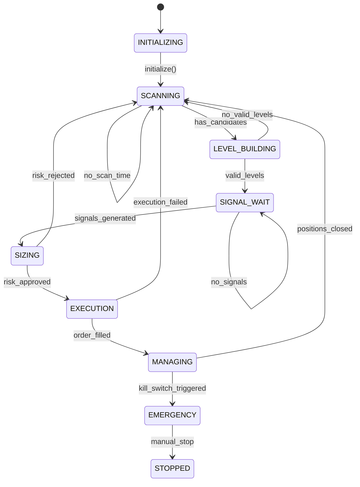
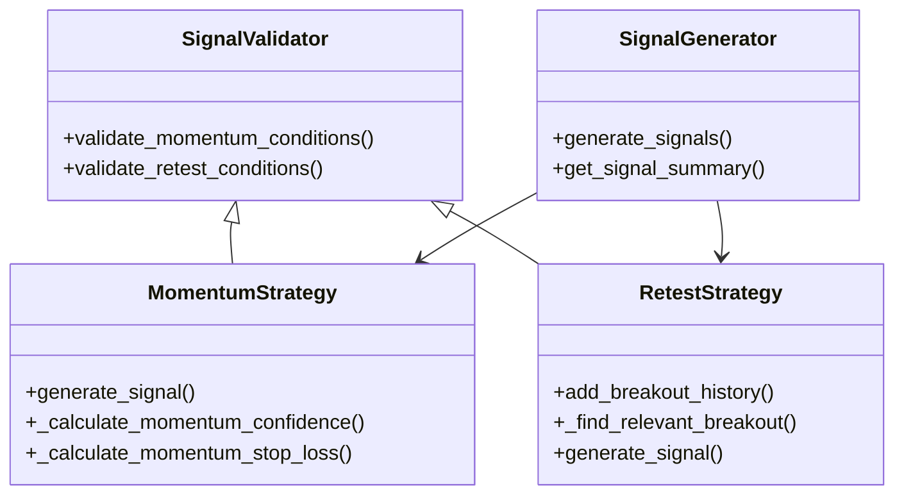
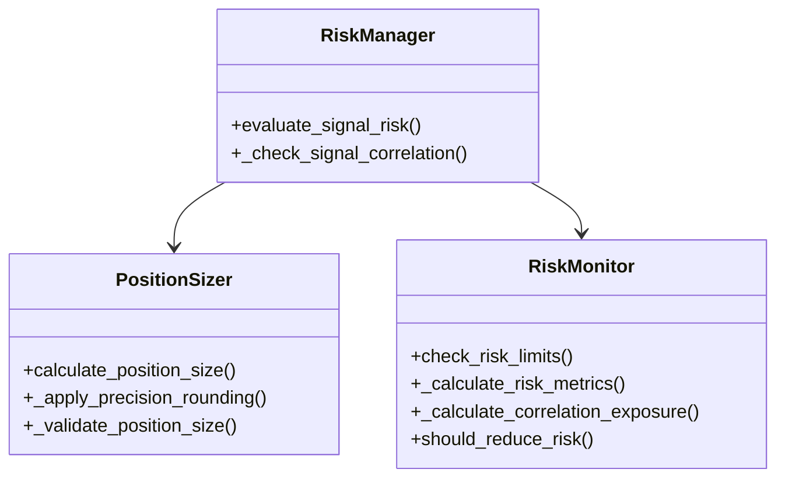
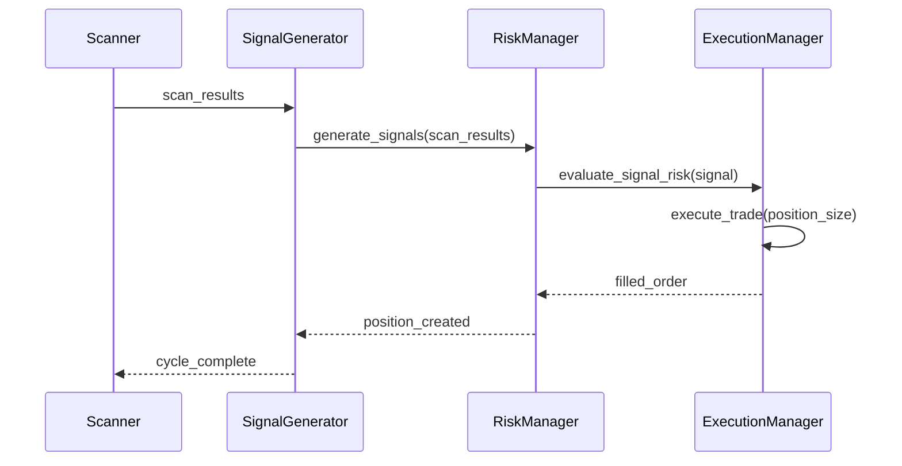
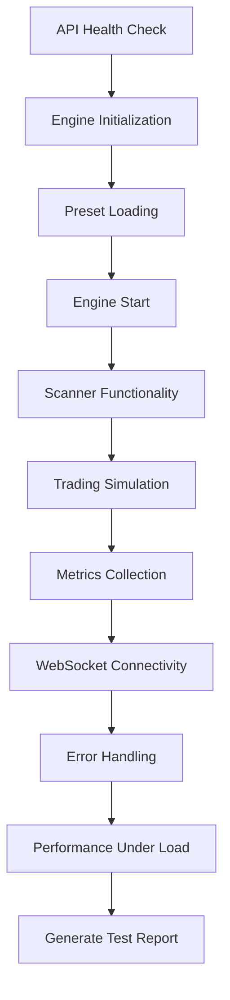
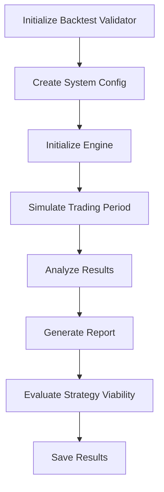
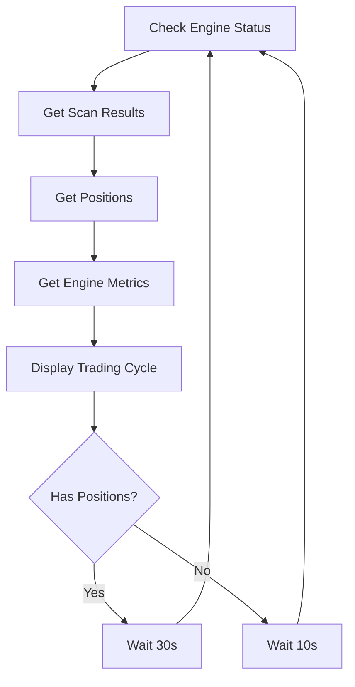

# Testing and Validation

<cite>
**Referenced Files in This Document**   
- [test_engine.py](file://breakout_bot/tests/test_engine.py)
- [test_signals.py](file://breakout_bot/tests/test_signals.py)
- [test_risk.py](file://breakout_bot/tests/test_risk.py)
- [test_integration.py](file://breakout_bot/tests/test_integration.py)
- [test_full_system.py](file://test_full_system.py)
- [backtest_validation.py](file://backtest_validation.py)
- [quick_trade_test.py](file://quick_trade_test.py)
- [pytest.ini](file://pytest.ini)
</cite>

## Table of Contents
1. [Introduction](#introduction)
2. [Unit Test Suite](#unit-test-suite)
3. [Integration Tests](#integration-tests)
4. [End-to-End Validation](#end-to-end-validation)
5. [Backtesting Validation](#backtesting-validation)
6. [Quick Validation Workflows](#quick-validation-workflows)
7. [Test Configuration](#test-configuration)
8. [Test Data Setup](#test-data-setup)
9. [Assertion Patterns for Financial Calculations](#assertion-patterns-for-financial-calculations)
10. [Testing Asynchronous and Time-Dependent Behaviors](#testing-asynchronous-and-time-dependent-behaviors)
11. [Extending Tests for New Strategies or Exchanges](#extending-tests-for-new-strategies-or-exchanges)
12. [CI/CD Integration Practices](#cicd-integration-practices)

## Introduction
The testing and validation framework ensures the reliability and correctness of the breakout trading system through a comprehensive suite of unit, integration, end-to-end, and backtesting validations. The framework is designed to verify individual component functionality, coordinated behavior between system modules, complete trading cycles from scan to close, historical performance against expectations, and quick smoke tests for deployment verification. The test suite leverages pytest with specific configuration settings for coverage, markers, and fixtures to maintain code quality and ensure thorough testing across all critical components including engine state transitions, signal generation logic, risk calculations, scanner operations, and execution management.

## Unit Test Suite
The unit test suite in `breakout_bot/tests/` provides granular validation of individual components within the trading system. Each test file focuses on a specific module, ensuring isolated functionality meets expected behavior through mocked dependencies and controlled inputs.

### Engine State Transitions
The engine state machine is rigorously tested to validate proper transitions between states such as INITIALIZING, SCANNING, SIGNAL_WAIT, SIZING, EXECUTION, MANAGING, and EMERGENCY. The test suite verifies that each state transition occurs under appropriate conditions and handles edge cases correctly.



**Diagram sources**
- [test_engine.py](file://breakout_bot/tests/test_engine.py#L200-L450)

**Section sources**
- [test_engine.py](file://breakout_bot/tests/test_engine.py#L200-L450)

### Signal Generation Logic
Signal generation logic is validated through comprehensive tests that cover both momentum and retest strategies. The test suite verifies condition validation, confidence calculation, and signal approval based on market data and trading levels.



**Diagram sources**
- [test_signals.py](file://breakout_bot/tests/test_signals.py#L100-L700)

**Section sources**
- [test_signals.py](file://breakout_bot/tests/test_signals.py#L100-L700)

### Risk Calculations
Risk calculations are thoroughly tested to ensure accurate position sizing, risk monitoring, and kill switch mechanisms. The test suite validates R-model calculations, correlation exposure, daily loss limits, and concurrent position constraints.



**Diagram sources**
- [test_risk.py](file://breakout_bot/tests/test_risk.py#L100-L700)

**Section sources**
- [test_risk.py](file://breakout_bot/tests/test_risk.py#L100-L700)

## Integration Tests
Integration tests verify the coordinated behavior between key components: scanner, signal generator, and execution manager. These tests ensure that data flows correctly through the system pipeline and that components interact as expected under various scenarios.



**Diagram sources**
- [test_integration.py](file://breakout_bot/tests/test_integration.py#L200-L600)

**Section sources**
- [test_integration.py](file://breakout_bot/tests/test_integration.py#L200-L600)

## End-to-End Validation
End-to-end validation scripts simulate complete trading cycles from market scanning to position closing, providing comprehensive system-level verification.

### Complete Trading Cycle Simulation
The `test_full_system.py` script orchestrates a full system test by interacting with the API endpoints to validate the entire trading workflow:



**Diagram sources**
- [test_full_system.py](file://test_full_system.py#L29-L70)

**Section sources**
- [test_full_system.py](file://test_full_system.py#L29-L70)

## Backtesting Validation
The `backtest_validation.py` script provides historical performance validation by simulating trading over specified time periods and comparing results against predefined expectations.



**Diagram sources**
- [backtest_validation.py](file://backtest_validation.py#L50-L100)

**Section sources**
- [backtest_validation.py](file://backtest_validation.py#L50-L100)

## Quick Validation Workflows
The `quick_trade_test.py` script enables rapid smoke testing of deployments by monitoring key system metrics and trading activities in real-time.



**Diagram sources**
- [quick_trade_test.py](file://quick_trade_test.py#L50-L100)

**Section sources**
- [quick_trade_test.py](file://quick_trade_test.py#L50-L100)

## Test Configuration
The pytest configuration in `pytest.ini` defines the testing environment with specific settings for coverage, markers, and execution options.

```ini
[tool:pytest]
testpaths = breakout_bot/tests
python_files = test_*.py
python_classes = Test*
python_functions = test_*
addopts = 
    -v
    --tb=short
    --strict-markers
    --disable-warnings
    --cov=breakout_bot
    --cov-report=html
    --cov-report=term-missing
    --cov-fail-under=80
markers =
    unit: Unit tests
    integration: Integration tests
    slow: Slow tests
    asyncio: Async tests
```

**Section sources**
- [pytest.ini](file://pytest.ini#L1-L20)

## Test Data Setup
Test data setup employs mock exchange responses and synthetic market conditions to create realistic testing scenarios without relying on live market data.

### Mock Market Data
The test suite creates comprehensive mock market data including:
- Candlestick patterns with volume surges
- L2 depth information with bid/ask imbalances
- Technical indicators (ATR, BB width)
- Correlation metrics with BTC
- Order book depth at various percentages

### Synthetic Scenarios
Synthetic scenarios are designed to test specific conditions:
- Price breakouts with volume confirmation
- Retest patterns after breakout
- High volatility regimes
- Low liquidity conditions
- Extreme spread situations

**Section sources**
- [test_engine.py](file://breakout_bot/tests/test_engine.py#L50-L150)
- [test_signals.py](file://breakout_bot/tests/test_signals.py#L50-L150)
- [test_risk.py](file://breakout_bot/tests/test_risk.py#L50-L150)

## Assertion Patterns for Financial Calculations
Financial calculations require precision tolerance due to floating-point arithmetic and market microstructure effects.

### Tolerance-Based Assertions
The test suite implements tolerance-based assertions for financial calculations:

```python
# Example assertion pattern
assert abs(calculated_value - expected_value) < tolerance
```

Common tolerance thresholds:
- Price calculations: 0.0001 (4 decimal places)
- Percentage values: 0.0001 (basis points)
- USD amounts: 0.01 (cent level)
- R-values: 0.01 (1% of R)

### Validation Rules
Key validation rules enforced:
- Confidence scores between 0 and 1
- Positive prices and quantities
- Valid risk-reward ratios
- Proper timestamp ordering
- Consistent state transitions

**Section sources**
- [test_signals.py](file://breakout_bot/tests/test_signals.py#L271-L313)
- [test_risk.py](file://breakout_bot/tests/test_risk.py#L500-L550)

## Testing Asynchronous and Time-Dependent Behaviors
The trading system's asynchronous nature and time-dependent behaviors present unique testing challenges addressed through specific patterns.

### Async Testing Patterns
The test suite uses pytest-asyncio to handle asynchronous operations:

```python
@pytest.mark.asyncio
async def test_async_operation():
    # Test async functionality
    result = await async_function()
    assert result == expected
```

### Time Manipulation
Time-dependent behaviors are tested using:
- Mocked timestamps
- Controlled time progression
- Fixed time intervals
- Simulated market hours

### Concurrency Testing
Concurrency scenarios are validated through:
- Parallel task execution
- Race condition simulation
- Resource contention testing
- Deadlock prevention

**Section sources**
- [test_engine.py](file://breakout_bot/tests/test_engine.py#L300-L350)
- [test_integration.py](file://breakout_bot/tests/test_integration.py#L300-L350)

## Extending Tests for New Strategies or Exchanges
The testing framework supports extensibility for new trading strategies and exchange integrations.

### Strategy Extension Pattern
To add tests for a new strategy:
1. Create a new test file following naming convention `test_strategy_name.py`
2. Implement strategy-specific condition validations
3. Define synthetic market scenarios
4. Verify signal generation logic
5. Test integration with risk management

### Exchange Integration Testing
For new exchange integrations:
1. Create exchange-specific mock responses
2. Test rate limiter compliance
3. Validate order execution semantics
4. Verify market data parsing
5. Test error handling for exchange-specific errors

**Section sources**
- [test_engine.py](file://breakout_bot/tests/test_engine.py#L400-L450)
- [test_integration.py](file://breakout_bot/tests/test_integration.py#L600-L650)

## CI/CD Integration Practices
Automated regression testing is integrated into the CI/CD pipeline to ensure code quality and system stability.

### Pipeline Stages
The CI/CD pipeline includes:
1. Code formatting and linting
2. Unit test execution
3. Integration test execution
4. Coverage analysis
5. Security scanning
6. Deployment to staging

### Quality Gates
Quality gates enforce:
- Minimum 80% code coverage
- All tests passing
- No high-severity vulnerabilities
- Performance benchmarks met
- Memory leak detection

### Automated Regression
Regression testing automatically runs:
- On every pull request
- After merge to main branch
- Daily scheduled executions
- Before production deployments

**Section sources**
- [pytest.ini](file://pytest.ini#L1-L20)
- [test_full_system.py](file://test_full_system.py#L368-L400)