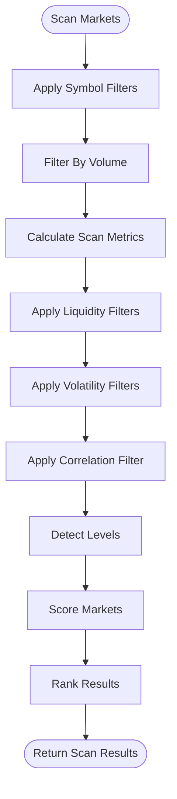

# Unit Testing

<cite>
**Referenced Files in This Document**   
- [test_engine.py](file://breakout_bot/tests/test_engine.py)
- [test_signals.py](file://breakout_bot/tests/test_signals.py)
- [test_risk.py](file://breakout_bot/tests/test_risk.py)
- [test_scanner.py](file://breakout_bot/tests/test_scanner.py)
- [test_positions.py](file://breakout_bot/tests/test_positions.py)
- [pytest.ini](file://pytest.ini)
</cite>

## Table of Contents
1. [Introduction](#introduction)
2. [Core Components](#core-components)
3. [State and Lifecycle Validation with test_engine.py](#state-and-lifecycle-validation-with-test_enginepy)
4. [Signal Generation Logic Verification with test_signals.py](#signal-generation-logic-verification-with-test_signalspy)
5. [Risk Management Coverage with test_risk.py](#risk-management-coverage-with-test_riskpy)
6. [Candidate Filtering Accuracy with test_scanner.py](#candidate-filtering-accuracy-with-test_scannerpy)
7. [Position Execution and Mechanics with test_positions.py](#position-execution-and-mechanics-with-test_positionspy)
8. [Pytest Configuration and Code Coverage](#pytest-configuration-and-code-coverage)
9. [Challenges in Mocking Exchange APIs and Time-Dependent Behaviors](#challenges-in-mocking-exchange-apis-and-time-dependent-behaviors)
10. [Guidance on Writing New Unit Tests](#guidance-on-writing-new-unit-tests)

## Introduction
This document provides a comprehensive overview of the unit testing framework for the breakout trading system, focusing on isolated validation of individual components. It details how various test modules validate critical aspects such as state transitions, signal generation, risk management, candidate filtering, and position mechanics. The analysis includes examples from actual test cases, assertion patterns for financial computations, pytest configuration, and guidance for writing new tests.

## Core Components
The unit testing framework is designed to ensure robustness and reliability of the breakout trading system by validating each component in isolation. Key components include the OptimizedOrchestraEngine, SignalGenerator, RiskManager, MarketScanner, and PositionManager. Each component has dedicated test files that verify its functionality under various conditions.

**Section sources**
- [test_engine.py](file://breakout_bot/tests/test_engine.py#L1-L491)
- [test_signals.py](file://breakout_bot/tests/test_signals.py#L1-L994)
- [test_risk.py](file://breakout_bot/tests/test_risk.py#L1-L921)
- [test_scanner.py](file://breakout_bot/tests/test_scanner.py#L1-L781)
- [test_positions.py](file://breakout_bot/tests/test_positions.py#L1-L721)

## State and Lifecycle Validation with test_engine.py
The `test_engine.py` module validates the state transitions, lifecycle management, and error handling within the OptimizedOrchestraEngine. It ensures that the engine correctly transitions between states such as INITIALIZING, SCANNING, SIGNAL_WAIT, SIZING, EXECUTION, MANAGING, and EMERGENCY. The tests cover initialization, start/stop sequences, health checks, kill switch triggers, and command execution.

For example, the `test_initialization` function verifies that the engine initializes with the correct preset, state, and default values. The `test_start_stop` function confirms that the engine can be started and stopped without errors, while the `test_state_cycle_error_handling` function ensures that any exceptions during state cycles transition the engine to an emergency state.


**Diagram sources **
- [test_engine.py](file://breakout_bot/tests/test_engine.py#L162-L188)
- [engine_backup_20250922_001642.py](file://breakout_bot/core/engine_backup_20250922_001642.py#L635-L667)

**Section sources**
- [test_engine.py](file://breakout_bot/tests/test_engine.py#L162-L188)
- [engine_backup_20250922_001642.py](file://breakout_bot/core/engine_backup_20250922_001642.py#L635-L667)

## Signal Generation Logic Verification with test_signals.py
The `test_signals.py` module verifies the signal generation logic under various market conditions using mocked scan results. It tests both momentum and retest strategies, ensuring that signals are generated only when specific conditions are met, such as price breakouts, volume surges, and L2 imbalance.

The `TestMomentumStrategy` class includes tests like `test_generate_signal_success`, which confirms that a signal is generated when all momentum conditions are satisfied. The `test_generate_signal_conditions_not_met` function ensures that no signal is generated when conditions like price breakout or volume surge are not met. Additionally, the `TestRetestStrategy` class tests the retest strategy's ability to identify relevant breakouts and generate signals accordingly.


**Diagram sources **
- [test_signals.py](file://breakout_bot/tests/test_signals.py#L720-L747)
- [signal_generator.py](file://breakout_bot/signals/signal_generator.py#L807-L827)

**Section sources**
- [test_signals.py](file://breakout_bot/tests/test_signals.py#L720-L747)
- [signal_generator.py](file://breakout_bot/signals/signal_generator.py#L807-L827)

## Risk Management Coverage with test_risk.py
The `test_risk.py` module covers position sizing calculations, risk limits enforcement, and kill-switch triggers. It ensures that the RiskManager correctly calculates position sizes based on account equity, stop distance, and risk per trade. The tests also verify that risk limits are enforced, including daily loss limits, maximum concurrent positions, and correlation exposure.

The `TestPositionSizer` class includes tests like `test_calculate_position_size_long`, which confirms that the position size is calculated correctly for long positions. The `TestRiskMonitor` class tests the monitoring of risk metrics, such as daily PnL, used equity, and max drawdown. The `TestRiskManager` class ensures that signals are rejected if they exceed risk limits or trigger the kill switch.


**Diagram sources **
- [test_risk.py](file://breakout_bot/tests/test_risk.py#L467-L500)
- [engine_backup_20250922_001642.py](file://breakout_bot/core/engine_backup_20250922_001642.py#L1750-L1777)

**Section sources**
- [test_risk.py](file://breakout_bot/tests/test_risk.py#L467-L500)
- [engine_backup_20250922_001642.py](file://breakout_bot/core/engine_backup_20250922_001642.py#L1750-L1777)

## Candidate Filtering Accuracy with test_scanner.py
The `test_scanner.py` module confirms candidate filtering accuracy against volatility, liquidity, and correlation thresholds. It ensures that the MarketFilter applies all necessary filters correctly and that only markets meeting the criteria are considered for further processing.

The `TestMarketFilter` class includes tests like `test_apply_liquidity_filters_all_passed`, which verifies that all liquidity filters pass when market data meets the requirements. The `test_apply_volatility_filters_atr_failed` function ensures that markets with ATR ratios outside the specified range are filtered out. The `TestBreakoutScanner` class tests the entire scanning process, from applying symbol filters to calculating scan metrics and detecting levels.



**Diagram sources **
- [test_scanner.py](file://breakout_bot/tests/test_scanner.py#L197-L226)
- [market_scanner.py](file://breakout_bot/scanner/market_scanner.py#L530-L563)

**Section sources**
- [test_scanner.py](file://breakout_bot/tests/test_scanner.py#L197-L226)
- [market_scanner.py](file://breakout_bot/scanner/market_scanner.py#L530-L563)

## Position Execution and Mechanics with test_positions.py
The `test_positions.py` module verifies entry execution, stop-loss updates, and trailing stop mechanics. It ensures that the PositionManager correctly handles position updates, including stop-loss adjustments, take-profit executions, and add-on entries.

The `TestPositionTracker` class includes tests like `test_should_update_stop_breakeven_after_tp1_long`, which confirms that the stop-loss is moved to breakeven after TP1 is executed for a long position. The `test_should_take_profit_tp1_long` function ensures that TP1 is triggered when the profit reaches 1R. The `TestPositionManager` class tests the overall management of positions, including adding, removing, and updating positions.


**Diagram sources **
- [test_positions.py](file://breakout_bot/tests/test_positions.py#L511-L539)
- [position_manager.py](file://breakout_bot/position/position_manager.py#L35-L69)

**Section sources**
- [test_positions.py](file://breakout_bot/tests/test_positions.py#L511-L539)
- [position_manager.py](file://breakout_bot/position/position_manager.py#L35-L69)

## Pytest Configuration and Code Coverage
The pytest configuration in `pytest.ini` defines the test paths, file patterns, and markers used in the test suite. It specifies that tests should be run with verbose output, short tracebacks, strict markers, and code coverage reporting. The configuration enforces a minimum code coverage of 80% and fails the test suite if this threshold is not met.

The markers defined in `pytest.ini` include `unit`, `integration`, `slow`, and `asyncio`, allowing tests to be categorized and selectively executed. For example, unit tests can be run with `pytest -m unit`, while integration tests can be run with `pytest -m integration`.

```ini
[tool:pytest]
testpaths = breakout_bot/tests
python_files = test_*.py
python_classes = Test*
python_functions = test_*
addopts = 
    -v
    --tb=short
    --strict-markers
    --disable-warnings
    --cov=breakout_bot
    --cov-report=html
    --cov-report=term-missing
    --cov-fail-under=80
markers =
    unit: Unit tests
    integration: Integration tests
    slow: Slow tests
    asyncio: Async tests
```

**Section sources**
- [pytest.ini](file://pytest.ini#L1-L20)

## Challenges in Mocking Exchange APIs and Time-Dependent Behaviors
Mocking exchange APIs and time-dependent behaviors presents several challenges in unit testing. Exchange APIs often involve complex interactions, such as order creation, cancellation, and status updates, which must be accurately simulated. Time-dependent behaviors, such as scheduled scans and state transitions, require careful handling to ensure consistent test results.

To address these challenges, the test suite uses mocking libraries like `unittest.mock` to simulate API responses and time functions. For example, `patch.object` is used to mock methods like `_execute_state_cycle` and `_check_health` in the OptimizedOrchestraEngine. Similarly, `freeze_time` can be used to control the passage of time in tests involving timers or scheduled events.

**Section sources**
- [test_engine.py](file://breakout_bot/tests/test_engine.py#L162-L188)
- [test_signals.py](file://breakout_bot/tests/test_signals.py#L720-L747)

## Guidance on Writing New Unit Tests
When writing new unit tests for custom strategies or risk rules, follow these guidelines:
1. **Isolate the Component**: Ensure that each test focuses on a single component or function.
2. **Use Mocks Appropriately**: Use mocks to simulate dependencies and external services.
3. **Cover Edge Cases**: Include tests for edge cases and error conditions.
4. **Verify Assertions**: Use assertions to verify expected outcomes and behaviors.
5. **Maintain Code Coverage**: Aim for high code coverage, but prioritize meaningful tests over quantity.
6. **Document Assumptions**: Clearly document any assumptions made in the test setup.

For example, when writing a test for a new custom strategy, create a mock preset and market data, then verify that the strategy generates signals under the specified conditions. Use fixtures to set up common test data and reduce code duplication.

**Section sources**
- [test_engine.py](file://breakout_bot/tests/test_engine.py#L162-L188)
- [test_signals.py](file://breakout_bot/tests/test_signals.py#L720-L747)
- [test_risk.py](file://breakout_bot/tests/test_risk.py#L467-L500)
- [test_scanner.py](file://breakout_bot/tests/test_scanner.py#L197-L226)
- [test_positions.py](file://breakout_bot/tests/test_positions.py#L511-L539)