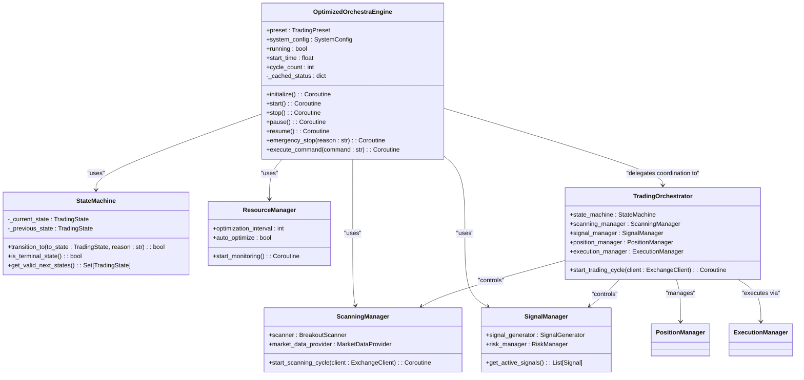
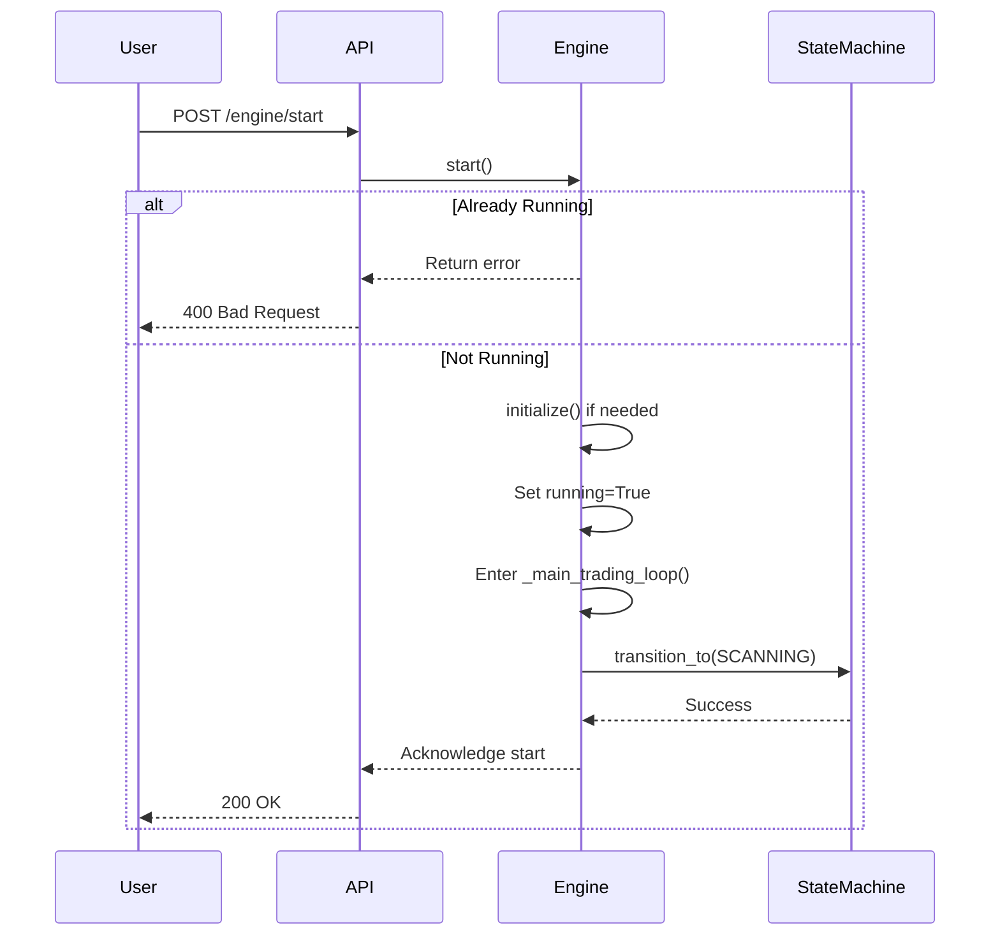
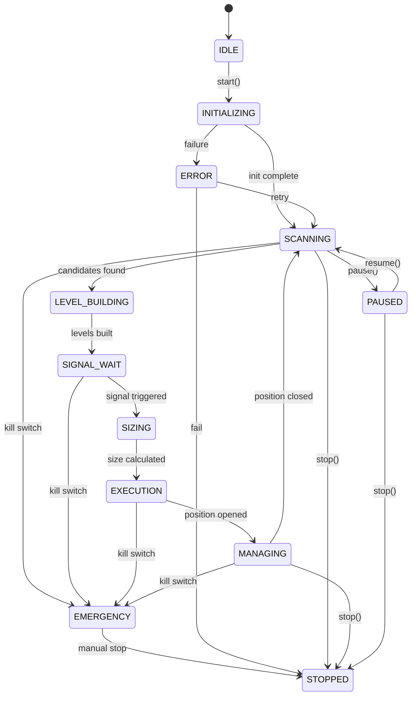

# Engine Lifecycle Management

<cite>
**Referenced Files in This Document**   
- [engine.py](file://breakout_bot/core/engine.py)
- [engine_manager.py](file://breakout_bot/api/engine_manager.py)
- [state_machine.py](file://breakout_bot/core/state_machine.py)
- [routers/engine.py](file://breakout_bot/api/routers/engine.py)
</cite>

## Table of Contents
1. [Introduction](#introduction)
2. [Engine Initialization and Dependency Injection](#engine-initialization-and-dependency-injection)
3. [Control Methods: Start, Stop, Pause, Resume](#control-methods-start-stop-pause-resume)
4. [API Integration via engine_manager.py](#api-integration-via-engine_managerpy)
5. [State Transitions and Error Handling](#state-transitions-and-error-handling)
6. [Resource Cleanup on Shutdown](#resource-cleanup-on-shutdown)
7. [Health Checks and Readiness Probes](#health-checks-and-readiness-probes)
8. [Conclusion](#conclusion)

## Introduction
The trading engine's lifecycle management system is centered around the `OptimizedOrchestraEngine` class defined in `engine.py`. This system orchestrates the initialization, execution, pausing, resuming, and shutdown of a sophisticated trading workflow. The engine operates through a well-defined state machine that governs its behavior across various stages including scanning, signal generation, risk assessment, execution, and position management.

The lifecycle is controlled by a set of explicit methods—`start()`, `stop()`, `pause()`, and `resume()`—which provide granular control over the engine’s operational state. These methods are integrated with an HTTP API layer via `engine_manager.py`, allowing remote operation and monitoring. The system employs dependency injection to wire together core components such as `ScanningManager`, `SignalManager`, `RiskManager`, and `ExecutionManager` during startup, ensuring modularity and testability.

This document details how user commands propagate from API endpoints into internal engine actions, how errors are handled during state transitions (e.g., preventing duplicate startups), and how resources are properly cleaned up upon stopping. It also covers health checks used in production environments to determine engine readiness and overall system stability.

**Section sources**
- [engine.py](file://breakout_bot/core/engine.py#L0-L1207)

## Engine Initialization and Dependency Injection
The `OptimizedOrchestraEngine` class initializes its core components using dependency injection, promoting loose coupling and maintainability. During instantiation, it loads configuration presets and system settings, then creates instances of essential services like logging, performance monitoring, metrics collection, and diagnostics.

Key dependencies are injected directly into the engine or initialized within the `initialize()` method. These include:
- `ExchangeClient`: For interacting with the exchange API.
- `MarketDataProvider`: To fetch real-time market data.
- `BreakoutScanner`: Identifies potential trading opportunities.
- `SignalGenerator`: Generates trade signals based on market conditions.
- `RiskManager`: Enforces risk constraints.
- `PositionManager`: Manages open and closed positions.
- `ExecutionManager`: Handles order placement and execution.

These components are further coordinated by specialized managers:
- `ScanningManager`: Wraps scanner and market data provider.
- `SignalManager`: Coordinates signal generation and risk validation.
- `ResourceManager`: Monitors system resource usage.
- `TradingOrchestrator`: Central coordinator for the entire trading cycle.

All these components are wired together during the `initialize()` call, which also starts background tasks like resource monitoring and sets up the state machine for lifecycle control.



**Diagram sources**
- [engine.py](file://breakout_bot/core/engine.py#L0-L1207)
- [state_machine.py](file://breakout_bot/core/state_machine.py#L0-L350)

**Section sources**
- [engine.py](file://breakout_bot/core/engine.py#L0-L1207)

## Control Methods: Start, Stop, Pause, Resume
The engine exposes four primary control methods to manage its lifecycle:

### `start()`
Begins the main trading loop if the engine is not already running. If the orchestrator hasn't been initialized, it calls `initialize()` first. It sets `running = True` and invokes `_main_trading_loop()`.

### `stop()`
Stops the engine gracefully by setting `running = False` and transitioning the state machine to `STOPPED`. This causes the main loop to exit after completing the current cycle.

### `pause()`
Transitions the engine to the `PAUSED` state via the state machine, halting active trading operations while preserving context. Only allowed from non-terminal states.

### `resume()`
Resumes operation from a paused state by transitioning back to `SCANNING`, restarting the trading cycle.

Each method integrates with the `StateMachine` to enforce valid state transitions and prevent illegal operations (e.g., starting when already running).



**Diagram sources**
- [engine.py](file://breakout_bot/core/engine.py#L0-L1207)
- [routers/engine.py](file://breakout_bot/api/routers/engine.py#L0-L545)

**Section sources**
- [engine.py](file://breakout_bot/core/engine.py#L0-L1207)

## API Integration via engine_manager.py
The engine is exposed over HTTP through FastAPI routers located in `routers/engine.py`. The `engine_manager.py` module provides helper functions like `get_engine()` and `get_engine_optional()` to safely access the global engine instance (`_engine_instance`) from API endpoints.

Key endpoints include:
- `POST /api/engine/start`: Starts the engine with a specified preset and mode (paper/live).
- `POST /api/engine/stop`: Stops the engine and cancels background tasks.
- `POST /api/engine/pause`: Pauses the engine.
- `POST /api/engine/resume`: Resumes the engine.
- `GET /api/engine/status`: Returns cached engine status.
- `GET /api/engine/commands`: Lists available commands based on current state.

Commands can also be issued generically via `POST /api/engine/command` with a JSON body containing the command string (e.g., `"start"`). The API validates preconditions (e.g., disallowing reload while running) and propagates errors appropriately.

```mermaid
flowchart TD
A[User] --> B{HTTP Request}
B --> C[/api/engine/start\]
B --> D[/api/engine/stop\]
B --> E[/api/engine/pause\]
B --> F[/api/engine/resume\]
B --> G[/api/engine/command\]
C --> H[routers.engine.start_engine]
D --> I[routers.engine.stop_engine]
E --> J[routers.engine.pause_engine]
F --> K[routers.engine.resume_engine]
G --> L[routers.engine.execute_command]
H --> M[engine.start()]
I --> N[engine.stop()]
J --> O[engine.pause()]
K --> P[engine.resume()]
L --> Q[engine.execute_command()]
M --> R[Engine starts trading loop]
N --> S[Engine stops gracefully]
O --> T[Engine pauses via state machine]
P --> U[Engine resumes scanning]
Q --> V[Delegates to specific control method]
```

**Diagram sources**
- [engine_manager.py](file://breakout_bot/api/engine_manager.py#L0-L21)
- [routers/engine.py](file://breakout_bot/api/routers/engine.py#L0-L545)

**Section sources**
- [engine_manager.py](file://breakout_bot/api/engine_manager.py#L0-L21)
- [routers/engine.py](file://breakout_bot/api/routers/engine.py#L0-L545)

## State Transitions and Error Handling
The engine uses a finite state machine (`StateMachine`) to manage valid state transitions. Defined states include `IDLE`, `INITIALIZING`, `SCANNING`, `LEVEL_BUILDING`, `SIGNAL_WAIT`, `SIZING`, `EXECUTION`, `MANAGING`, `PAUSED`, `ERROR`, `EMERGENCY`, and `STOPPED`.

Transitions are validated against a predefined matrix (`VALID_TRANSITIONS`). For example:
- From `SCANNING`, valid next states are `LEVEL_BUILDING`, `MANAGING`, `PAUSED`, `ERROR`, `EMERGENCY`, or `STOPPED`.
- From `PAUSED`, the engine can resume to `SCANNING` or `MANAGING`.

Critical error handling occurs at multiple levels:
- **Initialization Errors**: Handled via `enhanced_error_handler` with critical severity; transitions to `ERROR` state.
- **Main Loop Exceptions**: Logged and processed by both enhanced and legacy handlers; may trigger emergency stop.
- **Duplicate Startup Prevention**: The `start()` method checks `self.running` before proceeding.
- **Kill Switch Logic**: Implemented in `_check_kill_switch()`, which monitors daily PnL loss and triggers `EMERGENCY` state if limits are exceeded.

When an emergency stop is triggered, all operations cease, and the engine enters a terminal `EMERGENCY` state until manually reset.



**Diagram sources**
- [state_machine.py](file://breakout_bot/core/state_machine.py#L0-L350)
- [engine.py](file://breakout_bot/core/engine.py#L0-L1207)

**Section sources**
- [state_machine.py](file://breakout_bot/core/state_machine.py#L0-L350)
- [engine.py](file://breakout_bot/core/engine.py#L0-L1207)

## Resource Cleanup on Shutdown
Upon calling `stop()`, the engine performs comprehensive resource cleanup:
- Sets `running = False` to terminate the main loop.
- Transitions state machine to `STOPPED`.
- Cancels any background tasks (e.g., resource monitoring).
- Disconnects WebSocket connections if active.
- Clears caches and resets transient state.

In the API layer (`routers/engine.py`), additional cleanup includes:
- Ending all monitoring sessions via `monitoring_manager.end_all_sessions()`.
- Clearing the engine reference in `app_state`.
- Stopping global resource monitoring.

This ensures no orphaned processes remain and allows for safe restart.

**Section sources**
- [engine.py](file://breakout_bot/core/engine.py#L0-L1207)
- [routers/engine.py](file://breakout_bot/api/routers/engine.py#L0-L545)

## Health Checks and Readiness Probes
The system supports health checks through several mechanisms:
- **Internal Health Monitoring**: Legacy `_check_health()` returns `True` unless overridden; actual health is inferred from component liveness.
- **Resource Health Endpoint**: `GET /api/engine/resource-health` reports CPU, memory, disk, and thread usage.
- **Readiness via Status**: The `/api/engine/status` endpoint reflects current state (`IDLE`, `SCANNING`, etc.), which clients use to determine readiness.
- **Command Availability**: `GET /api/engine/commands` dynamically lists allowed commands based on current state, serving as an indirect health probe.

Frontend applications (e.g., React hooks in `useEngine.ts`) poll `/status` and `/commands` every 5 seconds to update UI controls and display real-time engine state.

**Section sources**
- [engine.py](file://breakout_bot/core/engine.py#L0-L1207)
- [routers/engine.py](file://breakout_bot/api/routers/engine.py#L0-L545)
- [frontend/src/hooks/useEngine.ts](file://frontend/src/hooks/useEngine.ts#L0-L91)

## Conclusion
The trading engine's lifecycle management system provides a robust framework for controlling complex trading workflows. Through clear separation of concerns, dependency injection, and strict state management, it ensures reliable operation from initialization to shutdown. The integration with an HTTP API enables remote control and monitoring, while comprehensive error handling and resource cleanup safeguard system integrity. This architecture supports both automated trading logic and manual intervention, making it suitable for production deployment in dynamic financial markets.