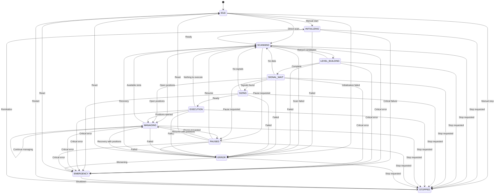

# State Machine Implementation

<cite>
**Referenced Files in This Document**   
- [state_machine.py](file://breakout_bot/core/state_machine.py)
- [engine.py](file://breakout_bot/core/engine.py)
- [trading_orchestrator.py](file://breakout_bot/core/trading_orchestrator.py)
- [monitoring.py](file://breakout_bot/api/routers/monitoring.py)
- [StateMachineVisualizer.tsx](file://frontend/src/components/ui/StateMachineVisualizer.tsx)
</cite>

## Table of Contents
1. [Introduction](#introduction)
2. [State Enumeration](#state-enumeration)
3. [Transition Logic and Guard Conditions](#transition-logic-and-guard-conditions)
4. [Integration with Engine](#integration-with-engine)
5. [Event Processing](#event-processing)
6. [Error Recovery Mechanisms](#error-recovery-mechanisms)
7. [Monitoring and Logging](#monitoring-and-logging)
8. [State Transition Diagram](#state-transition-diagram)

## Introduction
The state machine governs the operational workflow of the trading engine, ensuring valid state progression and preventing illegal operations. It centralizes state management, validates transitions, logs all changes, and notifies components about state changes. The implementation enforces a strict sequence of operations from initialization through scanning, signal generation, execution, and position management, while handling errors and external commands appropriately.

**Section sources**
- [state_machine.py](file://breakout_bot/core/state_machine.py#L1-L30)

## State Enumeration
The trading system operates through a well-defined set of states that represent different phases of the trading workflow:

- **IDLE**: System is initialized but not actively trading
- **INITIALIZING**: Components are being initialized
- **SCANNING**: Market scanning for potential opportunities
- **LEVEL_BUILDING**: Building support/resistance levels
- **SIGNAL_WAIT**: Waiting for trading signals
- **SIZING**: Calculating position sizes
- **EXECUTION**: Executing trades
- **MANAGING**: Managing open positions
- **PAUSED**: System temporarily paused
- **ERROR**: Error state requiring intervention
- **EMERGENCY**: Critical emergency state
- **STOPPED**: System has been stopped

These states ensure the trading engine progresses through its workflow in a controlled manner.

**Section sources**
- [state_machine.py](file://breakout_bot/core/state_machine.py#L23-L36)

## Transition Logic and Guard Conditions
The state machine enforces valid transitions through a predefined transition matrix that specifies which state changes are permitted. Each transition is guarded by validation logic that prevents invalid state changes.

The `can_transition()` method checks if a proposed state change is allowed according to the VALID_TRANSITIONS matrix. For example, the system cannot transition directly from SCANNING to EXECUTION - it must first pass through SIGNAL_WAIT and SIZING states.

The `transition_to()` method implements several guard conditions:
- Validates the transition against the allowed transitions matrix
- Prevents transitions to the same state (unless forced)
- Uses an asyncio lock to ensure thread-safe operations
- Implements a 5-second timeout to prevent deadlocks

When a transition is attempted, the system first validates it against the transition matrix. If valid, it creates a StateTransition object containing metadata about the change, updates the current and previous state tracking, and adds the transition to the history log.

**Section sources**
- [state_machine.py](file://breakout_bot/core/state_machine.py#L49-L348)

## Integration with Engine
The StateMachine class integrates tightly with the main Engine through the TradingOrchestrator component. The OptimizedOrchestraEngine initializes the StateMachine during startup and uses it to coordinate the trading workflow.

The integration works as follows:
1. The engine initializes the state machine with an initial state (typically INITIALIZING)
2. The trading orchestrator queries the current state to determine which operation to perform
3. After completing an operation, the orchestrator requests a state transition
4. The state machine validates and executes the transition
5. The engine adjusts its behavior based on the new state

For example, when the engine starts, it initializes components and then transitions to SCANNING state. The orchestrator's main loop checks the current state and calls the appropriate handler method based on the state value.

**Section sources**
- [engine.py](file://breakout_bot/core/engine.py#L36-L64)
- [trading_orchestrator.py](file://breakout_bot/core/trading_orchestrator.py#L100-L150)

## Event Processing
The state machine processes both external API commands and internal events through the transition_to() method. External commands like start, stop, pause, and resume trigger specific state transitions:

- START command triggers transition from IDLE to SCANNING
- STOP command triggers transition to STOPPED state
- PAUSE command transitions to PAUSED state
- RESUME command transitions back to SCANNING

Internal events also trigger transitions. For example, when scan completion occurs, the system automatically transitions from SCANNING to LEVEL_BUILDING:

```python
await self.state_machine.transition_to(
    TradingState.LEVEL_BUILDING,
    f"Found {len(scan_results)} candidates"
)
```

Similarly, when signals are generated, the system transitions from SIGNAL_WAIT to SIZING:

```python
await self.state_machine.transition_to(
    TradingState.SIZING,
    f"Found {len(signals)} signals"
)
```

The notify_callback parameter allows components to receive notifications about state changes, enabling reactive behavior across the system.

**Section sources**
- [trading_orchestrator.py](file://breakout_bot/core/trading_orchestrator.py#L200-L250)
- [engine.py](file://breakout_bot/core/engine.py#L500-L550)

## Error Recovery Mechanisms
The state machine implements robust error recovery mechanisms to handle failures gracefully. When critical errors occur, the system automatically transitions to appropriate error states:

- Non-critical errors may transition to ERROR state while preserving context
- Critical failures trigger transition to EMERGENCY state
- From EMERGENCY state, the system can only transition to STOPPED or IDLE

The system implements automatic fallback to IDLE on critical failures:

```python
def reset_to_initial(self, reason: str = "System reset") -> None:
    logger.info(f"Resetting StateMachine to IDLE: {reason}")
    self._previous_state = self._current_state
    self._current_state = TradingState.IDLE
```

The transition_to() method includes comprehensive error handling with timeouts and exception catching to prevent the state machine itself from failing. If a transition fails due to timeout or other errors, it returns False, allowing the calling component to handle the failure appropriately.

**Section sources**
- [state_machine.py](file://breakout_bot/core/state_machine.py#L250-L270)
- [engine.py](file://breakout_bot/core/engine.py#L400-L450)

## Monitoring and Logging
The state machine provides comprehensive logging and monitoring hooks to capture state changes for audit and debugging purposes. Every transition is logged with detailed information:

- Source and destination states
- Timestamp of the transition
- Reason for the transition
- Additional metadata

The system implements multiple logging mechanisms:
- Standard Python logging for basic transition records
- Enhanced logging with context information
- WebSocket notifications for real-time monitoring
- History tracking for audit trails

The get_transition_history() method maintains a rolling log of the last 100 transitions, which can be accessed via API endpoints:

```python
def get_transition_history(self, limit: int = 50) -> List[StateTransition]:
    return self._transition_history[-limit:] if limit > 0 else self._transition_history.copy()
```

The frontend visualization component displays these transitions in real-time, showing the current state, previous state, and recent transition history with timestamps and reasons.

**Section sources**
- [state_machine.py](file://breakout_bot/core/state_machine.py#L300-L330)
- [monitoring.py](file://breakout_bot/api/routers/monitoring.py#L236-L262)
- [StateMachineVisualizer.tsx](file://frontend/src/components/ui/StateMachineVisualizer.tsx#L100-L150)

## State Transition Diagram


**Diagram sources**
- [state_machine.py](file://breakout_bot/core/state_machine.py#L49-L348)
- [trading_orchestrator.py](file://breakout_bot/core/trading_orchestrator.py#L100-L150)