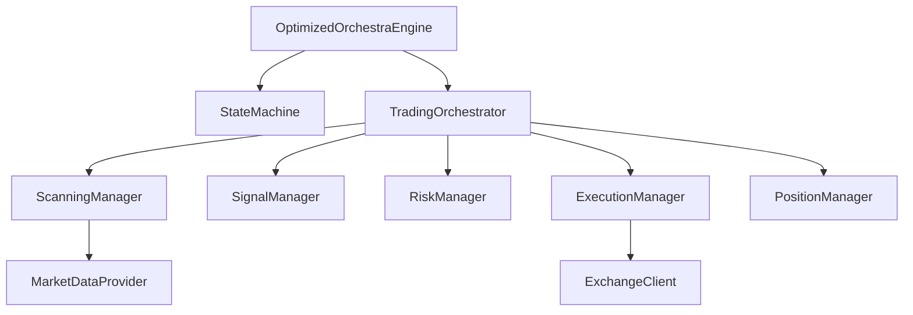
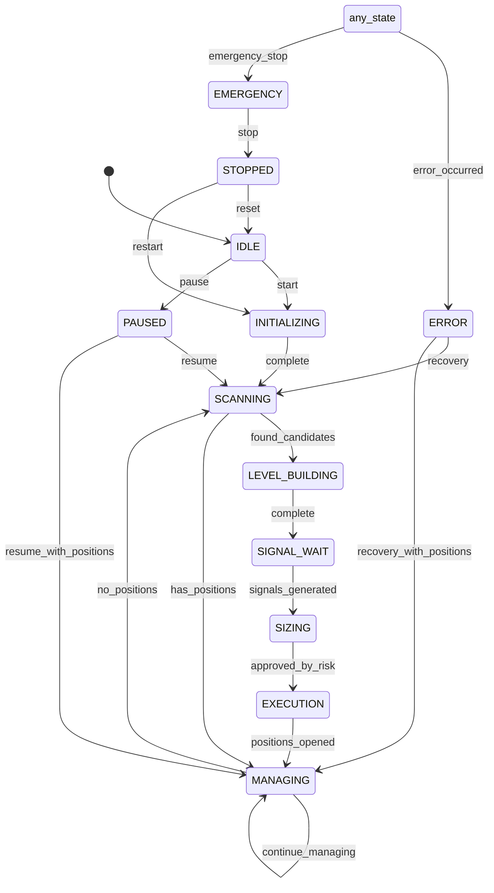
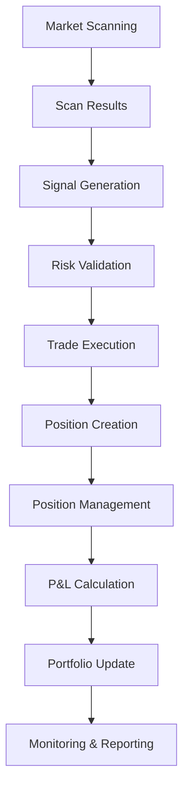

# Trading Engine Architecture

<cite>
**Referenced Files in This Document**   
- [engine.py](file://breakout_bot/core/engine.py)
- [state_machine.py](file://breakout_bot/core/state_machine.py)
- [trading_orchestrator.py](file://breakout_bot/core/trading_orchestrator.py)
- [engine_manager.py](file://breakout_bot/api/engine_manager.py)
</cite>

## Table of Contents
1. [Introduction](#introduction)
2. [Core Components and Dependencies](#core-components-and-dependencies)
3. [State Machine Workflow](#state-machine-workflow)
4. [Engine Class and Subsystem Orchestration](#engine-class-and-subsystem-orchestration)
5. [TradingOrchestrator Workflow Coordination](#tradingorchestrator-workflow-coordination)
6. [Component Interaction and Data Flow](#component-interaction-and-data-flow)
7. [Technical Decisions and Trade-offs](#technical-decisions-and-trade-offs)
8. [Scalability Considerations](#scalability-considerations)
9. [API Integration and Remote Control](#api-integration-and-remote-control)
10. [Performance Monitoring and Failure Modes](#performance-monitoring-and-failure-modes)

## Introduction
The Trading Engine is a sophisticated system designed to automate trading activities based on predefined strategies and market conditions. At its core, the engine operates as a state machine that governs the lifecycle of trading operations through distinct states such as IDLE, SCANNING, SIGNAL_GENERATION, EXECUTION, PAUSED, and STOPPED. The architecture emphasizes modularity, with specialized components handling scanning, signaling, risk management, and execution tasks. These components are orchestrated by the `OptimizedOrchestraEngine` class, which coordinates their interactions via dependency injection. This documentation provides an in-depth analysis of the engine's design, focusing on the state machine implementation, workflow coordination, integration points, and technical considerations.

## Core Components and Dependencies
The trading engine comprises several key components that work together to execute trades efficiently and safely. The primary classes include `OptimizedOrchestraEngine`, `StateMachine`, `TradingOrchestrator`, and various managers for scanning, signaling, risk assessment, and execution. These components are interconnected through well-defined interfaces, ensuring loose coupling and high cohesion. The engine leverages external services like exchange clients and market data providers while maintaining internal consistency through centralized state management.

**Diagram sources**
- [engine.py](file://breakout_bot/core/engine.py#L66-L100)
- [trading_orchestrator.py](file://breakout_bot/core/trading_orchestrator.py#L36-L66)

**Section sources**
- [engine.py](file://breakout_bot/core/engine.py#L66-L100)
- [trading_orchestrator.py](file://breakout_bot/core/trading_orchestrator.py#L36-L66)

## State Machine Workflow
The `StateMachine` class implements the State Pattern to manage the lifecycle of the trading system. It defines a finite set of states represented by the `TradingState` enum, including IDLE, INITIALIZING, SCANNING, LEVEL_BUILDING, SIGNAL_WAIT, SIZING, EXECUTION, MANAGING, PAUSED, ERROR, EMERGENCY, and STOPPED. Transitions between these states are governed by a validation matrix (`VALID_TRANSITIONS`) that ensures only valid transitions occur. For example, from the SCANNING state, the system can transition to LEVEL_BUILDING, MANAGING, PAUSED, ERROR, EMERGENCY, or STOPPED, but not directly to EXECUTION.

Each state transition is logged and can trigger notifications through a callback mechanism. The `transition_to` method enforces thread safety using an asyncio lock and includes timeout protection to prevent deadlocks. Invalid transitions are rejected with a warning log entry, while attempts to transition to the same state are ignored unless forced. The state machine also maintains a history of recent transitions, limited to 100 entries, which can be queried for debugging or monitoring purposes.

**Diagram sources**
- [state_machine.py](file://breakout_bot/core/state_machine.py#L23-L36)
- [state_machine.py](file://breakout_bot/core/state_machine.py#L53-L53)

**Section sources**
- [state_machine.py](file://breakout_bot/core/state_machine.py#L23-L36)
- [state_machine.py](file://breakout_bot/core/state_machine.py#L53-L53)

## Engine Class and Subsystem Orchestration
The `OptimizedOrchestraEngine` class serves as the main entry point and API for the trading system. It initializes all core components during startup, including the state machine, error handler, scanning manager, signal manager, resource manager, and trading orchestrator. Dependency injection is used extensively to provide these components with the necessary collaborators, promoting testability and flexibility. For instance, the `TradingOrchestrator` receives instances of the state machine, error handler, and various managers through its constructor.

The engine exposes methods for controlling its lifecycle, such as `start()`, `stop()`, `pause()`, `resume()`, and `emergency_stop()`. These methods interact with the state machine to effect state transitions, ensuring that the system behaves predictably under different conditions. The engine also provides legacy compatibility methods like `_handle_scanning_state()` and `_execute_state_cycle()` to support existing tests and integrations. Additionally, it maintains a cache of frequently accessed data, such as system status, positions, and signals, to enable fast API responses without blocking operations.

**Section sources**
- [engine.py](file://breakout_bot/core/engine.py#L66-L100)
- [engine.py](file://breakout_bot/core/engine.py#L430-L459)

## TradingOrchestrator Workflow Coordination
The `TradingOrchestrator` class is responsible for coordinating complex workflows within the trading system. It manages the execution of trading cycles based on the current state of the system. Each cycle involves processing scan results into signals, validating them against risk rules, and initiating trade execution when appropriate. The orchestrator delegates specific tasks to specialized managers: the `ScanningManager` handles market scanning, the `SignalManager` generates and validates signals, and the `ExecutionManager` executes trades.

The orchestrator follows a sequential approach within an asynchronous framework, executing one phase at a time according to the current state. For example, in the SCANNING state, it invokes `_execute_scanning_cycle()` to perform market scans; in the SIGNAL_WAIT state, it calls `_execute_signal_wait_cycle()` to generate signals from scan results. This synchronous coordination simplifies error handling and state management, although it may limit concurrency compared to a fully parallelized approach. The orchestrator also monitors the success of each cycle and records this information with the error handler for circuit breaker functionality.

**Section sources**
- [trading_orchestrator.py](file://breakout_bot/core/trading_orchestrator.py#L36-L66)
- [trading_orchestrator.py](file://breakout_bot/core/trading_orchestrator.py#L120-L156)

## Component Interaction and Data Flow
Data flows through the trading engine in a structured manner, starting with market scanning and ending with position management. In the SCANNING state, the `ScanningManager` queries the `MarketDataProvider` for real-time market data, which is then processed to identify potential trading opportunities. These scan results are passed to the `SignalManager`, which uses the `SignalGenerator` to create actionable signals. Each signal undergoes risk evaluation by the `RiskManager`, which assesses factors like position size, stop distance, and portfolio impact before approving it for execution.

Approved signals are forwarded to the `ExecutionManager`, which interacts with the `ExchangeClient` to place orders. Upon successful execution, a new `Position` object is created and added to the `PositionManager`'s collection. The `TradingOrchestrator` continuously updates open positions by fetching current market prices and recalculating P&L metrics. This data flow is visualized below:

**Diagram sources**
- [trading_orchestrator.py](file://breakout_bot/core/trading_orchestrator.py#L36-L66)
- [trading_orchestrator.py](file://breakout_bot/core/trading_orchestrator.py#L458-L657)

**Section sources**
- [trading_orchestrator.py](file://breakout_bot/core/trading_orchestrator.py#L36-L66)
- [trading_orchestrator.py](file://breakout_bot/core/trading_orchestrator.py#L458-L657)

## Technical Decisions and Trade-offs
Several technical decisions shape the behavior and performance of the trading engine. One significant choice is the use of synchronous coordination within an asynchronous framework. While this approach simplifies state management and error recovery, it limits the system's ability to handle multiple concurrent operations, potentially affecting throughput during peak activity periods. Another decision involves the implementation of a centralized state machine, which provides clear visibility into the system's lifecycle but introduces a single point of control that must be carefully managed for reliability.

The engine employs caching mechanisms to improve API response times, storing frequently accessed data like system status, positions, and signals in memory. However, this introduces the challenge of cache invalidation, particularly when underlying data changes rapidly. To address this, the engine updates its cache periodically (every 2 seconds) rather than relying on real-time synchronization. Additionally, the system uses enhanced error handling with categorized exceptions and severity levels, enabling targeted recovery actions based on the nature of the failure.

**Section sources**
- [engine.py](file://breakout_bot/core/engine.py#L66-L100)
- [engine.py](file://breakout_bot/core/engine.py#L66-L100)

## Scalability Considerations
The trading engine faces scalability challenges when handling multiple concurrent scans or signals. Currently, the system processes one trading cycle at a time, which may become a bottleneck as the number of monitored symbols increases. To mitigate this, the engine could implement parallel scanning across different market segments or exchanges, distributing the workload across multiple threads or processes. Similarly, signal generation and risk evaluation could be parallelized to reduce latency and increase throughput.

Another scalability concern arises from the centralized state machine, which must coordinate all state transitions. As the system grows in complexity, this component may experience increased contention, especially during high-frequency state changes. Potential solutions include partitioning the state machine by market segment or strategy type, allowing independent operation of different trading subsystems. Furthermore, the engine's reliance on in-memory data structures for position and signal tracking may limit its capacity to handle large volumes of concurrent trades, necessitating the use of external databases or distributed caches for persistence.

**Section sources**
- [engine.py](file://breakout_bot/core/engine.py#L66-L100)
- [trading_orchestrator.py](file://breakout_bot/core/trading_orchestrator.py#L36-L66)

## API Integration and Remote Control
The trading engine integrates with the API layer through the `engine_manager.py` module, which provides functions for accessing the engine instance from HTTP request handlers. The FastAPI router in `routers/engine.py` exposes endpoints for starting, stopping, pausing, resuming, and reloading the engine, as well as executing system commands like emergency stops. These endpoints validate user input, check the engine's current state, and invoke corresponding methods on the engine instance.

Remote control capabilities allow users to manage the engine's operation from external applications or web interfaces. For example, the `/start` endpoint accepts a preset name and trading mode (paper or live), initializing the engine with the specified configuration. The `/commands` endpoint returns a list of available commands based on the current state, enabling dynamic UI updates in client applications. WebSocket notifications inform connected clients of state transitions and errors, facilitating real-time monitoring and intervention.

**Section sources**
- [engine_manager.py](file://breakout_bot/api/engine_manager.py#L1-L21)
- [engine.py](file://breakout_bot/api/routers/engine.py#L374-L418)

## Performance Monitoring and Failure Modes
The trading engine incorporates performance monitoring hooks to track key metrics such as cycle time, error rates, and resource utilization. The `ResourceMonitor` component collects CPU, memory, and disk usage statistics, alerting operators to potential issues before they affect trading operations. The engine also logs detailed information about each state transition, including timestamps, reasons, and metadata, which can be analyzed to identify bottlenecks or anomalies.

Failure modes include unresponsive exchanges, rate limiting, network connectivity issues, and internal software errors. The system responds to these conditions through various mechanisms: the `ErrorHandler` attempts retries with exponential backoff for transient failures, while the `KillSwitch` activates when daily losses exceed a configurable threshold. In cases of critical errors, the engine transitions to the EMERGENCY state, halting all trading activities until manual intervention occurs. Rate limiting is handled by the `RateLimiter` component, which queues requests and respects API quotas to avoid service disruptions.

**Section sources**
- [engine.py](file://breakout_bot/core/engine.py#L66-L100)
- [engine.py](file://breakout_bot/api/routers/engine.py#L374-L418)