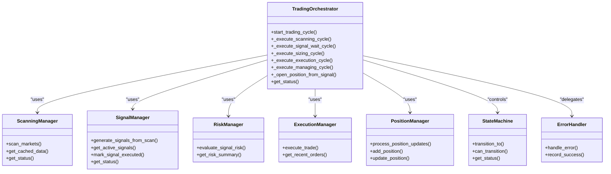
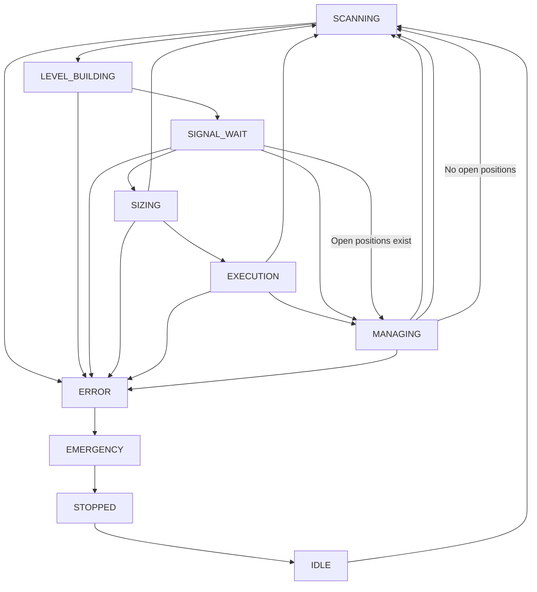
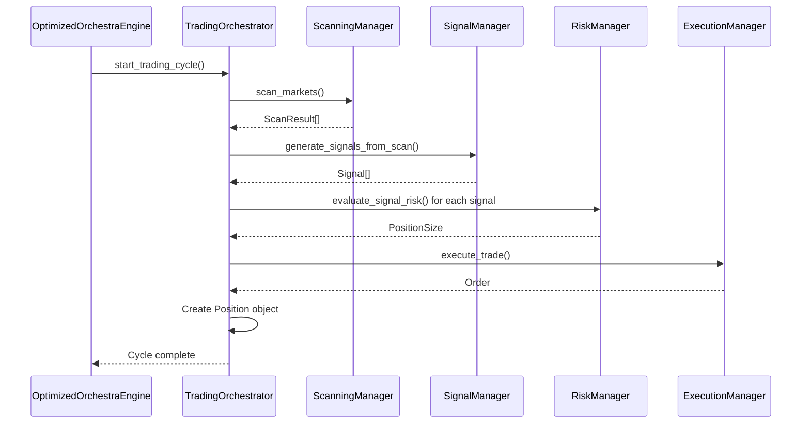
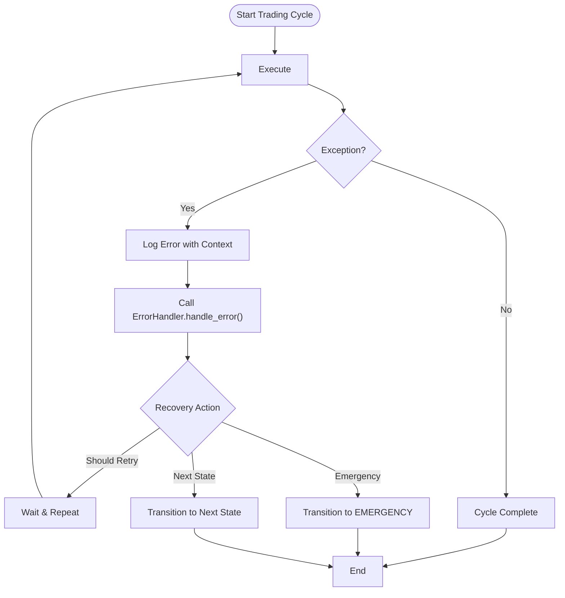

# Workflow Orchestration

<cite>
**Referenced Files in This Document**   
- [trading_orchestrator.py](file://breakout_bot/core/trading_orchestrator.py)
- [scanning_manager.py](file://breakout_bot/core/scanning_manager.py)
- [signal_manager.py](file://breakout_bot/core/signal_manager.py)
- [risk_manager.py](file://breakout_bot/risk/risk_manager.py)
- [execution/manager.py](file://breakout_bot/execution/manager.py)
- [state_machine.py](file://breakout_bot/core/state_machine.py)
</cite>

## Table of Contents
1. [Introduction](#introduction)
2. [Core Components and Dependencies](#core-components-and-dependencies)
3. [Trading State Machine and Lifecycle](#trading-state-machine-and-lifecycle)
4. [Orchestration Workflow from Candidate to Execution](#orchestration-workflow-from-candidate-to-execution)
5. [Asynchronous Task Management in FastAPI Event Loop](#asynchronous-task-management-in-fastapi-event-loop)
6. [Concurrency and Parallel Signal Handling](#concurrency-and-parallel-signal-handling)
7. [Error Handling, Rollback, and Recovery Strategies](#error-handling-rollback-and-recovery-strategies)
8. [Logging, Traceability, and Diagnostics Integration](#logging-traceability-and-diagnostics-integration)
9. [Design Trade-offs: Linear vs. Parallel Processing](#design-trade-offs-linear-vs-parallel-processing)
10. [Conclusion](#conclusion)

## Introduction

The TradingOrchestrator component serves as the central coordinator for complex trading workflows within the Breakout Bot system. It manages the end-to-end lifecycle of trade execution by sequencing operations across multiple subsystems including market scanning, signal generation, risk evaluation, and order execution. The orchestrator operates within a state-driven architecture, progressing through distinct phases such as SCANNING, SIGNAL_WAIT, SIZING, EXECUTION, and MANAGING based on system conditions and outcomes.

This document details how the TradingOrchestrator coordinates these components, manages asynchronous tasks within FastAPI's event loop, handles concurrency during multi-signal processing, implements robust error recovery mechanisms, and integrates with logging and diagnostics systems for full traceability. Special attention is given to the design decisions between linear execution and parallel processing of independent trading signals.

**Section sources**
- [trading_orchestrator.py](file://breakout_bot/core/trading_orchestrator.py#L1-L35)

## Core Components and Dependencies

The TradingOrchestrator depends on several key components that handle specialized functions within the trading pipeline:

- **ScanningManager**: Responsible for initiating market scans and collecting ScanResult outputs from available trading pairs.
- **SignalManager**: Processes scan results to generate valid trading signals using configured strategies.
- **RiskManager**: Evaluates each signal against portfolio risk constraints, position sizing rules, and correlation limits.
- **ExecutionManager**: Executes approved trades on the exchange with depth-aware order placement strategies.
- **PositionManager**: Tracks and updates open positions throughout their lifecycle.
- **StateMachine**: Governs the overall workflow by managing transitions between trading states.
- **ErrorHandler**: Provides centralized error handling and recovery actions.

These dependencies are injected during initialization, enabling loose coupling and testability. The orchestrator uses these components sequentially or conditionally based on the current state and system context.

**Diagram sources**
- [trading_orchestrator.py](file://breakout_bot/core/trading_orchestrator.py#L36-L90)
- [scanning_manager.py](file://breakout_bot/core/scanning_manager.py#L30-L45)
- [signal_manager.py](file://breakout_bot/core/signal_manager.py#L30-L45)
- [risk_manager.py](file://breakout_bot/risk/risk_manager.py#L30-L45)
- [execution/manager.py](file://breakout_bot/execution/manager.py#L30-L45)
- [position_manager.py](file://breakout_bot/position/position_manager.py#L10-L25)
- [state_machine.py](file://breakout_bot/core/state_machine.py#L10-L25)
- [error_handler.py](file://breakout_bot/core/error_handler.py#L10-L25)

## Trading State Machine and Lifecycle

The TradingOrchestrator operates based on a finite state machine (FSM) defined in `state_machine.py`. The FSM enforces valid transitions between trading states, ensuring system integrity and preventing invalid workflows. Key states include:

- **SCANNING**: Initiating market scans via ScanningManager
- **LEVEL_BUILDING**: Constructing support/resistance levels (currently delegated to scanner)
- **SIGNAL_WAIT**: Waiting for valid signals from SignalManager
- **SIZING**: Applying risk rules through RiskManager to determine position size
- **EXECUTION**: Sending orders via ExecutionManager
- **MANAGING**: Monitoring and adjusting open positions
- **ERROR/EMERGENCY**: Handling failures and critical conditions

Transitions are validated before execution, and all changes are logged for audit purposes. For example, only specific next states are allowed from `SIZING`, primarily transitioning to `EXECUTION` upon success or back to `SCANNING` if no signals pass risk checks.

**Diagram sources**
- [state_machine.py](file://breakout_bot/core/state_machine.py#L49-L135)
- [trading_orchestrator.py](file://breakout_bot/core/trading_orchestrator.py#L100-L118)

## Orchestration Workflow from Candidate to Execution

The TradingOrchestrator follows a step-by-step flow to coordinate trading activities:

1. **Market Scanning**: In the `SCANNING` state, it invokes `ScanningManager.scan_markets()` to identify potential breakout candidates.
2. **Signal Generation**: Upon finding candidates, it transitions to `SIGNAL_WAIT` and calls `SignalManager.generate_signals_from_scan()` to convert scan results into actionable signals.
3. **Risk Evaluation**: Entering `SIZING`, it uses `RiskManager.evaluate_signal_risk()` to validate each signal against account equity, position limits, and correlation exposure.
4. **Position Sizing**: Approved signals receive calculated position sizes considering R-multiple, stop distance, and market depth constraints.
5. **Trade Execution**: In `EXECUTION`, it loops through approved signals and calls `_open_position_from_signal()`, which delegates to `ExecutionManager.execute_trade()`.
6. **Position Activation**: Successfully executed trades create `Position` objects stored in `current_positions`.

Each stage includes synchronization points where the orchestrator waits for completion before proceeding. Failure at any point triggers error handling and potential rollback (e.g., removing rejected signals).

**Section sources**
- [trading_orchestrator.py](file://breakout_bot/core/trading_orchestrator.py#L120-L550)

## Asynchronous Task Management in FastAPI Event Loop

The TradingOrchestrator leverages Python’s asyncio framework to manage non-blocking operations within FastAPI’s event loop. All core methods are implemented as coroutines (`async def`), allowing concurrent execution without blocking the main thread.

Key async patterns used:
- `await self.scanning_manager.scan_markets()` – Non-blocking market data retrieval
- `asyncio.sleep()` calls for pacing between cycles
- `await self._open_position_from_signal(signal)` – Concurrent position opening attempts
- Error handling wrapped in try-except blocks with `await self.error_handler.handle_error()`

The orchestrator does not spawn background tasks directly but relies on the engine’s main loop to schedule each cycle. Delays are tuned per state (e.g., 5s in SCANNING, 0.2s in EXECUTION) to balance responsiveness and resource usage.

**Diagram sources**
- [trading_orchestrator.py](file://breakout_bot/core/trading_orchestrator.py#L120-L250)
- [engine.py](file://breakout_bot/core/engine.py#L500-L550)

## Concurrency and Parallel Signal Handling

While the orchestrator processes signals sequentially within a single trading cycle, it supports limited concurrency through async/await semantics. Multiple signals can be evaluated in series, but network-bound operations like market data fetches may overlap due to cooperative multitasking.

Concurrency concerns addressed:
- **Race Conditions**: Shared state (e.g., `current_positions`) is modified only within synchronized sections.
- **Resource Limits**: Enforced via `max_concurrent_positions` configuration.
- **Signal Overlap**: Duplicate detection in `SignalManager._is_duplicate_signal()` prevents redundant entries.

Transient exchange errors (e.g., rate limits, timeouts) are handled via retry mechanisms built into the `ErrorHandler`. The orchestrator itself does not implement retries but delegates recovery actions to the error handler, which may instruct re-entry into a previous state after a delay.

**Section sources**
- [trading_orchestrator.py](file://breakout_bot/core/trading_orchestrator.py#L400-L500)
- [signal_manager.py](file://breakout_bot/core/signal_manager.py#L150-L180)
- [error_handler.py](file://breakout_bot/core/error_handler.py#L80-L120)

## Error Handling, Rollback, and Recovery Strategies

Robust error handling ensures system resilience during failures. When an exception occurs in `start_trading_cycle()`, the orchestrator:

1. Logs detailed error context using `enhanced_error_handler`
2. Invokes `error_handler.handle_error()` with component, operation, and metadata
3. Executes recovery action via `_execute_recovery_action()`

Recovery strategies include:
- **Retry with Delay**: For transient issues (e.g., API timeouts)
- **State Transition**: Move to `EMERGENCY` or fallback state
- **Circuit Breaker**: Success tracking prevents infinite retry loops

Rollback behavior varies by phase:
- In `EXECUTION`: Failed signals are marked as failed; partial fills are accepted.
- In `SIZING`: Signals failing risk checks are discarded without side effects.
- Critical failures trigger emergency shutdown via state transition.

**Diagram sources**
- [trading_orchestrator.py](file://breakout_bot/core/trading_orchestrator.py#L120-L156)
- [error_handler.py](file://breakout_bot/core/error_handler.py#L60-L100)

## Logging, Traceability, and Diagnostics Integration

The orchestrator provides comprehensive logging and traceability features:

- **Structured Logging**: Uses `enhanced_logger.info()` with `LogContext` containing session ID, component, and state.
- **Session Tracking**: Each cycle has a unique `current_session_id` for correlating logs.
- **Status Reporting**: `get_status()` exposes real-time metrics including cycle count, last duration, and position counts.
- **Diagnostics**: Integrates with `monitoring_manager` to record checkpoints at key stages (e.g., scan start, execution complete).
- **Audit Trail**: State transitions are recorded with timestamps and reasons.

Logs capture every significant event, enabling post-mortem analysis of trading decisions and performance measurement across cycles.

**Section sources**
- [trading_orchestrator.py](file://breakout_bot/core/trading_orchestrator.py#L100-L118)
- [trading_orchestrator.py](file://breakout_bot/core/trading_orchestrator.py#L600-L650)

## Design Trade-offs: Linear vs. Parallel Processing

The orchestrator adopts a primarily linear execution model rather than parallel processing of independent signals. This design choice reflects several trade-offs:

**Advantages of Linear Execution:**
- Simpler debugging and predictable behavior
- Easier state management and rollback logic
- Reduced risk of race conditions on shared resources
- Better alignment with exchange rate limits

**Limitations:**
- Sequential bottlenecks when processing many signals
- Longer cycle times under high load
- Less optimal resource utilization

Parallel alternatives were considered but rejected due to complexity in error isolation and inconsistent state recovery. However, future enhancements could introduce controlled parallelism—such as batching independent signals—while maintaining transactional boundaries per symbol.

**Section sources**
- [trading_orchestrator.py](file://breakout_bot/core/trading_orchestrator.py#L400-L500)

## Conclusion

The TradingOrchestrator effectively coordinates complex trading workflows by integrating scanning, signaling, risk management, and execution subsystems within a robust state-driven architecture. Its use of asynchronous programming enables efficient operation within FastAPI’s event loop, while structured error handling and recovery mechanisms ensure reliability. Comprehensive logging and diagnostics integration provide full traceability from candidate identification to position activation. Although currently favoring linear execution for simplicity and safety, the design allows for future evolution toward selective parallelism where appropriate.