# Configuration Errors

<cite>
**Referenced Files in This Document**   
- [CONCRETE_FIX_PLAN.md](file://CONCRETE_FIX_PLAN.md)
- [compare_presets.py](file://compare_presets.py)
- [presets.py](file://breakout_bot/api/routers/presets.py)
- [settings.py](file://breakout_bot/config/settings.py)
- [breakout_v1.json](file://breakout_bot/config/presets/breakout_v1.json)
- [breakout_v1_working.json](file://breakout_bot/config/presets/breakout_v1_working.json)
</cite>

## Table of Contents
1. [Introduction](#introduction)
2. [Common Configuration Errors](#common-configuration-errors)
3. [Preset Validation and Integrity Checking](#preset-validation-and-integrity-checking)
4. [Troubleshooting Preset Loading Issues](#troubleshooting-preset-loading-issues)
5. [Environment-Specific Configuration Pitfalls](#environment-specific-configuration-pitfalls)
6. [Best Practices for Preset Management](#best-practices-for-preset-management)

## Introduction
This document provides comprehensive guidance on identifying, diagnosing, and resolving configuration-related errors in the Breakout Bot trading system. It covers common mistakes such as invalid JSON presets, parameter out-of-range values, conflicting risk rules, and environment-specific misconfigurations. The content draws from real-world examples documented in CONCRETE_FIX_PLAN.md and leverages tools like compare_presets.py to illustrate proper validation techniques.

## Common Configuration Errors

Configuration errors can manifest in various forms, ranging from syntax issues to logical inconsistencies that compromise trading performance. Based on analysis of CONCRETE_FIX_PLAN.md and preset files, several recurring error patterns have been identified.

### Invalid JSON Presets
Malformed JSON structures prevent successful loading of trading presets. The `load_preset` function in settings.py explicitly handles JSON decoding errors:

```python
except json.JSONDecodeError as e:
    raise ValueError(f"Invalid JSON in preset file: {e}")
```

Common causes include missing commas, mismatched brackets, or improper string escaping. For example, a missing comma between configuration fields will trigger this error during bot initialization.

### Parameter Out-of-Range Values
The system employs Pydantic models with field validators to enforce parameter constraints. Key validation rules include:

- Risk percentages (risk_per_trade, daily_risk_limit) must be between 0 and 1
- Maximum concurrent positions limited to 1–10 range
- ATR max value must exceed ATR min in volatility filters
- Take profit levels must follow TP2 > TP1 ordering
- Total take profit size cannot exceed 100%

Violations trigger descriptive error messages, such as "Percentage values must be between 0 and 1" or "Max concurrent positions must be between 1 and 10".

### Conflicting Risk Rules
Certain combinations of risk parameters create logical conflicts. Examples include:

- Setting TP1 R multiple greater than or equal to TP2 R multiple
- Total position sizing percentages exceeding 100%
- Correlation limit outside 0–1 bounds
- Execution configuration where twap_max_slices < twap_min_slices

These are caught by cross-field validation in the `validate_preset` function, which performs additional checks beyond individual field validation.

### Malformed Filters
Filter configurations often contain subtle errors that reduce effectiveness:

- Volume surge thresholds set unrealistically high/low
- ATR range values creating overly restrictive conditions
- Score weights summing significantly away from 1.0
- Missing required filter categories in scanner configuration

For instance, setting `volume_surge_1h_min` to 10x would severely limit market eligibility, potentially preventing any signals from being generated.

### Incorrect Leverage Settings
While not directly visible in the analyzed files, leverage configuration typically interacts with position sizing and risk parameters. Mismatches between exchange leverage limits and configured position sizes can lead to order rejection.

### Incompatible Strategy Combinations
Combining strategy priorities with contradictory filter settings creates ineffective configurations. For example, pairing a momentum strategy with extremely tight volatility filters may result in insufficient candidates passing screening.

**Section sources**
- [settings.py](file://breakout_bot/config/settings.py#L17-L50)
- [settings.py](file://breakout_bot/config/settings.py#L325-L366)
- [CONCRETE_FIX_PLAN.md](file://CONCRETE_FIX_PLAN.md#L0-L431)

## Preset Validation and Integrity Checking

Ensuring preset integrity is critical for reliable trading operations. The system provides multiple mechanisms for validation and comparison.

### Using compare_presets.py for Configuration Analysis
The compare_presets.py utility enables systematic comparison between different preset versions. It loads two configurations (original and relaxed) and displays differences across key domains:

- Liquidity filters (volume, OI, spread)
- Volatility filters (ATR, BB width, volume surge)
- Scanner settings (candidate limits, intervals)
- Signal generation parameters

The tool uses visual indicators (📈, 📉, ➡️) to show whether changes make requirements more permissive, stricter, or unchanged. This helps identify which modifications will increase candidate pool size or signal frequency.

```mermaid
flowchart TD
Start([Start Comparison]) --> LoadPresets["Load Original & Relaxed Presets"]
LoadPresets --> CompareLiquidity["Compare Liquidity Filters"]
CompareLiquidity --> CompareVolatility["Compare Volatility Filters"]
CompareVolatility --> CompareScanner["Compare Scanner Settings"]
CompareScanner --> CompareSignals["Compare Signal Parameters"]
CompareSignals --> GenerateReport["Generate Change Report"]
GenerateReport --> InterpretResults["Interpret Changes\n📈=Softer, 📉=Stricter"]
InterpretResults --> End([Complete])
```



**Diagram sources**
- [compare_presets.py](file://compare_presets.py#L0-L173)

### Automated Preset Validation Process
The validation workflow follows a structured sequence:

1. Load JSON file into dictionary
2. Instantiate TradingPreset model via Pydantic
3. Execute field-level validators
4. Perform cross-field validation
5. Return validated configuration or raise descriptive error

This multi-layered approach catches both syntactic and semantic errors before they impact trading operations.

**Section sources**
- [compare_presets.py](file://compare_presets.py#L0-L173)
- [settings.py](file://breakout_bot/config/settings.py#L297-L322)
- [settings.py](file://breakout_bot/config/settings.py#L325-L366)

## Troubleshooting Preset Loading Issues

When preset loading fails, systematic troubleshooting is required to identify root causes.

### API Router Error Handling
The presets.py router implements comprehensive error handling for HTTP endpoints:


**Diagram sources**
- [presets.py](file://breakout_bot/api/routers/presets.py#L26-L84)

### Common Loading Failure Scenarios
Several scenarios commonly cause preset loading failures:

- **File not found**: Requested preset name doesn't match any .json file
- **Invalid JSON syntax**: Malformed structure prevents parsing
- **Missing required fields**: Essential configuration keys absent
- **Type mismatches**: String provided where number expected
- **Permission issues**: Read access denied to preset directory

The system returns appropriate HTTP status codes: 404 for missing files, 500 for server-side processing errors.

### Diagnostic Steps for Loading Failures
Follow this checklist when troubleshooting:

1. Verify file exists in config/presets/ directory
2. Confirm filename matches requested name (case-sensitive)
3. Validate JSON syntax using external validator
4. Check file permissions allow read access
5. Review server logs for detailed error messages
6. Test with known-good preset (e.g., breakout_v1_working.json)

**Section sources**
- [presets.py](file://breakout_bot/api/routers/presets.py#L26-L106)
- [settings.py](file://breakout_bot/config/settings.py#L297-L322)

## Environment-Specific Configuration Pitfalls

Different operating environments introduce unique configuration challenges.

### Paper vs Live Mode Mismatches
The system_config trading_mode parameter controls execution behavior:

- **Paper mode**: Simulated trades, no actual orders placed
- **Live mode**: Real market interactions with financial exposure

Critical pitfalls include:

- Running live mode with paper-specific slippage assumptions
- Using paper starting balance in live trading context
- Failing to update exchange credentials between environments
- Misconfigured database URLs leading to shared state

Environmental variables control these settings, allowing separation of concerns:

```env
TRADING_MODE=paper
PAPER_STARTING_BALANCE=100000
PAPER_SLIPPAGE_BPS=5
DEFAULT_EXCHANGE=bybit
```

### Exchange-Specific Rate Limiter Configurations
Different exchanges impose varying rate limits that must be respected:

- Bybit has specific endpoint limitations
- REST vs WebSocket APIs have different quotas
- Burst vs sustained rate limits require different handling

The presence of bybit_rate_limiter.py indicates specialized handling for Bybit's constraints. Misconfiguration can lead to:

- HTTP 429 Too Many Requests errors
- Temporary IP bans
- Disrupted market data feeds
- Failed order submissions

Rate limiter settings should match exchange documentation exactly, with conservative margins built-in.

**Section sources**
- [settings.py](file://breakout_bot/config/settings.py#L145-L165)
- [exchange/bybit_rate_limiter.py](file://breakout_bot/exchange/bybit_rate_limiter.py)

## Best Practices for Preset Management

Effective preset management ensures reliability and facilitates incident recovery.

### Versioning Custom Presets
Implement systematic version control:

- Use semantic versioning (v1, v2, etc.)
- Maintain changelogs documenting modifications
- Include timestamps in backup filenames
- Store presets in version-controlled repository
- Use descriptive names indicating strategy focus

Example naming convention: `momentum_high_vol_v2_20250922.json`

### Rolling Back to Known-Good Configurations
During incidents, rapid rollback capability is essential:

1. Identify last known-working preset (e.g., breakout_v1_working.json)
2. Deploy using API update endpoint or direct file replacement
3. Restart engine to apply new configuration
4. Monitor system behavior post-rollback

Automate this process where possible using deployment scripts.

### Configuration Testing Workflow
Before deploying new presets:

1. Validate syntax using Pydantic model instantiation
2. Compare against baseline using compare_presets.py
3. Test in paper trading mode
4. Gradually increase position size
5. Monitor for unexpected behavior

Maintain a library of test presets covering edge cases and failure modes.

**Section sources**
- [settings.py](file://breakout_bot/config/settings.py)
- [presets.py](file://breakout_bot/api/routers/presets.py#L86-L106)
- [CONCRETE_FIX_PLAN.md](file://CONCRETE_FIX_PLAN.md)