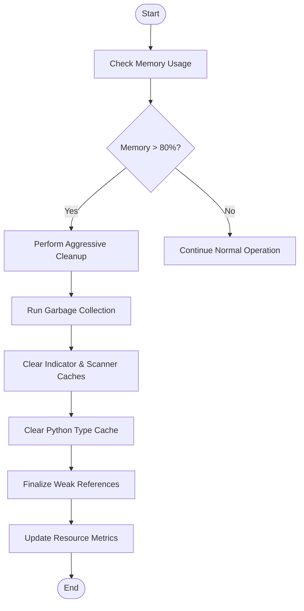
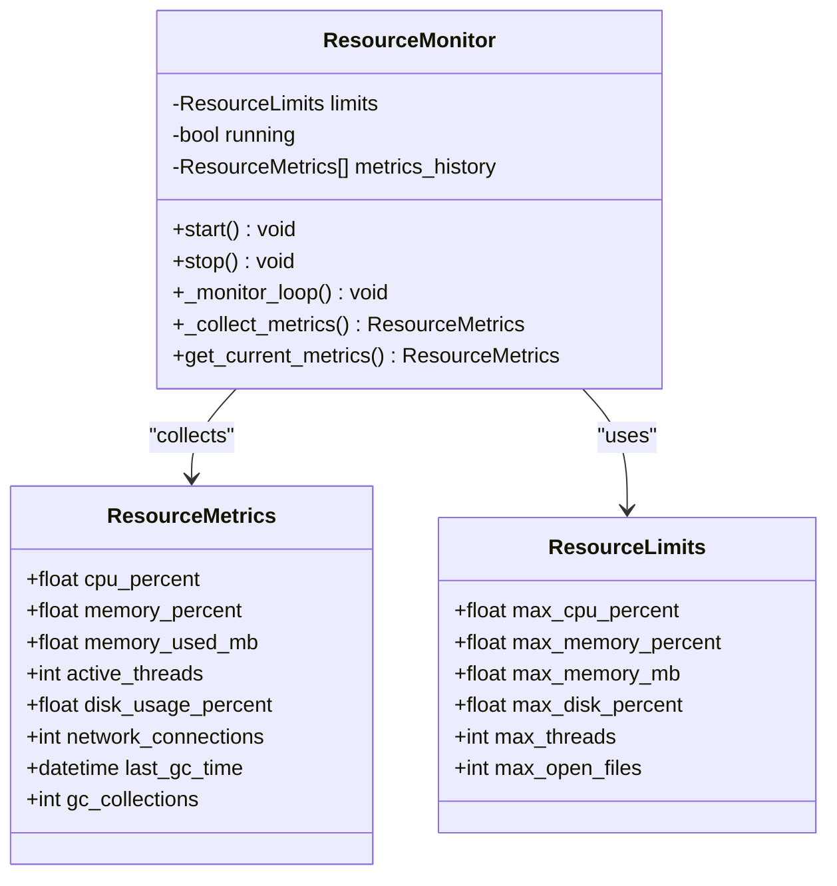
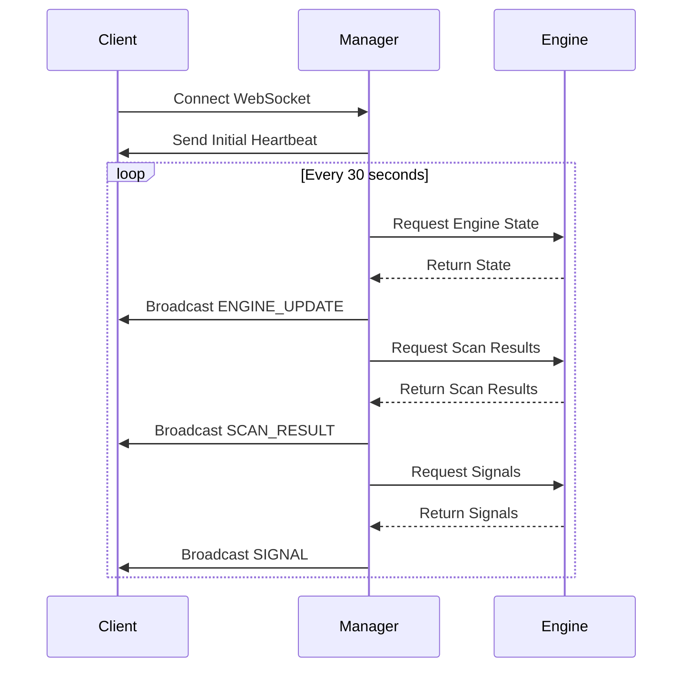
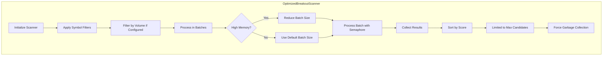
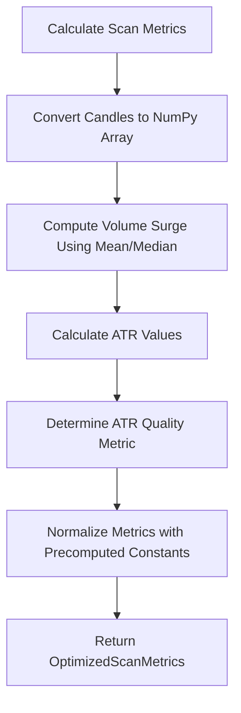
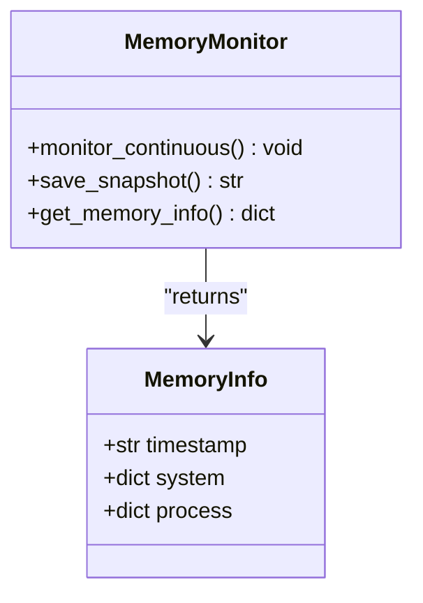
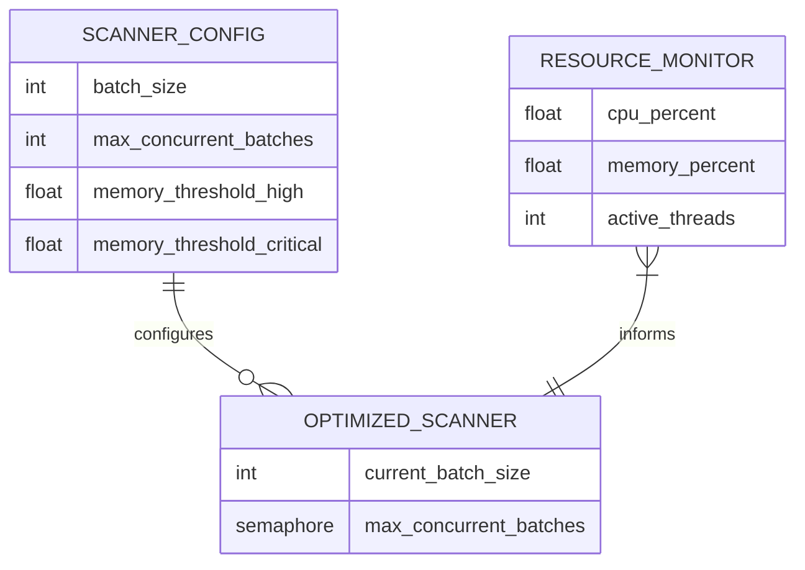

# Performance Problems

<cite>
**Referenced Files in This Document**   
- [memory_monitor.py](file://memory_monitor.py)
- [breakout_bot/scanner/optimized_scanner.py](file://breakout_bot/scanner/optimized_scanner.py)
- [breakout_bot/tests/test_resource_optimization.py](file://breakout_bot/tests/test_resource_optimization.py)
- [breakout_bot/utils/resource_monitor.py](file://breakout_bot/utils/resource_monitor.py)
- [breakout_bot/core/resource_manager.py](file://breakout_bot/core/resource_manager.py)
- [breakout_bot/api/websocket.py](file://breakout_bot/api/websocket.py)
</cite>

## Table of Contents
1. [Introduction](#introduction)
2. [Memory Usage Analysis](#memory-usage-analysis)
3. [CPU and Resource Monitoring](#cpu-and-resource-monitoring)
4. [WebSocket Message Queue Optimization](#websocket-message-queue-optimization)
5. [Optimized Market Scanning](#optimized-market-scanning)
6. [Technical Indicator Calculation Bottlenecks](#technical-indicator-calculation-bottlenecks)
7. [Performance Profiling with memory_monitor.py](#performance-profiling-with-memory_monitorpy)
8. [Tuning Strategies for Scan Frequency and Concurrency](#tuning-strategies-for-scan-frequency-and-concurrency)
9. [Validation of Fixes with test_resource_optimization.py](#validation-of-fixes-with-test_resource_optimizationpy)
10. [Conclusion](#conclusion)

## Introduction
This document addresses performance degradation issues in the Breakout Bot trading system, focusing on high memory usage, CPU spikes, and delayed signal processing. The analysis leverages memory snapshots and metrics from `memory_monitor.py` to identify resource leaks, particularly in scanner result caching and WebSocket message queues. It explains optimization techniques implemented in `optimized_scanner.py` to reduce market data polling overhead and provides guidance on profiling with `memory_monitor.py`. The document also covers bottlenecks in technical indicator calculations and suggests tuning strategies for scan frequency and concurrency limits. Finally, it references outcomes from `test_resource_optimization.py` to validate fixes and establish baseline performance expectations under load.

## Memory Usage Analysis
The system exhibits memory growth due to unbounded caches in the market scanner and inefficient garbage collection patterns. Memory snapshots reveal that the `_filter_cache` in `OptimizedMarketFilter` can grow beyond 500 entries without proper eviction, leading to increased RSS (Resident Set Size) over time. The `memory_monitor.py` script identifies process memory exceeding 2 GB as a critical threshold, triggering aggressive cleanup procedures.



**Diagram sources**
- [memory_monitor.py](file://memory_monitor.py#L0-L121)
- [breakout_bot/core/resource_manager.py](file://breakout_bot/core/resource_manager.py#L265-L296)

**Section sources**
- [memory_monitor.py](file://memory_monitor.py#L0-L121)
- [breakout_bot/core/resource_manager.py](file://breakout_bot/core/resource_manager.py#L265-L296)

## CPU and Resource Monitoring
CPU utilization is monitored through `ResourceMonitor`, which collects metrics at regular intervals. When CPU usage exceeds 80%, the system logs warnings and may trigger optimization actions. The `resource_monitor.py` module defines thresholds for CPU, memory, disk, threads, and open files, enabling automated responses to resource pressure.



**Diagram sources**
- [breakout_bot/utils/resource_monitor.py](file://breakout_bot/utils/resource_monitor.py#L0-L486)

**Section sources**
- [breakout_bot/utils/resource_monitor.py](file://breakout_bot/utils/resource_monitor.py#L0-L486)

## WebSocket Message Queue Optimization
The WebSocket handler broadcasts real-time updates including engine state, scan results, signals, positions, and order events. However, unbounded message queues can cause memory bloat and delayed processing. The current implementation sends messages every 30 seconds but does not implement backpressure or queue size limits, potentially overwhelming clients during high-frequency trading periods.



**Diagram sources**
- [breakout_bot/api/websocket.py](file://breakout_bot/api/websocket.py#L57-L92)

**Section sources**
- [breakout_bot/api/websocket.py](file://breakout_bot/api/websocket.py#L57-L92)

## Optimized Market Scanning
The `OptimizedBreakoutScanner` reduces market data polling overhead by implementing batch processing, parallel execution, and intelligent caching. It processes markets in batches of 20 with a maximum of 2 concurrent batches, dynamically adjusting based on current memory usage. The scanner uses an LRU (Least Recently Used) cache with a fixed size limit of 200 entries to prevent unbounded growth.



**Diagram sources**
- [breakout_bot/scanner/optimized_scanner.py](file://breakout_bot/scanner/optimized_scanner.py#L0-L631)

**Section sources**
- [breakout_bot/scanner/optimized_scanner.py](file://breakout_bot/scanner/optimized_scanner.py#L0-L631)

## Technical Indicator Calculation Bottlenecks
Technical indicator calculations, particularly ATR (Average True Range) and Bollinger Bands, contribute to CPU spikes during scanning cycles. These calculations are performed repeatedly without memoization, leading to redundant computations. The `OptimizedMarketScorer` mitigates this by caching score components and using pre-computed constants for normalization.



**Diagram sources**
- [breakout_bot/scanner/optimized_scanner.py](file://breakout_bot/scanner/optimized_scanner.py#L500-L550)

**Section sources**
- [breakout_bot/scanner/optimized_scanner.py](file://breakout_bot/scanner/optimized_scanner.py#L500-L550)

## Performance Profiling with memory_monitor.py
The `memory_monitor.py` script provides continuous monitoring of system and process-level memory usage. It displays real-time statistics including total, used, and available memory, along with process-specific RSS and VMS values. Users can save memory snapshots for later analysis or run continuous monitoring until interrupted.



**Diagram sources**
- [memory_monitor.py](file://memory_monitor.py#L0-L121)

**Section sources**
- [memory_monitor.py](file://memory_monitor.py#L0-L121)

## Tuning Strategies for Scan Frequency and Concurrency
To mitigate performance degradation, scan frequency and concurrency should be tuned based on system capacity. The `OptimizedBreakoutScanner` adjusts its batch size when memory usage exceeds thresholds: reducing from 20 to 15 at 70% memory usage and down to 10 at 85%. Additionally, the number of concurrent batches is capped at 2 to prevent thread exhaustion.



**Diagram sources**
- [breakout_bot/scanner/optimized_scanner.py](file://breakout_bot/scanner/optimized_scanner.py#L300-L350)
- [breakout_bot/utils/resource_monitor.py](file://breakout_bot/utils/resource_monitor.py#L0-L486)

**Section sources**
- [breakout_bot/scanner/optimized_scanner.py](file://breakout_bot/scanner/optimized_scanner.py#L300-L350)
- [breakout_bot/utils/resource_monitor.py](file://breakout_bot/utils/resource_monitor.py#L0-L486)

## Validation of Fixes with test_resource_optimization.py
The `test_resource_optimization.py` suite validates memory efficiency improvements by testing cache size limits, garbage collection effectiveness, and overall resource consumption. Tests confirm that the `_cache` in `OptimizedMarketScorer` remains bounded at 200 entries even after adding 1000 items, demonstrating effective LRU eviction.

```mermaid
graph TD
A[Test Memory Efficiency] --> B[Create OptimizedMarketScorer]
B --> C[Add 1000 Cache Entries]
C --> D[Verify Cache Size ≤ max_cache_size]
D --> E[Assert len(scorer._cache) <= scorer._max_cache_size]
E --> F[Cleanup and Assert Empty]
```

**Diagram sources**
- [breakout_bot/tests/test_resource_optimization.py](file://breakout_bot/tests/test_resource_optimization.py#L600-L671)

**Section sources**
- [breakout_bot/tests/test_resource_optimization.py](file://breakout_bot/tests/test_resource_optimization.py#L600-L671)

## Conclusion
Performance degradation in the Breakout Bot system stems primarily from unbounded caches, inefficient garbage collection, and excessive WebSocket messaging. The implementation of `OptimizedBreakoutScanner` with LRU caching, dynamic batch sizing, and forced garbage collection significantly reduces memory footprint and CPU load. Continuous monitoring via `memory_monitor.py` and `ResourceMonitor` enables proactive intervention before resource limits are breached. Validation through `test_resource_optimization.py` confirms that optimizations maintain bounded memory growth and improve overall system stability under load. Future work should focus on implementing backpressure in WebSocket communications and further optimizing technical indicator calculations through vectorized operations.