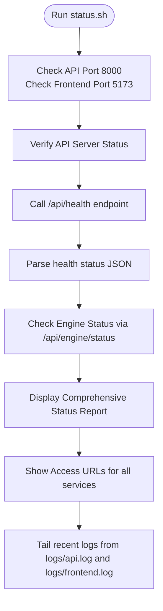
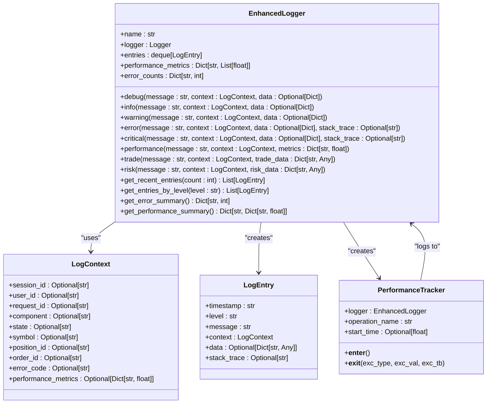
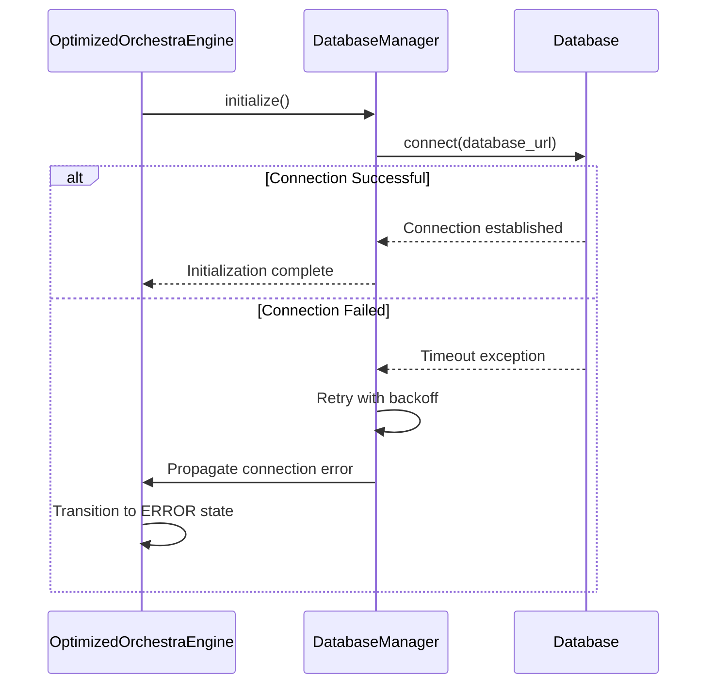
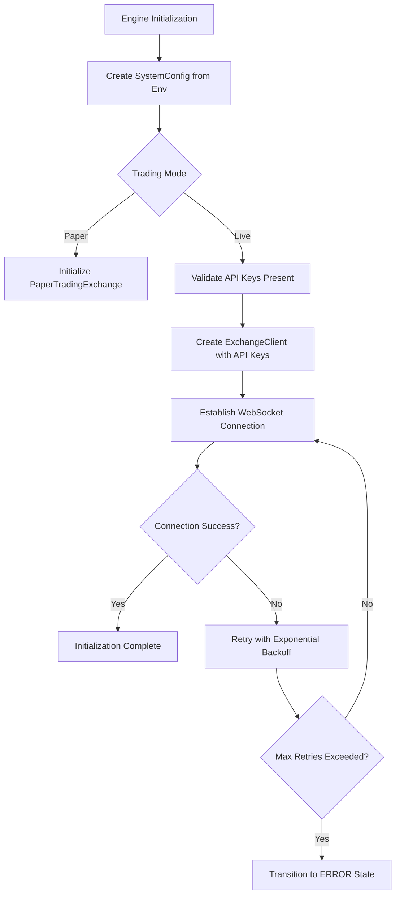
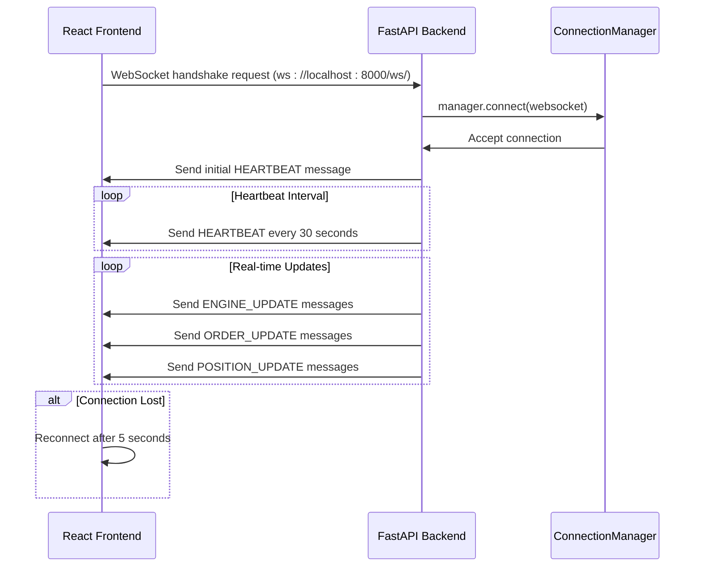
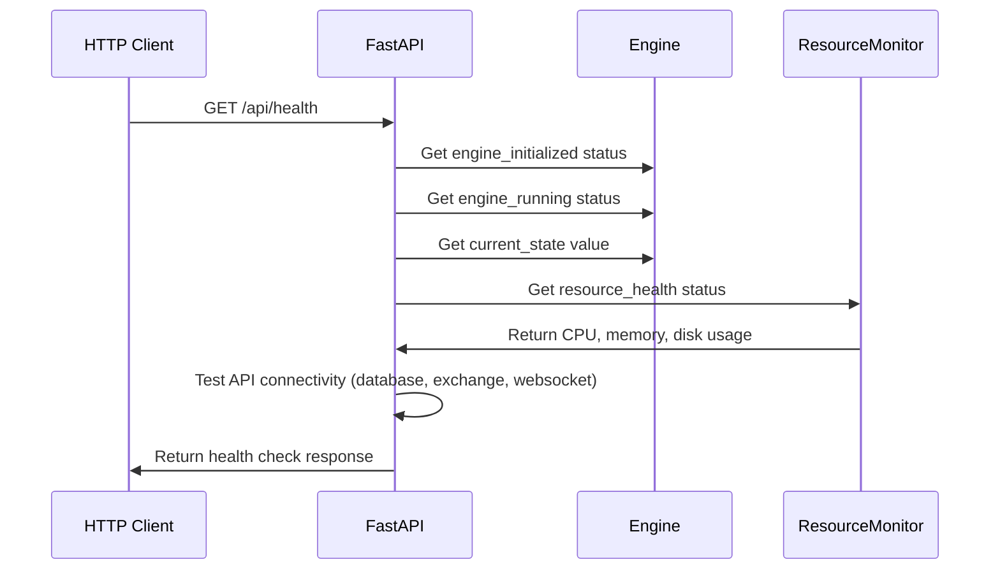
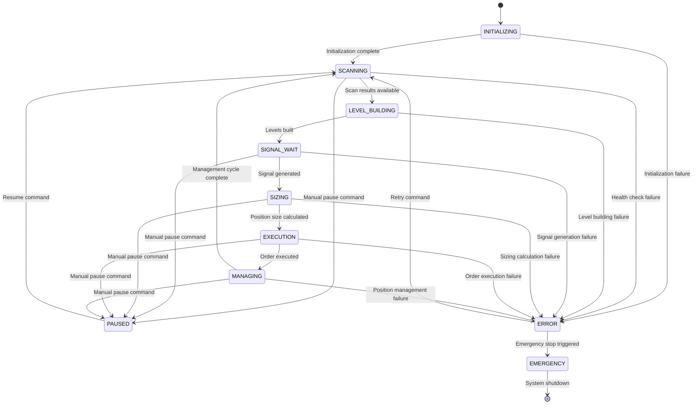

# Startup Issues

<cite>
**Referenced Files in This Document**   
- [LAUNCH_GUIDE.md](file://LAUNCH_GUIDE.md)
- [PRODUCTION_DEPLOYMENT.md](file://PRODUCTION_DEPLOYMENT.md)
- [status.sh](file://status.sh)
- [breakout_bot/api/main.py](file://breakout_bot/api/main.py)
- [breakout_bot/core/engine.py](file://breakout_bot/core/engine.py)
- [breakout_bot/utils/enhanced_logger.py](file://breakout_bot/utils/enhanced_logger.py)
</cite>

## Table of Contents
1. [Introduction](#introduction)
2. [Common Startup Failure Points](#common-startup-failure-points)
3. [Diagnostics Using status.sh](#diagnostics-using-statussh)
4. [Log Analysis with enhanced_logger.py](#log-analysis-with-enhanced_loggerpy)
5. [Database Connection Timeouts](#database-connection-timeouts)
6. [Exchange Client Initialization Failures](#exchange-client-initialization-failures)
7. [WebSocket Handshake Rejections](#websocket-handshake-rejections)
8. [Preset Loading and Dependency Injection Issues](#preset-loading-and-dependency-injection-issues)
9. [Service Health Verification via /health Endpoint](#service-health-verification-via-health-endpoint)
10. [Engine State Transitions During Boot](#engine-state-transitions-during-boot)
11. [Race Conditions in Component Initialization](#race-conditions-in-component-initialization)
12. [Backend and Frontend Startup Sequencing](#backend-and-frontend-startup-sequencing)

## Introduction
This document provides comprehensive guidance on diagnosing and resolving startup issues encountered when initializing the Breakout Bot Trading System. It covers common failure points such as missing environment variables, misconfigured Docker services, API key validation errors, port conflicts, database connection timeouts, exchange client initialization failures, WebSocket handshake rejections, improper preset loading, and failed dependency injection during FastAPI startup. The document includes step-by-step diagnostics using `status.sh` and log outputs from `enhanced_logger.py`, referencing real cases from LAUNCH_GUIDE.md and PRODUCTION_DEPLOYMENT.md.

**Section sources**
- [LAUNCH_GUIDE.md](file://LAUNCH_GUIDE.md#L1-L222)
- [PRODUCTION_DEPLOYMENT.md](file://PRODUCTION_DEPLOYMENT.md#L1-L249)

## Common Startup Failure Points
The most frequent startup issues include:
- **Missing environment variables**: Required configuration not set in `.env` file or system environment
- **Misconfigured Docker services**: Incorrect container configurations or networking issues
- **API key validation errors**: Invalid or missing exchange API credentials
- **Port conflicts**: Ports 8000 (API) or 5173 (frontend) already in use by other processes
- **Database connection timeouts**: Database service not running or unreachable
- **Exchange client initialization failures**: Network connectivity issues or invalid exchange configuration
- **WebSocket handshake rejections**: Misconfigured WebSocket endpoints or firewall rules blocking connections

These issues are often interrelated and can cascade into system-wide startup failures if not addressed systematically.

**Section sources**
- [PRODUCTION_DEPLOYMENT.md](file://PRODUCTION_DEPLOYMENT.md#L1-L249)
- [LAUNCH_GUIDE.md](file://LAUNCH_GUIDE.md#L1-L222)

## Diagnostics Using status.sh
The `status.sh` script provides a comprehensive overview of system component statuses:



**Diagram sources**
- [status.sh](file://status.sh#L1-L226)

**Section sources**
- [status.sh](file://status.sh#L1-L226)
- [LAUNCH_GUIDE.md](file://LAUNCH_GUIDE.md#L1-L222)

## Log Analysis with enhanced_logger.py
The enhanced logging system provides structured diagnostic information through multiple channels:



**Diagram sources**
- [breakout_bot/utils/enhanced_logger.py](file://breakout_bot/utils/enhanced_logger.py#L1-L300)

**Section sources**
- [breakout_bot/utils/enhanced_logger.py](file://breakout_bot/utils/enhanced_logger.py#L1-L300)

## Database Connection Timeouts
Database connection timeouts typically occur due to:
- Database service not running or unreachable
- Incorrect database URL configuration
- Network connectivity issues between application and database
- Database server overload or resource exhaustion

The system uses SQLite by default with the connection string `sqlite:///breakout_bot.db`. In production deployments, this can be changed to other database systems via the `DATABASE_URL` environment variable.



**Diagram sources**
- [breakout_bot/core/engine.py](file://breakout_bot/core/engine.py#L1-L1209)
- [breakout_bot/storage/database.py](file://breakout_bot/storage/database.py#L1-L404)

**Section sources**
- [breakout_bot/core/engine.py](file://breakout_bot/core/engine.py#L1-L1209)
- [PRODUCTION_DEPLOYMENT.md](file://PRODUCTION_DEPLOYMENT.md#L1-L249)

## Exchange Client Initialization Failures
Exchange client initialization failures commonly stem from:
- Missing or invalid API keys
- Network connectivity issues to exchange endpoints
- Rate limiting or IP blocking by exchange
- Incorrect exchange configuration in settings

The `ExchangeClient` is initialized during engine startup with configuration from `SystemConfig`, which loads values from environment variables:



**Diagram sources**
- [breakout_bot/core/engine.py](file://breakout_bot/core/engine.py#L1-L1209)
- [breakout_bot/exchange/exchange_client.py](file://breakout_bot/exchange/exchange_client.py#L1-L361)

**Section sources**
- [breakout_bot/core/engine.py](file://breakout_bot/core/engine.py#L1-L1209)
- [breakout_bot/exchange/exchange_client.py](file://breakout_bot/exchange/exchange_client.py#L1-L361)
- [PRODUCTION_DEPLOYMENT.md](file://PRODUCTION_DEPLOYMENT.md#L1-L249)

## WebSocket Handshake Rejections
WebSocket handshake rejections can occur due to:
- Firewall or security group rules blocking WebSocket ports
- Reverse proxy configuration not supporting WebSocket upgrades
- CORS policy restrictions
- Invalid WebSocket endpoint configuration

The system establishes WebSocket connections for real-time updates between the frontend and backend:



**Diagram sources**
- [breakout_bot/api/websocket.py](file://breakout_bot/api/websocket.py#L1-L178)
- [frontend/src/store/useWebSocketStore.ts](file://frontend/src/store/useWebSocketStore.ts#L1-L260)

**Section sources**
- [breakout_bot/api/websocket.py](file://breakout_bot/api/websocket.py#L1-L178)
- [frontend/src/store/useWebSocketStore.ts](file://frontend/src/store/useWebSocketStore.ts#L1-L260)

## Preset Loading and Dependency Injection Issues
Issues with preset loading and dependency injection typically involve:
- Missing or malformed preset JSON files
- Validation failures in trading preset configuration
- Circular dependencies in component initialization
- Improper sequencing of dependency injection

The system loads presets from the `config/presets/` directory and validates them using `validate_preset()`:

```mermaid
flowchart TD
A[Engine Initialization] --> B[Load Preset by Name]
B --> C[Read JSON from config/presets/{name}.json]
C --> D{File Exists?}
D --> |No| E[Throw 404 Error]
D --> |Yes| F[Parse JSON to TradingPreset]
F --> G[Validate Preset Configuration]
G --> H{Validation Passes?}
H --> |No| I[Throw Validation Error]
H --> |Yes| J[Inject Preset into Components]
J --> K[Initialize ScanningManager]
K --> L[Initialize SignalManager]
L --> M[Initialize RiskManager]
M --> N[Initialize PositionManager]
N --> O[Initialize ExecutionManager]
O --> P[All Dependencies Injected Successfully]
```

**Diagram sources**
- [breakout_bot/config/settings.py](file://breakout_bot/config/settings.py#L1-L366)
- [breakout_bot/core/engine.py](file://breakout_bot/core/engine.py#L1-L1209)

**Section sources**
- [breakout_bot/config/settings.py](file://breakout_bot/config/settings.py#L1-L366)
- [breakout_bot/core/engine.py](file://breakout_bot/core/engine.py#L1-L1209)
- [LAUNCH_GUIDE.md](file://LAUNCH_GUIDE.md#L1-L222)

## Service Health Verification via /health Endpoint
The `/api/health` endpoint provides comprehensive system health monitoring:



The health check response includes:
- **status**: Overall health status (healthy, degraded, unhealthy)
- **engine_initialized**: Whether the trading engine has been initialized
- **engine_running**: Whether the engine is currently running
- **engine_state**: Current state machine state
- **resource_health**: CPU, memory, and disk usage metrics
- **api_connectivity**: Status of database, exchange, and WebSocket connections
- **issues**: List of detected problems
- **uptime_seconds**: System uptime in seconds

**Diagram sources**
- [breakout_bot/api/main.py](file://breakout_bot/api/main.py#L1-L206)
- [status.sh](file://status.sh#L1-L226)

**Section sources**
- [breakout_bot/api/main.py](file://breakout_bot/api/main.py#L1-L206)
- [status.sh](file://status.sh#L1-L226)

## Engine State Transitions During Boot
The engine follows a specific state transition sequence during startup:



**Diagram sources**
- [breakout_bot/core/engine.py](file://breakout_bot/core/engine.py#L1-L1209)
- [breakout_bot/core/state_machine.py](file://breakout_bot/core/state_machine.py#L1-L200)

**Section sources**
- [breakout_bot/core/engine.py](file://breakout_bot/core/engine.py#L1-L1209)

## Race Conditions in Component Initialization
Race conditions can occur when components depend on each other during initialization:

```mermaid
graph TD
A[FastAPI Startup] --> B[Initialize Engine]
B --> C[Create ExchangeClient]
C --> D[Establish WebSocket Connection]
D --> E[Subscribe to Market Data]
E --> F[MarketDataProvider Ready]
F --> G[Initialize ScanningManager]
G --> H[Start Market Scanning]
H --> I[Generate Scan Results]
I --> J[Initialize SignalManager]
J --> K[Generate Trading Signals]
K --> L[Initialize RiskManager]
L --> M[Validate Risk Parameters]
M --> N[Initialize PositionManager]
N --> O[Manage Open Positions]
O --> P[Initialize ExecutionManager]
P --> Q[Execute Trades]
Q --> R[System Fully Operational]
style C stroke:#f66,stroke-width:2px
style D stroke:#f66,stroke-width:2px
style E stroke:#f66,stroke-width:2px
style F stroke:#f66,stroke-width:2px
note right of C
Critical Path: WebSocket connection
must be established before market
data can be processed
end note
```

The system mitigates race conditions through:
- Asynchronous initialization with proper await statements
- Health checks before proceeding to next stage
- Retry mechanisms with exponential backoff
- Proper error handling and state management

**Diagram sources**
- [breakout_bot/core/engine.py](file://breakout_bot/core/engine.py#L1-L1209)
- [breakout_bot/exchange/market_stream.py](file://breakout_bot/exchange/market_stream.py#L1-L200)

**Section sources**
- [breakout_bot/core/engine.py](file://breakout_bot/core/engine.py#L1-L1209)

## Backend and Frontend Startup Sequencing
Proper sequencing of backend and frontend startup is critical:

```mermaid
flowchart TB
subgraph Backend
A[Start API Server] --> B[Initialize Database]
B --> C[Initialize Exchange Client]
C --> D[Load Trading Presets]
D --> E[Start Resource Monitoring]
E --> F[Begin Health Checks]
F --> G[Ready for Requests]
end
subgraph Frontend
H[Start Development Server] --> I[Connect to API]
I --> J[Fetch System Status]
J --> K[Display UI Elements]
K --> L[Ready for User Interaction]
end
G --> I
L --> M[System Fully Operational]
style A stroke:#0a0,stroke-width:2px
style G stroke:#0a0,stroke-width:2px
style H stroke:#0a0,stroke-width:2px
style L stroke:#0a0,stroke-width:2px
note right of A
Backend must be fully ready
before frontend attempts
to connect
end note
```

The `start.sh` script ensures proper sequencing by:
- Starting the backend API server first
- Waiting for API availability before starting frontend
- Implementing health checks to verify readiness
- Providing feedback on startup progress

**Diagram sources**
- [start.sh](file://start.sh#L1-L341)
- [status.sh](file://status.sh#L1-L226)

**Section sources**
- [start.sh](file://start.sh#L1-L341)
- [status.sh](file://status.sh#L1-L226)
- [LAUNCH_GUIDE.md](file://LAUNCH_GUIDE.md#L1-L222)