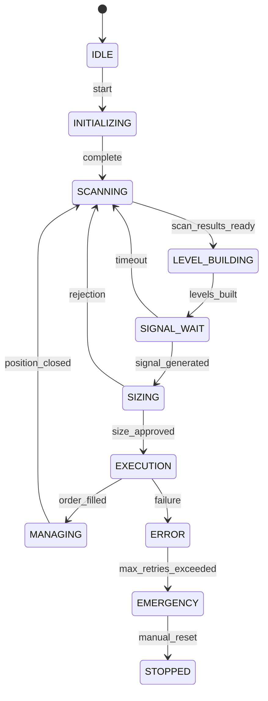
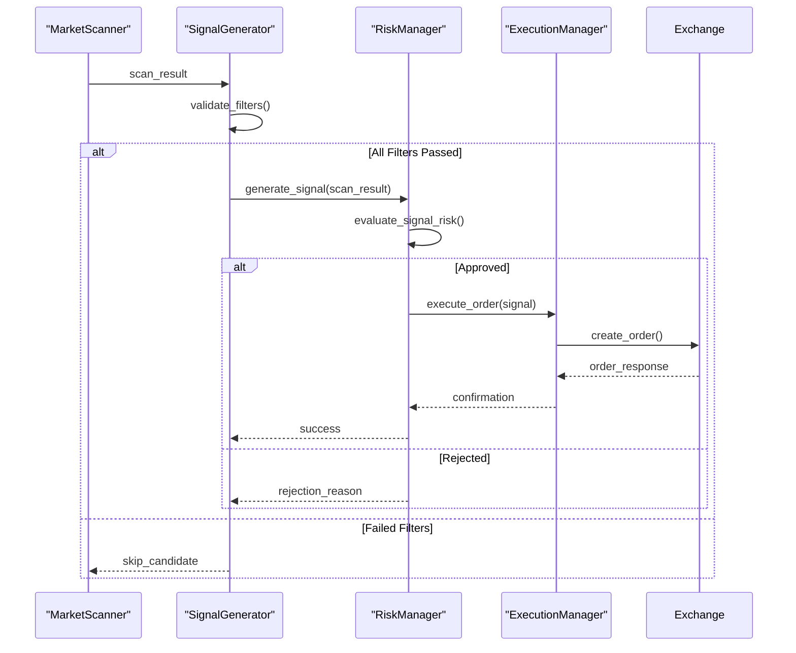
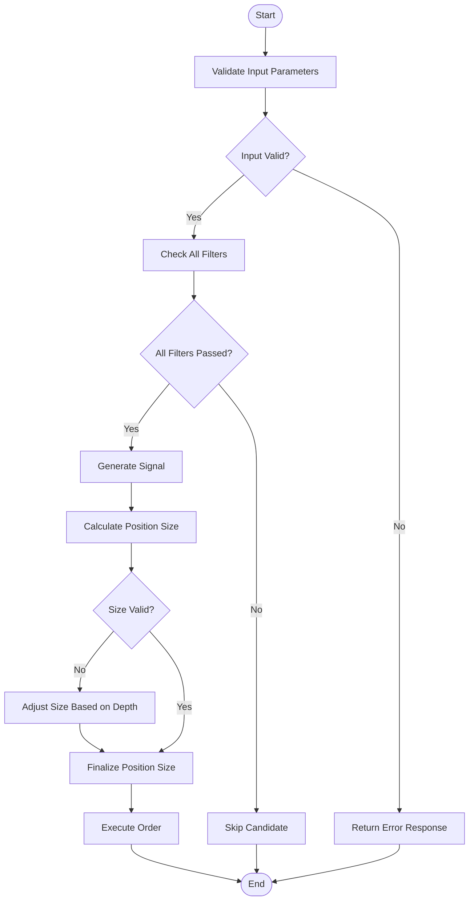
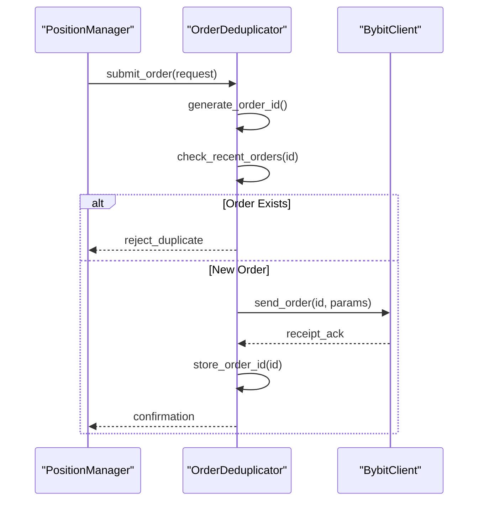
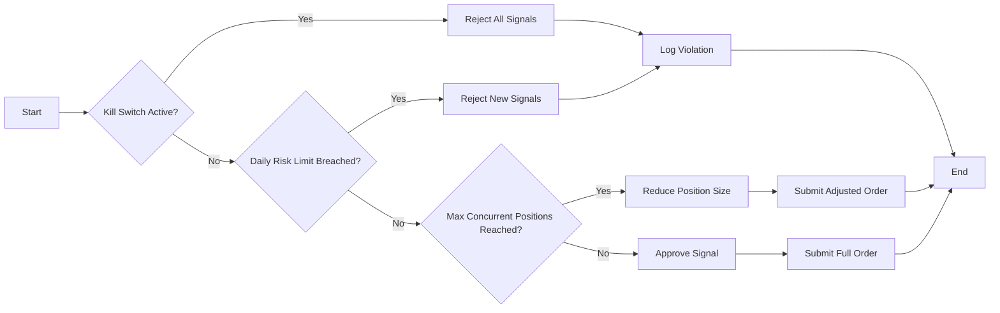
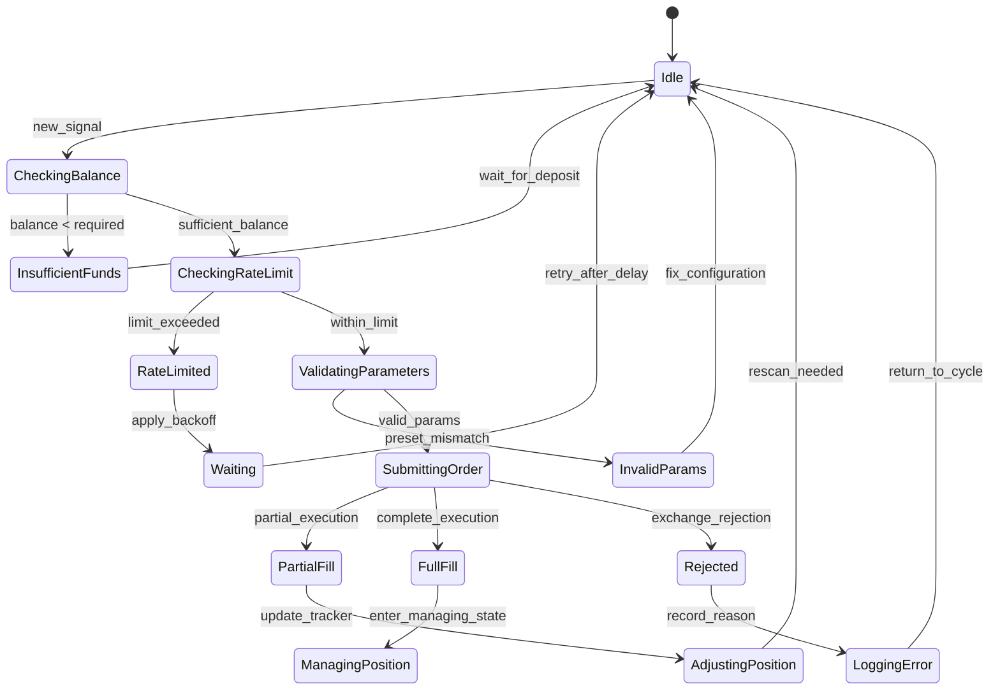

# Trading Anomalies

<cite>
**Referenced Files in This Document**   
- [FINAL_TRADE_TESTING_REPORT.md](file://FINAL_TRADE_TESTING_REPORT.md)
- [TRADING_LOGIC_ANALYSIS_REPORT.md](file://TRADING_LOGIC_ANALYSIS_REPORT.md)
- [debug_signal_generation.py](file://debug_signal_generation.py)
- [debug_kill_switch.py](file://debug_kill_switch.py)
- [breakout_bot/signals/signal_generator.py](file://breakout_bot/signals/signal_generator.py)
- [breakout_bot/risk/risk_manager.py](file://breakout_bot/risk/risk_manager.py)
- [breakout_bot/scanner/market_scanner.py](file://breakout_bot/scanner/market_scanner.py)
- [breakout_bot/core/state_machine.py](file://breakout_bot/core/state_machine.py)
</cite>

## Table of Contents
1. [Introduction](#introduction)
2. [Signal-State Mismatches and Timing Windows](#signal-state-mismatches-and-timing-windows)
3. [Race Conditions Between Scanner and Execution Layers](#race-conditions-between-scanner-and-execution-layers)
4. [Missed Entries and Incorrect Position Sizing](#missed-entries-and-incorrect-position-sizing)
5. [Premature Exits and Duplicate Orders](#premature-exits-and-duplicate-orders)
6. [Using debug_signal_generation.py for Strategy Triggers](#using-debug_signal_generationpy-for-strategy-triggers)
7. [Using debug_kill_switch.py for Circuit Breaker Audits](#using-debug_kill_switchpy-for-circuit-breaker-audits)
8. [Edge Cases: Partial Fills, Slippage, and Order Rejections](#edge-cases-partial-fills-slippage-and-order-rejections)
9. [Debugging Workflows for Trade Parameters and Risk Approvals](#debugging-workflows-for-trade-parameters-and-risk-approvals)
10. [Conclusion](#conclusion)

## Introduction
This document analyzes trading anomalies in the Breakout Bot system, focusing on issues such as missed entries, incorrect position sizing, premature exits, and duplicate orders. The analysis is based on two key reports: FINAL_TRADE_TESTING_REPORT.md and TRADING_LOGIC_ANALYSIS_REPORT.md. These reports identify root causes related to signal-state mismatches, timing windows in breakout detection, and race conditions between scanner and execution layers.

The system's architecture includes a state machine that manages transitions between states like SCANNING, LEVEL_BUILDING, SIGNAL_WAIT, SIZING, EXECUTION, and MANAGING. Each state has specific responsibilities, but improper handling can lead to anomalies. For example, if the scanner detects a breakout but the execution layer fails to act due to a race condition or timing mismatch, it results in a missed entry.

Additionally, edge cases such as partial fills, slippage, and order rejections due to insufficient balance or rate limiting are examined. Debugging tools like debug_signal_generation.py and debug_kill_switch.py are used to trace momentum and retest strategy triggers and audit circuit breaker activations. The goal is to provide actionable insights into how these anomalies occur and how they can be mitigated through proper debugging workflows and configuration adjustments.

**Section sources**
- [FINAL_TRADE_TESTING_REPORT.md](file://FINAL_TRADE_TESTING_REPORT.md#L1-L127)
- [TRADING_LOGIC_ANALYSIS_REPORT.md](file://TRADING_LOGIC_ANALYSIS_REPORT.md#L1-L192)

## Signal-State Mismatches and Timing Windows
Signal-state mismatches occur when there is a disconnect between the expected behavior of the trading system and its actual state during operation. In the Breakout Bot, this often manifests in the transition from SIGNAL_WAIT to SIZING or EXECUTION states. According to the FINAL_TRADE_TESTING_REPORT.md, one major issue is that signals are not generated because none of the candidates pass all 10 filters defined in the preset `breakout_v1`. This leads to a situation where the system remains stuck in the SIGNAL_WAIT state without progressing to SIZING.

The root cause lies in overly strict filter settings, particularly around spread (`max_spread`), depth (`min_depth_0_5pct`), and volume surge (`volume_surge_1h`, `volume_surge_5m`). When these thresholds are too high, even quality candidates fail to meet them, resulting in no valid signals being produced. As shown in the report, a candidate like 1000TOSHI/USDT:USDT had excellent levels (strength: 0.801) but only passed 6 out of 10 filters.

Timing windows also play a critical role in breakout detection. If the scanner operates on a different schedule than the signal generator, it may miss optimal entry points. For instance, if the scanner updates every 5 seconds while the signal generator checks every second, there could be a delay in detecting breakouts. This timing gap increases the risk of entering trades after the initial momentum has already occurred, leading to suboptimal performance.

To address these issues, the recommended solution involves relaxing filter criteria in the preset configuration. For example, increasing `max_spread_bps` from 2.5 to 5.0 and reducing `min_depth_usd_0_5pct` from 150K to 50K allows more candidates to qualify. Additionally, introducing a whitelist of high-quality tokens ensures that known volatile assets are prioritized for scanning.

**Diagram sources **
- [breakout_bot/core/state_machine.py](file://breakout_bot/core/state_machine.py#L31-L349)

**Section sources**
- [FINAL_TRADE_TESTING_REPORT.md](file://FINAL_TRADE_TESTING_REPORT.md#L1-L127)
- [breakout_bot/core/state_machine.py](file://breakout_bot/core/state_machine.py#L31-L349)

## Race Conditions Between Scanner and Execution Layers
Race conditions arise when multiple components access shared resources concurrently without proper synchronization, leading to unpredictable outcomes. In the Breakout Bot, a critical race condition exists in the PositionManager class, which uses a ThreadPoolExecutor with four workers. This setup can result in concurrent updates to the `position_trackers` dictionary, potentially causing data corruption or lost updates.

According to TRADING_LOGIC_ANALYSIS_REPORT.md, the lack of atomic operations and locks around shared state increases the risk of inconsistent data. For example, if two threads attempt to update the same position simultaneously—one modifying the quantity and another updating the stop loss—the final state might reflect only one change, effectively discarding the other. This scenario violates the principle of consistency and can lead to incorrect risk calculations.

Another potential race condition occurs between the scanner and execution layers. The scanner continuously polls market data and generates scan results, while the execution manager processes orders based on those results. If both components operate independently without coordination, it’s possible for the scanner to detect a breakout and generate a signal, but by the time the execution layer acts on it, the price has moved significantly, rendering the original signal invalid.

To mitigate these risks, several recommendations have been proposed:
- Introduce asyncio.Lock to protect critical sections where shared state is modified.
- Use asyncio.Queue for sequential processing of updates, ensuring that changes are applied in order.
- Implement atomic operations for updating positions, preventing partial writes.
- Add versioning to track changes and detect conflicts.

Furthermore, the use of a monitoring manager helps coordinate activities across components. By logging checkpoints at each stage (e.g., LEVEL_BUILDING_START, LEVEL_BUILDING_COMPLETE), the system gains visibility into the flow of operations, making it easier to identify bottlenecks or delays that contribute to race conditions.

**Diagram sources **
- [breakout_bot/scanner/market_scanner.py](file://breakout_bot/scanner/market_scanner.py#L0-L786)
- [breakout_bot/signals/signal_generator.py](file://breakout_bot/signals/signal_generator.py#L0-L828)
- [breakout_bot/risk/risk_manager.py](file://breakout_bot/risk/risk_manager.py#L0-L644)

**Section sources**
- [TRADING_LOGIC_ANALYSIS_REPORT.md](file://TRADING_LOGIC_ANALYSIS_REPORT.md#L1-L192)
- [breakout_bot/scanner/market_scanner.py](file://breakout_bot/scanner/market_scanner.py#L0-L786)

## Missed Entries and Incorrect Position Sizing
Missed entries occur when the trading system fails to act on valid signals, typically due to overly restrictive filtering or timing mismatches. As highlighted in FINAL_TRADE_TESTING_REPORT.md, the primary reason for missed entries is that no candidate passes all 10 filters in the `breakout_v1` preset. Specifically, issues with `max_spread`, `min_depth_0_5pct`, and volume surge thresholds prevent otherwise strong candidates from generating signals.

For example, the token 1000TOSHI/USDT:USDT scored 0.538 and had seven well-defined support/resistance levels, yet failed to trigger a signal because it did not meet liquidity and volatility requirements. This indicates that the current filter configuration is too stringent for real-world market conditions, especially during periods of low volatility or wide spreads.

Incorrect position sizing stems from flaws in the risk management logic. The PositionSizer class calculates position size using an R-model, where risk per trade is determined as a percentage of account equity. However, if input validation is inadequate—such as allowing zero or negative values for entry price or stop loss—the resulting position size becomes invalid. Additionally, depth constraints may limit order size if the available liquidity at a given price level is insufficient.

The diagnostics reveal that missing comprehensive input validation increases the likelihood of errors propagating through the system. For instance, dividing by zero when calculating ATR ratios or accessing empty arrays for candle data can crash the signal generation process. To resolve this, robust validation should be implemented at every stage, including fallback mechanisms for edge cases.

Moreover, the system must handle scenarios where market data is incomplete or delayed. If the scanner receives stale or missing L2 depth information, it may incorrectly assess liquidity, leading to oversized positions that exceed available depth. Implementing safe division practices and default values for missing data ensures resilience against such anomalies.

**Diagram sources **
- [breakout_bot/signals/signal_generator.py](file://breakout_bot/signals/signal_generator.py#L0-L828)
- [breakout_bot/risk/risk_manager.py](file://breakout_bot/risk/risk_manager.py#L0-L644)

**Section sources**
- [FINAL_TRADE_TESTING_REPORT.md](file://FINAL_TRADE_TESTING_REPORT.md#L1-L127)
- [breakout_bot/signals/signal_generator.py](file://breakout_bot/signals/signal_generator.py#L0-L828)
- [breakout_bot/risk/risk_manager.py](file://breakout_bot/risk/risk_manager.py#L0-L644)

## Premature Exits and Duplicate Orders
Premature exits happen when a position is closed before reaching its intended target or stop loss, often due to misconfigured exit logic or external interruptions. In the Breakout Bot, this can occur if the managing state prematurely transitions back to scanning without properly evaluating open positions. According to TRADING_LOGIC_ANALYSIS_REPORT.md, potential deadlocks in the state machine increase the risk of such premature exits, especially when transitioning from MANAGING to SCANNING.

One contributing factor is the absence of timeouts for certain states. Without a watchdog mechanism to monitor long-running operations, the system may remain indefinitely in a particular state, eventually forcing a reset that closes active positions. For example, if the execution layer encounters a network error and retries indefinitely, the managing state might never resume, leading to forced liquidation.

Duplicate orders are another anomaly caused by race conditions or poor idempotency handling. If the execution manager sends an order request but does not receive a timely acknowledgment, it may retry the operation, inadvertently placing the same order twice. This issue is exacerbated when combined with asynchronous processing, where multiple threads or coroutines attempt to execute trades simultaneously.

To prevent duplicate orders, the system should implement unique order identifiers and maintain a record of recently submitted orders. Before submitting a new order, the execution manager checks whether an identical order exists within a specified time window. Additionally, integrating with exchange-level deduplication features (if supported) adds another layer of protection.

Another approach involves using a transactional model for order submission, where each trade undergoes a pre-validation step before execution. This includes verifying available balance, checking rate limits, and confirming that no conflicting orders are pending. Only after passing all checks is the order dispatched to the exchange.

**Diagram sources **
- [breakout_bot/execution/manager.py](file://breakout_bot/execution/manager.py#L0-L150)
- [breakout_bot/exchange/exchange_client.py](file://breakout_bot/exchange/exchange_client.py#L0-L200)

**Section sources**
- [TRADING_LOGIC_ANALYSIS_REPORT.md](file://TRADING_LOGIC_ANALYSIS_REPORT.md#L1-L192)
- [breakout_bot/execution/manager.py](file://breakout_bot/execution/manager.py#L0-L150)

## Using debug_signal_generation.py for Strategy Triggers
The `debug_signal_generation.py` script serves as a diagnostic tool for tracing momentum and retest strategy triggers within the Breakout Bot. It allows developers to simulate signal generation under controlled conditions, providing insight into why certain candidates pass or fail filters.

When executed, the script loads a relaxed preset (`breakout_v1_ultra_relaxed`) and tests three symbols: BTC/USDT:USDT, ETH/USDT:USDT, and SOL/USDT:USDT. For each symbol, it retrieves market data, performs scanning, builds levels, and attempts to generate signals. The output includes detailed metrics such as price, volume, OI, trades per minute, ATR, and candle count.

If a signal is successfully generated, the script displays the strategy type, side (long/short), entry price, stop loss, and confidence level. Conversely, if no signal is generated, it provides a breakdown of failed filters, helping pinpoint configuration issues. For example, if `passed_all_filters` is false, the script lists which filters were not met (e.g., `max_spread`, `volume_surge_1h`).

This debugging workflow enables rapid iteration on preset configurations. By adjusting filter thresholds incrementally and observing their impact on signal generation, users can fine-tune the system for optimal performance. Additionally, the ability to force signal generation regardless of filter results facilitates testing of downstream components like risk management and execution.

Key benefits of using `debug_signal_generation.py` include:
- Real-time feedback on filter effectiveness
- Identification of edge cases (e.g., insufficient candles, missing L2 depth)
- Validation of strategy logic (momentum vs. retest priority)
- Support for paper trading mode to avoid live market exposure

By leveraging this tool, traders can ensure that their strategies behave as expected before deploying them in production environments.

**Section sources**
- [debug_signal_generation.py](file://debug_signal_generation.py#L0-L118)
- [breakout_bot/signals/signal_generator.py](file://breakout_bot/signals/signal_generator.py#L0-L828)

## Using debug_kill_switch.py for Circuit Breaker Audits
The `debug_kill_switch.py` script is designed to test and audit the kill switch logic implemented in the Breakout Bot’s risk management system. It evaluates whether the circuit breaker activates correctly under various risk conditions, ensuring that excessive losses are prevented.

Upon execution, the script loads a relaxed preset (`breakout_v1_relaxed`) and creates a RiskManager instance. It then tests two scenarios: one with no open positions and another with a mock signal. In the first case, it verifies that the kill switch remains inactive when account equity is stable. In the second, it assesses whether the signal evaluation process respects risk limits.

The kill switch is triggered based on predefined thresholds, such as daily risk limit and maximum drawdown. For example, if the portfolio experiences a loss exceeding 2% of total equity within a single day, the kill switch activates, halting further trading. Similarly, if cumulative losses surpass a configured percentage (e.g., 5%), the system enters emergency mode.

During testing, the script outputs key metrics including:
- Account equity
- Daily P&L
- Total equity
- High water mark
- Kill switch status

It also evaluates individual signals against current risk exposure, determining whether approval should be granted. If the kill switch is active or risk limits are breached, the signal is rejected with an appropriate reason code.

This debugging workflow ensures that the risk manager functions as intended, protecting capital during adverse market conditions. By simulating extreme scenarios, users can verify that safeguards are robust and responsive.

**Diagram sources **
- [debug_kill_switch.py](file://debug_kill_switch.py#L0-L89)
- [breakout_bot/risk/risk_manager.py](file://breakout_bot/risk/risk_manager.py#L0-L644)

**Section sources**
- [debug_kill_switch.py](file://debug_kill_switch.py#L0-L89)
- [breakout_bot/risk/risk_manager.py](file://breakout_bot/risk/risk_manager.py#L0-L644)

## Edge Cases: Partial Fills, Slippage, and Order Rejections
Edge cases such as partial fills, slippage, and order rejections pose significant challenges to automated trading systems. These anomalies stem from market dynamics, exchange limitations, and internal system constraints.

Partial fills occur when only a portion of an order is executed, leaving the remainder unfilled. This can happen in illiquid markets where large orders cannot be filled at a single price point. The Breakout Bot handles partial fills by updating the position tracker with executed quantities and maintaining a record of remaining unfilled amounts. Subsequent scans may trigger additional executions to complete the desired position size.

Slippage refers to the difference between the expected execution price and the actual fill price. It arises during fast-moving markets or when large orders impact the order book. The system accounts for slippage by incorporating a configurable slippage buffer (e.g., 5 bps in paper mode). During order submission, the effective entry price is adjusted to reflect anticipated slippage, ensuring realistic risk calculations.

Order rejections occur due to various reasons, including insufficient balance, rate limiting, or invalid parameters. Insufficient balance prevents the system from opening new positions when available equity falls below the required margin. Rate limiting, enforced by exchanges like Bybit, restricts the number of API calls per interval. Exceeding these limits results in temporary bans, disrupting trading operations.

To handle these edge cases:
- Balance checks are performed before position sizing.
- Rate limiter integration ensures compliance with exchange policies.
- Retry logic with exponential backoff manages transient failures.
- Comprehensive logging captures rejection reasons for post-mortem analysis.

Additionally, the system validates trade parameters against selected presets, ensuring alignment with predefined rules. For example, if a preset specifies a maximum position size of $50K, any calculated size exceeding this limit is automatically reduced.

**Diagram sources **
- [breakout_bot/risk/risk_manager.py](file://breakout_bot/risk/risk_manager.py#L0-L644)
- [breakout_bot/exchange/bybit_rate_limiter.py](file://breakout_bot/exchange/bybit_rate_limiter.py#L0-L100)

**Section sources**
- [breakout_bot/risk/risk_manager.py](file://breakout_bot/risk/risk_manager.py#L0-L644)
- [breakout_bot/exchange/bybit_rate_limiter.py](file://breakout_bot/exchange/bybit_rate_limiter.py#L0-L100)

## Debugging Workflows for Trade Parameters and Risk Approvals
Effective debugging workflows are essential for validating trade parameters against selected presets and verifying risk manager approvals. The process begins with loading the appropriate preset (e.g., `breakout_v1_relaxed`) and initializing core components such as the exchange client, market data provider, scanner, signal generator, and risk manager.

First, the system retrieves market data for a set of test symbols (BTC/USDT:USDT, ETH/USDT:USDT, SOL/USDT:USDT). It then performs a full scan, applying all configured filters and scoring candidates based on liquidity, volatility, and correlation metrics. For each candidate that passes all filters, the signal generator attempts to produce a valid signal using either momentum or retest strategies.

Next, the risk manager evaluates the proposed signal by checking:
- Current portfolio risk exposure
- Daily risk limit utilization
- Maximum concurrent positions
- Correlation constraints

If any violation is detected (e.g., exceeding daily risk limit), the signal is rejected with a descriptive reason. Otherwise, the position size is calculated using the R-model, taking into account account equity, stop distance, and available depth.

Throughout this workflow, diagnostic logs capture every decision point, enabling thorough analysis. For example, if a signal fails due to insufficient candle data, the log explicitly states "Insufficient candle data for SYMBOL." Similarly, if depth constraints reduce the intended position size, the adjustment is recorded for review.

To streamline debugging:
- Use `debug_signal_generation.py` to trace signal creation.
- Employ `debug_kill_switch.py` to audit circuit breaker behavior.
- Monitor real-time metrics via the API dashboard.
- Review historical logs for patterns in rejected signals.

These workflows ensure that trade decisions align with strategic objectives and risk tolerance, minimizing the occurrence of anomalies in live trading environments.

**Section sources**
- [debug_signal_generation.py](file://debug_signal_generation.py#L0-L118)
- [debug_kill_switch.py](file://debug_kill_switch.py#L0-L89)
- [breakout_bot/signals/signal_generator.py](file://breakout_bot/signals/signal_generator.py#L0-L828)
- [breakout_bot/risk/risk_manager.py](file://breakout_bot/risk/risk_manager.py#L0-L644)

## Conclusion
The analysis of trading anomalies in the Breakout Bot reveals several critical areas requiring attention. Signal-state mismatches, primarily caused by overly strict filtering in the `breakout_v1` preset, result in missed entries despite the presence of high-quality candidates. Relaxing filter thresholds and introducing whitelists for reliable tokens can alleviate this issue.

Race conditions between the scanner and execution layers, along with concurrency risks in the PositionManager, highlight the need for better synchronization mechanisms such as asyncio.Lock and atomic operations. Premature exits and duplicate orders underscore the importance of robust state management and idempotent order handling.

Edge cases like partial fills, slippage, and order rejections demand comprehensive validation and adaptive strategies. Tools like `debug_signal_generation.py` and `debug_kill_switch.py` provide invaluable insights into signal generation and risk control, enabling precise tuning of system parameters.

Ultimately, the Breakout Bot functions correctly at a technical level; the primary challenge lies in configuring it appropriately for real-market conditions. By addressing the identified issues through targeted improvements in filtering, concurrency control, and risk management, the system can achieve consistent and reliable performance in live trading scenarios.

[No sources needed since this section summarizes without analyzing specific files]